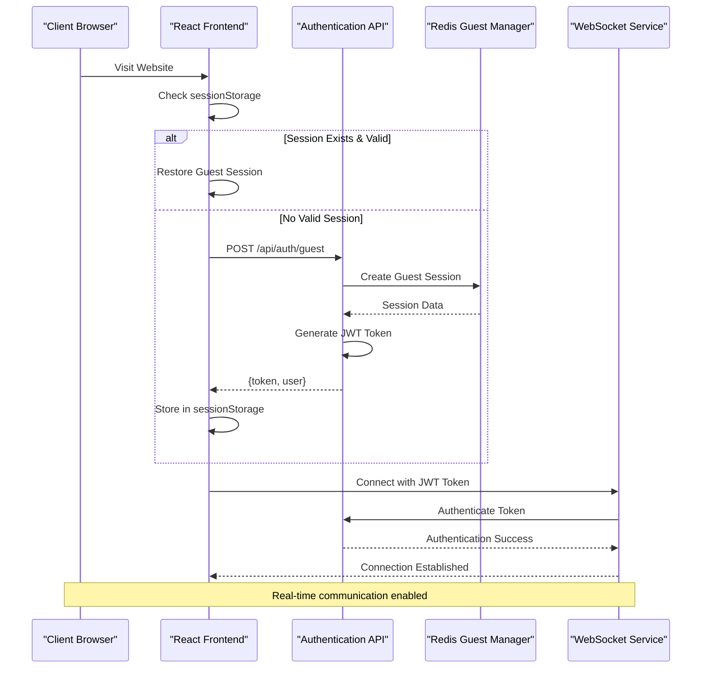
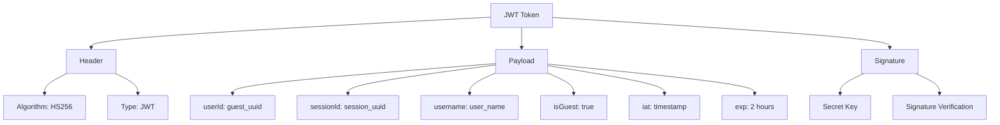
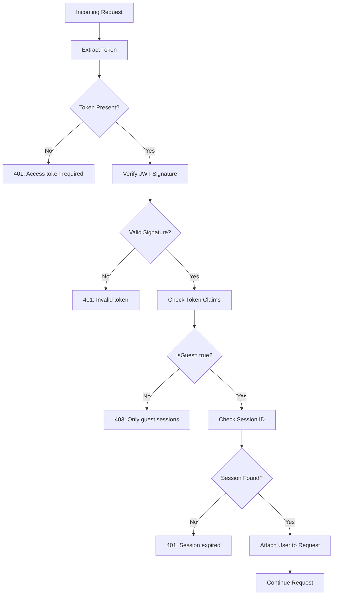
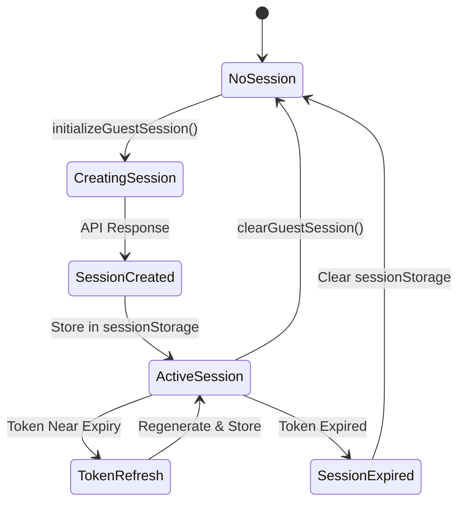

# Authentication API Documentation

<cite>
**Referenced Files in This Document**
- [backend/src/routes/auth.js](file://backend/src/routes/auth.js)
- [backend/src/controllers/guestController.js](file://backend/src/controllers/guestController.js)
- [backend/src/middleware/auth.js](file://backend/src/middleware/auth.js)
- [backend/src/middleware/security.js](file://backend/src/middleware/security.js)
- [backend/src/middleware/validation.js](file://backend/src/middleware/validation.js)
- [backend/src/utils/jwt.js](file://backend/src/utils/jwt.js)
- [backend/src/utils/redisGuestManager.js](file://backend/src/utils/redisGuestManager.js)
- [web/lib/api.ts](file://web/lib/api.ts)
- [web/contexts/GuestSessionContext.tsx](file://web/contexts/GuestSessionContext.tsx)
- [web/lib/socket.ts](file://web/lib/socket.ts)
</cite>

## Table of Contents
1. [Introduction](#introduction)
2. [Authentication Flow Overview](#authentication-flow-overview)
3. [API Endpoints](#api-endpoints)
4. [Token-Based Authentication](#token-based-authentication)
5. [Session Management](#session-management)
6. [Error Responses](#error-responses)
7. [CORS and Rate Limiting](#cors-and-rate-limiting)
8. [Frontend Integration](#frontend-integration)
9. [Security Features](#security-features)
10. [Troubleshooting](#troubleshooting)

## Introduction

The Authentication API provides a comprehensive guest session management system for anonymous users in the Realtime Chat Application. The system implements token-based authentication using JWT (JSON Web Tokens) with automatic session persistence through sessionStorage and intelligent token refresh mechanisms.

The authentication system supports:
- Guest session creation with optional username customization
- Automatic token expiration and renewal
- Real-time presence management via WebSocket connections
- Comprehensive security measures including rate limiting and CORS protection
- Seamless session restoration across browser sessions

## Authentication Flow Overview

The authentication system follows a structured flow that ensures secure and reliable guest session management:



**Diagram sources**
- [web/contexts/GuestSessionContext.tsx](file://web/contexts/GuestSessionContext.tsx#L150-L220)
- [backend/src/controllers/guestController.js](file://backend/src/controllers/guestController.js#L20-L60)
- [web/lib/socket.ts](file://web/lib/socket.ts#L20-L50)

## API Endpoints

### POST /api/auth/guest

Creates a new guest session and returns a JWT token for authentication.

**Endpoint**: `POST /api/auth/guest`

**Authentication**: None (Public endpoint)

**Request Body**:
```json
{
  "username": "string",      // Optional: Custom username (3-20 chars, letters, numbers, underscore)
  "location": {             // Optional: Geographic location data
    "country": "string",
    "region": "string",
    "city": "string"
  },
  "gender": "string",       // Optional: User gender
  "language": "string"      // Optional: Preferred language
}
```

**Response**:
```json
{
  "success": true,
  "message": "Guest session created successfully",
  "data": {
    "token": "eyJhbGciOiJIUzI1NiIsInR5cCI6IkpXVCJ9...",
    "user": {
      "id": "guest_uuid_v4",
      "username": "CoolPanda1234",
      "isGuest": true,
      "sessionId": "session_uuid_v4",
      "location": {
        "country": "US",
        "region": "CA",
        "city": "San Francisco"
      },
      "gender": "male",
      "language": "en",
      "createdAt": "2024-01-01T00:00:00.000Z"
    }
  }
}
```

**HTTP Status Codes**:
- `201 Created`: Session created successfully
- `400 Bad Request`: Invalid request parameters
- `500 Internal Server Error`: Server error

**Section sources**
- [backend/src/routes/auth.js](file://backend/src/routes/auth.js#L30-L35)
- [backend/src/controllers/guestController.js](file://backend/src/controllers/guestController.js#L20-L60)

### GET /api/auth/guest/username

Generates a random username for guest users.

**Endpoint**: `GET /api/auth/guest/username`

**Authentication**: None (Public endpoint)

**Response**:
```json
{
  "success": true,
  "data": {
    "username": "HappyTiger5678"
  }
}
```

**HTTP Status Codes**:
- `200 OK`: Username generated successfully
- `500 Internal Server Error`: Server error

**Section sources**
- [backend/src/routes/auth.js](file://backend/src/routes/auth.js#L25-L28)
- [backend/src/controllers/guestController.js](file://backend/src/controllers/guestController.js#L8-L18)

### GET /api/auth/me

Retrieves current guest session information using JWT authentication.

**Endpoint**: `GET /api/auth/me`

**Authentication**: Requires valid JWT token in Authorization header

**Request Headers**:
```
Authorization: Bearer {jwt_token}
```

**Response**:
```json
{
  "success": true,
  "data": {
    "user": {
      "id": "guest_uuid_v4",
      "username": "CoolPanda1234",
      "isGuest": true,
      "sessionId": "session_uuid_v4",
      "isOnline": true,
      "lastSeen": "2024-01-01T00:00:00.000Z",
      "location": {
        "country": "US",
        "region": "CA",
        "city": "San Francisco"
      },
      "gender": "male",
      "language": "en",
      "createdAt": "2024-01-01T00:00:00.000Z"
    }
  }
}
```

**HTTP Status Codes**:
- `200 OK`: User data returned successfully
- `401 Unauthorized`: Invalid or missing token
- `403 Forbidden`: Non-guest token used
- `500 Internal Server Error`: Server error

**Section sources**
- [backend/src/routes/auth.js](file://backend/src/routes/auth.js#L10-L17)
- [backend/src/middleware/auth.js](file://backend/src/middleware/auth.js#L5-L45)

## Token-Based Authentication

### JWT Token Structure

The authentication system uses JWT tokens with the following structure:



**Diagram sources**
- [backend/src/controllers/guestController.js](file://backend/src/controllers/guestController.js#L45-L55)
- [backend/src/utils/jwt.js](file://backend/src/utils/jwt.js#L5-L15)

### Token Validation Process

The token validation follows a multi-layered approach:



**Diagram sources**
- [backend/src/middleware/auth.js](file://backend/src/middleware/auth.js#L5-L45)
- [backend/src/utils/jwt.js](file://backend/src/utils/jwt.js#L15-L35)

**Section sources**
- [backend/src/middleware/auth.js](file://backend/src/middleware/auth.js#L5-L45)
- [backend/src/utils/jwt.js](file://backend/src/utils/jwt.js#L5-L35)

## Session Management

### Session Persistence

The system implements intelligent session persistence using sessionStorage for temporary storage and automatic cleanup mechanisms:



**Diagram sources**
- [web/contexts/GuestSessionContext.tsx](file://web/contexts/GuestSessionContext.tsx#L150-L220)
- [web/lib/socket.ts](file://web/lib/socket.ts#L300-L370)

### Token Refresh Mechanism

The system provides automatic token refresh capabilities:

1. **Automatic Detection**: The frontend monitors token expiration and initiates refresh before expiry
2. **Background Refresh**: Token regeneration occurs without interrupting user experience
3. **Fallback Handling**: If refresh fails, the system gracefully redirects to a new session
4. **Socket Reconnection**: WebSocket connections automatically reconnect with new tokens

**Section sources**
- [web/contexts/GuestSessionContext.tsx](file://web/contexts/GuestSessionContext.tsx#L150-L220)
- [web/lib/socket.ts](file://web/lib/socket.ts#L300-L370)

## Error Responses

### Validation Errors (400)

**Invalid Username Format**:
```json
{
  "success": false,
  "message": "Username must be between 3 and 20 characters",
  "error": "Username can only contain letters, numbers, and underscores"
}
```

**Missing Required Fields**:
```json
{
  "success": false,
  "message": "Validation failed",
  "errors": [
    {
      "field": "username",
      "message": "Username is required"
    }
  ]
}
```

### Authentication Errors (401)

**Missing Token**:
```json
{
  "success": false,
  "message": "Access token is required"
}
```

**Invalid Token**:
```json
{
  "success": false,
  "message": "Invalid token"
}
```

**Token Expired**:
```json
{
  "success": false,
  "message": "Token has expired"
}
```

### Authorization Errors (403)

**Non-Guest Token**:
```json
{
  "success": false,
  "message": "Only guest sessions are supported"
}
```

**Session Not Found**:
```json
{
  "success": false,
  "message": "Guest session not found or expired"
}
```

**Section sources**
- [backend/src/middleware/validation.js](file://backend/src/middleware/validation.js#L5-L15)
- [backend/src/middleware/auth.js](file://backend/src/middleware/auth.js#L40-L50)

## CORS and Rate Limiting

### CORS Configuration

The system implements comprehensive CORS protection with environment-specific configurations:

**Development Mode**: Allows all origins including LAN IPs
**Production Mode**: Strict origin validation with approved domains

**Allowed Origins**:
- `https://realtime-web-app-ecru.vercel.app`
- `https://realtime-web-app.onrender.com`
- `http://localhost:3000`, `http://localhost:3001`
- `http://127.0.0.1:3000`, `http://127.0.0.1:3001`
- Custom LAN IPs for development

**Allowed Methods**: `GET`, `POST`, `PUT`, `DELETE`, `OPTIONS`
**Allowed Headers**: `Content-Type`, `Authorization`, `X-Requested-With`
**Credentials**: Enabled for authenticated requests

### Rate Limiting

The system implements multiple rate limiting tiers:

**Authentication Endpoint**: 50 requests per 15 minutes per IP
**General API**: 100 requests per 15 minutes per IP  
**File Upload**: 10 uploads per hour per IP

**Rate Limit Response**:
```json
{
  "success": false,
  "message": "Too many requests from this IP, please try again later."
}
```

**Section sources**
- [backend/src/middleware/security.js](file://backend/src/middleware/security.js#L50-L120)
- [backend/src/middleware/security.js](file://backend/src/middleware/security.js#L15-L45)

## Frontend Integration

### Using guestAPI from lib/api.ts

The frontend provides a comprehensive API interface for authentication:

```typescript
// Initialize guest session
await guestAPI.createSession({
  username: "CoolUser123",
  location: {
    country: "US",
    region: "CA",
    city: "San Francisco"
  },
  gender: "female",
  language: "en"
});

// Get current session
const response = await guestAPI.getMe();

// Generate random username
const username = await guestAPI.generateUsername();

// Update location
await guestAPI.updateLocation({
  location: {
    country: "US",
    region: "NY",
    city: "New York"
  },
  gender: "other",
  language: "es"
});
```

### React Context Integration

The GuestSessionContext provides seamless authentication state management:

```typescript
const { 
  guestUser, 
  isGuestSession, 
  initializeGuestSession, 
  clearGuestSession 
} = useGuestSession();

// Initialize on mount
useEffect(() => {
  if (!isGuestSession) {
    initializeGuestSession();
  }
}, []);

// Logout
const handleLogout = () => {
  clearGuestSession();
  // Redirect or reset UI
};
```

### Axios Interceptor Configuration

The API client handles automatic token management:

```typescript
// Request interceptor adds appropriate token
api.interceptors.request.use((config) => {
  const guestToken = sessionStorage.getItem("guestAuthToken");
  const authToken = Cookies.get("authToken") || localStorage.getItem("authToken");
  const token = guestToken || authToken;
  
  if (token) {
    config.headers.Authorization = `Bearer ${token}`;
  }
  return config;
});
```

**Section sources**
- [web/lib/api.ts](file://web/lib/api.ts#L85-L100)
- [web/contexts/GuestSessionContext.tsx](file://web/contexts/GuestSessionContext.tsx#L250-L300)

## Security Features

### Input Sanitization

The system implements comprehensive input sanitization to prevent XSS attacks:

```javascript
// Removes script tags, HTML tags, JavaScript URLs, and event handlers
const sanitizeString = (str) => {
  return str
    .replace(/<script[^>]*>.*?<\/script>/gi, "")
    .replace(/<[^>]*>/g, "")
    .replace(/javascript:/gi, "")
    .replace(/on\w+="[^"]*"/gi, "")
    .replace(/on\w+='[^']*'/gi, "")
    .trim();
};
```

### Security Headers

The system enforces strict security policies:

- `X-Content-Type-Options: nosniff`
- `X-Frame-Options: DENY`
- `X-XSS-Protection: 1; mode=block`
- `Referrer-Policy: strict-origin-when-cross-origin`
- `Permissions-Policy: camera=(), microphone=(), geolocation=()`

### Token Security

- JWT tokens signed with strong secret keys
- 2-hour expiration for guest tokens
- Automatic token refresh on expiration
- Secure token storage in sessionStorage
- Cross-site request forgery protection

**Section sources**
- [backend/src/middleware/security.js](file://backend/src/middleware/security.js#L200-L250)
- [backend/src/middleware/security.js](file://backend/src/middleware/security.js#L250-L280)

## Troubleshooting

### Common Issues and Solutions

**Issue**: "Access token is required" error
**Solution**: Ensure JWT token is present in sessionStorage and properly formatted

**Issue**: "Token has expired" error
**Solution**: The system automatically handles token refresh. Check browser console for regeneration logs

**Issue**: CORS errors in development
**Solution**: Verify CORS configuration allows your development origin

**Issue**: Session not persisting across browser restarts
**Solution**: Check sessionStorage availability and browser privacy settings

### Debugging Tools

**Browser Console Logs**:
- Session restoration status
- Token validation results
- Socket connection events
- Error messages and stack traces

**Network Tab Monitoring**:
- Authentication request/response cycles
- Token refresh patterns
- Rate limiting violations

**Redis Monitoring**:
- Guest session creation/deletion
- Session expiration timing
- Memory usage patterns

### Performance Optimization

**Session Cleanup**: Automatic cleanup of expired sessions every 10 minutes
**Connection Pooling**: Efficient WebSocket connection management
**Caching Strategy**: Redis caching for frequently accessed session data
**Load Balancing**: Horizontal scaling support through Redis clustering

**Section sources**
- [web/contexts/GuestSessionContext.tsx](file://web/contexts/GuestSessionContext.tsx#L100-L150)
- [backend/src/utils/redisGuestManager.js](file://backend/src/utils/redisGuestManager.js#L400-L430)