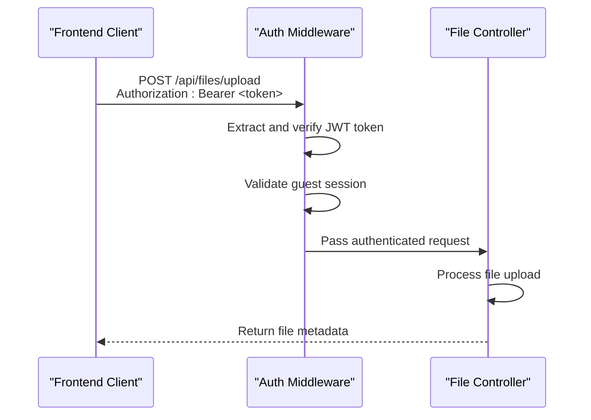
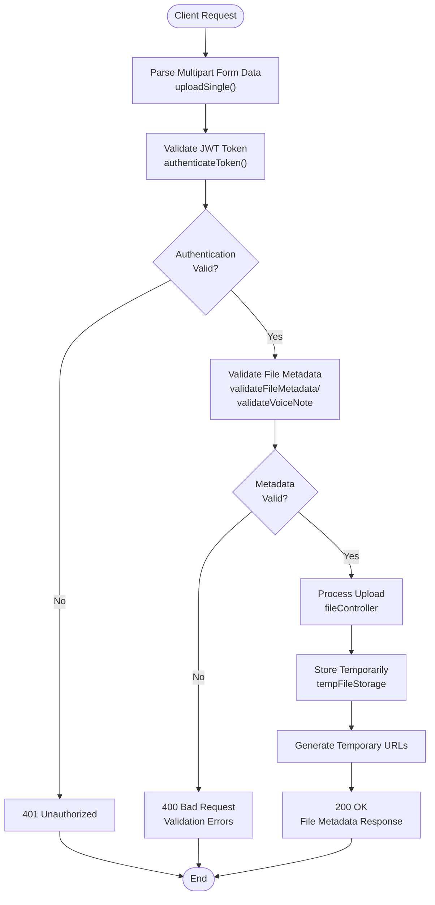
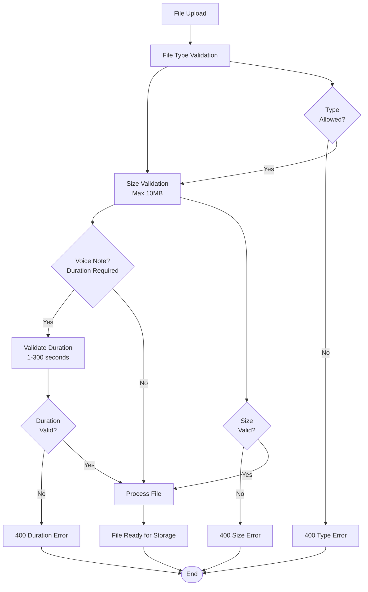
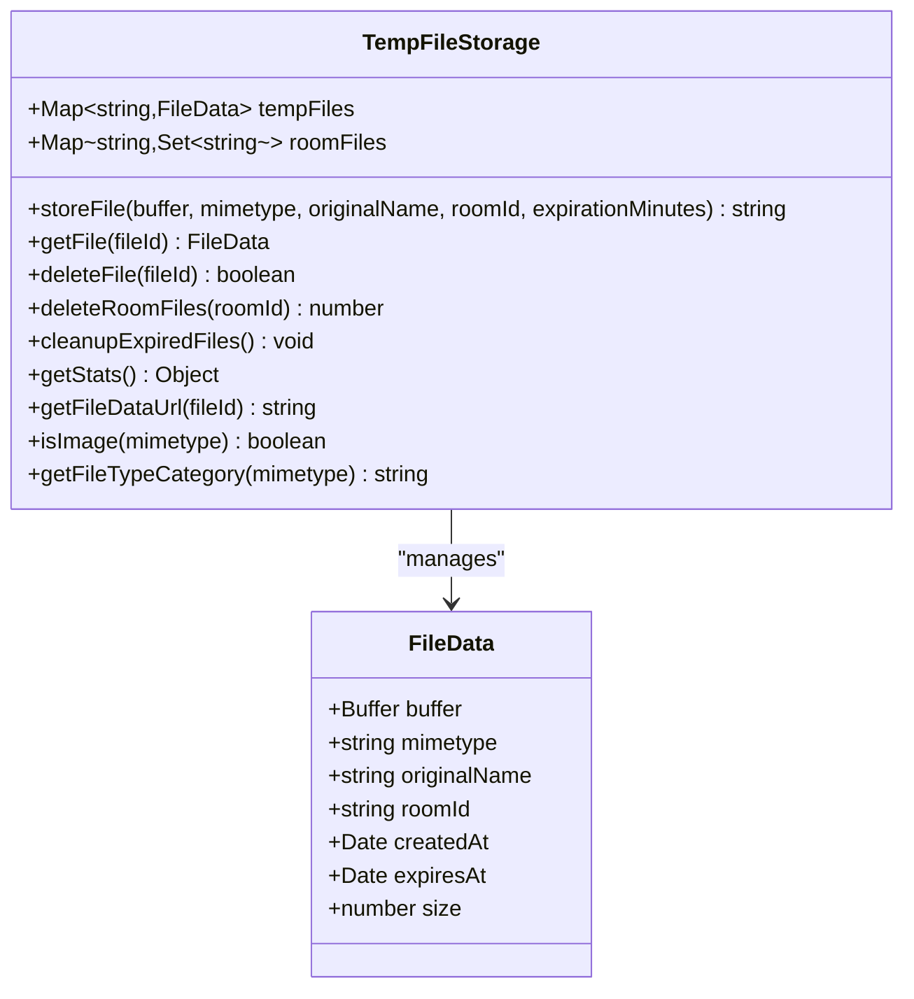
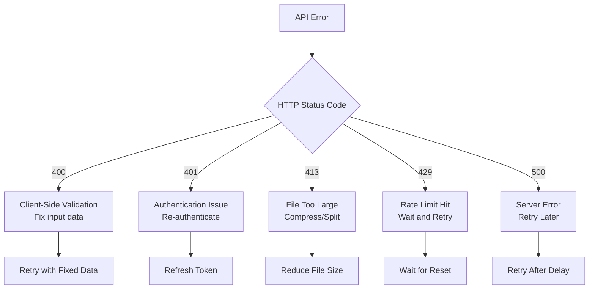
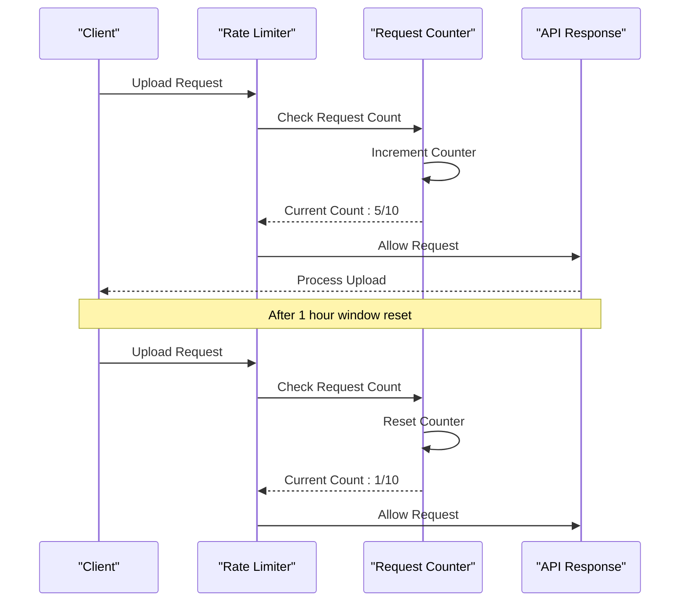

# File Upload API

<cite>
**Referenced Files in This Document**
- [fileRoutes.js](file://backend/src/routes/fileRoutes.js)
- [fileController.js](file://backend/src/controllers/fileController.js)
- [upload.js](file://backend/src/middleware/upload.js)
- [validation.js](file://backend/src/middleware/validation.js)
- [tempFileStorage.js](file://backend/src/utils/tempFileStorage.js)
- [security.js](file://backend/src/middleware/security.js)
- [auth.js](file://backend/src/middleware/auth.js)
- [tempFileRoutes.js](file://backend/src/routes/tempFileRoutes.js)
- [api.ts](file://web/lib/api.ts)
</cite>

## Table of Contents
1. [Introduction](#introduction)
2. [API Endpoints Overview](#api-endpoints-overview)
3. [Authentication and Security](#authentication-and-security)
4. [File Upload Flow](#file-upload-flow)
5. [General File Upload Endpoint](#general-file-upload-endpoint)
6. [Voice Note Upload Endpoint](#voice-note-upload-endpoint)
7. [File Validation and Processing](#file-validation-and-processing)
8. [Temporary File Storage](#temporary-file-storage)
9. [Frontend Implementation](#frontend-implementation)
10. [Error Handling](#error-handling)
11. [Rate Limiting](#rate-limiting)
12. [Security Considerations](#security-considerations)
13. [Troubleshooting Guide](#troubleshooting-guide)

## Introduction

The File Upload API provides secure, rate-limited file sharing capabilities for the Realtime Chat Application. It supports both general file uploads and specialized voice note uploads with duration validation. The system implements comprehensive security measures including JWT authentication, file type validation, size limits, and temporary storage with automatic cleanup.

## API Endpoints Overview

The File Upload API consists of two primary endpoints:

| Endpoint | Method | Purpose | Rate Limit |
|----------|--------|---------|------------|
| `/api/files/upload` | POST | General file uploads | 10 uploads/hour |
| `/api/files/voice` | POST | Voice note uploads with duration validation | 10 uploads/hour |

Both endpoints require authentication via JWT tokens and implement multipart form data processing for file uploads.

## Authentication and Security

### JWT Authentication

All file upload endpoints require authentication using JWT tokens. The system validates guest sessions exclusively, ensuring that only authenticated guest users can upload files.



**Diagram sources**
- [auth.js](file://backend/src/middleware/auth.js#L10-L50)
- [fileRoutes.js](file://backend/src/routes/fileRoutes.js#L9-L15)

### Security Headers and Validation

The system implements multiple security layers:

- **Content-Type Validation**: Ensures multipart/form-data requests
- **File Type Filtering**: Restricts uploads to approved MIME types
- **Size Limiting**: Enforces maximum file sizes (10MB default)
- **Input Sanitization**: Prevents malicious content injection

**Section sources**
- [auth.js](file://backend/src/middleware/auth.js#L1-L100)
- [security.js](file://backend/src/middleware/security.js#L1-L332)

## File Upload Flow

The file upload process follows a structured pipeline with multiple validation stages:



**Diagram sources**
- [fileRoutes.js](file://backend/src/routes/fileRoutes.js#L9-L20)
- [fileController.js](file://backend/src/controllers/fileController.js#L1-L141)
- [upload.js](file://backend/src/middleware/upload.js#L80-L150)

## General File Upload Endpoint

### Endpoint Details
- **URL**: `/api/files/upload`
- **Method**: POST
- **Content-Type**: `multipart/form-data`
- **Rate Limit**: 10 uploads per hour

### Request Format

The endpoint accepts multipart form data with the following fields:

| Field | Type | Required | Description |
|-------|------|----------|-------------|
| `file` | File | Yes | The file to upload |
| `roomId` | String | Yes | Target room ID for file sharing |
| `filename` | String | No | Override filename (validated) |
| `fileType` | String | No | File type category (validated) |
| `fileSize` | Number | No | File size in bytes (validated) |

### Request Example

```javascript
// Frontend implementation using FormData
const formData = new FormData();
formData.append('file', fileBlob, fileName);
formData.append('roomId', targetRoomId);

const response = await fileAPI.uploadFile(formData);
```

### Response Format

Successful uploads return comprehensive file metadata:

```json
{
  "success": true,
  "data": {
    "fileId": "uuid-string",
    "filename": "original-filename.ext",
    "fileType": "application/pdf",
    "fileSize": 1048576,
    "tempUrl": "https://api.example.com/api/temp-files/temp/uuid",
    "downloadUrl": "https://api.example.com/api/temp-files/download/uuid",
    "isImage": false,
    "fileTypeCategory": "document",
    "expiresAt": "2024-01-15T12:00:00.000Z"
  }
}
```

**Section sources**
- [fileRoutes.js](file://backend/src/routes/fileRoutes.js#L9-L15)
- [fileController.js](file://backend/src/controllers/fileController.js#L6-L50)

## Voice Note Upload Endpoint

### Endpoint Details
- **URL**: `/api/files/voice`
- **Method**: POST
- **Content-Type**: `multipart/form-data`
- **Rate Limit**: 10 uploads per hour

### Request Format

Voice note uploads require additional duration validation:

| Field | Type | Required | Description | Validation |
|-------|------|----------|-------------|------------|
| `file` | File | Yes | Audio file (MP3, WAV, OGG, etc.) | Max 10MB |
| `roomId` | String | Yes | Target room ID | Required |
| `duration` | Number | Yes | Voice note duration in seconds | 1-300 seconds (5 minutes) |

### Request Example

```javascript
// Frontend implementation for voice notes
const formData = new FormData();
formData.append('file', audioBlob, 'voice-note.mp3');
formData.append('roomId', roomUuid);
formData.append('duration', audioDurationSeconds);

const response = await fileAPI.uploadVoice(formData);
```

### Response Format

Voice note uploads include duration information:

```json
{
  "success": true,
  "data": {
    "fileId": "uuid-string",
    "filename": "voice-note.mp3",
    "fileType": "audio/mpeg",
    "fileSize": 2097152,
    "duration": 45,
    "tempUrl": "https://api.example.com/api/temp-files/temp/uuid",
    "downloadUrl": "https://api.example.com/api/temp-files/download/uuid",
    "isImage": false,
    "fileTypeCategory": "audio",
    "expiresAt": "2024-01-15T12:00:00.000Z"
  }
}
```

**Section sources**
- [fileRoutes.js](file://backend/src/routes/fileRoutes.js#L17-L20)
- [fileController.js](file://backend/src/controllers/fileController.js#L52-L100)
- [upload.js](file://backend/src/middleware/upload.js#L180-L220)

## File Validation and Processing

### File Type Validation

The system supports a comprehensive range of file types organized into categories:

#### Supported Image Formats
- JPEG, JPG, PNG, GIF, WebP, SVG, BMP

#### Supported Video Formats
- MP4, WebM, OGG, AVI, MOV, WMV

#### Supported Audio Formats
- MP3, WAV, OGG, WebM, M4A, AAC

#### Supported Document Formats
- PDF, Plain Text, CSV, JSON, XML
- Microsoft Office documents
- Archive formats (ZIP, RAR, TAR, GZIP)

### Validation Pipeline



**Diagram sources**
- [upload.js](file://backend/src/middleware/upload.js#L20-L70)
- [validation.js](file://backend/src/middleware/validation.js#L40-L80)

### File Processing Steps

1. **MIME Type Detection**: Automatic identification of file types
2. **Size Verification**: Ensures files don't exceed limits
3. **Content Validation**: Verifies file integrity
4. **Metadata Extraction**: Captures filename, size, and type information

**Section sources**
- [upload.js](file://backend/src/middleware/upload.js#L20-L80)
- [validation.js](file://backend/src/middleware/validation.js#L40-L80)

## Temporary File Storage

### Storage Architecture

The system uses an in-memory temporary storage solution with automatic cleanup:



**Diagram sources**
- [tempFileStorage.js](file://backend/src/utils/tempFileStorage.js#L10-L50)

### Storage Features

- **In-Memory Storage**: Fast access with minimal latency
- **Automatic Expiration**: Files expire after configurable time (default: 2 hours)
- **Room-Based Organization**: Files grouped by chat rooms
- **Cleanup Automation**: Periodic cleanup of expired files
- **Memory Management**: Efficient cleanup prevents memory leaks

### Storage Policies

| Policy | Value | Description |
|--------|-------|-------------|
| Default Expiration | 2 hours | Files automatically deleted after 2 hours |
| Cleanup Interval | 5 minutes | Expired files removed every 5 minutes |
| Max File Size | 10MB | Individual file size limit |
| Total Storage | Unlimited | No hard limit on total storage |

**Section sources**
- [tempFileStorage.js](file://backend/src/utils/tempFileStorage.js#L1-L237)

## Frontend Implementation

### API Integration

The frontend provides convenient wrapper functions for file uploads:

```typescript
// File upload API from web/lib/api.ts
export const fileAPI = {
  uploadFile: (formData: FormData) =>
    api.post("/api/files/upload", formData, {
      headers: { "Content-Type": "multipart/form-data" },
      timeout: 60000,
    }),
  uploadVoice: (formData: FormData) =>
    api.post("/api/files/voice", formData, {
      headers: { "Content-Type": "multipart/form-data" },
      timeout: 60000,
    }),
};
```

### Usage Examples

#### General File Upload

```javascript
// Basic file upload
const handleFileUpload = async (file, roomId) => {
  try {
    const formData = new FormData();
    formData.append('file', file);
    formData.append('roomId', roomId);
    
    const response = await fileAPI.uploadFile(formData);
    return response.data;
  } catch (error) {
    console.error('File upload failed:', error);
    throw error;
  }
};
```

#### Voice Note Upload

```javascript
// Voice note upload with duration
const handleVoiceNoteUpload = async (audioBlob, duration, roomId) => {
  try {
    const formData = new FormData();
    formData.append('file', audioBlob, 'voice-note.mp3');
    formData.append('roomId', roomId);
    formData.append('duration', duration.toString());
    
    const response = await fileAPI.uploadVoice(formData);
    return response.data;
  } catch (error) {
    console.error('Voice note upload failed:', error);
    throw error;
  }
};
```

### Content-Type Headers

Both endpoints require proper Content-Type headers:

- **Primary Header**: `Content-Type: multipart/form-data`
- **Boundary Parameter**: Automatically generated by FormData
- **Timeout**: 60 seconds for large file uploads

**Section sources**
- [api.ts](file://web/lib/api.ts#L110-L130)

## Error Handling

### Common Error Responses

The API returns structured error responses with appropriate HTTP status codes:

#### 400 Bad Request
```json
{
  "success": false,
  "message": "Validation failed",
  "errors": [
    {
      "field": "duration",
      "message": "Voice note duration must be between 1 second and 5 minutes"
    }
  ]
}
```

#### 401 Unauthorized
```json
{
  "success": false,
  "message": "Access token is required"
}
```

#### 413 Payload Too Large
```json
{
  "success": false,
  "message": "File too large. Maximum size is 10MB"
}
```

#### 404 Not Found (Temporary Files)
```json
{
  "success": false,
  "message": "File not found or expired"
}
```

### Error Categories

| Status Code | Category | Common Causes | Solution |
|-------------|----------|---------------|----------|
| 400 | Validation | Invalid file type, wrong duration, missing fields | Check file format and required fields |
| 401 | Authentication | Expired or invalid token | Re-authenticate user |
| 413 | Size Limit | File exceeds 10MB limit | Compress or split file |
| 429 | Rate Limit | Too many requests | Wait for rate limit reset |
| 500 | Server Error | Internal processing failure | Retry request |

### Error Recovery Strategies



**Section sources**
- [fileController.js](file://backend/src/controllers/fileController.js#L10-L30)
- [upload.js](file://backend/src/middleware/upload.js#L80-L120)

## Rate Limiting

### Rate Limit Configuration

The file upload API implements hourly rate limiting:

| Endpoint | Rate Limit | Window | Action |
|----------|------------|--------|--------|
| `/api/files/upload` | 10 uploads/hour | 1 hour | Block after limit |
| `/api/files/voice` | 10 uploads/hour | 1 hour | Block after limit |

### Rate Limiting Implementation



**Diagram sources**
- [security.js](file://backend/src/middleware/security.js#L50-L70)

### Rate Limit Headers

When rate limits are approaching:

```
X-RateLimit-Limit: 10
X-RateLimit-Remaining: 1
X-RateLimit-Reset: 1640995200
Retry-After: 3600
```

**Section sources**
- [security.js](file://backend/src/middleware/security.js#L50-L70)

## Security Considerations

### Input Validation

The system implements multiple layers of input validation:

1. **MIME Type Filtering**: Only approved file types allowed
2. **Size Validation**: Prevents denial-of-service attacks
3. **Content Sanitization**: Removes potentially malicious content
4. **Authentication Verification**: Ensures only authorized users can upload

### File Security Measures

- **Temporary Storage**: Files stored temporarily with automatic cleanup
- **No Persistent Storage**: Uploaded files never persist permanently
- **Memory-Based Storage**: Reduces disk I/O and improves performance
- **Expiration Policy**: Files automatically deleted after 2 hours

### Network Security

- **HTTPS Required**: All production traffic encrypted
- **CORS Protection**: Strict origin validation
- **Rate Limiting**: Prevents abuse and DDoS attacks
- **Input Sanitization**: Protects against injection attacks

### Best Practices

1. **Always validate file types** on the client side
2. **Implement proper error handling** for all upload scenarios
3. **Use appropriate timeouts** for large file uploads
4. **Monitor rate limit usage** in production
5. **Implement retry logic** with exponential backoff

## Troubleshooting Guide

### Common Issues and Solutions

#### File Upload Failures

**Problem**: Files not uploading successfully
**Causes**:
- Incorrect Content-Type header
- File size exceeding limits
- Authentication token expired
- Network connectivity issues

**Solutions**:
1. Verify FormData construction
2. Check file size (< 10MB)
3. Refresh authentication token
4. Implement retry logic with delays

#### Voice Note Duration Errors

**Problem**: Voice notes rejected with duration errors
**Causes**:
- Incorrect duration calculation
- Duration outside valid range (1-300 seconds)
- Missing duration parameter

**Solutions**:
1. Calculate duration accurately using audio metadata
2. Ensure duration is a positive number
3. Validate duration before upload

#### Rate Limit Exceeded

**Problem**: 429 Too Many Requests error
**Causes**:
- Too many uploads in short period
- Rate limiter reset time exceeded

**Solutions**:
1. Implement exponential backoff
2. Batch multiple uploads together
3. Wait for rate limit reset (1 hour)

#### Authentication Issues

**Problem**: 401 Unauthorized errors
**Causes**:
- Expired JWT token
- Invalid token format
- Missing Authorization header

**Solutions**:
1. Implement token refresh logic
2. Store tokens securely
3. Handle token expiration gracefully

### Debugging Tools

#### Enable Debug Logging

```javascript
// Enable detailed logging for debugging
console.log('File upload debug:', {
  fileSize: file.size,
  fileType: file.type,
  duration: audioDuration,
  roomId: targetRoom
});
```

#### Monitor Upload Progress

```javascript
// Track upload progress
const uploadWithProgress = async (formData) => {
  const response = await fileAPI.uploadFile(formData);
  
  // Log successful upload
  console.log('File uploaded successfully:', {
    fileId: response.data.fileId,
    size: response.data.fileSize,
    type: response.data.fileType
  });
  
  return response;
};
```

### Performance Optimization

#### Large File Handling

For files larger than 1MB:
1. Implement chunked upload for better reliability
2. Use progress indicators for user feedback
3. Consider compression for supported formats

#### Concurrent Uploads

To handle multiple simultaneous uploads:
1. Implement queue management
2. Use worker threads for heavy processing
3. Monitor memory usage for large files

**Section sources**
- [fileController.js](file://backend/src/controllers/fileController.js#L10-L50)
- [upload.js](file://backend/src/middleware/upload.js#L80-L150)