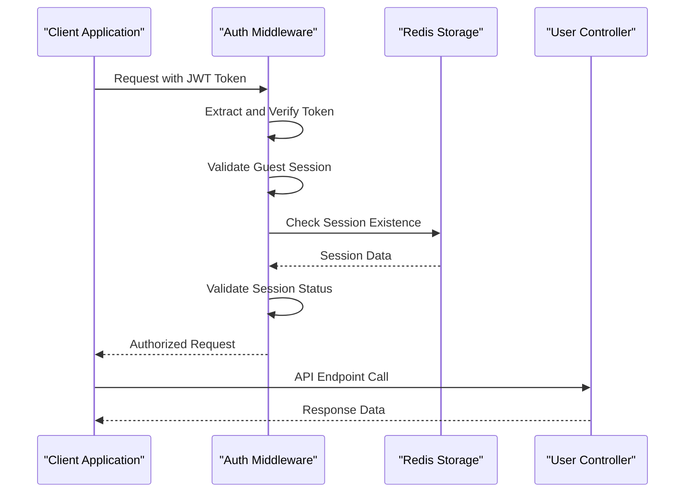
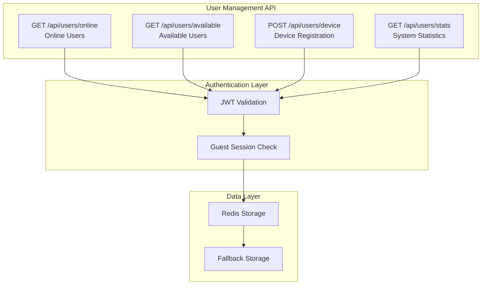
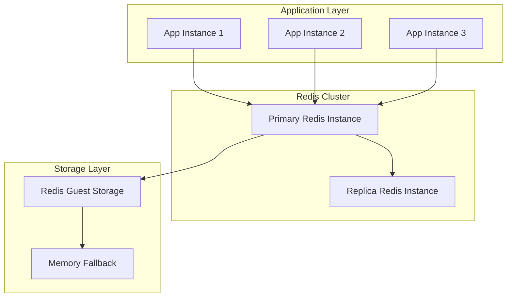
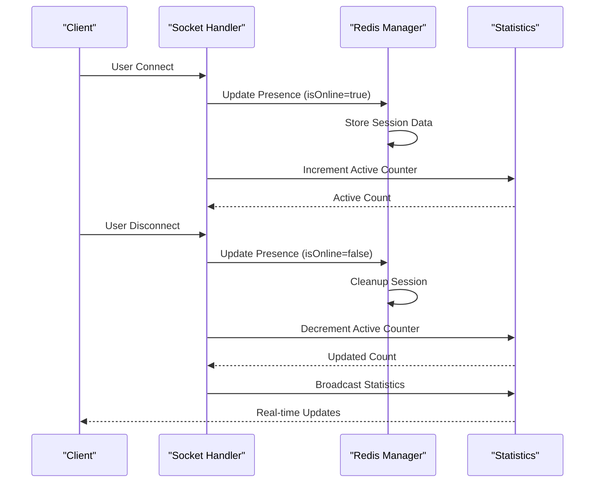

# User Management API Documentation

<cite>
**Referenced Files in This Document**
- [backend/src/routes/users.js](file://backend/src/routes/users.js)
- [backend/src/middleware/auth.js](file://backend/src/middleware/auth.js)
- [backend/src/middleware/validation.js](file://backend/src/middleware/validation.js)
- [backend/src/controllers/userController.js](file://backend/src/controllers/userController.js)
- [backend/src/controllers/guestController.js](file://backend/src/controllers/guestController.js)
- [backend/src/utils/redisGuestManager.js](file://backend/src/utils/redisGuestManager.js)
- [backend/src/socket/socketHandlers.js](file://backend/src/socket/socketHandlers.js)
- [web/lib/api.ts](file://web/lib/api.ts)
- [backend/src/middleware/security.js](file://backend/src/middleware/security.js)
</cite>

## Table of Contents
1. [Introduction](#introduction)
2. [Authentication System](#authentication-system)
3. [API Endpoints Overview](#api-endpoints-overview)
4. [GET /api/users/online](#get-apiusersonline)
5. [GET /api/users/available](#get-apiusersavailable)
6. [POST /api/users/device](#post-apiusersdevice)
7. [GET /api/users/stats](#get-apiusersstats)
8. [Real-time User Presence Tracking](#real-time-user-presence-tracking)
9. [Error Handling](#error-handling)
10. [Integration Examples](#integration-examples)
11. [Performance Considerations](#performance-considerations)
12. [Troubleshooting Guide](#troubleshooting-guide)

## Introduction

The User Management API provides comprehensive endpoints for managing guest user presence, device information, and system statistics in a real-time chat application. Built on Express.js with Redis for persistent storage, this API handles guest user sessions, real-time presence tracking, and statistical reporting for monitoring system health and user engagement.

The API is designed specifically for guest users with JWT authentication, providing secure access to user-related operations while maintaining real-time synchronization across multiple client connections.

## Authentication System

### JWT Token Validation

All user management endpoints require JWT authentication with specific guest session validation. The authentication system ensures that only valid guest sessions can access user-related functionality.



**Diagram sources**
- [backend/src/middleware/auth.js](file://backend/src/middleware/auth.js#L6-L50)
- [backend/src/controllers/guestController.js](file://backend/src/controllers/guestController.js#L1-L149)

### Authentication Flow

The authentication process validates JWT tokens and ensures they correspond to active guest sessions:

1. **Token Extraction**: Extracts Bearer token from Authorization header
2. **Token Verification**: Validates JWT signature and expiration
3. **Guest Session Validation**: Confirms the token represents a valid guest session
4. **Session Lookup**: Verifies the session exists in Redis storage
5. **Request Enhancement**: Attaches user context to the request object

**Section sources**
- [backend/src/middleware/auth.js](file://backend/src/middleware/auth.js#L6-L50)

## API Endpoints Overview

The User Management API consists of four primary endpoints, each serving specific user management functions:

| Endpoint | Method | Description | Authentication |
|----------|--------|-------------|----------------|
| `/api/users/online` | GET | Retrieve all currently online users | JWT Required |
| `/api/users/available` | GET | Get users available for matching | JWT Required |
| `/api/users/device` | POST | Register/update device information | JWT Required |
| `/api/users/stats` | GET | Fetch system statistics | JWT Required |



**Diagram sources**
- [backend/src/routes/users.js](file://backend/src/routes/users.js#L1-L40)
- [backend/src/utils/redisGuestManager.js](file://backend/src/utils/redisGuestManager.js#L1-L432)

## GET /api/users/online

### Purpose
Retrieves a list of all currently online guest users, excluding the requesting user to prevent self-matching.

### Request Structure
```http
GET /api/users/online
Authorization: Bearer <jwt_token>
```

### Response Format
```json
{
  "success": true,
  "data": {
    "onlineUsers": [
      {
        "id": "guest_uuid",
        "username": "CoolPanda1234",
        "isOnline": true,
        "lastSeen": "2024-01-15T10:30:00.000Z",
        "location": {
          "country": "US",
          "region": "California",
          "city": "San Francisco"
        },
        "gender": "male",
        "language": "en"
      }
    ],
    "count": 15
  }
}
```

### Implementation Details
The endpoint filters out the requesting user from the results and provides comprehensive user information including location data derived from IP geolocation.

**Section sources**
- [backend/src/controllers/userController.js](file://backend/src/controllers/userController.js#L6-L25)
- [backend/src/routes/users.js](file://backend/src/routes/users.js#L10-L13)

## GET /api/users/available

### Purpose
Returns a list of users available for matching, specifically those who are online, not currently in a chat, and actively searching for matches.

### Request Structure
```http
GET /api/users/available
Authorization: Bearer <jwt_token>
```

### Response Format
```json
{
  "success": true,
  "data": {
    "availableUsers": [
      {
        "id": "guest_uuid",
        "username": "SmartFox5678",
        "isOnline": true,
        "isSearching": true,
        "lastSeen": "2024-01-15T10:30:00.000Z",
        "location": {
          "country": "GB",
          "region": "England",
          "city": "London"
        },
        "gender": "female",
        "language": "en"
      }
    ],
    "count": 3
  }
}
```

### Availability Criteria
Users are considered available if they meet all three conditions:
- **Online Status**: `isOnline = true`
- **Not in Chat**: `connectedUser = null`
- **Searching**: `isSearching = true`

**Section sources**
- [backend/src/controllers/userController.js](file://backend/src/controllers/userController.js#L85-L105)
- [backend/src/routes/users.js](file://backend/src/routes/users.js#L15-L18)

## POST /api/users/device

### Purpose
Registers or updates device information for the authenticated guest user, including device ID, IP address, and geographic location.

### Request Structure
```http
POST /api/users/device
Authorization: Bearer <jwt_token>
Content-Type: application/json

{
  "deviceId": "unique_device_identifier",
  "ip": "client_ip_address",
  "location": {
    "country": "US",
    "region": "California",
    "city": "San Francisco"
  }
}
```

### Validation Rules
The endpoint uses the `validateDeviceUpdate` middleware for comprehensive input validation:

| Field | Type | Validation | Description |
|-------|------|------------|-------------|
| `deviceId` | String | Optional, 1-100 chars | Unique identifier for the device |
| `ip` | String | Optional, valid IP format | Client IP address |
| `location` | Object | Optional, object type | Geographic location data |
| `location.country` | String | Optional, max 50 chars | Country name |
| `location.region` | String | Optional, max 50 chars | Region/state |
| `location.city` | String | Optional, max 50 chars | City name |

### Response Format
```json
{
  "success": true,
  "message": "Device information updated successfully",
  "data": {
    "user": {
      "id": "guest_uuid",
      "username": "CoolPanda1234",
      "deviceId": "unique_device_identifier",
      "ip": "client_ip_address",
      "location": {
        "country": "US",
        "region": "California",
        "city": "San Francisco",
        "timezone": "America/Los_Angeles",
        "coordinates": {
          "lat": 37.7749,
          "lon": -122.4194
        }
      },
      "lastSeen": "2024-01-15T10:30:00.000Z",
      "isGuest": true
    }
  }
}
```

### Automatic Location Detection
The endpoint automatically detects and enriches location data from the client's IP address using GeoIP lookup, providing comprehensive geographic context for user identification.

**Section sources**
- [backend/src/controllers/userController.js](file://backend/src/controllers/userController.js#L27-L83)
- [backend/src/middleware/validation.js](file://backend/src/middleware/validation.js#L10-L35)
- [backend/src/routes/users.js](file://backend/src/routes/users.js#L25-L29)

## GET /api/users/stats

### Purpose
Provides comprehensive system statistics including total users, online users, available users, and connected users for monitoring and analytics.

### Request Structure
```http
GET /api/users/stats
Authorization: Bearer <jwt_token>
```

### Response Format
```json
{
  "success": true,
  "data": {
    "statistics": {
      "totalUsers": 1250,
      "onlineUsers": 320,
      "activeUsers": 285,
      "availableUsers": 45,
      "connectedUsers": 12
    }
  }
}
```

### Statistics Breakdown

| Metric | Description | Calculation |
|--------|-------------|-------------|
| `totalUsers` | Total guest accounts created | Count of all guest sessions |
| `onlineUsers` | Currently active sessions | Sessions with `isOnline = true` |
| `activeUsers` | Real-time active connections | Redis-based active user counter |
| `availableUsers` | Users searching for matches | Sessions with `isSearching = true` |
| `connectedUsers` | Users in active chats | Sessions with `connectedUser` set |

**Section sources**
- [backend/src/controllers/userController.js](file://backend/src/controllers/userController.js#L107-L125)
- [backend/src/routes/users.js](file://backend/src/routes/users.js#L21-L24)

## Real-time User Presence Tracking

### Redis Integration

The system uses Redis for persistent, scalable user presence tracking with automatic failover to in-memory storage for reliability.



**Diagram sources**
- [backend/src/utils/redisGuestManager.js](file://backend/src/utils/redisGuestManager.js#L15-L60)

### Presence Management Workflow



**Diagram sources**
- [backend/src/socket/socketHandlers.js](file://backend/src/socket/socketHandlers.js#L10-L100)
- [backend/src/utils/redisGuestManager.js](file://backend/src/utils/redisGuestManager.js#L350-L400)

### Active User Tracking

The system maintains real-time active user counts using Redis increment/decrement operations with automatic expiration:

- **Increment**: Called on user connection
- **Decrement**: Called on user disconnection  
- **Expiration**: 5-minute TTL for activity tracking
- **Fallback**: In-memory counter if Redis unavailable

**Section sources**
- [backend/src/utils/redisGuestManager.js](file://backend/src/utils/redisGuestManager.js#L350-L390)
- [backend/src/socket/socketHandlers.js](file://backend/src/socket/socketHandlers.js#L697-L743)

## Error Handling

### Authentication Errors

The API implements comprehensive error handling for authentication failures:

| Error Code | Message | Scenario |
|------------|---------|----------|
| 401 | "Access token is required" | Missing Authorization header |
| 401 | "Invalid token" | Malformed or expired JWT |
| 401 | "Only guest sessions are supported" | Non-guest token used |
| 401 | "Guest session not found or expired" | Invalid session ID |

### Rate Limiting

The API implements rate limiting to prevent abuse and ensure system stability:

```javascript
// Rate limiter configuration
const apiLimiter = createRateLimiter(
  15 * 60 * 1000, // 15 minutes window
  100, // Maximum 100 requests
  "Too many API requests, please try again later."
);
```

### Validation Errors

Device update endpoint returns structured validation errors:

```json
{
  "success": false,
  "message": "Validation failed",
  "errors": [
    {
      "field": "deviceId",
      "message": "Device ID must be between 1 and 100 characters"
    }
  ]
}
```

**Section sources**
- [backend/src/middleware/auth.js](file://backend/src/middleware/auth.js#L6-L50)
- [backend/src/middleware/security.js](file://backend/src/middleware/security.js#L25-L48)

## Integration Examples

### Using userAPI from lib/api.ts

The frontend integration utilizes a typed API interface for seamless communication:

```typescript
// Import the user API module
import { userAPI } from '@/lib/api';

// Example 1: Fetch online users
async function fetchOnlineUsers() {
  try {
    const response = await userAPI.getOnlineUsers();
    console.log('Online users:', response.data.onlineUsers);
    return response.data;
  } catch (error) {
    console.error('Failed to fetch online users:', error);
    throw error;
  }
}

// Example 2: Update device context on login
async function updateDeviceContext(deviceInfo: { deviceId: string }) {
  try {
    const response = await userAPI.updateDevice(deviceInfo);
    console.log('Device updated:', response.data.user);
    return response.data;
  } catch (error) {
    console.error('Failed to update device:', error);
    throw error;
  }
}

// Example 3: Fetch available users before initiating match
async function findAvailableMatches() {
  try {
    const response = await userAPI.getAvailableUsers();
    if (response.data.count > 0) {
      console.log('Found available users:', response.data.count);
      return response.data.availableUsers;
    }
    return [];
  } catch (error) {
    console.error('Failed to fetch available users:', error);
    throw error;
  }
}
```

### Error Handling Patterns

```typescript
// Comprehensive error handling example
async function getUserDataWithRetry(endpoint: string) {
  try {
    switch (endpoint) {
      case 'online':
        return await userAPI.getOnlineUsers();
      case 'available':
        return await userAPI.getAvailableUsers();
      case 'stats':
        return await userAPI.getStats();
      default:
        throw new Error('Invalid endpoint');
    }
  } catch (error) {
    if (error.response?.status === 401) {
      // Handle authentication failure
      console.warn('Authentication expired, refreshing session...');
      await refreshGuestSession();
      // Retry the request
      return await getUserDataWithRetry(endpoint);
    } else if (error.response?.status === 429) {
      // Handle rate limiting
      console.warn('Rate limit exceeded, waiting before retry...');
      await new Promise(resolve => setTimeout(resolve, 5000));
      return await getUserDataWithRetry(endpoint);
    }
    throw error;
  }
}
```

**Section sources**
- [web/lib/api.ts](file://web/lib/api.ts#L95-L129)

## Performance Considerations

### Caching Strategy

The API implements multi-layered caching for optimal performance:

1. **Redis Primary Cache**: Persistent storage for user sessions and presence data
2. **Memory Fallback**: In-memory storage for Redis unavailability
3. **Active User Counter**: Redis-based counter for real-time statistics
4. **Session Expiration**: Automatic cleanup of expired sessions (2-hour TTL)

### Scalability Features

- **Horizontal Scaling**: Redis cluster support for distributed deployments
- **Connection Pooling**: Efficient Redis client configuration
- **Graceful Degradation**: Fallback to memory storage when Redis unavailable
- **Automatic Cleanup**: Periodic cleanup of expired sessions (10-minute intervals)

### Optimization Techniques

- **Batch Operations**: Grouped Redis operations for reduced latency
- **Connection Reuse**: Persistent Redis connections with automatic reconnection
- **Selective Serialization**: Minimal JSON serialization for frequently accessed data
- **Geographic Indexing**: IP-to-location caching for improved performance

## Troubleshooting Guide

### Common Issues and Solutions

#### Authentication Failures

**Problem**: 401 Unauthorized responses
**Causes**:
- Expired JWT token
- Invalid session ID
- Missing Authorization header

**Solutions**:
1. Verify token validity and expiration
2. Check session existence in Redis
3. Ensure proper token format: `Bearer <token>`
4. Implement automatic token refresh

#### Rate Limiting Issues

**Problem**: 429 Too Many Requests
**Causes**:
- Excessive API calls within rate limit window
- Improper request throttling

**Solutions**:
1. Implement exponential backoff
2. Batch related requests
3. Use WebSocket connections for real-time updates
4. Monitor rate limit headers

#### Redis Connectivity Problems

**Problem**: Redis connection failures
**Causes**:
- Network connectivity issues
- Redis server overload
- Configuration problems

**Solutions**:
1. Enable Redis fallback mode
2. Implement connection retry logic
3. Monitor Redis health metrics
4. Configure appropriate connection timeouts

#### Performance Issues

**Problem**: Slow API responses
**Causes**:
- Large user datasets
- Inefficient queries
- Memory pressure

**Solutions**:
1. Implement pagination for large datasets
2. Optimize Redis key patterns
3. Monitor memory usage
4. Use Redis SCAN instead of KEYS

### Monitoring and Debugging

#### Health Check Endpoints

```http
GET /api/health
GET /api/socket/stats
```

#### Logging Configuration

Enable detailed logging for troubleshooting:
```javascript
// Log level configuration
logger.level = process.env.LOG_LEVEL || 'info';
```

#### Performance Metrics

Monitor key performance indicators:
- API response times
- Redis operation latency
- Memory usage
- Connection pool status

**Section sources**
- [backend/src/middleware/security.js](file://backend/src/middleware/security.js#L25-L48)
- [backend/src/utils/redisGuestManager.js](file://backend/src/utils/redisGuestManager.js#L15-L60)