# Backend Architecture

<cite>
**Referenced Files in This Document**
- [server.js](file://backend/src/server.js)
- [cluster.js](file://backend/src/cluster.js)
- [socketServer.js](file://backend/src/socket/socketServer.js)
- [socketHandlers.js](file://backend/src/socket/socketHandlers.js)
- [guestController.js](file://backend/src/controllers/guestController.js)
- [userController.js](file://backend/src/controllers/userController.js)
- [fileController.js](file://backend/src/controllers/fileController.js)
- [auth.js](file://backend/src/middleware/auth.js)
- [redisGuestManager.js](file://backend/src/utils/redisGuestManager.js)
- [logger.js](file://backend/src/config/logger.js)
- [security.js](file://backend/src/middleware/security.js)
- [tempFileStorage.js](file://backend/src/utils/tempFileStorage.js)
- [package.json](file://backend/package.json)
- [ecosystem.config.js](file://backend/ecosystem.config.js)
</cite>

## Table of Contents
1. [Introduction](#introduction)
2. [System Architecture Overview](#system-architecture-overview)
3. [Server Entry Point](#server-entry-point)
4. [Cluster Mode Implementation](#cluster-mode-implementation)
5. [Socket.IO Server Architecture](#socketio-server-architecture)
6. [MVC Pattern Implementation](#mvc-pattern-implementation)
7. [Event-Driven Communication](#event-driven-communication)
8. [Redis Integration](#redis-integration)
9. [Security and Authentication](#security-and-authentication)
10. [Error Handling and Logging](#error-handling-and-logging)
11. [File Management System](#file-management-system)
12. [Production Deployment](#production-deployment)
13. [Component Interaction Flow](#component-interaction-flow)
14. [Performance Considerations](#performance-considerations)
15. [Conclusion](#conclusion)

## Introduction

The Realtime Chat App backend is a sophisticated Node.js/Express application built for scalable real-time communication featuring WebRTC capabilities. The architecture emphasizes horizontal scalability, real-time responsiveness, and robust session management through a combination of cluster mode support, Socket.IO for real-time events, and Redis for distributed session storage.

The system supports both guest and authenticated user interactions with comprehensive features including text messaging, file sharing, voice notes, and video/audio calling through WebRTC signaling. The backend is designed to handle thousands of concurrent connections while maintaining low latency and high availability.

## System Architecture Overview

The backend follows a layered architecture with clear separation of concerns, implementing an event-driven model for real-time communication and a traditional MVC pattern for HTTP requests.

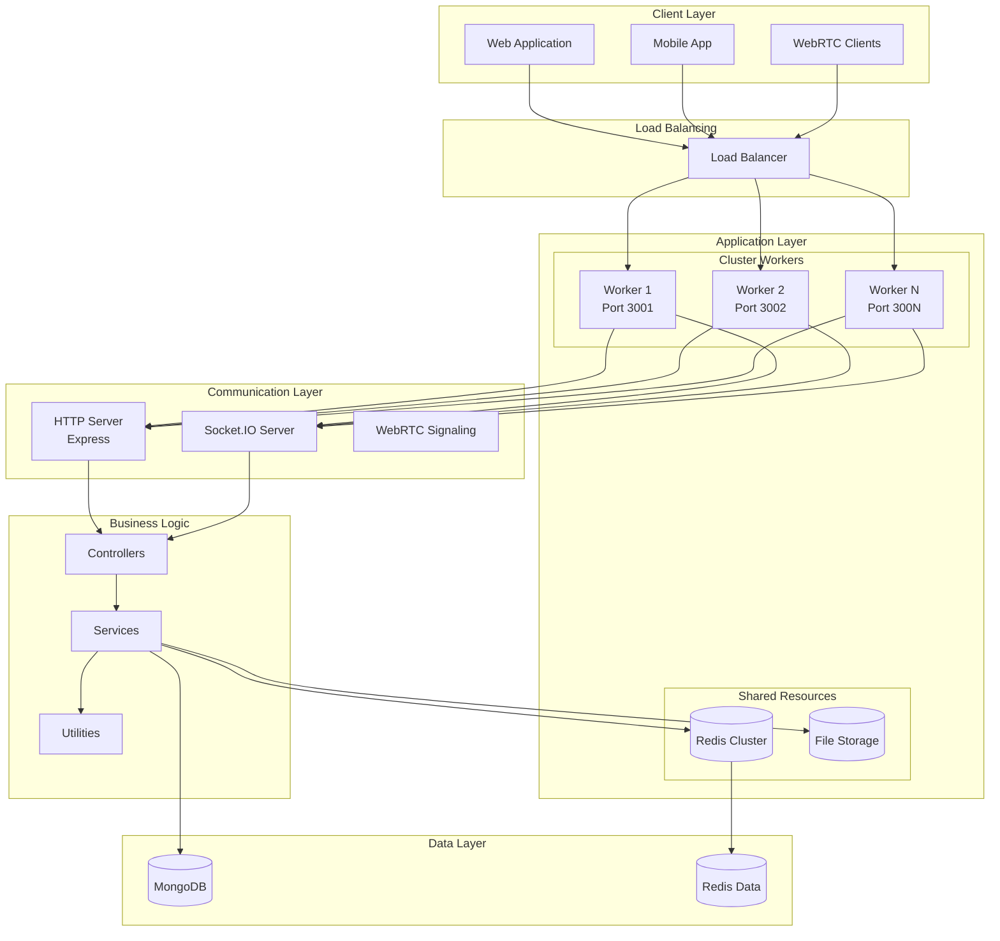

**Diagram sources**
- [cluster.js](file://backend/src/cluster.js#L1-L59)
- [server.js](file://backend/src/server.js#L1-L265)
- [socketServer.js](file://backend/src/socket/socketServer.js#L1-L199)

## Server Entry Point

The [`server.js`](file://backend/src/server.js) file serves as the main entry point for the application, orchestrating the initialization of all core components including Express app setup, middleware configuration, route registration, and Socket.IO server creation.

### Core Initialization Process

The server initialization follows a structured approach:

1. **Express App Creation**: Creates the main Express application with proxy trust enabled for proper IP detection
2. **Middleware Stack**: Configures security, CORS, input sanitization, compression, and logging middleware
3. **Route Registration**: Mounts API routes with appropriate rate limiting
4. **Socket.IO Setup**: Initializes the Socket.IO server with CORS configuration
5. **Error Handling**: Sets up global error handlers and graceful shutdown procedures
6. **Background Tasks**: Starts periodic cleanup tasks for expired files and sessions

### Security Middleware Pipeline

The security middleware implements a comprehensive defense-in-depth strategy:

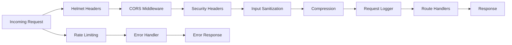

**Diagram sources**
- [server.js](file://backend/src/server.js#L25-L85)
- [security.js](file://backend/src/middleware/security.js#L1-L199)

**Section sources**
- [server.js](file://backend/src/server.js#L25-L265)

## Cluster Mode Implementation

The [`cluster.js`](file://backend/src/cluster.js) file implements multi-process clustering for optimal CPU utilization across multiple cores. This approach enables horizontal scaling within a single server instance while maintaining process isolation for fault tolerance.

### Cluster Architecture

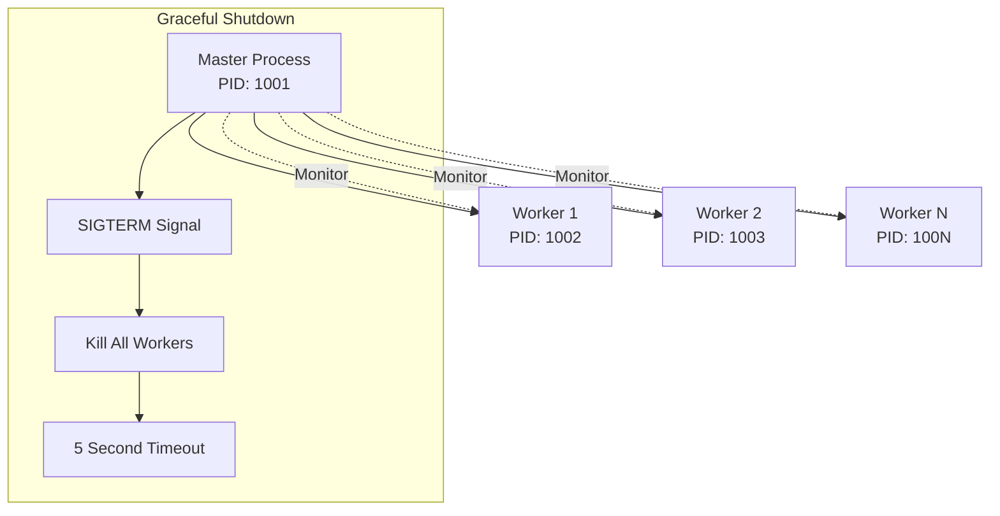

**Diagram sources**
- [cluster.js](file://backend/src/cluster.js#L1-L59)

### Process Management Features

- **Automatic Worker Restart**: Monitors worker failures and automatically restarts them
- **Graceful Shutdown**: Handles SIGTERM and SIGINT signals for clean process termination
- **Dynamic Scaling**: Supports configurable number of worker processes
- **Health Monitoring**: Tracks worker status and logs process events

**Section sources**
- [cluster.js](file://backend/src/cluster.js#L1-L59)

## Socket.IO Server Architecture

The [`socketServer.js`](file://backend/src/socket/socketServer.js) module creates and configures the Socket.IO server with advanced features including Redis adapter for multi-instance scaling, rate limiting, and comprehensive event handling.

### Socket.IO Configuration

The Socket.IO server is configured with production-ready settings:

- **CORS Configuration**: Flexible CORS settings supporting multiple origins
- **Transport Methods**: WebSocket and polling transports for maximum compatibility
- **Ping Intervals**: Regular heartbeat checks for connection stability
- **Connection Limits**: Configurable limits for connection management

### Redis Adapter Integration

For production deployments, the Socket.IO server integrates with Redis to enable multi-instance scaling:

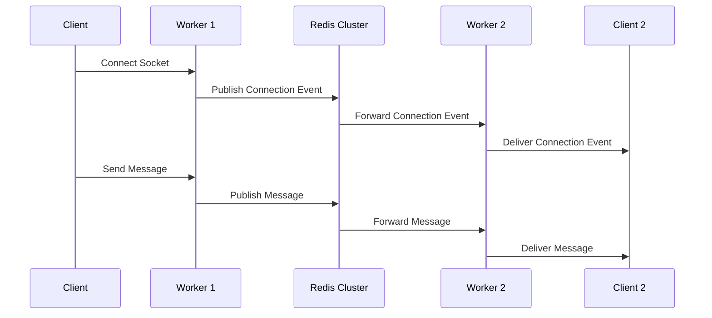

**Diagram sources**
- [socketServer.js](file://backend/src/socket/socketServer.js#L15-L45)

### Rate Limiting Implementation

The Socket.IO server implements intelligent rate limiting to prevent abuse:

- **Per-User Rate Limiting**: 100 events per minute per authenticated user
- **Sliding Window Algorithm**: Fair distribution of request quotas
- **Redis Integration**: Distributed rate limiting across multiple workers

**Section sources**
- [socketServer.js](file://backend/src/socket/socketServer.js#L1-L199)

## MVC Pattern Implementation

The backend implements an MVC-like architecture with clear separation between routes, controllers, and services, promoting maintainability and testability.

### Controller Layer Architecture

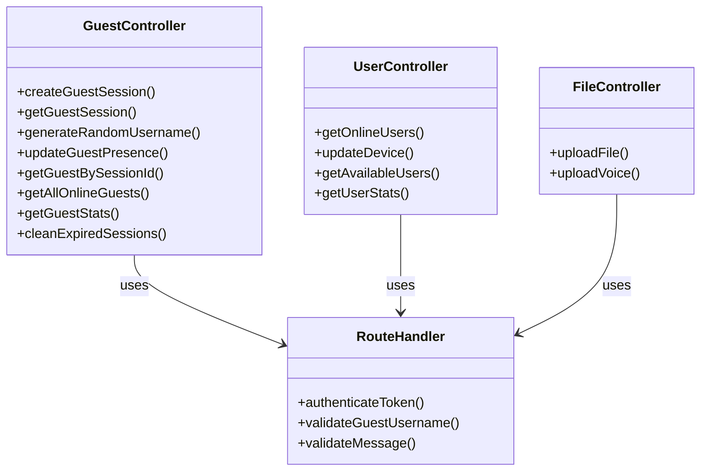

**Diagram sources**
- [guestController.js](file://backend/src/controllers/guestController.js#L1-L149)
- [userController.js](file://backend/src/controllers/userController.js#L1-L175)
- [fileController.js](file://backend/src/controllers/fileController.js#L1-L141)

### Routing Strategy

The routing system implements RESTful APIs with appropriate middleware:

- **Guest Routes**: `/api/guest/*` for anonymous user management
- **File Routes**: `/api/files/*` for file upload and management
- **Statistics Routes**: `/api/stats/*` for system monitoring
- **Health Check**: `/health` and `/api/socket/stats` endpoints

**Section sources**
- [guestController.js](file://backend/src/controllers/guestController.js#L1-L149)
- [userController.js](file://backend/src/controllers/userController.js#L1-L175)
- [fileController.js](file://backend/src/controllers/fileController.js#L1-L141)

## Event-Driven Communication

The backend implements a comprehensive event-driven architecture using Socket.IO for real-time communication, supporting over 15 distinct event types for various interactive features.

### Socket Event Types

The system supports extensive real-time communication through categorized events:

#### Connection Management Events
- `connection`: New socket connection establishment
- `disconnect`: Socket disconnection handling
- `error`: Error event propagation

#### User Presence Events
- `user:match`: Initiate user matching process
- `user:match:cancel`: Cancel pending matching request
- `user:matched`: Notify successful user pairing
- `user:match:searching`: Update search status
- `user:match:no_users`: No available users notification
- `user:match:error`: Matching error handling

#### Chat Communication Events
- `chat:message`: Send text, file, or voice messages
- `chat:clear`: Clear current chat session
- `chat:cleared`: Chat clearing confirmation
- `chat:error`: Chat operation error handling
- `chat:typing:start`: Start typing indicator
- `chat:typing:stop`: Stop typing indicator

#### WebRTC Signaling Events
- `webrtc:offer`: Send WebRTC call invitation
- `webrtc:answer`: Respond to WebRTC call
- `webrtc:ice-candidate`: Exchange ICE candidates
- `webrtc:call-end`: End WebRTC call
- `webrtc:call-reject`: Reject WebRTC call
- `webrtc:call-timeout`: Handle call timeout

#### Room Management Events
- `leave-room`: Explicit room departure
- `close-room`: Force room closure
- `room:user_joined`: Room member joining
- `room:user_left`: Room member departure
- `room:closed`: Room closure notification

#### Statistics Events
- `get:stats`: Request current statistics
- `realtime:stats`: Broadcast real-time statistics

### Event Flow Architecture

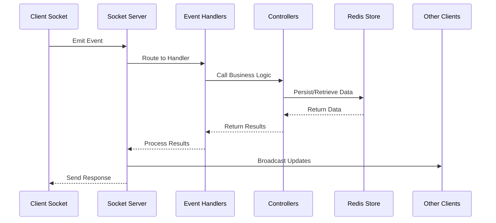

**Diagram sources**
- [socketHandlers.js](file://backend/src/socket/socketHandlers.js#L1-L746)
- [socketServer.js](file://backend/src/socket/socketServer.js#L94-L123)

**Section sources**
- [socketHandlers.js](file://backend/src/socket/socketHandlers.js#L1-L746)

## Redis Integration

The [`redisGuestManager.js`](file://backend/src/utils/redisGuestManager.js) provides distributed session management and state persistence across multiple server instances, enabling horizontal scaling beyond single-process memory limitations.

### Redis Architecture Benefits

- **Distributed Session Storage**: Maintains guest sessions across multiple workers
- **High Availability**: Redis clustering support for fault tolerance
- **Memory Efficiency**: Optimized data structures for session management
- **Persistence Options**: Configurable TTL for automatic cleanup
- **Fallback Mechanism**: In-memory storage when Redis is unavailable

### Data Model Design

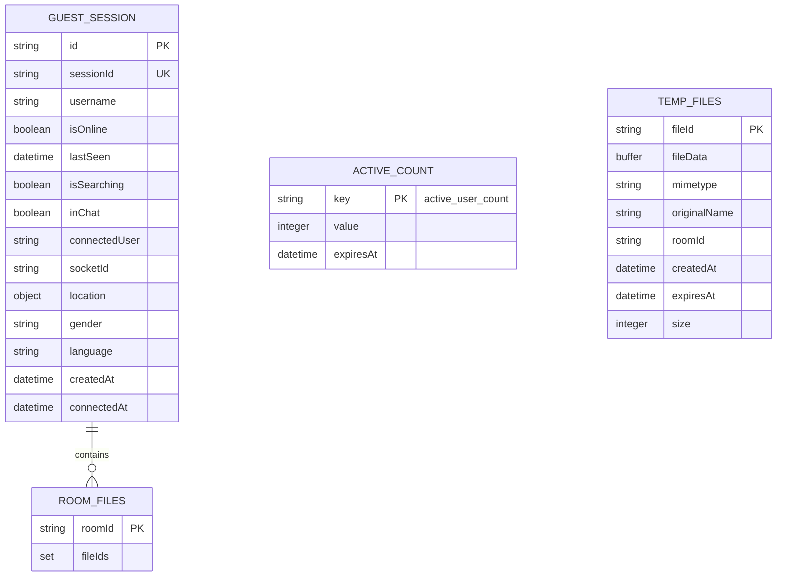

**Diagram sources**
- [redisGuestManager.js](file://backend/src/utils/redisGuestManager.js#L1-L432)
- [tempFileStorage.js](file://backend/src/utils/tempFileStorage.js#L1-L237)

### Redis Operations

The Redis integration supports comprehensive session management:

- **Session Creation**: Guest session initialization with UUID generation
- **Presence Tracking**: Online status and activity monitoring
- **Room Management**: Chat room association and cleanup
- **Statistics Aggregation**: Active user counting and analytics
- **Cleanup Automation**: Automatic expiration and garbage collection

**Section sources**
- [redisGuestManager.js](file://backend/src/utils/redisGuestManager.js#L1-L432)

## Security and Authentication

The backend implements comprehensive security measures including JWT-based authentication, input sanitization, rate limiting, and CORS protection.

### Authentication System

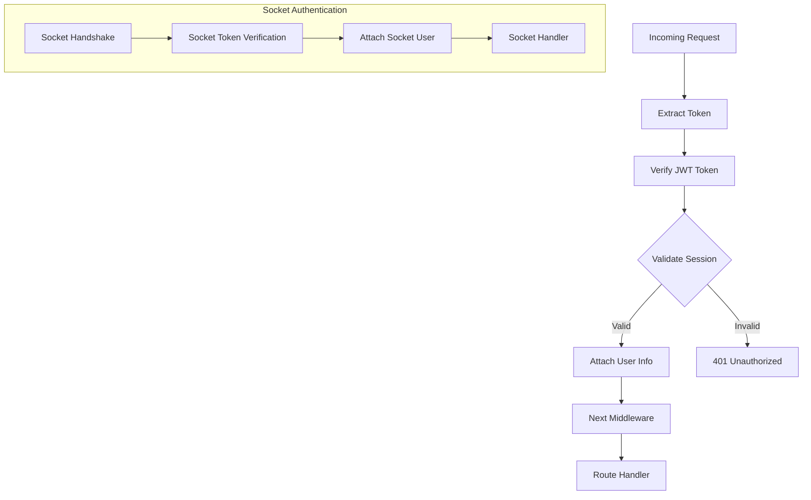

**Diagram sources**
- [auth.js](file://backend/src/middleware/auth.js#L1-L100)

### Security Features

- **JWT Authentication**: Stateless token-based authentication for guest sessions
- **Input Sanitization**: Protection against NoSQL injection attacks
- **Rate Limiting**: Configurable limits for API endpoints
- **CORS Protection**: Origin validation and credential support
- **Helmet Integration**: Security headers for XSS and clickjacking protection
- **CSRF Protection**: Cross-site request forgery prevention

### Validation Pipeline

The input validation system implements multiple layers of protection:

1. **Body Validation**: Express Validator for structured data
2. **Sanitization**: Mongo sanitize for NoSQL injection prevention
3. **Custom Validation**: Application-specific validation rules
4. **Type Checking**: Runtime type verification

**Section sources**
- [auth.js](file://backend/src/middleware/auth.js#L1-L100)
- [security.js](file://backend/src/middleware/security.js#L1-L199)

## Error Handling and Logging

The backend implements comprehensive error handling and logging using Winston for structured logging across all operational aspects.

### Error Handling Strategy

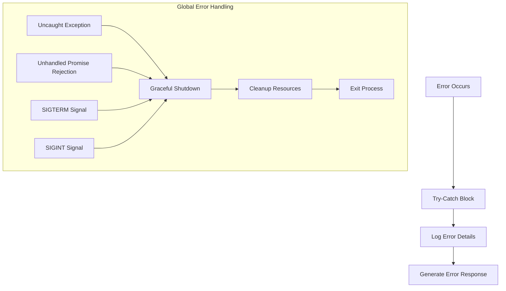

**Diagram sources**
- [server.js](file://backend/src/server.js#L149-L198)
- [logger.js](file://backend/src/config/logger.js#L1-L17)

### Logging Configuration

The Winston logger provides structured logging with multiple transport options:

- **Console Transport**: Real-time logging to terminal
- **File Transport**: Persistent logging to files
- **Error File**: Separate error-level logging
- **JSON Format**: Structured log format for parsing
- **Timestamps**: ISO-formatted timestamps
- **Stack Traces**: Full error stack traces

### Graceful Shutdown Procedures

The system implements comprehensive shutdown procedures:

1. **Signal Handling**: Captures SIGTERM and SIGINT signals
2. **Resource Cleanup**: Closes HTTP servers and database connections
3. **Redis Connection**: Proper Redis client shutdown
4. **Timeout Protection**: 5-second timeout for forced termination
5. **Process Exit**: Controlled process termination

**Section sources**
- [server.js](file://backend/src/server.js#L149-L198)
- [logger.js](file://backend/src/config/logger.js#L1-L17)

## File Management System

The [`tempFileStorage.js`](file://backend/src/utils/tempFileStorage.js) provides temporary file storage for media sharing with automatic cleanup and categorization capabilities.

### File Storage Architecture

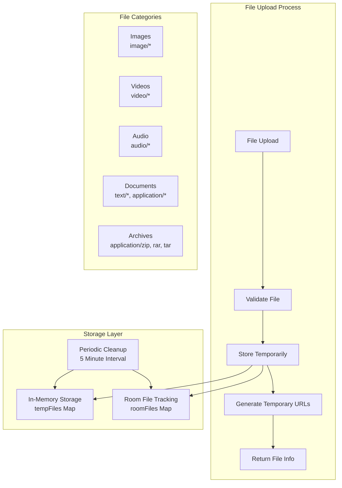

**Diagram sources**
- [tempFileStorage.js](file://backend/src/utils/tempFileStorage.js#L1-L237)

### File Management Features

- **Temporary Storage**: Files expire after configurable time (default: 2 hours)
- **Room Association**: Files linked to specific chat rooms
- **Automatic Cleanup**: Periodic cleanup of expired files
- **Format Detection**: Automatic MIME type detection and categorization
- **URL Generation**: Temporary URLs for secure file access
- **Size Tracking**: Storage usage monitoring and reporting

### Supported File Types

The system supports comprehensive file type categorization:

- **Images**: JPEG, PNG, GIF, WebP, SVG
- **Videos**: MP4, WebM, AVI, MOV
- **Audio**: MP3, WAV, OGG, M4A
- **Documents**: PDF, TXT, DOC, XLS, PPT
- **Text Files**: JSON, XML, CSV, HTML
- **Archives**: ZIP, RAR, TAR, GZIP

**Section sources**
- [tempFileStorage.js](file://backend/src/utils/tempFileStorage.js#L1-L237)

## Production Deployment

The [`ecosystem.config.js`](file://backend/ecosystem.config.js) provides comprehensive PM2 ecosystem configuration supporting multiple deployment scenarios.

### Deployment Configurations

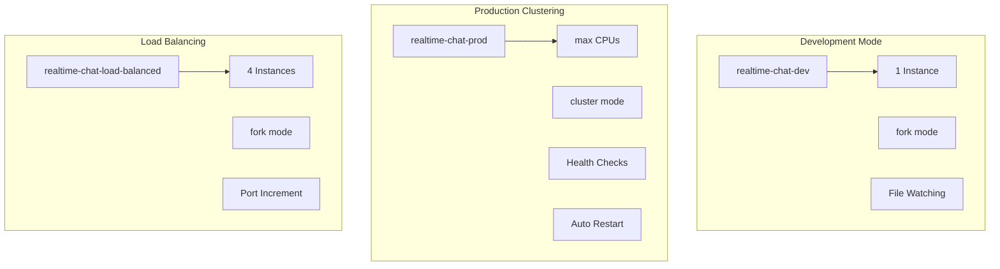

**Diagram sources**
- [ecosystem.config.js](file://backend/ecosystem.config.js#L1-L98)

### Deployment Features

- **PM2 Process Management**: Automated process monitoring and restart
- **Multiple Deployment Modes**: Development, clustering, and load balancing
- **Health Monitoring**: HTTP health check endpoints
- **Graceful Restart**: 5-second timeout for clean shutdown
- **Memory Management**: Automatic restart on memory threshold
- **Environment Configuration**: Separate configurations for different environments

### Scaling Strategies

1. **Cluster Mode**: Multi-core utilization on single server
2. **Load Balancing**: Multiple independent instances
3. **Redis Integration**: Shared state across instances
4. **Health Checks**: Automatic failure detection
5. **Auto-Restart**: Configurable restart policies

**Section sources**
- [ecosystem.config.js](file://backend/ecosystem.config.js#L1-L98)

## Component Interaction Flow

The following diagram illustrates the complete request flow from HTTP/Sockets to controllers and data stores:

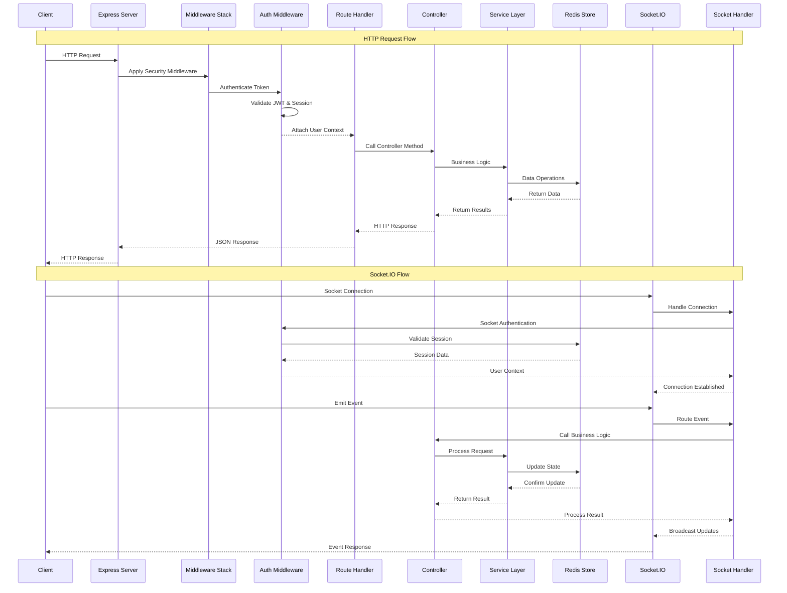

**Diagram sources**
- [server.js](file://backend/src/server.js#L25-L265)
- [socketServer.js](file://backend/src/socket/socketServer.js#L1-L199)
- [socketHandlers.js](file://backend/src/socket/socketHandlers.js#L1-L746)

## Performance Considerations

The backend architecture incorporates several performance optimization strategies:

### Scalability Features

- **Multi-Core Utilization**: Cluster mode for CPU-bound operations
- **Connection Pooling**: Efficient database and Redis connection management
- **Memory Optimization**: In-memory caching for frequently accessed data
- **Compression**: Gzip compression for HTTP responses
- **Static File Serving**: Optimized static asset delivery

### Caching Strategy

- **Redis Caching**: Session data and user presence caching
- **In-Memory Fallback**: Automatic fallback when Redis unavailable
- **Expiration Policies**: Configurable TTL for cached data
- **Lazy Loading**: On-demand data loading for large datasets

### Resource Management

- **Connection Limits**: Configurable limits for HTTP and WebSocket connections
- **Memory Monitoring**: Automatic restart on memory threshold
- **File Cleanup**: Periodic cleanup of temporary files
- **Garbage Collection**: Efficient memory management

## Conclusion

The Realtime Chat App backend represents a sophisticated, production-ready architecture designed for high-performance real-time communication. The system successfully combines modern Node.js/Express patterns with advanced features like cluster mode, Socket.IO real-time communication, and Redis-based session management.

Key architectural strengths include:

- **Horizontal Scalability**: Multi-instance deployment with Redis clustering
- **Real-Time Capabilities**: Comprehensive Socket.IO implementation with WebRTC support
- **Security Focus**: Multi-layered security with JWT authentication and input validation
- **Operational Excellence**: Robust error handling, logging, and graceful shutdown procedures
- **Developer Experience**: Clean MVC architecture with comprehensive middleware

The modular design ensures maintainability while the performance optimizations support high-concurrency scenarios. The comprehensive testing suite and production-ready deployment configuration demonstrate readiness for enterprise-scale deployment.