# Middleware Architecture

<cite>
**Referenced Files in This Document**
- [auth.js](file://backend/src/middleware/auth.js)
- [security.js](file://backend/src/middleware/security.js)
- [cors-debug.js](file://backend/src/middleware/cors-debug.js)
- [upload.js](file://backend/src/middleware/upload.js)
- [validation.js](file://backend/src/middleware/validation.js)
- [server.js](file://backend/src/server.js)
- [socketServer.js](file://backend/src/socket/socketServer.js)
- [jwt.js](file://backend/src/utils/jwt.js)
- [guestController.js](file://backend/src/controllers/guestController.js)
- [redisGuestManager.js](file://backend/src/utils/redisGuestManager.js)
- [auth.js](file://backend/src/routes/auth.js)
- [users.js](file://backend/src/routes/users.js)
- [fileRoutes.js](file://backend/src/routes/fileRoutes.js)
</cite>

## Table of Contents
1. [Introduction](#introduction)
2. [Middleware Architecture Overview](#middleware-architecture-overview)
3. [Core Authentication Middleware](#core-authentication-middleware)
4. [Security and Rate Limiting](#security-and-rate-limiting)
5. [Cross-Origin Resource Sharing (CORS)](#cross-origin-resource-sharing-cors)
6. [File Upload Management](#file-upload-management)
7. [Request Validation](#request-validation)
8. [Middleware Execution Order](#middleware-execution-order)
9. [Socket.IO Authentication](#socketio-authentication)
10. [Error Handling Strategy](#error-handling-strategy)
11. [Performance Considerations](#performance-considerations)
12. [Common Issues and Solutions](#common-issues-and-solutions)
13. [Best Practices](#best-practices)

## Introduction

The Realtime Chat App employs a sophisticated middleware architecture designed to handle authentication, security, rate limiting, file uploads, and request validation in a scalable and secure manner. The middleware system is built around Express.js for HTTP requests and integrates seamlessly with Socket.IO for real-time communication.

The architecture emphasizes guest-only authentication with JWT tokens, comprehensive security measures including Helmet protection, intelligent rate limiting strategies, and robust file upload management with automatic cleanup. Each middleware component serves a specific purpose while maintaining high performance and reliability.

## Middleware Architecture Overview

The middleware stack follows a layered approach where each component handles specific aspects of request processing:

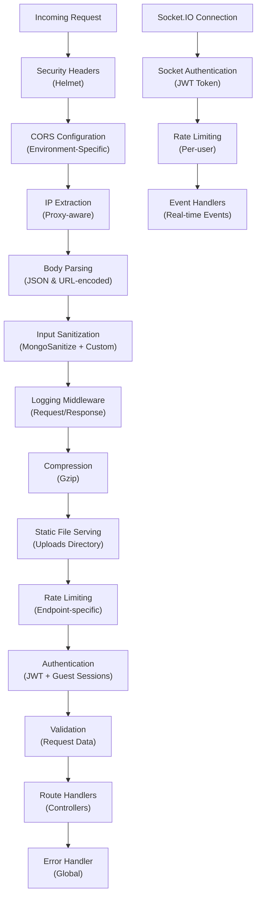

**Diagram sources**
- [server.js](file://backend/src/server.js#L30-L60)
- [socketServer.js](file://backend/src/socket/socketServer.js#L50-L80)

**Section sources**
- [server.js](file://backend/src/server.js#L30-L80)
- [security.js](file://backend/src/middleware/security.js#L1-L50)

## Core Authentication Middleware

The authentication system centers around JWT token validation specifically designed for guest sessions, providing secure access control while maintaining simplicity for anonymous users.

### JWT Token Validation

The authentication middleware implements a two-tier validation system:

1. **Token Extraction**: Extracts Bearer tokens from Authorization headers
2. **Token Verification**: Validates JWT signatures and claims
3. **Guest Session Validation**: Ensures only guest sessions are authorized

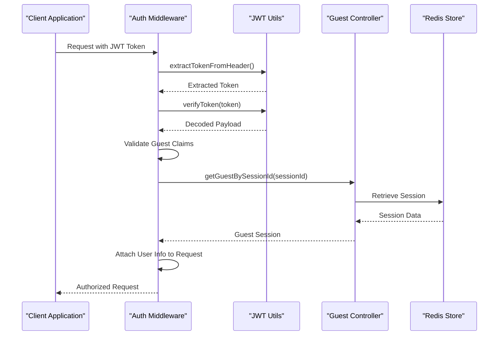

**Diagram sources**
- [auth.js](file://backend/src/middleware/auth.js#L5-L45)
- [jwt.js](file://backend/src/utils/jwt.js#L25-L45)
- [guestController.js](file://backend/src/controllers/guestController.js#L50-L80)

### Guest Session Management

Guest sessions are managed through Redis with automatic expiration and fallback mechanisms:

| Feature | Implementation | Security Benefit |
|---------|---------------|------------------|
| Session Generation | UUID-based identifiers | Unpredictable session IDs |
| Token Payload | `{userId, sessionId, username, isGuest}` | Minimal claim set reduces attack surface |
| Expiration Control | 2-hour JWT expiry | Limits session lifetime |
| Redis Storage | Persistent with TTL | Scalable session persistence |
| Fallback Storage | In-memory Map | Graceful degradation |
| Automatic Cleanup | 10-minute intervals | Prevents storage bloat |

**Section sources**
- [auth.js](file://backend/src/middleware/auth.js#L1-L100)
- [jwt.js](file://backend/src/utils/jwt.js#L1-L52)
- [guestController.js](file://backend/src/controllers/guestController.js#L1-L149)

## Security and Rate Limiting

The security middleware implements comprehensive protection measures including rate limiting, input sanitization, and security headers.

### Rate Limiting Strategies

Multiple rate limiters target different endpoint categories:

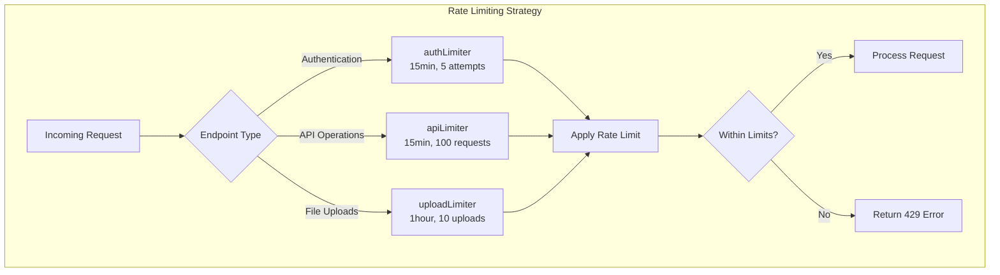

**Diagram sources**
- [security.js](file://backend/src/middleware/security.js#L10-L50)

### Security Headers Implementation

Helmet configuration provides comprehensive security headers:

| Header | Value | Purpose |
|--------|-------|---------|
| Content-Security-Policy | Strict defaults with allowed origins | Prevent XSS attacks |
| X-Content-Type-Options | nosniff | Block MIME type sniffing |
| X-Frame-Options | DENY | Prevent clickjacking |
| X-XSS-Protection | 1; mode=block | Enable XSS filtering |
| Referrer-Policy | strict-origin-when-cross-origin | Control referrer leakage |
| Permissions-Policy | Camera/microphone disabled | Restrict hardware access |

### Input Sanitization

Multi-layered sanitization protects against injection attacks:

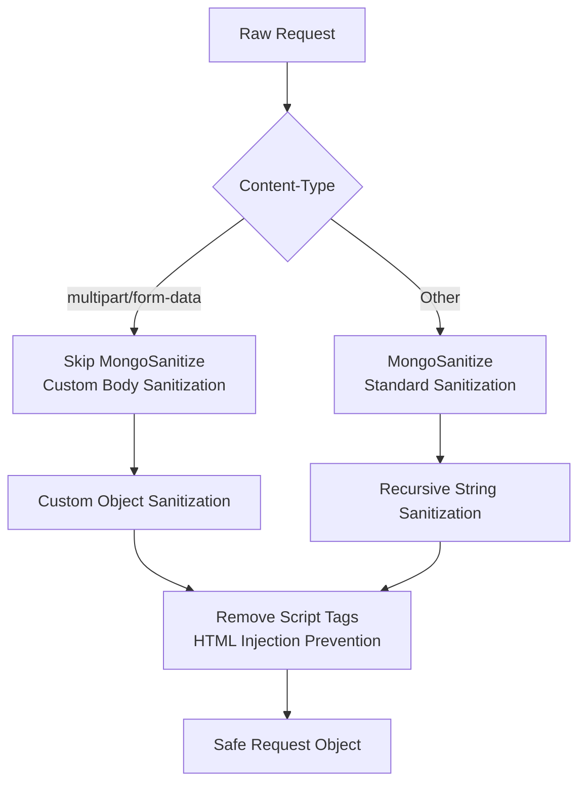

**Diagram sources**
- [security.js](file://backend/src/middleware/security.js#L120-L180)

**Section sources**
- [security.js](file://backend/src/middleware/security.js#L1-L332)

## Cross-Origin Resource Sharing (CORS)

The CORS configuration adapts to different environments with specialized debugging capabilities.

### Environment-Specific Configurations

| Environment | Configuration | Features |
|-------------|---------------|----------|
| Development | Permissive origins | All localhost variations, LAN IPs |
| Production | Strict whitelist | Vercel domains, explicit origins |
| Debug Mode | Specialized debugCors | Enhanced logging, relaxed rules |

### Debugging Capabilities

The CORS debug middleware provides enhanced visibility for production issues:

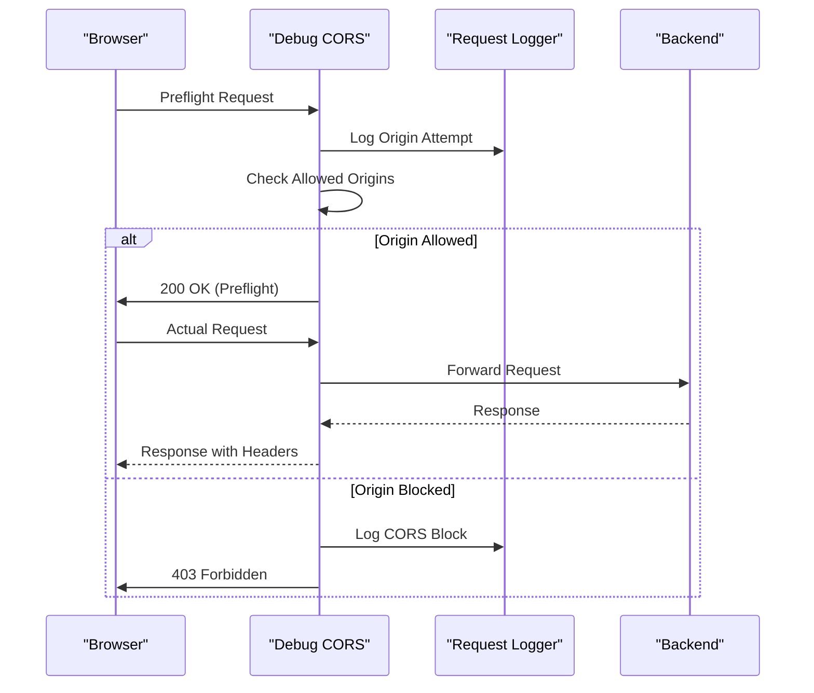

**Diagram sources**
- [cors-debug.js](file://backend/src/middleware/cors-debug.js#L1-L41)

**Section sources**
- [security.js](file://backend/src/middleware/security.js#L60-L120)
- [cors-debug.js](file://backend/src/middleware/cors-debug.js#L1-L41)

## File Upload Management

The upload middleware handles file processing, validation, and cleanup with comprehensive error handling.

### Supported File Types and Categories

| Category | File Types | Size Limits | Purpose |
|----------|------------|-------------|---------|
| Images | JPEG, PNG, GIF, WebP, SVG, BMP | 25MB | Profile pictures, shared images |
| Videos | MP4, WebM, OGG, AVI, MOV, WMV | 25MB | Video messages |
| Audio | MP3, WAV, OGG, WebM, M4A, AAC | 25MB | Voice notes |
| Documents | PDF, TXT, CSV, JSON, XML, Office | 25MB | Shared documents |
| Archives | ZIP, RAR, TAR, GZIP | 25MB | Compressed files |

### Upload Processing Pipeline

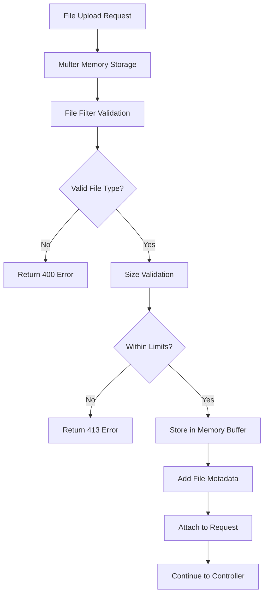

**Diagram sources**
- [upload.js](file://backend/src/middleware/upload.js#L150-L200)

### Automatic Cleanup System

The cleanup system maintains optimal storage usage:

| Cleanup Trigger | Frequency | Retention Period | Action |
|----------------|-----------|------------------|--------|
| Scheduled Task | Every hour | 24 hours | Remove old temporary files |
| Startup Task | 5 seconds after boot | N/A | Initial cleanup run |
| Manual Trigger | On-demand | Configurable | Immediate cleanup |

**Section sources**
- [upload.js](file://backend/src/middleware/upload.js#L1-L249)

## Request Validation

The validation middleware ensures data integrity and prevents malicious input through comprehensive schema validation.

### Validation Schema Definitions

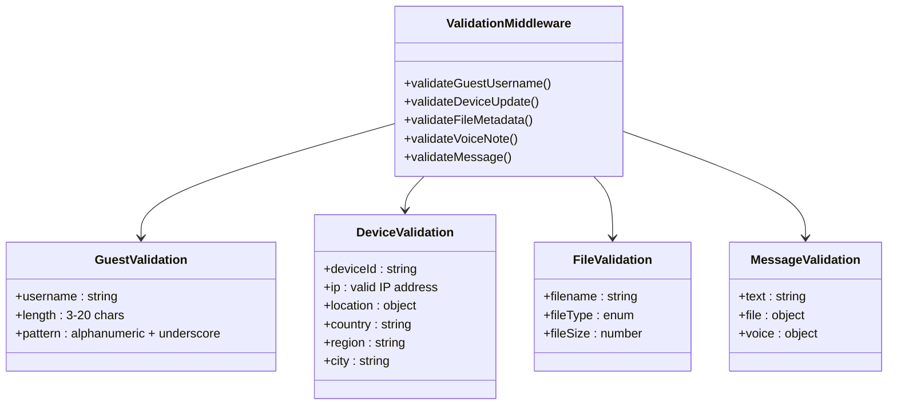

**Diagram sources**
- [validation.js](file://backend/src/middleware/validation.js#L1-L112)

### Socket Message Validation

Real-time message validation ensures data integrity in WebSocket communications:

| Message Type | Validation Criteria | Error Handling |
|-------------|-------------------|----------------|
| Text Messages | Non-empty, ≤1000 chars | Return false for invalid |
| File Messages | Filename, type, size present | Return false for missing fields |
| Voice Messages | Duration ≤300s, size ≤10MB | Return false for out-of-range values |

**Section sources**
- [validation.js](file://backend/src/middleware/validation.js#L1-L112)

## Middleware Execution Order

Understanding the middleware execution order is crucial for debugging and optimization.

### HTTP Request Lifecycle

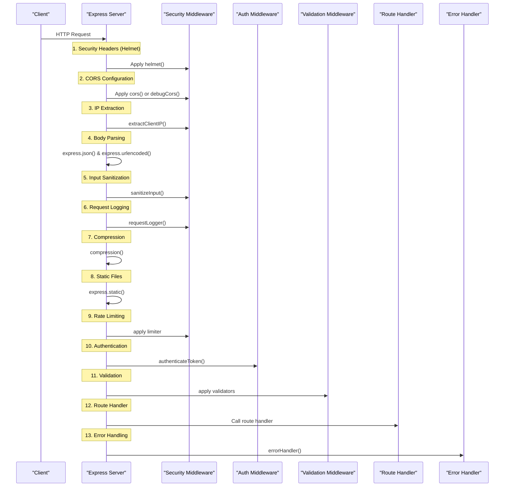

**Diagram sources**
- [server.js](file://backend/src/server.js#L30-L80)

### Socket.IO Middleware Order

Socket.IO connections follow a slightly different order:

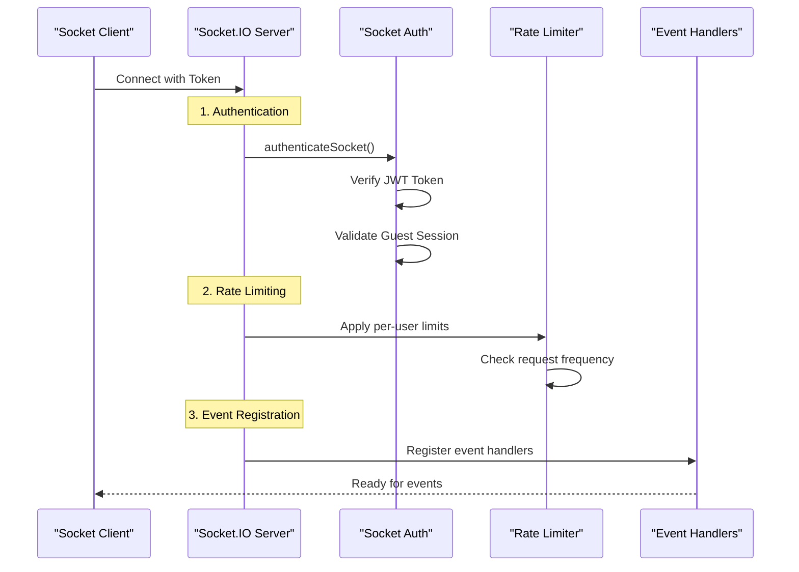

**Diagram sources**
- [socketServer.js](file://backend/src/socket/socketServer.js#L50-L80)

**Section sources**
- [server.js](file://backend/src/server.js#L80-L150)
- [socketServer.js](file://backend/src/socket/socketServer.js#L50-L100)

## Socket.IO Authentication

Socket.IO authentication differs from HTTP authentication with real-time token validation and per-connection session management.

### Authentication Flow

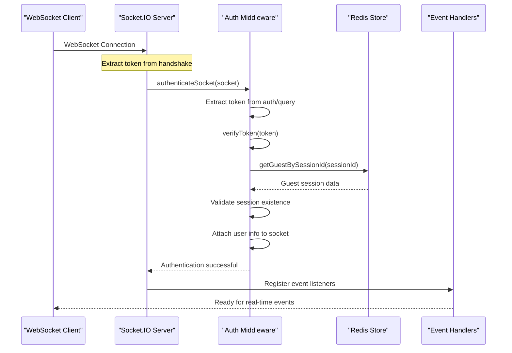

**Diagram sources**
- [auth.js](file://backend/src/middleware/auth.js#L50-L90)
- [socketServer.js](file://backend/src/socket/socketServer.js#L50-L80)

### Per-User Rate Limiting

Socket.IO implements dynamic rate limiting based on user activity:

| Metric | Threshold | Window | Action |
|--------|-----------|--------|--------|
| Event Frequency | 100 events/min | 1 minute | Block excessive requests |
| Connection Attempts | 5 attempts/min | 1 minute | Prevent brute force |
| Room Joins | 20 joins/min | 1 minute | Limit resource consumption |

**Section sources**
- [auth.js](file://backend/src/middleware/auth.js#L50-L100)
- [socketServer.js](file://backend/src/socket/socketServer.js#L50-L120)

## Error Handling Strategy

The error handling middleware provides comprehensive error management with environment-specific responses.

### Error Classification and Response

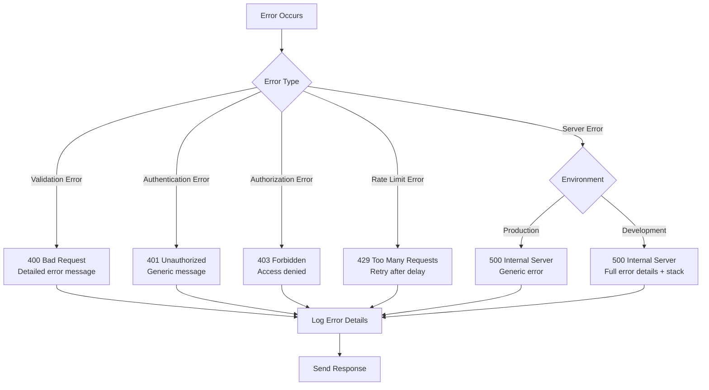

**Diagram sources**
- [security.js](file://backend/src/middleware/security.js#L280-L332)

### Logging Strategy

Error logs include comprehensive contextual information:

| Information | Purpose | Example |
|-------------|---------|---------|
| Error Message | Quick diagnosis | "Token has expired" |
| Stack Trace | Development debugging | Full call stack |
| Request Method | Endpoint identification | GET, POST, DELETE |
| URL Path | Route analysis | /api/users/profile |
| Client IP | Security investigation | 192.168.1.100 |
| User Agent | Browser/device info | Chrome 120.0.0.0 |

**Section sources**
- [security.js](file://backend/src/middleware/security.js#L280-L332)

## Performance Considerations

Middleware performance impacts application responsiveness and scalability. Understanding overhead helps optimize the system.

### Performance Impact Analysis

| Middleware Component | CPU Overhead | Memory Usage | Network Impact | Optimization Strategy |
|---------------------|--------------|--------------|----------------|----------------------|
| Helmet | Low | Minimal | None | Enable in production only |
| Rate Limiting | Medium | Small | None | Use Redis for distributed systems |
| Input Sanitization | Medium | Medium | None | Cache frequently used patterns |
| JWT Verification | Low-Medium | Small | None | Use hardware acceleration |
| Redis Operations | Medium-High | Medium | Network latency | Connection pooling, pipelining |
| File Upload Processing | High | High | Bandwidth intensive | Stream processing, compression |

### Optimization Techniques

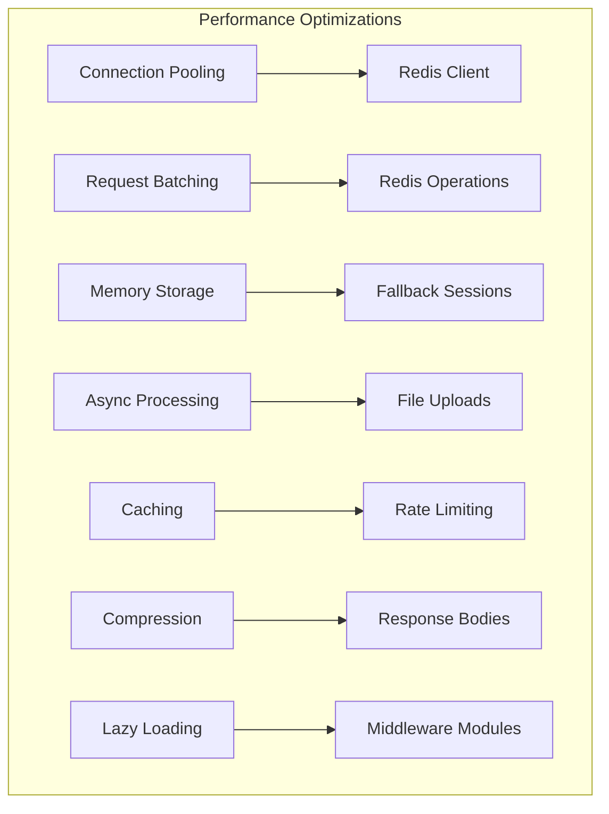

### Monitoring Metrics

Key performance indicators to track:

| Metric | Measurement | Target | Alert Threshold |
|--------|-------------|--------|----------------|
| Request Latency | Milliseconds | <100ms | >500ms |
| Memory Usage | MB | <512MB | >1GB |
| Redis Response Time | Milliseconds | <10ms | >50ms |
| Rate Limit Hits | Per minute | Monitor trends | Sudden spikes |
| File Upload Failures | Percentage | <1% | >5% |

## Common Issues and Solutions

### CORS Configuration Problems

**Issue**: Cross-origin requests failing in production
**Symptoms**: 403 Forbidden errors, preflight failures
**Solution**: Use debugCors middleware for production troubleshooting

**Issue**: Development CORS conflicts
**Symptoms**: Mixed content warnings, blocked requests
**Solution**: Configure permissiveCors for development debugging

### Token Expiration Issues

**Issue**: Guest sessions expiring unexpectedly
**Symptoms**: 401 Unauthorized errors during active sessions
**Root Cause**: Redis connectivity issues or session cleanup
**Solution**: Implement fallback storage and monitor Redis health

**Issue**: JWT verification failures
**Symptoms**: "Invalid token" errors despite valid tokens
**Solution**: Check JWT_SECRET consistency across deployments

### Rate Limiting Conflicts

**Issue**: Legitimate users hitting rate limits
**Symptoms**: 429 Too Many Requests errors
**Solution**: Adjust rate limit thresholds based on usage patterns

**Issue**: Distributed system inconsistencies
**Symptoms**: Rate limits not applying consistently
**Solution**: Use Redis-based rate limiting for multi-instance deployments

### File Upload Problems

**Issue**: Large file uploads timing out
**Symptoms**: 413 Payload Too Large errors
**Solution**: Increase MAX_FILE_SIZE and adjust upload timeouts

**Issue**: Memory exhaustion during uploads
**Symptoms**: Out of memory errors
**Solution**: Implement streaming uploads and memory monitoring

### Socket.IO Connection Issues

**Issue**: Frequent disconnections
**Symptoms**: "Transport error" messages
**Solution**: Adjust pingTimeout and pingInterval settings

**Issue**: Authentication failures in Socket.IO
**Symptoms**: "Authentication token required" errors
**Solution**: Ensure token is passed in handshake auth or query parameters

## Best Practices

### Security Hardening

1. **Always use HTTPS** in production environments
2. **Rotate JWT secrets** regularly
3. **Monitor rate limit hits** for potential abuse
4. **Implement proper CORS policies** for production
5. **Use environment-specific configurations** for debugging

### Performance Optimization

1. **Enable compression** for all responses
2. **Use Redis for session storage** in production
3. **Implement connection pooling** for database operations
4. **Monitor middleware performance** continuously
5. **Optimize file upload processing** with streaming

### Development Workflow

1. **Use debugCors** for production issue diagnosis
2. **Implement comprehensive logging** for all middleware
3. **Test rate limiting** under load conditions
4. **Validate CORS configurations** across environments
5. **Monitor error rates** and implement alerting

### Deployment Considerations

1. **Configure appropriate rate limits** for production
2. **Set up Redis clustering** for high availability
3. **Implement health checks** for all middleware components
4. **Monitor resource usage** during peak loads
5. **Plan for graceful degradation** when Redis is unavailable

The middleware architecture provides a robust foundation for secure, scalable real-time communication while maintaining excellent performance characteristics. Regular monitoring and optimization ensure continued reliability as the application scales.