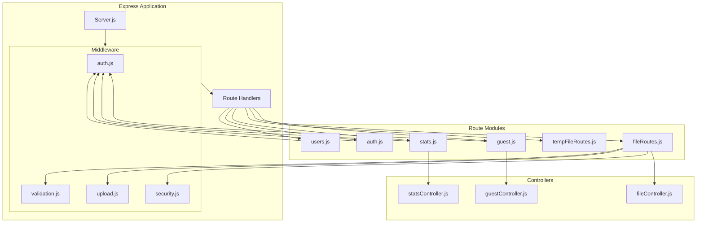
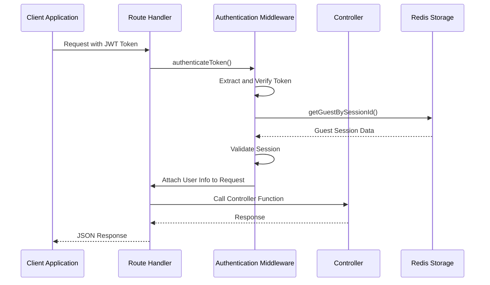
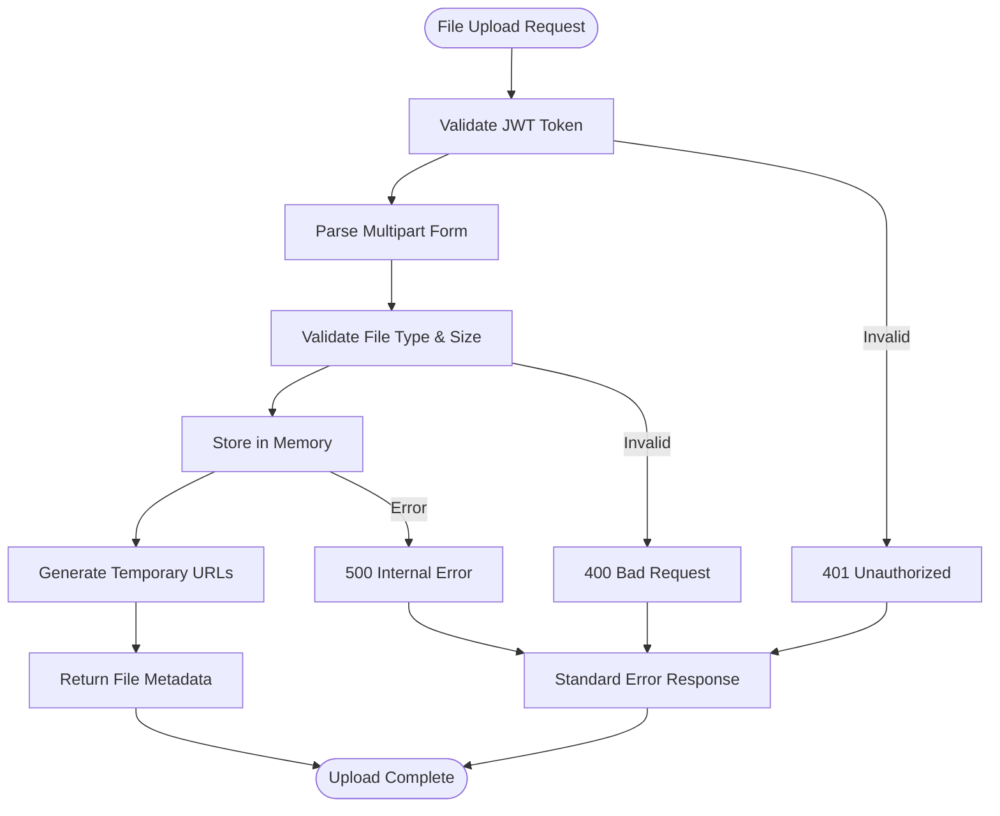

# Routing System

<cite>
**Referenced Files in This Document**
- [backend/src/server.js](file://backend/src/server.js)
- [backend/src/routes/guest.js](file://backend/src/routes/guest.js)
- [backend/src/routes/fileRoutes.js](file://backend/src/routes/fileRoutes.js)
- [backend/src/routes/tempFileRoutes.js](file://backend/src/routes/tempFileRoutes.js)
- [backend/src/routes/stats.js](file://backend/src/routes/stats.js)
- [backend/src/routes/auth.js](file://backend/src/routes/auth.js)
- [backend/src/routes/users.js](file://backend/src/routes/users.js)
- [backend/src/controllers/guestController.js](file://backend/src/controllers/guestController.js)
- [backend/src/controllers/fileController.js](file://backend/src/controllers/fileController.js)
- [backend/src/middleware/security.js](file://backend/src/middleware/security.js)
- [backend/src/middleware/auth.js](file://backend/src/middleware/auth.js)
- [backend/src/utils/tempFileStorage.js](file://backend/src/utils/tempFileStorage.js)
- [backend/API_DOCUMENTATION.md](file://backend/API_DOCUMENTATION.md)
</cite>

## Table of Contents
1. [Introduction](#introduction)
2. [Routing Architecture Overview](#routing-architecture-overview)
3. [Core Route Modules](#core-route-modules)
4. [Authentication and Authorization](#authentication-and-authorization)
5. [Rate Limiting and Security](#rate-limiting-and-security)
6. [Health Check Endpoints](#health-check-endpoints)
7. [Error Handling and 404 Responses](#error-handling-and-404-responses)
8. [File Upload and Temporary File Routes](#file-upload-and-temporary-file-routes)
9. [Statistics and Monitoring](#statistics-and-monitoring)
10. [Troubleshooting Guide](#troubleshooting-guide)
11. [Design Decisions and Extension Points](#design-decisions-and-extension-points)

## Introduction

The Realtime Chat App's Backend Routing System provides a comprehensive REST API infrastructure built on Express.js with specialized routing modules for different functional areas. The system implements a modular architecture where each route group serves specific business domains, including guest session management, file operations, statistics collection, and real-time communication support.

The routing system emphasizes security through rate limiting, authentication middleware, and input sanitization while maintaining high performance for real-time features. It supports both REST API endpoints and Socket.IO integration for real-time communication.

## Routing Architecture Overview

The routing system follows a modular design pattern with dedicated route files for different functional areas. Each route module exports an Express Router instance that handles specific URL patterns and HTTP methods.



**Diagram sources**
- [backend/src/server.js](file://backend/src/server.js#L110-L153)
- [backend/src/routes/guest.js](file://backend/src/routes/guest.js#L1-L83)
- [backend/src/routes/fileRoutes.js](file://backend/src/routes/fileRoutes.js#L1-L41)

**Section sources**
- [backend/src/server.js](file://backend/src/server.js#L110-L153)
- [backend/src/routes/guest.js](file://backend/src/routes/guest.js#L1-L83)

## Core Route Modules

### Guest Session Management (guest.js)

The guest session management routes handle anonymous user creation, authentication, and session maintenance. These endpoints are designed specifically for guest users who don't require traditional registration.

| Route | Method | Description | Authentication |
|-------|--------|-------------|----------------|
| `/api/guest/me` | GET | Get current guest user information | JWT Token Required |
| `/api/guest/username` | GET | Generate random username for guest | Public Access |
| `/api/guest` | POST | Create guest session and return JWT token | Username Validation Required |
| `/api/guest/:sessionId` | GET | Get guest session information | Public Access |
| `/api/guest/location` | POST | Update guest location information | JWT Token Required |

The guest routes delegate to the `guestController` functions, which handle business logic for session management, username generation, and presence updates. The controller functions are designed to work with Redis-based guest session storage for scalability.

**Section sources**
- [backend/src/routes/guest.js](file://backend/src/routes/guest.js#L1-L83)
- [backend/src/controllers/guestController.js](file://backend/src/controllers/guestController.js#L1-L149)

### File Upload Routes (fileRoutes.js)

File upload routes handle both general file uploads and voice note uploads with specialized validation and processing for each type.

| Route | Method | Description | Authentication | Rate Limiting |
|-------|--------|-------------|----------------|---------------|
| `/api/files/upload` | POST | Upload general files (up to 25MB) | JWT Token Required | Yes |
| `/api/files/voice` | POST | Upload voice notes (up to 5 minutes) | JWT Token Required | Yes |
| `/api/files/debug/users` | GET | Debug endpoint for connected users | Public Access | No |

The file upload system implements comprehensive validation including file size limits, MIME type filtering, and metadata validation. Uploaded files are processed through multer middleware for memory-based storage before being transferred to temporary storage.

**Section sources**
- [backend/src/routes/fileRoutes.js](file://backend/src/routes/fileRoutes.js#L1-L41)
- [backend/src/controllers/fileController.js](file://backend/src/controllers/fileController.js#L1-L141)

### Temporary File Serving (tempFileRoutes.js)

Temporary file routes provide secure access to uploaded files with automatic expiration and download capabilities.

| Route | Method | Description | Authentication | CORS Headers |
|-------|--------|-------------|----------------|--------------|
| `/api/temp-files/temp/:fileId` | GET | Serve temporary file inline | None | Yes |
| `/api/temp-files/download/:fileId` | GET | Download temporary file | None | Yes |
| `/api/temp-files/info/:fileId` | GET | Get file metadata without download | None | Yes |
| `/api/temp-files/stats` | GET | Get storage statistics (admin) | None | Yes |

The temporary file system uses in-memory storage with automatic cleanup of expired files. Each file has a configurable expiration time and is associated with a specific room for chat context.

**Section sources**
- [backend/src/routes/tempFileRoutes.js](file://backend/src/routes/tempFileRoutes.js#L1-L172)
- [backend/src/utils/tempFileStorage.js](file://backend/src/utils/tempFileStorage.js#L1-L237)

### Statistics and Monitoring (stats.js)

Statistics routes provide real-time system monitoring and user presence information for administrative purposes.

| Route | Method | Description | Authentication |
|-------|--------|-------------|----------------|
| `/api/stats` | GET | Get current system statistics | JWT Token Required |
| `/api/stats/online-users` | GET | Get list of currently online users | JWT Token Required |

These endpoints aggregate data from Redis-based guest session management to provide real-time insights into system usage and user activity patterns.

**Section sources**
- [backend/src/routes/stats.js](file://backend/src/routes/stats.js#L1-L88)

## Authentication and Authorization

The routing system implements JWT-based authentication specifically designed for guest users. The authentication middleware validates tokens and ensures only authorized guests can access protected endpoints.



**Diagram sources**
- [backend/src/middleware/auth.js](file://backend/src/middleware/auth.js#L1-L100)
- [backend/src/routes/guest.js](file://backend/src/routes/guest.js#L10-L20)

### Authentication Flow

The authentication system follows these steps:

1. **Token Extraction**: JWT tokens are extracted from the Authorization header
2. **Token Verification**: Tokens are validated using HMAC signature verification
3. **Session Validation**: Guest session existence is verified in Redis
4. **Request Enhancement**: User information is attached to the request object
5. **Access Control**: Only guest sessions are permitted for guest routes

**Section sources**
- [backend/src/middleware/auth.js](file://backend/src/middleware/auth.js#L1-L100)

## Rate Limiting and Security

The routing system implements comprehensive rate limiting and security measures to protect against abuse and ensure system stability.

### Rate Limiting Configuration

| Endpoint Type | Window Size | Max Requests | Message |
|---------------|-------------|--------------|---------|
| Authentication | 15 minutes | 50 requests | Too many auth attempts |
| General API | 15 minutes | 100 requests | Too many API requests |
| File Upload | 1 hour | 10 uploads | Too many file uploads |

### Security Middleware Stack

The security middleware provides multiple layers of protection:

1. **Helmet.js**: Security headers for XSS, clickjacking, and MIME-type attacks
2. **CORS Configuration**: Origin-based access control with development flexibility
3. **Input Sanitization**: Protection against NoSQL injection and XSS attacks
4. **Rate Limiting**: Per-IP request throttling
5. **IP Extraction**: Proper client IP detection through proxies

### Why No Rate Limiting on File Serving?

File serving routes (`tempFileRoutes`) intentionally exclude rate limiting because:

- **Performance Optimization**: File downloads shouldn't be throttled
- **User Experience**: Streaming media requires uninterrupted access
- **Resource Management**: File serving is handled by in-memory storage with automatic cleanup
- **Different Usage Patterns**: File serving is typically less frequent than API requests

**Section sources**
- [backend/src/middleware/security.js](file://backend/src/middleware/security.js#L1-L332)
- [backend/src/server.js](file://backend/src/server.js#L110-L153)

## Health Check Endpoints

The system provides comprehensive health monitoring through dedicated endpoints that report server status, uptime, and operational metrics.

### Primary Health Check

**Endpoint**: `GET /health`

**Response Schema**:
```json
{
  "success": true,
  "message": "Server is running",
  "timestamp": "2023-01-01T00:00:00.000Z",
  "uptime": 3600,
  "version": "1.0.0"
}
```

### Socket.IO Statistics Endpoint

**Endpoint**: `GET /api/socket/stats`

**Response Schema**:
```json
{
  "success": true,
  "data": {
    "connectedSockets": 25,
    "rooms": 12,
    "namespace": "/"
  }
}
```

### CORS Debug Endpoint

**Endpoint**: `GET /api/cors-test`

**Purpose**: Validates CORS configuration in production environments.

**Section sources**
- [backend/src/server.js](file://backend/src/server.js#L85-L105)
- [backend/API_DOCUMENTATION.md](file://backend/API_DOCUMENTATION.md#L610-L709)

## Error Handling and 404 Responses

The routing system implements comprehensive error handling with standardized response formats and graceful degradation.

### Standardized Error Response Format

All error responses follow a consistent JSON schema:

```json
{
  "success": false,
  "message": "Error description",
  "errors": [
    {
      "field": "fieldName",
      "message": "Field-specific error"
    }
  ]
}
```

### Common Error Scenarios

| HTTP Status | Scenario | Response Example |
|-------------|----------|------------------|
| 400 | Bad Request (validation) | Field validation errors |
| 401 | Unauthorized | Invalid or missing token |
| 403 | Forbidden | Insufficient permissions |
| 404 | Not Found | API endpoint not found |
| 413 | Payload Too Large | File too large |
| 429 | Too Many Requests | Rate limit exceeded |
| 500 | Internal Server Error | Server-side error |

### 404 Handler Implementation

The system includes a catch-all 404 handler that responds consistently regardless of the requested endpoint:

```javascript
app.use((req, res) => {
  res.status(404).json({
    success: false,
    message: "API endpoint not found",
  });
});
```

**Section sources**
- [backend/src/server.js](file://backend/src/server.js#L140-L153)
- [backend/API_DOCUMENTATION.md](file://backend/API_DOCUMENTATION.md#L680-L709)

## File Upload and Temporary File Routes

The file upload system provides comprehensive support for various file types with specialized handling for different content categories.

### Supported File Types

| Category | MIME Types | Size Limit | Duration Limit |
|----------|------------|------------|----------------|
| Images | `image/*` | 25MB | N/A |
| Videos | `video/*` | 25MB | N/A |
| Audio | `audio/*` | 25MB | N/A |
| Documents | Various | 25MB | N/A |

### File Upload Workflow



**Diagram sources**
- [backend/src/controllers/fileController.js](file://backend/src/controllers/fileController.js#L1-L141)
- [backend/src/middleware/upload.js](file://backend/src/middleware/upload.js#L1-L249)

### Temporary File Lifecycle

1. **Upload**: Files are uploaded to memory storage
2. **Processing**: Metadata is extracted and validation occurs
3. **Temporary Storage**: Files are moved to in-memory temporary storage
4. **Expiration**: Automatic cleanup of expired files (default: 2 hours)
5. **Access**: Secure access through temporary URLs
6. **Cleanup**: Periodic cleanup of expired and unused files

**Section sources**
- [backend/src/controllers/fileController.js](file://backend/src/controllers/fileController.js#L1-L141)
- [backend/src/utils/tempFileStorage.js](file://backend/src/utils/tempFileStorage.js#L1-L237)

## Statistics and Monitoring

The statistics system provides real-time insights into system performance and user activity patterns.

### Available Statistics Endpoints

| Endpoint | Purpose | Data Included |
|----------|---------|---------------|
| `/api/stats` | Comprehensive system stats | User counts, online status, timestamps |
| `/api/stats/online-users` | Active user list | User profiles, presence status |

### Statistics Data Structure

```json
{
  "success": true,
  "data": {
    "stats": {
      "totalUsers": 150,
      "onlineUsers": 25,
      "availableUsers": 18,
      "connectedUsers": 7
    },
    "onlineUsers": [
      {
        "id": "user-id",
        "username": "john_doe",
        "isOnline": true,
        "isSearching": false,
        "lastSeen": "2023-01-01T00:00:00.000Z",
        "isGuest": true
      }
    ],
    "timestamp": "2023-01-01T00:00:00.000Z"
  }
}
```

**Section sources**
- [backend/src/routes/stats.js](file://backend/src/routes/stats.js#L1-L88)

## Troubleshooting Guide

### Common Routing Issues

#### 404 Not Found Errors

**Symptoms**: Requests return 404 status with "API endpoint not found"

**Causes and Solutions**:

1. **Incorrect URL Pattern**
   - Verify the exact route pattern matches the documented schema
   - Check for trailing slashes or missing parameters

2. **Missing Route Registration**
   - Ensure the route module is properly imported in `server.js`
   - Verify the route prefix matches the registration pattern

3. **Middleware Interference**
   - Check if authentication middleware is blocking legitimate requests
   - Verify CORS configuration allows the request origin

#### Authentication Failures

**Symptoms**: 401 Unauthorized responses on protected endpoints

**Causes and Solutions**:

1. **Invalid JWT Token**
   - Verify token format and signature
   - Check token expiration
   - Ensure token hasn't been revoked

2. **Guest Session Expired**
   - Verify the guest session still exists in Redis
   - Check session expiration timestamps
   - Regenerate guest session if necessary

#### Rate Limiting Issues

**Symptoms**: 429 Too Many Requests responses

**Causes and Solutions**:

1. **Exceeded Rate Limits**
   - Wait for the rate limit window to reset (typically 15 minutes)
   - Reduce request frequency for the endpoint
   - Implement exponential backoff in client applications

2. **Development Environment**
   - Rate limiting is disabled for health check endpoints
   - Verify the request isn't being blocked by CORS or other middleware

### File Upload Issues

#### File Size Exceeds Limits

**Symptoms**: 413 Payload Too Large responses

**Solutions**:
- Reduce file size to under 25MB
- Compress images and videos before upload
- Split large files into smaller chunks

#### Unsupported File Types

**Symptoms**: 400 Bad Request with file type error

**Solutions**:
- Verify file MIME type is supported
- Check file extension matches content type
- Convert unsupported formats to supported alternatives

### Performance Issues

#### Slow Response Times

**Diagnostic Steps**:
1. Check Redis connectivity and performance
2. Monitor memory usage and garbage collection
3. Review rate limiting configurations
4. Analyze request logs for bottlenecks

**Common Solutions**:
- Increase Redis connection pool size
- Optimize database queries in controllers
- Implement caching for frequently accessed data
- Scale horizontally with multiple instances

**Section sources**
- [backend/src/server.js](file://backend/src/server.js#L140-L153)
- [backend/API_DOCUMENTATION.md](file://backend/API_DOCUMENTATION.md#L680-L709)

## Design Decisions and Extension Points

### Architectural Design Principles

1. **Modular Organization**: Each route module serves a specific functional domain
2. **Separation of Concerns**: Controllers handle business logic, routes handle HTTP concerns
3. **Security First**: Authentication and rate limiting applied consistently across endpoints
4. **Performance Optimization**: Memory-based temporary file storage for fast access
5. **Scalability**: Redis integration for horizontal scaling capabilities

### Extension Points for New Endpoints

#### Adding New Route Modules

To add a new route module:

1. **Create Route File**: Follow the existing pattern in `routes/` directory
2. **Implement Controller Functions**: Place in `controllers/` directory
3. **Add Middleware Dependencies**: Include necessary security and validation middleware
4. **Register Route**: Add to route registration in `server.js`
5. **Update Documentation**: Add endpoint documentation to API documentation

#### Authentication Extensions

The current authentication system can be extended to support:

1. **Multi-tenant Authentication**: Extend JWT payload with tenant information
2. **Role-based Access Control**: Add role validation to existing middleware
3. **OAuth Integration**: Support external authentication providers
4. **Two-factor Authentication**: Add TOTP or SMS-based verification

#### Rate Limiting Extensions

Rate limiting can be enhanced with:

1. **Dynamic Rate Limits**: Adjust limits based on user type or subscription level
2. **Geographic Rate Limiting**: Different limits based on geographic regions
3. **Endpoint-specific Limits**: More granular control over individual endpoints
4. **Machine Learning**: Adaptive rate limiting based on traffic patterns

#### File Upload Extensions

File upload capabilities can be expanded to include:

1. **Cloud Storage Integration**: Support for S3, Google Cloud Storage, Azure Blob
2. **Video Transcoding**: Automatic conversion of video formats
3. **Image Optimization**: Automatic resizing and compression
4. **Virus Scanning**: Integration with antivirus services
5. **File Versioning**: Support for multiple versions of the same file

### Future Enhancement Opportunities

1. **GraphQL Integration**: Add GraphQL endpoints alongside REST API
2. **Webhook System**: Support for external system notifications
3. **Audit Logging**: Comprehensive audit trail for all actions
4. **Metrics Export**: Prometheus-compatible metrics endpoints
5. **API Versioning**: Support for multiple API versions simultaneously

**Section sources**
- [backend/src/server.js](file://backend/src/server.js#L110-L153)
- [backend/src/routes/guest.js](file://backend/src/routes/guest.js#L1-L83)