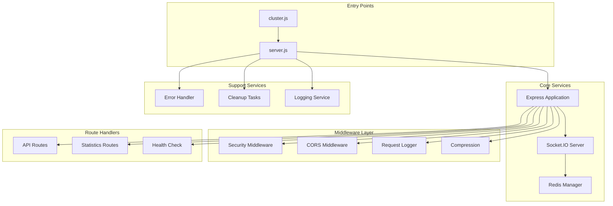
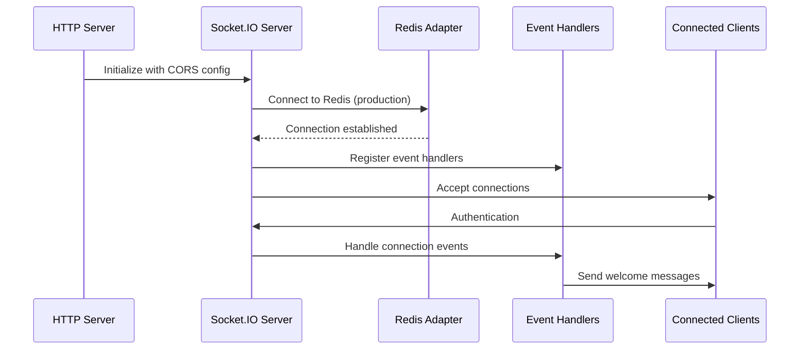
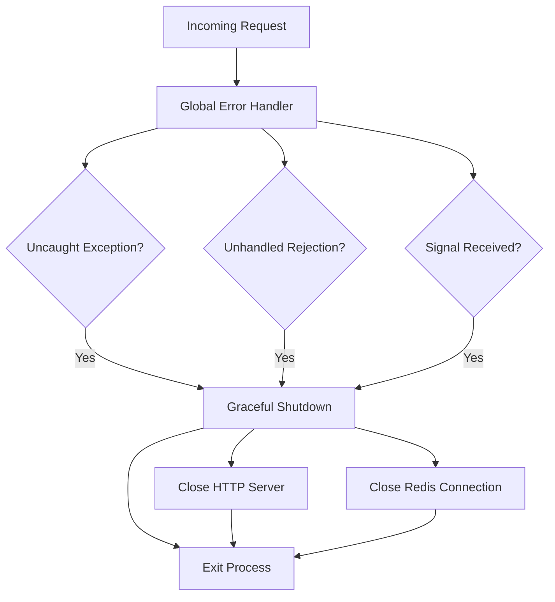
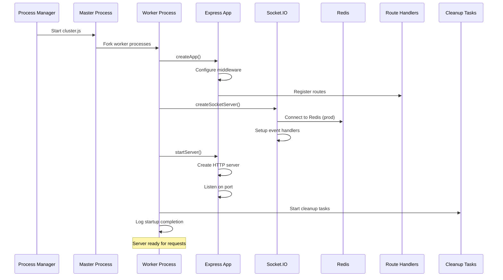
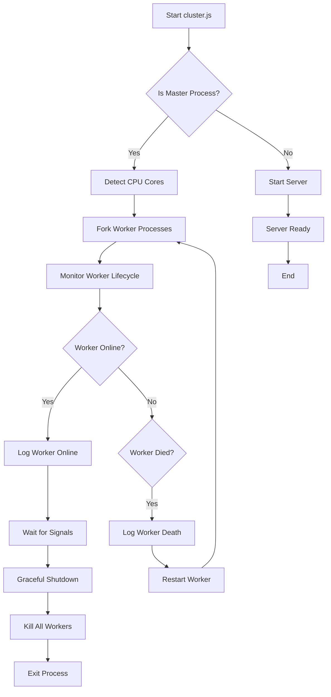

# Server Initialization

<cite>
**Referenced Files in This Document**
- [server.js](file://backend/src/server.js)
- [cluster.js](file://backend/src/cluster.js)
- [socketServer.js](file://backend/src/socket/socketServer.js)
- [security.js](file://backend/src/middleware/security.js)
- [cors-debug.js](file://backend/src/middleware/cors-debug.js)
- [redisGuestManager.js](file://backend/src/utils/redisGuestManager.js)
- [stats.js](file://backend/src/routes/stats.js)
- [package.json](file://backend/package.json)
- [.env](file://backend/.env)
- [ecosystem.config.js](file://backend/ecosystem.config.js)
</cite>

## Table of Contents
1. [Introduction](#introduction)
2. [System Architecture Overview](#system-architecture-overview)
3. [Main Entry Point - server.js](#main-entry-point---serverjs)
4. [Application Creation and Middleware Configuration](#application-creation-and-middleware-configuration)
5. [Server Startup Orchestration](#server-startup-orchestration)
6. [Cluster Management](#cluster-management)
7. [Socket.IO Integration](#socketio-integration)
8. [Error Handling and Cleanup](#error-handling-and-cleanup)
9. [Health Monitoring](#health-monitoring)
10. [Production vs Development Behaviors](#production-vs-development-behaviors)
11. [Startup Sequence Diagram](#startup-sequence-diagram)
12. [Cluster Initialization Flow](#cluster-initialization-flow)
13. [Conclusion](#conclusion)

## Introduction

The Realtime Chat App's backend server initialization process is a sophisticated orchestration of multiple components that ensures secure, scalable, and reliable operation. The system employs a modular architecture with clear separation of concerns, utilizing Express.js for HTTP routing, Socket.IO for real-time communication, and Redis for distributed state management.

The initialization process encompasses several critical phases: application creation with comprehensive middleware configuration, server startup with graceful error handling, cluster management for multi-core utilization, and comprehensive health monitoring. This documentation provides an in-depth analysis of each component and their interactions during the server initialization lifecycle.

## System Architecture Overview

The backend follows a layered architecture pattern with distinct responsibilities:

**Diagram sources**
- [server.js](file://backend/src/server.js#L1-L265)
- [cluster.js](file://backend/src/cluster.js#L1-L59)
- [socketServer.js](file://backend/src/socket/socketServer.js#L1-L199)

## Main Entry Point - server.js

The [`server.js`](file://backend/src/server.js) file serves as the primary entry point for the application, containing two critical functions that orchestrate the entire server initialization process.

### Module Dependencies and Configuration

The server establishes foundational dependencies including Express.js framework, HTTP server, and essential configuration modules. The environment configuration is loaded early to ensure all subsequent components have access to required settings.

### Exported Functions

The module exports two primary functions:
- `createApp()`: Initializes and configures the Express application with all middleware
- `startServer()`: Orchestrates the complete server startup sequence

**Section sources**
- [server.js](file://backend/src/server.js#L1-L20)

## Application Creation and Middleware Configuration

The [`createApp()`](file://backend/src/server.js#L22-L60) function represents the heart of the middleware configuration, establishing a comprehensive security and performance pipeline.

### Security Headers Implementation

The application implements robust security measures through Helmet middleware, which provides essential HTTP headers for protection against well-known vulnerabilities. The configuration includes Content Security Policy (CSP) directives that restrict resource loading to trusted sources while allowing WebSocket connections for real-time functionality.

### CORS Configuration Strategy

The system employs a dual-CORS strategy:
- **Development Environment**: Standard CORS configuration allowing all origins
- **Production Environment**: Debug CORS configuration for production issue diagnosis
- **Fallback**: Permissive CORS for emergency debugging scenarios

### Body Parsing and Sanitization

The middleware stack includes comprehensive input handling:
- JSON body parsing with size limits (10MB)
- URL-encoded form data parsing with extended support
- Input sanitization to prevent MongoDB injection attacks
- Compression middleware for performance optimization

### Static File Serving

The application serves uploaded files from the `/uploads` endpoint, providing secure access to user-generated content while maintaining proper file system isolation.

**Section sources**
- [server.js](file://backend/src/server.js#L22-L60)
- [security.js](file://backend/src/middleware/security.js#L1-L332)
- [cors-debug.js](file://backend/src/middleware/cors-debug.js#L1-L41)

## Server Startup Orchestration

The [`startServer()`](file://backend/src/server.js#L145-L180) function orchestrates the complete server startup sequence, coordinating multiple asynchronous initialization tasks.

### Sequential Initialization Process

1. **Application Creation**: Calls `createApp()` to establish the Express instance
2. **HTTP Server Setup**: Creates HTTP server instance with the configured Express app
3. **Socket.IO Integration**: Initializes real-time communication infrastructure
4. **Route Registration**: Establishes API endpoints and health checks
5. **Error Handling Setup**: Configures global error handling and graceful shutdown
6. **Background Tasks**: Starts cleanup and maintenance routines

### Asynchronous Resource Initialization

The server performs non-blocking initialization of external resources:
- **Redis Connection**: Attempted asynchronously to prevent blocking the main thread
- **File Cleanup**: Scheduled cleanup tasks for uploaded files
- **Logging Configuration**: Established logging infrastructure

### Port and Environment Configuration

The server automatically detects the appropriate port and environment settings, with sensible defaults for development and production environments.

**Section sources**
- [server.js](file://backend/src/server.js#L145-L180)

## Cluster Management

The [`cluster.js`](file://backend/src/cluster.js) module enables multi-core utilization through Node.js cluster capabilities, providing horizontal scalability and fault tolerance.

### Master Process Coordination

The master process manages worker lifecycle:
- **CPU Core Detection**: Automatically determines optimal worker count
- **Worker Forking**: Spawns worker processes for parallel request handling
- **Load Distribution**: Distributes incoming connections across workers
- **Graceful Shutdown**: Coordinates graceful termination during deployment

### Worker Process Management

Each worker process independently starts the server through the [`startServer()`](file://backend/src/server.js#L145-L180) function, ensuring consistent initialization across all processes.

### Fault Tolerance Mechanisms

The cluster implementation includes robust error handling:
- **Worker Death Detection**: Monitors worker processes and restarts failed workers
- **Signal Propagation**: Handles SIGTERM and SIGINT signals for graceful shutdown
- **Automatic Recovery**: Restarts dead workers transparently to maintain service availability

**Section sources**
- [cluster.js](file://backend/src/cluster.js#L1-L59)

## Socket.IO Integration

The Socket.IO integration represents a sophisticated real-time communication system that extends beyond traditional HTTP endpoints.

### Server Configuration and Scaling

The [`createSocketServer()`](file://backend/src/socket/socketServer.js#L10-L199) function establishes a highly configurable WebSocket server with production-ready scaling capabilities:

**Diagram sources**
- [socketServer.js](file://backend/src/socket/socketServer.js#L10-L199)

### Redis Adapter Integration

In production environments, Socket.IO integrates with Redis to enable multi-instance scaling:
- **Pub/Sub Pattern**: Enables message broadcasting across multiple server instances
- **Connection Persistence**: Maintains socket connections across server restarts
- **Automatic Reconnection**: Handles Redis connectivity issues gracefully

### Event Handler Registration

The system registers comprehensive event handlers for:
- **Authentication**: Secure user session management
- **Real-time Messaging**: Chat and notification systems
- **WebRTC Signaling**: Audio/video call coordination
- **User Presence**: Online/offline status tracking
- **Room Management**: Group chat and call room handling

### Rate Limiting and Security

Socket.IO implements built-in rate limiting to prevent abuse:
- **Per-user Limits**: 100 events per minute per authenticated user
- **Connection Validation**: Comprehensive authentication and authorization
- **Error Handling**: Robust error management for connection failures

**Section sources**
- [socketServer.js](file://backend/src/socket/socketServer.js#L10-L199)

## Error Handling and Cleanup

The server implements comprehensive error handling and cleanup mechanisms to ensure reliability and data integrity.

### Global Error Handling

The [`initializeErrorHandling()`](file://backend/src/server.js#L85-L140) function establishes a multi-layered error handling strategy:

**Diagram sources**
- [server.js](file://backend/src/server.js#L85-L140)

### Graceful Shutdown Protocol

The shutdown mechanism ensures clean termination:
- **Signal Handling**: Responds to SIGTERM, SIGINT, and uncaught exceptions
- **Resource Cleanup**: Properly closes HTTP servers and database connections
- **Timeout Protection**: Implements 5-second timeout to prevent hanging processes
- **Process Termination**: Ensures clean process exit with appropriate exit codes

### Background Task Management

The [`startCleanupTasks()`](file://backend/src/server.js#L130-L140) function schedules periodic maintenance activities:
- **File Cleanup**: Removes old uploaded files (older than 24 hours)
- **Interval Scheduling**: Runs cleanup every hour with initial delay
- **Memory Management**: Prevents disk space accumulation from stale files

**Section sources**
- [server.js](file://backend/src/server.js#L85-L140)
- [server.js](file://backend/src/server.js#L130-L140)

## Health Monitoring

The application implements comprehensive health monitoring through dedicated endpoints and system metrics.

### Health Check Endpoint

The `/health` endpoint provides basic system health information:
- **Service Status**: Confirms server is operational
- **Uptime Tracking**: Reports server runtime duration
- **Version Information**: Identifies current application version
- **Timestamp**: Provides request processing timestamp

### Socket Statistics Endpoint

The `/api/socket/stats` endpoint exposes real-time Socket.IO metrics:
- **Connected Sockets**: Current number of active WebSocket connections
- **Room Count**: Number of active chat rooms
- **Namespace Information**: Socket.IO namespace details
- **Rate Limiting**: Current rate limit status

### Redis Integration Metrics

The Redis guest manager provides additional system insights:
- **Active User Count**: Current concurrent user sessions
- **Guest Statistics**: Online, searching, and connected guest counts
- **Session Management**: Total and active session tracking

**Section sources**
- [server.js](file://backend/src/server.js#L62-L80)
- [stats.js](file://backend/src/routes/stats.js#L1-L88)
- [redisGuestManager.js](file://backend/src/utils/redisGuestManager.js#L380-L431)

## Production vs Development Behaviors

The server exhibits different behaviors based on the environment configuration, optimizing for security and debugging needs.

### CORS Behavior Differences

| Environment | CORS Strategy | Purpose |
|-------------|---------------|---------|
| Development | Allow All Origins | Facilitate frontend development |
| Production | Debug CORS | Diagnose production issues |
| Emergency | Permissive CORS | Enable troubleshooting |

### Logging Configuration

The logging behavior adapts to environment needs:
- **Development**: Verbose logging with detailed request/response information
- **Production**: Optimized logging focused on performance and security
- **Testing**: Minimal logging to reduce test noise

### Security Hardening

Production deployments receive enhanced security measures:
- **Strict CORS**: Restricted origin policies
- **Enhanced CSP**: More restrictive content security policies
- **Rate Limiting**: Aggressive request throttling
- **Input Validation**: Comprehensive sanitization and validation

**Section sources**
- [security.js](file://backend/src/middleware/security.js#L50-L120)
- [cors-debug.js](file://backend/src/middleware/cors-debug.js#L1-L41)

## Startup Sequence Diagram

The complete server startup process follows a carefully orchestrated sequence:

**Diagram sources**
- [cluster.js](file://backend/src/cluster.js#L1-L59)
- [server.js](file://backend/src/server.js#L145-L180)
- [socketServer.js](file://backend/src/socket/socketServer.js#L10-L199)

## Cluster Initialization Flow

The cluster initialization demonstrates sophisticated process management:

**Diagram sources**
- [cluster.js](file://backend/src/cluster.js#L1-L59)

## Conclusion

The Realtime Chat App's server initialization process exemplifies modern Node.js application architecture with emphasis on security, scalability, and reliability. The modular design allows for independent component development while maintaining cohesive system behavior.

Key architectural strengths include:

- **Comprehensive Security**: Multi-layered security implementation with environment-specific configurations
- **Scalable Architecture**: Cluster-based design enabling horizontal scaling and fault tolerance
- **Real-time Capabilities**: Sophisticated Socket.IO integration with Redis scaling support
- **Robust Error Handling**: Graceful degradation and automatic recovery mechanisms
- **Production Readiness**: Comprehensive monitoring, logging, and maintenance capabilities

The initialization process demonstrates best practices in modern web application development, providing a solid foundation for real-time communication services while maintaining operational excellence in production environments.