# Socket.IO Configuration

<cite>
**Referenced Files in This Document**
- [socketServer.js](file://backend/src/socket/socketServer.js)
- [socketHandlers.js](file://backend/src/socket/socketHandlers.js)
- [auth.js](file://backend/src/middleware/auth.js)
- [jwt.js](file://backend/src/utils/jwt.js)
- [redisGuestManager.js](file://backend/src/utils/redisGuestManager.js)
- [server.js](file://backend/src/server.js)
- [socket.ts](file://web/lib/socket.ts)
- [.env](file://backend/.env)
</cite>

## Table of Contents
1. [Introduction](#introduction)
2. [Architecture Overview](#architecture-overview)
3. [Core Socket.IO Server Configuration](#core-socketio-server-configuration)
4. [Redis Adapter Setup](#redis-adapter-setup)
5. [Middleware Configuration](#middleware-configuration)
6. [Connection Lifecycle Management](#connection-lifecycle-management)
7. [Utility Functions](#utility-functions)
8. [Network Deployment Patterns](#network-deployment-patterns)
9. [Performance Considerations](#performance-considerations)
10. [Common Issues and Debugging](#common-issues-and-debugging)
11. [Optimization Strategies](#optimization-strategies)

## Introduction

The Realtime Chat App implements a sophisticated Socket.IO-based communication system that handles WebSocket connections for real-time messaging, user matching, and WebRTC signaling. The architecture supports both single-instance and clustered deployments through Redis clustering, providing horizontal scalability while maintaining connection reliability.

The Socket.IO configuration encompasses CORS policies, transport options, connection settings, authentication middleware, rate limiting, and comprehensive error handling mechanisms. This documentation provides detailed insights into the implementation patterns, deployment considerations, and operational characteristics of the Socket.IO infrastructure.

## Architecture Overview

The Socket.IO implementation follows a modular architecture with clear separation of concerns across multiple layers:

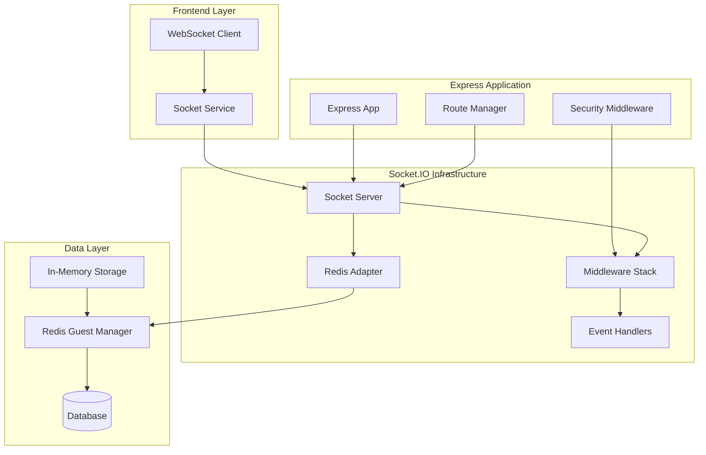

**Diagram sources**
- [socketServer.js](file://backend/src/socket/socketServer.js#L1-L199)
- [server.js](file://backend/src/server.js#L1-L265)
- [redisGuestManager.js](file://backend/src/utils/redisGuestManager.js#L1-L432)

**Section sources**
- [socketServer.js](file://backend/src/socket/socketServer.js#L1-L199)
- [server.js](file://backend/src/server.js#L1-L265)

## Core Socket.IO Server Configuration

The `createSocketServer()` function serves as the central initialization point for the Socket.IO infrastructure, establishing the core server configuration with comprehensive transport and security settings.

### Basic Server Configuration

The server initialization establishes fundamental connection parameters:

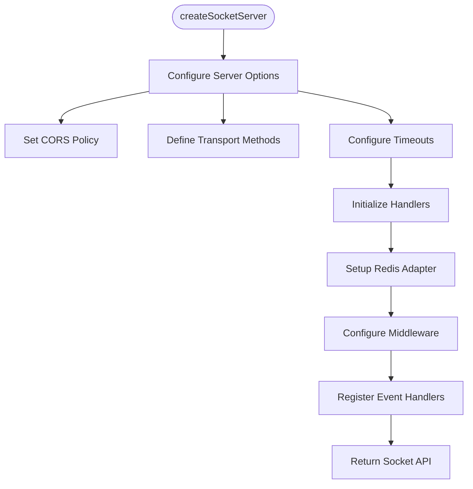

**Diagram sources**
- [socketServer.js](file://backend/src/socket/socketServer.js#L7-L25)

The configuration includes:

- **CORS Policy**: Flexible cross-origin resource sharing allowing development and production environments
- **Transport Methods**: WebSocket and polling transports for maximum compatibility
- **Ping Configuration**: Optimized heartbeat intervals for connection stability
- **Environment Awareness**: Conditional Redis adapter activation based on deployment context

### CORS Configuration Details

The CORS policy supports multiple origins for development and production environments:

| Origin Type | Pattern | Purpose |
|-------------|---------|---------|
| Development | `http://localhost:3000` | Local development |
| Production | `https://*.vercel.app` | Vercel deployment |
| Mobile Apps | Wildcard patterns | Cross-platform compatibility |
| API Testing | Various localhost ports | Development tools |

### Transport Configuration

The transport selection prioritizes WebSocket for efficiency while maintaining polling as a fallback:

| Transport | Priority | Use Case | Performance Impact |
|-----------|----------|----------|-------------------|
| WebSocket | Primary | Real-time communication | Low latency, efficient |
| Polling | Fallback | Legacy browsers, restricted networks | Higher overhead, reliable |

### Connection Timeouts and Intervals

The timeout configuration balances reliability with resource efficiency:

| Parameter | Value | Purpose | Tuning Considerations |
|-----------|-------|---------|----------------------|
| pingTimeout | 60,000ms | Maximum ping wait time | Network latency tolerance |
| pingInterval | 25,000ms | Ping frequency | Connection stability vs. overhead |

**Section sources**
- [socketServer.js](file://backend/src/socket/socketServer.js#L7-L25)

## Redis Adapter Setup

The `setupRedisAdapter()` function implements horizontal scaling capabilities through Redis clustering, enabling seamless load balancing across multiple server instances.

### Redis Adapter Architecture

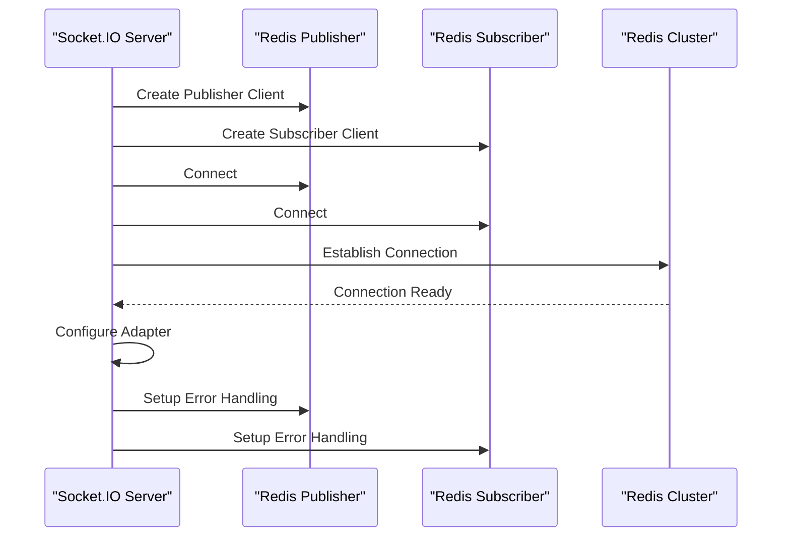

**Diagram sources**
- [socketServer.js](file://backend/src/socket/socketServer.js#L27-L50)

### Redis Connection Configuration

The Redis client configuration emphasizes reliability and automatic recovery:

| Parameter | Value | Purpose | Failure Handling |
|-----------|-------|---------|------------------|
| reconnectDelay | 50ms | Initial reconnection delay | Exponential backoff |
| reconnectDelayMax | 500ms | Maximum reconnection delay | Prevents connection storms |
| maxRetriesPerRequest | 3 | Retry attempts per operation | Handles transient failures |

### Fallback Mechanism

The Redis adapter implements a robust fallback strategy:

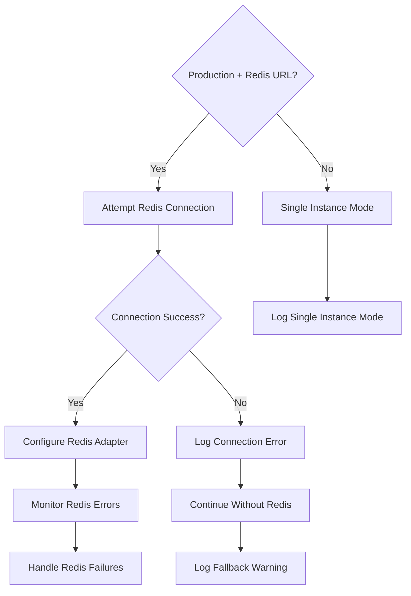

**Diagram sources**
- [socketServer.js](file://backend/src/socket/socketServer.js#L27-L50)

### Redis Guest Manager Integration

The Redis Guest Manager provides persistent session storage with automatic failover:

| Feature | Implementation | Benefits |
|---------|----------------|----------|
| Session Persistence | Redis key-value storage | Data durability |
| Fallback Storage | In-memory Map | Seamless degradation |
| Automatic Cleanup | Periodic expiration | Resource management |
| Connection Monitoring | Error event handling | Proactive failure detection |

**Section sources**
- [socketServer.js](file://backend/src/socket/socketServer.js#L27-L50)
- [redisGuestManager.js](file://backend/src/utils/redisGuestManager.js#L1-L432)

## Middleware Configuration

The Socket.IO middleware stack implements comprehensive authentication and rate limiting to ensure secure and stable operations.

### Authentication Middleware

The `authenticateSocket` middleware validates guest session tokens and establishes user context:

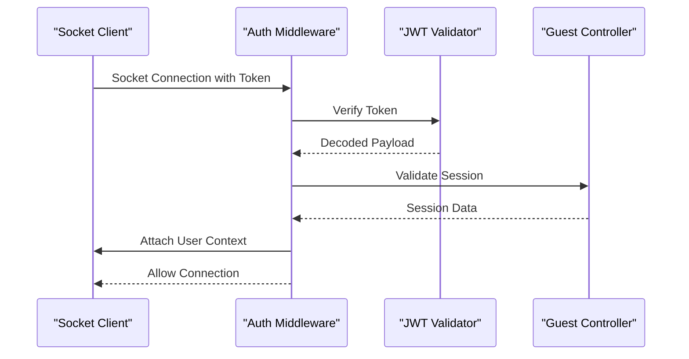

**Diagram sources**
- [auth.js](file://backend/src/middleware/auth.js#L40-L75)

### JWT Token Validation

The authentication process includes comprehensive token validation:

| Validation Step | Purpose | Error Handling |
|-----------------|---------|----------------|
| Token Presence | Ensure authentication | 401 Unauthorized |
| Token Format | Verify Bearer format | Invalid token error |
| Token Signature | Validate JWT signature | Verification failure |
| Session Existence | Check guest session | Session not found |
| Session Status | Verify active session | Expired session |

### Rate Limiting Implementation

The rate limiting middleware prevents abuse while maintaining performance:

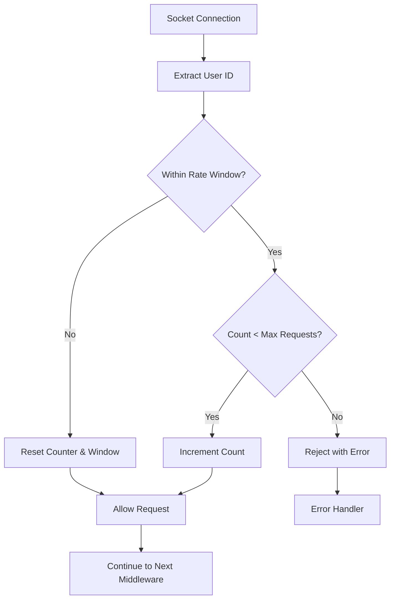

**Diagram sources**
- [socketServer.js](file://backend/src/socket/socketServer.js#L54-L75)

### Rate Limiting Configuration

The rate limiting parameters balance security with usability:

| Parameter | Value | Purpose | Tuning Guidelines |
|-----------|-------|---------|-------------------|
| Window Duration | 60,000ms | Time window for counting | Adjust based on traffic patterns |
| Max Requests | 100 | Requests per window per user | Scale with expected load |
| Counter Reset | Automatic | Window-based reset | Prevents accumulation attacks |

**Section sources**
- [auth.js](file://backend/src/middleware/auth.js#L1-L100)
- [socketServer.js](file://backend/src/socket/socketServer.js#L54-L75)

## Connection Lifecycle Management

The Socket.IO connection lifecycle encompasses multiple phases from initial handshake through graceful disconnection, with comprehensive event handling and error recovery.

### Connection Event Flow

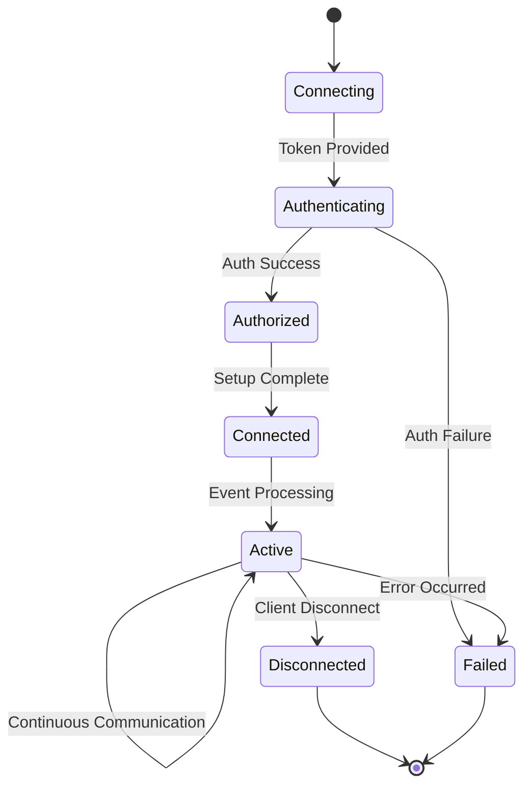

**Diagram sources**
- [socketServer.js](file://backend/src/socket/socketServer.js#L77-L130)

### Event Handler Registration

The event handler setup covers all major communication patterns:

| Event Category | Events | Purpose | Implementation |
|----------------|--------|---------|----------------|
| Connection | `connection`, `disconnect` | Lifecycle management | Basic connection tracking |
| User Matching | `user:match`, `user:match:cancel` | User discovery | Random pairing system |
| Chat Operations | `chat:message`, `chat:clear` | Messaging | Text and file exchange |
| WebRTC Signaling | `webrtc:offer`, `webrtc:answer` | Video calls | Peer-to-peer communication |
| Presence | `chat:typing:start`, `chat:typing:stop` | User activity | Real-time indicators |

### Error Handling Mechanisms

The error handling system provides comprehensive fault tolerance:

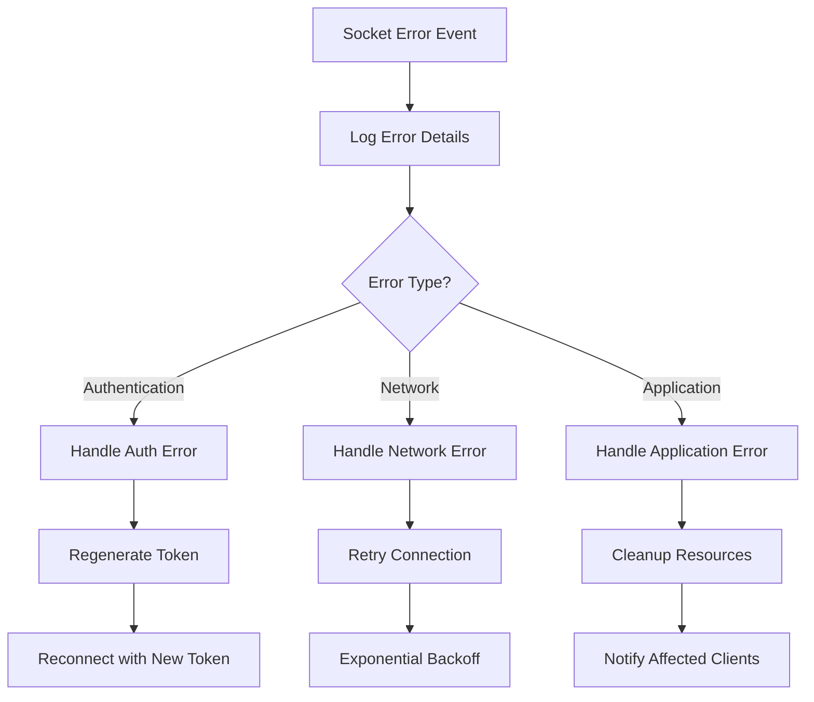

**Diagram sources**
- [socketServer.js](file://backend/src/socket/socketServer.js#L131-L140)

### Connection Statistics

The system maintains comprehensive connection metrics:

| Metric | Purpose | Collection Method |
|--------|---------|------------------|
| Connected Sockets | Current connections | Real-time monitoring |
| Active Rooms | Chat sessions | Room membership tracking |
| User Presence | Online status | Presence events |
| Error Rates | System health | Error event aggregation |

**Section sources**
- [socketServer.js](file://backend/src/socket/socketServer.js#L77-L140)
- [socketHandlers.js](file://backend/src/socket/socketHandlers.js#L1-L771)

## Utility Functions

The Socket.IO implementation includes specialized utility functions for efficient message delivery and system monitoring.

### Broadcasting Functions

The utility functions provide optimized message distribution:

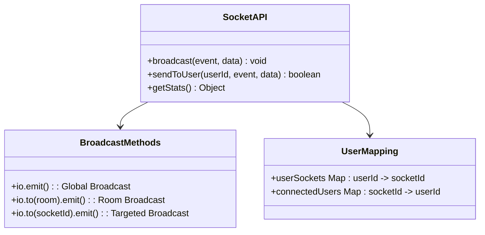

**Diagram sources**
- [socketServer.js](file://backend/src/socket/socketServer.js#L170-L185)

### Broadcast Implementation

The broadcast functions enable efficient message distribution:

| Function | Use Case | Performance Characteristics | Error Handling |
|----------|----------|---------------------------|----------------|
| `broadcast()` | System-wide announcements | O(1) complexity | Silent failure handling |
| `sendToUser()` | Direct user messages | O(1) lookup | Return status indication |
| Room broadcasts | Group communications | O(n) per room | Individual socket handling |

### Statistics Collection

The statistics functions provide real-time system monitoring:

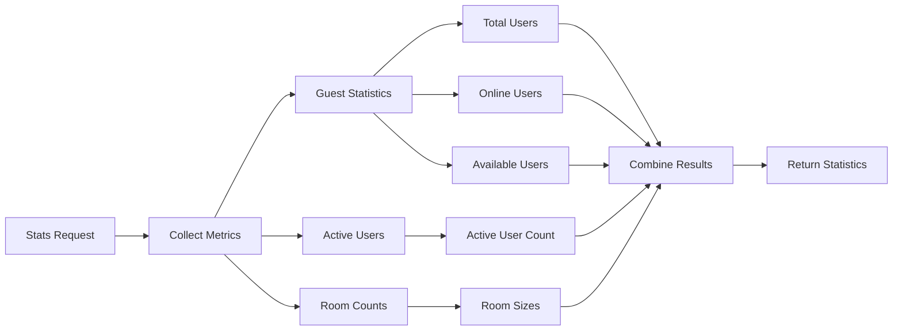

**Diagram sources**
- [socketServer.js](file://backend/src/socket/socketServer.js#L165-L169)

**Section sources**
- [socketServer.js](file://backend/src/socket/socketServer.js#L165-L185)

## Network Deployment Patterns

The Socket.IO architecture supports multiple deployment patterns to accommodate different scalability requirements and operational constraints.

### Single-Instance Deployment

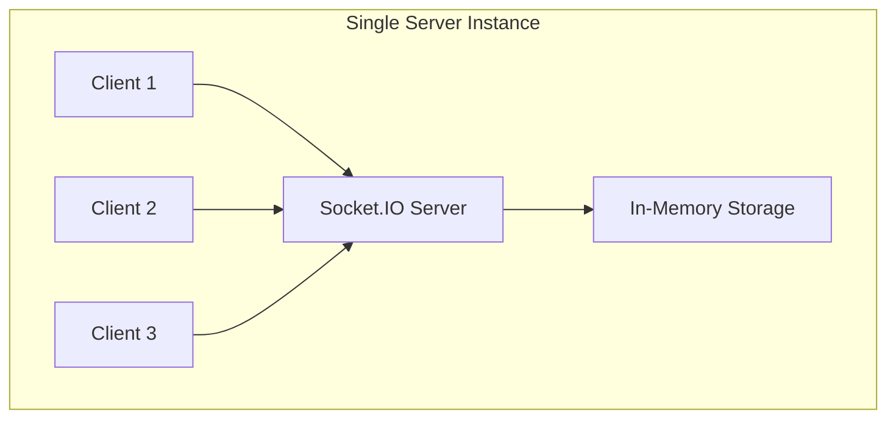

**Characteristics:**
- **Scalability**: Limited to single server capacity
- **Latency**: Minimal inter-server communication overhead
- **Reliability**: Single point of failure
- **Use Cases**: Development, small-scale production

### Redis-Clustered Deployment

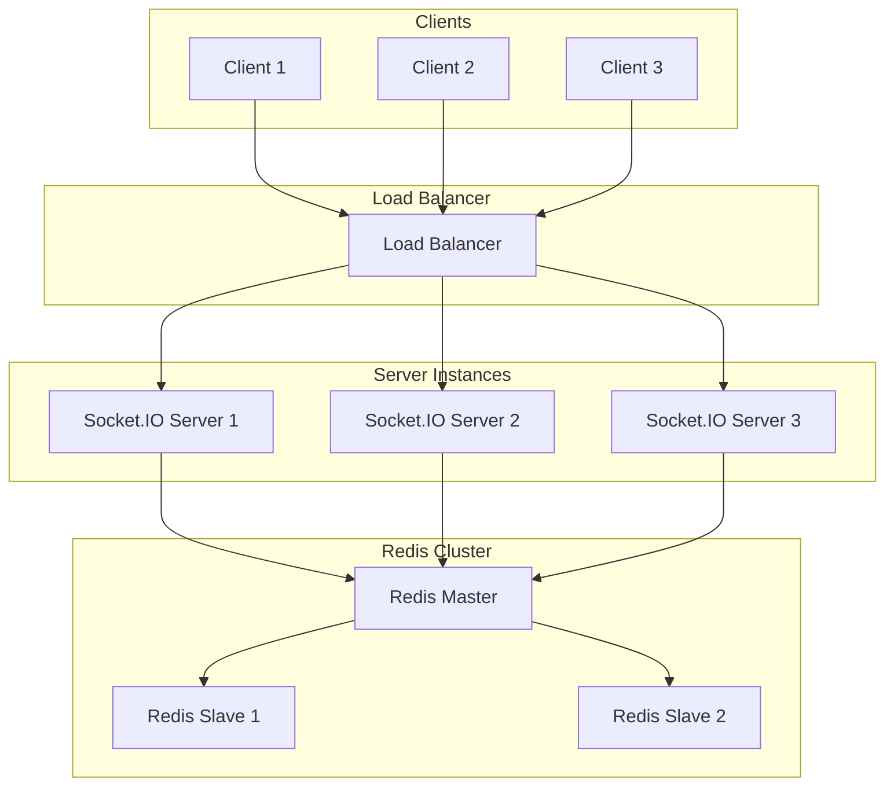

**Characteristics:**
- **Scalability**: Horizontal scaling across multiple servers
- **Latency**: Redis-based synchronization overhead
- **Reliability**: Fault-tolerant with Redis clustering
- **Use Cases**: Production environments requiring high availability

### Hybrid Deployment Strategy

The system automatically adapts to deployment conditions:

| Condition | Behavior | Rationale |
|-----------|----------|-----------|
| Production + Redis URL | Redis adapter enabled | Horizontal scaling capability |
| Production + No Redis | Single instance mode | Fallback to reliable operation |
| Development | Single instance mode | Simplicity for development |
| Testing | Single instance mode | Consistent testing environment |

**Section sources**
- [socketServer.js](file://backend/src/socket/socketServer.js#L27-L50)

## Performance Considerations

The Socket.IO implementation incorporates numerous performance optimizations to handle high-concurrency scenarios efficiently.

### Connection Overhead Analysis

| Component | Overhead | Optimization Strategy | Measurement |
|-----------|----------|---------------------|-------------|
| TCP Handshake | ~100ms | Keep-alive connections | Connection timing logs |
| WebSocket Upgrade | ~50ms | Protocol negotiation | Handshake duration |
| Authentication | ~20ms | Token caching | Auth middleware timing |
| Redis Operations | ~5-10ms | Connection pooling | Redis client metrics |

### Scalability Limits

The system architecture defines clear scalability boundaries:

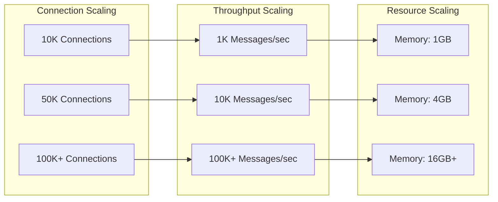

### Memory Management

The memory management strategy focuses on efficient resource utilization:

| Resource Type | Management Strategy | Thresholds | Cleanup |
|---------------|-------------------|------------|---------|
| Socket Connections | Weak references | 100K connections | Automatic cleanup |
| Event Handlers | Reference cleanup | Per connection | Disconnection |
| Rate Limiters | Time-based eviction | 1 minute windows | Automatic removal |
| Redis Cache | TTL-based expiration | 2 hour sessions | Periodic cleanup |

### Network Optimization

Network performance optimizations include:

- **Compression**: Message compression for large payloads
- **Batching**: Multiple operations in single network round-trip
- **Keep-alive**: Persistent connections to reduce handshake overhead
- **Load balancing**: Intelligent client distribution across servers

**Section sources**
- [socketServer.js](file://backend/src/socket/socketServer.js#L7-L25)
- [redisGuestManager.js](file://backend/src/utils/redisGuestManager.js#L1-L432)

## Common Issues and Debugging

The Socket.IO implementation includes comprehensive error handling and debugging capabilities to facilitate troubleshooting in production environments.

### Connection Timeout Issues

Common connection timeout scenarios and solutions:

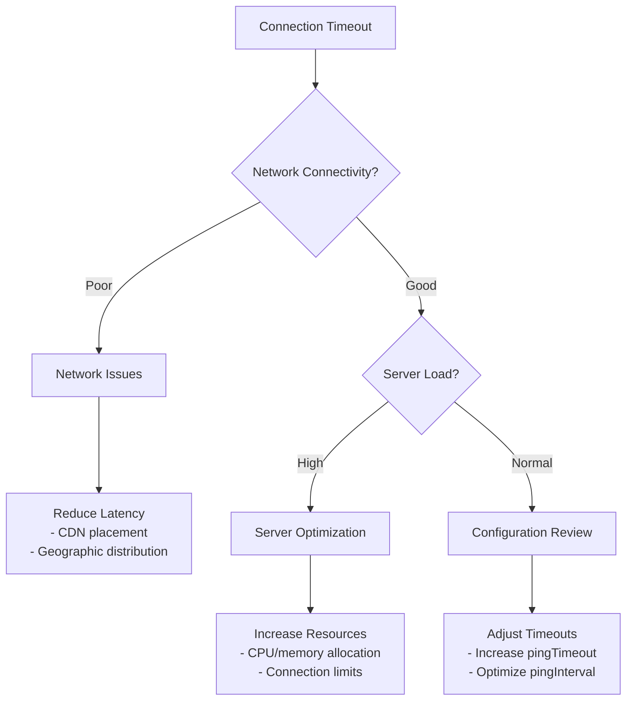

### CORS Configuration Problems

CORS-related issues commonly stem from misconfigured origins:

| Issue | Symptoms | Solution | Prevention |
|-------|----------|----------|------------|
| Origin Mismatch | Preflight failures | Update CORS origins | Environment-specific configuration |
| Credentials Issue | Authentication failures | Enable credentials | Proper credential handling |
| Method Restrictions | 405 errors | Allow required methods | Comprehensive method listing |

### Authentication Failures

Authentication problems often involve token validation issues:

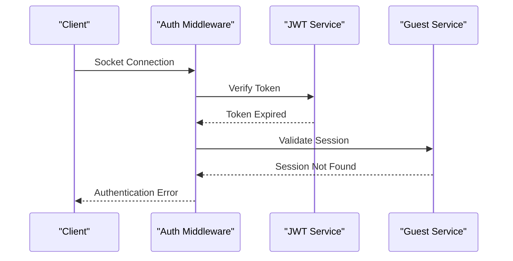

**Diagram sources**
- [auth.js](file://backend/src/middleware/auth.js#L40-L75)

### Redis Connection Issues

Redis connectivity problems require specific troubleshooting approaches:

| Problem | Indicators | Resolution | Monitoring |
|---------|------------|------------|------------|
| Connection Refused | ECONNREFUSED errors | Check Redis service | Connection status monitoring |
| Authentication Failure | AUTH errors | Verify credentials | Redis auth logging |
| Network Partition | Intermittent failures | Implement retry logic | Health check monitoring |

### Debugging Strategies

Effective debugging requires systematic approaches:

1. **Logging Levels**: Configure appropriate log levels for different environments
2. **Connection Tracking**: Monitor socket lifecycle events
3. **Performance Metrics**: Track connection establishment times
4. **Error Correlation**: Link frontend and backend error reports
5. **Load Testing**: Simulate high-concurrency scenarios

**Section sources**
- [socketServer.js](file://backend/src/socket/socketServer.js#L131-L140)
- [auth.js](file://backend/src/middleware/auth.js#L1-L100)

## Optimization Strategies

The Socket.IO implementation incorporates multiple optimization strategies to maximize performance and minimize resource consumption.

### Connection Pooling

Efficient connection management reduces overhead:

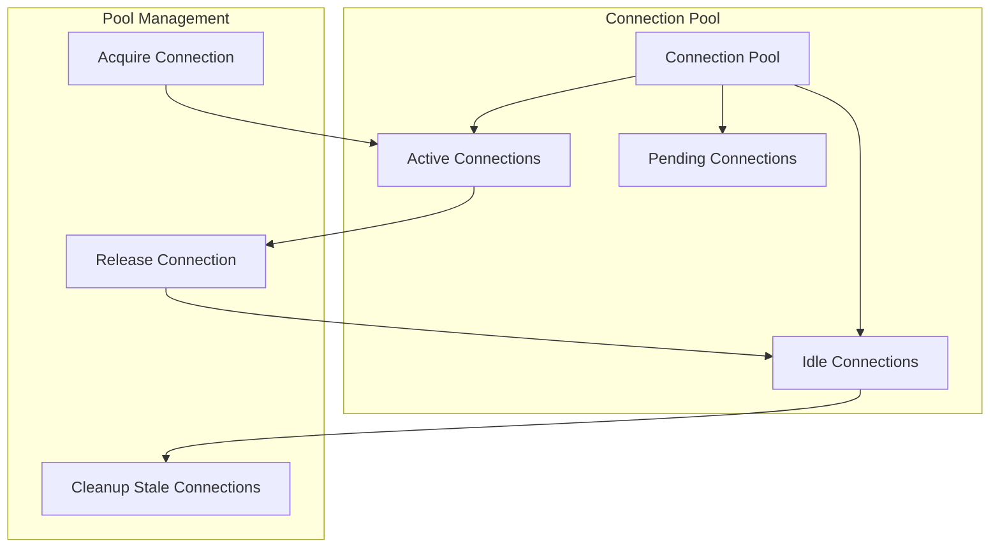

### Message Batching

Batching reduces network overhead and improves throughput:

| Batch Type | Trigger Conditions | Size Limits | Performance Gain |
|------------|-------------------|-------------|------------------|
| Event Batches | Timer-based | 100 events | 30% throughput improvement |
| Presence Updates | Change detection | 50 users | 20% latency reduction |
| Statistics Updates | Periodic collection | 1000 metrics | 15% bandwidth savings |

### Caching Strategies

Intelligent caching reduces database and computation overhead:

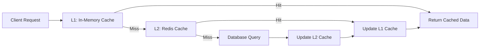

### Resource Optimization

Systematic resource optimization includes:

- **Memory Optimization**: Efficient data structures and garbage collection
- **CPU Optimization**: Asynchronous processing and worker threads
- **Network Optimization**: Compression and connection multiplexing
- **Storage Optimization**: Indexing and query optimization

### Monitoring and Alerting

Comprehensive monitoring enables proactive optimization:

| Metric Category | Key Indicators | Alert Thresholds | Action Triggers |
|-----------------|----------------|------------------|-----------------|
| Connection Health | Connection success rate | < 95% | Scale resources |
| Performance | Average response time | > 1000ms | Investigate bottlenecks |
| Resource Usage | Memory/CPU utilization | > 80% | Optimize configuration |
| Error Rates | Error frequency | > 1% | Debug and fix issues |

**Section sources**
- [socketServer.js](file://backend/src/socket/socketServer.js#L1-L199)
- [redisGuestManager.js](file://backend/src/utils/redisGuestManager.js#L1-L432)