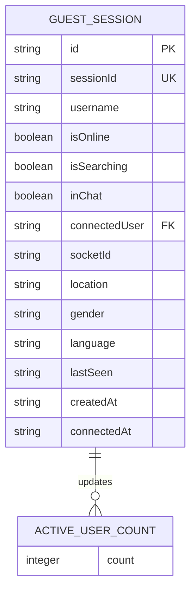

# Data Models

<cite>
**Referenced Files in This Document**   
- [redisGuestManager.js](file://backend/src/utils/redisGuestManager.js)
- [socketHandlers.js](file://backend/src/socket/socketHandlers.js)
- [guestController.js](file://backend/src/controllers/guestController.js)
- [tempFileStorage.js](file://backend/src/utils/tempFileStorage.js)
- [API_DOCUMENTATION.md](file://backend/API_DOCUMENTATION.md)
- [GuestSessionContext.tsx](file://web/contexts/GuestSessionContext.tsx)
</cite>

## Table of Contents
1. [Introduction](#introduction)
2. [GuestUser Data Model](#guestuser-data-model)
3. [Message Data Model](#message-data-model)
4. [WebRTCSession Data Model](#webrtcsession-data-model)
5. [Redis Data Structures and Querying](#redis-data-structures-and-querying)
6. [Data Lifecycle Management](#data-lifecycle-management)
7. [Access Patterns and Performance](#access-patterns-and-performance)
8. [Sample Data Representations](#sample-data-representations)

## Introduction
This document provides comprehensive documentation of the data models used in the Realtime Chat App, focusing on the three primary entities: GuestUser, Message, and WebRTCSession. The application uses Redis as its primary data store for guest sessions and presence tracking, with in-memory fallback storage when Redis is unavailable. Temporary file storage is managed in-memory with automatic cleanup. The documentation covers field definitions, data types, constraints, storage mechanisms, access patterns, and lifecycle management for each entity.

## GuestUser Data Model

The GuestUser entity represents temporary guest users in the system. Guest sessions are stored in Redis with a 2-hour expiration period, and include comprehensive presence and connection status information.

**Field Definitions:**
- **id**: Unique identifier for the guest (string, required)
- **sessionId**: Session identifier used for authentication (string, required)
- **username**: Display name for the guest (string, required)
- **isOnline**: Current connection status (boolean, default: false)
- **isSearching**: Whether the user is actively searching for a match (boolean, default: false)
- **inChat**: Whether the user is currently in a chat session (boolean, default: false)
- **connectedUser**: ID of the currently connected user (string, nullable)
- **location**: Geographic location information (string, nullable)
- **gender**: User's gender preference (string, nullable)
- **language**: Preferred language (string, nullable)
- **socketId**: Associated WebSocket connection ID (string, nullable)
- **lastSeen**: Timestamp of last activity (ISO 8601 string, required)
- **createdAt**: Timestamp of session creation (ISO 8601 string, required)
- **connectedAt**: Timestamp when connection was established (ISO 8601 string, nullable)

Guest users are created with a randomly generated username if none is provided, following a "AdjectiveNounNumber" pattern (e.g., "CoolPanda1234"). The session includes metadata for real-time presence tracking and connection management.

**Section sources**
- [redisGuestManager.js](file://backend/src/utils/redisGuestManager.js#L150-L250)
- [guestController.js](file://backend/src/controllers/guestController.js#L30-L80)
- [GuestSessionContext.tsx](file://web/contexts/GuestSessionContext.tsx#L10-L50)

## Message Data Model

The Message entity represents communication between users in the chat application. Messages are transmitted in real-time via WebSocket and include metadata for delivery tracking.

**Field Definitions:**
- **id**: Unique message identifier (string, required)
- **senderId**: ID of the message sender (string, required)
- **senderUsername**: Username of the message sender (string, required)
- **type**: Message type (string, required, values: "text", "file", "voice")
- **content**: Message content (object or string, required)
- **timestamp**: Message creation time (ISO 8601 string, required)
- **status**: Delivery status (string, values: "sending", "sent", "delivered")

For different message types, the content structure varies:
- **Text messages**: Content is a string
- **File messages**: Content includes filename, fileType, fileSize, and fileUrl
- **Voice messages**: Content includes filename, duration (seconds), fileSize, and fileUrl

Message IDs are generated using a timestamp and random string pattern: `msg_${timestamp}_${randomString}`. The system provides delivery confirmations through WebSocket events, with "sent" confirmation to the sender and "delivered" confirmation to the recipient.

**Section sources**
- [socketHandlers.js](file://backend/src/socket/socketHandlers.js#L291-L333)
- [API_DOCUMENTATION.md](file://backend/API_DOCUMENTATION.md#L374-L436)
- [GuestSessionContext.tsx](file://web/contexts/ChatContext.tsx#L449-L495)

## WebRTCSession Data Model

The WebRTCSession represents a real-time communication session between users. The application uses WebSocket signaling to exchange WebRTC metadata between peers.

**Field Definitions:**
- **offer**: SDP offer from the calling party (RTCSessionDescriptionInit object)
- **answer**: SDP answer from the receiving party (RTCSessionDescriptionInit object)
- **ICE candidates**: Network connectivity candidates for peer-to-peer connection (RTCIceCandidate objects)
- **call type**: Type of call (string, values: "audio", "video")
- **start time**: Timestamp when the call was initiated (ISO 8601 string)

The WebRTC signaling flow follows the standard WebRTC protocol:
1. Caller sends an "offer" with SDP description and call type
2. Callee responds with an "answer" containing their SDP description
3. Both parties exchange ICE candidates to establish the peer connection
4. Call events (end, reject, timeout) are signaled through dedicated WebSocket events

The system supports both audio and video calls, with signaling messages containing the caller's ID and username for display purposes.

**Section sources**
- [socketHandlers.js](file://backend/src/socket/socketHandlers.js#L415-L445)
- [API_DOCUMENTATION.md](file://backend/API_DOCUMENTATION.md#L562-L620)
- [useWebRTC.ts](file://web/hooks/useWebRTC.ts#L329-L366)

## Redis Data Structures and Querying

The application uses Redis to store guest session data and support efficient querying for online users and presence tracking. Guest sessions are stored as JSON strings in Redis with expiration.

**Redis Key Structure:**
- Guest sessions: `guest:{sessionId}` (e.g., `guest:abc123-def456`)
- Active user count: `active_user_count`

**Data Structure Implementation:**
Guest sessions are stored as Redis string values containing JSON-serialized objects. The `SETEx` command sets both the value and expiration time (7,200 seconds or 2 hours). This approach provides atomic operations for setting the session and its expiration.

**Querying Patterns:**
- **Get guest session**: Direct key lookup using `GET guest:{sessionId}`
- **All online guests**: Scan all `guest:*` keys and filter by `isOnline` status
- **Guest statistics**: Iterate through all guest keys to calculate totals
- **Active user count**: Use Redis `INCR` and `DECR` commands with expiration

The system maintains in-memory fallback storage using JavaScript Map objects when Redis is unavailable, ensuring graceful degradation. The `userSockets` Map tracks the relationship between user IDs and WebSocket connection IDs for efficient message routing.



**Diagram sources**
- [redisGuestManager.js](file://backend/src/utils/redisGuestManager.js#L100-L350)
- [socketHandlers.js](file://backend/src/socket/socketHandlers.js#L10-L50)

## Data Lifecycle Management

The application implements comprehensive data lifecycle management for both session data and temporary files, ensuring resource cleanup and preventing memory leaks.

**Guest Session Lifecycle:**
- **Creation**: Sessions are created with a 2-hour expiration
- **Update**: Presence and status updates refresh the expiration
- **Cleanup**: Expired sessions are removed automatically by Redis
- **Fallback cleanup**: In-memory sessions are cleaned every 10 minutes

Guest sessions are automatically removed when a user disconnects, with the `removeGuestSession` method deleting the Redis key and removing the session from fallback storage. The cleanup interval runs every 10 minutes to remove expired sessions from the in-memory fallback storage.

**Temporary File Storage Lifecycle:**
- **Storage**: Files are stored in memory with a default 60-minute expiration
- **Room association**: Files are tracked by room ID for batch cleanup
- **Cleanup**: Expired files are removed every 5 minutes
- **Room cleanup**: All files for a room are deleted when the chat is cleared

Temporary files are automatically cleaned up when a chat session ends, with the `deleteRoomFiles` method removing all files associated with a specific room. This occurs when users disconnect, clear their chat, or explicitly close the room.

**Section sources**
- [redisGuestManager.js](file://backend/src/utils/redisGuestManager.js#L350-L430)
- [tempFileStorage.js](file://backend/src/utils/tempFileStorage.js#L100-L200)
- [socketHandlers.js](file://backend/src/socket/socketHandlers.js#L150-L200)

## Access Patterns and Performance

The application is optimized for high-read scenarios and real-time presence tracking, with specific patterns for user statistics and online user queries.

**High-Read Access Patterns:**
- **Real-time statistics**: Broadcast to all connected clients on connection and status changes
- **Online user lists**: Retrieved for display in the matching interface
- **Guest session lookup**: Frequent by sessionId for authentication and presence updates
- **Active user count**: Incremented/decremented on connection/disconnection

**Performance Considerations:**
- **Redis optimization**: Use of `SETEx` for atomic set-and-expire operations
- **Batch operations**: Room-based file cleanup for efficient resource management
- **Connection mapping**: In-memory `userSockets` Map for O(1) socket lookup
- **Fallback strategy**: Graceful degradation to in-memory storage when Redis fails

The system broadcasts real-time statistics to all connected clients, including total users, online users, available users, and connected users. These statistics are updated on every connection and disconnection event, providing up-to-date information for the user interface.

For high-concurrency scenarios, the active user count is maintained in Redis with a 5-minute expiration, allowing for quick retrieval without recalculating from all guest sessions. The connected user count is divided by 2 in the statistics since each connection involves two users.

**Section sources**
- [redisGuestManager.js](file://backend/src/utils/redisGuestManager.js#L300-L350)
- [socketHandlers.js](file://backend/src/socket/socketHandlers.js#L600-L650)
- [guestController.js](file://backend/src/controllers/guestController.js#L100-L130)

## Sample Data Representations

This section provides sample data representations for each entity to illustrate the actual data structure used in the application.

**GuestUser Sample:**
```json
{
  "id": "guest_abc123-def456",
  "sessionId": "abc123-def456",
  "username": "CoolPanda1234",
  "isOnline": true,
  "isSearching": false,
  "inChat": true,
  "connectedUser": "guest_xyz789-uvw012",
  "socketId": "socket_123",
  "location": "United States",
  "gender": "male",
  "language": "en",
  "lastSeen": "2023-12-07T10:30:00.000Z",
  "createdAt": "2023-12-07T10:00:00.000Z",
  "connectedAt": "2023-12-07T10:25:00.000Z"
}
```

**Message Sample (Text):**
```json
{
  "id": "msg_1701945000_abc123",
  "senderId": "guest_abc123-def456",
  "senderUsername": "CoolPanda1234",
  "type": "text",
  "content": "Hello, how are you?",
  "timestamp": "2023-12-07T10:30:00.000Z"
}
```

**Message Sample (File):**
```json
{
  "id": "msg_1701945030_def456",
  "senderId": "guest_abc123-def456",
  "senderUsername": "CoolPanda1234",
  "type": "file",
  "content": {
    "filename": "document.pdf",
    "fileType": "document",
    "fileSize": 2048576,
    "fileUrl": "/uploads/documents/unique-filename.pdf"
  },
  "timestamp": "2023-12-07T10:30:30.000Z"
}
```

**WebRTC Offer Sample:**
```json
{
  "offer": {
    "type": "offer",
    "sdp": "v=0\r\no=- 1234567890 1234567890 IN IP4 0.0.0.0..."
  },
  "type": "video",
  "from": "guest_abc123-def456",
  "fromUsername": "CoolPanda1234"
}
```

These samples illustrate the actual data structures used in the application, showing how entities are represented in JSON format for transmission and storage.

**Section sources**
- [API_DOCUMENTATION.md](file://backend/API_DOCUMENTATION.md#L374-L436)
- [redisGuestManager.js](file://backend/src/utils/redisGuestManager.js#L150-L250)
- [socketHandlers.js](file://backend/src/socket/socketHandlers.js#L291-L333)