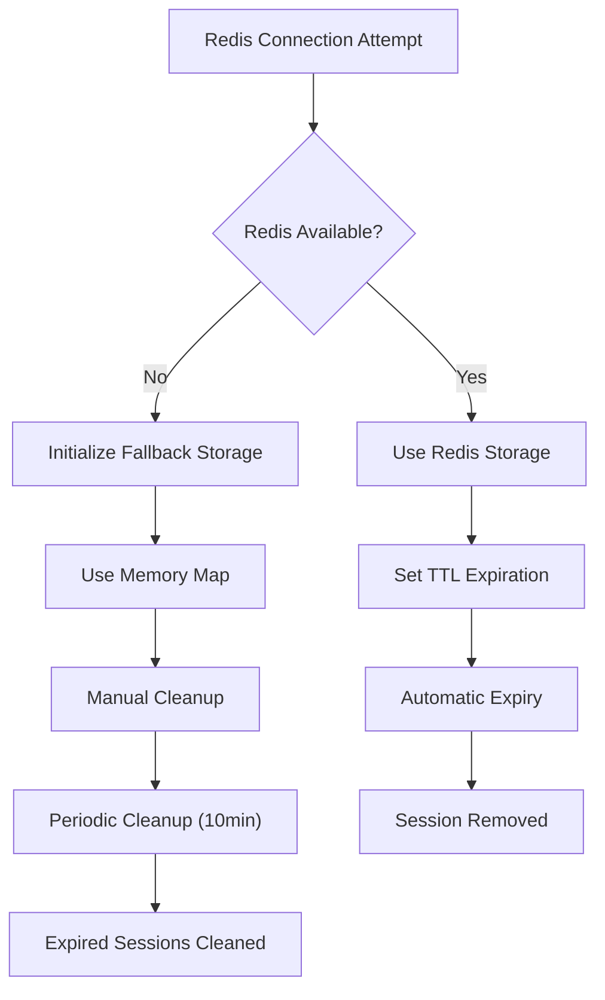
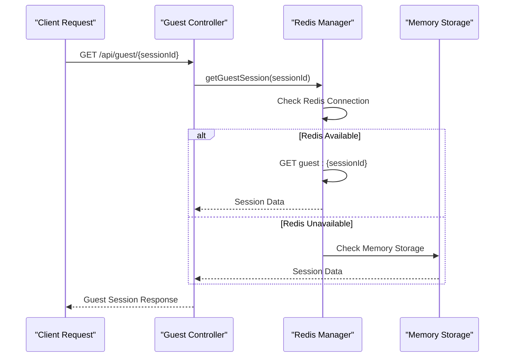
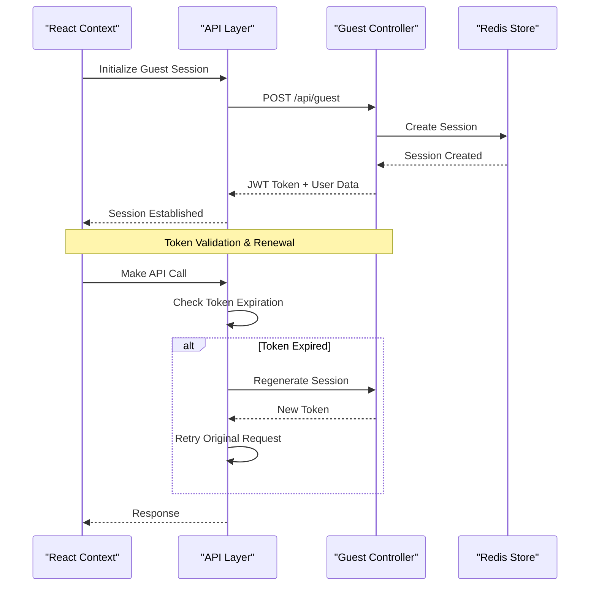
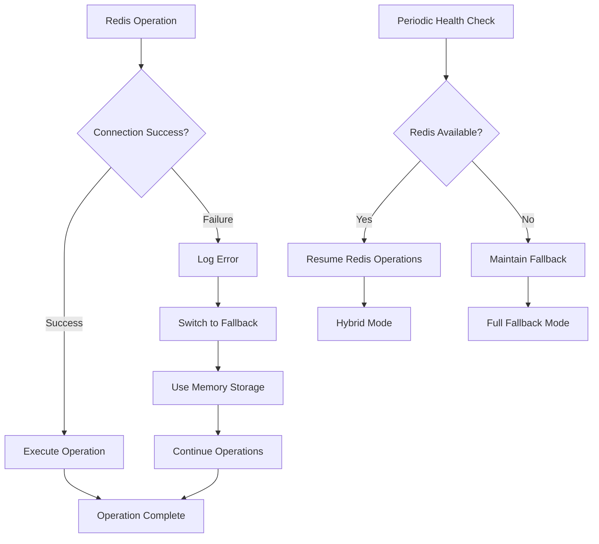

# Guest User Model

<cite>
**Referenced Files in This Document**
- [backend/src/controllers/guestController.js](file://backend/src/controllers/guestController.js)
- [backend/src/utils/redisGuestManager.js](file://backend/src/utils/redisGuestManager.js)
- [web/contexts/GuestSessionContext.tsx](file://web/contexts/GuestSessionContext.tsx)
- [backend/src/socket/socketHandlers.js](file://backend/src/socket/socketHandlers.js)
- [backend/src/middleware/validation.js](file://backend/src/middleware/validation.js)
- [backend/src/routes/guest.js](file://backend/src/routes/guest.js)
- [web/lib/api.ts](file://web/lib/api.ts)
- [backend/src/middleware/auth.js](file://backend/src/middleware/auth.js)
</cite>

## Table of Contents
1. [Introduction](#introduction)
2. [Data Model Specification](#data-model-specification)
3. [Redis Storage Strategy](#redis-storage-strategy)
4. [In-Memory Fallback System](#in-memory-fallback-system)
5. [Data Access Patterns](#data-access-patterns)
6. [Validation Rules](#validation-rules)
7. [Synchronization Between Frontend and Backend](#synchronization-between-frontend-and-backend)
8. [Performance Considerations](#performance-considerations)
9. [Error Handling and Recovery](#error-handling-and-recovery)
10. [Security Implementation](#security-implementation)

## Introduction

The GuestUser entity represents anonymous users in the Realtime Chat App who can participate in conversations without creating permanent accounts. This system implements a sophisticated data model with Redis-based persistence, automatic session management, and seamless synchronization between frontend and backend components.

The guest user system supports high-concurrency scenarios with robust fallback mechanisms, ensuring reliable user presence tracking and real-time communication capabilities even under heavy load conditions.

## Data Model Specification

### Core Fields

The GuestUser entity contains the following comprehensive field structure:

| Field | Type | Description | Constraints |
|-------|------|-------------|-------------|
| `id` | string | Unique identifier for the guest user | Generated UUID, prefixed with "guest_" |
| `sessionId` | string | JWT session reference | UUID generated at session creation |
| `username` | string | Display name for the guest | 3-20 characters, alphanumeric + underscore |
| `isOnline` | boolean | Current connection status | Automatically managed by socket presence |
| `isSearching` | boolean | Active matching state | True when user is looking for chat partners |
| `inChat` | boolean | Active conversation status | True when connected to another user |
| `connectedUser` | string \| null | Matched peer ID | References another guest user's ID |
| `location` | object \| null | Geographic location data | Contains country, city, coordinates |
| `gender` | string \| null | User gender preference | Optional string value |
| `language` | string \| null | Preferred language | Optional string value |
| `socketId` | string \| null | Current WebSocket identifier | Set when user connects via WebSocket |
| `lastSeen` | ISO string | Timestamp of last activity | Updated on presence changes |
| `createdAt` | ISO string | Session creation timestamp | Immutable timestamp |
| `connectedAt` | ISO string \| null | Connection establishment time | Set when socket connects |

### Location Object Structure

The location field follows a structured format for geographic information:

```typescript
interface Location {
  country: string;     // Country name (max 50 chars)
  region: string;      // Administrative region (max 50 chars)
  city: string;        // City name (max 50 chars)
  timezone: string;    // Timezone identifier
  coordinates: {
    lat: number;       // Latitude coordinate
    lon: number;       // Longitude coordinate
  };
}
```

**Section sources**
- [backend/src/utils/redisGuestManager.js](file://backend/src/utils/redisGuestManager.js#L82-L106)
- [web/contexts/GuestSessionContext.tsx](file://web/contexts/GuestSessionContext.tsx#L8-L22)

## Redis Storage Strategy

### Hash-Based Storage Structure

The system employs Redis hash structures for efficient guest session storage with the following key format:

```
Key Pattern: guest:{sessionId}
Example: guest:550e8400-e29b-41d4-a716-446655440000
```

### TTL Management

All guest sessions are configured with a 2-hour Time-To-Live (TTL) to ensure automatic cleanup of inactive sessions:

```javascript
const expirySeconds = 2 * 60 * 60; // 2 hours
await this.client.setEx(key, expirySeconds, JSON.stringify(guestSession));
```

### Redis Commands for CRUD Operations

#### Create Operation
```bash
SET guest:550e8400-e29b-41d4-a716-446655440000 '{"id":"guest_550e8400-e29b-41d4-a716-446655440000","sessionId":"550e8400-e29b-41d4-a716-446655440000","username":"CoolPanda1234","isOnline":false,"lastSeen":"2024-01-01T00:00:00.000Z","isSearching":false,"inChat":false,"connectedUser":null,"socketId":null,"location":null,"gender":null,"language":null,"createdAt":"2024-01-01T00:00:00.000Z","connectedAt":null}' EX 7200
```

#### Read Operation
```bash
GET guest:550e8400-e29b-41d4-a716-446655440000
```

#### Update Operation
```bash
SET guest:550e8400-e29b-41d4-a716-446655440000 '{"id":"guest_550e8400-e29b-41d4-a716-446655440000","sessionId":"550e8400-e29b-41d4-a716-446655440000","username":"CoolPanda1234","isOnline":true,"lastSeen":"2024-01-01T00:05:00.000Z","isSearching":true,"inChat":false,"connectedUser":null,"socketId":"socket_12345","location":{"country":"US","city":"New York"},"gender":"male","language":"en","createdAt":"2024-01-01T00:00:00.000Z","connectedAt":"2024-01-01T00:05:00.000Z"}' EX 7200
```

#### Delete Operation
```bash
DEL guest:550e8400-e29b-41d4-a716-446655440000
```

**Section sources**
- [backend/src/utils/redisGuestManager.js](file://backend/src/utils/redisGuestManager.js#L105-L147)
- [backend/src/utils/redisGuestManager.js](file://backend/src/utils/redisGuestManager.js#L149-L202)

## In-Memory Fallback System

### Fallback Architecture

When Redis becomes unavailable, the system seamlessly transitions to an in-memory fallback storage mechanism:



**Diagram sources**
- [backend/src/utils/redisGuestManager.js](file://backend/src/utils/redisGuestManager.js#L15-L50)

### Fallback Storage Implementation

The fallback system uses JavaScript's native `Map` structure with expiration tracking:

```javascript
this.fallbackStorage = new Map(); // Fallback to in-memory if Redis fails

// Session with expiration
{
  ...guestSession,
  expiresAt: new Date(Date.now() + expirySeconds * 1000)
}
```

### Automatic Cleanup Mechanism

The system implements periodic cleanup of expired sessions:

```javascript
// Cleanup interval runs every 10 minutes
setInterval(() => {
  this.cleanupExpiredSessions();
}, 10 * 60 * 1000);
```

**Section sources**
- [backend/src/utils/redisGuestManager.js](file://backend/src/utils/redisGuestManager.js#L15-L50)
- [backend/src/utils/redisGuestManager.js](file://backend/src/utils/redisGuestManager.js#L410-L431)

## Data Access Patterns

### Session Lookup by sessionId

The primary access pattern retrieves guest sessions using the sessionId:



**Diagram sources**
- [backend/src/controllers/guestController.js](file://backend/src/controllers/guestController.js#L58-L76)
- [backend/src/utils/redisGuestManager.js](file://backend/src/utils/redisGuestManager.js#L130-L158)

### ConnectedUser Queries

The system supports efficient queries for users connected to a specific guest:

```javascript
// Find all online guests
const allOnlineGuests = await getAllOnlineGuests();

// Filter for connected users
const connectedGuests = allOnlineGuests.filter(guest => 
  guest.connectedUser === targetUserId
);
```

### Presence Update Pattern

Real-time presence updates follow a consistent pattern:

```javascript
// Update guest presence
await updateGuestPresence(sessionId, {
  isOnline: true,
  socketId: socket.id,
  connectedAt: new Date().toISOString()
});
```

**Section sources**
- [backend/src/controllers/guestController.js](file://backend/src/controllers/guestController.js#L58-L76)
- [backend/src/utils/redisGuestManager.js](file://backend/src/utils/redisGuestManager.js#L158-L202)

## Validation Rules

### Username Validation

The system enforces strict validation for guest usernames:

| Rule | Constraint | Error Message |
|------|------------|---------------|
| Length | 3-20 characters | "Username must be between 3 and 20 characters" |
| Characters | Alphanumeric + underscore only | "Username can only contain letters, numbers, and underscores" |
| Format | Trimmed string | Automatic whitespace removal |

### Location Data Validation

Geographic information follows specific validation rules:

| Field | Constraint | Error Message |
|-------|------------|---------------|
| Country | Max 50 characters | "Country must be less than 50 characters" |
| Region | Max 50 characters | "Region must be less than 50 characters" |
| City | Max 50 characters | "City must be less than 50 characters" |
| IP Address | Valid IPv4/IPv6 | "Invalid IP address format" |

### Device Information Validation

```javascript
const validateDeviceUpdate = [
  body('deviceId')
    .optional()
    .trim()
    .isLength({ min: 1, max: 100 })
    .withMessage('Device ID must be between 1 and 100 characters'),
    
  body('ip')
    .optional()
    .isIP()
    .withMessage('Invalid IP address format'),
    
  body('location')
    .optional()
    .isObject()
    .withMessage('Location must be an object')
];
```

**Section sources**
- [backend/src/middleware/validation.js](file://backend/src/middleware/validation.js#L3-L15)
- [backend/src/middleware/validation.js](file://backend/src/middleware/validation.js#L17-L48)

## Synchronization Between Frontend and Backend

### Token-Based Authentication

The frontend maintains synchronization through JWT token management:



**Diagram sources**
- [web/contexts/GuestSessionContext.tsx](file://web/contexts/GuestSessionContext.tsx#L280-L320)
- [web/lib/api.ts](file://web/lib/api.ts#L30-L70)

### Socket Connection Synchronization

WebSocket connections maintain real-time synchronization:

```typescript
// Socket connection establishes presence
await updateGuestPresence(sessionId, {
  isOnline: true,
  socketId: socket.id,
  connectedAt: new Date().toISOString()
});

// Socket disconnection cleans up presence
await updateGuestPresence(sessionId, {
  isOnline: false,
  socketId: null,
  inChat: false,
  connectedUser: null
});
```

### Session Restoration

The frontend implements intelligent session restoration:

```typescript
// Restore from sessionStorage with token validation
const stored = sessionStorage.getItem('guest_user_session');
const storedToken = sessionStorage.getItem('guestAuthToken');

if (stored && storedToken) {
  // Validate JWT token expiration
  const tokenParts = storedToken.split('.');
  const payload = JSON.parse(atob(tokenParts[1]));
  const expirationTime = payload.exp * 1000;
  const currentTime = Date.now();
  
  if (expirationTime > currentTime) {
    // Session is valid, restore
    return parsedUser;
  }
}
```

**Section sources**
- [web/contexts/GuestSessionContext.tsx](file://web/contexts/GuestSessionContext.tsx#L60-L95)
- [backend/src/socket/socketHandlers.js](file://backend/src/socket/socketHandlers.js#L15-L48)

## Performance Considerations

### High-Concurrency User Presence Tracking

The system implements several performance optimization strategies:

#### Active User Count Management
```javascript
// Atomic increment/decrement for active users
async incrementActiveUserCount() {
  const key = 'active_user_count';
  const count = await this.client.incr(key);
  await this.client.expire(key, 300); // 5-minute TTL
  return count;
}
```

#### Efficient Online Guest Queries
```javascript
// Batch Redis operations for online guests
async getAllOnlineGuests() {
  const keys = await this.client.keys('guest:*');
  const onlineGuests = [];
  
  for (const key of keys) {
    const data = await this.client.get(key);
    if (data) {
      const guest = JSON.parse(data);
      if (guest.isOnline) {
        onlineGuests.push(guest);
      }
    }
  }
  return onlineGuests;
}
```

### Memory Management

#### TTL-Based Expiration
- 2-hour TTL for guest sessions ensures automatic cleanup
- 5-minute TTL for active user counters prevents memory leaks
- Periodic cleanup intervals prevent accumulation of stale data

#### Connection Mapping Efficiency
```javascript
// Efficient socket-user mapping
const connectedUsers = new Map(); // socketId -> userId
const userSockets = new Map();    // userId -> socketId
```

### Scalability Features

#### Horizontal Scaling Support
- Redis clustering support for distributed deployments
- Stateless guest sessions enable load balancer distribution
- Redis pub/sub for real-time notifications across instances

#### Rate Limiting and Throttling
- Token regeneration rate limiting prevents abuse
- Socket connection limits prevent resource exhaustion
- Automatic cleanup prevents memory accumulation

**Section sources**
- [backend/src/utils/redisGuestManager.js](file://backend/src/utils/redisGuestManager.js#L320-L370)
- [backend/src/utils/redisGuestManager.js](file://backend/src/utils/redisGuestManager.js#L197-L231)

## Error Handling and Recovery

### Redis Connection Failures

The system implements comprehensive error handling for Redis failures:



**Diagram sources**
- [backend/src/utils/redisGuestManager.js](file://backend/src/utils/redisGuestManager.js#L15-L50)

### Session Recovery Mechanisms

#### Automatic Token Refresh
```javascript
// Token expiration detection and automatic refresh
const tokenParts = storedToken.split('.');
const payload = JSON.parse(atob(tokenParts[1]));
const expirationTime = payload.exp * 1000;

if (expirationTime < currentTime) {
  // Clear expired token
  sessionStorage.removeItem('guestAuthToken');
  sessionStorage.removeItem('guest_user_session');
  
  // Trigger session regeneration
  await sessionRegenerationCallback();
}
```

#### Stale Connection Cleanup
```javascript
// Detect and clean up stale connections
if (guestSession.connectedUser) {
  const connectedUserSocketId = userSockets.get(guestSession.connectedUser);
  if (!connectedUserSocketId) {
    // Connected user is offline, clean up stale connection
    await updateGuestPresence(sessionId, {
      connectedUser: null,
      inChat: false
    });
  }
}
```

### Graceful Degradation

#### Fallback Storage Operations
```javascript
// Fallback operations maintain functionality
if (!this.isConnected) {
  // Use in-memory storage
  this.fallbackStorage.set(sessionId, {
    ...guestSession,
    expiresAt: new Date(Date.now() + expirySeconds * 1000)
  });
}
```

#### Network Failure Recovery
```javascript
// Socket connection failure handling
socket.on('disconnect', () => {
  // Automatic cleanup on disconnection
  cleanupGuestSession(socket.sessionId);
});
```

**Section sources**
- [web/contexts/GuestSessionContext.tsx](file://web/contexts/GuestSessionContext.tsx#L60-L95)
- [backend/src/socket/socketHandlers.js](file://backend/src/socket/socketHandlers.js#L116-L163)

## Security Implementation

### JWT Token Security

#### Token Generation and Validation
```javascript
// Secure token payload
const tokenPayload = {
  userId: guestSession.id,
  sessionId: guestSession.sessionId,
  username: guestSession.username,
  isGuest: true,
  iat: Math.floor(Date.now() / 1000)
};

const token = generateToken(tokenPayload, '2h'); // 2-hour expiry
```

#### Token Validation Middleware
```javascript
// Guest-only token validation
if (!decoded.isGuest || !decoded.sessionId) {
  return res.status(401).json({
    success: false,
    message: 'Only guest sessions are supported'
  });
}
```

### Session Isolation

#### Separate Storage Buckets
```javascript
// Guest sessions isolated from user sessions
const guestKey = `guest:${sessionId}`;
const userKey = `user:${userId}`;
```

#### Cross-Site Request Forgery (CSRF) Protection
```javascript
// Token-based CSRF protection
const guestToken = sessionStorage.getItem("guestAuthToken");
const authToken = Cookies.get("authToken");

if (guestToken) {
  config.headers.Authorization = `Bearer ${guestToken}`;
}
```

### Data Sanitization

#### Input Validation
```javascript
// Comprehensive input sanitization
const validateGuestUsername = [
  body('username')
    .optional()
    .trim()
    .isLength({ min: 3, max: 20 })
    .matches(/^[a-zA-Z0-9_]+$/)
];
```

#### Output Sanitization
```javascript
// Safe data serialization
const safeUserData = {
  id: guestSession.id,
  username: guestSession.username,
  isGuest: true,
  sessionId: guestSession.sessionId
};
```

**Section sources**
- [backend/src/controllers/guestController.js](file://backend/src/controllers/guestController.js#L40-L50)
- [backend/src/middleware/auth.js](file://backend/src/middleware/auth.js#L15-L35)
- [backend/src/middleware/validation.js](file://backend/src/middleware/validation.js#L3-L15)