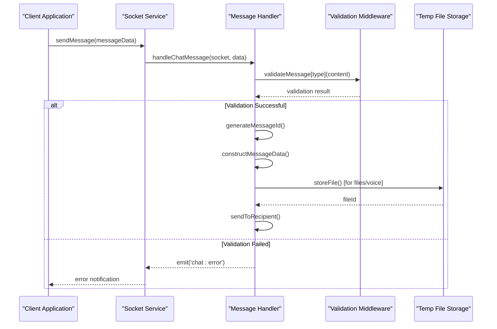
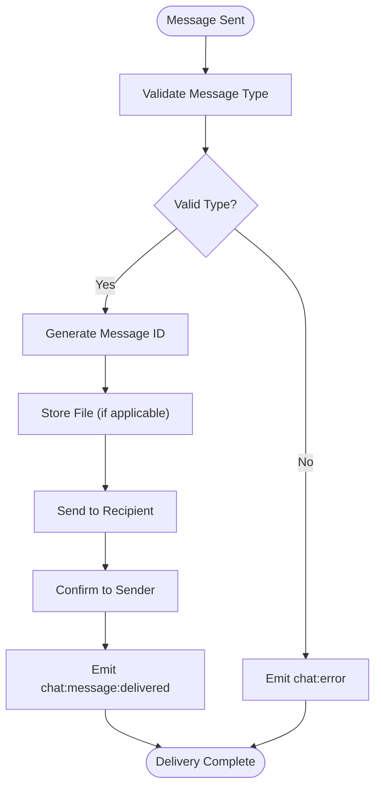
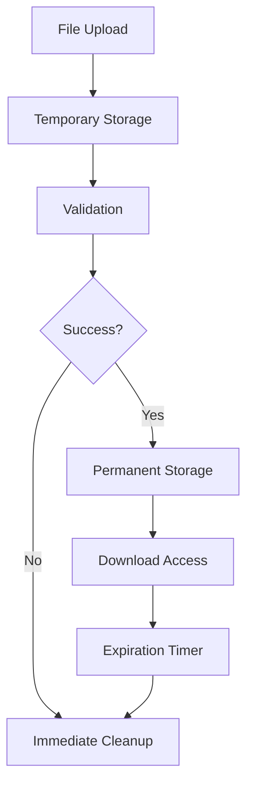

# Message Model

<cite>
**Referenced Files in This Document**
- [socketHandlers.js](file://backend/src/socket/socketHandlers.js)
- [validation.js](file://backend/src/middleware/validation.js)
- [tempFileStorage.js](file://backend/src/utils/tempFileStorage.js)
- [socket.ts](file://web/lib/socket.ts)
- [ChatContext.tsx](file://web/contexts/ChatContext.tsx)
- [page.tsx](file://web/app/chat/page.tsx)
- [socketHandlers.messaging.test.js](file://backend/src/socket/__tests__/socketHandlers.messaging.test.js)
- [API_DOCUMENTATION.md](file://backend/API_DOCUMENTATION.md)
- [QUICK_REFERENCE.md](file://backend/QUICK_REFERENCE.md)
</cite>

## Table of Contents
1. [Introduction](#introduction)
2. [Message Entity Structure](#message-entity-structure)
3. [Message Types and Content Validation](#message-types-and-content-validation)
4. [Message Lifecycle](#message-lifecycle)
5. [Real-time Delivery Flow](#real-time-delivery-flow)
6. [Sample Message Payloads](#sample-message-payloads)
7. [Error Handling](#error-handling)
8. [Performance Considerations](#performance-considerations)
9. [Storage Implications](#storage-implications)
10. [Troubleshooting Guide](#troubleshooting-guide)

## Introduction

The Message entity is the core data structure in the Realtime Chat App, representing individual messages exchanged between users in real-time. This comprehensive documentation covers the message model's structure, validation rules, lifecycle management, and real-time delivery mechanisms.

The message system supports three primary content types: text messages, file attachments, and voice recordings, each with specific validation requirements and handling mechanisms. The system implements a robust real-time delivery flow with confirmation mechanisms and error handling.

## Message Entity Structure

The Message entity consists of the following core fields:

### Core Fields

| Field | Type | Description | Constraints |
|-------|------|-------------|-------------|
| `id` | String | Unique message identifier | Auto-generated UUID-like format |
| `senderId` | String | GuestUser ID of the message sender | References guest user record |
| `senderUsername` | String | Display name of the sender | Trimmed, 3-20 characters |
| `type` | Enum | Message content type | 'text', 'file', 'voice', 'system' |
| `content` | Mixed | Message payload | Varies by type (string/text, object/file, object/voice) |
| `timestamp` | ISO String | Message creation time | ISO 8601 format |
| `status` | Enum | Message delivery status | 'sending', 'sent', 'delivered' |
| `isSystemMessage` | Boolean | Indicates system-generated message | Default: false |

### Content Structure by Type

#### Text Messages
Text messages contain plain string content with length validation.

```typescript
interface TextMessage {
  type: 'text';
  content: string; // 1-1000 characters
}
```

#### File Messages
File messages contain structured metadata about uploaded files with size and type restrictions.

```typescript
interface FileMessage {
  type: 'file';
  content: {
    filename: string; // 1-255 characters
    originalName: string; // Original filename
    fileType: string; // 'image', 'video', 'audio', 'document'
    fileSize: number; // 1-10MB (10485760 bytes)
    fileUrl: string; // Temporary file URL
    downloadUrl: string; // Permanent download URL
    isImage: boolean; // Image detection flag
    fileTypeCategory: string; // Categorized file type
    expiresAt: string; // ISO timestamp for expiration
    duration?: number; // Voice note duration (seconds)
  };
}
```

#### Voice Messages
Voice messages are specialized file messages with audio-specific metadata.

```typescript
interface VoiceMessage {
  type: 'voice';
  content: {
    filename: string;
    duration: number; // 1-300 seconds (5 minutes)
    fileSize: number;
    fileUrl: string;
    downloadUrl: string;
    isImage: boolean;
    fileTypeCategory: string;
    expiresAt: string;
  };
}
```

#### System Messages
System messages use a simplified structure for notifications and status updates.

```typescript
interface SystemMessage {
  type: 'system';
  content: string;
  isSystemMessage: true;
}
```

**Section sources**
- [socketHandlers.js](file://backend/src/socket/socketHandlers.js#L290-L320)
- [validation.js](file://backend/src/middleware/validation.js#L50-L85)

## Message Types and Content Validation

The message validation system implements type-specific validation rules to ensure data integrity and security.

### Text Message Validation

Text messages undergo string validation with length and content checks:

```javascript
validateMessage.text = (message) => {
  return typeof message === 'string' && 
         message.trim().length > 0 && 
         message.length <= 1000;
};
```

**Validation Criteria:**
- Must be a non-empty string
- Maximum length: 1000 characters
- Leading/trailing whitespace trimmed automatically

### File Message Validation

File messages require comprehensive metadata validation:

```javascript
validateMessage.file = (fileData) => {
  return fileData && 
         typeof fileData.filename === 'string' &&
         typeof fileData.fileType === 'string' &&
         typeof fileData.fileSize === 'number' &&
         fileData.fileSize <= 10485760; // 10MB
};
```

**File Validation Criteria:**
- Filename: 1-255 characters, non-empty
- File type: Predefined categories ('image', 'video', 'audio', 'document')
- File size: 1-10MB (10485760 bytes)
- File URL: Valid temporary URL format

### Voice Message Validation

Voice messages combine file validation with duration constraints:

```javascript
validateMessage.voice = (voiceData) => {
  return voiceData &&
         typeof voiceData.duration === 'number' &&
         voiceData.duration <= 300 && // 5 minutes
         voiceData.duration > 0 &&
         typeof voiceData.fileSize === 'number' &&
         voiceData.fileSize <= 10485760; // 10MB
};
```

**Voice Validation Criteria:**
- Duration: 1-300 seconds (1 second to 5 minutes)
- File size: Same as file messages (1-10MB)
- Audio format support varies by browser

**Section sources**
- [validation.js](file://backend/src/middleware/validation.js#L50-L85)

## Message Lifecycle

The message lifecycle encompasses creation, validation, delivery, and persistence phases.

### Creation Phase

Message creation begins when a client sends a chat message through the socket connection:



**Diagram sources**
- [socketHandlers.js](file://backend/src/socket/socketHandlers.js#L276-L320)
- [validation.js](file://backend/src/middleware/validation.js#L50-L85)

### Validation Phase

Each message type undergoes specific validation:

1. **Text Validation**: String length and content verification
2. **File Validation**: Metadata completeness and size limits
3. **Voice Validation**: Duration and file size constraints

### Delivery Confirmation

The system implements a three-stage delivery confirmation:

1. **Sending**: Initial message transmission
2. **Sent**: Confirmation to sender
3. **Delivered**: Receipt acknowledgment from recipient

### Persistence Phase

Messages are persisted in client-side storage for chat history:

- **Guest Users**: Session storage for temporary chat history
- **System Storage**: Backend database for permanent records
- **File Cleanup**: Automatic cleanup of temporary files after expiration

**Section sources**
- [socketHandlers.js](file://backend/src/socket/socketHandlers.js#L290-L350)
- [tempFileStorage.js](file://backend/src/utils/tempFileStorage.js#L20-L50)

## Real-time Delivery Flow

The real-time delivery system ensures reliable message transmission with confirmation mechanisms.

### Message Sending Flow



**Diagram sources**
- [socketHandlers.js](file://backend/src/socket/socketHandlers.js#L290-L350)

### Socket Event Flow

The message delivery follows a specific sequence of socket events:

1. **Sender Emits**: `chat:message` with message data
2. **Recipient Receives**: `chat:message` with full message object
3. **Sender Confirms**: `chat:message:sent` with status confirmation
4. **Recipient Acknowledges**: `chat:message:delivered` with delivery receipt

### Status Tracking

Message status progresses through defined states:

| Status | Description | Trigger |
|--------|-------------|---------|
| `sending` | Message being transmitted | Initial socket emission |
| `sent` | Message received by server | Server confirmation |
| `delivered` | Message received by recipient | Client acknowledgment |

### Error Recovery

The system handles various failure scenarios:

- **Network Disconnection**: Automatic retry with exponential backoff
- **Validation Failure**: Immediate error response to sender
- **Recipient Offline**: Message queued for later delivery
- **File Upload Failure**: Graceful degradation with error notification

**Section sources**
- [socketHandlers.js](file://backend/src/socket/socketHandlers.js#L320-L350)
- [socket.ts](file://web/lib/socket.ts#L222-L240)

## Sample Message Payloads

### Text Message Example

```json
{
  "id": "msg_1704067200000_a1b2c3d4e5",
  "senderId": "guest_user_12345",
  "senderUsername": "CoolPanda1234",
  "type": "text",
  "content": "Hello! How are you today?",
  "timestamp": "2024-01-01T12:00:00.000Z",
  "status": "sent"
}
```

### File Message Example

```json
{
  "id": "msg_1704067200000_f6g7h8i9j0",
  "senderId": "guest_user_12345",
  "senderUsername": "CoolPanda1234",
  "type": "file",
  "content": {
    "filename": "document.pdf",
    "originalName": "Important Report.pdf",
    "fileType": "document",
    "fileSize": 2048576,
    "fileUrl": "/uploads/temp/uuid/document.pdf",
    "downloadUrl": "/uploads/download/uuid/document.pdf",
    "isImage": false,
    "fileTypeCategory": "document",
    "expiresAt": "2024-01-01T13:00:00.000Z"
  },
  "timestamp": "2024-01-01T12:00:00.000Z",
  "status": "delivered"
}
```

### Voice Message Example

```json
{
  "id": "msg_1704067200000_k1l2m3n4o5",
  "senderId": "guest_user_12345",
  "senderUsername": "CoolPanda1234",
  "type": "voice",
  "content": {
    "filename": "voice_note.webm",
    "duration": 45,
    "fileSize": 1024000,
    "fileUrl": "/uploads/temp/uuid/voice_note.webm",
    "downloadUrl": "/uploads/download/uuid/voice_note.webm",
    "isImage": false,
    "fileTypeCategory": "audio",
    "expiresAt": "2024-01-01T13:00:00.000Z"
  },
  "timestamp": "2024-01-01T12:00:00.000Z",
  "status": "delivered"
}
```

### System Message Example

```json
{
  "id": "system_1704067200000_p6q7r8s9t0",
  "senderId": "system",
  "senderUsername": "System",
  "type": "system",
  "content": "Your chat partner has left the conversation.",
  "timestamp": "2024-01-01T12:00:00.000Z",
  "isSystemMessage": true
}
```

**Section sources**
- [socketHandlers.js](file://backend/src/socket/socketHandlers.js#L290-L320)
- [socketHandlers.messaging.test.js](file://backend/src/socket/__tests__/socketHandlers.messaging.test.js#L159-L205)

## Error Handling

The message system implements comprehensive error handling for various failure scenarios.

### Validation Errors

Validation failures trigger immediate error responses:

```javascript
if (!isValid) {
  socket.emit('chat:error', { message: 'Invalid message format' });
  return;
}
```

**Common Validation Errors:**
- Empty text content
- Invalid file metadata
- Exceeding size limits
- Unsupported file types

### Network Errors

Network-related issues are handled through socket.io's built-in error handling:

```javascript
socket.on('connect_error', (error) => {
  // Handle token/session expiration
  const isExpiredToken = error.message === "Token has expired";
  const isExpiredSession = error.message.includes("session not found");
  
  if (isExpiredToken || isExpiredSession) {
    await handleTokenExpiration();
  }
});
```

### Delivery Failures

Message delivery failures are managed through multiple layers:

1. **Immediate Failures**: Validation or network errors
2. **Delayed Failures**: Recipient offline or unresponsive
3. **Recovery Mechanisms**: Automatic retry with exponential backoff

### Error Response Format

All error responses follow a consistent format:

```json
{
  "error": true,
  "message": "Error description",
  "code": "ERROR_CODE",
  "timestamp": "2024-01-01T12:00:00.000Z"
}
```

**Section sources**
- [socketHandlers.js](file://backend/src/socket/socketHandlers.js#L300-L320)
- [socket.ts](file://web/lib/socket.ts#L100-L150)

## Performance Considerations

### Message Broadcasting Efficiency

The system optimizes message broadcasting through several mechanisms:

- **Room-based Broadcasting**: Messages sent only to relevant chat rooms
- **Connection Pooling**: Efficient socket connection management
- **Memory Optimization**: In-memory message queues with automatic cleanup

### File Upload Performance

File handling is optimized for performance:

- **Streaming Uploads**: Large files uploaded in chunks
- **Memory Management**: Temporary files stored efficiently
- **Compression**: Supported formats optimized for bandwidth

### Scalability Features

The architecture supports horizontal scaling:

- **Redis Integration**: Distributed presence management
- **Load Balancing**: Socket connections distributed across instances
- **Database Sharding**: Message history partitioned by user sessions

### Memory Management

Efficient memory usage through:

- **Automatic Cleanup**: Expired temporary files removed regularly
- **Connection Limits**: Maximum concurrent connections enforced
- **Garbage Collection**: Unused message objects cleaned up promptly

**Section sources**
- [socketHandlers.js](file://backend/src/socket/socketHandlers.js#L15-L25)
- [tempFileStorage.js](file://backend/src/utils/tempFileStorage.js#L15-L25)

## Storage Implications

### Temporary File Management

The system manages temporary files with careful consideration for storage implications:

#### File Storage Strategy



**Diagram sources**
- [tempFileStorage.js](file://backend/src/utils/tempFileStorage.js#L20-L50)

#### Storage Metrics

The temporary file storage tracks several metrics:

- **Total Files**: Current count of stored files
- **Total Size**: Combined size of all files (in MB)
- **Room Distribution**: Files organized by chat room
- **Expiration Tracking**: Automatic cleanup schedule

#### Cleanup Mechanisms

Multiple cleanup strategies prevent storage bloat:

1. **Scheduled Cleanup**: Every 5 minutes removes expired files
2. **Manual Cleanup**: Room-based deletion when chats end
3. **Size Limits**: Maximum storage capacity monitoring
4. **Age Limits**: Files expire after configurable periods

### Chat History Storage

Chat history is managed differently based on user type:

#### Guest Users
- **Storage Location**: Browser session storage
- **Persistence**: Session-based (cleared on tab close)
- **Capacity**: Limited by browser storage quotas
- **Security**: No server-side retention

#### System Storage Considerations

Future enhancements may include:

- **Database Storage**: Permanent message history
- **Compression**: Reduced storage footprint
- **Archiving**: Long-term retention policies
- **Backup**: Disaster recovery mechanisms

**Section sources**
- [tempFileStorage.js](file://backend/src/utils/tempFileStorage.js#L100-L150)
- [ChatContext.tsx](file://web/contexts/ChatContext.tsx#L598-L644)

## Troubleshooting Guide

### Common Issues and Solutions

#### Message Validation Failures

**Problem**: Messages rejected with "Invalid message format" error
**Causes**:
- Empty text content
- File size exceeding limits
- Invalid file metadata

**Solutions**:
1. Verify content length for text messages
2. Check file size against 10MB limit
3. Validate file metadata completeness
4. Ensure proper file type categorization

#### File Upload Issues

**Problem**: File messages fail to send or display
**Causes**:
- Temporary file storage exceeded
- Network connectivity issues
- Browser compatibility problems

**Solutions**:
1. Monitor temporary file storage usage
2. Implement retry logic for network failures
3. Test with different browsers
4. Verify file type support

#### Delivery Confirmation Problems

**Problem**: Messages show as "sent" but not "delivered"
**Causes**:
- Recipient offline
- Socket connection issues
- Client-side processing delays

**Solutions**:
1. Implement heartbeat mechanism
2. Add delivery timeout handling
3. Enhance client-side error reporting
4. Monitor socket connection health

### Debug Information

Enable detailed logging for troubleshooting:

```javascript
// Enable debug logging
logger.setLevel('debug');

// Monitor message flow
logger.info('Message validation result:', validationResult);
logger.info('Message delivery status:', deliveryStatus);
```

### Performance Monitoring

Track key performance metrics:

- **Message Throughput**: Messages processed per second
- **Delivery Latency**: Time from send to delivery confirmation
- **Storage Usage**: Temporary file storage consumption
- **Error Rates**: Validation and delivery failure percentages

**Section sources**
- [socketHandlers.js](file://backend/src/socket/socketHandlers.js#L300-L320)
- [validation.js](file://backend/src/middleware/validation.js#L50-L85)