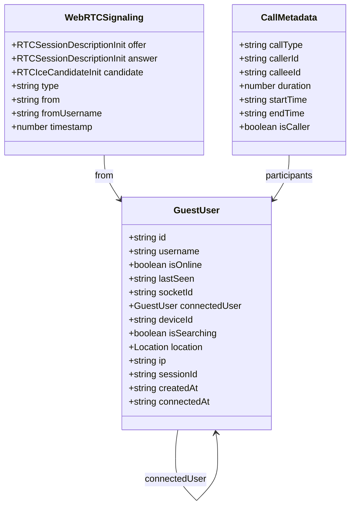
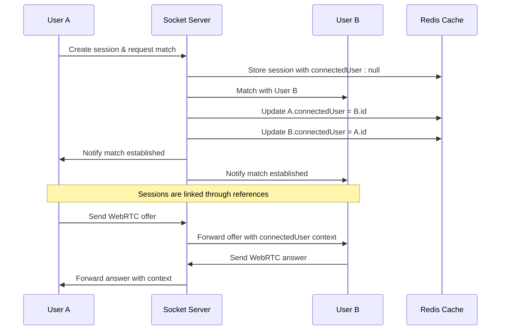
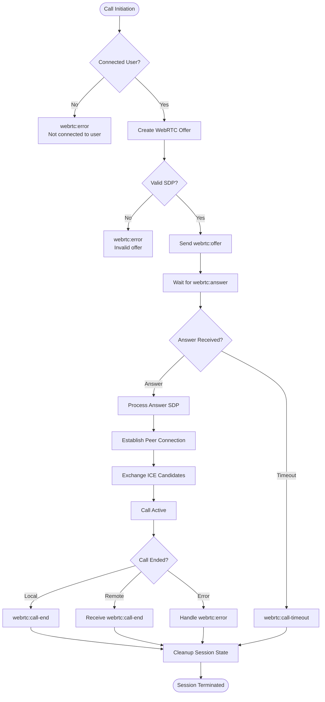
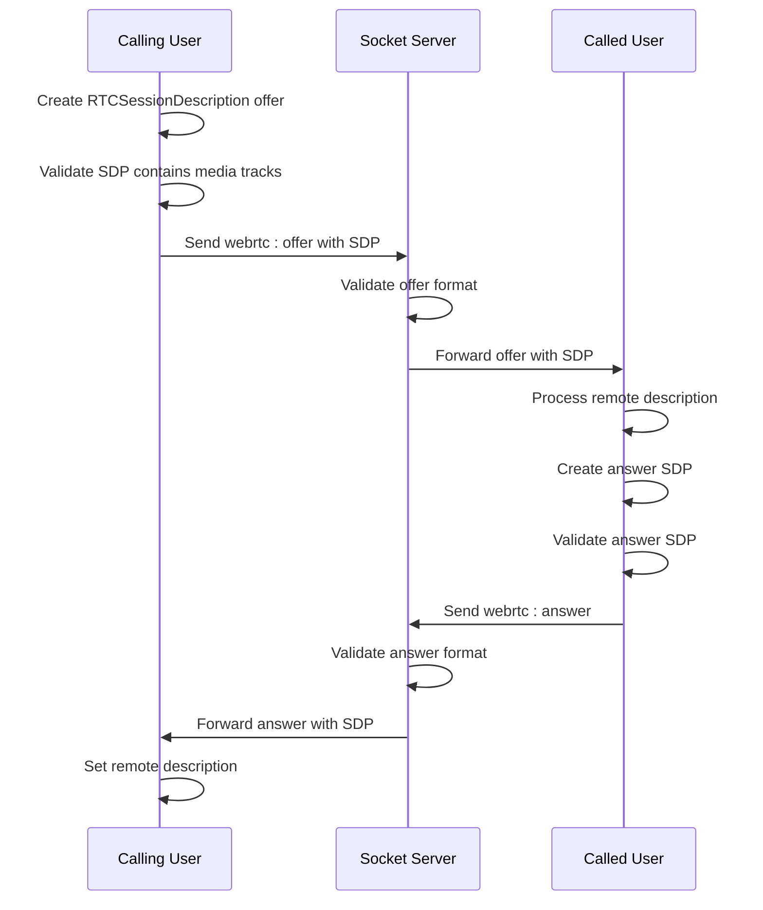
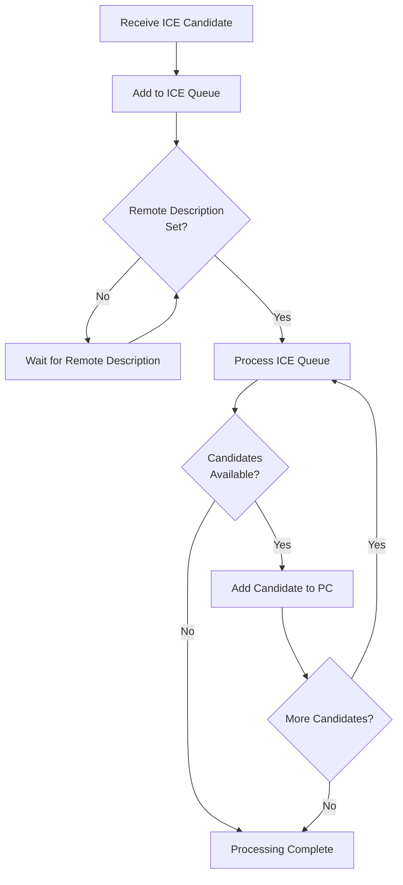
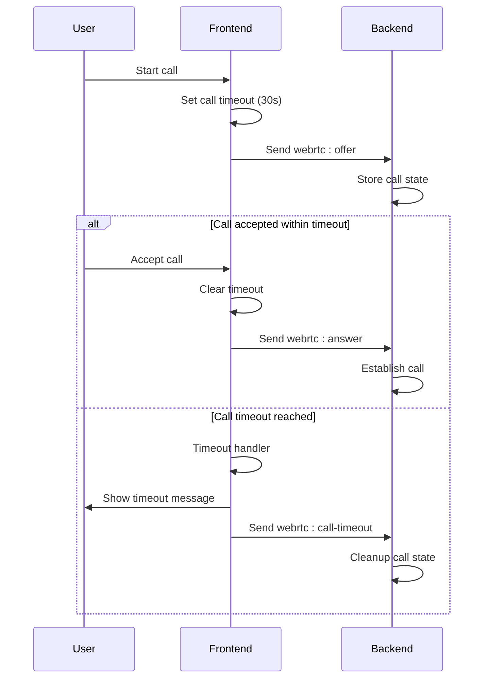
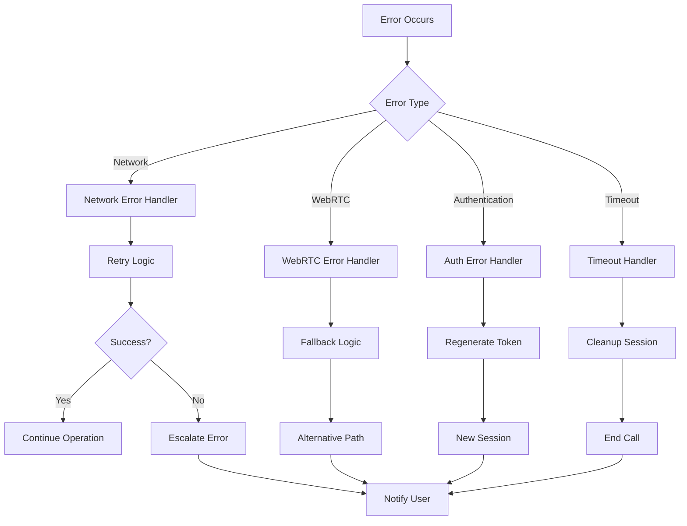
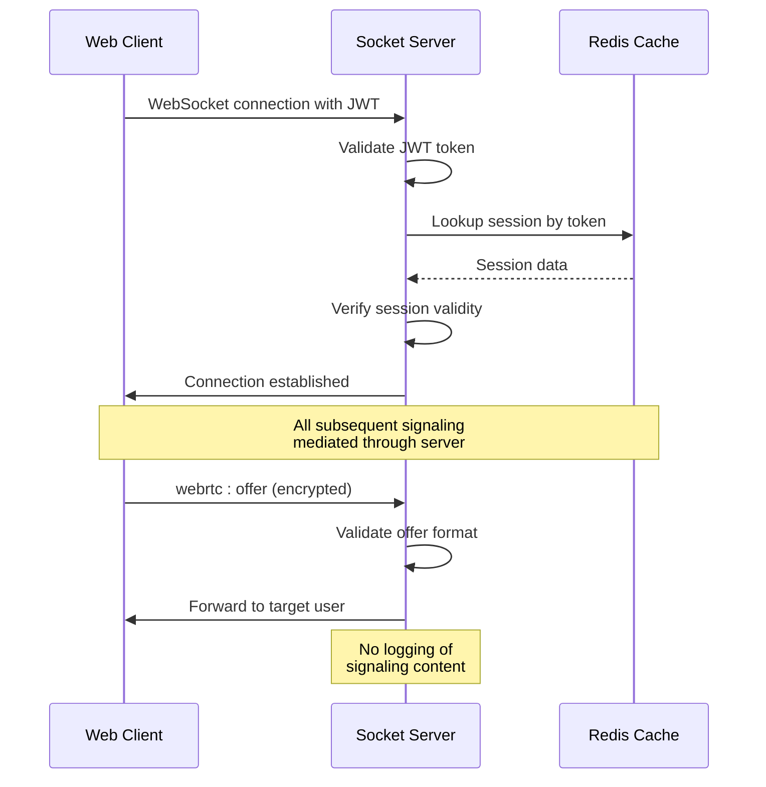
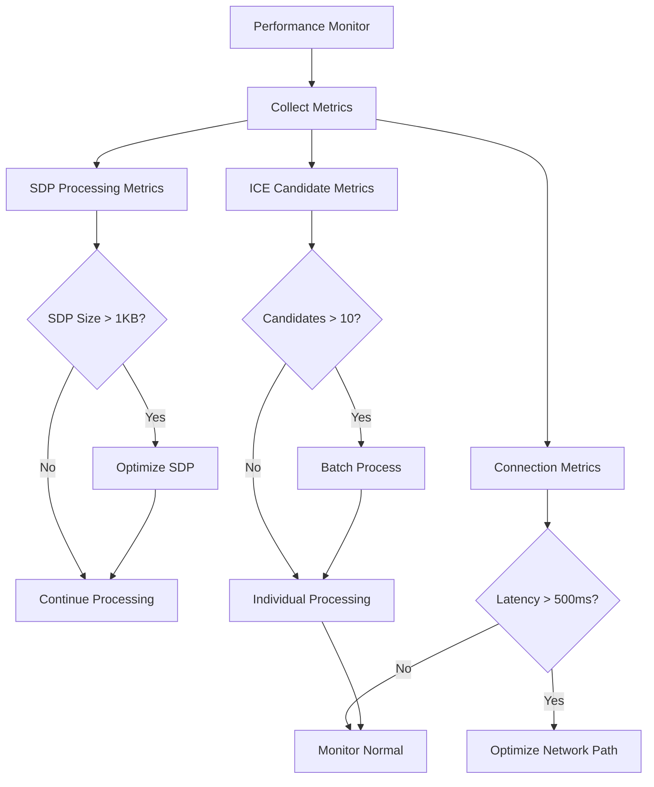
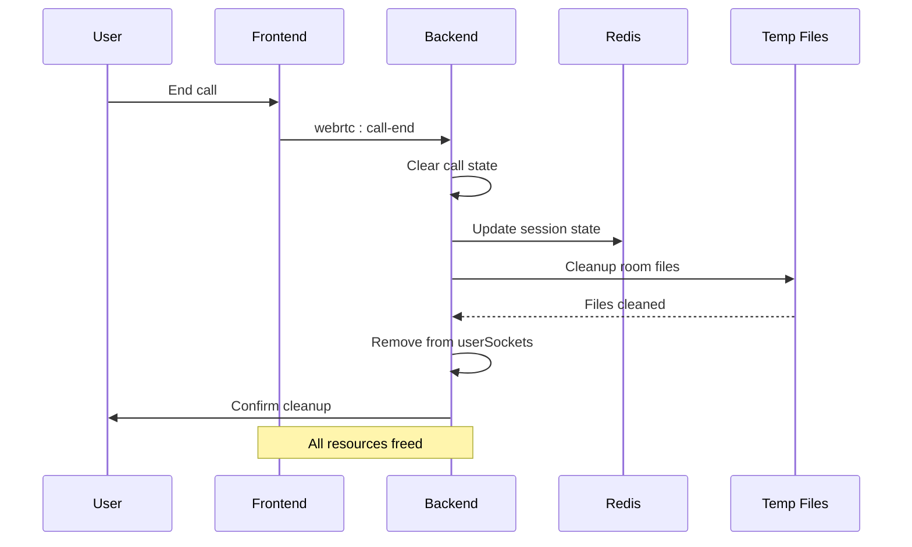

# WebRTC Session Model

<cite>
**Referenced Files in This Document**
- [socketHandlers.js](file://backend/src/socket/socketHandlers.js)
- [useWebRTC.ts](file://web/hooks/useWebRTC.ts)
- [socket.ts](file://web/lib/socket.ts)
- [GuestSessionContext.tsx](file://web/contexts/GuestSessionContext.tsx)
- [redisGuestManager.js](file://backend/src/utils/redisGuestManager.js)
- [guestController.js](file://backend/src/controllers/guestController.js)
- [tempFileStorage.js](file://backend/src/utils/tempFileStorage.js)
- [CALL_DISCONNECTION_TEST.md](file://web/CALL_DISCONNECTION_TEST.md)
- [WEBRTC_FIX.md](file://WEBRTC_FIX.md)
</cite>

## Table of Contents
1. [Introduction](#introduction)
2. [Signaling Data Model](#signaling-data-model)
3. [Session State Management](#session-state-management)
4. [Signaling Flow Architecture](#signaling-flow-architecture)
5. [Socket.IO Event Structure](#socketio-event-structure)
6. [SDP and ICE Candidate Handling](#sdp-and-ice-candidate-handling)
7. [Timeout Mechanisms](#timeout-mechanisms)
8. [Error Handling](#error-handling)
9. [Security Considerations](#security-considerations)
10. [Performance Implications](#performance-implications)
11. [Cleanup Procedures](#cleanup-procedures)
12. [Troubleshooting Guide](#troubleshooting-guide)

## Introduction

The WebRTC Session Model in the Realtime Chat App provides ephemeral peer-to-peer communication capabilities through a server-mediated signaling system. Unlike traditional persistent storage systems, this model maintains signaling data exclusively in memory, leveraging Redis for temporary session storage with automatic cleanup mechanisms.

The system operates on a guest user model where each session is temporary, automatically expiring after 2 hours of inactivity. All WebRTC signaling data—including offers, answers, ICE candidates, and call metadata—is stored transiently and never persisted to disk, ensuring privacy and preventing data retention beyond session boundaries.

## Signaling Data Model

### Core Data Structures

The WebRTC signaling system utilizes several key data structures that exist purely in memory:



**Diagram sources**
- [GuestSessionContext.tsx](file://web/contexts/GuestSessionContext.tsx#L7-L21)
- [socketHandlers.js](file://backend/src/socket/socketHandlers.js#L472-L504)

### Ephemeral Storage Architecture

The signaling data follows a strict ephemeral pattern:

| Data Type | Storage Location | Lifetime | Cleanup Trigger |
|-----------|------------------|----------|-----------------|
| Session State | Memory + Redis | 2 hours | Inactivity timeout |
| WebRTC Offers | Memory buffer | Until answer received | Call timeout |
| WebRTC Answers | Memory buffer | Until call established | Call termination |
| ICE Candidates | Memory queue | Until remote description | Call completion |
| Call Metadata | Memory logs | Until page refresh | Session end |

**Section sources**
- [redisGuestManager.js](file://backend/src/utils/redisGuestManager.js#L105-L147)
- [GuestSessionContext.tsx](file://web/contexts/GuestSessionContext.tsx#L322-L350)

## Session State Management

### ConnectedUser References

The session state is maintained through the `connectedUser` reference within the GuestUser model, eliminating the need for dedicated session storage tables:



**Diagram sources**
- [socketHandlers.js](file://backend/src/socket/socketHandlers.js#L472-L504)
- [GuestSessionContext.tsx](file://web/contexts/GuestSessionContext.tsx#L397-L452)

### Session Lifecycle Management

The session lifecycle follows a strict temporal pattern:

1. **Creation**: Guest session created with 2-hour expiry
2. **Activation**: Socket connection establishes presence
3. **Linking**: Users become connected through mutual references
4. **Communication**: Signaling data flows through server mediation
5. **Termination**: Automatic cleanup on call end or timeout

**Section sources**
- [redisGuestManager.js](file://backend/src/utils/redisGuestManager.js#L82-L106)
- [guestController.js](file://backend/src/controllers/guestController.js#L20-L50)

## Signaling Flow Architecture

### Message Flow Patterns

The signaling system implements a bidirectional flow pattern optimized for WebRTC establishment:



**Diagram sources**
- [socketHandlers.js](file://backend/src/socket/socketHandlers.js#L472-L504)
- [useWebRTC.ts](file://web/hooks/useWebRTC.ts#L593-L638)

## Socket.IO Event Structure

### Core WebRTC Events

The system defines six primary Socket.IO events for WebRTC signaling:

| Event Name | Direction | Payload Structure | Purpose |
|------------|-----------|-------------------|---------|
| `webrtc:offer` | Client → Server → Client | `{offer, type, from, fromUsername}` | Initial call invitation |
| `webrtc:answer` | Client → Server → Client | `{answer, from, fromUsername}` | Accept call response |
| `webrtc:ice-candidate` | Client → Server → Client | `{candidate, from}` | Network connectivity data |
| `webrtc:call-end` | Client → Server → Client | `{from, fromUsername}` | Terminate call early |
| `webrtc:call-reject` | Client → Server → Client | `{from, fromUsername}` | Decline incoming call |
| `webrtc:call-timeout` | Server → Client | `{from, fromUsername}` | Automatic call termination |

### Event Payload Specifications

#### Offer Event
```typescript
interface OfferPayload {
  offer: RTCSessionDescriptionInit;
  type: "audio" | "video";
  from: string;
  fromUsername: string;
}
```

#### Answer Event
```typescript
interface AnswerPayload {
  answer: RTCSessionDescriptionInit;
  from: string;
  fromUsername: string;
}
```

#### ICE Candidate Event
```typescript
interface IceCandidatePayload {
  candidate: RTCIceCandidateInit;
  from: string;
}
```

**Section sources**
- [socketHandlers.js](file://backend/src/socket/socketHandlers.js#L472-L504)
- [socket.ts](file://web/lib/socket.ts#L280-L320)

## SDP and ICE Candidate Handling

### Session Description Protocol (SDP) Management

The system handles SDP objects with comprehensive validation and logging:



**Diagram sources**
- [useWebRTC.ts](file://web/hooks/useWebRTC.ts#L329-L366)
- [useWebRTC.ts](file://web/hooks/useWebRTC.ts#L504-L537)

### ICE Candidate Queue Management

The system implements sophisticated ICE candidate queuing to handle race conditions:



**Diagram sources**
- [useWebRTC.ts](file://web/hooks/useWebRTC.ts#L750-L799)

**Section sources**
- [useWebRTC.ts](file://web/hooks/useWebRTC.ts#L329-L366)
- [useWebRTC.ts](file://web/hooks/useWebRTC.ts#L504-L537)

## Timeout Mechanisms

### Call Timeout Configuration

The system implements multiple timeout layers for robust call management:

| Timeout Type | Duration | Trigger | Action |
|--------------|----------|---------|--------|
| Call Start Timeout | 30 seconds | Offer sent | `webrtc:call-timeout` |
| ICE Connection Timeout | 15 seconds | No ICE candidates | Connection failure |
| Socket Reconnection | 20 seconds | Connection lost | Automatic retry |
| Session Expiry | 2 hours | Inactivity | Session cleanup |

### Timeout Implementation Details



**Diagram sources**
- [useWebRTC.ts](file://web/hooks/useWebRTC.ts#L400-L420)
- [socketHandlers.js](file://backend/src/socket/socketHandlers.js#L680-L710)

**Section sources**
- [useWebRTC.ts](file://web/hooks/useWebRTC.ts#L400-L420)
- [socketHandlers.js](file://backend/src/socket/socketHandlers.js#L680-L710)

## Error Handling

### Comprehensive Error Management

The system implements layered error handling across multiple components:



**Diagram sources**
- [socket.ts](file://web/lib/socket.ts#L100-L150)
- [socketHandlers.js](file://backend/src/socket/socketHandlers.js#L472-L504)

### Error Response Patterns

The system provides structured error responses for different failure scenarios:

| Error Category | Socket Event | Error Message | Recovery Action |
|----------------|--------------|---------------|-----------------|
| Authentication | `webrtc:error` | "Token has expired" | Session regeneration |
| Connection | `webrtc:error` | "Connected user is not available" | Wait for user |
| Validation | `webrtc:error` | "Invalid offer format" | Resend offer |
| Network | `webrtc:error` | "Failed to establish connection" | Retry connection |

**Section sources**
- [socket.ts](file://web/lib/socket.ts#L100-L150)
- [socketHandlers.js](file://backend/src/socket/socketHandlers.js#L472-L504)

## Security Considerations

### Peer-to-Peer Signaling Security

The WebRTC signaling system implements several security measures:

#### Authentication Layer
- **JWT Token Validation**: All WebSocket connections require valid JWT tokens
- **Session Binding**: Tokens bind to specific guest sessions with 2-hour expiry
- **Automatic Token Refresh**: Seamless token regeneration prevents session interruption

#### Data Protection
- **Ephemeral Storage**: All signaling data exists only in memory
- **No Persistent Logging**: Signaling messages are never written to disk
- **Temporary Expiry**: Sessions automatically expire after 2 hours of inactivity

#### Network Security
- **STUN/TURN Server Support**: Configurable ICE servers for NAT traversal
- **Connection Encryption**: All WebRTC traffic encrypted using DTLS
- **Rate Limiting**: Server-side rate limiting prevents abuse

### Security Implementation Details



**Diagram sources**
- [socket.ts](file://web/lib/socket.ts#L41-L89)
- [guestController.js](file://backend/src/controllers/guestController.js#L20-L50)

**Section sources**
- [socket.ts](file://web/lib/socket.ts#L41-L89)
- [guestController.js](file://backend/src/controllers/guestController.js#L20-L50)

## Performance Implications

### Large SDP Payload Handling

The system optimizes for efficient SDP processing and minimal bandwidth usage:

#### SDP Size Optimization
- **Selective Media**: Only includes requested media types (audio/video)
- **Bandwidth Adaptation**: Supports adaptive bitrate negotiation
- **Compression**: Minimal SDP overhead through standardized formats

#### Memory Management
- **Streaming Processing**: Processes SDP in chunks to minimize memory footprint
- **Garbage Collection**: Automatic cleanup of processed signaling data
- **Queue Limits**: Maximum 10 ICE candidates queued per connection

### Performance Monitoring



**Diagram sources**
- [useWebRTC.ts](file://web/hooks/useWebRTC.ts#L329-L366)
- [useWebRTC.ts](file://web/hooks/useWebRTC.ts#L504-L537)

**Section sources**
- [useWebRTC.ts](file://web/hooks/useWebRTC.ts#L329-L366)
- [useWebRTC.ts](file://web/hooks/useWebRTC.ts#L504-L537)

## Cleanup Procedures

### Automatic Resource Management

The system implements comprehensive cleanup procedures to prevent resource leaks:

#### Session Cleanup Triggers
- **Call Termination**: Manual or automatic call end
- **Timeout Expiration**: 30-second call timeout
- **Network Disconnection**: Client socket disconnection
- **Manual Cleanup**: Explicit cleanup requests

#### Cleanup Process Flow



**Diagram sources**
- [socketHandlers.js](file://backend/src/socket/socketHandlers.js#L680-L710)
- [tempFileStorage.js](file://backend/src/utils/tempFileStorage.js#L101-L162)

### Resource Cleanup Implementation

| Resource Type | Cleanup Method | Trigger | Time Complexity |
|---------------|----------------|---------|-----------------|
| Peer Connections | `pc.close()` | Call end | O(1) |
| Media Streams | `stream.getTracks().forEach(track => track.stop())` | Call end | O(n) |
| ICE Queues | `iceCandidateQueue.clear()` | Call end | O(1) |
| Socket References | `userSockets.delete()` | Disconnection | O(1) |
| Temporary Files | `tempFileStorage.deleteRoomFiles()` | Room cleanup | O(k) |

**Section sources**
- [socketHandlers.js](file://backend/src/socket/socketHandlers.js#L680-L710)
- [tempFileStorage.js](file://backend/src/utils/tempFileStorage.js#L101-L162)
- [useWebRTC.ts](file://web/hooks/useWebRTC.ts#L593-L638)

## Troubleshooting Guide

### Common Issues and Solutions

#### Call Establishment Failures

**Issue**: Calls get stuck in "connecting" state
**Symptoms**: 
- ICE connection state remains "connecting"
- No remote video/audio received
- Console shows "ICE checking connectivity..."

**Solution**: 
1. Check browser console for WebRTC errors
2. Verify STUN/TURN server accessibility
3. Test on different network environments
4. Ensure media permissions are granted

#### Signaling Delays

**Issue**: WebRTC offers/answers take too long to arrive
**Symptoms**:
- Calls timeout before being answered
- Delayed ICE candidate exchange
- Slow call establishment

**Solution**:
1. Monitor network latency to signaling server
2. Check Redis connectivity for session lookups
3. Verify socket reconnection logic
4. Review ICE candidate queue processing

#### Session Management Issues

**Issue**: Sessions expire unexpectedly
**Symptoms**:
- Calls terminate after 2 hours
- Token regeneration failures
- Stale session references

**Solution**:
1. Monitor session heartbeat intervals
2. Check Redis expiration settings
3. Verify token refresh mechanisms
4. Review cleanup interval timing

### Diagnostic Tools

#### Frontend Diagnostics
```typescript
// Enable WebRTC logging
console.log("WebRTC State:", {
  peerConnection: peerConnection.current?.signalingState,
  iceState: peerConnection.current?.iceConnectionState,
  callState: callState,
  localTracks: localStream?.getTracks().map(t => t.kind),
  remoteTracks: remoteStream?.getTracks().map(t => t.kind)
});
```

#### Backend Diagnostics
```javascript
// Check Redis session status
await redisGuestManager.getGuestSession(sessionId);
// Monitor socket connections
console.log("Active sockets:", userSockets.size);
console.log("Connected users:", connectedUsers.size);
```

**Section sources**
- [WEBRTC_FIX.md](file://WEBRTC_FIX.md#L308-L316)
- [CALL_DISCONNECTION_TEST.md](file://web/CALL_DISCONNECTION_TEST.md#L0-L44)