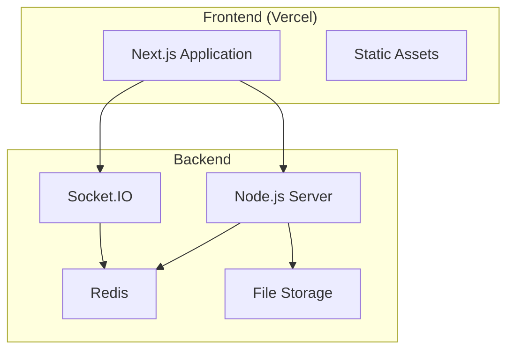
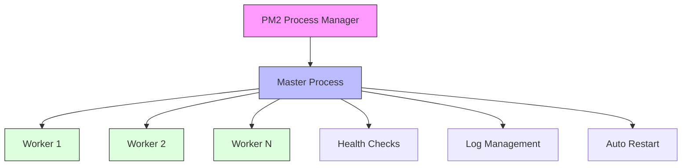
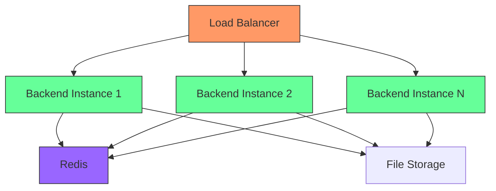
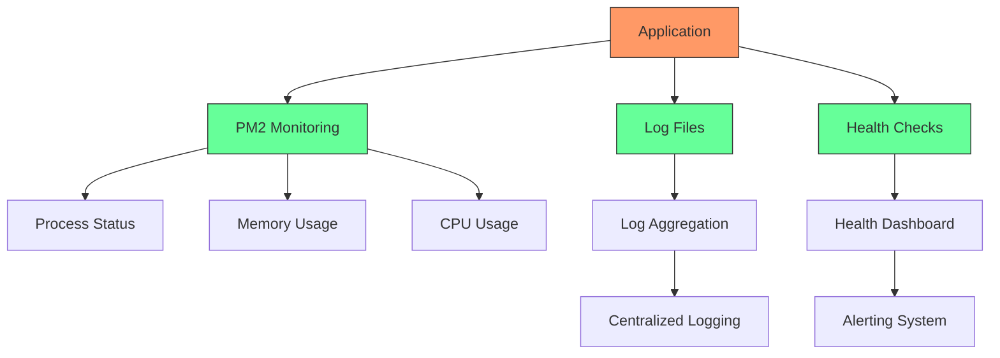

# Deployment Architecture

<cite>
**Referenced Files in This Document**   
- [ecosystem.config.js](file://backend/ecosystem.config.js)
- [package.json](file://backend/package.json)
- [WARP.md](file://backend/WARP.md)
- [.env](file://backend/.env)
- [server.js](file://backend/src/server.js)
- [cluster.js](file://backend/src/cluster.js)
- [socketServer.js](file://backend/src/socket/socketServer.js)
- [redisGuestManager.js](file://backend/src/utils/redisGuestManager.js)
- [next.config.mjs](file://web/next.config.mjs)
</cite>

## Table of Contents
1. [Introduction](#introduction)
2. [Production Deployment Topology](#production-deployment-topology)
3. [PM2 Process Management](#pm2-process-management)
4. [Scaling Considerations](#scaling-considerations)
5. [Database and Redis Deployment](#database-and-redis-deployment)
6. [Cloudflare WARP Integration](#cloudflare-warp-integration)
7. [Monitoring and Health Checks](#monitoring-and-health-checks)
8. [CI/CD Considerations](#cicd-considerations)

## Introduction
The Realtime Chat App is a scalable real-time communication platform that supports chat, audio, and video interactions through WebRTC and Socket.IO. This document details the production deployment architecture, focusing on the separation between frontend and backend components, process management, scaling strategies, and operational considerations. The system is designed with horizontal scalability in mind, leveraging Redis for shared state management and PM2 for process clustering and monitoring.

## Production Deployment Topology
The application follows a modern microservices-inspired architecture with a clear separation between frontend and backend components. The frontend is hosted on Vercel, as evidenced by the presence of `@vercel` in the vendor chunks and the CORS configuration that explicitly allows vercel.app domains. The backend runs on a Node.js server, designed to be deployed on platforms like Render or similar PaaS providers.

The topology consists of:
- **Frontend**: Next.js application hosted on Vercel with static asset serving and server-side rendering capabilities
- **Backend**: Node.js/Express server handling HTTP API requests and Socket.IO real-time communication
- **Real-time Communication**: Socket.IO for WebSocket connections with Redis adapter for horizontal scaling
- **State Management**: Redis for guest session storage and shared state across instances
- **File Storage**: Temporary local storage with periodic cleanup (24-hour retention)

The frontend communicates with the backend through REST APIs for authentication and user management, and through WebSocket connections for real-time chat and WebRTC signaling. The architecture is stateless, allowing for easy horizontal scaling of backend instances.

**Diagram sources**
- [next.config.mjs](file://web/next.config.mjs)
- [server.js](file://backend/src/server.js)
- [socketServer.js](file://backend/src/socket/socketServer.js)

**Section sources**
- [WARP.md](file://backend/WARP.md)
- [next.config.mjs](file://web/next.config.mjs)

## PM2 Process Management
The backend utilizes PM2 as the process manager, configured through the ecosystem.config.js file to handle process clustering, restart policies, and environment management. Three distinct deployment modes are defined in the configuration:

1. **Development Mode**: Single instance with file watching enabled for automatic restarts during development
2. **Production Mode**: Clustered mode using all available CPU cores with health monitoring and automatic restarts
3. **Load Balanced Mode**: Multiple forked instances with port incrementation for use behind a load balancer

The production configuration includes comprehensive process management features:
- **Process Clustering**: Uses the cluster.js file to fork worker processes across all CPU cores (`instances: 'max'`)
- **Restart Policies**: Configured with `max_restarts: 5` within a `min_uptime: '10s'` window to prevent infinite restart loops
- **Memory Management**: Automatic restart when memory consumption exceeds 1GB (`max_memory_restart: '1G'`)
- **Graceful Shutdown**: 5-second timeout for graceful shutdown of processes
- **Health Monitoring**: HTTP health checks performed every 30 seconds with a 5-second timeout

The PM2 configuration also includes deployment automation through the `post-deploy` hook, which installs dependencies and reloads the PM2 configuration, enabling zero-downtime deployments.

**Diagram sources**
- [ecosystem.config.js](file://backend/ecosystem.config.js)
- [cluster.js](file://backend/src/cluster.js)

**Section sources**
- [ecosystem.config.js](file://backend/ecosystem.config.js)
- [cluster.js](file://backend/src/cluster.js)

## Scaling Considerations
The application is designed with horizontal scaling in mind, particularly for the real-time nature of the chat functionality. Several architectural patterns enable scaling across multiple backend instances:

### Socket.IO Sticky Sessions
For horizontal scaling of Socket.IO servers, sticky sessions are required to ensure that WebSocket connections from the same client are routed to the same backend instance. This is critical because Socket.IO maintains connection state in memory when not using Redis. The configuration suggests that load balancing should be implemented with sticky sessions to maintain connection affinity.

### Redis for Shared State
The primary mechanism for scaling Socket.IO across multiple instances is the Redis adapter, which allows sharing of Socket.IO rooms and events between processes and servers. When Redis is configured (`REDIS_URL` environment variable), the application automatically sets up the Redis adapter for Socket.IO, enabling true horizontal scaling without requiring sticky sessions.

The application also uses Redis for guest session storage through the RedisGuestManager utility. This allows user session data to be shared across instances, making the application stateless and enabling horizontal scaling. When Redis is unavailable, the application falls back to in-memory storage, which limits scaling to a single instance.

### Horizontal Scaling of Backend Instances
The PM2 configuration supports multiple scaling strategies:
- **Process Clustering**: Multiple worker processes on a single server using Node.js cluster module
- **Multiple Instances**: Multiple forked instances with port incrementation for load balancing
- **Distributed Deployment**: Multiple server instances with Redis for state sharing

The load balanced mode in the ecosystem configuration runs 4 instances with port incrementation, allowing them to be placed behind a load balancer. Each instance runs on a different port (3001, 3002, 3003, 3004), enabling the load balancer to distribute traffic across them.

**Diagram sources**
- [ecosystem.config.js](file://backend/ecosystem.config.js)
- [redisGuestManager.js](file://backend/src/utils/redisGuestManager.js)
- [socketServer.js](file://backend/src/socket/socketServer.js)

**Section sources**
- [WARP.md](file://backend/WARP.md)
- [ecosystem.config.js](file://backend/ecosystem.config.js)
- [redisGuestManager.js](file://backend/src/utils/redisGuestManager.js)

## Database and Redis Deployment
The application's data persistence strategy is minimal by design, focusing on ephemeral data for real-time interactions. While MongoDB code exists in the repository, it is not currently used according to the WARP.md documentation. The application relies primarily on Redis for state management and temporary storage.

### Redis Deployment Options
Redis can be deployed in several ways depending on the environment and requirements:

**Self-Hosted Options:**
- **Docker Container**: Running Redis in a Docker container on the same server as the application
- **Dedicated Server**: Running Redis on a separate server for better performance and isolation
- **Kubernetes**: Deploying Redis as a stateful set in a Kubernetes cluster

**Cloud Service Options:**
- **Redis Cloud**: Fully managed Redis service with multiple deployment options
- **AWS ElastiCache**: Amazon's managed Redis service
- **Google Cloud Memorystore**: Google's managed Redis service
- **Azure Cache for Redis**: Microsoft's managed Redis service
- **Upstash**: Serverless Redis with REST API

The application is configured to connect to Redis using the `REDIS_URL` environment variable, which supports the standard Redis connection string format. This allows easy configuration regardless of the deployment method.

### Database Considerations
Although MongoDB is not currently used, the codebase includes configuration for MongoDB connections. If persistence is required in the future, MongoDB can be deployed as:
- **Self-Hosted**: On a dedicated server or in Docker containers
- **Cloud Services**: MongoDB Atlas (recommended), AWS DocumentDB, or Azure Cosmos DB

The application's stateless design means that database failures do not affect the core chat functionality, as user sessions are stored in Redis or in-memory. This provides graceful degradation when database services are unavailable.

**Section sources**
- [WARP.md](file://backend/WARP.md)
- [.env](file://backend/.env)
- [database.js](file://backend/src/config/database.js)

## Cloudflare WARP Integration
The WARP.md file suggests potential Cloudflare integration, although specific configuration details are limited. Cloudflare WARP (now part of Cloudflare Zero Trust) can be used to enhance the application's security and performance in several ways:

1. **DDoS Protection**: Cloudflare's global network can absorb and mitigate DDoS attacks before they reach the origin server
2. **Web Application Firewall (WAF)**: Protect against common web vulnerabilities and attacks
3. **SSL/TLS Termination**: Offload SSL/TLS processing to Cloudflare's edge network
4. **Caching**: Cache static assets at the edge to reduce load on the origin server
5. **Load Balancing**: Distribute traffic across multiple backend instances with health checks
6. **Zero Trust Security**: Implement identity-based access controls through Cloudflare Access

The application's CORS configuration already includes vercel.app domains, which suggests that the frontend is served through Vercel's CDN. Integrating Cloudflare would create a multi-layered CDN approach, with Cloudflare in front of Vercel for the frontend and directly in front of the backend server.

To implement Cloudflare WARP/Zero Trust:
1. Update DNS records to point to Cloudflare's nameservers
2. Configure SSL/TLS settings (Full or Full (strict) mode recommended)
3. Set up Page Rules for caching static assets
4. Configure WAF rules to protect against common threats
5. Implement rate limiting to prevent abuse of the real-time features
6. Set up health checks and load balancing for multiple backend instances

**Section sources**
- [WARP.md](file://backend/WARP.md)
- [security.js](file://backend/src/middleware/security.js)

## Monitoring and Health Checks
The application includes comprehensive monitoring and health check capabilities to ensure reliability and facilitate troubleshooting.

### Health Check Endpoints
Two primary health check endpoints are available:
- **/health**: Basic health check that returns server status, uptime, and version information
- **/api/socket/stats**: Detailed Socket.IO statistics including connected sockets, rooms, and namespace information

The /health endpoint is used by PM2 for health monitoring, with checks performed every 30 seconds. This enables automatic recovery when the application becomes unresponsive.

### Logging Strategy
The application uses Winston for logging with multiple transports:
- **Console**: For development and debugging
- **File**: Logs written to files in the logs directory (combined.log and error.log)
- **Structured Logging**: JSON format with timestamps and error stack traces

Log files are managed by PM2, which handles log rotation and aggregation across multiple processes. The configuration directs all instances to write to the same log files, enabling centralized log collection.

### Monitoring Recommendations
For production deployment, the following monitoring setup is recommended:
1. **Application Monitoring**: Use PM2's built-in monitoring (pm2 monit) or integrate with external tools like New Relic or Datadog
2. **Infrastructure Monitoring**: Monitor server metrics (CPU, memory, disk, network) using tools like Prometheus and Grafana
3. **Log Aggregation**: Use centralized logging solutions like ELK Stack (Elasticsearch, Logstash, Kibana) or Splunk
4. **Real-time Metrics**: Monitor active users, connected users, and message rates through the real-time statistics broadcast
5. **Alerting**: Set up alerts for high error rates, slow response times, or service outages

The application broadcasts real-time statistics to all connected clients, which can be leveraged for operational dashboards showing current user activity and system performance.

**Diagram sources**
- [ecosystem.config.js](file://backend/ecosystem.config.js)
- [server.js](file://backend/src/server.js)
- [socketHandlers.js](file://backend/src/socket/socketHandlers.js)

**Section sources**
- [ecosystem.config.js](file://backend/ecosystem.config.js)
- [server.js](file://backend/src/server.js)
- [socketHandlers.js](file://backend/src/socket/socketHandlers.js)

## CI/CD Considerations
The deployment architecture includes several features that facilitate continuous integration and deployment workflows.

### Package Scripts
The package.json files for both frontend and backend include scripts that support the CI/CD pipeline:
- **Backend Scripts**: start, dev, dev:cluster, test, test:watch, test:coverage
- **Frontend Scripts**: build, dev, lint, start, test, test:watch, test:coverage

These scripts enable automated testing, building, and deployment in CI/CD environments. The test scripts with coverage reporting allow for quality gates in the pipeline.

### PM2 Deployment Automation
The ecosystem.config.js includes a deployment configuration with a post-deploy hook that automatically runs `npm install` and reloads the PM2 configuration. This enables zero-downtime deployments when combined with PM2's reload command, which performs a rolling restart of processes.

### Environment Configuration
The application uses environment variables for configuration, following the 12-factor app methodology. This allows the same codebase to be deployed across multiple environments (development, staging, production) with different configurations. The .env file provides default values, but production deployments should set environment variables through the hosting platform's interface.

### Recommended CI/CD Pipeline
A robust CI/CD pipeline for this application would include:
1. **Code Validation**: Run linting and type checking on pull requests
2. **Testing**: Execute unit and integration tests with coverage reporting
3. **Build**: Create optimized builds for both frontend and backend
4. **Staging Deployment**: Deploy to a staging environment for manual testing
5. **Production Deployment**: Deploy to production using PM2's zero-downtime reload
6. **Post-Deployment Verification**: Check health endpoints and monitor logs for errors

The separation of frontend (Vercel) and backend (Node.js server) allows for independent deployment pipelines, enabling teams to deploy changes to either component without affecting the other.

**Section sources**
- [package.json](file://backend/package.json)
- [package.json](file://web/package.json)
- [ecosystem.config.js](file://backend/ecosystem.config.js)
- [WARP.md](file://backend/WARP.md)