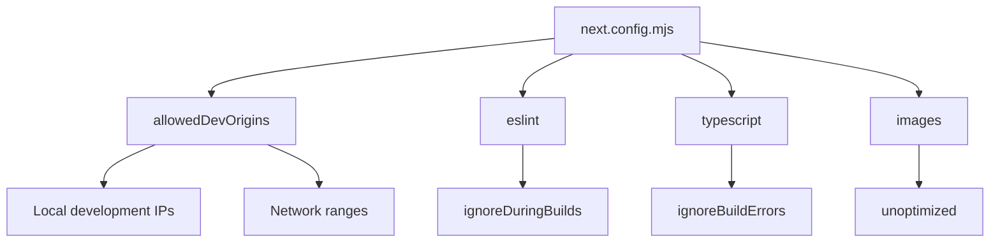
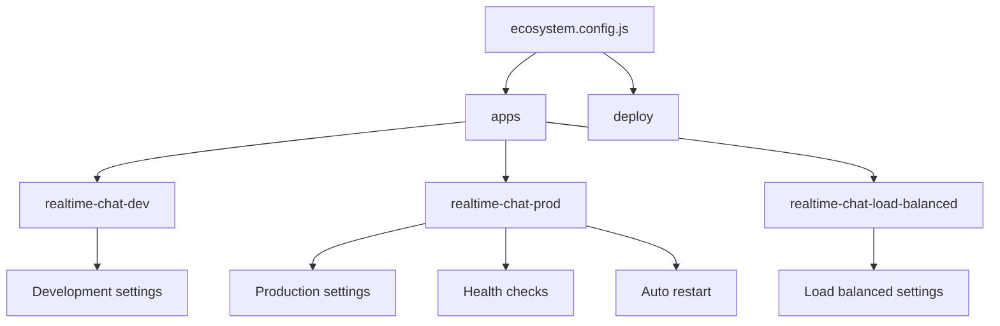
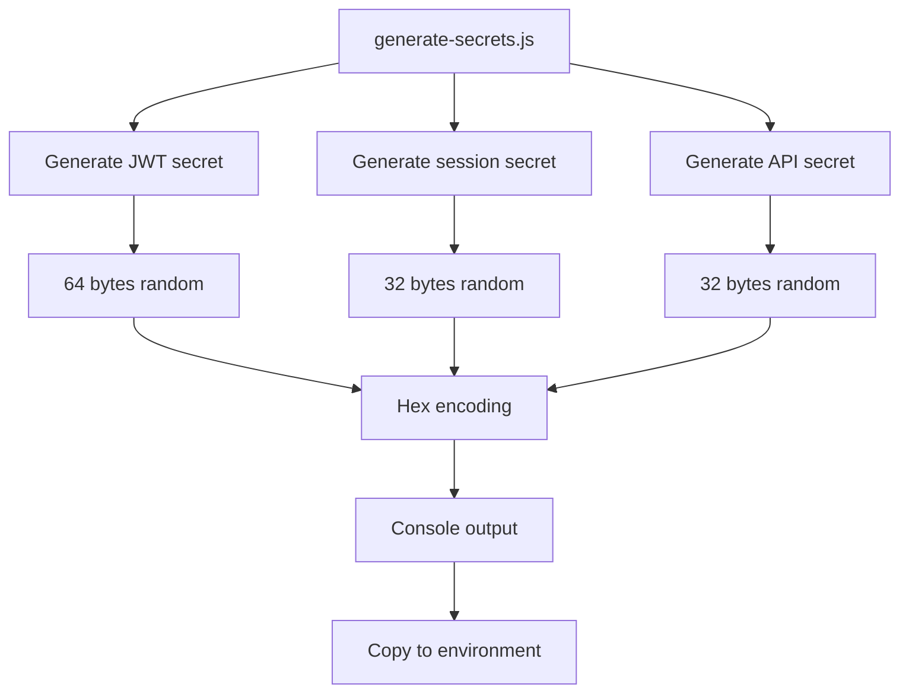

# Environment Configuration

<cite>
**Referenced Files in This Document**   
- [backend/.env](file://backend/.env)
- [web/.env](file://web/.env)
- [web/.env.local](file://web/.env.local)
- [backend/generate-secrets.js](file://backend/generate-secrets.js)
- [backend/src/config/database.js](file://backend/src/config/database.js)
- [backend/src/config/logger.js](file://backend/src/config/logger.js)
- [backend/src/server.js](file://backend/src/server.js)
- [web/lib/api.ts](file://web/lib/api.ts)
- [web/lib/socket.ts](file://web/lib/socket.ts)
- [web/next.config.mjs](file://web/next.config.mjs)
- [backend/ecosystem.config.js](file://backend/ecosystem.config.js)
</cite>

## Table of Contents
1. [Introduction](#introduction)
2. [Backend Environment Variables](#backend-environment-variables)
3. [Frontend Environment Variables](#frontend-environment-variables)
4. [Configuration Files](#configuration-files)
5. [Environment-Specific Configuration](#environment-specific-configuration)
6. [Configuration Validation and Fallbacks](#configuration-validation-and-fallbacks)
7. [Secrets Management](#secrets-management)
8. [Sample Configuration Files](#sample-configuration-files)
9. [Conclusion](#conclusion)

## Introduction
This document provides comprehensive guidance on environment configuration for the Realtime Chat App, covering both backend and frontend components. The configuration system enables flexible deployment across development, staging, and production environments while maintaining security best practices. The application uses environment variables to manage settings for database connections, security parameters, logging, and service endpoints. This configuration approach allows for environment-specific settings without code changes, supporting seamless deployment across different infrastructure setups.

**Section sources**
- [backend/.env](file://backend/.env)
- [web/.env](file://web/.env)
- [web/.env.local](file://web/.env.local)

## Backend Environment Variables
The backend environment variables configure server behavior, security settings, and service connections. These variables are loaded via dotenv and used throughout the application to control functionality.

### Server Configuration
The server configuration variables define the basic operation parameters for the backend service:

- **PORT**: Specifies the port number the server listens on (default: 3001)
- **NODE_ENV**: Defines the runtime environment (development, production, test)
- **CORS_ORIGIN**: Comma-separated list of allowed origins for cross-origin requests

These variables control the server's network interface and security policies, with CORS_ORIGIN being particularly important for allowing connections from frontend applications running on different domains or ports.

**Section sources**
- [backend/.env](file://backend/.env#L2-L5)
- [backend/src/server.js](file://backend/src/server.js#L11)

### Security and Authentication
Security-related environment variables manage authentication mechanisms and protection against common attacks:

- **JWT_SECRET**: Cryptographic key used to sign JSON Web Tokens (must be strong in production)
- **JWT_EXPIRES_IN**: Token expiration duration (e.g., "7d" for 7 days)
- **BCRYPT_ROUNDS**: Cost factor for password hashing (higher values increase security but require more processing)
- **RATE_LIMIT_WINDOW_MS**: Time window in milliseconds for rate limiting
- **RATE_LIMIT_MAX_REQUESTS**: Maximum number of requests allowed within the rate limit window

The JWT_SECRET is particularly sensitive and must be kept confidential, as compromise would allow attackers to forge authentication tokens.

**Section sources**
- [backend/.env](file://backend/.env#L8-L10)
- [backend/src/middleware/security.js](file://backend/src/middleware/security.js)

### Redis Configuration
Redis configuration enables scalable session management and real-time data sharing across server instances:

- **REDIS_HOST**: Hostname or IP address of the Redis server
- **REDIS_PORT**: Port number for Redis connection
- **REDIS_PASSWORD**: Password for Redis authentication (empty if none)
- **REDIS_URL**: Complete Redis connection URL in standard format

Redis is used as an optional scaling mechanism, with the application falling back to in-memory storage when Redis is unavailable, providing flexibility for different deployment scenarios.

**Section sources**
- [backend/.env](file://backend/.env#L12-L16)
- [backend/src/utils/redisGuestManager.js](file://backend/src/utils/redisGuestManager.js)

### Logging Configuration
Logging settings control the verbosity and destination of application logs:

- **LOG_LEVEL**: Minimum severity level for log messages (e.g., info, debug, error)
- **LOG_FILE**: Path to the file where combined logs are written

These settings enable appropriate logging for each environment, with more verbose logging typically used in development and more concise logging in production.

**Section sources**
- [backend/.env](file://backend/.env#L28-L29)
- [backend/src/config/logger.js](file://backend/src/config/logger.js#L3-L10)

### File Upload Configuration
File upload parameters control the handling of user-uploaded content:

- **MAX_FILE_SIZE**: Maximum size in bytes for uploaded files
- **MAX_VOICE_DURATION**: Maximum duration in seconds for voice messages
- **UPLOAD_PATH**: Directory path where uploaded files are stored

These settings help prevent abuse of the file upload functionality and ensure the application handles files appropriately.

**Section sources**
- [backend/.env](file://backend/.env#L18-L21)
- [backend/src/middleware/upload.js](file://backend/src/middleware/upload.js)

### Clustering Configuration
Clustering settings enable horizontal scaling of the application across multiple CPU cores:

- **CLUSTER_MODE**: Boolean flag to enable clustering mode
- **CLUSTER_WORKERS**: Number of worker processes to create (0 for automatic detection)

These variables are particularly important in production environments where maximizing resource utilization is critical for performance.

**Section sources**
- [backend/.env](file://backend/.env#L24-L26)
- [backend/ecosystem.config.js](file://backend/ecosystem.config.js#L47-L49)

## Frontend Environment Variables
The frontend environment variables configure connections to backend services and control client-side behavior.

### API and Socket Configuration
The frontend requires configuration for connecting to backend services:

- **NEXT_PUBLIC_API_URL**: Base URL for API requests (must start with NEXT_PUBLIC_ to be exposed to browser)
- **NEXT_PUBLIC_SOCKET_URL**: Base URL for Socket.IO connections

These variables use the NEXT_PUBLIC_ prefix required by Next.js to expose environment variables to the browser, enabling the frontend to communicate with the backend API and WebSocket server.

**Section sources**
- [web/.env](file://web/.env#L1-L2)
- [web/.env.local](file://web/.env.local#L1-L2)
- [web/lib/api.ts](file://web/lib/api.ts#L3)
- [web/lib/socket.ts](file://web/lib/socket.ts#L3)

## Configuration Files
Configuration files provide additional settings that complement environment variables.

### next.config.mjs
The Next.js configuration file contains settings specific to the frontend build and development environment:



The allowedDevOrigins array specifies which development origins are permitted to access the application during development, including various IP address patterns to support mobile testing and network access.

**Diagram sources**
- [web/next.config.mjs](file://web/next.config.mjs#L2-L39)

**Section sources**
- [web/next.config.mjs](file://web/next.config.mjs#L2-L39)

### ecosystem.config.js
The PM2 ecosystem configuration manages process deployment and monitoring:



This configuration defines multiple deployment profiles for different environments, including development, production clustering, and load-balanced setups, each with appropriate settings for the target environment.

**Diagram sources**
- [backend/ecosystem.config.js](file://backend/ecosystem.config.js#L1-L97)

**Section sources**
- [backend/ecosystem.config.js](file://backend/ecosystem.config.js#L1-L97)

## Environment-Specific Configuration
The application supports different configuration profiles for various deployment environments.

### Development Environment
In development, the application uses permissive settings to facilitate testing and debugging:

- Localhost origins are allowed for CORS
- Detailed error messages are shown
- File watching is enabled for hot reloading
- Less restrictive rate limiting
- Verbose logging

The .env.local file in the web directory typically contains development-specific API URLs pointing to local backend instances.

**Section sources**
- [backend/.env](file://backend/.env#L2-L5)
- [web/.env.local](file://web/.env.local#L1-L2)

### Production Environment
Production configuration emphasizes security, performance, and reliability:

- Strict CORS policies with specific allowed origins
- Minimal error information exposed
- Optimized logging with appropriate log levels
- Aggressive rate limiting to prevent abuse
- Clustering enabled to utilize all CPU cores
- Health checks configured for monitoring

The production environment uses environment variables set in the deployment platform rather than local .env files, ensuring secrets are not stored in version control.

**Section sources**
- [backend/ecosystem.config.js](file://backend/ecosystem.config.js#L40-L62)
- [backend/.env](file://backend/.env#L2-L5)

## Configuration Validation and Fallbacks
The application implements several mechanisms to handle configuration issues.

### Default Values
Many configuration parameters have sensible defaults when environment variables are not set:

- PORT defaults to 3001 if not specified
- LOG_LEVEL defaults to "info" if not specified
- NODE_ENV defaults to "development" if not specified

These defaults ensure the application can run even with minimal configuration, reducing setup complexity for development.

**Section sources**
- [backend/src/server.js](file://backend/src/server.js#L258)
- [backend/src/config/logger.js](file://backend/src/config/logger.js#L3)

### Graceful Degradation
The application implements graceful degradation for optional services:

- Redis is optional; the application falls back to in-memory storage if Redis is unavailable
- Clustering is optional; the application runs as a single process if CLUSTER_MODE is false
- Rate limiting is applied but won't prevent service operation if misconfigured

This approach ensures the application remains functional even when certain configuration aspects are suboptimal or services are temporarily unavailable.

**Section sources**
- [backend/src/utils/redisGuestManager.js](file://backend/src/utils/redisGuestManager.js#L15-L20)
- [backend/src/server.js](file://backend/src/server.js#L215-L225)

## Secrets Management
Proper secrets management is critical for application security.

### generate-secrets.js Utility
The generate-secrets.js utility creates cryptographically secure secrets for production deployment:



This script uses Node.js's crypto module to generate cryptographically secure random bytes, which are then converted to hexadecimal strings for use as environment variables.

**Diagram sources**
- [backend/generate-secrets.js](file://backend/generate-secrets.js#L1-L44)

**Section sources**
- [backend/generate-secrets.js](file://backend/generate-secrets.js#L1-L44)

### Security Best Practices
The following security practices should be followed:

- Never commit secrets to version control
- Use different secrets for different environments
- Rotate secrets periodically
- Store secrets in environment variables or secure secret management services
- Limit access to secrets to only those who need them

The generate-secrets.js script emphasizes these practices with warnings and recommendations in its output.

**Section sources**
- [backend/generate-secrets.js](file://backend/generate-secrets.js#L38-L44)

## Sample Configuration Files
Below are sample configuration files for different environments.

### Sample .env (Backend)
```
# Server Configuration
PORT=3001
NODE_ENV=development
CORS_ORIGIN=http://localhost:3000,http://10.95.226.36:3000

# JWT Configuration
JWT_SECRET=your-super-secret-jwt-key-change-this-in-production
JWT_EXPIRES_IN=7d

# Redis Configuration (for scaling)
REDIS_HOST=localhost
REDIS_PORT=6379
REDIS_PASSWORD=
REDIS_URL=redis://localhost:6379

# File Upload Configuration
MAX_FILE_SIZE=10485760
MAX_VOICE_DURATION=300
UPLOAD_PATH=./uploads

# Security Configuration
BCRYPT_ROUNDS=12
RATE_LIMIT_WINDOW_MS=900000
RATE_LIMIT_MAX_REQUESTS=100

# Logging
LOG_LEVEL=info
LOG_FILE=./logs/app.log

# Clustering (production)
CLUSTER_MODE=false
CLUSTER_WORKERS=0
```

### Sample .env.local (Frontend)
```
NEXT_PUBLIC_API_URL=http://10.95.226.36:3001
NEXT_PUBLIC_SOCKET_URL=http://10.95.226.36:3001
```

These sample files illustrate the structure and content of environment configuration files, with placeholder values that should be replaced in actual deployments.

**Section sources**
- [backend/.env](file://backend/.env)
- [web/.env.local](file://web/.env.local)

## Conclusion
The Realtime Chat App's environment configuration system provides a flexible and secure way to manage settings across different deployment environments. By using environment variables for configuration, the application can be easily adapted to various infrastructure setups without code changes. The separation of backend and frontend configuration allows each component to be independently configured, while the use of standardized naming conventions and clear documentation makes the configuration process accessible. Security is prioritized through the use of the generate-secrets.js utility and clear guidance on secrets management, ensuring that sensitive information is properly protected in production environments. The combination of environment variables, configuration files, and sensible defaults creates a robust configuration system that supports both development agility and production reliability.