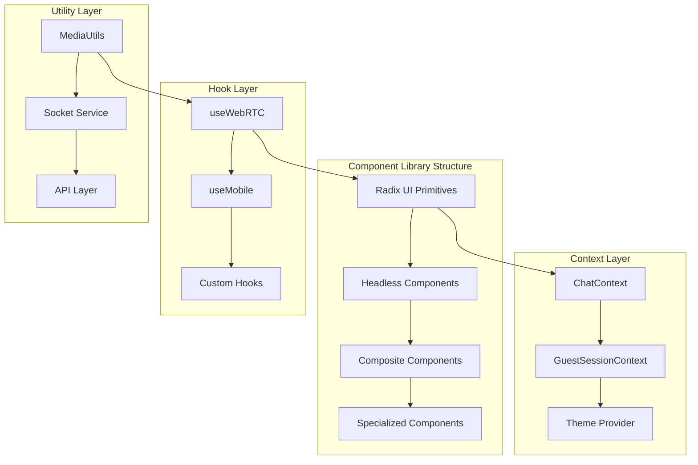
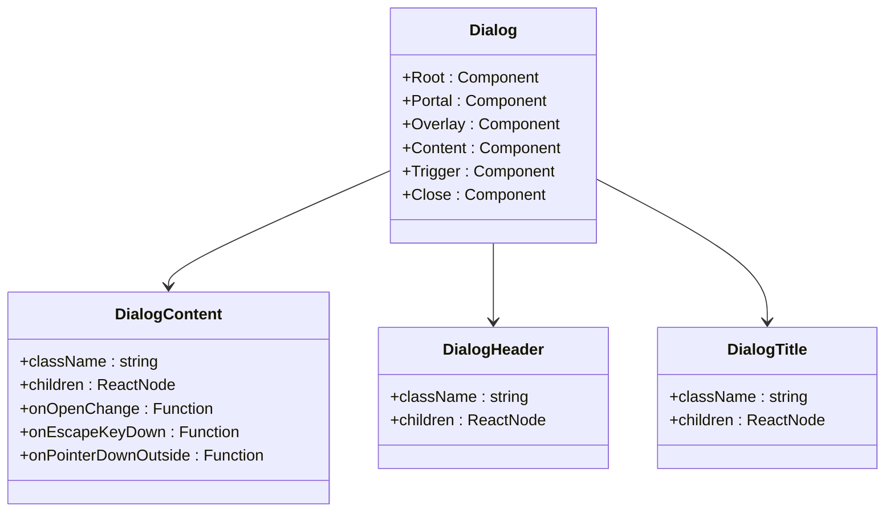
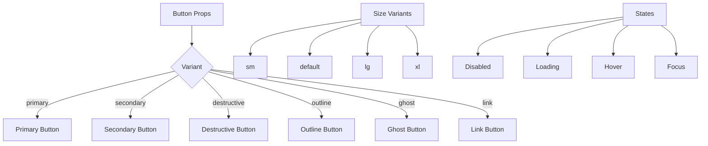
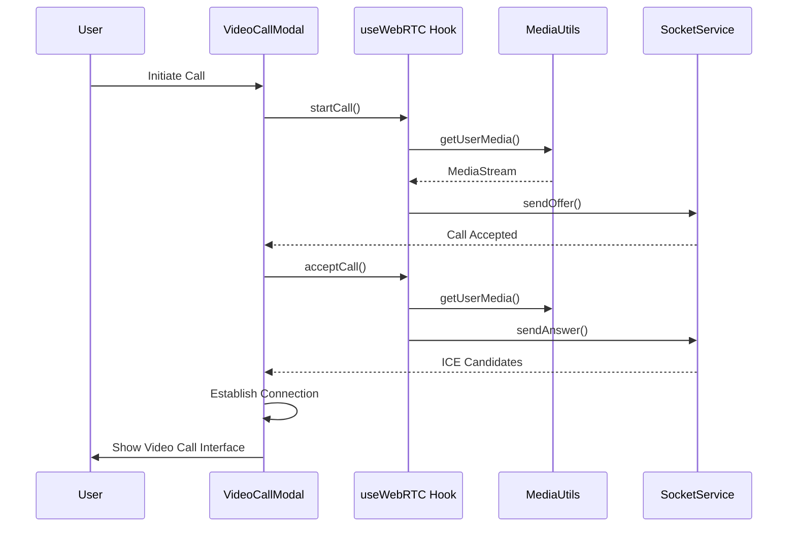
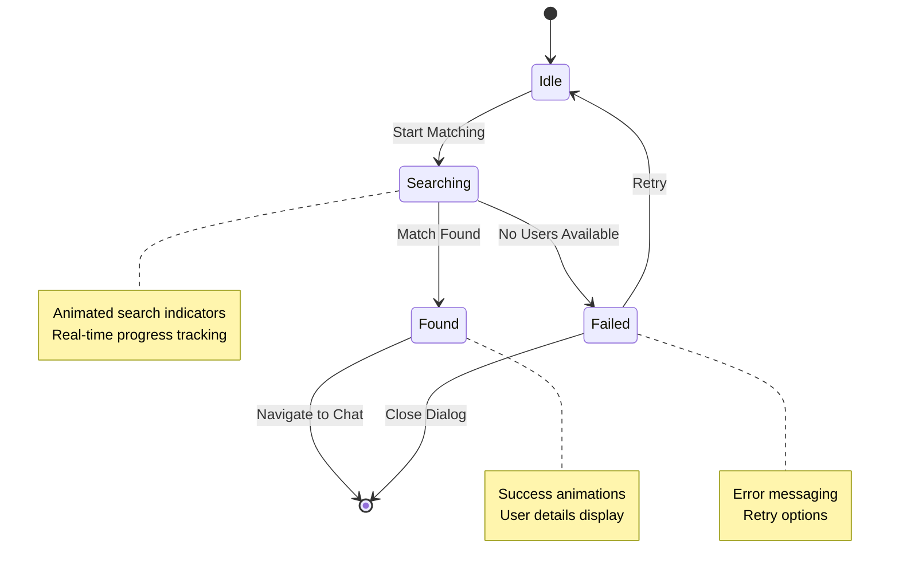
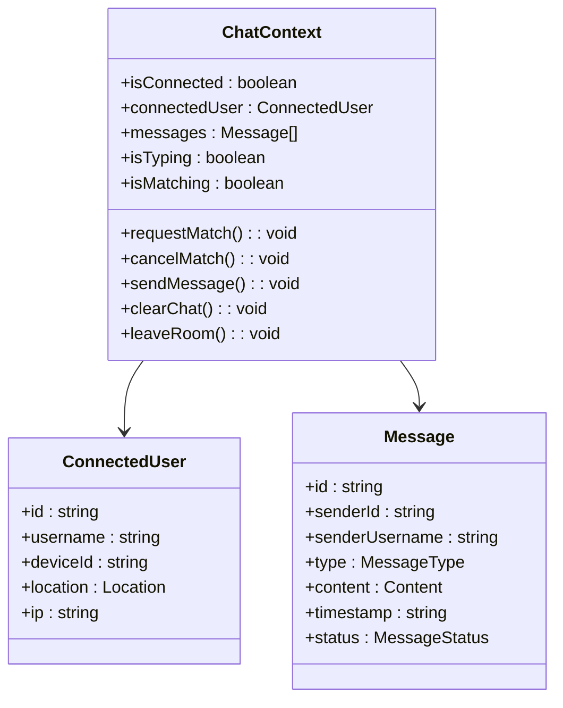
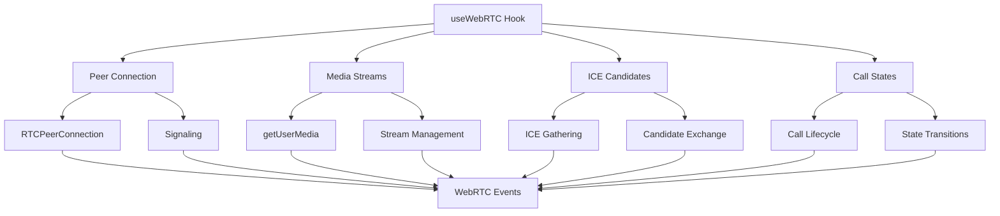
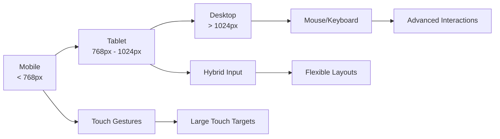
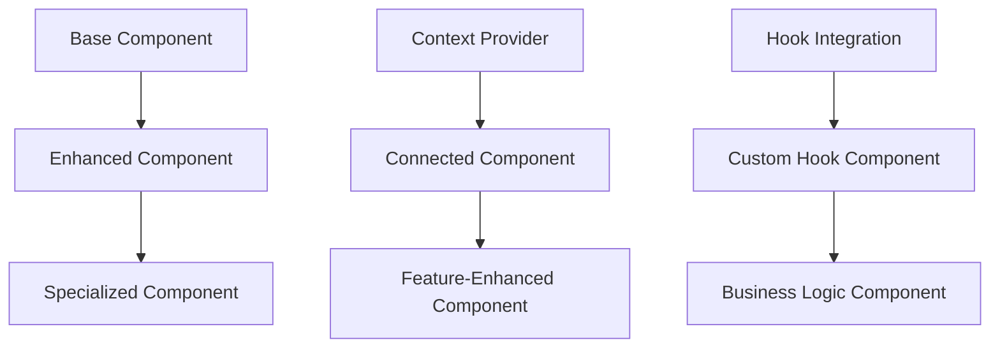
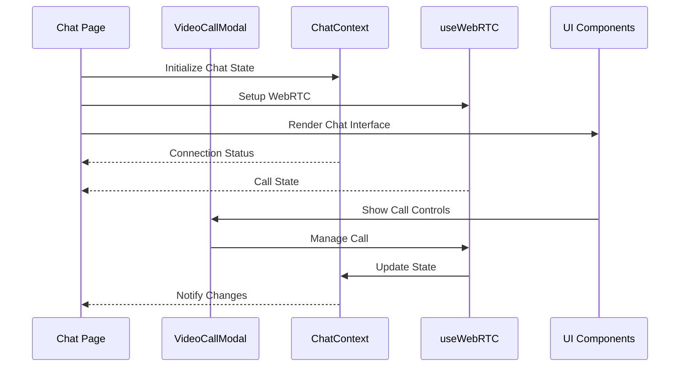

# Component Architecture

<cite>
**Referenced Files in This Document**
- [VideoCallModal.tsx](file://web/components/VideoCallModal.tsx)
- [MatchingInterface.tsx](file://web/components/MatchingInterface.tsx)
- [GuestUsernameModal.tsx](file://web/components/GuestUsernameModal.tsx)
- [dialog.tsx](file://web/components/ui/dialog.tsx)
- [ChatContext.tsx](file://web/contexts/ChatContext.tsx)
- [GuestSessionContext.tsx](file://web/contexts/GuestSessionContext.tsx)
- [useWebRTC.ts](file://web/hooks/useWebRTC.ts)
- [page.tsx](file://web/app/chat/page.tsx)
- [page.tsx](file://web/app/match/page.tsx)
- [mediaUtils.ts](file://web/lib/mediaUtils.ts)
- [MediaErrorAlert.tsx](file://web/components/MediaErrorAlert.tsx)
- [theme-provider.tsx](file://web/components/theme-provider.tsx)
- [use-mobile.tsx](file://web/components/ui/use-mobile.tsx)
</cite>

## Table of Contents
1. [Introduction](#introduction)
2. [Component Library Architecture](#component-library-architecture)
3. [Core UI Components](#core-ui-components)
4. [Specialized Components](#specialized-components)
5. [Context Providers and State Management](#context-providers-and-state-management)
6. [Hooks and Utilities](#hooks-and-utilities)
7. [Accessibility and Responsive Design](#accessibility-and-responsive-design)
8. [Integration Patterns](#integration-patterns)
9. [Component Composition Examples](#component-composition-examples)
10. [Best Practices](#best-practices)

## Introduction

The Realtime Chat App employs a sophisticated frontend component architecture built on React and TypeScript, utilizing Radix UI primitives to implement Headless UI patterns. The architecture emphasizes reusability, accessibility, and responsive design while maintaining a clean separation of concerns through context providers and custom hooks.

The component system follows modern React patterns with emphasis on composability, type safety, and developer experience. All components are designed to work seamlessly across desktop and mobile platforms, with special consideration for WebRTC functionality and real-time communication features.

## Component Library Architecture

The component library is structured around Radix UI primitives, providing a solid foundation for building accessible, composable UI components. Each component follows Headless UI principles, exposing low-level APIs that can be composed into higher-level abstractions.

**Diagram sources**
- [dialog.tsx](file://web/components/ui/dialog.tsx#L1-L98)
- [ChatContext.tsx](file://web/contexts/ChatContext.tsx#L1-L50)
- [GuestSessionContext.tsx](file://web/contexts/GuestSessionContext.tsx#L1-L50)

**Section sources**
- [dialog.tsx](file://web/components/ui/dialog.tsx#L1-L98)
- [ChatContext.tsx](file://web/contexts/ChatContext.tsx#L1-L100)

## Core UI Components

### Dialog System

The dialog system serves as the foundation for modal interactions, built on Radix UI's Dialog primitive with custom enhancements for the chat application.

**Diagram sources**
- [dialog.tsx](file://web/components/ui/dialog.tsx#L10-L98)

The Dialog component provides:
- **Accessibility**: Proper ARIA labels and keyboard navigation
- **Responsive Behavior**: Adaptive positioning and sizing
- **Animation**: Smooth transitions using Framer Motion
- **Customization**: Extensible through Tailwind CSS classes

**Section sources**
- [dialog.tsx](file://web/components/ui/dialog.tsx#L1-L98)

### Button System

The button component demonstrates the consistent design patterns across the component library, supporting various sizes, variants, and states.

**Section sources**
- [dialog.tsx](file://web/components/ui/dialog.tsx#L40-L60)

## Specialized Components

### VideoCallModal

The VideoCallModal represents the most complex component in the architecture, managing WebRTC call interfaces with comprehensive state handling and media stream management.

**Diagram sources**
- [VideoCallModal.tsx](file://web/components/VideoCallModal.tsx#L1-L50)
- [useWebRTC.ts](file://web/hooks/useWebRTC.ts#L1-L100)

#### Key Features

**Media Stream Management**: The component handles complex media stream scenarios including:
- Local video preview with mirror effect
- Remote video streaming with adaptive quality
- Audio-only fallback for compatibility
- Camera/microphone permission handling

**Call State Tracking**: Comprehensive call lifecycle management:
- Call initiation, ringing, connecting, and connected states
- Call duration tracking with persistent state
- Automatic cleanup and resource management
- Error handling for media failures

**Accessibility Implementation**: Full ARIA compliance:
- Screen reader support with meaningful labels
- Keyboard navigation for all controls
- Focus management during call transitions
- Semantic HTML structure with proper heading hierarchy

**Section sources**
- [VideoCallModal.tsx](file://web/components/VideoCallModal.tsx#L1-L456)

### MatchingInterface

The MatchingInterface orchestrates the user matching flow, providing a seamless experience for finding chat partners.

**Diagram sources**
- [MatchingInterface.tsx](file://web/components/MatchingInterface.tsx#L1-L100)

#### Component Architecture

**State Management**: The component manages multiple concurrent states:
- Matching stage tracking (idle/searching/found/failed)
- Search duration monitoring
- Real-time progress feedback
- User interaction handling

**Animation System**: Sophisticated animation orchestration using Framer Motion:
- Entrance and exit animations for different states
- Progress indicators with smooth transitions
- Success and failure animations
- Interactive feedback for user actions

**Responsive Design**: Adaptive layouts for different screen sizes:
- Mobile-first design with touch-friendly controls
- Desktop optimization with hover states
- Dynamic spacing and sizing
- Flexible grid layouts

**Section sources**
- [MatchingInterface.tsx](file://web/components/MatchingInterface.tsx#L1-L607)

### GuestUsernameModal

The GuestUsernameModal handles session initialization for anonymous users, featuring intelligent username generation and validation.

#### Key Implementation Details

**Username Generation**: Multi-tier approach for username creation:
- Backend API integration for consistent generation
- Client-side fallback with randomized names
- Validation rules for acceptable usernames
- Real-time availability checking

**Form Validation**: Comprehensive input validation:
- Character limit enforcement (3-20 characters)
- Alphanumeric and underscore restrictions
- Real-time validation feedback
- Error state management

**Accessibility Features**: Complete keyboard and screen reader support:
- Proper form labeling and ARIA attributes
- Focus management during modal transitions
- Error announcement for validation failures
- Skip links for rapid navigation

**Section sources**
- [GuestUsernameModal.tsx](file://web/components/GuestUsernameModal.tsx#L1-L201)

## Context Providers and State Management

### ChatContext

The ChatContext serves as the central state management hub for chat-related functionality, coordinating between UI components and backend services.

**Diagram sources**
- [ChatContext.tsx](file://web/contexts/ChatContext.tsx#L20-L50)

#### Advanced Features

**Socket Integration**: Seamless WebSocket communication:
- Automatic reconnection handling
- Offline/online state detection
- Message persistence across sessions
- Real-time synchronization

**Session Persistence**: Intelligent data management:
- Browser storage integration
- Session restoration capabilities
- Cross-tab synchronization
- Graceful degradation

**Error Handling**: Comprehensive error management:
- Network failure recovery
- Message queuing during disconnections
- User notification systems
- Debug logging and monitoring

**Section sources**
- [ChatContext.tsx](file://web/contexts/ChatContext.tsx#L1-L673)

### GuestSessionContext

The GuestSessionContext manages guest user lifecycle and session state, providing authentication and identity management for anonymous users.

#### Session Management Features

**Token Lifecycle**: Secure session handling:
- JWT token management
- Automatic token renewal
- Expiration detection
- Secure storage practices

**Presence System**: Real-time user presence:
- Online/offline status tracking
- Activity monitoring
- Search status coordination
- Connection health monitoring

**Fallback Mechanisms**: Robust error handling:
- Local session creation
- Graceful degradation
- Network failure recovery
- User experience preservation

**Section sources**
- [GuestSessionContext.tsx](file://web/contexts/GuestSessionContext.tsx#L1-L453)

## Hooks and Utilities

### useWebRTC Hook

The useWebRTC hook encapsulates complex WebRTC functionality, providing a clean API for video and audio calling capabilities.

**Diagram sources**
- [useWebRTC.ts](file://web/hooks/useWebRTC.ts#L1-L100)

#### Technical Implementation

**Media Compatibility**: Cross-platform media handling:
- Browser-specific optimizations
- Mobile device adaptations
- Legacy browser support
- Progressive enhancement

**Error Recovery**: Robust error handling:
- Automatic retry mechanisms
- Fallback strategies
- User-friendly error reporting
- Diagnostic information collection

**Performance Optimization**: Efficient resource management:
- Lazy loading of WebRTC resources
- Memory leak prevention
- CPU usage optimization
- Battery life considerations

**Section sources**
- [useWebRTC.ts](file://web/hooks/useWebRTC.ts#L1-L800)

### MediaUtils

The MediaUtils library provides comprehensive media access management with extensive browser compatibility and error handling.

#### Browser Compatibility Matrix

| Feature | Chrome | Firefox | Safari | Edge |
|---------|--------|---------|--------|------|
| getUserMedia | ✅ Full | ✅ Full | ✅ Full | ✅ Full |
| MediaRecorder | ✅ Full | ✅ Full | ⚠️ Limited | ✅ Full |
| WebRTC | ✅ Full | ✅ Full | ✅ Full | ✅ Full |
| Constraints | ✅ Full | ✅ Full | ✅ Full | ✅ Full |

**Section sources**
- [mediaUtils.ts](file://web/lib/mediaUtils.ts#L1-L271)

## Accessibility and Responsive Design

### Accessibility Implementation

The component architecture prioritizes accessibility through comprehensive ARIA implementation and semantic markup.

#### ARIA Compliance Features

**Screen Reader Support**: Complete screen reader compatibility:
- Meaningful alt text for all interactive elements
- Proper heading hierarchies
- Landmark regions for navigation
- Live region announcements for dynamic content

**Keyboard Navigation**: Full keyboard accessibility:
- Tab order optimization
- Arrow key navigation for lists
- Enter/Space activation for buttons
- Escape key handling for modals

**Focus Management**: Intuitive focus handling:
- Focus trapping in modals
- Programmatic focus management
- Visual focus indicators
- Focus restoration after interactions

### Responsive Design System

The responsive design system adapts to various screen sizes and device orientations.

#### Breakpoint Strategy

**Diagram sources**
- [use-mobile.tsx](file://web/components/ui/use-mobile.tsx#L1-L18)

#### Responsive Patterns

**Flexible Grid System**: Adaptive layout management:
- CSS Grid with fractional units
- Flexbox for dynamic spacing
- Container queries for responsive containers
- Aspect ratio preservation

**Touch Optimization**: Enhanced mobile experience:
- Minimum touch target sizes
- Gesture recognition
- Virtual keyboard awareness
- Orientation change handling

**Performance Considerations**: Optimized rendering:
- Lazy loading for non-critical components
- Virtual scrolling for large lists
- Image optimization and lazy loading
- Bundle splitting for code optimization

**Section sources**
- [use-mobile.tsx](file://web/components/ui/use-mobile.tsx#L1-L18)

## Integration Patterns

### Component Composition

The architecture promotes composition over inheritance, enabling flexible and reusable component structures.

#### Higher-Order Components Pattern

**Diagram sources**
- [ChatContext.tsx](file://web/contexts/ChatContext.tsx#L100-L200)
- [useWebRTC.ts](file://web/hooks/useWebRTC.ts#L50-L150)

### Event Handling Patterns

The component architecture implements consistent event handling patterns across all components.

#### Event Propagation Strategy

**Top-Down Communication**: Parent-to-child data flow:
- Props drilling for static data
- Context providers for shared state
- Callback functions for child-to-parent communication

**Bottom-Up Communication**: Child-to-parent event handling:
- Event callbacks with typed parameters
- Custom event systems for complex interactions
- Debounced and throttled event handlers

**Cross-Component Communication**: Global state coordination:
- Event bus patterns for loose coupling
- Shared context for tightly coupled components
- External service integration for third-party systems

**Section sources**
- [page.tsx](file://web/app/chat/page.tsx#L1-L100)

## Component Composition Examples

### Chat Page Integration

The chat page demonstrates complex component composition with multiple specialized components working together.

**Diagram sources**
- [page.tsx](file://web/app/chat/page.tsx#L50-L150)

### Matching Flow Orchestration

The matching interface showcases coordinated component behavior across multiple screens.

#### Component Interaction Flow

**Initialization Phase**:
1. GuestUsernameModal requests username
2. GuestSessionContext initializes session
3. MatchingInterface becomes active

**Matching Phase**:
1. MatchingInterface displays search state
2. Real-time updates from GuestSessionContext
3. User feedback through animations

**Completion Phase**:
1. Match found notification
2. Navigation to chat page
3. State cleanup and preparation

**Section sources**
- [page.tsx](file://web/app/match/page.tsx#L1-L85)

## Best Practices

### Component Design Principles

**Single Responsibility**: Each component has a clear, focused purpose:
- UI presentation components handle rendering
- Business logic components manage state
- Utility components provide reusable functionality
- Integration components coordinate between systems

**Type Safety**: Comprehensive TypeScript implementation:
- Strict prop validation
- Generic type parameters for flexibility
- Discriminated unions for state management
- Exhaustive type checking for event handlers

**Performance Optimization**: Efficient rendering and memory management:
- Memoization for expensive computations
- Lazy loading for non-critical components
- Efficient event handling with proper cleanup
- Resource pooling for frequently created objects

### Testing Strategies

**Unit Testing Approach**:
- Component isolation testing
- Hook behavior verification
- Context provider mocking
- Utility function testing

**Integration Testing**:
- Component composition testing
- State management integration
- API service integration
- User interaction flows

**Accessibility Testing**:
- Automated accessibility scanning
- Manual keyboard navigation testing
- Screen reader compatibility verification
- Color contrast and visual accessibility checks

### Maintenance Guidelines

**Code Organization**: Structured file organization:
- Component-specific directories
- Feature-based grouping
- Utility and helper function organization
- Type definition management

**Documentation Standards**: Comprehensive documentation:
- Component prop documentation
- Usage examples and patterns
- Accessibility guidelines
- Performance considerations

**Version Control**: Consistent development practices:
- Atomic commits with clear messages
- Feature branch workflows
- Code review standards
- Release management procedures

The Realtime Chat App's component architecture demonstrates modern React development practices with a strong emphasis on accessibility, performance, and maintainability. The modular design enables easy extension and modification while maintaining consistency across the application.