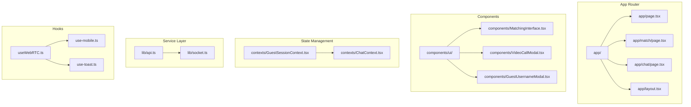
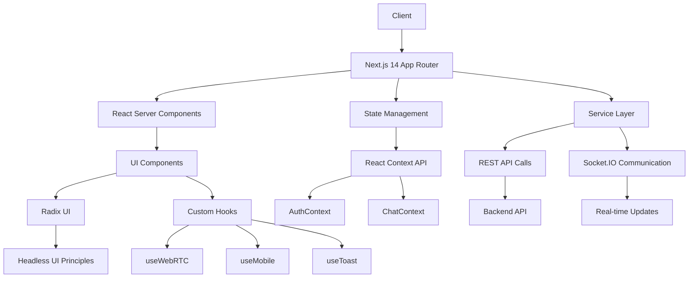
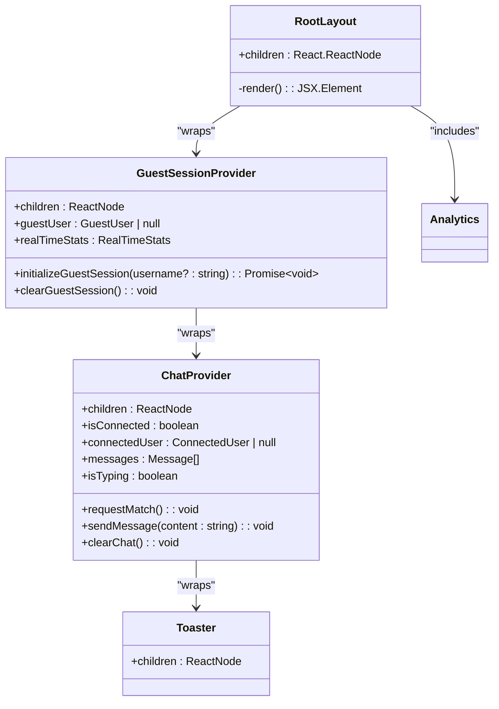
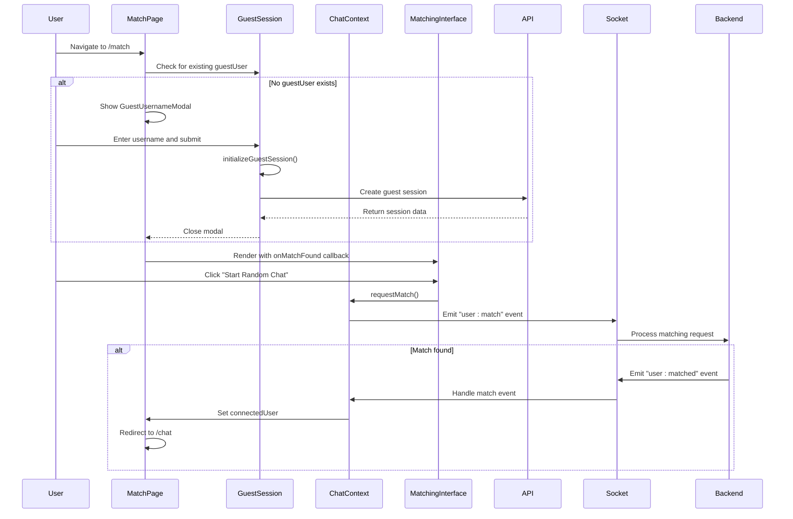
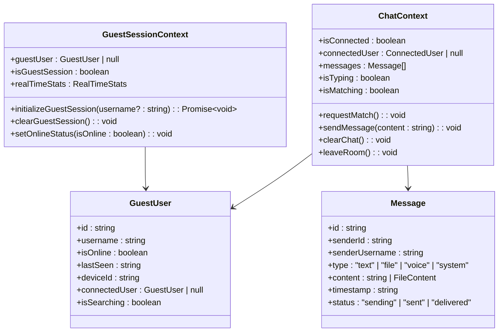
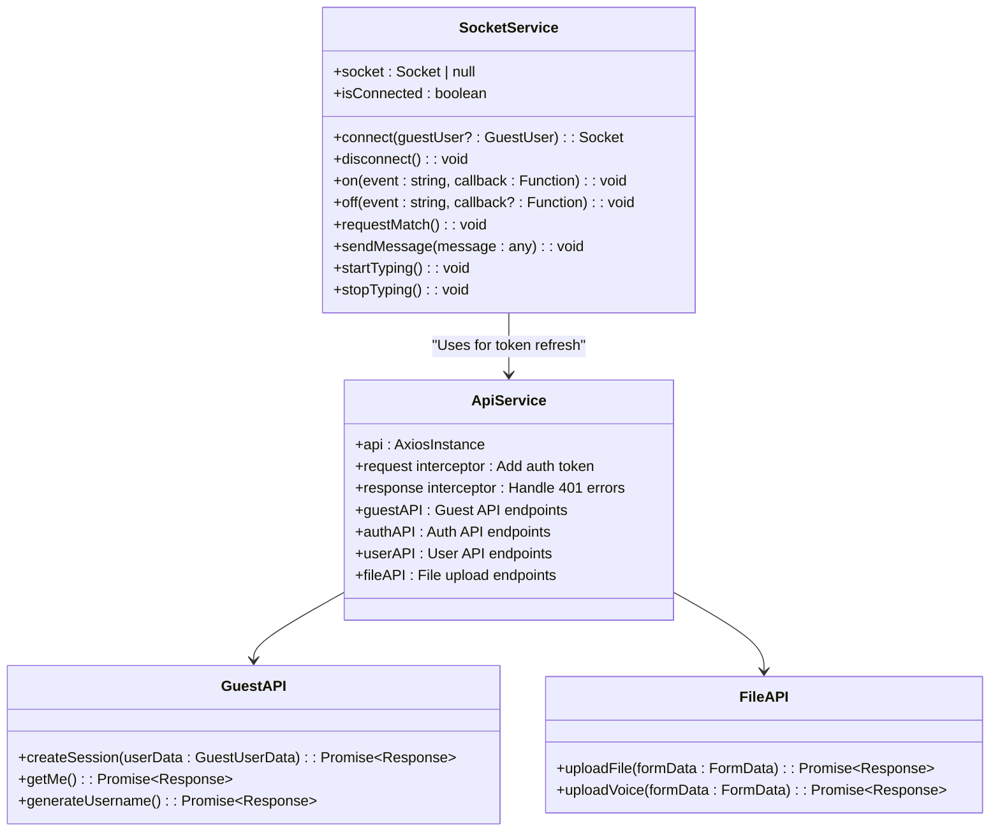
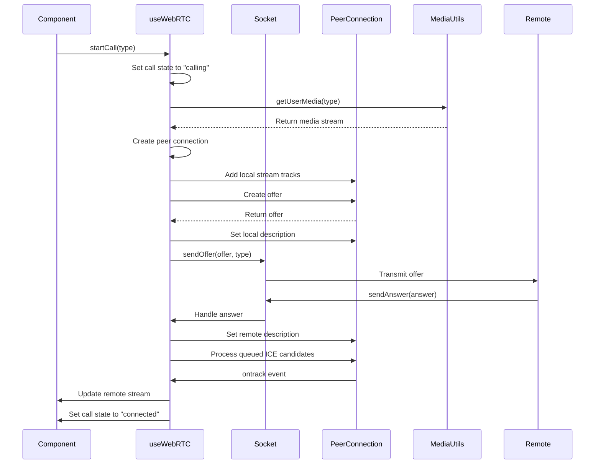
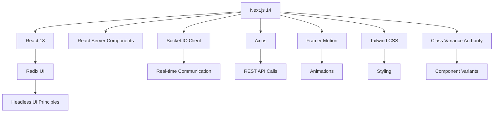

# Frontend Architecture

<cite>
**Referenced Files in This Document**   
- [layout.tsx](file://web/app/layout.tsx)
- [page.tsx](file://web/app/page.tsx)
- [match/page.tsx](file://web/app/match/page.tsx)
- [chat/page.tsx](file://web/app/chat/page.tsx)
- [GuestSessionContext.tsx](file://web/contexts/GuestSessionContext.tsx)
- [ChatContext.tsx](file://web/contexts/ChatContext.tsx)
- [api.ts](file://web/lib/api.ts)
- [socket.ts](file://web/lib/socket.ts)
- [button.tsx](file://web/components/ui/button.tsx)
- [MatchingInterface.tsx](file://web/components/MatchingInterface.tsx)
- [useWebRTC.ts](file://web/hooks/useWebRTC.ts)
- [VideoCallModal.tsx](file://web/components/VideoCallModal.tsx)
- [GuestUsernameModal.tsx](file://web/components/GuestUsernameModal.tsx)
</cite>

## Table of Contents
1. [Introduction](#introduction)
2. [Project Structure](#project-structure)
3. [Core Components](#core-components)
4. [Architecture Overview](#architecture-overview)
5. [Detailed Component Analysis](#detailed-component-analysis)
6. [Dependency Analysis](#dependency-analysis)
7. [Performance Considerations](#performance-considerations)
8. [Troubleshooting Guide](#troubleshooting-guide)
9. [Conclusion](#conclusion)

## Introduction
This document provides comprehensive architectural documentation for the Frontend Architecture of the Realtime Chat App. The application is built using Next.js 14 with the App Router implementation, leveraging React Server Components for optimized performance. The architecture follows a component-based design with reusable UI components following Headless UI principles using Radix UI. The system implements a robust state management strategy using React Context API with custom hooks, and follows a service layer pattern for API communication and real-time updates via Socket.IO.

## Project Structure
The project follows a standard Next.js 14 App Router structure with server components and React Server Components. The main application pages are organized in the app directory with three primary routes: home page (page.tsx), match/page.tsx for user matching interface, and chat/page.tsx for the communication interface. The components are organized in a modular fashion with reusable UI components in components/ui/ following Headless UI principles with Radix. The contexts directory contains the global state management contexts, while the lib directory houses the service layer implementations for API and socket communication.



**Diagram sources**
- [app/page.tsx](file://web/app/page.tsx)
- [app/match/page.tsx](file://web/app/match/page.tsx)
- [app/chat/page.tsx](file://web/app/chat/page.tsx)

**Section sources**
- [app/page.tsx](file://web/app/page.tsx)
- [app/match/page.tsx](file://web/app/match/page.tsx)
- [app/chat/page.tsx](file://web/app/chat/page.tsx)

## Core Components
The application's core components include the main layout, home page, match page, and chat page, each serving a specific purpose in the user journey. The layout component provides the global structure and context providers, while the page components handle specific user interactions and workflows. The component-based architecture with reusable UI components in components/ui/ follows Headless UI principles with Radix, ensuring consistency and accessibility across the application.

**Section sources**
- [layout.tsx](file://web/app/layout.tsx)
- [page.tsx](file://web/app/page.tsx)
- [match/page.tsx](file://web/app/match/page.tsx)
- [chat/page.tsx](file://web/app/chat/page.tsx)

## Architecture Overview
The frontend architecture follows a layered approach with clear separation of concerns between presentation, state management, and service layers. The Next.js 14 App Router implementation with server components enables efficient server-side rendering and data fetching. React Server Components allow for progressive enhancement and optimized performance by minimizing client-side JavaScript.



**Diagram sources**
- [layout.tsx](file://web/app/layout.tsx)
- [GuestSessionContext.tsx](file://web/contexts/GuestSessionContext.tsx)
- [ChatContext.tsx](file://web/contexts/ChatContext.tsx)
- [api.ts](file://web/lib/api.ts)
- [socket.ts](file://web/lib/socket.ts)

## Detailed Component Analysis

### Layout and Context Providers
The RootLayout component serves as the application shell, providing global context providers for authentication, chat state, and toast notifications. It wraps the entire application with GuestSessionProvider and ChatProvider, ensuring that all child components have access to the necessary global state. The layout also includes global styles and analytics integration.



**Diagram sources**
- [layout.tsx](file://web/app/layout.tsx)
- [GuestSessionContext.tsx](file://web/contexts/GuestSessionContext.tsx)
- [ChatContext.tsx](file://web/contexts/ChatContext.tsx)

**Section sources**
- [layout.tsx](file://web/app/layout.tsx)
- [GuestSessionContext.tsx](file://web/contexts/GuestSessionContext.tsx)
- [ChatContext.tsx](file://web/contexts/ChatContext.tsx)

### Home Page Component
The HomePage component serves as the entry point for guest users, providing an overview of the application's features and options to start chatting or find a random match. It uses framer-motion for smooth animations and transitions, enhancing the user experience. The component displays key features with icons and descriptions, encouraging users to engage with the application.

**Section sources**
- [page.tsx](file://web/app/page.tsx)

### Match Page Component
The MatchPage component handles the user matching interface, allowing users to connect with random users from around the world. It uses the MatchingInterface component to manage the matching process and displays a GuestUsernameModal when a guest session needs to be initialized. The component manages the user's search state and handles navigation to the chat interface when a match is found.



**Diagram sources**
- [match/page.tsx](file://web/app/match/page.tsx)
- [GuestSessionContext.tsx](file://web/contexts/GuestSessionContext.tsx)
- [ChatContext.tsx](file://web/contexts/ChatContext.tsx)
- [MatchingInterface.tsx](file://web/components/MatchingInterface.tsx)

**Section sources**
- [match/page.tsx](file://web/app/match/page.tsx)
- [MatchingInterface.tsx](file://web/components/MatchingInterface.tsx)
- [GuestUsernameModal.tsx](file://web/components/GuestUsernameModal.tsx)

### Chat Page Component
The ChatPage component provides the communication interface for matched users, supporting text messaging, file sharing, and WebRTC video/audio calls. It integrates multiple hooks and contexts to manage complex state and interactions. The component handles dynamic viewport height for mobile browsers, intelligent scroll management, and responsive design considerations.

```mermaid
flowchart TD
A[ChatPage Mount] --> B[Check Guest Session]
B --> C{GuestUser Exists?}
C --> |No| D[Show GuestUsernameModal]
C --> |Yes| E[Initialize WebRTC Hook]
E --> F[Setup Socket Listeners]
F --> G[Handle Message Events]
G --> H[Add Messages to State]
H --> I[Manage Scroll Position]
I --> J[Render Messages]
J --> K[User Sends Message]
K --> L[Call sendMessage()]
L --> M[Emit to Socket]
M --> N[Backend Processes]
N --> O[Other User Receives]
O --> P[Update Message Status]
P --> Q[Confirm Delivery]
Q --> R[Update UI]
```

**Diagram sources**
- [chat/page.tsx](file://web/app/chat/page.tsx)
- [useWebRTC.ts](file://web/hooks/useWebRTC.ts)
- [ChatContext.tsx](file://web/contexts/ChatContext.tsx)

**Section sources**
- [chat/page.tsx](file://web/app/chat/page.tsx)

### State Management System
The application implements a comprehensive state management strategy using React Context API for global state and custom hooks for feature-specific state. The GuestSessionContext manages guest user authentication and session state, while the ChatContext handles chat-specific state such as connected users, messages, and matching status. This separation of concerns ensures that state is organized and maintainable.



**Diagram sources**
- [GuestSessionContext.tsx](file://web/contexts/GuestSessionContext.tsx)
- [ChatContext.tsx](file://web/contexts/ChatContext.tsx)

**Section sources**
- [GuestSessionContext.tsx](file://web/contexts/GuestSessionContext.tsx)
- [ChatContext.tsx](file://web/contexts/ChatContext.tsx)

### Service Layer Implementation
The service layer follows a pattern with lib/api.ts for REST calls and lib/socket.ts for Socket.IO communication. The api.ts file uses axios with interceptors for authentication and error handling, while socket.ts provides a wrapper around Socket.IO client with connection management and event handling. This abstraction allows for consistent API usage throughout the application.



**Diagram sources**
- [api.ts](file://web/lib/api.ts)
- [socket.ts](file://web/lib/socket.ts)

**Section sources**
- [api.ts](file://web/lib/api.ts)
- [socket.ts](file://web/lib/socket.ts)

### WebRTC Implementation
The WebRTC implementation is encapsulated in the useWebRTC custom hook, which manages the complex state and interactions required for video and audio calls. The hook handles peer connection creation, ICE candidate exchange, media stream management, and call state transitions. It integrates with the socket service for signaling and provides a clean API for components to initiate and manage calls.



**Diagram sources**
- [useWebRTC.ts](file://web/hooks/useWebRTC.ts)
- [socket.ts](file://web/lib/socket.ts)

**Section sources**
- [useWebRTC.ts](file://web/hooks/useWebRTC.ts)
- [VideoCallModal.tsx](file://web/components/VideoCallModal.tsx)

## Dependency Analysis
The application has a well-defined dependency structure with clear separation between UI components, state management, and service layers. The main dependencies include Next.js 14 for the framework, React 18 for the UI library, Socket.IO for real-time communication, and Radix UI for accessible UI components. The dependency graph shows a hierarchical structure with the app directory at the top, depending on contexts, components, and service layers.



**Diagram sources**
- [package.json](file://web/package.json)

## Performance Considerations
The application implements several performance optimizations to ensure a smooth user experience. The use of React Server Components in Next.js 14 reduces the amount of JavaScript sent to the client, improving initial load times. The intelligent scroll management in the chat interface prevents excessive re-renders and maintains scroll position appropriately. The WebRTC implementation uses efficient peer connection management and ICE candidate queuing to minimize latency. The service layer implements request interceptors for authentication and response interceptors for error handling, reducing redundant code and improving maintainability.

## Troubleshooting Guide
Common issues in the application typically relate to authentication, real-time communication, and media permissions. Authentication issues may occur when guest session tokens expire, which is handled by the session regeneration callback in the API layer. Real-time communication issues may stem from socket connection problems, which are managed by the SocketService with automatic reconnection attempts. Media permission issues are handled by the useWebRTC hook, which provides appropriate error states and user feedback.

**Section sources**
- [api.ts](file://web/lib/api.ts)
- [socket.ts](file://web/lib/socket.ts)
- [useWebRTC.ts](file://web/hooks/useWebRTC.ts)

## Conclusion
The Frontend Architecture of the Realtime Chat App demonstrates a well-structured implementation of Next.js 14 with React Server Components, following modern best practices for state management, service layer abstraction, and real-time communication. The component-based architecture with reusable UI components following Headless UI principles ensures consistency and accessibility. The state management strategy using React Context API provides a clean separation of concerns between authentication, chat state, and feature-specific state. The service layer pattern with dedicated modules for REST calls and Socket.IO communication enables maintainable and testable code. Overall, the architecture supports the application's requirements for real-time chat, user matching, and WebRTC video/audio calls while maintaining performance and scalability.