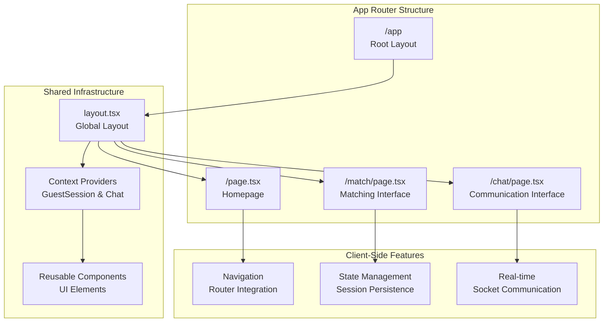
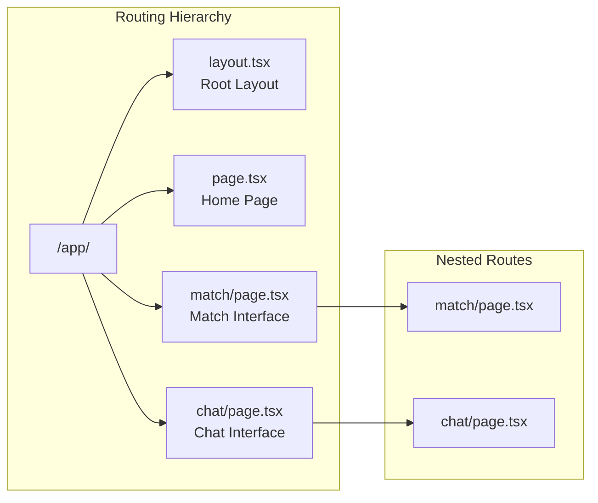
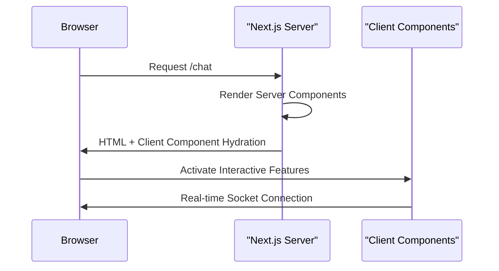
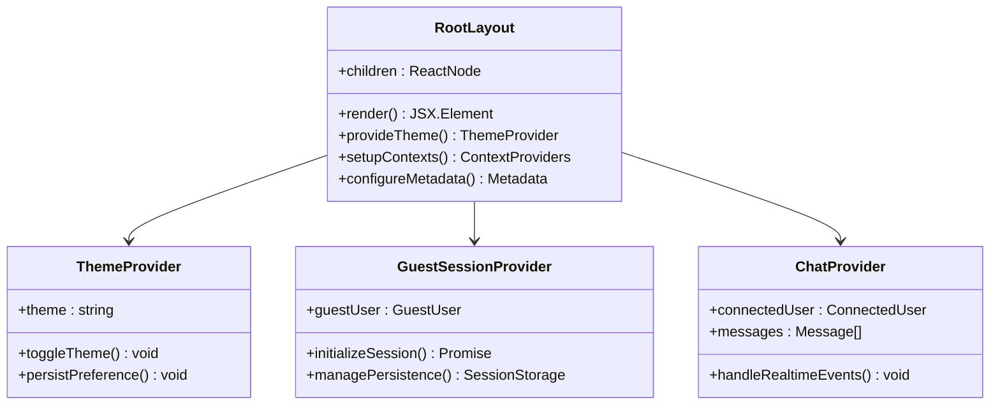
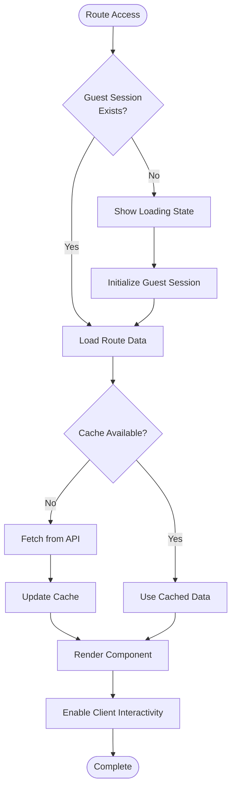
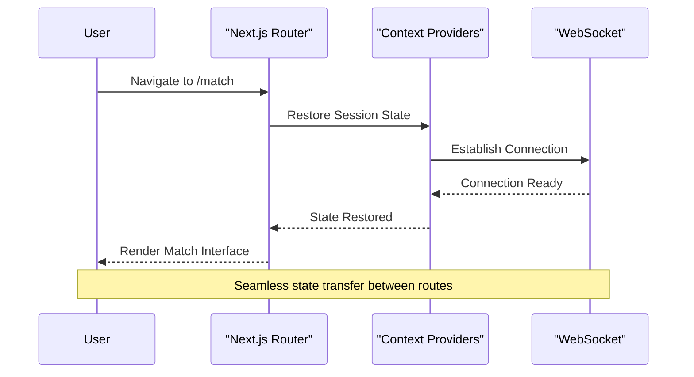
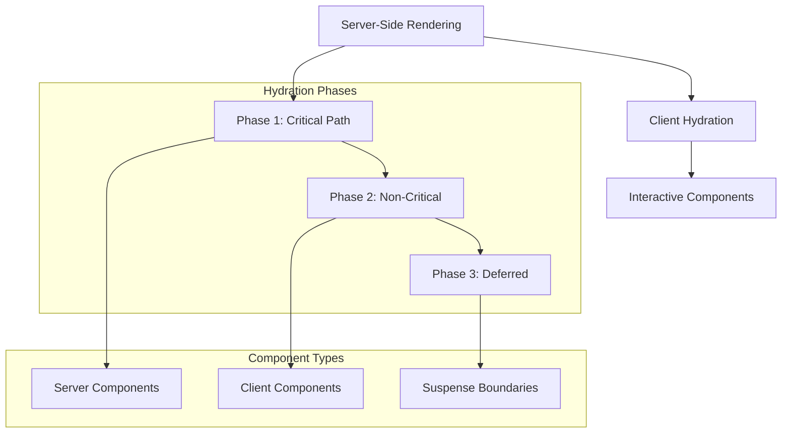

# Pages and Routing

<cite>
**Referenced Files in This Document**
- [page.tsx](file://web/app/page.tsx)
- [layout.tsx](file://web/app/layout.tsx)
- [match/page.tsx](file://web/app/match/page.tsx)
- [chat/page.tsx](file://web/app/chat/page.tsx)
- [MatchingInterface.tsx](file://web/components/MatchingInterface.tsx)
- [VideoCallModal.tsx](file://web/components/VideoCallModal.tsx)
- [GuestSessionContext.tsx](file://web/contexts/GuestSessionContext.tsx)
- [ChatContext.tsx](file://web/contexts/ChatContext.tsx)
- [globals.css](file://web/app/globals.css)
- [package.json](file://web/package.json)
- [next.config.mjs](file://web/next.config.mjs)
</cite>

## Table of Contents
1. [Introduction](#introduction)
2. [App Router Architecture](#app-router-architecture)
3. [File-Based Routing Structure](#file-based-routing-structure)
4. [React Server Components Implementation](#react-server-components-implementation)
5. [Layout and Metadata Management](#layout-and-metadata-management)
6. [Data Loading Patterns](#data-loading-patterns)
7. [Navigation and State Management](#navigation-and-state-management)
8. [SEO and Performance Considerations](#seo-and-performance-considerations)
9. [Dynamic Routing and Future Extensions](#dynamic-routing-and-future-extensions)
10. [Component Boundaries and Hydration](#component-boundaries-and-hydration)

## Introduction

The Realtime Chat App frontend utilizes Next.js 15's App Router with React Server Components (RSC) to deliver a modern, performant real-time communication platform. The application implements a sophisticated routing architecture that seamlessly handles guest user sessions, real-time matching, and persistent chat experiences across multiple pages.

The routing system is built around three primary entry points: the homepage for initial engagement, the matching interface for finding random connections, and the chat interface for real-time communication. Each page leverages server-side rendering where appropriate, client-side interactivity through React Server Components, and advanced state management patterns for seamless user experiences.

## App Router Architecture

The Next.js App Router implementation follows the modern file-based routing paradigm introduced in Next.js 13+, utilizing the `/app` directory structure for all page components. The architecture emphasizes server-side rendering capabilities while maintaining client-side interactivity through React Server Components.



**Diagram sources**
- [layout.tsx](file://web/app/layout.tsx#L1-L47)
- [page.tsx](file://web/app/page.tsx#L1-L129)
- [match/page.tsx](file://web/app/match/page.tsx#L1-L85)
- [chat/page.tsx](file://web/app/chat/page.tsx#L1-L100)

**Section sources**
- [layout.tsx](file://web/app/layout.tsx#L1-L47)
- [package.json](file://web/package.json#L1-L92)

## File-Based Routing Structure

The application employs a hierarchical file-based routing system that automatically generates URL paths based on the directory structure within the `/app` directory. Each route represents a distinct user journey within the application, with clear separation of concerns and optimized loading patterns.

### Primary Route Structure

| Route Path | Component | Purpose | RSC Status |
|------------|-----------|---------|------------|
| `/` | `page.tsx` | Homepage with feature showcase | Server Rendered |
| `/match` | `match/page.tsx` | Random user matching interface | Client Component |
| `/chat` | `chat/page.tsx` | Real-time messaging interface | Client Component |

### Directory Organization

The routing structure demonstrates Next.js 15's enhanced file-based routing capabilities:



**Diagram sources**
- [page.tsx](file://web/app/page.tsx#L1-L129)
- [match/page.tsx](file://web/app/match/page.tsx#L1-L85)
- [chat/page.tsx](file://web/app/chat/page.tsx#L1-L100)

### Route Entry Points

Each route serves a specific purpose in the user journey:

- **Homepage (`/`)**: Features a marketing-focused landing page with call-to-action buttons for initiating chat or finding matches
- **Matching Interface (`/match`)**: Provides a dedicated interface for random user matching with real-time status updates
- **Chat Interface (`/chat`)**: Offers the primary real-time communication experience with video/audio capabilities

**Section sources**
- [page.tsx](file://web/app/page.tsx#L1-L129)
- [match/page.tsx](file://web/app/match/page.tsx#L1-L85)
- [chat/page.tsx](file://web/app/chat/page.tsx#L1-L100)

## React Server Components Implementation

The application extensively leverages React Server Components to optimize performance and reduce client-side JavaScript bundle sizes. Server components are strategically placed to handle rendering logic while maintaining interactivity through client-side hydration.

### Server Component Patterns



**Diagram sources**
- [chat/page.tsx](file://web/app/chat/page.tsx#L1-L50)
- [layout.tsx](file://web/app/layout.tsx#L1-L47)

### Component-Level Implementation

The application implements several key patterns for React Server Components:

#### Homepage Server Rendering
The homepage leverages server-side rendering for optimal SEO and initial load performance, featuring interactive client components for user actions while maintaining server-rendered content for core functionality.

#### Matching Interface Client Components
The matching interface operates entirely as client components, enabling real-time updates and interactive matching experiences without server round-trips for every user action.

#### Chat Interface Hybrid Approach
The chat interface combines server rendering for initial content with client-side interactivity for real-time messaging, video calls, and user interactions.

**Section sources**
- [page.tsx](file://web/app/page.tsx#L1-L129)
- [match/page.tsx](file://web/app/match/page.tsx#L1-L85)
- [chat/page.tsx](file://web/app/chat/page.tsx#L1-L100)

## Layout and Metadata Management

The global layout system provides consistent theming, navigation, and metadata across all application routes. The layout component serves as the foundation for shared UI elements, context providers, and metadata configuration.

### Layout Architecture



**Diagram sources**
- [layout.tsx](file://web/app/layout.tsx#L1-L47)
- [GuestSessionContext.tsx](file://web/contexts/GuestSessionContext.tsx#L1-L100)
- [ChatContext.tsx](file://web/contexts/ChatContext.tsx#L1-L100)

### Metadata Configuration

The layout component defines comprehensive metadata for SEO optimization and social media sharing:

- **Title**: "RealTime Chat - Connect Instantly" with dynamic page-specific titles
- **Description**: Rich descriptions for search engines and social platforms
- **Viewport**: Optimized for mobile-first responsive design
- **Fonts**: Geist Sans and Geist Mono for typography consistency
- **Analytics**: Vercel Analytics integration for performance monitoring

### Shared UI Elements

The layout provides consistent UI elements across all routes:

- **Theme Management**: Automatic dark/light mode switching with preference persistence
- **Global Notifications**: Toast notifications for system messages and errors
- **Analytics Tracking**: Performance monitoring and user behavior analytics
- **Font Loading**: Efficient font loading with fallback mechanisms

**Section sources**
- [layout.tsx](file://web/app/layout.tsx#L1-L47)
- [globals.css](file://web/app/globals.css#L1-L50)

## Data Loading Patterns

The application implements sophisticated data loading patterns that balance server-side rendering benefits with client-side interactivity. These patterns ensure optimal performance while maintaining real-time responsiveness.

### Async Component Patterns



**Diagram sources**
- [GuestSessionContext.tsx](file://web/contexts/GuestSessionContext.tsx#L100-L200)
- [ChatContext.tsx](file://web/contexts/ChatContext.tsx#L100-L200)

### Client-Server Component Boundaries

The application carefully manages the boundary between server and client components to optimize performance:

#### Server Component Responsibilities
- Initial page rendering and SEO metadata
- Static content generation and caching
- Authentication state verification
- Initial data fetching for non-real-time content

#### Client Component Responsibilities
- Real-time socket connections and event handling
- Interactive UI state management
- User input processing and form handling
- Third-party integrations and analytics

### State Persistence Strategies

The application implements multiple state persistence strategies:

- **Session Storage**: Persistent guest user sessions across page reloads
- **Memory State**: Real-time chat state synchronized via WebSocket
- **Local Storage**: Device-specific preferences and identifiers
- **URL Parameters**: Route-specific configuration and deep linking

**Section sources**
- [GuestSessionContext.tsx](file://web/contexts/GuestSessionContext.tsx#L1-L453)
- [ChatContext.tsx](file://web/contexts/ChatContext.tsx#L1-L673)

## Navigation and State Management

The navigation system integrates seamlessly with Next.js 15's router capabilities, providing smooth transitions between routes while maintaining state continuity and user context.

### Navigation Flow Architecture



**Diagram sources**
- [match/page.tsx](file://web/app/match/page.tsx#L1-L50)
- [chat/page.tsx](file://web/app/chat/page.tsx#L1-L100)

### State Continuity Patterns

The application maintains state continuity across navigation events:

#### Guest Session Persistence
- Automatic session restoration from sessionStorage
- Token expiration handling with automatic renewal
- Cross-route session validation and synchronization

#### Chat State Management
- Connected user preservation during navigation
- Message history caching and restoration
- Real-time event synchronization across route changes

#### Navigation Guards
- Route protection based on authentication state
- Automatic redirection for unauthorized access
- Graceful handling of session expiration

### Route-Specific Navigation Patterns

Each route implements specialized navigation patterns:

- **Homepage**: Direct navigation with feature highlighting
- **Matching**: Progressive enhancement with real-time status updates
- **Chat**: Complex state management with real-time synchronization

**Section sources**
- [match/page.tsx](file://web/app/match/page.tsx#L1-L85)
- [chat/page.tsx](file://web/app/chat/page.tsx#L1-L100)

## SEO and Performance Considerations

The application implements comprehensive SEO and performance optimization strategies tailored to real-time communication requirements.

### SEO Optimization Strategies

```mermaid
graph TB
subgraph "SEO Implementation"
Meta["Metadata Management"]
Structured["Structured Data"]
Social["Social Sharing"]
Robots["Robots.txt"]
end
subgraph "Performance Optimization"
Lazy["Lazy Loading"]
Prefetch["Link Prefetching"]
CDN["CDN Integration"]
Caching["Intelligent Caching"]
end
subgraph "Accessibility"
ARIA["ARIA Labels"]
Semantics["Semantic HTML"]
Keyboard["Keyboard Navigation"]
Screen["Screen Reader"]
end
Meta --> Structured
Structured --> Social
Social --> Robots
Lazy --> Prefetch
Prefetch --> CDN
CDN --> Caching
ARIA --> Semantics
Semantics --> Keyboard
Keyboard --> Screen
```



**Diagram sources**
- [layout.tsx](file://web/app/layout.tsx#L10-L20)
- [globals.css](file://web/app/globals.css#L1-L100)

### Performance Optimization Techniques

The application employs multiple performance optimization strategies:

#### Bundle Size Optimization
- Selective client component loading
- Dynamic imports for non-critical features
- Tree shaking and dead code elimination
- Code splitting for route-specific bundles

#### Runtime Performance
- Efficient state management with minimal re-renders
- Virtualized lists for large message histories
- Debounced input handling for typing indicators
- Optimized WebSocket connection management

#### Mobile Performance
- Hardware acceleration for animations
- Efficient touch event handling
- Battery-conscious real-time updates
- Optimized image and media handling

### Accessibility Implementation

The application prioritizes accessibility across all routes:

- **Semantic HTML Structure**: Proper heading hierarchy and landmark elements
- **ARIA Labels**: Descriptive labels for interactive elements
- **Keyboard Navigation**: Full keyboard accessibility for all features
- **Screen Reader Support**: Comprehensive ARIA support for assistive technologies

**Section sources**
- [layout.tsx](file://web/app/layout.tsx#L10-L20)
- [globals.css](file://web/app/globals.css#L1-L758)

## Dynamic Routing and Future Extensions

The application's routing architecture is designed to accommodate future enhancements and dynamic content requirements.

### Current Dynamic Capabilities

The existing routing system supports several dynamic features:

#### Parameter-Based Routing
- Guest user identification through session tokens
- Real-time parameter synchronization
- Dynamic route guards and redirects

#### Context-Aware Navigation
- Route-specific context providers
- Conditional navigation based on user state
- Progressive enhancement patterns

### Future Extension Opportunities

The architecture supports various future enhancements:

#### User Profile Routes
```typescript
// Example future route structure
interface UserProfileRoutes {
  "/profile/[username]": UserProfilePage
  "/settings": UserSettingsPage
  "/notifications": NotificationSettingsPage
}
```

#### Content-Based Routing
- Dynamic content loading based on user preferences
- Personalized route recommendations
- Context-aware content filtering

#### Multi-Language Support
- Internationalization-ready routing
- Locale-specific URL patterns
- Dynamic language switching

### Scalability Considerations

The routing architecture incorporates scalability patterns:

- **Modular Component Design**: Easy addition of new route components
- **Context Provider Abstraction**: Flexible state management for new features
- **Plugin Architecture**: Extensible middleware and hook systems
- **Performance Monitoring**: Built-in metrics collection for route performance

**Section sources**
- [GuestSessionContext.tsx](file://web/contexts/GuestSessionContext.tsx#L1-L453)
- [ChatContext.tsx](file://web/contexts/ChatContext.tsx#L1-L673)

## Component Boundaries and Hydration

The application implements sophisticated component boundary management to optimize hydration performance while maintaining interactivity.

### Hydration Strategy



**Diagram sources**
- [layout.tsx](file://web/app/layout.tsx#L25-L47)
- [chat/page.tsx](file://web/app/chat/page.tsx#L1-L50)

### Boundary Optimization

The application optimizes component boundaries for performance:

#### Server Component Boundaries
- Minimal server component surface area
- Efficient data passing between server and client
- Strategic placement of interactive elements

#### Client Component Boundaries
- Selective client component loading
- Dynamic import optimization
- Memory-efficient component lifecycle

#### Suspense Integration
- Graceful loading states for async operations
- Error boundary implementation
- Progressive loading patterns

### Memory Management

The application implements comprehensive memory management:

- **Component Cleanup**: Proper cleanup of event listeners and subscriptions
- **State Optimization**: Efficient state updates and garbage collection
- **Resource Management**: WebSocket connection lifecycle management
- **Bundle Optimization**: Dynamic imports and code splitting

**Section sources**
- [layout.tsx](file://web/app/layout.tsx#L25-L47)
- [GuestSessionContext.tsx](file://web/contexts/GuestSessionContext.tsx#L100-L200)
- [ChatContext.tsx](file://web/contexts/ChatContext.tsx#L100-L200)