# Service Layer

<cite>
**Referenced Files in This Document**
- [api.ts](file://web/lib/api.ts)
- [socket.ts](file://web/lib/socket.ts)
- [mediaUtils.ts](file://web/lib/mediaUtils.ts)
- [utils.ts](file://web/lib/utils.ts)
- [useWebRTC.ts](file://web/hooks/useWebRTC.ts)
- [GuestSessionContext.tsx](file://web/contexts/GuestSessionContext.tsx)
- [ChatContext.tsx](file://web/contexts/ChatContext.tsx)
- [ConnectionStatusDebug.tsx](file://web/components/ConnectionStatusDebug.tsx)
- [MediaErrorAlert.tsx](file://web/components/MediaErrorAlert.tsx)
- [VideoCallModal.tsx](file://web/components/VideoCallModal.tsx)
</cite>

## Table of Contents
1. [Introduction](#introduction)
2. [Service Architecture Overview](#service-architecture-overview)
3. [REST API Service Layer](#rest-api-service-layer)
4. [Socket.IO Real-Time Communication](#socketio-real-time-communication)
5. [Media Utilities](#media-utilities)
6. [Utility Functions](#utility-functions)
7. [Integration Patterns](#integration-patterns)
8. [Security Considerations](#security-considerations)
9. [Error Handling and Resilience](#error-handling-and-resilience)
10. [Performance Monitoring](#performance-monitoring)
11. [Debugging and Troubleshooting](#debugging-and-troubleshooting)
12. [Best Practices](#best-practices)

## Introduction

The Realtime Chat App's frontend service layer provides a comprehensive foundation for handling RESTful interactions with the backend and real-time communication through Socket.IO. This architecture enables seamless user management, file uploads, WebRTC media streaming, and real-time messaging capabilities while maintaining robust error handling, security, and performance characteristics.

The service layer consists of four primary components:
- **REST API Service**: Handles HTTP requests for user management and file operations
- **Socket.IO Service**: Manages real-time bidirectional communication
- **Media Utilities**: Provides cross-browser compatible WebRTC media access
- **Utility Functions**: Shared helpers for common operations

## Service Architecture Overview

The service layer follows a modular architecture with clear separation of concerns:

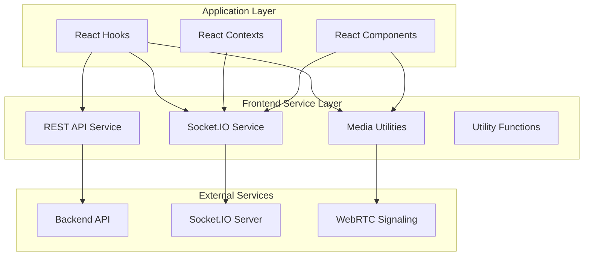

**Diagram sources**
- [api.ts](file://web/lib/api.ts#L1-L130)
- [socket.ts](file://web/lib/socket.ts#L1-L474)
- [mediaUtils.ts](file://web/lib/mediaUtils.ts#L1-L271)

**Section sources**
- [api.ts](file://web/lib/api.ts#L1-L130)
- [socket.ts](file://web/lib/socket.ts#L1-L474)
- [mediaUtils.ts](file://web/lib/mediaUtils.ts#L1-L271)
- [utils.ts](file://web/lib/utils.ts#L1-L7)

## REST API Service Layer

The REST API service provides a centralized interface for all HTTP communications with the backend, featuring automatic token management, error handling, and session regeneration capabilities.

### API Architecture

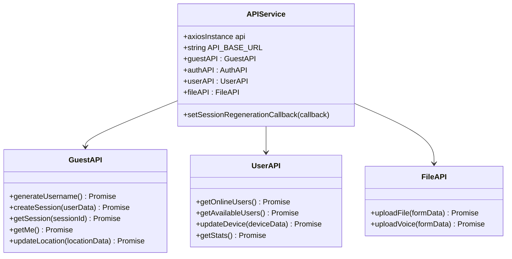

**Diagram sources**
- [api.ts](file://web/lib/api.ts#L60-L130)

### Token Management and Authentication

The API service implements sophisticated token management with support for both guest and authenticated sessions:

| Token Type | Storage Location | Priority | Regeneration |
|------------|------------------|----------|--------------|
| Guest Token | `sessionStorage` | High | Automatic on expiration |
| Auth Token | `Cookies` or `localStorage` | Medium | Manual logout required |
| Fallback | None | Low | Not supported |

### Request Interceptor

The request interceptor automatically injects authentication tokens and handles session management:

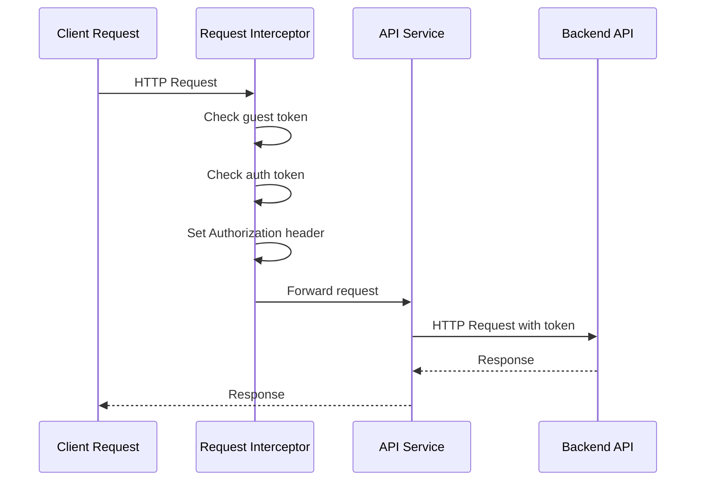

**Diagram sources**
- [api.ts](file://web/lib/api.ts#L10-L25)

### Response Interceptor and Error Handling

The response interceptor provides comprehensive error handling with automatic session regeneration:

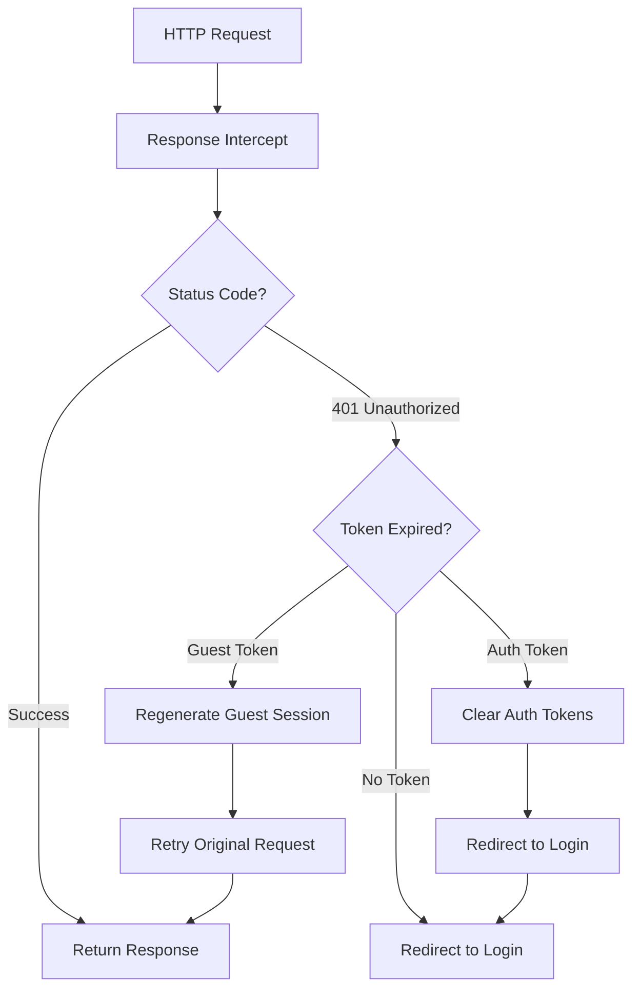

**Diagram sources**
- [api.ts](file://web/lib/api.ts#L27-L59)

**Section sources**
- [api.ts](file://web/lib/api.ts#L1-L130)

## Socket.IO Real-Time Communication

The Socket.IO service manages persistent real-time connections with comprehensive lifecycle management, reconnection logic, and event subscription patterns.

### Socket Service Architecture

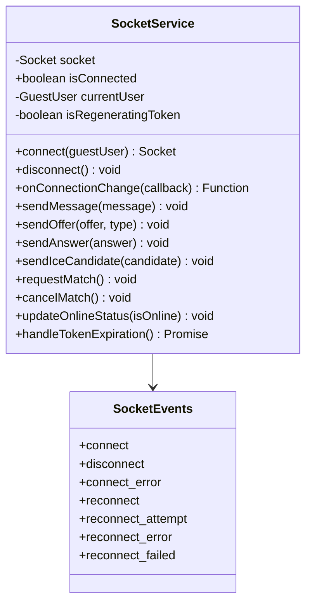

**Diagram sources**
- [socket.ts](file://web/lib/socket.ts#L15-L474)

### Connection Lifecycle Management

The socket service implements a robust connection lifecycle with automatic reconnection and token expiration handling:

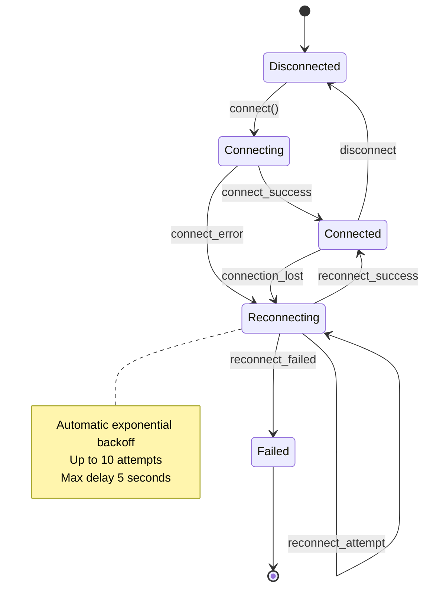

**Diagram sources**
- [socket.ts](file://web/lib/socket.ts#L25-L170)

### Event Subscription Patterns

The socket service provides flexible event subscription with automatic cleanup:

| Event Category | Purpose | Example Events |
|----------------|---------|----------------|
| Connection | Lifecycle management | `connect`, `disconnect`, `reconnect` |
| Chat | Messaging | `chat:message`, `chat:typing:start` |
| WebRTC | Media signaling | `webrtc:offer`, `webrtc:answer` |
| Presence | User status | `presence:online`, `presence:searching` |
| Matching | User discovery | `user:match`, `user:matched` |

### Token Expiration and Session Regeneration

The socket service implements automatic token expiration detection and session regeneration:

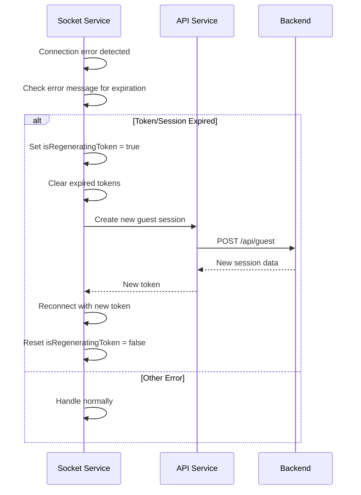

**Diagram sources**
- [socket.ts](file://web/lib/socket.ts#L350-L450)

**Section sources**
- [socket.ts](file://web/lib/socket.ts#L1-L474)

## Media Utilities

The MediaUtils class provides cross-browser compatible WebRTC media access with comprehensive error handling and device-specific optimizations.

### Media Architecture

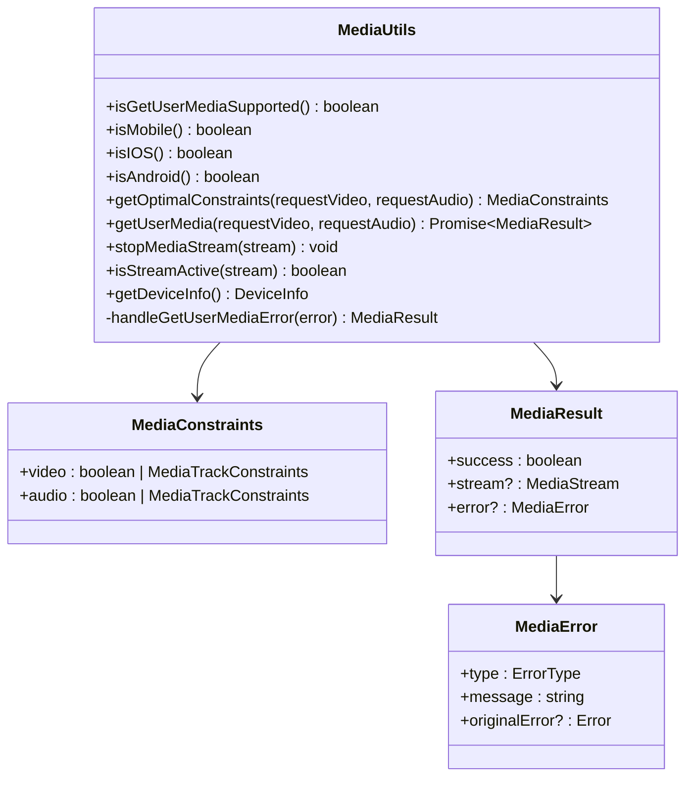

**Diagram sources**
- [mediaUtils.ts](file://web/lib/mediaUtils.ts#L3-L271)

### Device-Specific Optimizations

The MediaUtils implements intelligent constraint selection based on device characteristics:

| Device Type | Video Resolution | Frame Rate | Audio Settings |
|-------------|------------------|------------|----------------|
| Desktop | 1280x720@30fps | 30fps | 48kHz with noise cancellation |
| iOS Mobile | 640x480@30fps | 30fps | 48kHz with noise cancellation |
| Android Mobile | 1280x720@30fps | 30fps | 48kHz with noise cancellation |

### Error Handling and Recovery

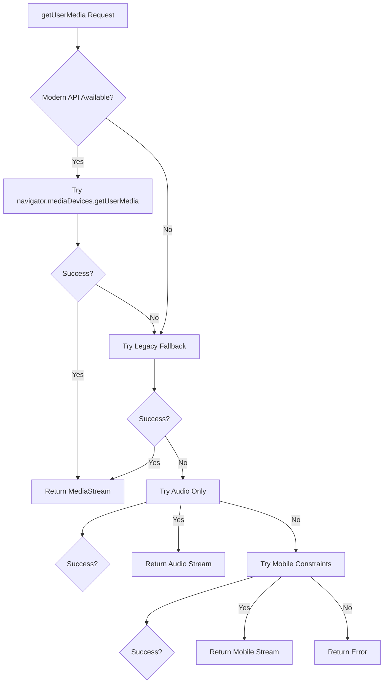

**Diagram sources**
- [mediaUtils.ts](file://web/lib/mediaUtils.ts#L133-L184)

**Section sources**
- [mediaUtils.ts](file://web/lib/mediaUtils.ts#L1-L271)

## Utility Functions

The utility functions provide shared helper operations for common frontend tasks.

### Utility Architecture

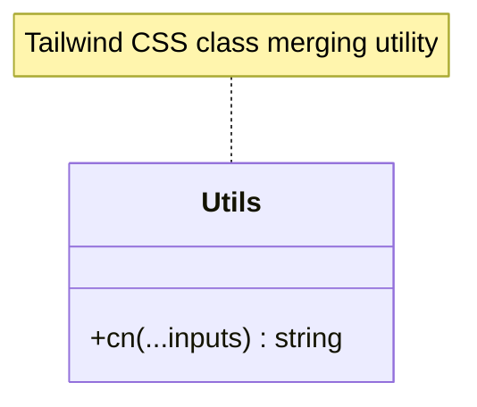

**Diagram sources**
- [utils.ts](file://web/lib/utils.ts#L1-L7)

**Section sources**
- [utils.ts](file://web/lib/utils.ts#L1-L7)

## Integration Patterns

The service layer integrates seamlessly with React applications through hooks, contexts, and component patterns.

### Hook Integration Pattern

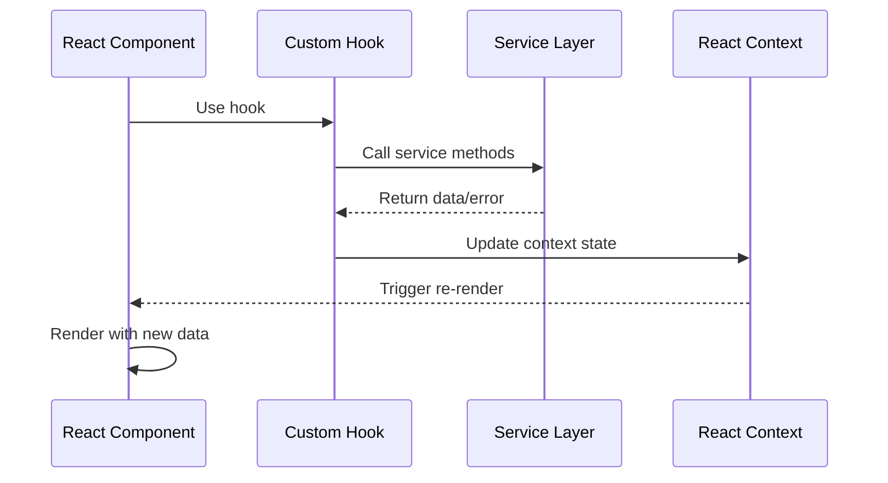

**Diagram sources**
- [useWebRTC.ts](file://web/hooks/useWebRTC.ts#L1-L100)
- [GuestSessionContext.tsx](file://web/contexts/GuestSessionContext.tsx#L1-L100)

### Context Provider Pattern

The service layer integrates with React contexts for global state management:

| Context | Service Integration | Purpose |
|---------|-------------------|---------|
| `GuestSessionContext` | Socket service, API service | Guest session management |
| `ChatContext` | Socket service, MediaUtils | Chat state and WebRTC |

**Section sources**
- [GuestSessionContext.tsx](file://web/contexts/GuestSessionContext.tsx#L1-L453)
- [ChatContext.tsx](file://web/contexts/ChatContext.tsx#L1-L673)

## Security Considerations

The service layer implements multiple security layers to protect against various attack vectors.

### Token Injection and Validation

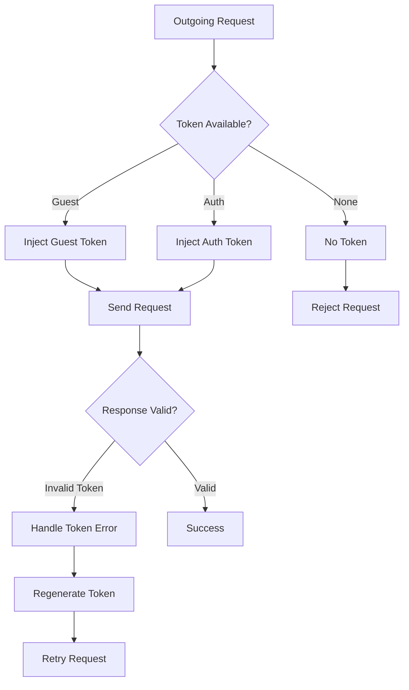

**Diagram sources**
- [api.ts](file://web/lib/api.ts#L10-L25)
- [socket.ts](file://web/lib/socket.ts#L25-L50)

### Rate Limiting Awareness

While the frontend doesn't directly implement rate limiting, it respects backend rate limiting through graceful error handling:

| Error Type | Response | Action |
|------------|----------|--------|
| 429 Too Many Requests | Automatic retry with exponential backoff | Built into socket reconnection |
| 401 Unauthorized | Token regeneration | Automatic session renewal |
| 403 Forbidden | User notification | Redirect to appropriate page |

### Payload Validation

The service layer validates payloads before transmission:

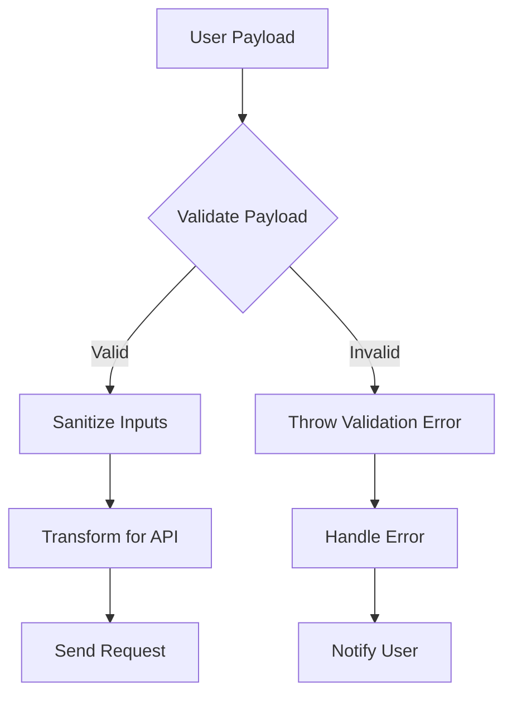

**Section sources**
- [api.ts](file://web/lib/api.ts#L27-L59)
- [socket.ts](file://web/lib/socket.ts#L25-L50)

## Error Handling and Resilience

The service layer implements comprehensive error handling with multiple fallback strategies.

### Error Classification

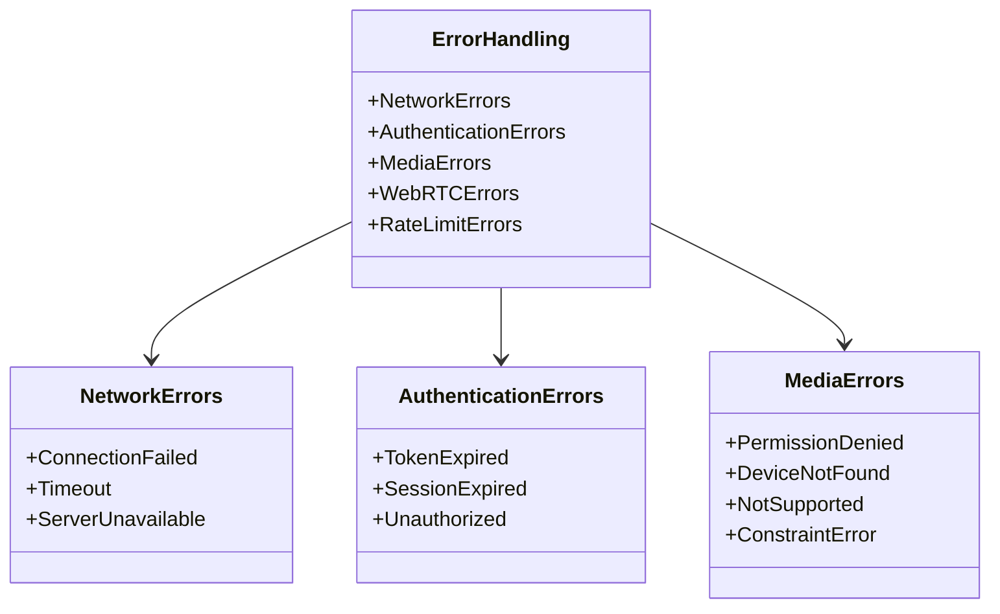

**Diagram sources**
- [mediaUtils.ts](file://web/lib/mediaUtils.ts#L186-L246)

### Resilience Strategies

| Error Type | Strategy | Implementation |
|------------|----------|----------------|
| Network Connectivity | Automatic reconnection | Socket.IO built-in reconnection |
| Token Expiration | Session regeneration | Automatic guest session renewal |
| Media Access | Progressive fallbacks | Multiple retry strategies |
| Server Unavailability | Circuit breaker pattern | Exponential backoff reconnection |

**Section sources**
- [socket.ts](file://web/lib/socket.ts#L133-L170)
- [mediaUtils.ts](file://web/lib/mediaUtils.ts#L133-L184)

## Performance Monitoring

The service layer includes comprehensive monitoring capabilities for performance tracking and debugging.

### Connection Monitoring

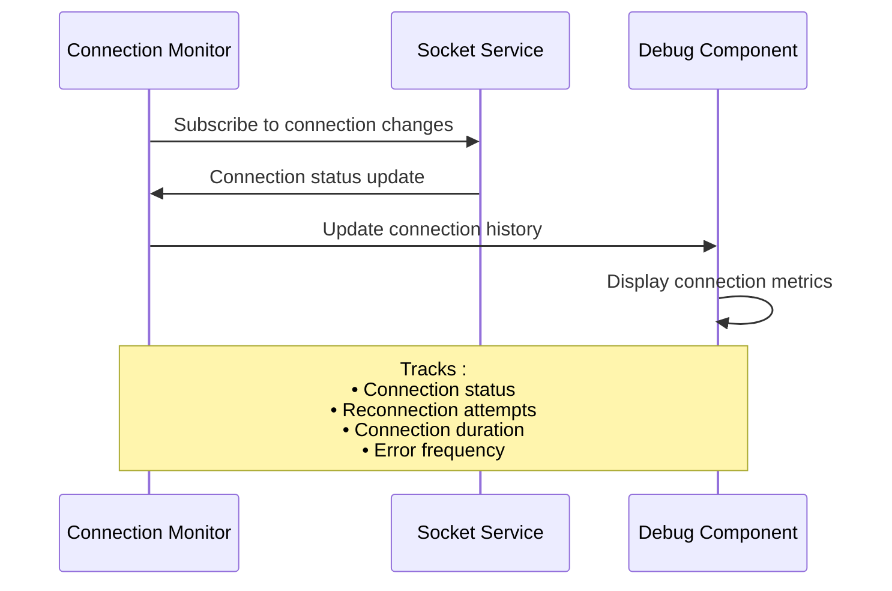

**Diagram sources**
- [ConnectionStatusDebug.tsx](file://web/components/ConnectionStatusDebug.tsx#L1-L123)

### Performance Metrics

The service layer tracks key performance indicators:

| Metric | Purpose | Implementation |
|--------|---------|----------------|
| Connection Latency | Socket connection timing | Built-in Socket.IO timing |
| Reconnection Attempts | Network resilience | Socket.IO reconnection counter |
| Media Stream Quality | WebRTC performance | MediaUtils stream statistics |
| API Response Times | Backend performance | Axios request timing |

**Section sources**
- [ConnectionStatusDebug.tsx](file://web/components/ConnectionStatusDebug.tsx#L1-L123)

## Debugging and Troubleshooting

The service layer provides extensive debugging capabilities for troubleshooting issues.

### Debug Components

The application includes dedicated debugging components for service-level issues:

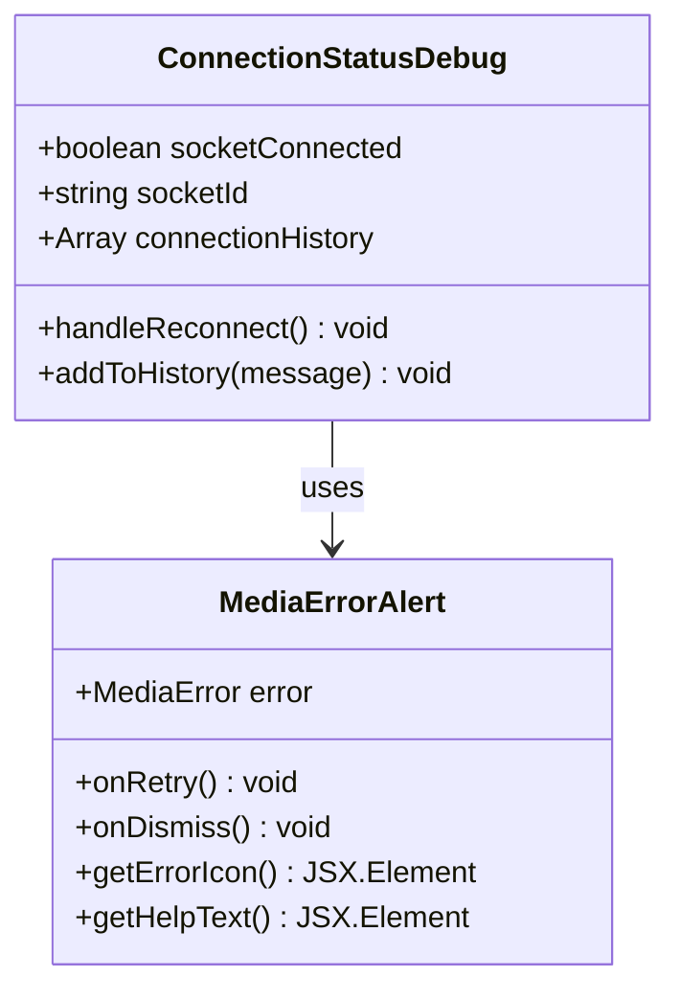

**Diagram sources**
- [ConnectionStatusDebug.tsx](file://web/components/ConnectionStatusDebug.tsx#L1-L123)
- [MediaErrorAlert.tsx](file://web/components/MediaErrorAlert.tsx#L1-L142)

### Common Issues and Solutions

| Issue Category | Symptoms | Debugging Steps | Solution |
|----------------|----------|-----------------|----------|
| Socket Connection | Frequent disconnections | Check network, monitor reconnection attempts | Enable automatic reconnection |
| Media Access | Camera/microphone not working | Check permissions, device availability | Use MediaUtils fallbacks |
| Token Expiration | 401 errors | Monitor token regeneration | Implement session renewal |
| WebRTC | Call failures | Check ICE candidates, STUN/TURN | Verify signaling server |

### Logging Strategy

The service layer implements structured logging for debugging:

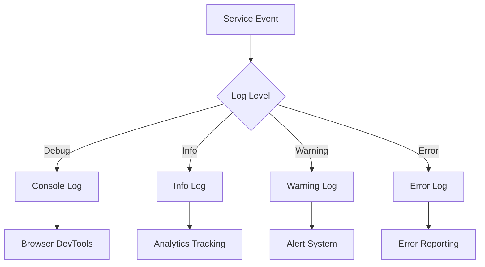

**Section sources**
- [socket.ts](file://web/lib/socket.ts#L25-L170)
- [mediaUtils.ts](file://web/lib/mediaUtils.ts#L133-L184)

## Best Practices

### Service Layer Design Principles

1. **Single Responsibility**: Each service handles one domain (HTTP, WebSocket, Media)
2. **Dependency Injection**: Services are injected into consumers rather than imported directly
3. **Error Boundaries**: Comprehensive error handling at each layer
4. **Resource Management**: Proper cleanup of connections and resources
5. **Type Safety**: Strong TypeScript typing for all interfaces

### Performance Optimization

1. **Lazy Loading**: Services are loaded only when needed
2. **Connection Pooling**: Socket connections are reused efficiently
3. **Memory Management**: Automatic cleanup of event listeners and streams
4. **Caching**: Strategic caching of frequently accessed data

### Security Best Practices

1. **Token Rotation**: Automatic token regeneration for expired sessions
2. **Input Sanitization**: Validation and sanitization of all user inputs
3. **Secure Transmission**: HTTPS enforcement for all communications
4. **Access Control**: Proper authorization checks for sensitive operations

### Testing Strategies

1. **Unit Testing**: Individual service methods are thoroughly tested
2. **Integration Testing**: Service interactions are validated
3. **Error Scenario Testing**: Edge cases and failure modes are covered
4. **Performance Testing**: Load testing ensures scalability

**Section sources**
- [api.ts](file://web/lib/api.ts#L1-L130)
- [socket.ts](file://web/lib/socket.ts#L1-L474)
- [mediaUtils.ts](file://web/lib/mediaUtils.ts#L1-L271)