# State Management

<cite>
**Referenced Files in This Document**
- [ChatContext.tsx](file://web/contexts/ChatContext.tsx)
- [GuestSessionContext.tsx](file://web/contexts/GuestSessionContext.tsx)
- [useWebRTC.ts](file://web/hooks/useWebRTC.ts)
- [useCallLogs.ts](file://web/hooks/useCallLogs.ts)
- [socket.ts](file://web/lib/socket.ts)
- [api.ts](file://web/lib/api.ts)
- [layout.tsx](file://web/app/layout.tsx)
- [VideoCallModal.tsx](file://web/components/VideoCallModal.tsx)
- [GuestSessionContext.token-validation.test.tsx](file://web/contexts/__tests__/GuestSessionContext.token-validation.test.tsx)
- [useWebRTC.video-toggle.test.tsx](file://web/hooks/__tests__/useWebRTC.video-toggle.test.tsx)
</cite>

## Table of Contents
1. [Introduction](#introduction)
2. [Context Architecture Overview](#context-architecture-overview)
3. [ChatContext - Core Chat State Management](#chatcontext---core-chat-state-management)
4. [GuestSessionContext - Guest User Management](#guestsessioncontext---guest-user-management)
5. [Custom Hooks - Feature-Specific Logic](#custom-hooks---feature-specific-logic)
6. [Socket Service Integration](#socket-service-integration)
7. [State Initialization and Lifecycle](#state-initialization-and-lifecycle)
8. [Performance Optimizations](#performance-optimizations)
9. [Testing Strategies](#testing-strategies)
10. [Best Practices](#best-practices)

## Introduction

The Realtime Chat App employs a sophisticated state management system built on React Context API and custom hooks to handle complex real-time communication scenarios. The system manages multiple interconnected states including user sessions, chat conversations, WebRTC calls, and connection status across guest and authenticated users.

The architecture follows a layered approach with specialized contexts handling different aspects of the application state, complemented by custom hooks that encapsulate feature-specific logic and provide clean interfaces to components.

## Context Architecture Overview

The state management system consists of two primary contexts that work together to provide comprehensive application state:

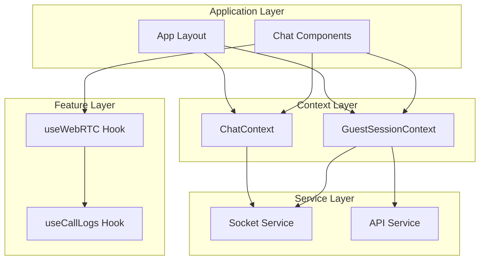

**Diagram sources**
- [layout.tsx](file://web/app/layout.tsx#L25-L40)
- [ChatContext.tsx](file://web/contexts/ChatContext.tsx#L1-L50)
- [GuestSessionContext.tsx](file://web/contexts/GuestSessionContext.tsx#L1-L50)

**Section sources**
- [layout.tsx](file://web/app/layout.tsx#L25-L40)

## ChatContext - Core Chat State Management

The ChatContext serves as the central hub for managing chat-related state, including user connections, message history, typing indicators, and real-time communication status.

### State Structure and Types

The ChatContext manages several key state categories:

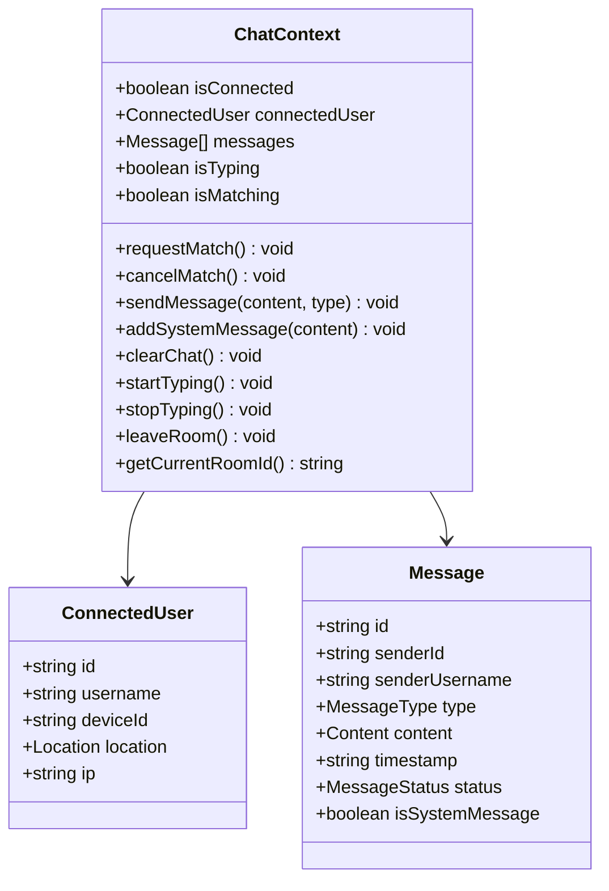

**Diagram sources**
- [ChatContext.tsx](file://web/contexts/ChatContext.tsx#L15-L60)

### Connection Management

The ChatContext handles complex connection scenarios including guest user authentication, automatic reconnection, and network state monitoring:

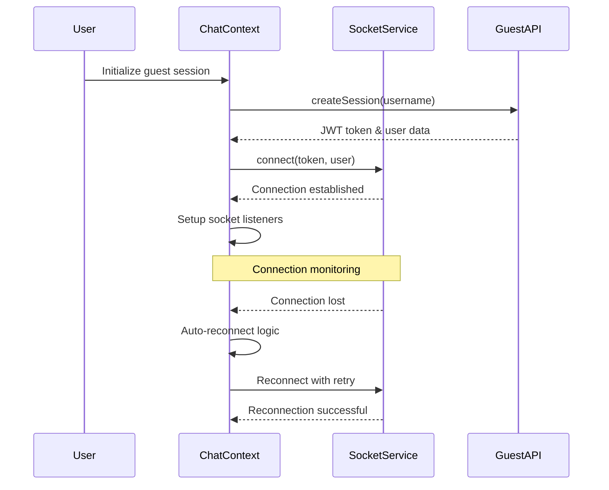

**Diagram sources**
- [ChatContext.tsx](file://web/contexts/ChatContext.tsx#L200-L300)
- [socket.ts](file://web/lib/socket.ts#L30-L80)

### Message Management

The context provides comprehensive message handling with persistence and real-time synchronization:

| Operation | Description | Persistence | Real-time |
|-----------|-------------|-------------|-----------|
| Send Message | Composes and sends messages | Temporarily (until delivery) | Real-time |
| Receive Message | Handles incoming messages | Permanently (session storage) | Real-time |
| Message Status | Tracks sending/delivery status | Temporarily | Real-time |
| System Messages | Generated by system events | Permanently | Real-time |
| Chat History | Maintains conversation history | Session storage | Real-time |

**Section sources**
- [ChatContext.tsx](file://web/contexts/ChatContext.tsx#L500-L600)

## GuestSessionContext - Guest User Management

The GuestSessionContext manages guest user lifecycle, authentication tokens, and real-time presence information.

### Session Lifecycle Management

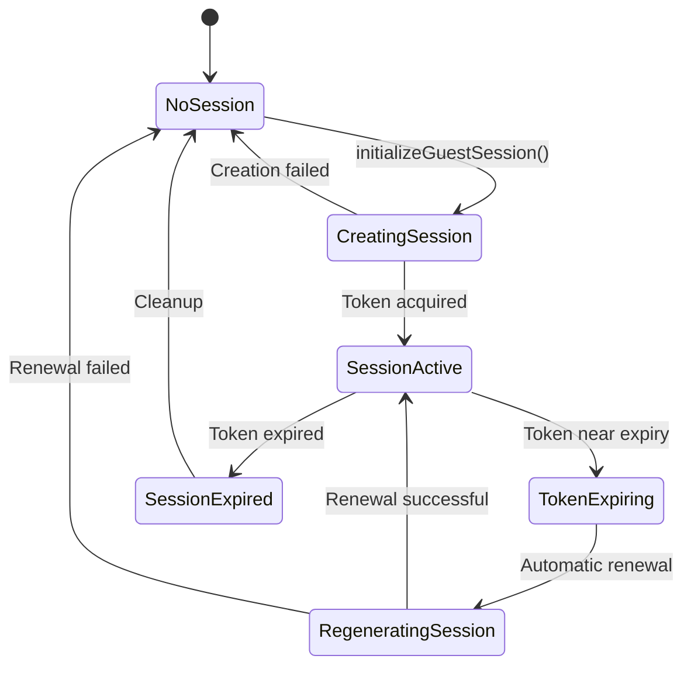

**Diagram sources**
- [GuestSessionContext.tsx](file://web/contexts/GuestSessionContext.tsx#L200-L300)

### Token Validation and Security

The context implements robust token validation with automatic renewal capabilities:

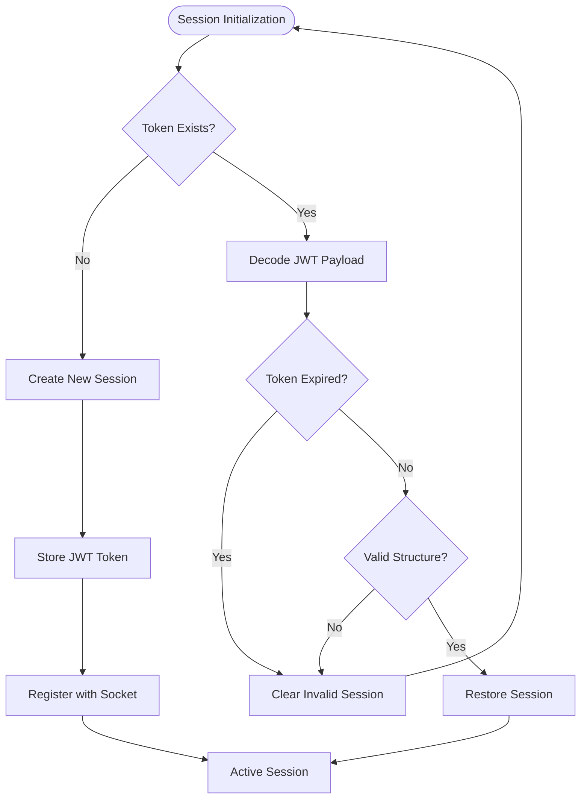

**Diagram sources**
- [GuestSessionContext.tsx](file://web/contexts/GuestSessionContext.tsx#L60-L120)

### Real-time Presence Management

The context maintains real-time presence information for guest users:

| Feature | Implementation | Purpose |
|---------|----------------|---------|
| Online Status | Socket presence events | Real-time availability |
| Search Status | User searching indicator | Match visibility |
| Connected Users | Real-time user lists | Availability display |
| Heartbeat | Periodic presence updates | Connection health |
| Stats Updates | Real-time statistics | System metrics |

**Section sources**
- [GuestSessionContext.tsx](file://web/contexts/GuestSessionContext.tsx#L300-L400)

## Custom Hooks - Feature-Specific Logic

### useWebRTC - WebRTC Call Management

The useWebRTC hook encapsulates complex WebRTC functionality with comprehensive state management:

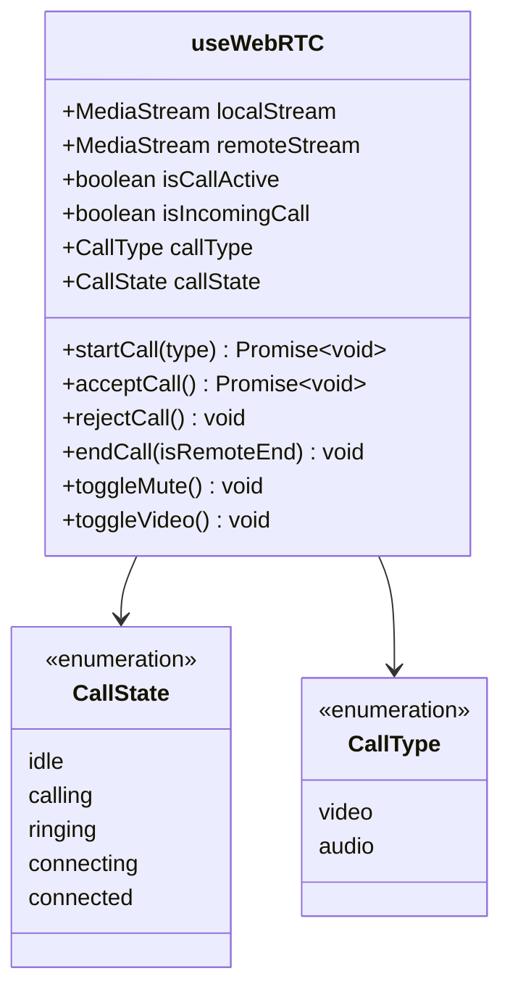

**Diagram sources**
- [useWebRTC.ts](file://web/hooks/useWebRTC.ts#L23-L66)

### useCallLogs - Call Logging System

The useCallLogs hook provides centralized call logging with duration tracking:

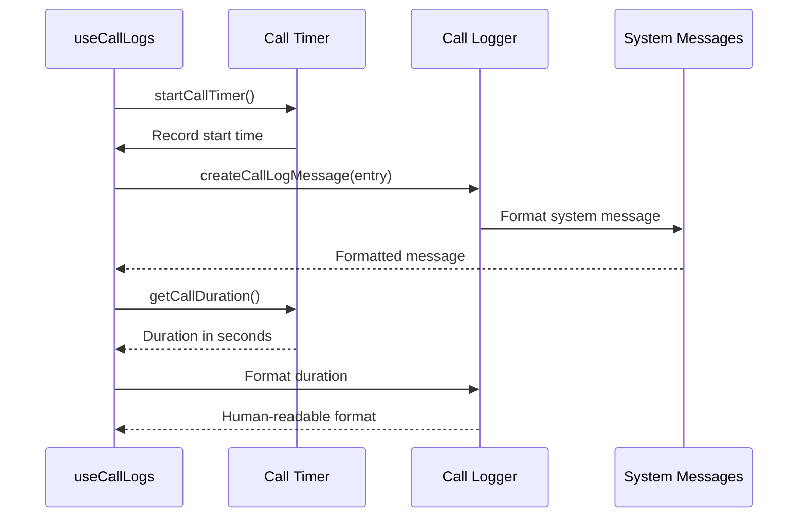

**Diagram sources**
- [useCallLogs.ts](file://web/hooks/useCallLogs.ts#L15-L50)

**Section sources**
- [useWebRTC.ts](file://web/hooks/useWebRTC.ts#L1-L100)
- [useCallLogs.ts](file://web/hooks/useCallLogs.ts#L1-L96)

## Socket Service Integration

The socket service acts as the bridge between contexts and real-time events, providing a unified interface for WebSocket communication.

### Event-Driven Architecture

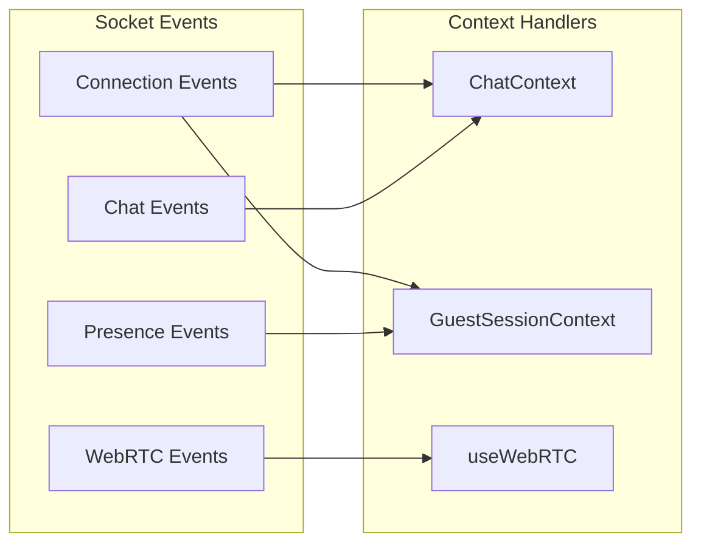

**Diagram sources**
- [socket.ts](file://web/lib/socket.ts#L100-L200)

### Connection Management

The socket service handles complex connection scenarios with automatic reconnection and error recovery:

| Scenario | Behavior | Recovery Strategy |
|----------|----------|-------------------|
| Network Loss | Automatic reconnection | Exponential backoff |
| Token Expiration | Session regeneration | Automatic token refresh |
| Server Unavailable | Retry with delay | Progressive timeout |
| Client Offline | Queue events | Replay on reconnection |
| Connection Timeout | Immediate retry | Failover to backup |

**Section sources**
- [socket.ts](file://web/lib/socket.ts#L150-L300)

## State Initialization and Lifecycle

### Provider Hierarchy

The context providers are structured in a specific hierarchy to ensure proper state sharing:

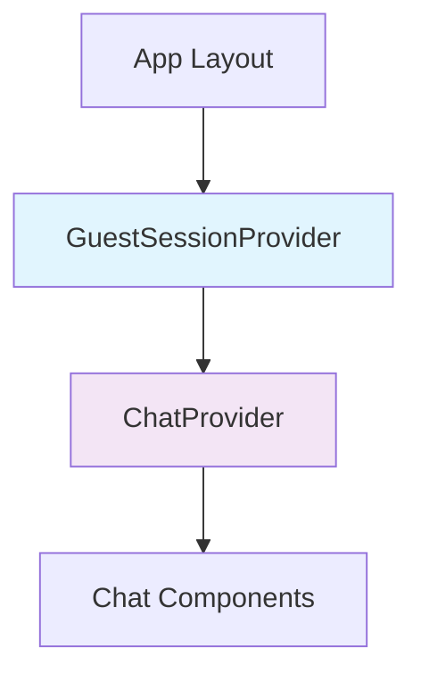

**Diagram sources**
- [layout.tsx](file://web/app/layout.tsx#L25-L40)

### State Persistence

The system implements intelligent state persistence across browser sessions:

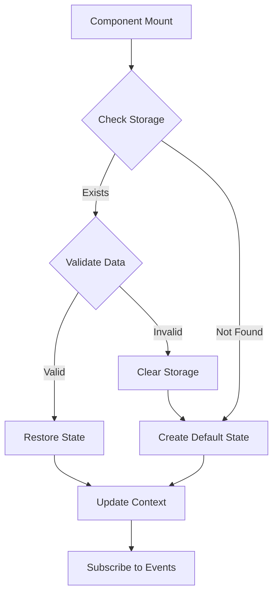

**Diagram sources**
- [ChatContext.tsx](file://web/contexts/ChatContext.tsx#L87-L131)

**Section sources**
- [layout.tsx](file://web/app/layout.tsx#L25-L40)

## Performance Optimizations

### Memoization Strategies

The system employs several memoization techniques to optimize performance:

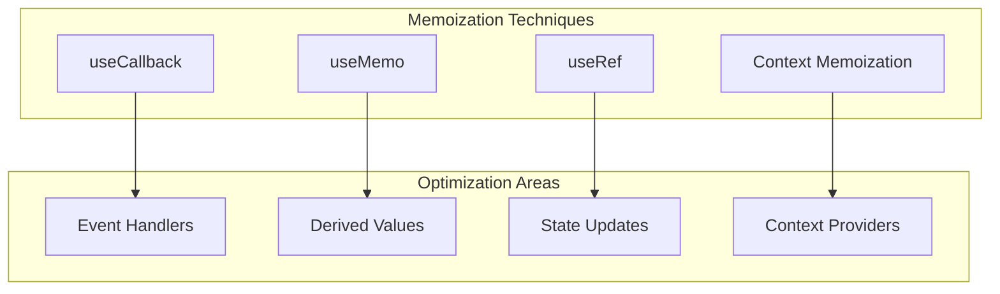

### Memory Management

The system implements careful memory management to prevent leaks:

| Resource | Management Strategy | Cleanup Trigger |
|----------|-------------------|-----------------|
| Socket Listeners | Event cleanup on unmount | Component unmount |
| Timers | Timer cleanup on unmount | Component unmount |
| Media Streams | Stream cleanup on call end | Call termination |
| Peer Connections | Connection cleanup | Call termination |

### Context Splitting

The system uses context splitting to minimize unnecessary re-renders:

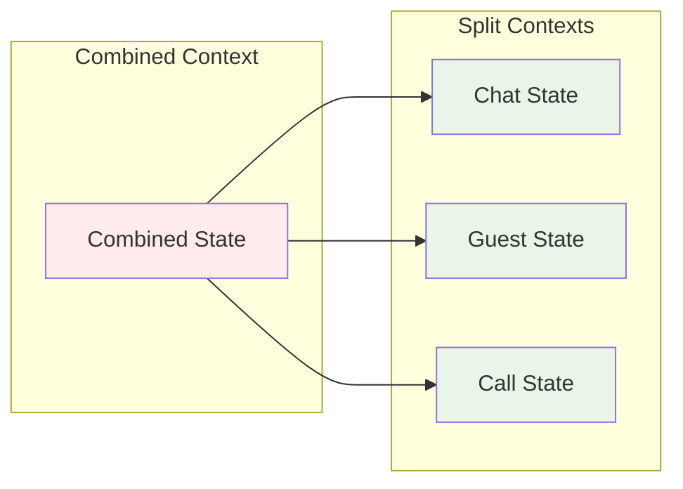

**Section sources**
- [ChatContext.tsx](file://web/contexts/ChatContext.tsx#L600-L673)
- [useWebRTC.ts](file://web/hooks/useWebRTC.ts#L40-L80)

## Testing Strategies

### Context Provider Testing

The testing strategy focuses on comprehensive coverage of context behavior:

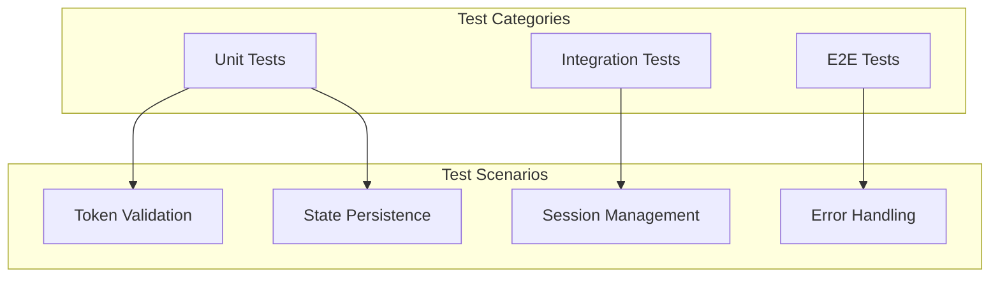

**Diagram sources**
- [GuestSessionContext.token-validation.test.tsx](file://web/contexts/__tests__/GuestSessionContext.token-validation.test.tsx#L50-L100)

### Mock Strategies

The system uses sophisticated mocking for reliable testing:

| Mock Type | Purpose | Implementation |
|-----------|---------|----------------|
| Socket Mock | WebSocket events | Jest mock functions |
| API Mock | HTTP requests | Axios interceptors |
| Media Mock | Camera/microphone | Mock MediaStream |
| Storage Mock | Session storage | In-memory storage |

### Hook Testing Patterns

Custom hooks are tested using specific patterns:

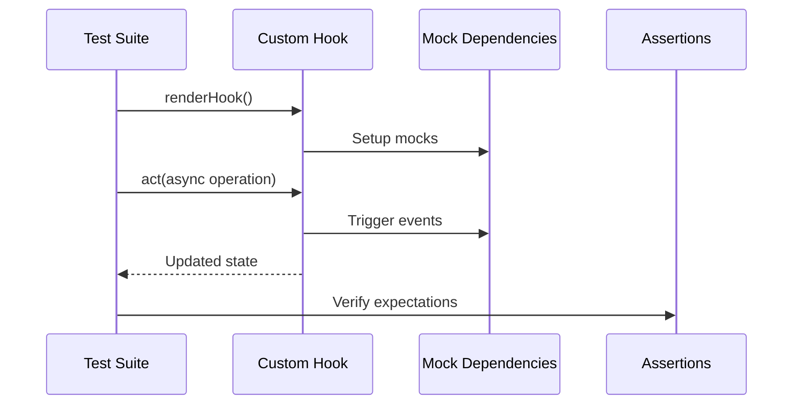

**Diagram sources**
- [useWebRTC.video-toggle.test.tsx](file://web/hooks/__tests__/useWebRTC.video-toggle.test.tsx#L100-L200)

**Section sources**
- [GuestSessionContext.token-validation.test.tsx](file://web/contexts/__tests__/GuestSessionContext.token-validation.test.tsx#L1-L100)
- [useWebRTC.video-toggle.test.tsx](file://web/hooks/__tests__/useWebRTC.video-toggle.test.tsx#L1-L100)

## Best Practices

### State Organization

1. **Separation of Concerns**: Each context handles a specific domain
2. **Minimal State**: Only store essential state in contexts
3. **Immutable Updates**: Always create new state objects
4. **Consistent Naming**: Use clear, descriptive state names

### Performance Guidelines

1. **Memoization**: Use useCallback and useMemo appropriately
2. **Context Splitting**: Split contexts to minimize re-renders
3. **Lazy Loading**: Load heavy resources on demand
4. **Cleanup**: Always clean up resources in useEffect

### Error Handling

1. **Graceful Degradation**: Handle failures gracefully
2. **User Feedback**: Provide meaningful error messages
3. **Retry Logic**: Implement intelligent retry mechanisms
4. **Logging**: Log errors for debugging and monitoring

### Testing Approach

1. **Comprehensive Coverage**: Test all user flows
2. **Mock Appropriately**: Mock external dependencies
3. **Integration Testing**: Test context interactions
4. **Performance Testing**: Monitor performance impact

The state management system demonstrates advanced React patterns with real-world complexity, providing a solid foundation for building scalable real-time applications with robust state management and excellent developer experience.