# Frontend Authentication Integration

<cite>
**Referenced Files in This Document**
- [GuestUsernameModal.tsx](file://web/components/GuestUsernameModal.tsx)
- [GuestSessionContext.tsx](file://web/contexts/GuestSessionContext.tsx)
- [socket.ts](file://web/lib/socket.ts)
- [api.ts](file://web/lib/api.ts)
- [guestController.js](file://backend/src/controllers/guestController.js)
- [guest.js](file://backend/src/routes/guest.js)
- [socketHandlers.js](file://backend/src/socket/socketHandlers.js)
- [layout.tsx](file://web/app/layout.tsx)
- [page.tsx](file://web/app/chat/page.tsx)
- [GuestSessionContext.token-validation.test.tsx](file://web/contexts/__tests__/GuestSessionContext.token-validation.test.tsx)
- [socket.test.ts](file://web/lib/__tests__/socket.test.ts)
- [GUEST_AUTH_INTEGRATION.md](file://GUEST_AUTH_INTEGRATION.md)
</cite>

## Table of Contents
1. [Introduction](#introduction)
2. [System Architecture Overview](#system-architecture-overview)
3. [Guest Username Modal Component](#guest-username-modal-component)
4. [Guest Session Context](#guest-session-context)
5. [Socket Connection Management](#socket-connection-management)
6. [Authentication Flow](#authentication-flow)
7. [Error Handling and Recovery](#error-handling-and-recovery)
8. [Security Considerations](#security-considerations)
9. [Common Integration Issues](#common-integration-issues)
10. [Best Practices](#best-practices)
11. [Testing and Validation](#testing-and-validation)

## Introduction

The Frontend Authentication Integration sub-feature enables seamless guest user authentication for the Realtime Chat Application. This system allows anonymous users to create temporary accounts, establish authenticated WebSocket connections, and participate in real-time chat functionality without requiring traditional registration. The integration spans multiple frontend components and backend services, creating a cohesive authentication flow that handles token management, session persistence, and real-time connectivity.

The authentication system operates on a guest-first model, prioritizing user experience by eliminating barriers to entry while maintaining security through JWT token-based authentication and automatic session expiration.

## System Architecture Overview

The authentication integration follows a layered architecture that separates concerns between presentation, business logic, and data persistence:

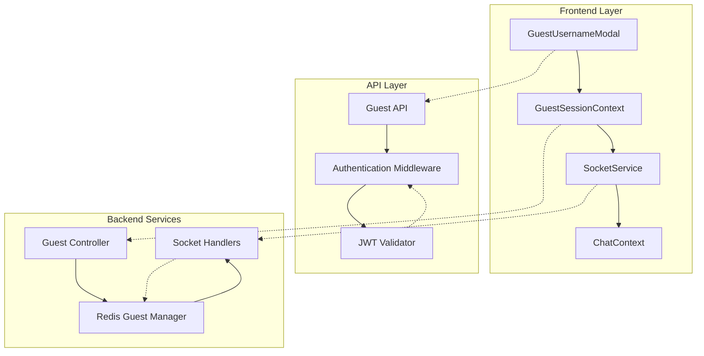

**Diagram sources**
- [GuestUsernameModal.tsx](file://web/components/GuestUsernameModal.tsx#L1-L201)
- [GuestSessionContext.tsx](file://web/contexts/GuestSessionContext.tsx#L1-L453)
- [socket.ts](file://web/lib/socket.ts#L1-L474)
- [guestController.js](file://backend/src/controllers/guestController.js#L1-L149)

The architecture ensures clear separation of responsibilities while maintaining efficient communication between components. Each layer handles specific aspects of the authentication process, from user interface interactions to backend service orchestration.

**Section sources**
- [GuestUsernameModal.tsx](file://web/components/GuestUsernameModal.tsx#L1-L50)
- [GuestSessionContext.tsx](file://web/contexts/GuestSessionContext.tsx#L1-L100)
- [socket.ts](file://web/lib/socket.ts#L1-L100)

## Guest Username Modal Component

The GuestUsernameModal serves as the primary entry point for guest authentication, providing an intuitive interface for users to create their guest identities. This component manages username generation, validation, and session initiation.

### Component Structure and State Management

The modal implements sophisticated state management to handle various user interactions and loading states:

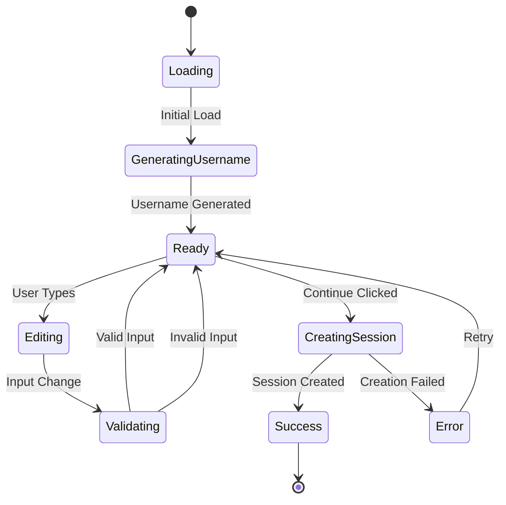

**Diagram sources**
- [GuestUsernameModal.tsx](file://web/components/GuestUsernameModal.tsx#L25-L80)

### Username Generation and Validation

The modal implements intelligent username generation with fallback mechanisms:

| Feature | Implementation | Validation Rules |
|---------|---------------|------------------|
| **Automatic Generation** | Server-side API call to `/api/guest/username` | Random combination of adjectives and nouns |
| **Client Fallback** | Local generation using predefined lists | Adjective + Noun + 4-digit number |
| **Character Limits** | Max 20 characters, min 3 characters | Alphanumeric and underscore only |
| **Format Validation** | Regex pattern `^[a-zA-Z0-9_]*$` | Letters, numbers, and underscores only |

### Modal Interaction Flow

The component handles user interactions through a series of controlled transitions:

1. **Initial Load**: Generates random username when modal opens
2. **Manual Generation**: Allows users to create new usernames
3. **Input Validation**: Real-time validation of username format
4. **Session Creation**: Initiates guest session with validated username
5. **Error Recovery**: Maintains modal state on failures for retry

**Section sources**
- [GuestUsernameModal.tsx](file://web/components/GuestUsernameModal.tsx#L40-L120)

## Guest Session Context

The GuestSessionContext manages the complete lifecycle of guest authentication state, including token storage, session validation, and real-time synchronization. This context provider acts as the central hub for authentication-related state management.

### Session State Management

The context maintains multiple state dimensions for comprehensive session tracking:

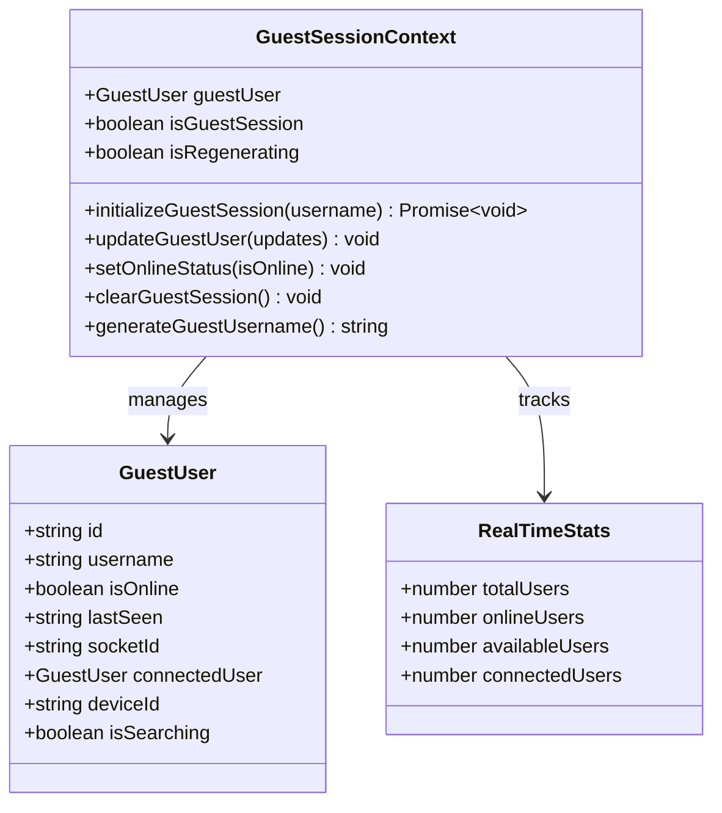

**Diagram sources**
- [GuestSessionContext.tsx](file://web/contexts/GuestSessionContext.tsx#L10-L50)
- [GuestSessionContext.tsx](file://web/contexts/GuestSessionContext.tsx#L150-L200)

### Token Storage and Validation

The context implements robust token management with automatic validation:

| Storage Location | Purpose | Expiration Handling |
|------------------|---------|-------------------|
| **sessionStorage** | JWT tokens and user data | Automatic expiration checking |
| **localStorage** | Device identification | Persistent across sessions |
| **Memory** | Runtime state | Cleared on component unmount |

### Session Regeneration Mechanism

The context provides automatic session regeneration capabilities:

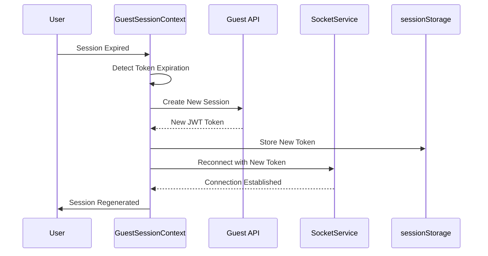

**Diagram sources**
- [GuestSessionContext.tsx](file://web/contexts/GuestSessionContext.tsx#L120-L180)
- [socket.ts](file://web/lib/socket.ts#L400-L474)

**Section sources**
- [GuestSessionContext.tsx](file://web/contexts/GuestSessionContext.tsx#L60-L200)

## Socket Connection Management

The SocketService class orchestrates WebSocket connections with comprehensive authentication support, handling token injection, connection lifecycle, and automatic reconnection scenarios.

### Connection Initialization

The socket connection process implements a sophisticated authentication flow:

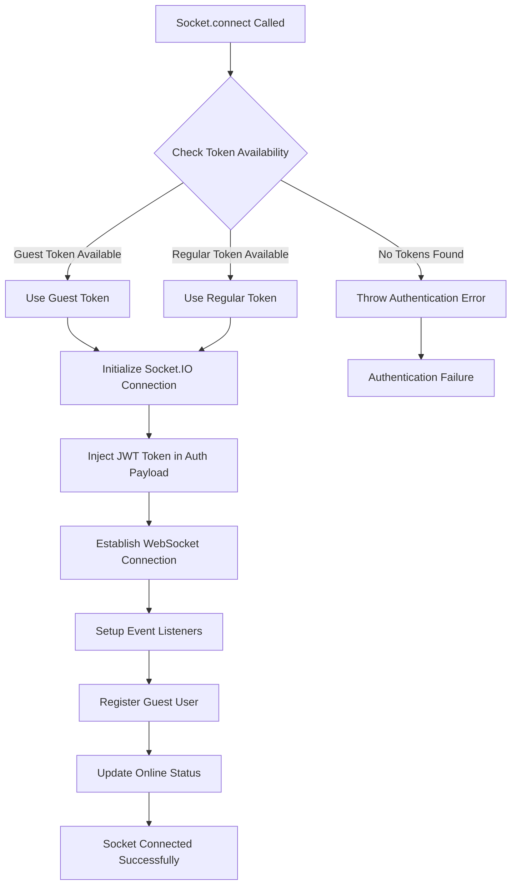

**Diagram sources**
- [socket.ts](file://web/lib/socket.ts#L25-L80)

### Authentication Payload Structure

The Socket.IO handshake includes a structured authentication payload:

| Field | Type | Purpose | Example |
|-------|------|---------|---------|
| **token** | string | JWT authentication token | `"eyJhbGciOiJIUzI1NiIs..."` |
| **id** | string | User identifier | `"guest_abc123"` |
| **username** | string | Display name | `"CoolPanda1234"` |
| **deviceId** | string | Device fingerprint | `"uuid-v4-string"` |
| **isGuest** | boolean | Authentication type | `true` |

### Connection Lifecycle Management

The service manages complex connection states with automatic recovery:

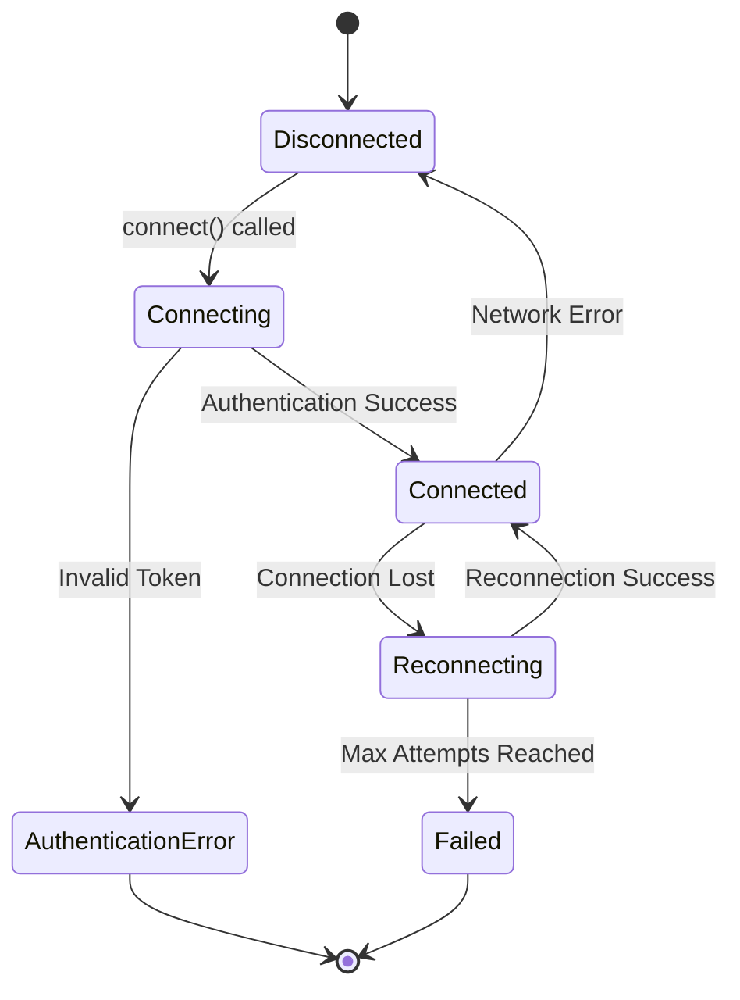

**Diagram sources**
- [socket.ts](file://web/lib/socket.ts#L80-L150)

### Automatic Reconnection and Token Refresh

The socket service implements intelligent reconnection logic:

| Scenario | Action | Timeout | Max Retries |
|----------|--------|---------|-------------|
| **Initial Connection** | Single attempt | 20 seconds | N/A |
| **Network Interruption** | Exponential backoff | 1 second → 5 seconds | 10 attempts |
| **Token Expiration** | Automatic regeneration | Immediate | Unlimited |
| **Server Unavailable** | Progressive delay | 1 second → 5 seconds | 10 attempts |

**Section sources**
- [socket.ts](file://web/lib/socket.ts#L25-L200)

## Authentication Flow

The complete authentication flow demonstrates the coordinated interaction between frontend components and backend services, ensuring seamless user experience while maintaining security standards.

### Complete Authentication Sequence

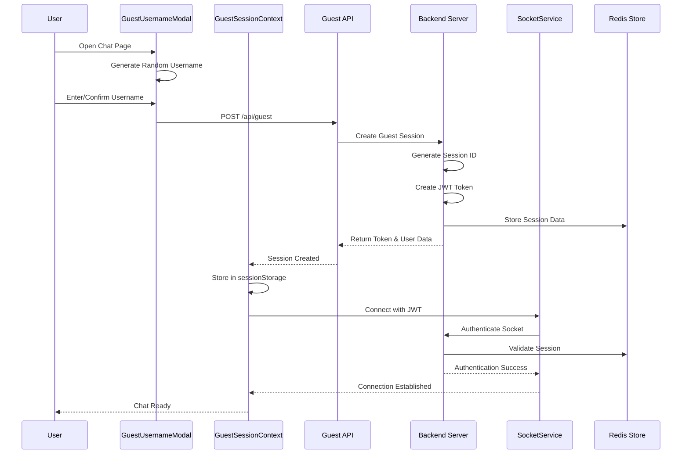

**Diagram sources**
- [GuestUsernameModal.tsx](file://web/components/GuestUsernameModal.tsx#L80-L120)
- [GuestSessionContext.tsx](file://web/contexts/GuestSessionContext.tsx#L350-L420)
- [socket.ts](file://web/lib/socket.ts#L25-L80)

### Token Exchange Process

The authentication exchange involves multiple security layers:

1. **Username Submission**: User provides desired username
2. **Session Creation**: Backend validates and creates guest session
3. **JWT Generation**: Secure token with user claims and expiration
4. **Token Storage**: Secure client-side storage in sessionStorage
5. **Socket Authentication**: JWT included in Socket.IO auth payload
6. **Session Validation**: Backend verifies token and establishes connection

### Real-time Presence Updates

Once authenticated, the system maintains real-time presence awareness:

| Event Type | Trigger | Recipients | Data Sent |
|------------|---------|------------|-----------|
| **User Join** | Socket connect | All clients | User presence data |
| **Status Change** | Online/offline | Relevant clients | Updated status |
| **Heartbeat** | Periodic ping | Monitoring systems | Activity timestamp |
| **Disconnect** | Connection loss | All clients | User departure |

**Section sources**
- [GuestSessionContext.tsx](file://web/contexts/GuestSessionContext.tsx#L200-L350)
- [socket.ts](file://web/lib/socket.ts#L150-L250)

## Error Handling and Recovery

The authentication system implements comprehensive error handling with graceful degradation and user-friendly recovery mechanisms.

### Error Classification and Handling

The system categorizes errors into distinct types with appropriate responses:

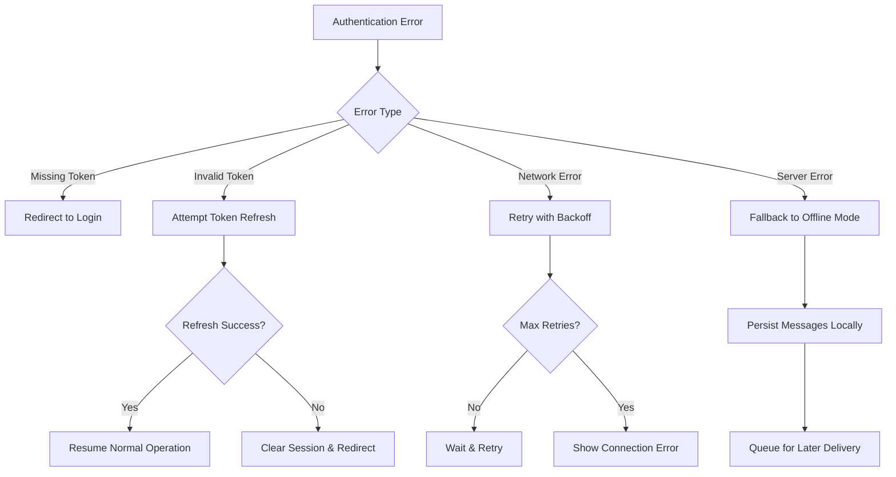

**Diagram sources**
- [socket.ts](file://web/lib/socket.ts#L100-L150)
- [api.ts](file://web/lib/api.ts#L30-L80)

### Token Expiration Recovery

The system handles token expiration through automatic regeneration:

| Scenario | Detection Method | Recovery Action | User Impact |
|----------|------------------|-----------------|-------------|
| **Socket Token Expired** | Connection error with "Token expired" | Automatic session regeneration | Seamless continuation |
| **API Token Expired** | 401 Unauthorized response | Token refresh with new session | Minimal interruption |
| **Storage Corruption** | Malformed token parsing | Fresh session creation | Brief pause |
| **Network Timeout** | Request timeout | Retry with exponential backoff | Automatic retry |

### Graceful Degradation

When authentication fails, the system provides fallback options:

1. **Offline Mode**: Local message caching for later synchronization
2. **Anonymous Chat**: Limited functionality with temporary identifiers
3. **Retry Mechanisms**: Automatic retry with user notification
4. **User Feedback**: Clear error messages with actionable guidance

**Section sources**
- [socket.ts](file://web/lib/socket.ts#L350-L474)
- [api.ts](file://web/lib/api.ts#L30-L80)

## Security Considerations

The authentication system implements multiple security layers to protect user data and maintain system integrity.

### Token Security Measures

| Security Layer | Implementation | Protection Against |
|----------------|---------------|-------------------|
| **JWT Encryption** | HS256 algorithm with secret key | Token tampering |
| **Short Expiration** | 2-hour validity period | Prolonged access |
| **Secure Storage** | sessionStorage with HTTPOnly cookies | XSS attacks |
| **Scope Limitation** | User-specific permissions | Cross-user access |
| **Rate Limiting** | API request throttling | Brute force attacks |

### Session Management Security

The system implements comprehensive session security:

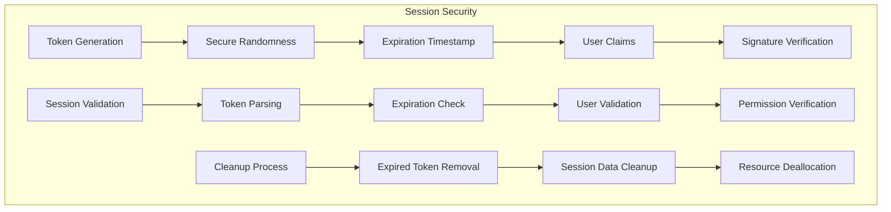

**Diagram sources**
- [guestController.js](file://backend/src/controllers/guestController.js#L30-L60)
- [GuestSessionContext.tsx](file://web/contexts/GuestSessionContext.tsx#L60-L120)

### Input Sanitization and Validation

The system validates all user inputs to prevent security vulnerabilities:

| Input Type | Validation Rules | Sanitization Method |
|------------|------------------|-------------------|
| **Username** | 3-20 characters, alphanumeric + underscore | Regex validation |
| **Location Data** | Structured JSON with coordinates | Schema validation |
| **Gender Selection** | Enum values (male/female/other) | Whitelist validation |
| **Language Preference** | ISO language codes | Length and format checks |

**Section sources**
- [GuestUsernameModal.tsx](file://web/components/GuestUsernameModal.tsx#L90-L110)
- [guestController.js](file://backend/src/controllers/guestController.js#L15-L30)

## Common Integration Issues

Understanding and resolving common integration challenges ensures smooth deployment and operation of the authentication system.

### Missing Authentication Token

**Symptoms**: Socket connection fails with "Authentication required" error
**Root Cause**: JWT token not present in sessionStorage
**Solution**: Ensure GuestSessionContext initializes session before socket connection

**Code Reference**: [socket.ts](file://web/lib/socket.ts#L30-L45)

### CORS Configuration Problems

**Symptoms**: API requests fail with CORS policy errors
**Root Cause**: Backend CORS settings incompatible with frontend origin
**Solution**: Configure CORS middleware to allow Next.js frontend origin

**Code Reference**: [guest.js](file://backend/src/routes/guest.js#L1-L20)

### Race Condition During Connection Setup

**Symptoms**: Intermittent socket connection failures
**Root Cause**: Socket connects before authentication token is available
**Solution**: Implement proper initialization sequencing with loading states

**Code Reference**: [page.tsx](file://web/app/chat/page.tsx#L137-L150)

### Session Synchronization Issues

**Symptoms**: Inconsistent user state across components
**Root Cause**: Multiple instances of GuestSessionContext with different state
**Solution**: Use singleton pattern for session context and implement state synchronization

**Code Reference**: [GuestSessionContext.tsx](file://web/contexts/GuestSessionContext.tsx#L120-L180)

### Memory Leaks in Socket Connections

**Symptoms**: Gradual performance degradation over time
**Root Cause**: Event listeners not properly cleaned up
**Solution**: Implement proper cleanup in useEffect hooks and component unmount

**Code Reference**: [socket.ts](file://web/lib/socket.ts#L100-L150)

**Section sources**
- [socket.ts](file://web/lib/socket.ts#L30-L80)
- [page.tsx](file://web/app/chat/page.tsx#L137-L170)

## Best Practices

Implementing these best practices ensures optimal performance, security, and user experience in the authentication system.

### Error Handling Best Practices

1. **User-Friendly Error Messages**: Provide clear, actionable feedback for authentication failures
2. **Graceful Degradation**: Maintain basic functionality when authentication fails
3. **Progressive Enhancement**: Build core features first, then add authentication enhancements
4. **Comprehensive Logging**: Log authentication events for monitoring and debugging

### Performance Optimization

| Optimization Area | Implementation | Benefit |
|------------------|---------------|---------|
| **Lazy Loading** | Load authentication components only when needed | Faster initial page load |
| **Token Caching** | Store tokens efficiently with expiration tracking | Reduced API calls |
| **Connection Pooling** | Reuse socket connections across components | Lower resource usage |
| **State Persistence** | Save session state to minimize re-authentication | Improved user experience |

### Security Implementation Guidelines

1. **Defense in Depth**: Implement multiple security layers beyond just token validation
2. **Regular Audits**: Conduct periodic security reviews of authentication flows
3. **Monitoring**: Implement logging and alerting for suspicious authentication patterns
4. **Updates**: Keep all dependencies updated to prevent known vulnerabilities

### User Experience Enhancements

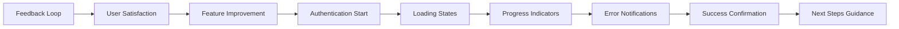

**Diagram sources**
- [GuestUsernameModal.tsx](file://web/components/GuestUsernameModal.tsx#L150-L201)

**Section sources**
- [GuestSessionContext.tsx](file://web/contexts/GuestSessionContext.tsx#L400-L453)
- [socket.ts](file://web/lib/socket.ts#L400-L474)

## Testing and Validation

Comprehensive testing ensures the authentication system functions correctly under various scenarios and edge cases.

### Unit Testing Strategies

The system employs multiple testing approaches:

| Test Type | Coverage | Tools Used |
|-----------|----------|------------|
| **Unit Tests** | Individual component functions | Jest, React Testing Library |
| **Integration Tests** | Component interactions | Cypress, Playwright |
| **API Tests** | Backend endpoint validation | Supertest, Postman |
| **Socket Tests** | Real-time communication | Socket.IO test utilities |

### Token Validation Testing

The token validation system includes extensive test coverage:

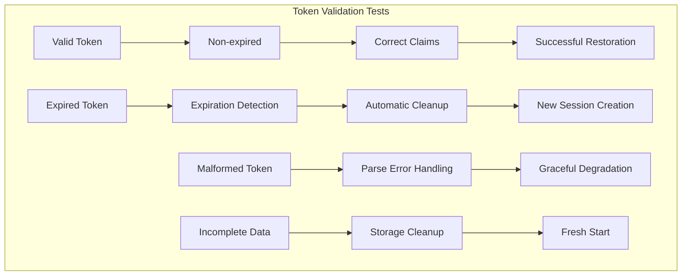

**Diagram sources**
- [GuestSessionContext.token-validation.test.tsx](file://web/contexts/__tests__/GuestSessionContext.token-validation.test.tsx#L100-L200)

### Socket Connection Testing

Socket connection reliability is validated through comprehensive testing:

| Test Scenario | Expected Outcome | Validation Method |
|---------------|------------------|-------------------|
| **Normal Connection** | Successful authentication | Socket ID verification |
| **Token Expiration** | Automatic regeneration | Session continuity check |
| **Network Interruption** | Automatic reconnection | Connection state monitoring |
| **Server Restart** | Graceful recovery | Message delivery validation |

### Performance Testing

The system undergoes performance validation:

1. **Load Testing**: Simulate multiple concurrent guest sessions
2. **Latency Testing**: Measure authentication response times
3. **Stress Testing**: Test system limits under high load
4. **Memory Testing**: Monitor memory usage during extended sessions

**Section sources**
- [GuestSessionContext.token-validation.test.tsx](file://web/contexts/__tests__/GuestSessionContext.token-validation.test.tsx#L1-L100)
- [socket.test.ts](file://web/lib/__tests__/socket.test.ts#L1-L100)