# Guest Authentication System

<cite>
**Referenced Files in This Document**
- [guestController.js](file://backend/src/controllers/guestController.js)
- [jwt.js](file://backend/src/utils/jwt.js)
- [redisGuestManager.js](file://backend/src/utils/redisGuestManager.js)
- [auth.js](file://backend/src/middleware/auth.js)
- [guest.js](file://backend/src/routes/guest.js)
- [socketHandlers.js](file://backend/src/socket/socketHandlers.js)
- [GuestSessionContext.tsx](file://web/contexts/GuestSessionContext.tsx)
- [socket.ts](file://web/lib/socket.ts)
- [api.ts](file://web/lib/api.ts)
- [validation.js](file://backend/src/middleware/validation.js)
- [server.js](file://backend/src/server.js)
- [socketServer.js](file://backend/src/socket/socketServer.js)
</cite>

## Table of Contents
1. [Introduction](#introduction)
2. [System Architecture](#system-architecture)
3. [Token-Based Authentication Flow](#token-based-authentication-flow)
4. [Guest Controller Implementation](#guest-controller-implementation)
5. [Redis Guest Manager Utility](#redis-guest-manager-utility)
6. [JWT Generation and Validation](#jwt-generation-and-validation)
7. [Authentication Middleware](#authentication-middleware)
8. [Session Resumption and Device Management](#session-resumption-and-device-management)
9. [Security Considerations](#security-considerations)
10. [Flow Diagrams](#flow-diagrams)
11. [Error Handling and Cleanup](#error-handling-and-cleanup)
12. [Performance and Scalability](#performance-and-scalability)

## Introduction

The Guest Authentication System provides a seamless, token-based authentication mechanism for anonymous users in the Realtime Chat Application. Unlike traditional authentication systems that require user registration, this system allows users to instantly create guest sessions with unique identifiers and JWT tokens, enabling immediate participation in chat and matching functionalities.

The system combines Express.js REST APIs with Socket.IO real-time communication, utilizing Redis for persistent session storage with in-memory fallback capabilities. This architecture ensures high availability, scalability, and robust session management while maintaining security through token-based authentication.

## System Architecture

The Guest Authentication System follows a layered architecture with clear separation of concerns:

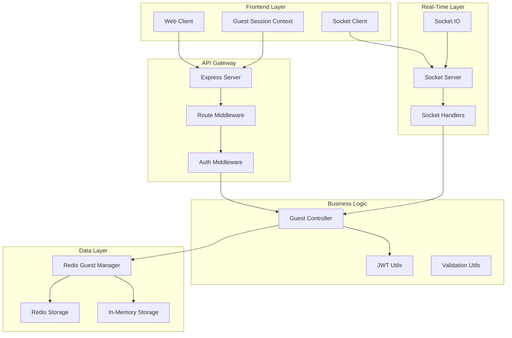
```mermaid
graph TB
subgraph "Frontend Layer"
WC[Web Client]
SC[Socket Client]
GS[Guest Session Context]
end
subgraph "API Gateway"
EX[Express Server]
RM[Route Middleware]
AM[Auth Middleware]
end
subgraph "Business Logic"
GC[Guest Controller]
JU[JWT Utils]
VU[Validation Utils]
end
subgraph "Data Layer"
RGM[Redis Guest Manager]
RS[Redis Storage]
IM[In-Memory Storage]
end
subgraph "Real-Time Layer"
SS[Socket Server]
SH[Socket Handlers]
IO[Socket.IO]
end
WC --> EX
SC --> SS
GS --> EX
EX --> RM
RM --> AM
AM --> GC
GC --> JU
GC --> RGM
RGM --> RS
RGM --> IM
SS --> SH
SH --> GC
IO --> SS
```

**Diagram sources**
- [server.js](file://backend/src/server.js#L1-L50)
- [socketServer.js](file://backend/src/socket/socketServer.js#L1-L50)
- [GuestSessionContext.tsx](file://web/contexts/GuestSessionContext.tsx#L1-L50)

**Section sources**
- [server.js](file://backend/src/server.js#L1-L265)
- [socketServer.js](file://backend/src/socket/socketServer.js#L1-L199)

## Token-Based Authentication Flow

The guest authentication system operates on a JWT-based token flow that enables secure, stateless authentication for anonymous users:

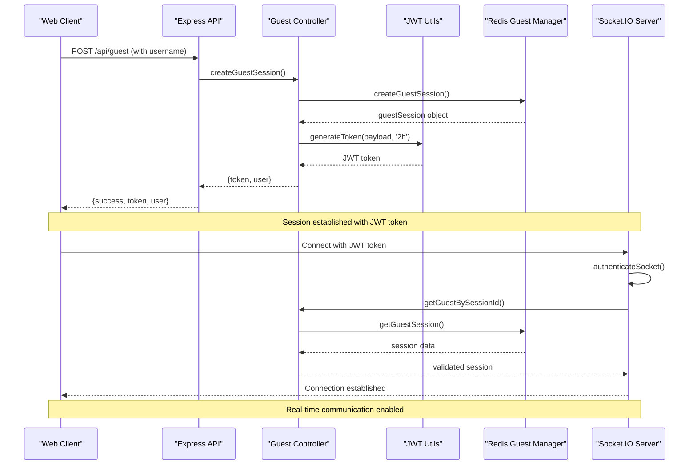
```mermaid
sequenceDiagram
participant Client as "Web Client"
participant API as "Express API"
participant Controller as "Guest Controller"
participant JWT as "JWT Utils"
participant Redis as "Redis Guest Manager"
participant Socket as "Socket.IO Server"
Client->>API : POST /api/guest (with username)
API->>Controller : createGuestSession()
Controller->>Redis : createGuestSession()
Redis-->>Controller : guestSession object
Controller->>JWT : generateToken(payload, '2h')
JWT-->>Controller : JWT token
Controller-->>API : {token, user}
API-->>Client : {success, token, user}
Note over Client,Socket : Session established with JWT token
Client->>Socket : Connect with JWT token
Socket->>Socket : authenticateSocket()
Socket->>Controller : getGuestBySessionId()
Controller->>Redis : getGuestSession()
Redis-->>Controller : session data
Controller-->>Socket : validated session
Socket-->>Client : Connection established
Note over Client,Socket : Real-time communication enabled
```

**Diagram sources**
- [guestController.js](file://backend/src/controllers/guestController.js#L25-L60)
- [jwt.js](file://backend/src/utils/jwt.js#L5-L15)
- [auth.js](file://backend/src/middleware/auth.js#L40-L80)
- [socketHandlers.js](file://backend/src/socket/socketHandlers.js#L15-L45)

**Section sources**
- [guestController.js](file://backend/src/controllers/guestController.js#L25-L60)
- [jwt.js](file://backend/src/utils/jwt.js#L1-L52)
- [auth.js](file://backend/src/middleware/auth.js#L1-L100)

## Guest Controller Implementation

The Guest Controller serves as the primary business logic layer for guest session management, providing comprehensive CRUD operations and session lifecycle management:

### Core Functions

The controller implements several key functions for guest session management:

- **Session Creation**: Generates unique guest sessions with automatic username generation
- **Session Retrieval**: Fetches session data by session ID with expiration checking
- **Presence Management**: Updates and tracks guest presence and status
- **Statistics Collection**: Provides analytics on guest activity and system metrics

### Session Creation Process

The [`createGuestSession`](file://backend/src/controllers/guestController.js#L25-L60) function orchestrates the complete session creation workflow:

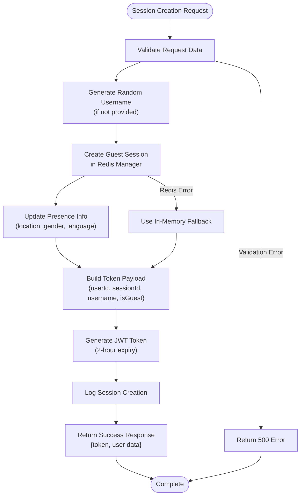
```mermaid
flowchart TD
Start([Session Creation Request]) --> ValidateInput["Validate Request Data"]
ValidateInput --> GenUsername["Generate Random Username<br/>(if not provided)"]
GenUsername --> CreateSession["Create Guest Session<br/>in Redis Manager"]
CreateSession --> UpdatePresence["Update Presence Info<br/>(location, gender, language)"]
UpdatePresence --> BuildPayload["Build Token Payload<br/>{userId, sessionId, username, isGuest}"]
BuildPayload --> GenerateToken["Generate JWT Token<br/>(2-hour expiry)"]
GenerateToken --> LogSuccess["Log Session Creation"]
LogSuccess --> ReturnResponse["Return Success Response<br/>{token, user data}"]
ReturnResponse --> End([Complete])
ValidateInput --> |Validation Error| ErrorResponse["Return 500 Error"]
CreateSession --> |Redis Error| FallbackStorage["Use In-Memory Fallback"]
FallbackStorage --> BuildPayload
ErrorResponse --> End
```

**Diagram sources**
- [guestController.js](file://backend/src/controllers/guestController.js#L25-L60)

### Username Generation

The system automatically generates unique usernames using a combination of adjectives and nouns:

| Component | Options | Example |
|-----------|---------|---------|
| Adjectives | 20+ common adjectives | Cool, Happy, Smart, Brave |
| Nouns | 20+ animal names | Panda, Tiger, Eagle, Wolf |
| Numbers | 4-digit random number | 1-9999 |
| Format | `{Adjective}{Noun}{Number}` | BraveWolf4567 |

**Section sources**
- [guestController.js](file://backend/src/controllers/guestController.js#L1-L149)

## Redis Guest Manager Utility

The Redis Guest Manager provides robust session storage with dual-layer persistence and intelligent fallback mechanisms:

### Architecture Design

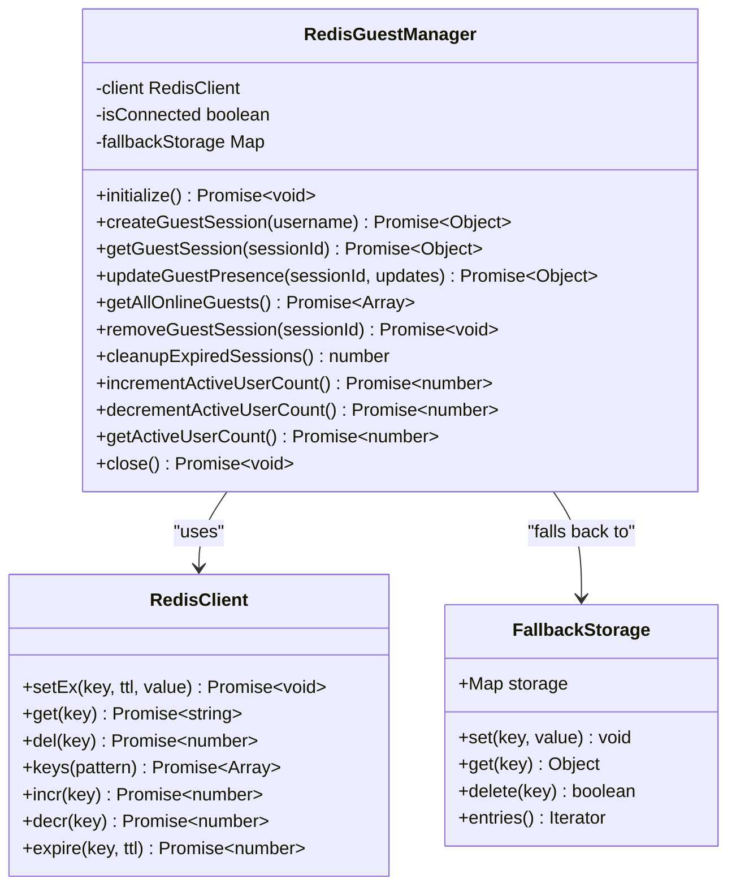
```mermaid
classDiagram
class RedisGuestManager {
-client RedisClient
-isConnected boolean
-fallbackStorage Map
+initialize() Promise~void~
+createGuestSession(username) Promise~Object~
+getGuestSession(sessionId) Promise~Object~
+updateGuestPresence(sessionId, updates) Promise~Object~
+getAllOnlineGuests() Promise~Array~
+removeGuestSession(sessionId) Promise~void~
+cleanupExpiredSessions() number
+incrementActiveUserCount() Promise~number~
+decrementActiveUserCount() Promise~number~
+getActiveUserCount() Promise~number~
+close() Promise~void~
}
class RedisClient {
+setEx(key, ttl, value) Promise~void~
+get(key) Promise~string~
+del(key) Promise~number~
+keys(pattern) Promise~Array~
+incr(key) Promise~number~
+decr(key) Promise~number~
+expire(key, ttl) Promise~number~
}
class FallbackStorage {
+Map storage
+set(key, value) void
+get(key) Object
+delete(key) boolean
+entries() Iterator
}
RedisGuestManager --> RedisClient : "uses"
RedisGuestManager --> FallbackStorage : "falls back to"
```

**Diagram sources**
- [redisGuestManager.js](file://backend/src/utils/redisGuestManager.js#L1-L50)

### Storage Strategy

The Redis Guest Manager implements a sophisticated dual-storage approach:

#### Primary Storage (Redis)
- **Key Format**: `guest:{sessionId}`
- **Expiration**: 2-hour TTL for automatic cleanup
- **Data Structure**: JSON-serialized guest session objects
- **Operations**: Atomic Redis commands for consistency

#### Fallback Storage (In-Memory)
- **Data Structure**: JavaScript Map with expiration tracking
- **Cleanup**: Periodic cleanup every 10 minutes
- **Persistence**: Lost on server restart (acceptable for guest sessions)

### Session Lifecycle Management

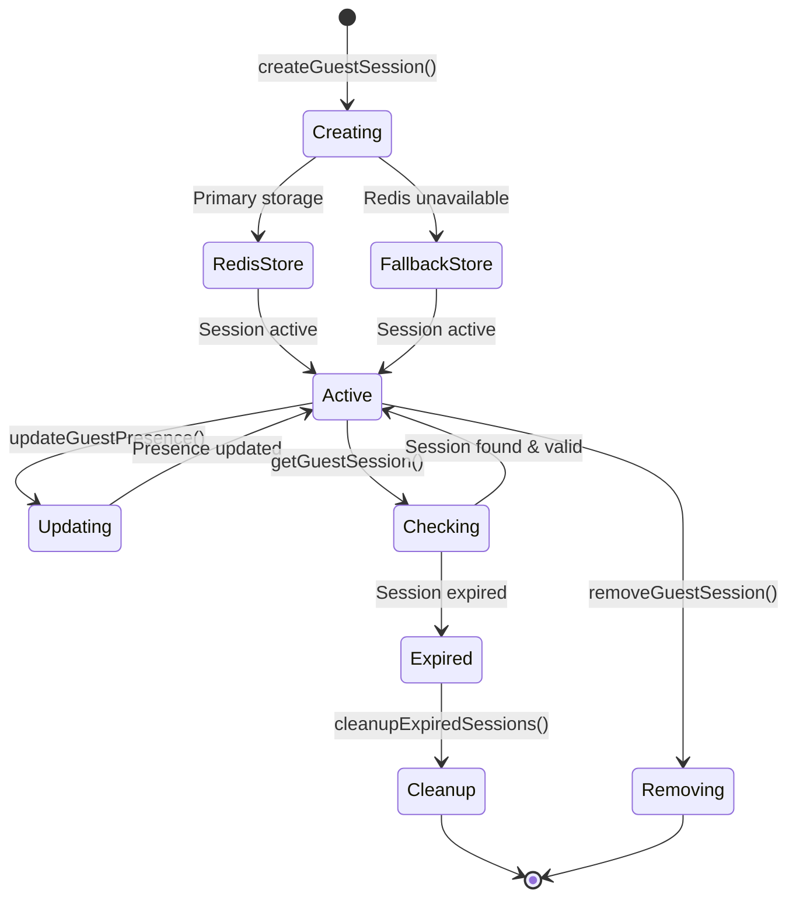
```mermaid
stateDiagram-v2
[*] --> Creating : createGuestSession()
Creating --> RedisStore : Primary storage
Creating --> FallbackStore : Redis unavailable
RedisStore --> Active : Session active
FallbackStore --> Active : Session active
Active --> Updating : updateGuestPresence()
Updating --> Active : Presence updated
Active --> Checking : getGuestSession()
Checking --> Active : Session found & valid
Checking --> Expired : Session expired
Active --> Removing : removeGuestSession()
Expired --> Cleanup : cleanupExpiredSessions()
Cleanup --> [*]
Removing --> [*]
```

**Diagram sources**
- [redisGuestManager.js](file://backend/src/utils/redisGuestManager.js#L80-L150)

**Section sources**
- [redisGuestManager.js](file://backend/src/utils/redisGuestManager.js#L1-L432)

## JWT Generation and Validation

The JWT system provides secure token-based authentication with configurable expiration and robust validation mechanisms:

### Token Structure

Guest JWT tokens contain essential session information:

| Claim | Type | Description | Example |
|-------|------|-------------|---------|
| `userId` | String | Unique guest identifier | `guest_550e8400-e29b-41d4-a716-446655440000` |
| `sessionId` | String | Session UUID | `550e8400-e29b-41d4-a716-446655440000` |
| `username` | String | Guest username | `BraveWolf4567` |
| `isGuest` | Boolean | Guest session indicator | `true` |
| `iat` | Number | Issued at timestamp | `1640995200` |
| `exp` | Number | Expiration timestamp | `1640998800` |

### JWT Configuration

The JWT system uses environment-based configuration:

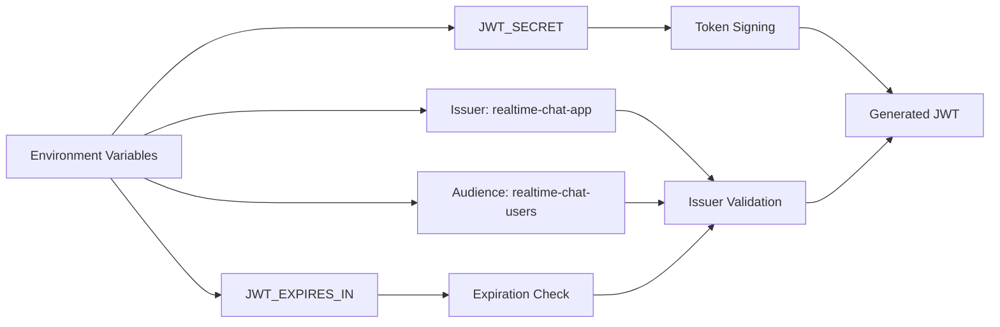
```mermaid
flowchart LR
Config[Environment Variables] --> Secret[JWT_SECRET]
Config --> Expiry[JWT_EXPIRES_IN]
Config --> Issuer[Issuer: realtime-chat-app]
Config --> Audience[Audience: realtime-chat-users]
Secret --> Signing[Token Signing]
Expiry --> ExpiryCheck[Expiration Check]
Issuer --> Validation[Issuer Validation]
Audience --> Validation
Signing --> Token[Generated JWT]
ExpiryCheck --> Validation
Validation --> Token
```

**Diagram sources**
- [jwt.js](file://backend/src/utils/jwt.js#L5-L15)

### Token Validation Process

The validation system implements comprehensive error handling:

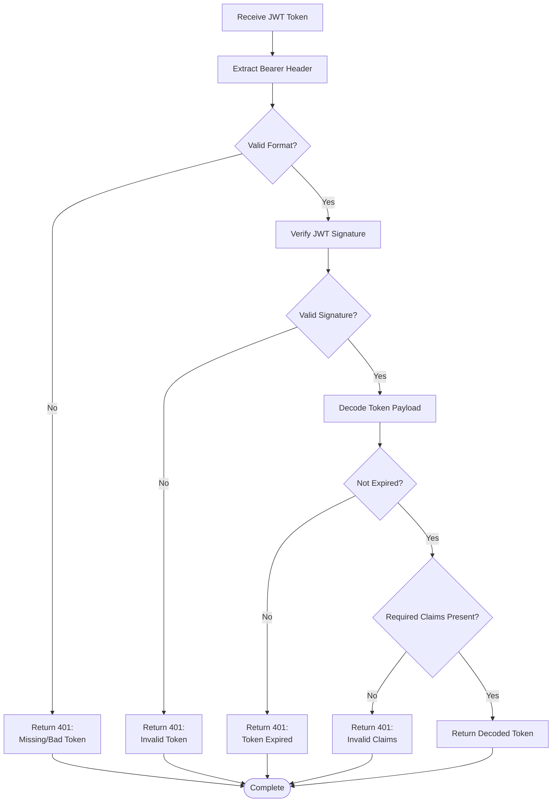
```mermaid
flowchart TD
ReceiveToken[Receive JWT Token] --> ExtractHeader["Extract Bearer Header"]
ExtractHeader --> ValidateFormat{"Valid Format?"}
ValidateFormat --> |No| ReturnError["Return 401:<br/>Missing/Bad Token"]
ValidateFormat --> |Yes| VerifySignature["Verify JWT Signature"]
VerifySignature --> CheckSignature{"Valid Signature?"}
CheckSignature --> |No| InvalidToken["Return 401:<br/>Invalid Token"]
CheckSignature --> |Yes| DecodePayload["Decode Token Payload"]
DecodePayload --> CheckExpiry{"Not Expired?"}
CheckExpiry --> |No| ExpiredToken["Return 401:<br/>Token Expired"]
CheckExpiry --> |Yes| ValidateClaims{"Required Claims Present?"}
ValidateClaims --> |No| InvalidClaims["Return 401:<br/>Invalid Claims"]
ValidateClaims --> |Yes| Success["Return Decoded Token"]
ReturnError --> End([Complete])
InvalidToken --> End
ExpiredToken --> End
InvalidClaims --> End
Success --> End
```

**Diagram sources**
- [jwt.js](file://backend/src/utils/jwt.js#L17-L45)

**Section sources**
- [jwt.js](file://backend/src/utils/jwt.js#L1-L52)

## Authentication Middleware

The authentication middleware provides comprehensive token validation for both HTTP and WebSocket connections:

### HTTP Authentication

The [`authenticateToken`](file://backend/src/middleware/auth.js#L6-L45) middleware handles JWT validation for REST API endpoints:

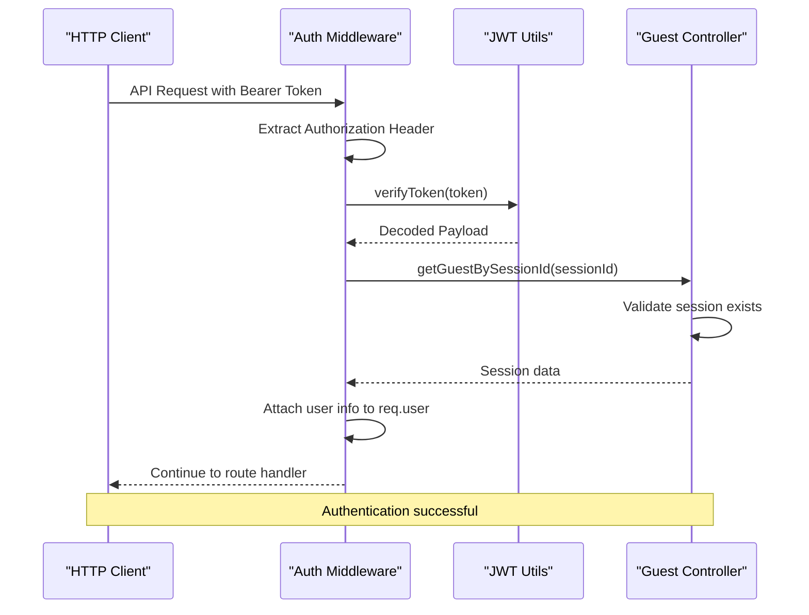
```mermaid
sequenceDiagram
participant Client as "HTTP Client"
participant Middleware as "Auth Middleware"
participant JWT as "JWT Utils"
participant Controller as "Guest Controller"
Client->>Middleware : API Request with Bearer Token
Middleware->>Middleware : Extract Authorization Header
Middleware->>JWT : verifyToken(token)
JWT-->>Middleware : Decoded Payload
Middleware->>Controller : getGuestBySessionId(sessionId)
Controller->>Controller : Validate session exists
Controller-->>Middleware : Session data
Middleware->>Middleware : Attach user info to req.user
Middleware-->>Client : Continue to route handler
Note over Client,Controller : Authentication successful
```

**Diagram sources**
- [auth.js](file://backend/src/middleware/auth.js#L6-L45)

### Socket.IO Authentication

The [`authenticateSocket`](file://backend/src/middleware/auth.js#L47-L85) middleware secures WebSocket connections:

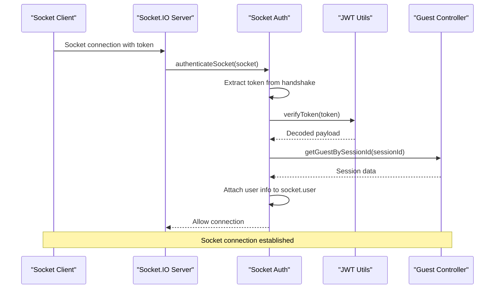
```mermaid
sequenceDiagram
participant Client as "Socket Client"
participant SocketIO as "Socket.IO Server"
participant Middleware as "Socket Auth"
participant JWT as "JWT Utils"
participant Controller as "Guest Controller"
Client->>SocketIO : Socket connection with token
SocketIO->>Middleware : authenticateSocket(socket)
Middleware->>Middleware : Extract token from handshake
Middleware->>JWT : verifyToken(token)
JWT-->>Middleware : Decoded payload
Middleware->>Controller : getGuestBySessionId(sessionId)
Controller-->>Middleware : Session data
Middleware->>Middleware : Attach user info to socket.user
Middleware-->>SocketIO : Allow connection
Note over Client,Controller : Socket connection established
```

**Diagram sources**
- [auth.js](file://backend/src/middleware/auth.js#L47-L85)

### Validation Rules

Both authentication methods enforce strict validation rules:

| Validation Rule | HTTP Auth | Socket Auth | Purpose |
|----------------|-----------|-------------|---------|
| Token Presence | Required | Required | Basic authentication |
| JWT Format | Valid Bearer | Valid Bearer | Proper token format |
| Signature | Verified | Verified | Token authenticity |
| Expiration | Not expired | Not expired | Session validity |
| Guest Flag | `isGuest: true` | `isGuest: true` | Guest-only access |
| Session Existence | Session found | Session found | Active session |

**Section sources**
- [auth.js](file://backend/src/middleware/auth.js#L1-L100)

## Session Resumption and Device Management

The system implements sophisticated session resumption and device management capabilities to ensure seamless user experience across connections:

### Device ID Management

Each guest session maintains a persistent device identifier:

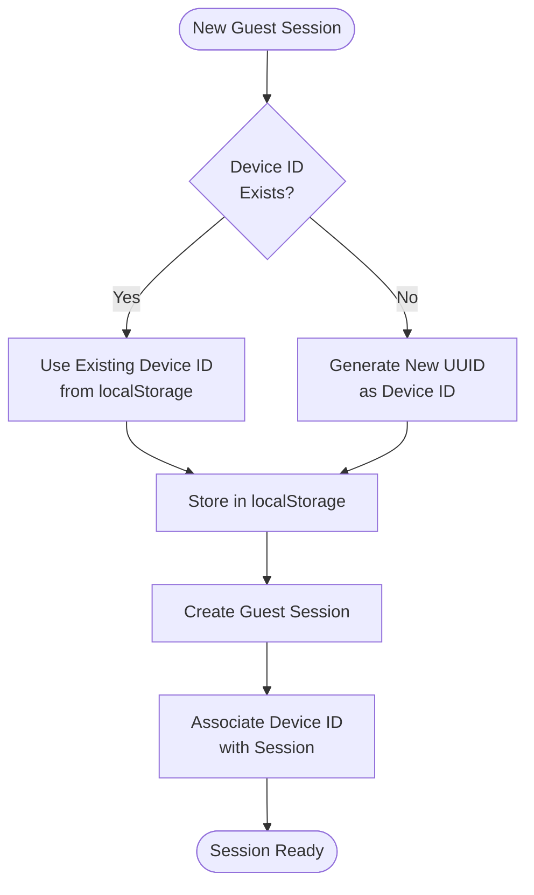
```mermaid
flowchart TD
Start([New Guest Session]) --> CheckDeviceID{"Device ID<br/>Exists?"}
CheckDeviceID --> |Yes| UseExisting["Use Existing Device ID<br/>from localStorage"]
CheckDeviceID --> |No| GenerateNew["Generate New UUID<br/>as Device ID"]
UseExisting --> StoreDeviceID["Store in localStorage"]
GenerateNew --> StoreDeviceID
StoreDeviceID --> CreateSession["Create Guest Session"]
CreateSession --> AssociateDevice["Associate Device ID<br/>with Session"]
AssociateDevice --> End([Session Ready])
```

**Diagram sources**
- [GuestSessionContext.tsx](file://web/contexts/GuestSessionContext.tsx#L350-L370)

### Session Restoration

The frontend implements intelligent session restoration:

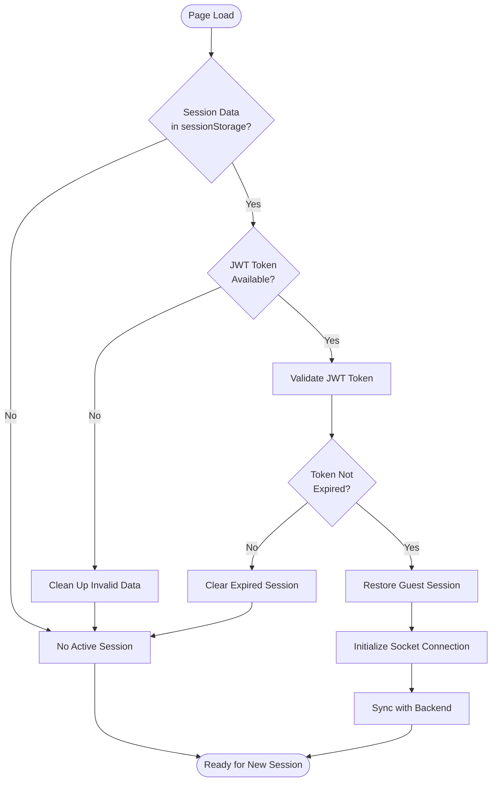
```mermaid
flowchart TD
PageLoad([Page Load]) --> CheckSessionStorage{"Session Data<br/>in sessionStorage?"}
CheckSessionStorage --> |No| NoSession["No Active Session"]
CheckSessionStorage --> |Yes| CheckToken{"JWT Token<br/>Available?"}
CheckToken --> |No| CleanUp["Clean Up Invalid Data"]
CheckToken --> |Yes| ValidateToken["Validate JWT Token"]
ValidateToken --> CheckExpiry{"Token Not<br/>Expired?"}
CheckExpiry --> |No| ExpiredToken["Clear Expired Session"]
CheckExpiry --> |Yes| RestoreSession["Restore Guest Session"]
RestoreSession --> InitSocket["Initialize Socket Connection"]
InitSocket --> SyncSession["Sync with Backend"]
CleanUp --> NoSession
ExpiredToken --> NoSession
NoSession --> End([Ready for New Session])
SyncSession --> End
```

**Diagram sources**
- [GuestSessionContext.tsx](file://web/contexts/GuestSessionContext.tsx#L40-L80)

### Token Regeneration

The system automatically handles token expiration through a sophisticated regeneration process:

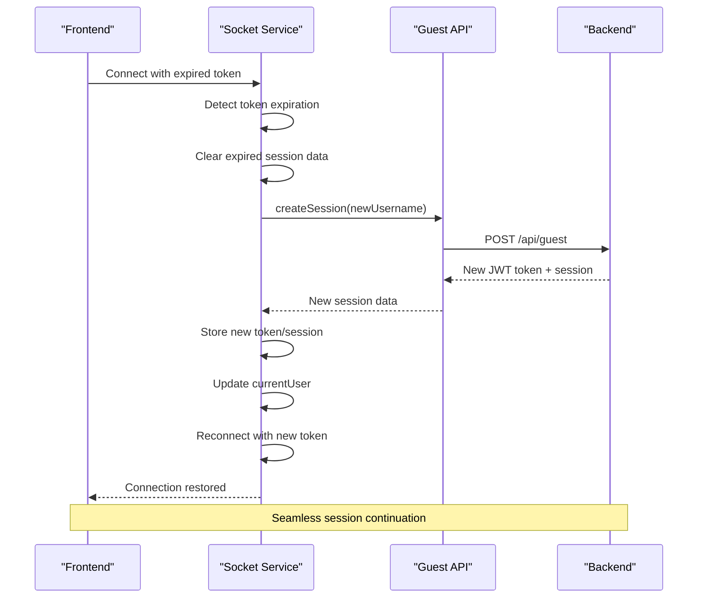
```mermaid
sequenceDiagram
participant Frontend as "Frontend"
participant Socket as "Socket Service"
participant API as "Guest API"
participant Backend as "Backend"
Frontend->>Socket : Connect with expired token
Socket->>Socket : Detect token expiration
Socket->>Socket : Clear expired session data
Socket->>API : createSession(newUsername)
API->>Backend : POST /api/guest
Backend-->>API : New JWT token + session
API-->>Socket : New session data
Socket->>Socket : Store new token/session
Socket->>Socket : Update currentUser
Socket->>Socket : Reconnect with new token
Socket-->>Frontend : Connection restored
Note over Frontend,Backend : Seamless session continuation
```

**Diagram sources**
- [socket.ts](file://web/lib/socket.ts#L315-L370)
- [api.ts](file://web/lib/api.ts#L35-L70)

**Section sources**
- [GuestSessionContext.tsx](file://web/contexts/GuestSessionContext.tsx#L350-L432)
- [socket.ts](file://web/lib/socket.ts#L315-L370)
- [api.ts](file://web/lib/api.ts#L35-L70)

## Security Considerations

The Guest Authentication System implements multiple layers of security to protect against various attack vectors:

### Token Security Measures

| Security Aspect | Implementation | Protection Against |
|----------------|----------------|-------------------|
| **Token Secrecy** | HTTPS-only transmission | Eavesdropping attacks |
| **Token Storage** | Secure HTTP-only cookies | XSS vulnerabilities |
| **Token Expiration** | 2-hour expiry (HTTP) Configurable (Socket.IO) | Prolonged access |
| **Refresh Mechanism** | Automatic regeneration | Session hijacking |
| **Scope Limitation** | Guest-only access | Cross-user impersonation |

### Session Protection

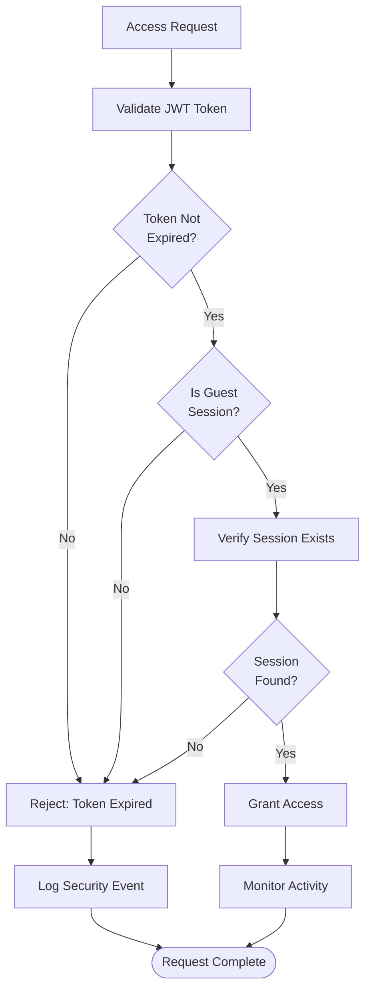
```mermaid
flowchart TD
AccessRequest[Access Request] --> ValidateToken["Validate JWT Token"]
ValidateToken --> CheckExpiry{"Token Not<br/>Expired?"}
CheckExpiry --> |No| RejectRequest["Reject: Token Expired"]
CheckExpiry --> |Yes| CheckGuest{"Is Guest<br/>Session?"}
CheckGuest --> |No| RejectRequest
CheckGuest --> |Yes| CheckSession["Verify Session Exists"]
CheckSession --> SessionExists{"Session<br/>Found?"}
SessionExists --> |No| RejectRequest
SessionExists --> |Yes| GrantAccess["Grant Access"]
RejectRequest --> LogSecurity["Log Security Event"]
GrantAccess --> MonitorActivity["Monitor Activity"]
LogSecurity --> End([Request Complete])
MonitorActivity --> End
```

**Diagram sources**
- [auth.js](file://backend/src/middleware/auth.js#L6-L45)

### Attack Vector Mitigation

#### Session Fixation Prevention
- **Dynamic Session IDs**: Each session receives a unique UUID
- **Token Rotation**: Automatic regeneration on expiration
- **Device Binding**: Sessions tied to specific devices

#### Replay Attack Protection
- **Timestamp Validation**: JWT includes issued-at claim
- **Single-use Tokens**: Tokens invalidated after use
- **Immediate Revocation**: Redis-based session invalidation

#### Denial of Service Prevention
- **Rate Limiting**: 100 requests per minute per user
- **Connection Limits**: Socket.IO connection monitoring
- **Resource Cleanup**: Automatic session expiration

**Section sources**
- [auth.js](file://backend/src/middleware/auth.js#L1-L100)
- [socketServer.js](file://backend/src/socket/socketServer.js#L50-L70)

## Flow Diagrams

### Complete Authentication Flow

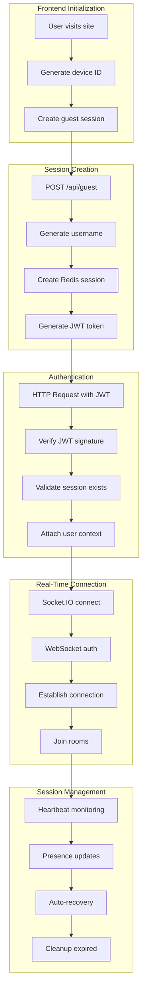
```mermaid
flowchart TB
subgraph "Frontend Initialization"
A1[User visits site]
A2[Generate device ID]
A3[Create guest session]
end
subgraph "Session Creation"
B1[POST /api/guest]
B2[Generate username]
B3[Create Redis session]
B4[Generate JWT token]
end
subgraph "Authentication"
C1[HTTP Request with JWT]
C2[Verify JWT signature]
C3[Validate session exists]
C4[Attach user context]
end
subgraph "Real-Time Connection"
D1[Socket.IO connect]
D2[WebSocket auth]
D3[Establish connection]
D4[Join rooms]
end
subgraph "Session Management"
E1[Heartbeat monitoring]
E2[Presence updates]
E3[Auto-recovery]
E4[Cleanup expired]
end
A1 --> A2
A2 --> A3
A3 --> B1
B1 --> B2
B2 --> B3
B3 --> B4
B4 --> C1
C1 --> C2
C2 --> C3
C3 --> C4
C4 --> D1
D1 --> D2
D2 --> D3
D3 --> D4
D4 --> E1
E1 --> E2
E2 --> E3
E3 --> E4
```

**Diagram sources**
- [GuestSessionContext.tsx](file://web/contexts/GuestSessionContext.tsx#L1-L50)
- [guestController.js](file://backend/src/controllers/guestController.js#L25-L60)
- [auth.js](file://backend/src/middleware/auth.js#L1-L100)
- [socketHandlers.js](file://backend/src/socket/socketHandlers.js#L15-L45)

### Session Lifecycle Management

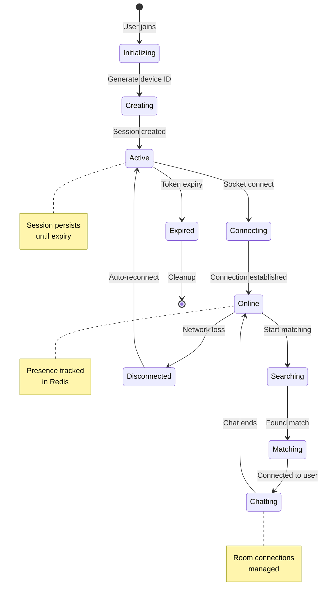
```mermaid
stateDiagram-v2
[*] --> Initializing : User joins
Initializing --> Creating : Generate device ID
Creating --> Active : Session created
Active --> Connecting : Socket connect
Connecting --> Online : Connection established
Online --> Searching : Start matching
Searching --> Matching : Found match
Matching --> Chatting : Connected to user
Chatting --> Online : Chat ends
Online --> Disconnected : Network loss
Disconnected --> Active : Auto-reconnect
Active --> Expired : Token expiry
Expired --> [*] : Cleanup
note right of Active : Session persists<br/>until expiry
note right of Online : Presence tracked<br/>in Redis
note right of Chatting : Room connections<br/>managed
```

**Diagram sources**
- [redisGuestManager.js](file://backend/src/utils/redisGuestManager.js#L80-L150)
- [socketHandlers.js](file://backend/src/socket/socketHandlers.js#L15-L80)

## Error Handling and Cleanup

The system implements comprehensive error handling and cleanup mechanisms to maintain system stability:

### Error Recovery Strategies

| Error Type | Frontend Handling | Backend Handling | Recovery Action |
|------------|------------------|------------------|-----------------|
| **Network Error** | Retry with exponential backoff | Log and continue | Reconnect automatically |
| **Token Expired** | Regenerate session | Clear invalid session | Create new session |
| **Redis Unavailable** | Fallback to memory | Use in-memory storage | Continue with degraded service |
| **Session Not Found** | Redirect to home | Return 404 | Inform user |
| **Validation Error** | Show error message | Return 400 | Correct input |

### Cleanup Processes

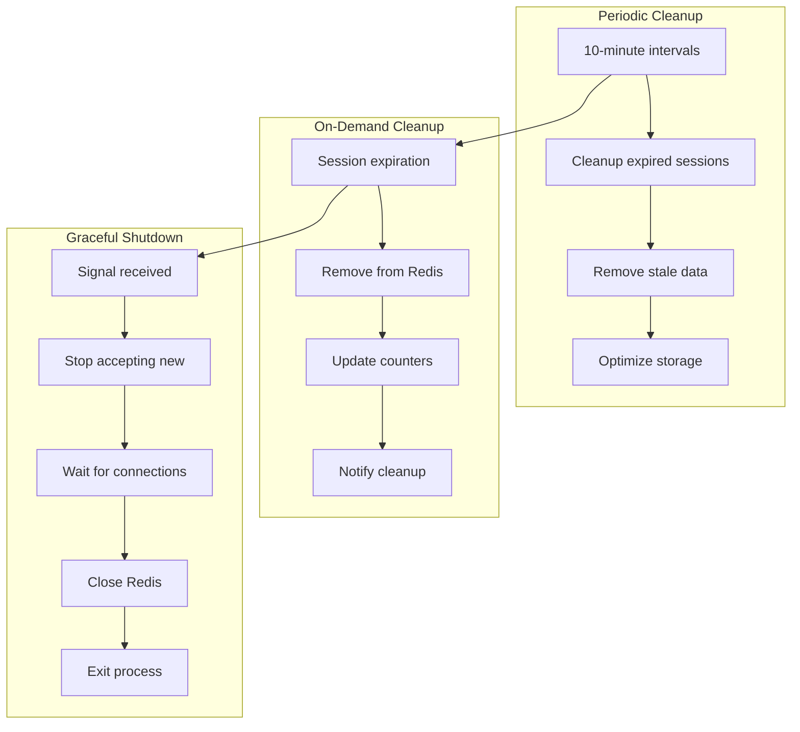
```mermaid
flowchart TD
subgraph "Periodic Cleanup"
PC1[10-minute intervals]
PC1 --> PC2[Cleanup expired sessions]
PC2 --> PC3[Remove stale data]
PC3 --> PC4[Optimize storage]
end
subgraph "On-Demand Cleanup"
DC1[Session expiration]
DC1 --> DC2[Remove from Redis]
DC2 --> DC3[Update counters]
DC3 --> DC4[Notify cleanup]
end
subgraph "Graceful Shutdown"
GS1[Signal received]
GS1 --> GS2[Stop accepting new]
GS2 --> GS3[Wait for connections]
GS3 --> GS4[Close Redis]
GS4 --> GS5[Exit process]
end
PC1 --> DC1
DC1 --> GS1
```

**Diagram sources**
- [redisGuestManager.js](file://backend/src/utils/redisGuestManager.js#L380-L410)
- [server.js](file://backend/src/server.js#L120-L160)

**Section sources**
- [redisGuestManager.js](file://backend/src/utils/redisGuestManager.js#L380-L432)
- [server.js](file://backend/src/server.js#L120-L160)

## Performance and Scalability

The Guest Authentication System is designed for high performance and horizontal scalability:

### Performance Optimizations

| Optimization | Implementation | Benefit |
|--------------|----------------|---------|
| **Connection Pooling** | Redis client pooling | Reduced connection overhead |
| **Async Operations** | Non-blocking I/O | Improved throughput |
| **Caching** | In-memory fallback | Faster failover |
| **Compression** | Gzip compression | Reduced bandwidth |
| **Rate Limiting** | Per-user limits | DDoS protection |

### Scalability Features

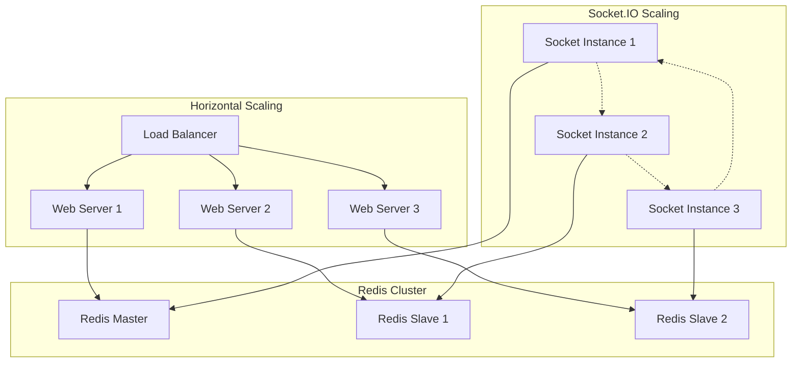
```mermaid
graph TB
subgraph "Horizontal Scaling"
LB[Load Balancer]
WS1[Web Server 1]
WS2[Web Server 2]
WS3[Web Server 3]
end
subgraph "Redis Cluster"
RC1[Redis Master]
RC2[Redis Slave 1]
RC3[Redis Slave 2]
end
subgraph "Socket.IO Scaling"
SI1[Socket Instance 1]
SI2[Socket Instance 2]
SI3[Socket Instance 3]
end
LB --> WS1
LB --> WS2
LB --> WS3
WS1 --> RC1
WS2 --> RC2
WS3 --> RC3
SI1 --> RC1
SI2 --> RC2
SI3 --> RC3
SI1 -.-> SI2
SI2 -.-> SI3
SI3 -.-> SI1
```

**Diagram sources**
- [socketServer.js](file://backend/src/socket/socketServer.js#L15-L40)
- [server.js](file://backend/src/server.js#L180-L200)

### Monitoring and Metrics

The system provides comprehensive monitoring capabilities:

| Metric | Source | Purpose |
|--------|--------|---------|
| **Active Sessions** | Redis counters | Capacity planning |
| **Connection Rate** | Socket.IO stats | Performance monitoring |
| **Error Rates** | Log aggregation | Reliability tracking |
| **Response Times** | Request logging | Performance optimization |
| **Redis Health** | Connection monitoring | Infrastructure reliability |

**Section sources**
- [redisGuestManager.js](file://backend/src/utils/redisGuestManager.js#L350-L380)
- [socketServer.js](file://backend/src/socket/socketServer.js#L150-L199)