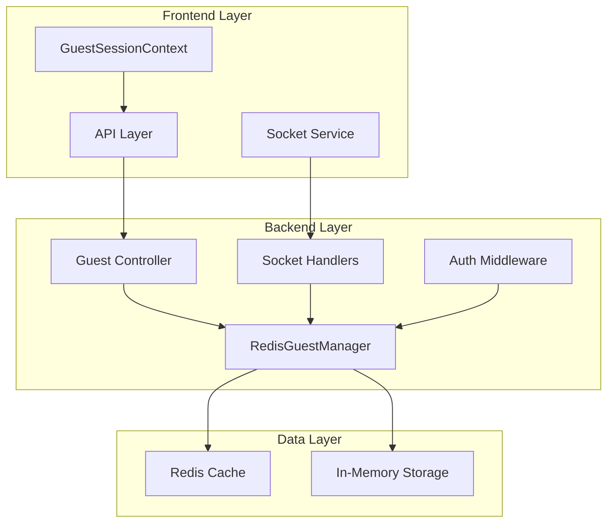
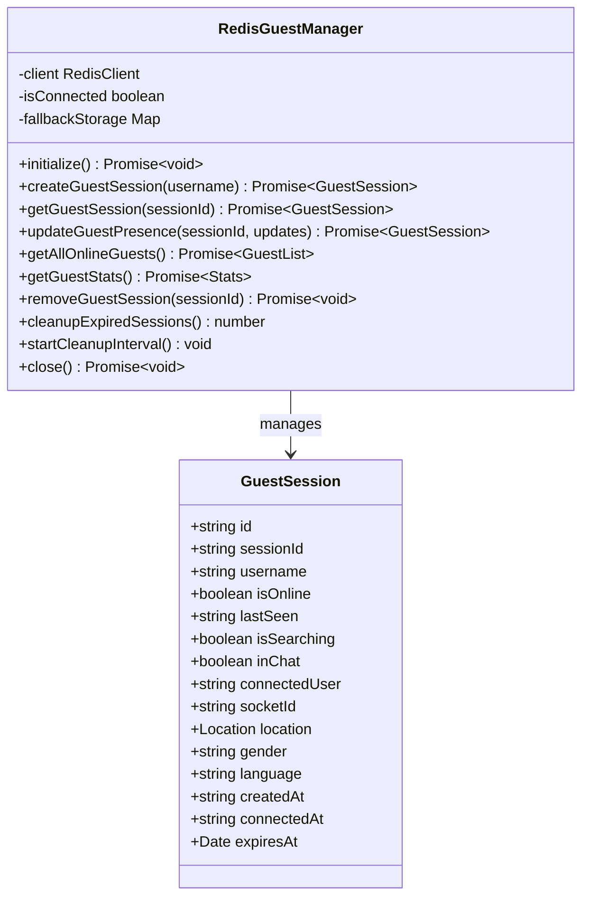
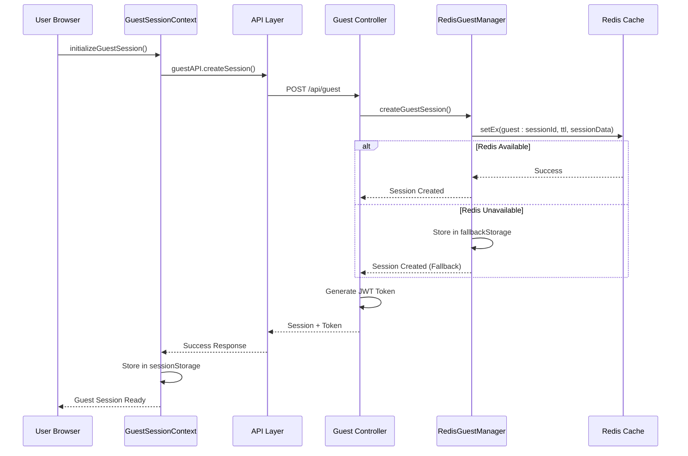
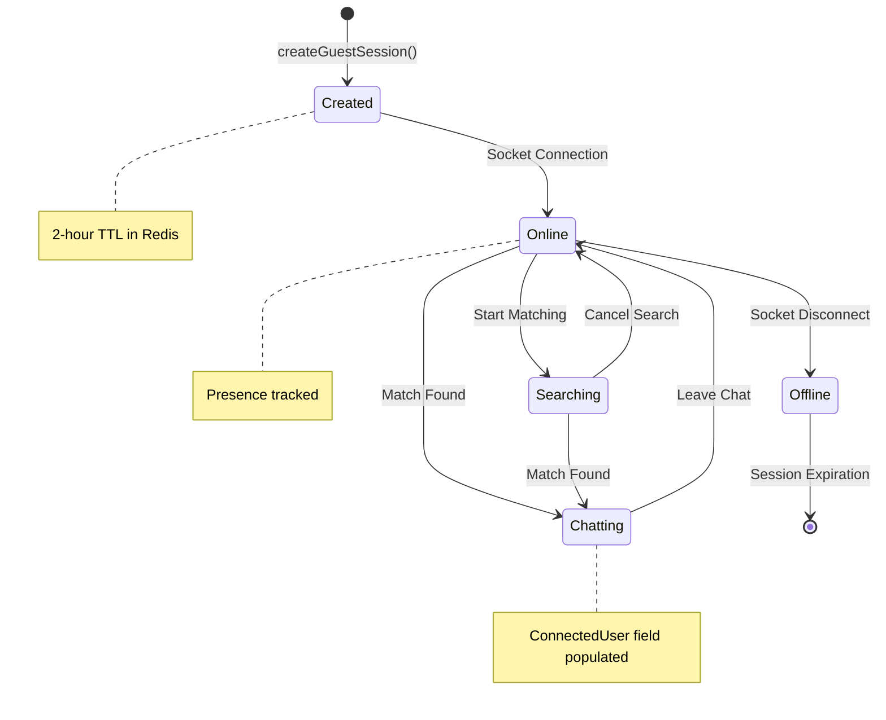

# Guest Session Management

<cite>
**Referenced Files in This Document**
- [redisGuestManager.js](file://backend/src/utils/redisGuestManager.js)
- [guestController.js](file://backend/src/controllers/guestController.js)
- [guest.js](file://backend/src/routes/guest.js)
- [GuestSessionContext.tsx](file://web/contexts/GuestSessionContext.tsx)
- [api.ts](file://web/lib/api.ts)
- [socket.ts](file://web/lib/socket.ts)
- [auth.js](file://backend/src/middleware/auth.js)
- [socketHandlers.js](file://backend/src/socket/socketHandlers.js)
</cite>

## Table of Contents
1. [Introduction](#introduction)
2. [System Architecture](#system-architecture)
3. [RedisGuestManager Implementation](#redisguestmanager-implementation)
4. [Session Creation Flow](#session-creation-flow)
5. [Session Data Structure](#session-data-structure)
6. [Presence Tracking System](#presence-tracking-system)
7. [Fallback Mechanisms](#fallback-mechanisms)
8. [Error Handling and Recovery](#error-handling-and-recovery)
9. [Performance Considerations](#performance-considerations)
10. [Troubleshooting Guide](#troubleshooting-guide)
11. [Best Practices](#best-practices)

## Introduction

The Guest Session Management system provides a robust solution for handling anonymous user sessions in the Realtime Chat Application. This system enables users to participate in chat conversations without requiring traditional authentication while maintaining session persistence, presence tracking, and real-time communication capabilities.

The system is built around the RedisGuestManager class, which serves as the central coordinator for guest session lifecycle management, providing both Redis-based persistence for production environments and in-memory fallback for development and failover scenarios.

## System Architecture

The guest session management system follows a layered architecture with clear separation of concerns:

**Diagram sources**
- [GuestSessionContext.tsx](file://web/contexts/GuestSessionContext.tsx#L1-L50)
- [redisGuestManager.js](file://backend/src/utils/redisGuestManager.js#L1-L30)
- [socketHandlers.js](file://backend/src/socket/socketHandlers.js#L1-L50)

## RedisGuestManager Implementation

The RedisGuestManager class serves as the core component for guest session management, implementing a dual-storage strategy with Redis as the primary storage and in-memory Map as the fallback option.

### Class Structure and Initialization

The RedisGuestManager maintains several key components:

**Diagram sources**
- [redisGuestManager.js](file://backend/src/utils/redisGuestManager.js#L5-L432)

### Connection Management

The RedisGuestManager implements sophisticated connection handling with automatic failover:

**Section sources**
- [redisGuestManager.js](file://backend/src/utils/redisGuestManager.js#L15-L70)

The initialization process includes:
- Redis URL configuration from environment variables
- Automatic retry strategies with exponential backoff
- Connection state monitoring with event listeners
- Graceful degradation to in-memory storage when Redis is unavailable

### Username Generation

The system generates human-readable guest usernames using a combination of adjectives and animal names:

**Section sources**
- [redisGuestManager.js](file://backend/src/utils/redisGuestManager.js#L72-L85)

## Session Creation Flow

The guest session creation process involves multiple steps across both frontend and backend components:

**Diagram sources**
- [GuestSessionContext.tsx](file://web/contexts/GuestSessionContext.tsx#L322-L380)
- [guestController.js](file://backend/src/controllers/guestController.js#L18-L60)
- [redisGuestManager.js](file://backend/src/utils/redisGuestManager.js#L87-L130)

### Frontend Session Creation

The frontend initiates guest sessions through the GuestSessionContext, which handles token management and session persistence:

**Section sources**
- [GuestSessionContext.tsx](file://web/contexts/GuestSessionContext.tsx#L322-L380)

### Backend Session Creation

The backend processes guest session creation with comprehensive validation and JWT token generation:

**Section sources**
- [guestController.js](file://backend/src/controllers/guestController.js#L18-L60)

## Session Data Structure

Guest sessions are structured with comprehensive metadata for real-time communication and analytics:

| Field | Type | Description | Default Value |
|-------|------|-------------|---------------|
| id | string | Unique guest identifier prefixed with 'guest_' | Generated UUID |
| sessionId | string | Session identifier for persistence | Generated UUID |
| username | string | Guest username (auto-generated or user-provided) | Random adjective + noun + number |
| isOnline | boolean | Presence status indicator | false |
| lastSeen | string | ISO timestamp of last activity | Current timestamp |
| isSearching | boolean | Indicates user is looking for matches | false |
| inChat | boolean | Indicates user is currently chatting | false |
| connectedUser | string | ID of connected user (if any) | null |
| socketId | string | Active socket connection ID | null |
| location | object | Geographic location data | null |
| gender | string | User's self-reported gender | null |
| language | string | Preferred language | null |
| createdAt | string | Session creation timestamp | Current timestamp |
| connectedAt | string | First socket connection timestamp | null |

### Session Lifecycle States

**Diagram sources**
- [redisGuestManager.js](file://backend/src/utils/redisGuestManager.js#L87-L110)

## Presence Tracking System

The presence tracking system maintains real-time awareness of guest availability and status:

### Real-time Presence Updates

The system implements continuous presence monitoring through heartbeat mechanisms:

**Section sources**
- [GuestSessionContext.tsx](file://web/contexts/GuestSessionContext.tsx#L250-L283)
- [socket.ts](file://web/lib/socket.ts#L400-L420)

### Analytics and Statistics

The getAllOnlineGuests() and getGuestStats() methods provide comprehensive analytics:

**Section sources**
- [redisGuestManager.js](file://backend/src/utils/redisGuestManager.js#L204-L280)

## Fallback Mechanisms

The system implements robust fallback mechanisms to ensure reliability:

### Redis Failure Handling

When Redis becomes unavailable, the system seamlessly transitions to in-memory storage:

**Section sources**
- [redisGuestManager.js](file://backend/src/utils/redisGuestManager.js#L15-L70)

### In-Memory Storage Features

The fallback storage maintains session data in memory with automatic cleanup:

**Section sources**
- [redisGuestManager.js](file://backend/src/utils/redisGuestManager.js#L370-L390)

## Error Handling and Recovery

The system implements comprehensive error handling and automatic recovery mechanisms:

### Token Expiration Handling

The frontend implements automatic token regeneration when JWT tokens expire:

**Section sources**
- [GuestSessionContext.tsx](file://web/contexts/GuestSessionContext.tsx#L50-L80)
- [api.ts](file://web/lib/api.ts#L30-L70)

### Socket Connection Recovery

The socket service implements automatic reconnection with token regeneration:

**Section sources**
- [socket.ts](file://web/lib/socket.ts#L400-L472)

### Session Cleanup and Maintenance

The system includes automated cleanup mechanisms:

**Section sources**
- [redisGuestManager.js](file://backend/src/utils/redisGuestManager.js#L370-L390)

## Performance Considerations

### Scaling with Redis vs In-Memory

The system is designed to scale efficiently with different storage backends:

| Aspect | Redis Storage | In-Memory Storage |
|--------|---------------|-------------------|
| Persistence | Persistent across restarts | Lost on server restart |
| Scalability | Horizontal scaling with Redis cluster | Single-instance limitation |
| Memory Usage | Optimized memory management | Unlimited growth potential |
| Performance | Network latency overhead | Local memory access |
| TTL Management | Built-in expiration | Manual cleanup intervals |
| Backup | Redis persistence features | No built-in backup |

### Optimization Strategies

**Section sources**
- [redisGuestManager.js](file://backend/src/utils/redisGuestManager.js#L390-L410)

### Monitoring and Metrics

The system provides comprehensive monitoring capabilities:

**Section sources**
- [redisGuestManager.js](file://backend/src/utils/redisGuestManager.js#L320-L370)

## Troubleshooting Guide

### Common Issues and Solutions

#### Session Creation Failures

**Problem**: Guest session creation fails with Redis connection errors
**Solution**: Check Redis connectivity and verify REDIS_URL environment variable

**Section sources**
- [redisGuestManager.js](file://backend/src/utils/redisGuestManager.js#L15-L70)

#### Token Expiration Issues

**Problem**: Users receive "Token has expired" errors
**Solution**: Implement automatic token regeneration as shown in the token handling examples

**Section sources**
- [GuestSessionContext.tsx](file://web/contexts/GuestSessionContext.tsx#L50-L80)

#### Socket Connection Problems

**Problem**: Socket connections fail to establish
**Solution**: Verify JWT token validity and check network connectivity

**Section sources**
- [socket.ts](file://web/lib/socket.ts#L20-L60)

### Debugging Tools

The system includes comprehensive logging for troubleshooting:

**Section sources**
- [redisGuestManager.js](file://backend/src/utils/redisGuestManager.js#L15-L70)

## Best Practices

### Session Management Guidelines

1. **Always validate tokens on startup** - Check JWT expiration before establishing connections
2. **Implement graceful degradation** - Ensure fallback mechanisms work correctly
3. **Monitor session cleanup** - Regular cleanup prevents memory leaks
4. **Use appropriate TTL values** - Balance session persistence with resource management
5. **Handle concurrent connections** - Implement proper connection mapping and cleanup

### Security Considerations

1. **Token expiration** - Use short-lived tokens with automatic renewal
2. **Rate limiting** - Implement limits on session creation attempts
3. **Input validation** - Validate all user-provided session data
4. **Secure storage** - Use secure session storage mechanisms

### Performance Optimization

1. **Redis configuration** - Optimize Redis settings for high throughput
2. **Connection pooling** - Use connection pools for Redis operations
3. **Monitoring** - Implement comprehensive monitoring and alerting
4. **Resource cleanup** - Regular cleanup of expired sessions and connections

The Guest Session Management system provides a robust foundation for anonymous user participation in the Realtime Chat Application, combining reliability, scalability, and real-time capabilities through its sophisticated dual-storage architecture and comprehensive error handling mechanisms.