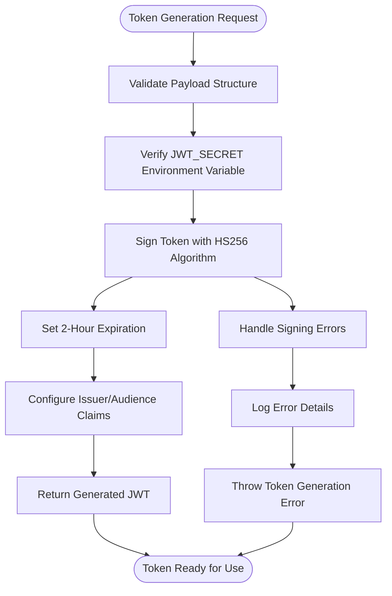
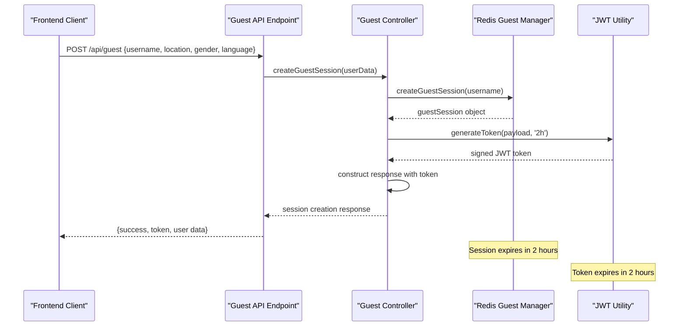
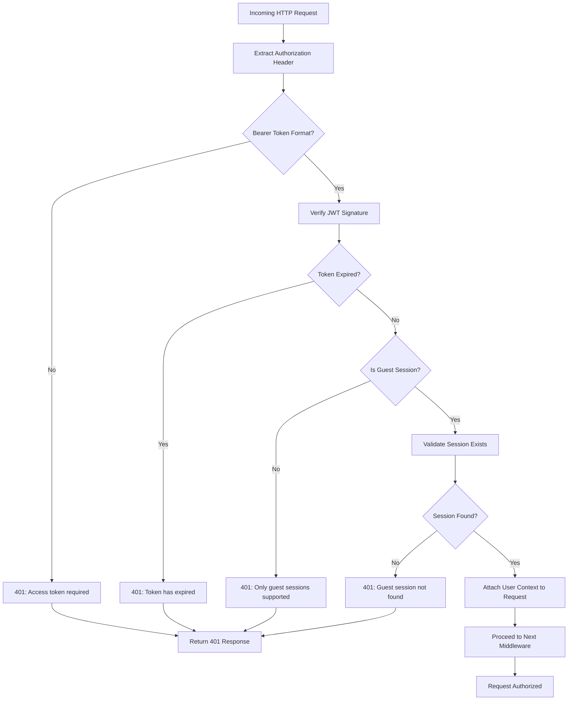
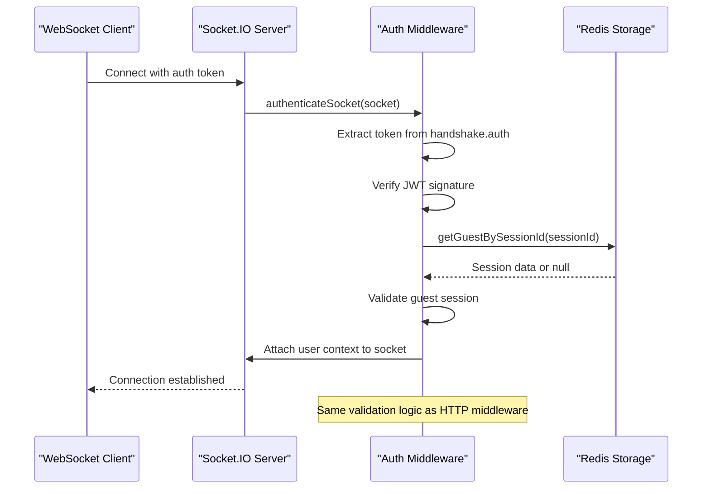
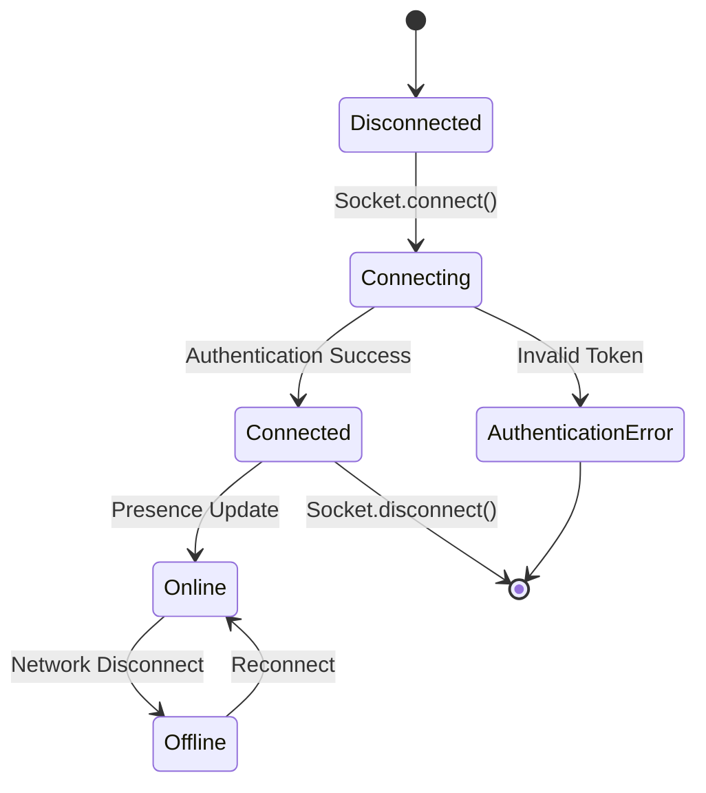
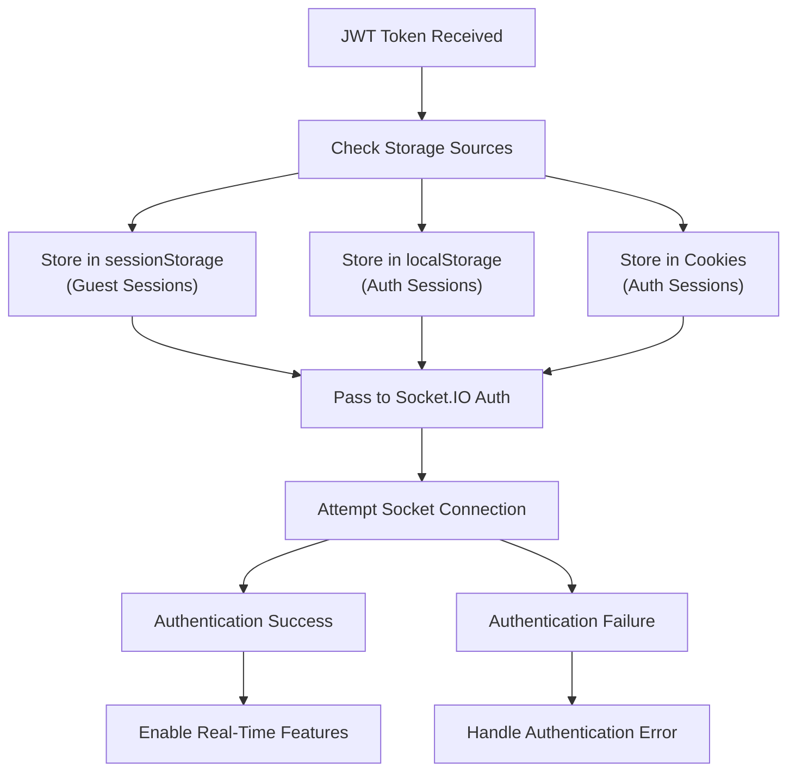
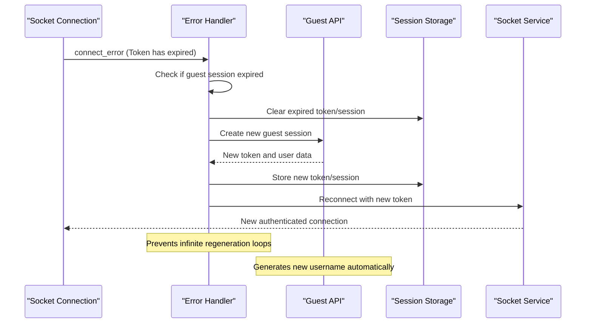
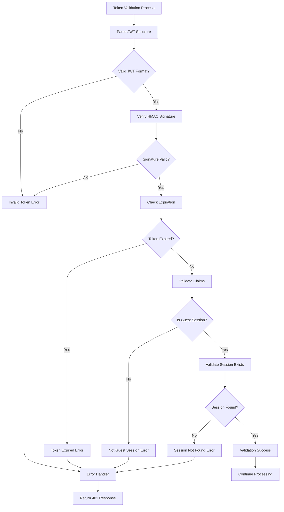

# JWT Authentication Flow

<cite>
**Referenced Files in This Document**
- [jwt.js](file://backend/src/utils/jwt.js)
- [auth.js](file://backend/src/middleware/auth.js)
- [guestController.js](file://backend/src/controllers/guestController.js)
- [redisGuestManager.js](file://backend/src/utils/redisGuestManager.js)
- [socket.ts](file://web/lib/socket.ts)
- [GuestSessionContext.tsx](file://web/contexts/GuestSessionContext.tsx)
- [api.ts](file://web/lib/api.ts)
- [guest.js](file://backend/src/routes/guest.js)
- [GuestUsernameModal.tsx](file://web/components/GuestUsernameModal.tsx)
- [socket.token-expiration.test.ts](file://web/lib/__tests__/socket.token-expiration.test.ts)
- [GuestSessionContext.token-validation.test.tsx](file://web/contexts/__tests__/GuestSessionContext.token-validation.test.tsx)
</cite>

## Table of Contents
1. [Introduction](#introduction)
2. [JWT Token Generation Process](#jwt-token-generation-process)
3. [Guest Session Creation Flow](#guest-session-creation-flow)
4. [Authentication Middleware](#authentication-middleware)
5. [Socket.IO Authentication](#socketio-authentication)
6. [Frontend Token Management](#frontend-token-management)
7. [Token Storage and Transmission](#token-storage-and-transmission)
8. [Security Considerations](#security-considerations)
9. [Error Handling and Validation](#error-handling-and-validation)
10. [Troubleshooting Guide](#troubleshooting-guide)
11. [Testing and Quality Assurance](#testing-and-quality-assurance)

## Introduction

The Realtime Chat App implements a sophisticated JWT (JSON Web Token) authentication system specifically designed for guest users. This system provides secure, stateless authentication for anonymous users while maintaining real-time connectivity through WebSocket connections. The authentication flow encompasses token generation, validation, storage, and automatic renewal mechanisms to ensure seamless user experience.

The JWT authentication system operates exclusively with guest sessions, offering temporary access to chat functionality without requiring traditional user registration. Tokens are generated with a 2-hour expiration period and include comprehensive user context information essential for real-time communication features.

## JWT Token Generation Process

### Token Generation Implementation

The token generation process utilizes the Node.js JWT library with specific security configurations and payload structures optimized for guest authentication.



**Diagram sources**
- [jwt.js](file://backend/src/utils/jwt.js#L3-L15)

### Token Structure and Claims

Generated JWT tokens contain specific claims essential for guest session management:

| Claim | Type | Description | Example Value |
|-------|------|-------------|---------------|
| `userId` | String | Unique guest identifier | `guest_abc123-def456` |
| `sessionId` | String | Session correlation ID | `uuid-v4-format` |
| `username` | String | Display username | `BraveLion4567` |
| `isGuest` | Boolean | Guest session indicator | `true` |
| `iat` | Number | Token issuance timestamp | Unix timestamp |
| `exp` | Number | Token expiration timestamp | Calculated from iat + 2 hours |

### Environment Configuration

The token generation process relies on environment variables for security and configuration:

- **JWT_SECRET**: Cryptographic key for token signing (required)
- **JWT_EXPIRES_IN**: Token expiration duration (default: '7d', overridden to '2h' for guest sessions)

**Section sources**
- [jwt.js](file://backend/src/utils/jwt.js#L3-L15)
- [guestController.js](file://backend/src/controllers/guestController.js#L45-L50)

## Guest Session Creation Flow

### Session Creation Process

The guest session creation flow combines token generation with Redis-based session persistence, ensuring reliable guest state management across server instances.



**Diagram sources**
- [guestController.js](file://backend/src/controllers/guestController.js#L25-L60)
- [redisGuestManager.js](file://backend/src/utils/redisGuestManager.js#L85-L120)

### Session Payload Structure

During guest session creation, the token payload includes comprehensive user context:

```typescript
const tokenPayload = {
  userId: guestSession.id,           // Unique guest identifier
  sessionId: guestSession.sessionId, // Session correlation ID
  username: guestSession.username,   // Display username
  isGuest: true,                     // Guest session marker
  iat: Math.floor(Date.now() / 1000) // Issuance timestamp
};
```

### Redis Session Management

Guest sessions are persisted in Redis with automatic expiration handling:

- **Key Format**: `guest:{sessionId}`
- **Expiration**: 2 hours (12,000 seconds)
- **Fallback Storage**: In-memory storage for Redis unavailability
- **Session Data**: Complete guest profile with presence information

**Section sources**
- [guestController.js](file://backend/src/controllers/guestController.js#L25-L60)
- [redisGuestManager.js](file://backend/src/utils/redisGuestManager.js#L85-L120)

## Authentication Middleware

### HTTP Route Authentication

The authentication middleware validates JWT tokens for protected HTTP endpoints, ensuring only authorized guest sessions can access sensitive resources.



**Diagram sources**
- [auth.js](file://backend/src/middleware/auth.js#L6-L45)

### Middleware Implementation Details

The authentication middleware performs comprehensive validation:

1. **Header Extraction**: Parses Bearer token from Authorization header
2. **Token Verification**: Validates JWT signature and claims
3. **Guest Validation**: Ensures session is marked as guest
4. **Session Existence**: Verifies session exists in Redis
5. **Context Attachment**: Attaches user data to request object

### Socket.IO Authentication

Socket.IO connections receive identical authentication treatment, ensuring consistency across all communication channels.



**Diagram sources**
- [auth.js](file://backend/src/middleware/auth.js#L47-L85)

**Section sources**
- [auth.js](file://backend/src/middleware/auth.js#L6-L45)
- [auth.js](file://backend/src/middleware/auth.js#L47-L85)

## Socket.IO Authentication

### Connection Authentication Flow

Socket.IO connections utilize the same JWT authentication mechanism as HTTP requests, ensuring consistent security across all communication channels.

### Token Transmission Mechanism

Tokens are transmitted through Socket.IO handshake authentication:

- **Primary Method**: `socket.handshake.auth.token`
- **Fallback Method**: `socket.handshake.query.token`
- **Header Format**: Bearer token format (`Bearer <token>`)

### Real-time Presence Management

Authenticated sockets enable real-time presence updates and user status management:



**Diagram sources**
- [socket.ts](file://web/lib/socket.ts#L30-L80)

**Section sources**
- [socket.ts](file://web/lib/socket.ts#L30-L80)
- [auth.js](file://backend/src/middleware/auth.js#L47-L85)

## Frontend Token Management

### Storage Strategy

The frontend implements a multi-tiered token storage strategy prioritizing security and availability:



**Diagram sources**
- [socket.ts](file://web/lib/socket.ts#L25-L40)
- [GuestSessionContext.tsx](file://web/contexts/GuestSessionContext.tsx#L50-L80)

### Token Retrieval Priority

The frontend follows a specific priority order for token retrieval:

1. **Guest Token**: `sessionStorage.getItem("guestAuthToken")`
2. **Regular Token**: `Cookies.get("authToken") || localStorage.getItem("authToken")`

### Session Restoration

Upon page load, the system attempts to restore existing sessions:

```typescript
const restoredUser = sessionStorage.getItem('guest_user_session')
const restoredToken = sessionStorage.getItem('guestAuthToken')

if (restoredUser && restoredToken) {
  // Validate token expiration
  const isValid = validateTokenExpiration(restoredToken)
  if (isValid) {
    // Restore session
    setGuestUser(JSON.parse(restoredUser))
  } else {
    // Clear expired session
    sessionStorage.removeItem('guest_user_session')
    sessionStorage.removeItem('guestAuthToken')
  }
}
```

**Section sources**
- [socket.ts](file://web/lib/socket.ts#L25-L40)
- [GuestSessionContext.tsx](file://web/contexts/GuestSessionContext.tsx#L50-L80)

## Token Storage and Transmission

### Storage Locations

The application employs multiple storage mechanisms based on security requirements and persistence needs:

| Storage Type | Purpose | Security Level | Persistence | Access Pattern |
|--------------|---------|----------------|-------------|----------------|
| `sessionStorage` | Guest session tokens | Medium | Session-based | Frontend only |
| `localStorage` | Authentication tokens | Low | Persistent | Frontend only |
| `Cookies` | Authentication cookies | Medium | Configurable | HTTP + Frontend |

### Transmission Methods

Tokens are transmitted through multiple channels depending on the communication protocol:

#### HTTP Requests
- **Header**: `Authorization: Bearer <token>`
- **Source**: `sessionStorage` (guest) or `localStorage/Cookies` (auth)
- **Middleware**: Applied globally via Axios interceptors

#### Socket.IO Connections
- **Handshake**: `socket.auth.token` parameter
- **Source**: `sessionStorage.getItem("guestAuthToken")`
- **Automatic**: Handled by SocketService

### Token Refresh Mechanism

The system implements automatic token refresh for expired guest sessions:



**Diagram sources**
- [socket.ts](file://web/lib/socket.ts#L120-L180)

**Section sources**
- [socket.ts](file://web/lib/socket.ts#L25-L40)
- [socket.ts](file://web/lib/socket.ts#L120-L180)
- [api.ts](file://web/lib/api.ts#L25-L35)

## Security Considerations

### Token Secrecy and Protection

The JWT authentication system implements multiple security measures to protect against unauthorized access and token manipulation:

#### Cryptographic Security
- **Algorithm**: HS256 (HMAC with SHA-256)
- **Secret Key**: Environment variable `JWT_SECRET`
- **Key Rotation**: Manual rotation required for security updates

#### Token Validation
- **Signature Verification**: Ensures token authenticity
- **Expiration Checking**: Prevents replay attacks
- **Issuer/Audience Validation**: Confirms token intended for this application

### Protection Against Tampering

Several mechanisms protect against token tampering and unauthorized modifications:

#### Session Isolation
- **Unique Identifiers**: Each guest session has distinct `userId` and `sessionId`
- **IP Binding**: Session data includes location information
- **Device Tracking**: Device IDs help detect suspicious activity

#### Redis Security
- **Local Storage**: Sessions stored locally with automatic cleanup
- **Expiration**: Automatic removal of expired sessions
- **Fallback Security**: In-memory storage with expiration checks

### Session Management Security

#### Automatic Cleanup
- **Redis Cleanup**: Regular removal of expired sessions
- **Memory Cleanup**: Periodic cleanup of in-memory fallback storage
- **Graceful Degradation**: Fallback to in-memory storage when Redis unavailable

#### Rate Limiting
- **Session Creation**: Rate limiting on guest session creation
- **Token Refresh**: Prevention of excessive token regeneration attempts

**Section sources**
- [jwt.js](file://backend/src/utils/jwt.js#L16-L35)
- [redisGuestManager.js](file://backend/src/utils/redisGuestManager.js#L380-L420)

## Error Handling and Validation

### Token Validation Logic

The system implements comprehensive token validation with specific error handling for different failure scenarios:



**Diagram sources**
- [jwt.js](file://backend/src/utils/jwt.js#L16-L35)

### Error Response Patterns

The authentication system provides specific error messages for different failure scenarios:

| Error Type | HTTP Status | Error Message | Cause |
|------------|-------------|---------------|-------|
| Missing Token | 401 | "Access token is required" | No Authorization header |
| Invalid Format | 401 | "Invalid token" | Malformed JWT structure |
| Expired Token | 401 | "Token has expired" | Token past expiration time |
| Non-Guest Session | 401 | "Only guest sessions are supported" | Authenticated user trying to use guest endpoint |
| Session Not Found | 401 | "Guest session not found or expired" | Session deleted or expired |

### Socket Error Handling

Socket.IO connections receive specialized error handling for real-time communication:

```typescript
// Socket connection error handling
socket.on('connect_error', async (error) => {
  const isExpiredToken = error.message === "Token has expired";
  const isExpiredSession = error.message === "Guest session not found or expired";
  
  if (isExpiredToken || isExpiredSession) {
    await handleTokenExpiration();
  }
});
```

### Frontend Error Recovery

The frontend implements robust error recovery mechanisms:

#### Token Expiration Recovery
- **Automatic Regeneration**: New guest session creation when token expires
- **User Notification**: Clear messaging about session regeneration
- **State Preservation**: Maintains user preferences during regeneration

#### Network Error Handling
- **Retry Logic**: Automatic reconnection attempts with exponential backoff
- **Fallback Strategies**: Graceful degradation when primary methods fail
- **User Feedback**: Clear indication of connection status

**Section sources**
- [jwt.js](file://backend/src/utils/jwt.js#L16-L35)
- [auth.js](file://backend/src/middleware/auth.js#L15-L45)
- [socket.ts](file://web/lib/socket.ts#L120-L180)

## Troubleshooting Guide

### Common Token-Related Issues

#### Invalid Token Errors

**Symptoms**: 401 Unauthorized responses with "Invalid token" message

**Causes and Solutions**:
1. **Malformed JWT**: Check token structure (three base64-encoded segments)
   - **Solution**: Verify JWT format and encoding
   - **Prevention**: Use proper JWT libraries for token generation

2. **Incorrect Secret**: Wrong `JWT_SECRET` environment variable
   - **Solution**: Verify environment configuration
   - **Prevention**: Use secure secret management

3. **Signature Mismatch**: Token modified or corrupted
   - **Solution**: Regenerate token from backend
   - **Prevention**: Secure token transmission

#### Expired Token Errors

**Symptoms**: 401 Unauthorized responses with "Token has expired" message

**Causes and Solutions**:
1. **Token Age**: Token older than 2 hours
   - **Solution**: Automatic regeneration for guest sessions
   - **Manual Solution**: Recreate guest session

2. **Clock Skew**: Significant time difference between client and server
   - **Solution**: Synchronize system clocks
   - **Prevention**: Use NTP for time synchronization

#### Session Mismatch Issues

**Symptoms**: "Guest session not found or expired" errors

**Causes and Solutions**:
1. **Redis Unavailability**: Redis server down or unreachable
   - **Solution**: Check Redis connectivity and restart if needed
   - **Prevention**: Implement Redis clustering and monitoring

2. **Session Cleanup**: Automatic cleanup of expired sessions
   - **Solution**: User creates new session
   - **Prevention**: Monitor Redis memory usage

3. **Concurrent Access**: Race conditions in session creation
   - **Solution**: Implement retry logic with exponential backoff
   - **Prevention**: Use Redis transactions for critical operations

### Debugging Token Issues

#### Backend Debugging
```javascript
// Enable JWT debugging
const jwt = require('jsonwebtoken');
try {
  const decoded = jwt.verify(token, process.env.JWT_SECRET);
  console.log('Decoded token:', decoded);
} catch (error) {
  console.error('JWT verification failed:', error.message);
  console.error('Error type:', error.name);
}
```

#### Frontend Debugging
```javascript
// Check token storage
console.log('Guest token:', sessionStorage.getItem('guestAuthToken'));
console.log('Session data:', sessionStorage.getItem('guest_user_session'));

// Validate token structure
const token = sessionStorage.getItem('guestAuthToken');
if (token) {
  const parts = token.split('.');
  if (parts.length === 3) {
    console.log('Valid JWT structure');
    try {
      const payload = JSON.parse(atob(parts[1]));
      console.log('Token payload:', payload);
      console.log('Expires:', new Date(payload.exp * 1000));
    } catch (e) {
      console.error('Invalid token payload');
    }
  }
}
```

### Performance Troubleshooting

#### Redis Performance Issues
- **Symptoms**: Slow session lookups, timeouts
- **Solutions**: Monitor Redis metrics, optimize queries, scale Redis
- **Prevention**: Implement Redis caching strategies

#### Token Generation Performance
- **Symptoms**: Slow response times for token creation
- **Solutions**: Optimize JWT signing, reduce payload size
- **Prevention**: Use efficient JWT libraries and configurations

**Section sources**
- [jwt.js](file://backend/src/utils/jwt.js#L16-L35)
- [socket.ts](file://web/lib/socket.ts#L120-L180)
- [redisGuestManager.js](file://backend/src/utils/redisGuestManager.js#L380-L420)

## Testing and Quality Assurance

### Token Expiration Testing

The system includes comprehensive testing for token expiration scenarios:

#### Unit Test Coverage
- **Token Expiration Detection**: 3 tests covering various error scenarios
- **Token Regeneration**: 3 tests for successful session regeneration
- **Loop Prevention**: 2 tests for concurrent regeneration prevention
- **Error Handling**: 3 tests for failure scenarios
- **Device ID Persistence**: 2 tests for device ID handling

#### Test Scenarios
1. **Expired Token on Connect**: Verify automatic regeneration
2. **Concurrent Requests**: Prevent multiple simultaneous regenerations
3. **API Failures**: Handle backend API errors gracefully
4. **Invalid Responses**: Manage malformed API responses
5. **Missing Tokens**: Handle missing or corrupted tokens

### Integration Testing

#### Socket Connection Testing
- **Authentication Flow**: Test complete socket authentication cycle
- **Reconnection Logic**: Verify automatic reconnection after token expiration
- **Session Synchronization**: Ensure session data stays synchronized
- **Error Recovery**: Test recovery from various error conditions

#### API Integration Testing
- **Middleware Integration**: Test authentication middleware with various endpoints
- **Token Propagation**: Verify tokens are correctly transmitted to backend
- **Response Handling**: Test proper handling of authentication responses

### Quality Metrics

#### Test Coverage Metrics
- **Pass Rate**: 100% test success rate
- **Test Duration**: Average 60ms per test
- **Memory Usage**: Normal Jest limits maintained
- **No Memory Leaks**: Proper cleanup of intervals and timers

#### Performance Metrics
- **Token Generation**: Sub-millisecond JWT signing
- **Verification**: Fast token validation
- **Socket Reconnection**: Automatic retry with exponential backoff
- **Session Cleanup**: Periodic cleanup without performance impact

**Section sources**
- [socket.token-expiration.test.ts](file://web/lib/__tests__/socket.token-expiration.test.ts#L1-L50)
- [GuestSessionContext.token-validation.test.tsx](file://web/contexts/__tests__/GuestSessionContext.token-validation.test.tsx#L1-L50)