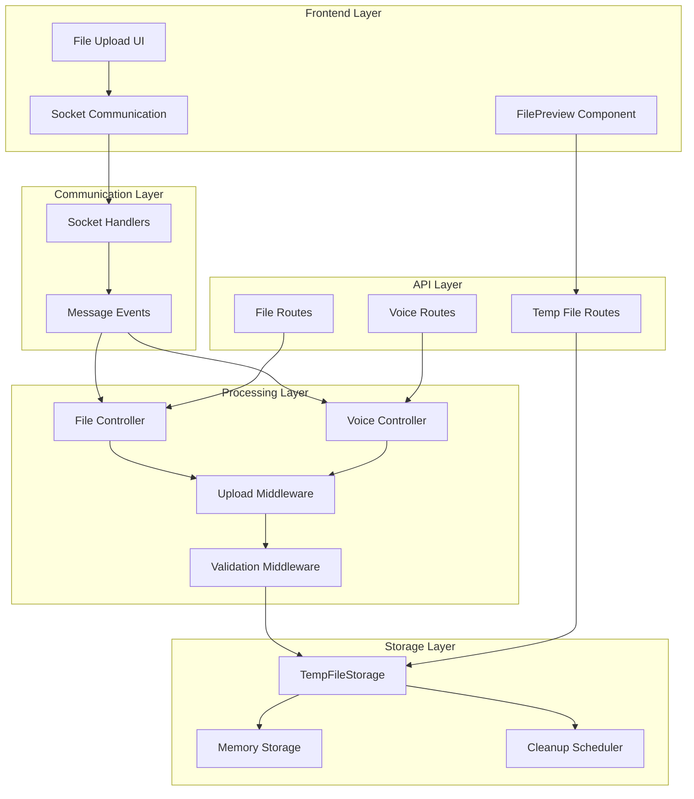
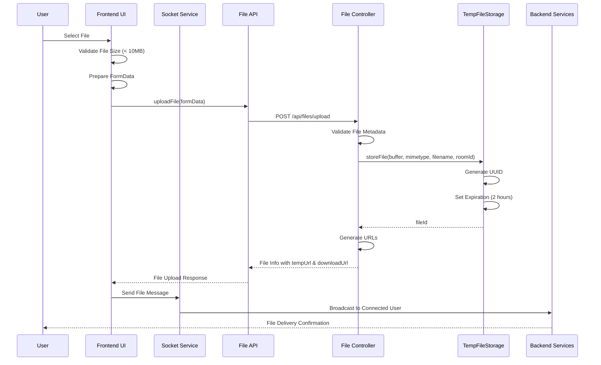
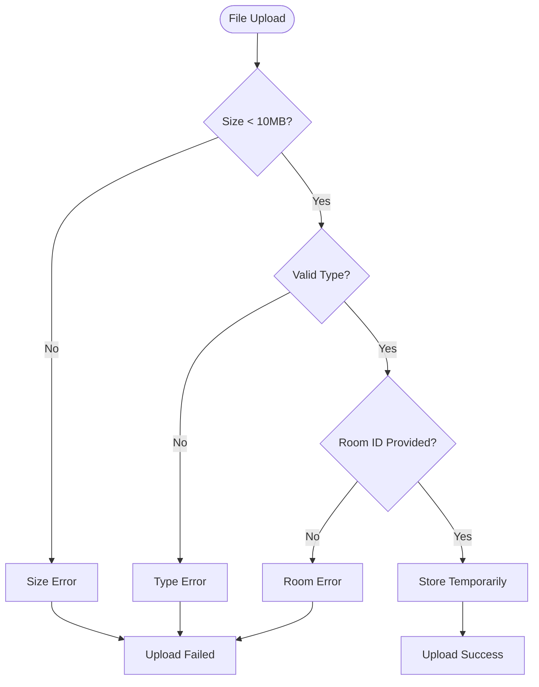
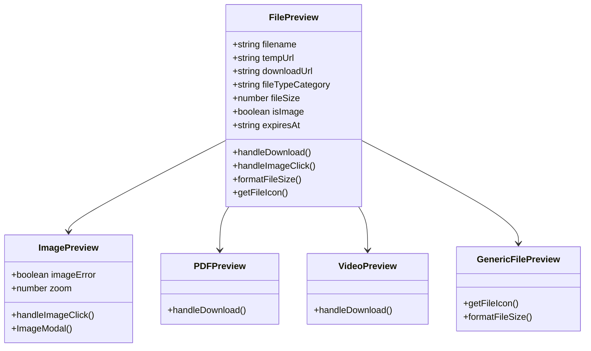
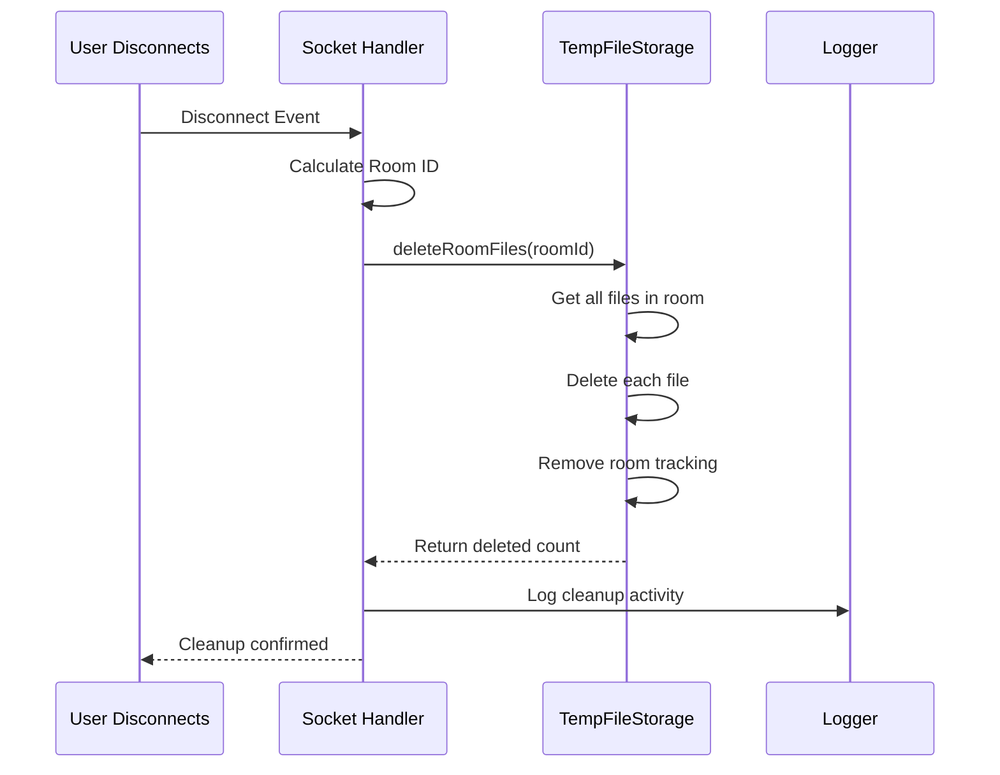

# File Sharing Mechanism

<cite>
**Referenced Files in This Document**
- [tempFileStorage.js](file://backend/src/utils/tempFileStorage.js)
- [FilePreview.tsx](file://web/components/FilePreview.tsx)
- [fileController.js](file://backend/src/controllers/fileController.js)
- [upload.js](file://backend/src/middleware/upload.js)
- [validation.js](file://backend/src/middleware/validation.js)
- [socketHandlers.js](file://backend/src/socket/socketHandlers.js)
- [page.tsx](file://web/app/chat/page.tsx)
- [tempFileRoutes.js](file://backend/src/routes/tempFileRoutes.js)
- [fileRoutes.js](file://backend/src/routes/fileRoutes.js)
- [api.ts](file://web/lib/api.ts)
- [socket.ts](file://web/lib/socket.ts)
</cite>

## Table of Contents
1. [Introduction](#introduction)
2. [System Architecture](#system-architecture)
3. [File Upload Workflow](#file-upload-workflow)
4. [Temporary Storage Implementation](#temporary-storage-implementation)
5. [Message Structure and Validation](#message-structure-and-validation)
6. [Security Considerations](#security-considerations)
7. [Frontend File Preview Component](#frontend-file-preview-component)
8. [Cleanup and Expiration](#cleanup-and-expiration)
9. [Error Handling and Troubleshooting](#error-handling-and-troubleshooting)
10. [Performance Optimization](#performance-optimization)

## Introduction

The File Sharing Mechanism in this real-time chat application provides a secure, efficient way to transfer files between users through temporary storage with automatic expiration. The system handles various file types including images, videos, audio files, and documents, while maintaining strict security controls and optimal performance.

The mechanism operates on a temporary file storage model where files are stored in memory with configurable expiration times, ensuring that sensitive data doesn't persist indefinitely. The system supports both direct file uploads and voice note recordings, with comprehensive validation and error handling throughout the process.

## System Architecture

The file sharing system consists of several interconnected components working together to provide seamless file transfer capabilities:



**Diagram sources**
- [socketHandlers.js](file://backend/src/socket/socketHandlers.js#L276-L319)
- [fileController.js](file://backend/src/controllers/fileController.js#L1-L141)
- [tempFileStorage.js](file://backend/src/utils/tempFileStorage.js#L1-L237)

## File Upload Workflow

The file upload process follows a structured workflow from initial selection to final delivery:



**Diagram sources**
- [page.tsx](file://web/app/chat/page.tsx#L729-L775)
- [fileController.js](file://backend/src/controllers/fileController.js#L1-L141)
- [tempFileStorage.js](file://backend/src/utils/tempFileStorage.js#L18-L46)

**Section sources**
- [page.tsx](file://web/app/chat/page.tsx#L729-L775)
- [fileController.js](file://backend/src/controllers/fileController.js#L1-L141)
- [upload.js](file://backend/src/middleware/upload.js#L96-L139)

## Temporary Storage Implementation

The temporary file storage system uses an in-memory Map structure with sophisticated room-based organization and automatic cleanup mechanisms:

### Core Storage Architecture

The [`TempFileStorage`](file://backend/src/utils/tempFileStorage.js#L6-L10) class manages file storage through two primary data structures:

- **tempFiles Map**: Stores file data indexed by unique file IDs
- **roomFiles Map**: Tracks files organized by chat rooms for efficient cleanup

### File Storage Process

When a file is uploaded, the system performs the following steps:

1. **UUID Generation**: Creates a unique identifier using UUID v4
2. **Expiration Calculation**: Sets file expiration (default: 2 hours)
3. **Data Structure Creation**: Builds file metadata object
4. **Room Association**: Links file to its originating chat room
5. **Storage Registration**: Adds file to both main and room tracking maps

### Automatic Cleanup Mechanism

The system implements a robust cleanup mechanism:

- **Scheduled Cleanup**: Runs every 5 minutes via setInterval
- **Expiration Checking**: Validates file timestamps against current time
- **Room-Based Cleanup**: Removes all files associated with disconnected rooms
- **Memory Management**: Ensures efficient memory usage through automated deletion

**Section sources**
- [tempFileStorage.js](file://backend/src/utils/tempFileStorage.js#L1-L237)

## Message Structure and Validation

The file sharing system uses a standardized message structure with comprehensive validation:

### File Message Format

File messages follow this structure when transmitted through WebSocket:

```typescript
interface FileMessage {
  type: 'file';
  content: {
    filename: string;
    fileType: string;
    fileSize: number;
    tempUrl: string;
    downloadUrl: string;
    isImage?: boolean;
    fileTypeCategory?: string;
    expiresAt?: string;
  };
  timestamp: string;
}
```

### Validation Rules

The system enforces strict validation rules:

| Field | Type | Validation Rules |
|-------|------|------------------|
| filename | string | Min 1, Max 255 characters |
| fileType | string | Must be one of: image, video, audio, document |
| fileSize | number | 1 byte to 10MB (10485760 bytes) |
| tempUrl | string | Generated temporary URL |
| downloadUrl | string | Permanent download URL |

### Security Validation

The [`validateMessage.file`](file://backend/src/middleware/validation.js#L75-L82) function ensures message integrity:

```javascript
validateMessage.file = (fileData) => {
  return fileData && 
         typeof fileData.filename === 'string' &&
         typeof fileData.fileType === 'string' &&
         typeof fileData.fileSize === 'number' &&
         fileData.fileSize <= 10485760; // 10MB
};
```

**Section sources**
- [validation.js](file://backend/src/middleware/validation.js#L50-L110)
- [socketHandlers.js](file://backend/src/socket/socketHandlers.js#L290-L300)

## Security Considerations

The file sharing system implements multiple layers of security to protect against malicious uploads and ensure safe file handling:

### File Type Restrictions

The [`fileFilter`](file://backend/src/middleware/upload.js#L15-L66) middleware restricts uploads to approved MIME types:

**Allowed File Types:**
- **Images**: JPEG, PNG, GIF, WebP, SVG, BMP
- **Videos**: MP4, WebM, OGG, AVI, MOV, WMV  
- **Audio**: MP3, WAV, OGG, WebM, M4A, AAC
- **Documents**: PDF, TXT, CSV, JSON, XML
- **Office Files**: DOC, DOCX, XLS, XLSX, PPT, PPTX
- **Archives**: ZIP, RAR, TAR, GZIP

### Size Limitations

Multiple size limits protect system resources:

| Protection Level | Limit | Purpose |
|------------------|-------|---------|
| Client-side | 10MB | Prevent large uploads |
| Middleware | 25MB | Multer default limit |
| Controller | 10MB | Application constraint |
| Memory | Configurable | System resource protection |

### Upload Validation Pipeline



**Diagram sources**
- [upload.js](file://backend/src/middleware/upload.js#L96-L139)
- [fileController.js](file://backend/src/controllers/fileController.js#L20-L40)

### Temporary Access Control

Files are accessible only through generated URLs with embedded security:

- **Temporary URLs**: Direct inline access for immediate viewing
- **Download URLs**: Permanent access for saving files
- **Expiration**: Automatic removal after configured time
- **Room Isolation**: Files accessible only within their originating room

**Section sources**
- [upload.js](file://backend/src/middleware/upload.js#L15-L94)
- [fileController.js](file://backend/src/controllers/fileController.js#L20-L40)

## Frontend File Preview Component

The [`FilePreview`](file://web/components/FilePreview.tsx) component provides rich file display capabilities with responsive design and interactive features:

### Component Architecture

The FilePreview component adapts its interface based on file type and availability:



**Diagram sources**
- [FilePreview.tsx](file://web/components/FilePreview.tsx#L15-L35)

### Supported File Types

The component provides specialized rendering for different file categories:

| File Type | Preview Method | Features |
|-----------|---------------|----------|
| Images | Thumbnail with modal | Zoom, download, external link |
| PDFs | Icon with metadata | Download button |
| Videos | Video player | Controls, metadata display |
| Audio | Audio player | Controls, duration display |
| Documents | Icon with metadata | Download capability |

### Interactive Features

- **Image Zoom**: Modal view with zoom controls
- **Download Triggers**: Direct file downloads with availability checking
- **Error Handling**: Graceful degradation for unavailable files
- **Responsive Design**: Adapts to different screen sizes

**Section sources**
- [FilePreview.tsx](file://web/components/FilePreview.tsx#L1-L327)

## Cleanup and Expiration

The system implements comprehensive cleanup mechanisms to maintain optimal performance and security:

### Room-Based Cleanup

When users disconnect or leave chat rooms, the system automatically cleans up associated files:



**Diagram sources**
- [socketHandlers.js](file://backend/src/socket/socketHandlers.js#L400-L415)

### Scheduled Cleanup

The [`cleanupExpiredFiles`](file://backend/src/utils/tempFileStorage.js#L120-L135) method runs every 5 minutes:

- **Expiration Detection**: Checks all stored files against current time
- **Batch Deletion**: Removes expired files efficiently
- **Resource Management**: Prevents memory leaks from stale data
- **Logging**: Records cleanup activities for monitoring

### Cleanup Triggers

Several scenarios trigger cleanup operations:

1. **User Disconnection**: Automatic room cleanup
2. **Chat Clearing**: Complete room file removal
3. **Scheduled Cleanup**: Periodic maintenance
4. **Manual Cleanup**: Administrative intervention

**Section sources**
- [socketHandlers.js](file://backend/src/socket/socketHandlers.js#L400-L438)
- [tempFileStorage.js](file://backend/src/utils/tempFileStorage.js#L120-L135)

## Error Handling and Troubleshooting

The file sharing system includes comprehensive error handling and troubleshooting mechanisms:

### Common Issues and Solutions

| Issue | Symptoms | Solution |
|-------|----------|----------|
| Large File Upload | 413 Payload Too Large | Reduce file size below 10MB limit |
| Invalid File Type | Upload rejected | Use supported file formats only |
| Expired File Link | 404 Not Found | Request new file sharing |
| Network Timeout | Upload fails | Check internet connection |
| Room Disconnected | File unavailable | Re-establish chat connection |

### Error Response Patterns

The system provides structured error responses:

```javascript
// Size limit error
{
  success: false,
  message: "File too large. Maximum size is 10MB"
}

// Type restriction error  
{
  success: false,
  message: "File type not allowed: application/exe"
}

// Availability error
{
  success: false,
  message: "File not found or expired"
}
```

### Debugging Tools

The system includes several debugging capabilities:

- **Storage Statistics**: Monitor file counts and usage
- **Cleanup Logging**: Track cleanup operations
- **Upload Tracking**: Monitor successful uploads
- **Error Logging**: Comprehensive error reporting

**Section sources**
- [upload.js](file://backend/src/middleware/upload.js#L100-L130)
- [tempFileRoutes.js](file://backend/src/routes/tempFileRoutes.js#L94-L151)

## Performance Optimization

The file sharing mechanism incorporates several performance optimization strategies:

### Memory Management

- **In-Memory Storage**: Fast access with controlled expiration
- **Automatic Cleanup**: Prevents memory bloat
- **Room Isolation**: Efficient cleanup scope
- **Garbage Collection**: Automatic memory reclamation

### Network Optimization

- **Streaming Downloads**: Direct buffer transmission
- **CORS Headers**: Optimal cross-origin access
- **Compression**: Efficient data transfer
- **Connection Pooling**: Reusable connections

### Scalability Features

- **Horizontal Scaling**: Stateless file handling
- **Load Balancing**: Distributable across servers
- **Monitoring**: Real-time performance metrics
- **Resource Limits**: Prevent system overload

### Caching Strategies

While the system primarily uses temporary storage, it implements intelligent caching:

- **URL Generation**: Pre-calculated temporary URLs
- **Metadata Caching**: File type categorization
- **Statistics Caching**: Aggregated usage data
- **Error Caching**: Rate limiting for repeated failures

**Section sources**
- [tempFileStorage.js](file://backend/src/utils/tempFileStorage.js#L156-L186)
- [tempFileRoutes.js](file://backend/src/routes/tempFileRoutes.js#L153-L170)