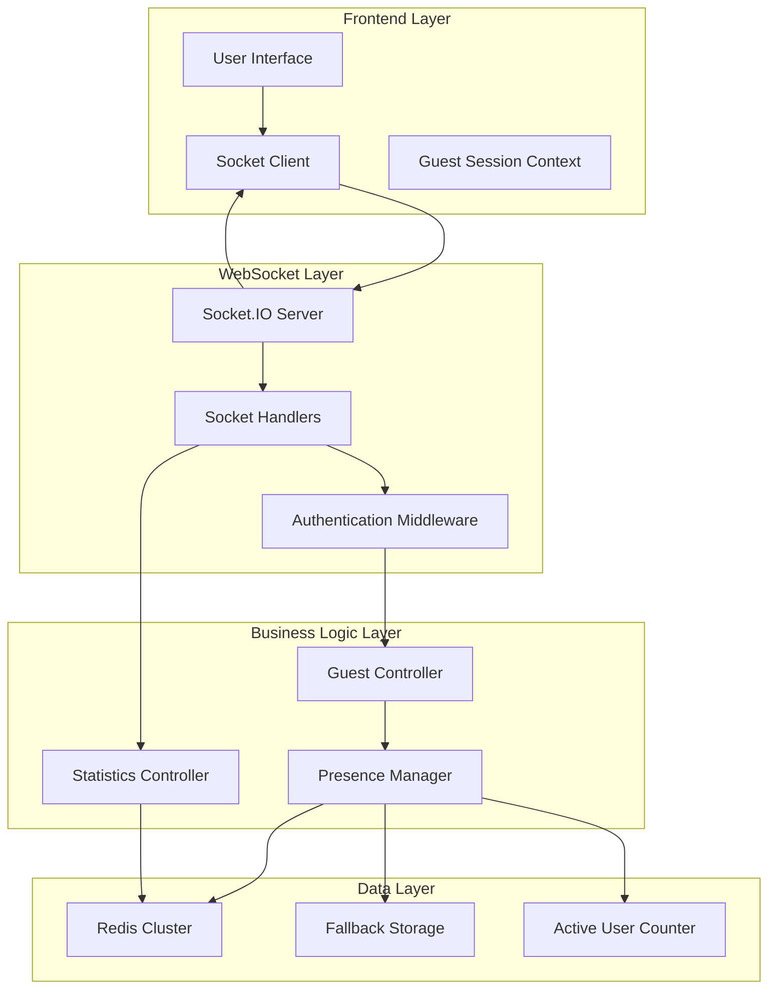
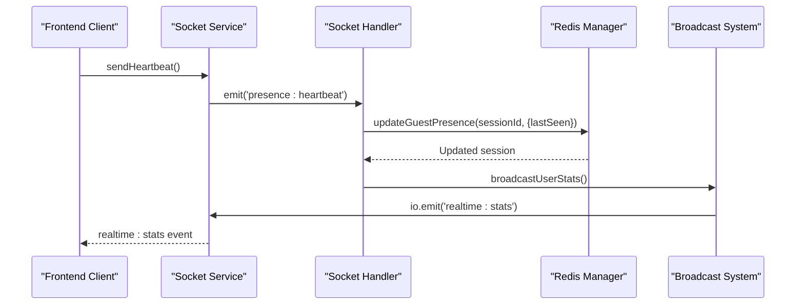
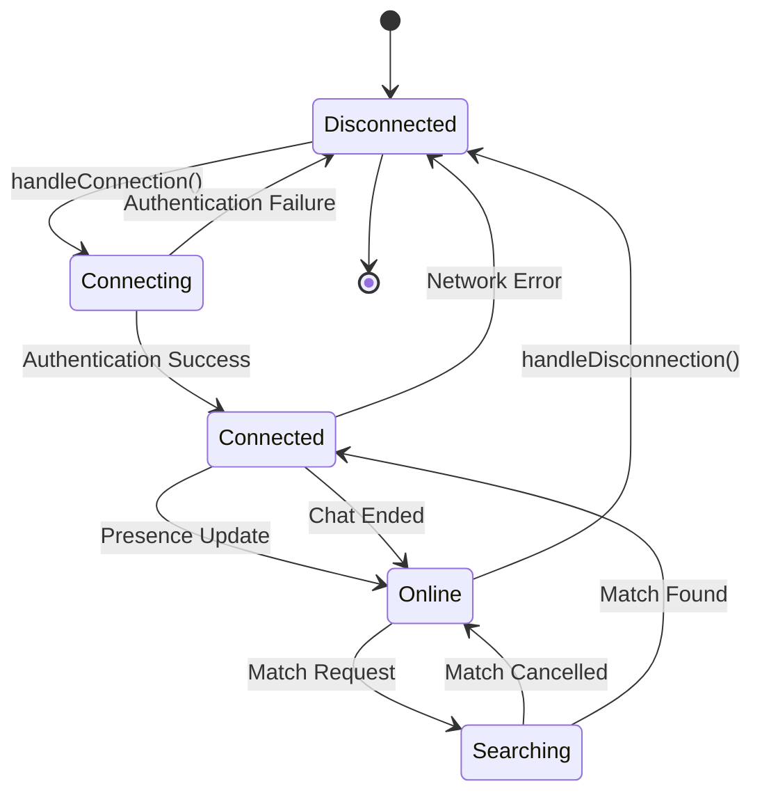
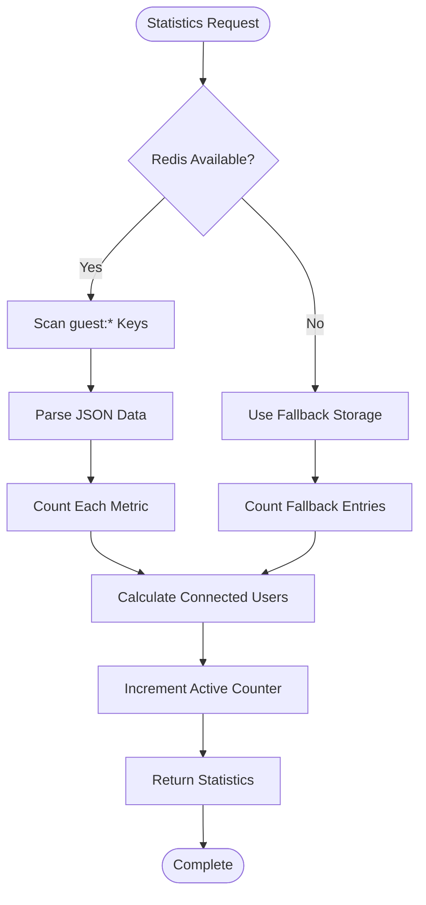
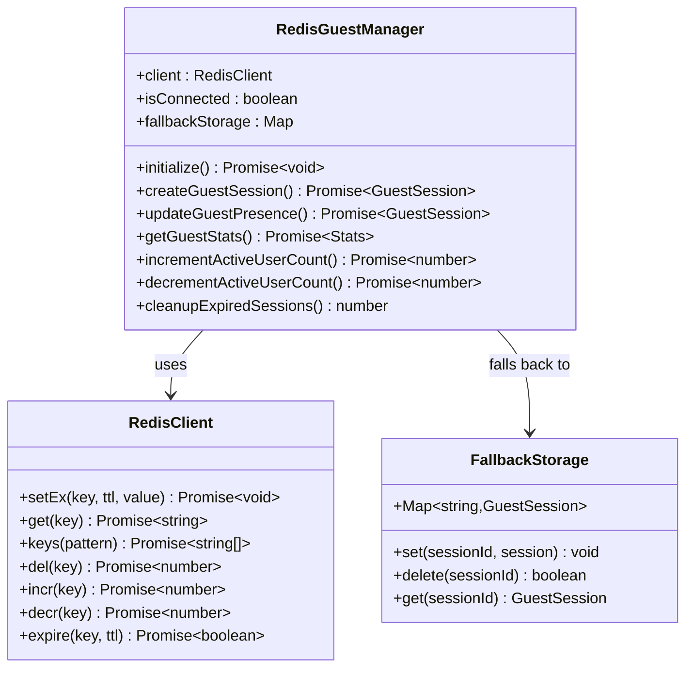
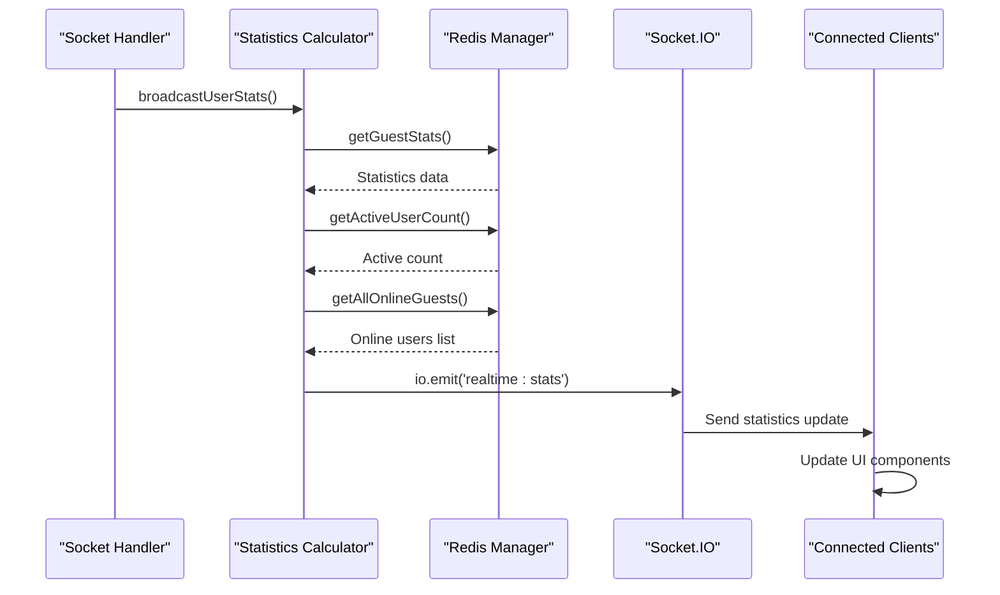
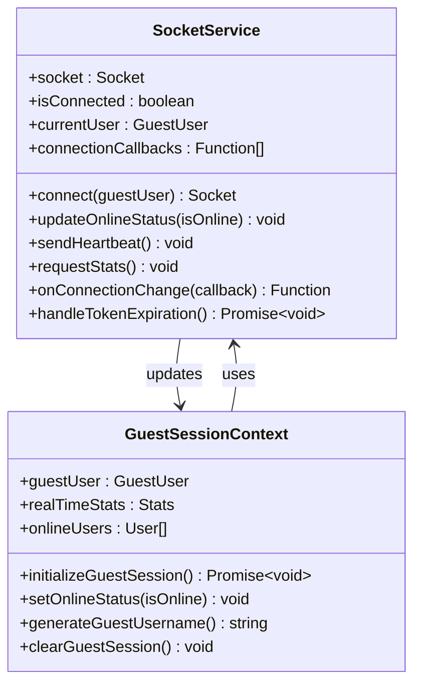
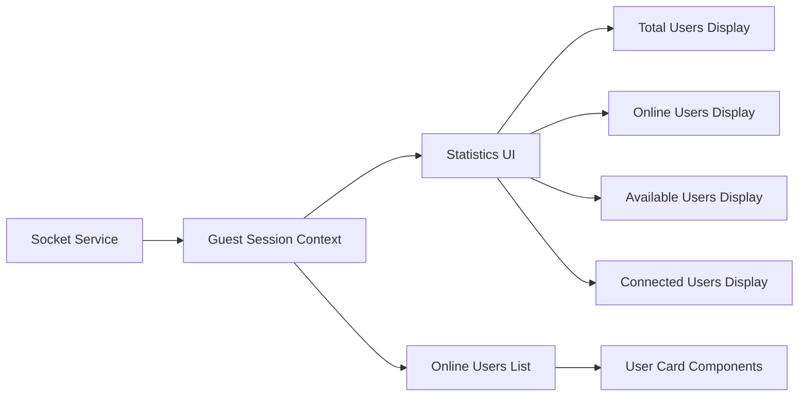
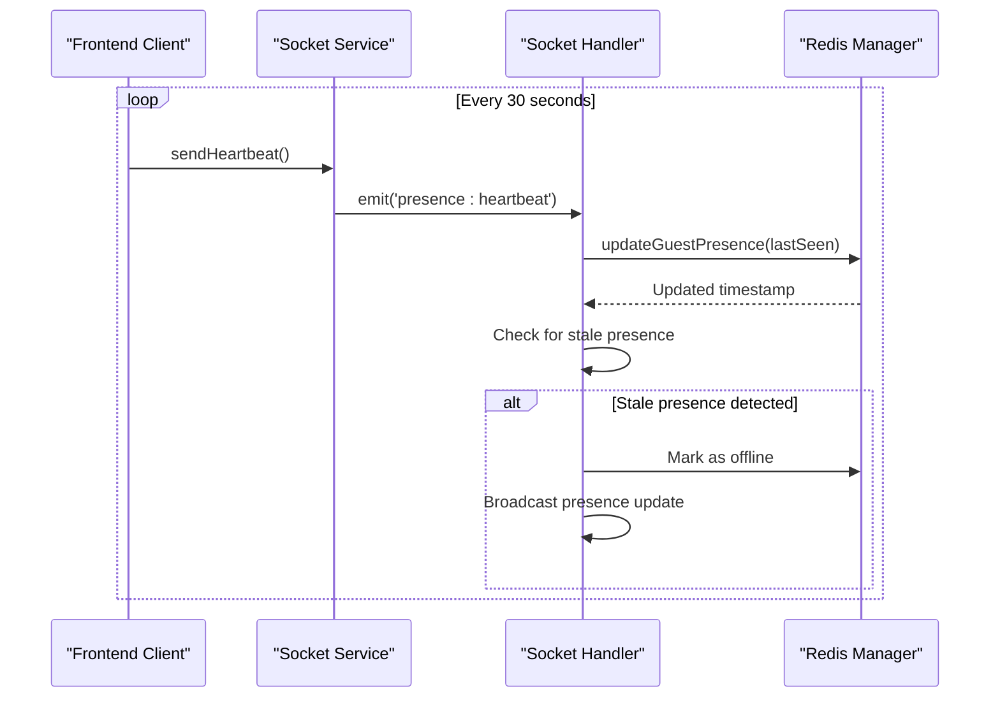
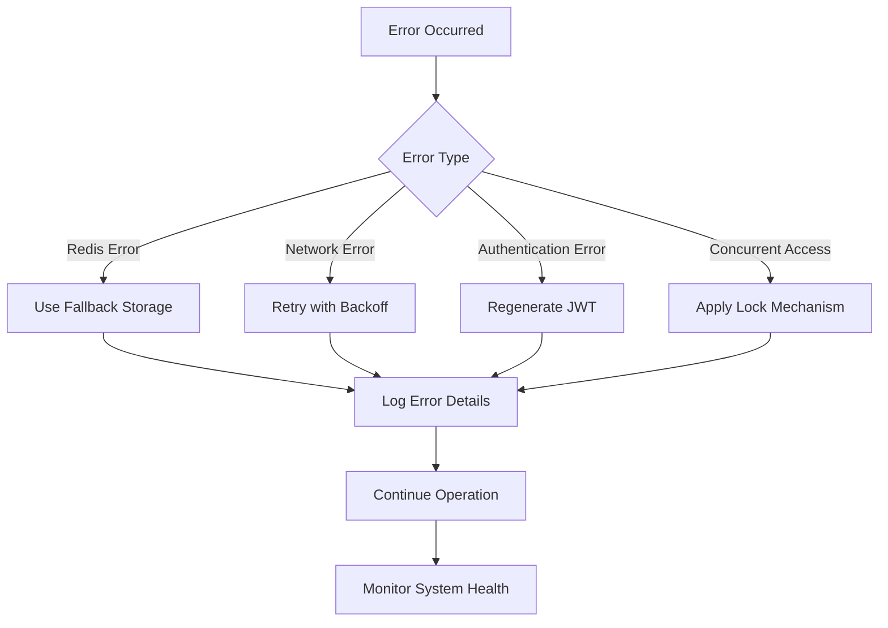

# Presence and Statistics System

<cite>
**Referenced Files in This Document**
- [socketHandlers.js](file://backend/src/socket/socketHandlers.js)
- [redisGuestManager.js](file://backend/src/utils/redisGuestManager.js)
- [socketServer.js](file://backend/src/socket/socketServer.js)
- [guestController.js](file://backend/src/controllers/guestController.js)
- [stats.js](file://backend/src/routes/stats.js)
- [socket.ts](file://web/lib/socket.ts)
- [GuestSessionContext.tsx](file://web/contexts/GuestSessionContext.tsx)
- [socketHandlers.connection.test.js](file://backend/src/socket/__tests__/socketHandlers.connection.test.js)
</cite>

## Table of Contents
1. [Introduction](#introduction)
2. [System Architecture](#system-architecture)
3. [User Presence Tracking](#user-presence-tracking)
4. [Statistics Collection](#statistics-collection)
5. [Redis Persistence Layer](#redis-persistence-layer)
6. [Broadcasting Mechanism](#broadcasting-mechanism)
7. [Frontend Integration](#frontend-integration)
8. [Heartbeat and Connection Management](#heartbeat-and-connection-management)
9. [Error Handling and Race Conditions](#error-handling-and-race-conditions)
10. [Performance Considerations](#performance-considerations)
11. [Troubleshooting Guide](#troubleshooting-guide)
12. [Conclusion](#conclusion)

## Introduction

The Presence and Statistics System is a comprehensive real-time monitoring solution that tracks user activity, maintains online status, and provides live statistics for the chat application. Built on a WebSocket-based architecture with Redis persistence, it ensures reliable presence tracking even in high-concurrency environments with distributed deployments.

The system monitors four primary presence states: online status, searching state for matches, connection status, and active user engagement. It maintains real-time statistics including total users, online users, active users, available users, and connected users, broadcasting updates to all connected clients via the 'realtime:stats' event.

## System Architecture

The Presence and Statistics System follows a layered architecture with clear separation of concerns:



**Diagram sources**
- [socketServer.js](file://backend/src/socket/socketServer.js#L1-L199)
- [socketHandlers.js](file://backend/src/socket/socketHandlers.js#L1-L771)
- [redisGuestManager.js](file://backend/src/utils/redisGuestManager.js#L1-L432)

**Section sources**
- [socketServer.js](file://backend/src/socket/socketServer.js#L1-L199)
- [socketHandlers.js](file://backend/src/socket/socketHandlers.js#L1-L771)

## User Presence Tracking

### Presence States and Transitions

The system tracks user presence through four distinct states:

| State | Description | Redis Field | Frontend Event |
|-------|-------------|-------------|----------------|
| Online | User is connected to the server | `isOnline: true/false` | `presence:online` |
| Searching | User is actively looking for matches | `isSearching: true/false` | `presence:searching` |
| Connected | User is in a chat session | `connectedUser: userId/null` | `presence:connected` |
| Active | User has recent activity | `lastSeen: timestamp` | `presence:heartbeat` |

### Presence Update Mechanisms



**Diagram sources**
- [socketHandlers.js](file://backend/src/socket/socketHandlers.js#L697-L743)
- [socket.ts](file://web/lib/socket.ts#L278-L330)

### Connection Lifecycle Management

The system handles complete connection lifecycles with automatic cleanup:



**Diagram sources**
- [socketHandlers.js](file://backend/src/socket/socketHandlers.js#L10-L150)

**Section sources**
- [socketHandlers.js](file://backend/src/socket/socketHandlers.js#L10-L150)
- [redisGuestManager.js](file://backend/src/utils/redisGuestManager.js#L149-L202)

## Statistics Collection

### Statistical Metrics

The system maintains five key statistical metrics:

| Metric | Description | Calculation Method | Redis Key |
|--------|-------------|-------------------|-----------|
| Total Users | All guest accounts created | Count all `guest:*` keys | N/A |
| Online Users | Currently connected users | Filter `isOnline: true` | N/A |
| Active Users | Users with recent activity | Redis counter (`active_user_count`) | `active_user_count` |
| Available Users | Users searching for matches | Filter `isSearching: true` | N/A |
| Connected Users | Users in active chat sessions | Count `connectedUser` fields | N/A |

### Statistics Calculation Process



**Diagram sources**
- [redisGuestManager.js](file://backend/src/utils/redisGuestManager.js#L233-L318)

**Section sources**
- [redisGuestManager.js](file://backend/src/utils/redisGuestManager.js#L233-L318)
- [socketHandlers.js](file://backend/src/socket/socketHandlers.js#L697-L743)

## Redis Persistence Layer

### Redis Configuration and Connection Management

The Redis Guest Manager implements robust connection handling with automatic fallback capabilities:



**Diagram sources**
- [redisGuestManager.js](file://backend/src/utils/redisGuestManager.js#L1-L432)

### Data Expiration and Cleanup

The system implements intelligent data expiration:

- **Session Expiry**: 2-hour TTL for guest sessions
- **Active User Counter**: 5-minute TTL with auto-expiration
- **Fallback Cleanup**: 10-minute interval cleanup of expired sessions

**Section sources**
- [redisGuestManager.js](file://backend/src/utils/redisGuestManager.js#L1-L432)

## Broadcasting Mechanism

### Real-time Statistics Broadcasting

The system broadcasts updated statistics to all connected clients using Socket.IO's `io.emit()` method:



**Diagram sources**
- [socketHandlers.js](file://backend/src/socket/socketHandlers.js#L697-L743)

### Broadcast Events and Payload Structure

| Event | Purpose | Payload Structure |
|-------|---------|-------------------|
| `realtime:stats` | Push statistics to all clients | `{stats, onlineUsers, timestamp}` |
| `stats:update` | Update individual client | `{stats, timestamp}` |
| `users:online:update` | Update online users list | `[UserObject...]` |

**Section sources**
- [socketHandlers.js](file://backend/src/socket/socketHandlers.js#L697-L743)

## Frontend Integration

### Socket Service Implementation

The frontend socket service manages real-time presence and statistics:



**Diagram sources**
- [socket.ts](file://web/lib/socket.ts#L1-L474)
- [GuestSessionContext.tsx](file://web/contexts/GuestSessionContext.tsx#L1-L453)

### Statistics Display Integration

The frontend integrates statistics through React context and real-time updates:



**Diagram sources**
- [GuestSessionContext.tsx](file://web/contexts/GuestSessionContext.tsx#L119-L139)

**Section sources**
- [socket.ts](file://web/lib/socket.ts#L1-L474)
- [GuestSessionContext.tsx](file://web/contexts/GuestSessionContext.tsx#L1-L453)

## Heartbeat and Connection Management

### Heartbeat Mechanism

The system implements a robust heartbeat mechanism for presence validation:



**Diagram sources**
- [socket.ts](file://web/lib/socket.ts#L278-L330)
- [socketHandlers.js](file://backend/src/socket/socketHandlers.js#L697-L743)

### Connection Resilience Features

The system includes comprehensive connection resilience:

- **Automatic Reconnection**: Configurable retry attempts with exponential backoff
- **Token Refresh**: Automatic JWT token regeneration on expiration
- **Session Recovery**: Ability to recover from network interruptions
- **Graceful Degradation**: Fallback to in-memory storage when Redis unavailable

**Section sources**
- [socket.ts](file://web/lib/socket.ts#L60-L200)
- [redisGuestManager.js](file://backend/src/utils/redisGuestManager.js#L15-L60)

## Error Handling and Race Conditions

### Race Condition Prevention

The system addresses several potential race conditions:

| Race Condition | Prevention Strategy | Implementation |
|----------------|-------------------|----------------|
| Concurrent Updates | Atomic Redis operations | `SET` with TTL |
| Stale Presence Data | Timestamp validation | Compare `lastSeen` timestamps |
| Session Cleanup | Synchronized cleanup | Redis expiration + fallback cleanup |
| High Concurrency | Rate limiting | Per-user request throttling |

### Error Handling Patterns



**Diagram sources**
- [redisGuestManager.js](file://backend/src/utils/redisGuestManager.js#L149-L202)

### Stale Data Mitigation

The system implements multiple strategies to prevent stale presence data:

- **Timestamp Validation**: Regular heartbeat updates with timestamp comparison
- **Session Expiry**: Automatic cleanup of expired sessions
- **Fallback Monitoring**: Continuous monitoring of fallback storage health
- **Health Checks**: Periodic validation of presence data consistency

**Section sources**
- [redisGuestManager.js](file://backend/src/utils/redisGuestManager.js#L149-L202)
- [socketHandlers.js](file://backend/src/socket/socketHandlers.js#L10-L150)

## Performance Considerations

### Scalability Features

The Presence and Statistics System is designed for high-performance operation:

- **Redis Clustering**: Support for Redis cluster deployment
- **Connection Pooling**: Efficient Redis client management
- **Rate Limiting**: Per-user request throttling to prevent abuse
- **Lazy Loading**: On-demand statistics calculation
- **Caching Strategy**: Intelligent caching of frequently accessed data

### Memory Management

The system implements efficient memory management:

- **Garbage Collection**: Automatic cleanup of expired sessions
- **Connection Mapping**: Optimized data structures for user tracking
- **Fallback Storage**: In-memory storage with automatic cleanup
- **Statistics Aggregation**: Efficient aggregation algorithms

### Performance Monitoring

Key performance metrics include:

- **Response Times**: Average response times for presence updates
- **Throughput**: Messages processed per second
- **Error Rates**: Frequency of errors and failures
- **Resource Usage**: Memory and CPU utilization patterns

## Troubleshooting Guide

### Common Issues and Solutions

| Issue | Symptoms | Solution |
|-------|----------|----------|
| Stale Presence Data | Users appear online when offline | Restart Redis or check heartbeat intervals |
| High Memory Usage | Increasing memory consumption | Check for memory leaks in fallback storage |
| Connection Drops | Frequent disconnections | Verify Redis connectivity and network stability |
| Slow Statistics | Delayed statistics updates | Optimize Redis queries and indexing |

### Diagnostic Commands

```bash
# Check Redis connectivity
redis-cli ping

# Monitor Redis keys
redis-cli keys "guest:*"

# Check active connections
redis-cli info clients

# Monitor Redis memory usage
redis-cli info memory
```

### Logging and Monitoring

The system provides comprehensive logging:

- **Connection Events**: Detailed logs for connection/disconnection
- **Presence Updates**: Logs for presence state changes
- **Error Events**: Comprehensive error logging with stack traces
- **Performance Metrics**: Timing information for critical operations

**Section sources**
- [redisGuestManager.js](file://backend/src/utils/redisGuestManager.js#L15-L60)
- [socketHandlers.js](file://backend/src/socket/socketHandlers.js#L10-L150)

## Conclusion

The Presence and Statistics System provides a robust, scalable solution for real-time user presence tracking and statistics collection. Its architecture balances performance, reliability, and scalability while maintaining simplicity in implementation and operation.

Key strengths of the system include:

- **Reliability**: Redis-based persistence with automatic fallback
- **Scalability**: Support for distributed deployments with Redis clustering
- **Real-time Updates**: Instant statistics broadcasting to all clients
- **Resilience**: Comprehensive error handling and recovery mechanisms
- **Performance**: Optimized data structures and caching strategies

The system successfully addresses the challenges of maintaining accurate presence information in high-concurrency environments while providing a seamless user experience through real-time statistics updates.

Future enhancements could include advanced analytics, predictive user behavior modeling, and enhanced monitoring capabilities to further improve the system's intelligence and operational insights.