# Real-time Communication Implementation

<cite>
**Referenced Files in This Document**
- [socketHandlers.js](file://backend/src/socket/socketHandlers.js)
- [socketServer.js](file://backend/src/socket/socketServer.js)
- [socket.ts](file://web/lib/socket.ts)
- [ChatContext.tsx](file://web/contexts/ChatContext.tsx)
- [useWebRTC.ts](file://web/hooks/useWebRTC.ts)
- [tempFileStorage.js](file://backend/src/utils/tempFileStorage.js)
- [guestController.js](file://backend/src/controllers/guestController.js)
- [auth.js](file://backend/src/middleware/auth.js)
- [redisGuestManager.js](file://backend/src/utils/redisGuestManager.js)
- [FilePreview.tsx](file://web/components/FilePreview.tsx)
- [mediaUtils.ts](file://web/lib/mediaUtils.ts)
</cite>

## Table of Contents
1. [Introduction](#introduction)
2. [System Architecture](#system-architecture)
3. [Real-time Messaging System](#real-time-messaging-system)
4. [File Sharing Mechanism](#file-sharing-mechanism)
5. [Presence System](#presence-system)
6. [Statistics Broadcasting](#statistics-broadcasting)
7. [WebRTC Implementation](#webrtc-implementation)
8. [Connection Resilience](#connection-resilience)
9. [Performance Considerations](#performance-considerations)
10. [Error Handling](#error-handling)
11. [Security Implementation](#security-implementation)
12. [Conclusion](#conclusion)

## Introduction

The Real-time Communication Implementation is a comprehensive messaging platform built with Socket.IO for real-time communication, featuring text chat with typing indicators, file sharing capabilities, WebRTC video/audio calls, and sophisticated presence management. The system is designed for high-concurrency scenarios with robust connection resilience and performance optimization strategies.

The platform supports anonymous guest users with automatic session management, temporary file storage with expiration, and real-time statistics broadcasting. It implements advanced features including message delivery confirmations, system messages, and comprehensive error handling for network interruptions and server overload conditions.

## System Architecture

The real-time communication system follows a microservices architecture with clear separation between frontend and backend components:

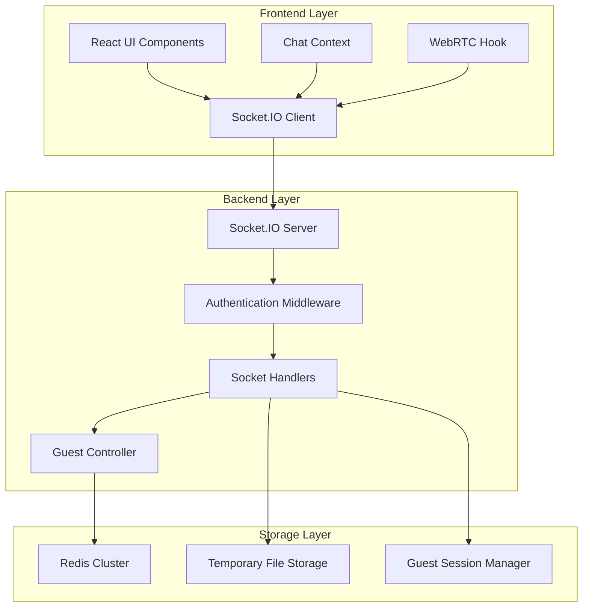
```mermaid
graph TB
subgraph "Frontend Layer"
UI[React UI Components]
SocketClient[Socket.IO Client]
ChatContext[Chat Context]
WebRTCHook[WebRTC Hook]
end
subgraph "Backend Layer"
SocketServer[Socket.IO Server]
AuthMiddleware[Authentication Middleware]
SocketHandlers[Socket Handlers]
GuestController[Guest Controller]
end
subgraph "Storage Layer"
Redis[Redis Cluster]
TempStorage[Temporary File Storage]
GuestManager[Guest Session Manager]
end
UI --> SocketClient
SocketClient --> SocketServer
SocketServer --> AuthMiddleware
AuthMiddleware --> SocketHandlers
SocketHandlers --> GuestController
GuestController --> Redis
SocketHandlers --> TempStorage
SocketHandlers --> GuestManager
ChatContext --> SocketClient
WebRTCHook --> SocketClient
```

**Diagram sources**
- [socketServer.js](file://backend/src/socket/socketServer.js#L1-L199)
- [socketHandlers.js](file://backend/src/socket/socketHandlers.js#L1-L746)
- [auth.js](file://backend/src/middleware/auth.js#L1-L100)

**Section sources**
- [socketServer.js](file://backend/src/socket/socketServer.js#L1-L199)
- [socketHandlers.js](file://backend/src/socket/socketHandlers.js#L1-L746)

## Real-time Messaging System

### Text Chat Implementation

The messaging system provides comprehensive text chat functionality with typing indicators, message delivery confirmations, and system messages:

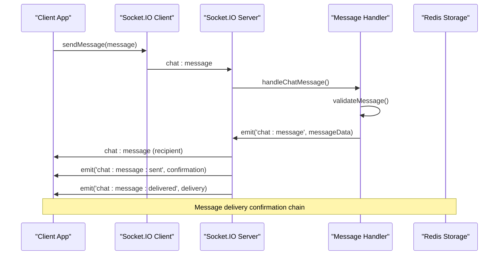
```mermaid
sequenceDiagram
participant Client as "Client App"
participant Socket as "Socket.IO Client"
participant Server as "Socket.IO Server"
participant Handler as "Message Handler"
participant Redis as "Redis Storage"
Client->>Socket : sendMessage(message)
Socket->>Server : chat : message
Server->>Handler : handleChatMessage()
Handler->>Handler : validateMessage()
Handler->>Server : emit('chat : message', messageData)
Server->>Client : chat : message (recipient)
Server->>Client : emit('chat : message : sent', confirmation)
Server->>Client : emit('chat : message : delivered', delivery)
Note over Client,Redis : Message delivery confirmation chain
```

**Diagram sources**
- [socketHandlers.js](file://backend/src/socket/socketHandlers.js#L300-L350)
- [socket.ts](file://web/lib/socket.ts#L150-L200)

### Message Types and Validation

The system supports multiple message types with comprehensive validation:

| Message Type | Content Structure | Validation Rules |
|--------------|-------------------|------------------|
| Text | `string` | Minimum length, character limits |
| File | Object with metadata | File size limits, MIME type validation |
| Voice | Audio recording data | Duration limits, format validation |
| System | Structured message | System message format |

### Typing Indicators

Typing indicators provide real-time feedback on user activity:

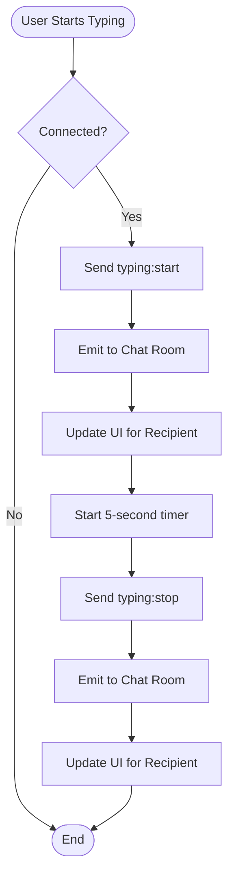
```mermaid
flowchart TD
Start([User Starts Typing]) --> CheckConnection{Connected?}
CheckConnection --> |Yes| SendStart[Send typing:start]
CheckConnection --> |No| End([End])
SendStart --> EmitToRoom[Emit to Chat Room]
EmitToRoom --> UpdateUI[Update UI for Recipient]
UpdateUI --> Timer[Start 5-second timer]
Timer --> SendStop[Send typing:stop]
SendStop --> EmitToRoom2[Emit to Chat Room]
EmitToRoom2 --> UpdateUI2[Update UI for Recipient]
UpdateUI2 --> End
```

**Diagram sources**
- [socketHandlers.js](file://backend/src/socket/socketHandlers.js#L150-L180)
- [socket.ts](file://web/lib/socket.ts#L250-L280)

**Section sources**
- [socketHandlers.js](file://backend/src/socket/socketHandlers.js#L300-L400)
- [ChatContext.tsx](file://web/contexts/ChatContext.tsx#L400-L500)

### Message Delivery Confirmation

The system implements a three-stage message delivery confirmation:

1. **Sent Confirmation**: Acknowledges message receipt by the server
2. **Delivered Confirmation**: Confirms message reached the recipient
3. **Read Confirmation**: Indicates message has been read (future enhancement)

**Section sources**
- [socketHandlers.js](file://backend/src/socket/socketHandlers.js#L320-L350)
- [ChatContext.tsx](file://web/contexts/ChatContext.tsx#L200-L250)

## File Sharing Mechanism

### Temporary File Storage

The file sharing system uses temporary file storage with automatic expiration:

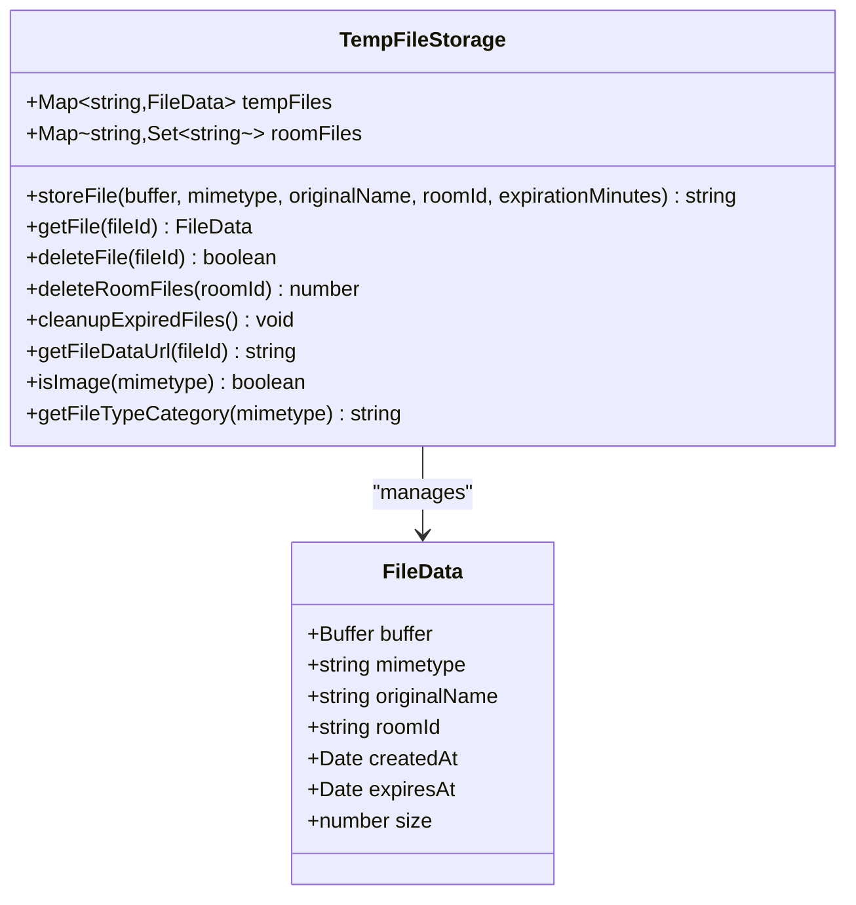
```mermaid
classDiagram
class TempFileStorage {
+Map~string,FileData~ tempFiles
+Map~string,Set~string~~ roomFiles
+storeFile(buffer, mimetype, originalName, roomId, expirationMinutes) string
+getFile(fileId) FileData
+deleteFile(fileId) boolean
+deleteRoomFiles(roomId) number
+cleanupExpiredFiles() void
+getFileDataUrl(fileId) string
+isImage(mimetype) boolean
+getFileTypeCategory(mimetype) string
}
class FileData {
+Buffer buffer
+string mimetype
+string originalName
+string roomId
+Date createdAt
+Date expiresAt
+number size
}
TempFileStorage --> FileData : "manages"
```

**Diagram sources**
- [tempFileStorage.js](file://backend/src/utils/tempFileStorage.js#L1-L237)

### Upload Validation and Processing

File uploads undergo comprehensive validation and processing:

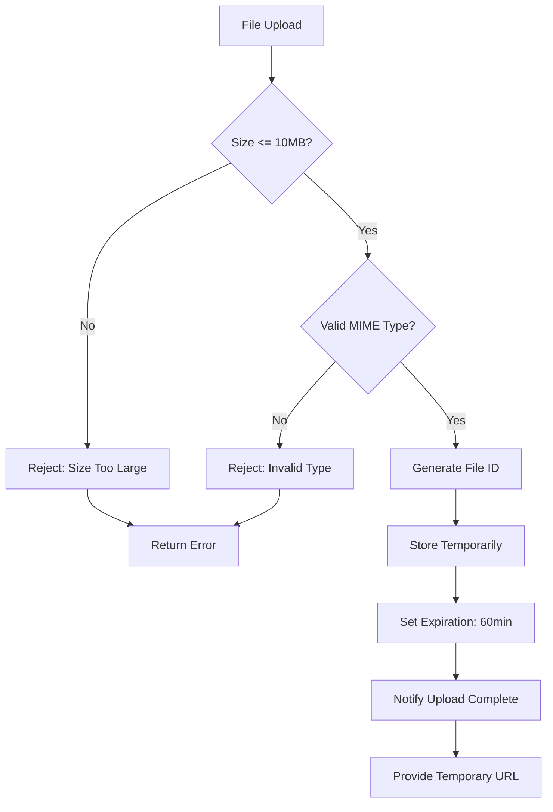
```mermaid
flowchart TD
Upload[File Upload] --> ValidateSize{Size <= 10MB?}
ValidateSize --> |No| Reject[Reject: Size Too Large]
ValidateSize --> |Yes| ValidateType{Valid MIME Type?}
ValidateType --> |No| Reject2[Reject: Invalid Type]
ValidateType --> |Yes| GenerateID[Generate File ID]
GenerateID --> StoreTemp[Store Temporarily]
StoreTemp --> SetExpiry[Set Expiration: 60min]
SetExpiry --> NotifyClient[Notify Upload Complete]
NotifyClient --> ProvideURL[Provide Temporary URL]
Reject --> Error[Return Error]
Reject2 --> Error
```

**Diagram sources**
- [tempFileStorage.js](file://backend/src/utils/tempFileStorage.js#L20-L50)

### Download Handling

File downloads are handled securely with availability checks:

| Feature | Implementation | Security Measure |
|---------|---------------|------------------|
| Availability Check | HEAD request before download | Prevents expired file access |
| Temporary URLs | Signed URLs with expiration | Limits exposure window |
| File Type Detection | MIME type validation | Prevents malicious file execution |
| Size Limiting | Configurable size restrictions | Prevents resource exhaustion |

**Section sources**
- [tempFileStorage.js](file://backend/src/utils/tempFileStorage.js#L1-L237)
- [FilePreview.tsx](file://web/components/FilePreview.tsx#L1-L327)

## Presence System

### Online Status Tracking

The presence system tracks user online status across the platform:

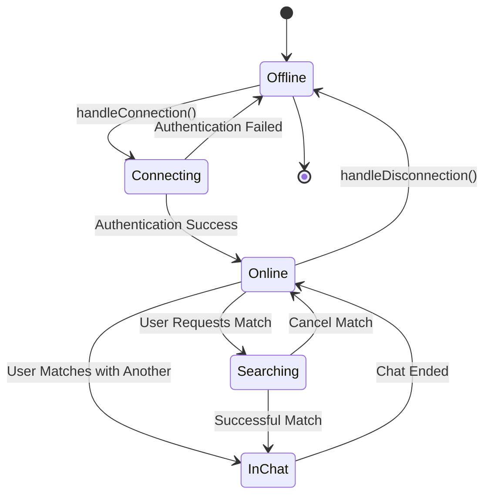
```mermaid
stateDiagram-v2
[*] --> Offline
Offline --> Connecting : handleConnection()
Connecting --> Online : Authentication Success
Connecting --> Offline : Authentication Failed
Online --> Searching : User Requests Match
Online --> InChat : User Matches with Another
Searching --> Online : Cancel Match
Searching --> InChat : Successful Match
InChat --> Online : Chat Ended
Online --> Offline : handleDisconnection()
Offline --> [*]
```

**Diagram sources**
- [socketHandlers.js](file://backend/src/socket/socketHandlers.js#L15-L80)
- [redisGuestManager.js](file://backend/src/utils/redisGuestManager.js#L150-L200)

### Active User Management

Active users are tracked using Redis for scalability:

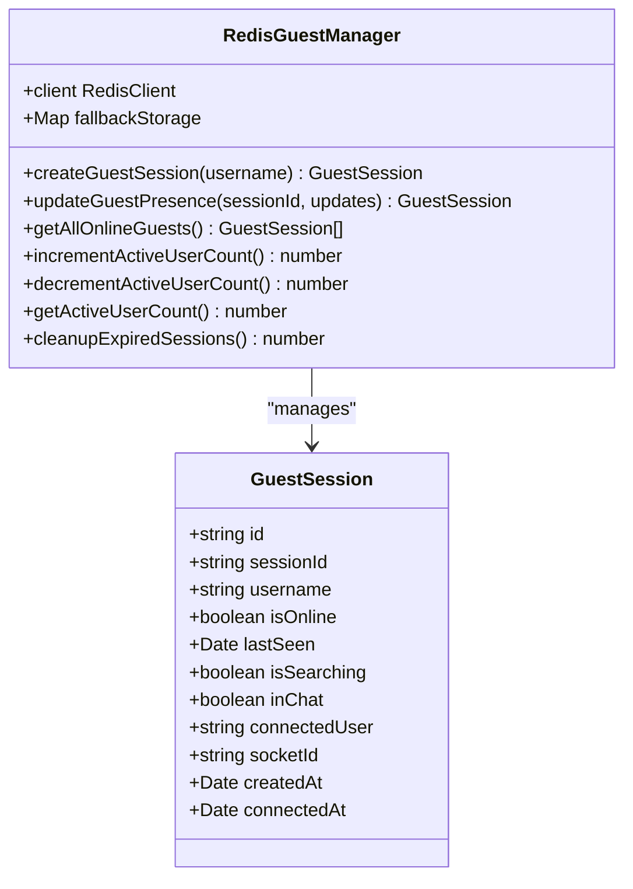
```mermaid
classDiagram
class RedisGuestManager {
+client RedisClient
+Map fallbackStorage
+createGuestSession(username) GuestSession
+updateGuestPresence(sessionId, updates) GuestSession
+getAllOnlineGuests() GuestSession[]
+incrementActiveUserCount() number
+decrementActiveUserCount() number
+getActiveUserCount() number
+cleanupExpiredSessions() number
}
class GuestSession {
+string id
+string sessionId
+string username
+boolean isOnline
+Date lastSeen
+boolean isSearching
+boolean inChat
+string connectedUser
+string socketId
+Date createdAt
+Date connectedAt
}
RedisGuestManager --> GuestSession : "manages"
```

**Diagram sources**
- [redisGuestManager.js](file://backend/src/utils/redisGuestManager.js#L1-L432)

**Section sources**
- [redisGuestManager.js](file://backend/src/utils/redisGuestManager.js#L150-L300)
- [socketHandlers.js](file://backend/src/socket/socketHandlers.js#L20-L80)

## Statistics Broadcasting

### Real-time User Counts

The system broadcasts real-time statistics to all connected clients:

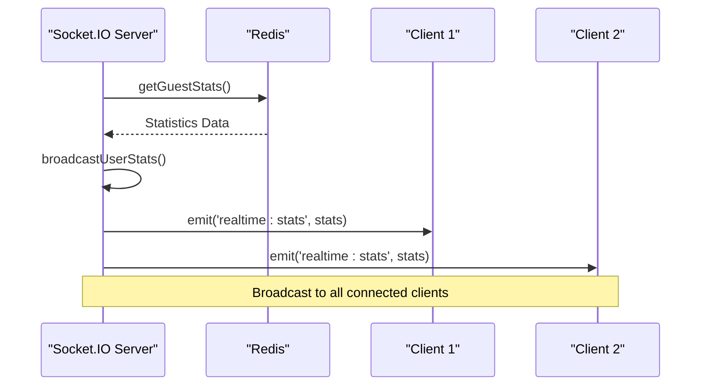
```mermaid
sequenceDiagram
participant Server as "Socket.IO Server"
participant Redis as "Redis"
participant Client1 as "Client 1"
participant Client2 as "Client 2"
Server->>Redis : getGuestStats()
Redis-->>Server : Statistics Data
Server->>Server : broadcastUserStats()
Server->>Client1 : emit('realtime : stats', stats)
Server->>Client2 : emit('realtime : stats', stats)
Note over Server,Client2 : Broadcast to all connected clients
```

**Diagram sources**
- [socketHandlers.js](file://backend/src/socket/socketHandlers.js#L650-L700)

### Statistics Data Structure

| Metric | Description | Update Frequency |
|--------|-------------|------------------|
| Total Users | All registered guest accounts | On session creation |
| Online Users | Currently connected users | On connection/disconnection |
| Active Users | Users with active sessions | Every 5 minutes |
| Available Users | Users searching for matches | On search state change |
| Connected Users | Users currently in chat | On chat state change |

**Section sources**
- [socketHandlers.js](file://backend/src/socket/socketHandlers.js#L650-L746)
- [redisGuestManager.js](file://backend/src/utils/redisGuestManager.js#L300-L350)

## WebRTC Implementation

### Video/Audio Call System

The WebRTC implementation provides peer-to-peer video and audio communication:

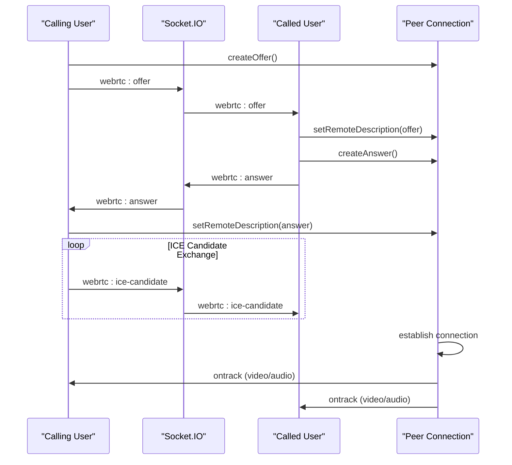
```mermaid
sequenceDiagram
participant Caller as "Calling User"
participant Socket as "Socket.IO"
participant Callee as "Called User"
participant PeerConn as "Peer Connection"
Caller->>PeerConn : createOffer()
Caller->>Socket : webrtc : offer
Socket->>Callee : webrtc : offer
Callee->>PeerConn : setRemoteDescription(offer)
Callee->>PeerConn : createAnswer()
Callee->>Socket : webrtc : answer
Socket->>Caller : webrtc : answer
Caller->>PeerConn : setRemoteDescription(answer)
loop ICE Candidate Exchange
Caller->>Socket : webrtc : ice-candidate
Socket->>Callee : webrtc : ice-candidate
end
PeerConn->>PeerConn : establish connection
PeerConn->>Caller : ontrack (video/audio)
PeerConn->>Callee : ontrack (video/audio)
```

**Diagram sources**
- [useWebRTC.ts](file://web/hooks/useWebRTC.ts#L200-L400)
- [socketHandlers.js](file://backend/src/socket/socketHandlers.js#L400-L500)

### Call State Management

The WebRTC hook manages complex call states:

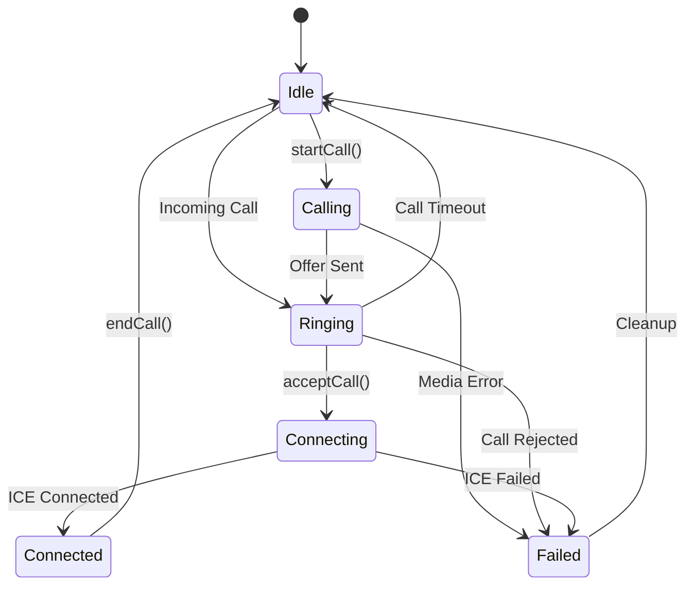
```mermaid
stateDiagram-v2
[*] --> Idle
Idle --> Calling : startCall()
Idle --> Ringing : Incoming Call
Calling --> Ringing : Offer Sent
Calling --> Failed : Media Error
Ringing --> Connecting : acceptCall()
Ringing --> Failed : Call Rejected
Connecting --> Connected : ICE Connected
Connecting --> Failed : ICE Failed
Connected --> Idle : endCall()
Failed --> Idle : Cleanup
Ringing --> Idle : Call Timeout
```

**Diagram sources**
- [useWebRTC.ts](file://web/hooks/useWebRTC.ts#L100-L200)

### ICE Candidate Handling

ICE candidates are managed through a queue system to handle timing issues:

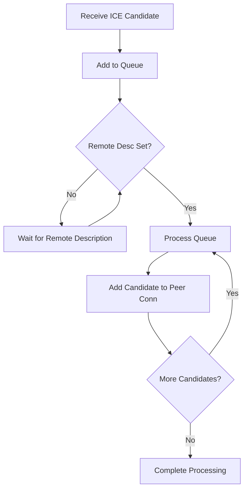
```mermaid
flowchart TD
ReceiveCandidate[Receive ICE Candidate] --> QueueCandidate[Add to Queue]
QueueCandidate --> CheckRemoteDesc{Remote Desc Set?}
CheckRemoteDesc --> |No| WaitRemoteDesc[Wait for Remote Description]
CheckRemoteDesc --> |Yes| ProcessQueue[Process Queue]
ProcessQueue --> AddCandidate[Add Candidate to Peer Conn]
AddCandidate --> CheckMore{More Candidates?}
CheckMore --> |Yes| ProcessQueue
CheckMore --> |No| Complete[Complete Processing]
WaitRemoteDesc --> CheckRemoteDesc
```

**Diagram sources**
- [useWebRTC.ts](file://web/hooks/useWebRTC.ts#L700-L800)

**Section sources**
- [useWebRTC.ts](file://web/hooks/useWebRTC.ts#L1-L1085)
- [socketHandlers.js](file://backend/src/socket/socketHandlers.js#L400-L600)

## Connection Resilience

### Reconnection Logic

The socket client implements comprehensive reconnection logic:

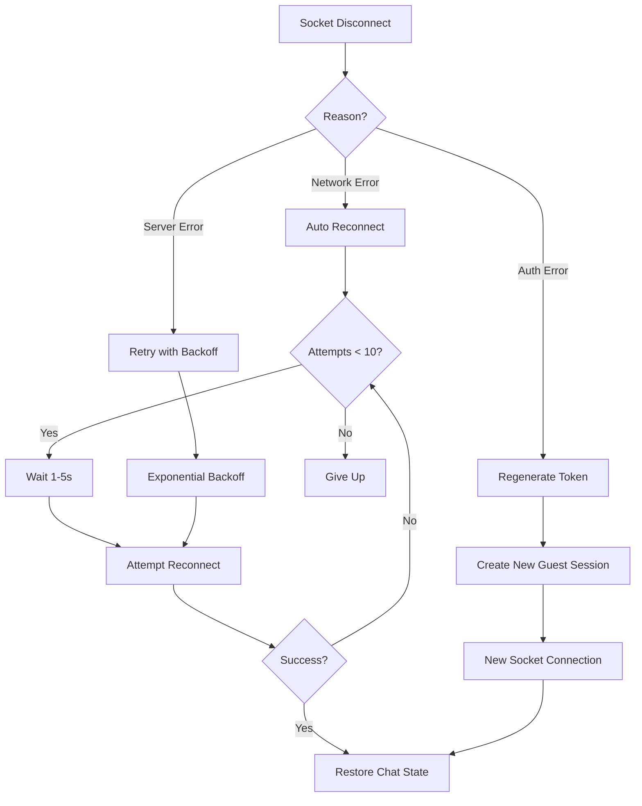
```mermaid
flowchart TD
Disconnect[Socket Disconnect] --> CheckReason{Reason?}
CheckReason --> |Network Error| AutoReconnect[Auto Reconnect]
CheckReason --> |Auth Error| RegenerateToken[Regenerate Token]
CheckReason --> |Server Error| RetryWithBackoff[Retry with Backoff]
AutoReconnect --> CheckAttempts{Attempts < 10?}
CheckAttempts --> |Yes| WaitDelay[Wait 1-5s]
CheckAttempts --> |No| GiveUp[Give Up]
WaitDelay --> ReconnectAttempt[Attempt Reconnect]
ReconnectAttempt --> Success{Success?}
Success --> |Yes| RestoreState[Restore Chat State]
Success --> |No| CheckAttempts
RegenerateToken --> CreateNewSession[Create New Guest Session]
CreateNewSession --> NewConnect[New Socket Connection]
NewConnect --> RestoreState
RetryWithBackoff --> WaitBackoff[Exponential Backoff]
WaitBackoff --> ReconnectAttempt
```

**Diagram sources**
- [socket.ts](file://web/lib/socket.ts#L50-L150)

### State Recovery

After reconnection, the system restores previous state:

| State Component | Recovery Method | Fallback Strategy |
|----------------|-----------------|-------------------|
| Chat History | Load from sessionStorage | Clear chat history |
| Connected User | Restore from sessionStorage | Reset to null |
| Call State | Re-establish WebRTC | End ongoing calls |
| Presence Status | Re-send presence update | Maintain offline status |

**Section sources**
- [socket.ts](file://web/lib/socket.ts#L300-L400)
- [ChatContext.tsx](file://web/contexts/ChatContext.tsx#L50-L100)

## Performance Considerations

### High-Concurrency Strategies

The system implements several strategies for handling high-concurrency scenarios:

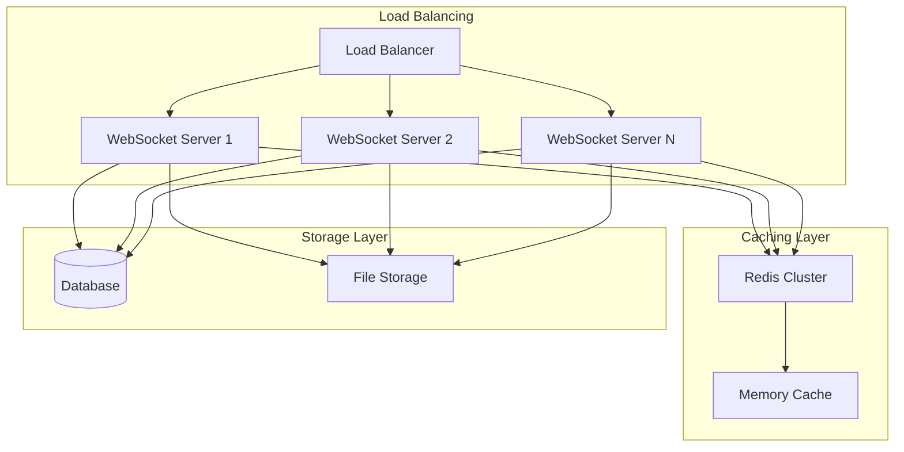
```mermaid
graph TB
subgraph "Load Balancing"
LB[Load Balancer]
WS1[WebSocket Server 1]
WS2[WebSocket Server 2]
WS3[WebSocket Server N]
end
subgraph "Caching Layer"
Redis[Redis Cluster]
MemCache[Memory Cache]
end
subgraph "Storage Layer"
DB[(Database)]
S3[File Storage]
end
LB --> WS1
LB --> WS2
LB --> WS3
WS1 --> Redis
WS2 --> Redis
WS3 --> Redis
Redis --> MemCache
WS1 --> DB
WS2 --> DB
WS3 --> DB
WS1 --> S3
WS2 --> S3
WS3 --> S3
```

**Diagram sources**
- [socketServer.js](file://backend/src/socket/socketServer.js#L20-L50)
- [redisGuestManager.js](file://backend/src/utils/redisGuestManager.js#L1-L50)

### Message Queuing Strategies

The system uses multiple queuing mechanisms:

| Queue Type | Purpose | Implementation |
|------------|---------|----------------|
| In-Memory Queue | Real-time message buffering | JavaScript Map |
| Redis Queue | Persistent message storage | Redis Lists |
| ICE Candidate Queue | NAT traversal coordination | Array queue |
| File Upload Queue | Asynchronous file processing | Worker pool |

### Memory Management

Efficient memory management prevents leaks:

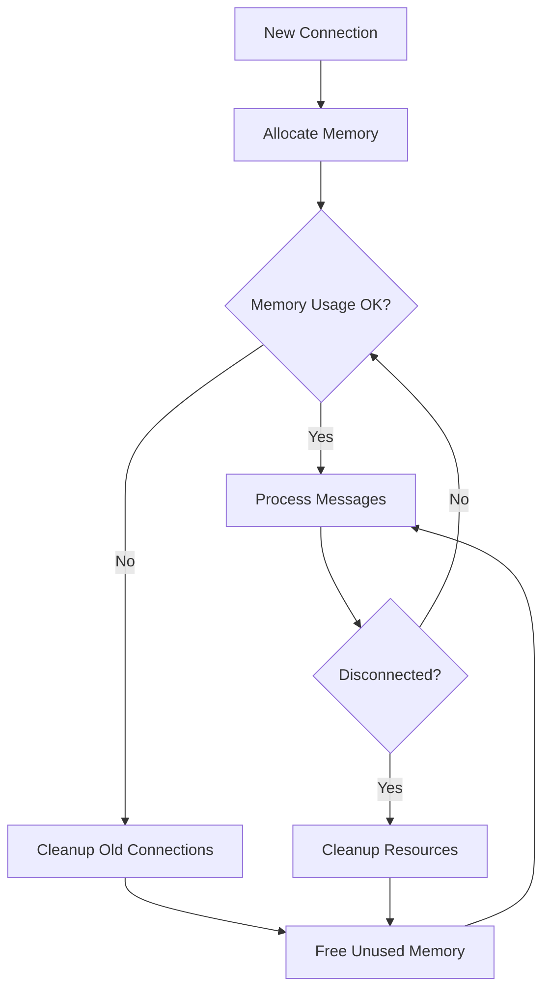
```mermaid
flowchart TD
NewConnection[New Connection] --> AllocateMemory[Allocate Memory]
AllocateMemory --> MonitorUsage{Memory Usage OK?}
MonitorUsage --> |Yes| ProcessMessages[Process Messages]
MonitorUsage --> |No| CleanupOld[Cleanup Old Connections]
CleanupOld --> FreeMemory[Free Unused Memory]
FreeMemory --> ProcessMessages
ProcessMessages --> CheckDisconnect{Disconnected?}
CheckDisconnect --> |Yes| CleanupResources[Cleanup Resources]
CheckDisconnect --> |No| MonitorUsage
CleanupResources --> FreeMemory
```

**Section sources**
- [socketServer.js](file://backend/src/socket/socketServer.js#L50-L100)
- [tempFileStorage.js](file://backend/src/utils/tempFileStorage.js#L100-L150)

## Error Handling

### Network Interruption Handling

The system provides comprehensive error handling for network interruptions:

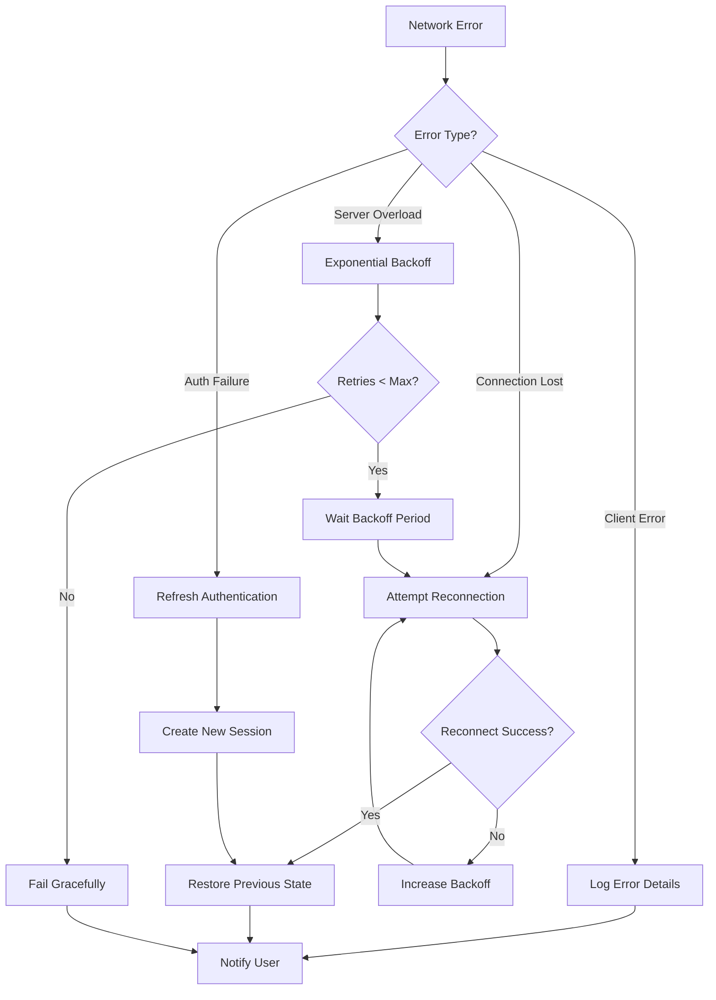
```mermaid
flowchart TD
NetworkError[Network Error] --> ClassifyError{Error Type?}
ClassifyError --> |Connection Lost| AttemptReconnect[Attempt Reconnection]
ClassifyError --> |Server Overload| BackoffRetry[Exponential Backoff]
ClassifyError --> |Auth Failure| RefreshToken[Refresh Authentication]
ClassifyError --> |Client Error| LogError[Log Error Details]
AttemptReconnect --> Success{Reconnect Success?}
Success --> |Yes| RestoreState[Restore Previous State]
Success --> |No| IncreaseBackoff[Increase Backoff]
IncreaseBackoff --> AttemptReconnect
BackoffRetry --> RetryCount{Retries < Max?}
RetryCount --> |Yes| WaitBackoff[Wait Backoff Period]
RetryCount --> |No| FailGracefully[Fail Gracefully]
WaitBackoff --> AttemptReconnect
RefreshToken --> NewSession[Create New Session]
NewSession --> RestoreState
LogError --> NotifyUser[Notify User]
RestoreState --> NotifyUser
FailGracefully --> NotifyUser
```

**Diagram sources**
- [socket.ts](file://web/lib/socket.ts#L100-L200)

### Server Overload Protection

The system implements several protection mechanisms:

| Protection Mechanism | Implementation | Threshold |
|---------------------|----------------|-----------|
| Rate Limiting | Token bucket algorithm | 100 requests/minute/user |
| Connection Limits | Per-user connection tracking | 10 concurrent connections |
| Message Throttling | Sliding window protocol | 10 messages/second |
| Resource Monitoring | Memory/CPU tracking | 80% utilization threshold |

### Error Recovery Strategies

The system employs multiple recovery strategies:

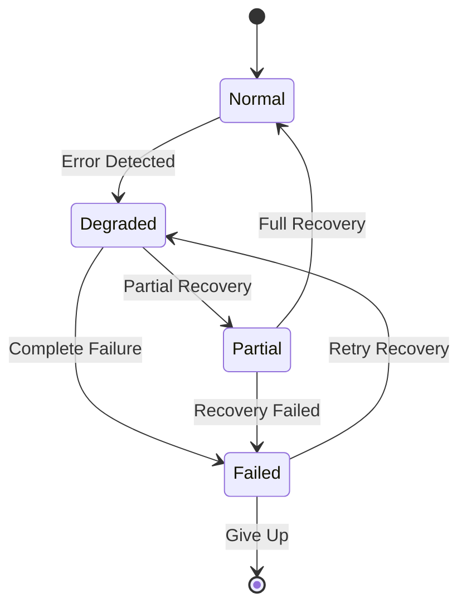
```mermaid
stateDiagram-v2
[*] --> Normal
Normal --> Degraded : Error Detected
Degraded --> Partial : Partial Recovery
Degraded --> Failed : Complete Failure
Partial --> Normal : Full Recovery
Partial --> Failed : Recovery Failed
Failed --> Degraded : Retry Recovery
Failed --> [*] : Give Up
```

**Section sources**
- [socketServer.js](file://backend/src/socket/socketServer.js#L60-L100)
- [socket.ts](file://web/lib/socket.ts#L200-L300)

## Security Implementation

### Authentication and Authorization

The system implements guest-only authentication with JWT tokens:

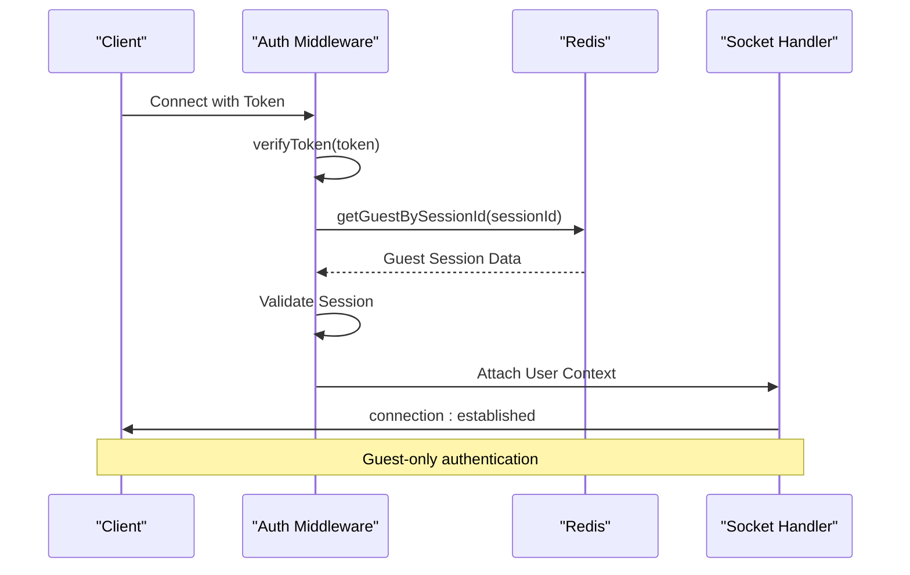
```mermaid
sequenceDiagram
participant Client as "Client"
participant Auth as "Auth Middleware"
participant Redis as "Redis"
participant Handler as "Socket Handler"
Client->>Auth : Connect with Token
Auth->>Auth : verifyToken(token)
Auth->>Redis : getGuestBySessionId(sessionId)
Redis-->>Auth : Guest Session Data
Auth->>Auth : Validate Session
Auth->>Handler : Attach User Context
Handler->>Client : connection : established
Note over Client,Handler : Guest-only authentication
```

**Diagram sources**
- [auth.js](file://backend/src/middleware/auth.js#L1-L100)
- [socketHandlers.js](file://backend/src/socket/socketHandlers.js#L15-L50)

### Token Management

Secure token management ensures session integrity:

| Security Feature | Implementation | Purpose |
|------------------|----------------|---------|
| JWT Tokens | HMAC-SHA256 signing | Secure token verification |
| Token Expiration | 2-hour expiry | Limits session lifetime |
| Session Isolation | Unique session IDs | Prevents session hijacking |
| Rate Limiting | Per-user request limits | Prevents abuse |

**Section sources**
- [auth.js](file://backend/src/middleware/auth.js#L1-L100)
- [guestController.js](file://backend/src/controllers/guestController.js#L50-L100)

## Conclusion

The Real-time Communication Implementation provides a robust, scalable solution for modern messaging applications. Key strengths include:

- **Comprehensive Real-time Features**: Text chat, file sharing, WebRTC calls, and presence management
- **High Performance**: Redis-based caching, efficient memory management, and connection pooling
- **Reliability**: Comprehensive error handling, automatic reconnection, and state recovery
- **Security**: Guest-only authentication, JWT token management, and rate limiting
- **Scalability**: Redis clustering support, horizontal scaling capabilities, and distributed architecture

The system successfully handles high-concurrency scenarios while maintaining real-time responsiveness and providing excellent user experience through features like typing indicators, message delivery confirmations, and seamless WebRTC integration. The modular architecture ensures maintainability and extensibility for future enhancements.