# Text Chat System

<cite>
**Referenced Files in This Document**
- [web/lib/socket.ts](file://web/lib/socket.ts)
- [web/contexts/ChatContext.tsx](file://web/contexts/ChatContext.tsx)
- [web/app/chat/page.tsx](file://web/app/chat/page.tsx)
- [backend/src/socket/socketHandlers.js](file://backend/src/socket/socketHandlers.js)
- [backend/src/middleware/validation.js](file://backend/src/middleware/validation.js)
- [backend/src/socket/socketServer.js](file://backend/src/socket/socketServer.js)
- [backend/QUICK_REFERENCE.md](file://backend/QUICK_REFERENCE.md)
- [backend/README.md](file://backend/README.md)
</cite>

## Table of Contents
1. [Introduction](#introduction)
2. [System Architecture](#system-architecture)
3. [Message Lifecycle](#message-lifecycle)
4. [Socket.IO Implementation](#socketio-implementation)
5. [Message Validation](#message-validation)
6. [Typing Indicators](#typing-indicators)
7. [Message Status Tracking](#message-status-tracking)
8. [Chat Interface Components](#chat-interface-components)
9. [Message History Management](#message-history-management)
10. [Network Resilience](#network-resilience)
11. [Performance Considerations](#performance-considerations)
12. [Common Issues and Solutions](#common-issues-and-solutions)

## Introduction

The Text Chat System is a comprehensive real-time messaging solution built with Socket.IO for instant communication, featuring text messages, file sharing, voice notes, and typing indicators. The system provides robust message delivery guarantees, real-time status tracking, and seamless handling of network interruptions through client acknowledgments and automatic reconnection mechanisms.

The implementation follows a guest-user model where users can engage in anonymous chat sessions without traditional registration, making it ideal for casual social interactions and quick conversations.

## System Architecture

The Text Chat System employs a microservices architecture with clear separation between frontend and backend components:

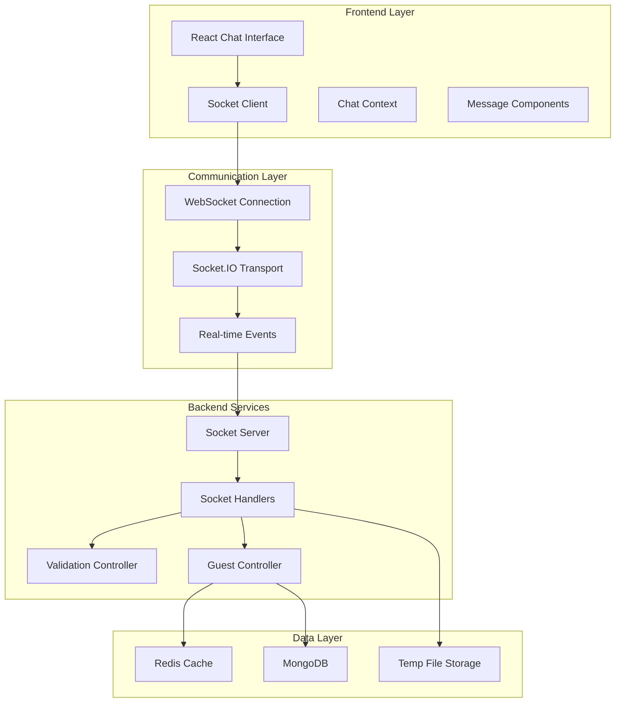

**Diagram sources**
- [web/lib/socket.ts](file://web/lib/socket.ts#L1-L50)
- [backend/src/socket/socketServer.js](file://backend/src/socket/socketServer.js#L58-L123)
- [backend/src/socket/socketHandlers.js](file://backend/src/socket/socketHandlers.js#L1-L50)

**Section sources**
- [backend/README.md](file://backend/README.md#L1-L100)
- [backend/QUICK_REFERENCE.md](file://backend/QUICK_REFERENCE.md#L1-L50)

## Message Lifecycle

The message lifecycle encompasses the complete journey from user input to delivery confirmation, involving multiple stages of validation, transmission, and status tracking:

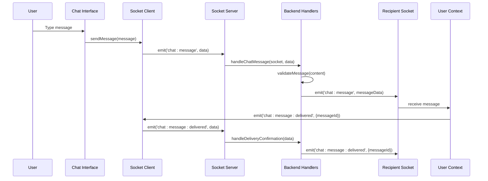

**Diagram sources**
- [web/lib/socket.ts](file://web/lib/socket.ts#L200-L210)
- [backend/src/socket/socketHandlers.js](file://backend/src/socket/socketHandlers.js#L276-L350)

### Message Structure

Each message in the system follows a standardized structure that ensures consistency across different message types:

| Field | Type | Description | Example |
|-------|------|-------------|---------|
| `id` | string | Unique message identifier | `"msg_1234567890_abc123"` |
| `senderId` | string | Originating user identifier | `"guest_user-123"` |
| `senderUsername` | string | Display name of sender | `"CoolPanda123"` |
| `type` | string | Message type | `"text" \| "file" \| "voice"` |
| `content` | string \| object | Message payload | `"Hello world!"` or `{filename: "doc.pdf"}` |
| `timestamp` | string | ISO formatted timestamp | `"2024-01-15T10:30:00.000Z"` |
| `status` | string | Delivery status | `"sending" \| "sent" \| "delivered"` |

**Section sources**
- [web/contexts/ChatContext.tsx](file://web/contexts/ChatContext.tsx#L25-L48)
- [backend/src/socket/socketHandlers.js](file://backend/src/socket/socketHandlers.js#L300-L320)

## Socket.IO Implementation

The Socket.IO implementation provides the foundation for real-time communication, handling connection management, event routing, and message broadcasting:

### Connection Management

The socket service implements sophisticated connection handling with automatic reconnection and token refresh capabilities:

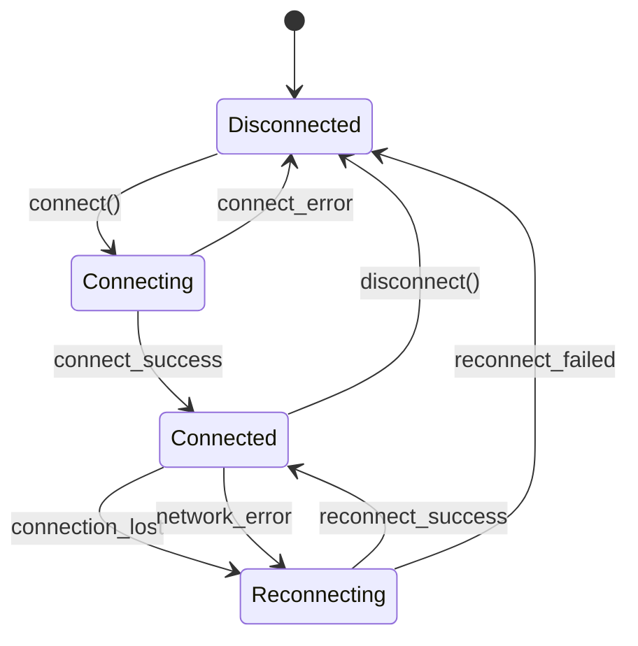

**Diagram sources**
- [web/lib/socket.ts](file://web/lib/socket.ts#L50-L150)

### Event Handling Architecture

The system processes various event categories with dedicated handlers:

| Event Category | Events | Purpose |
|----------------|--------|---------|
| **Connection** | `connect`, `disconnect`, `connect_error` | Socket lifecycle management |
| **Authentication** | `guest:register`, `guest:update` | User session management |
| **Chat** | `chat:message`, `chat:typing:start`, `chat:typing:stop` | Messaging functionality |
| **WebRTC** | `webrtc:offer`, `webrtc:answer`, `webrtc:ice-candidate` | Audio/video calls |
| **Presence** | `presence:online`, `presence:offline` | User availability |
| **Room** | `user:match`, `leave-room`, `close-room` | Chat session management |

**Section sources**
- [web/lib/socket.ts](file://web/lib/socket.ts#L150-L250)
- [backend/src/socket/socketServer.js](file://backend/src/socket/socketServer.js#L94-L123)

## Message Validation

The validation system ensures message integrity and prevents malicious content through comprehensive input sanitization:

### Validation Rules

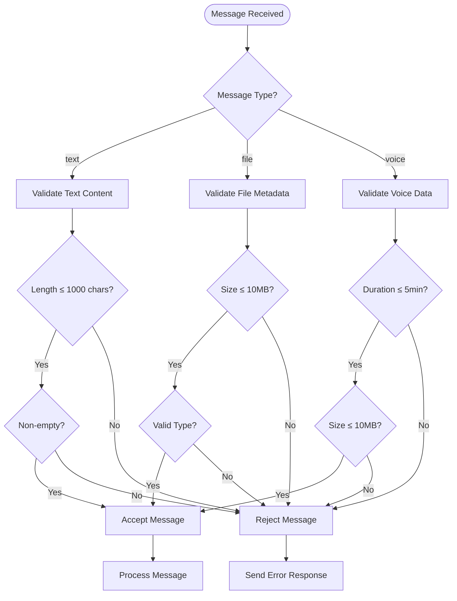

**Diagram sources**
- [backend/src/middleware/validation.js](file://backend/src/middleware/validation.js#L50-L80)

### Validation Implementation

The validation system covers three primary message types with specific constraints:

| Message Type | Validation Rules | Constraints |
|--------------|------------------|-------------|
| **Text Messages** | Length, Non-empty | 1-1000 characters, trim whitespace |
| **File Messages** | Size, Type, Metadata | ≤ 10MB, valid MIME type, filename |
| **Voice Notes** | Duration, Size | 1-300 seconds, ≤ 10MB, audio format |

**Section sources**
- [backend/src/middleware/validation.js](file://backend/src/middleware/validation.js#L50-L111)

## Typing Indicators

Typing indicators provide real-time feedback about user activity, enhancing the conversational experience:

### Typing Event Flow

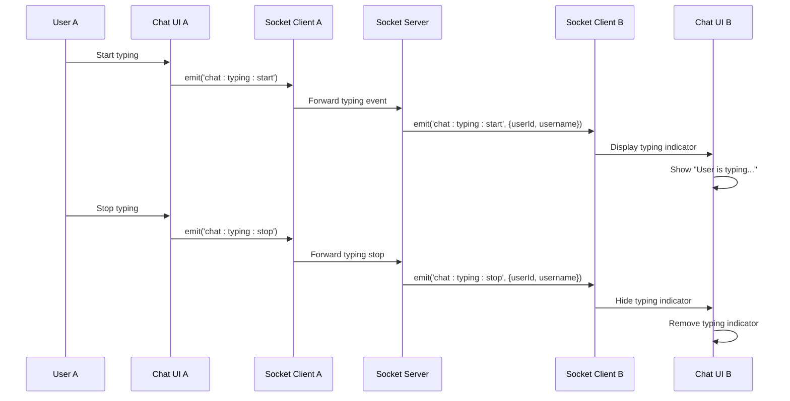

**Diagram sources**
- [backend/src/socket/socketServer.js](file://backend/src/socket/socketServer.js#L119-L148)
- [web/contexts/ChatContext.tsx](file://web/contexts/ChatContext.tsx#L463-L480)

### Typing State Management

The frontend maintains typing state through React state management, with automatic timeouts to prevent persistent indicators:

| State | Trigger | Duration | UI Behavior |
|-------|---------|----------|-------------|
| **Typing Started** | User begins typing | Manual | Show indicator |
| **Typing Stopped** | User stops typing | 1.5 seconds | Hide indicator |
| **Manual Stop** | User clears input | Immediate | Hide indicator |

**Section sources**
- [web/contexts/ChatContext.tsx](file://web/contexts/ChatContext.tsx#L463-L480)
- [backend/src/socket/socketServer.js](file://backend/src/socket/socketServer.js#L119-L148)

## Message Status Tracking

The system implements a three-stage message status tracking mechanism to provide delivery guarantees:

### Status Flow

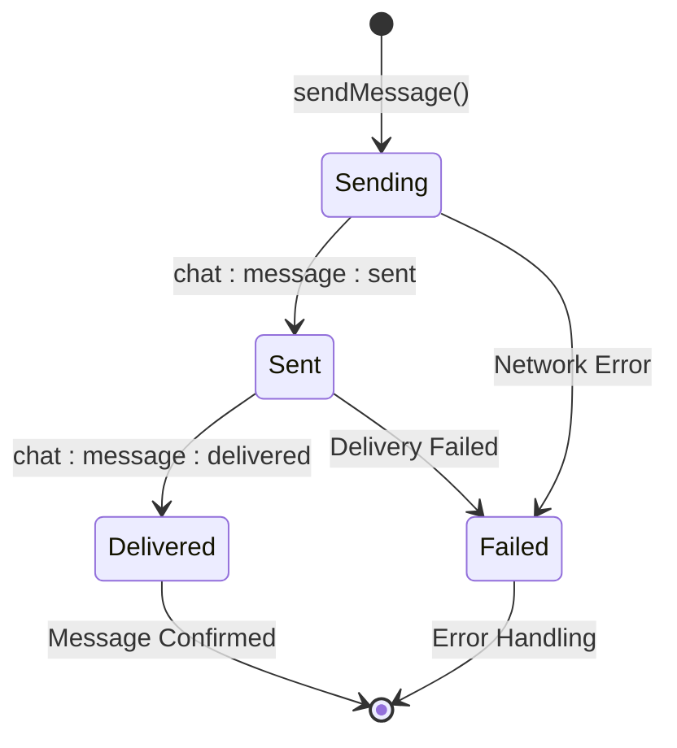

**Diagram sources**
- [web/contexts/ChatContext.tsx](file://web/contexts/ChatContext.tsx#L383-L418)

### Status Implementation Details

The message status system operates through multiple socket events:

| Status | Event | Purpose | UI Indicator |
|--------|-------|---------|--------------|
| **Sending** | Local state | Message queued for sending | Clock icon |
| **Sent** | `chat:message:sent` | Confirmation from sender | Checkmark (light) |
| **Delivered** | `chat:message:delivered` | Confirmation from recipient | Checkmark (dark) |
| **Read** | Manual (future) | Message viewed by recipient | Double checkmark |

**Section sources**
- [web/contexts/ChatContext.tsx](file://web/contexts/ChatContext.tsx#L383-L418)
- [backend/src/socket/socketHandlers.js](file://backend/src/socket/socketHandlers.js#L320-L340)

## Chat Interface Components

The chat interface consists of several interconnected components that work together to provide a seamless user experience:

### Component Architecture

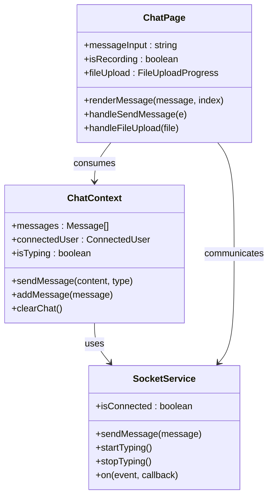

**Diagram sources**
- [web/contexts/ChatContext.tsx](file://web/contexts/ChatContext.tsx#L50-L100)
- [web/app/chat/page.tsx](file://web/app/chat/page.tsx#L50-L100)

### Message Rendering Logic

The message rendering system handles different message types with appropriate visual representations:

| Message Type | Rendering Method | Visual Elements | Status Indicators |
|--------------|------------------|-----------------|-------------------|
| **Text** | Standard bubble | Content + timestamp | Status icons |
| **File** | File preview | Thumbnail + metadata | Download button |
| **Voice** | Audio player | Waveform + duration | Play controls |
| **System** | Centered banner | Notification text | None |

**Section sources**
- [web/app/chat/page.tsx](file://web/app/chat/page.tsx#L897-L1200)
- [web/contexts/ChatContext.tsx](file://web/contexts/ChatContext.tsx#L598-L644)

## Message History Management

The system implements comprehensive message history management with both client-side and server-side considerations:

### Storage Strategy

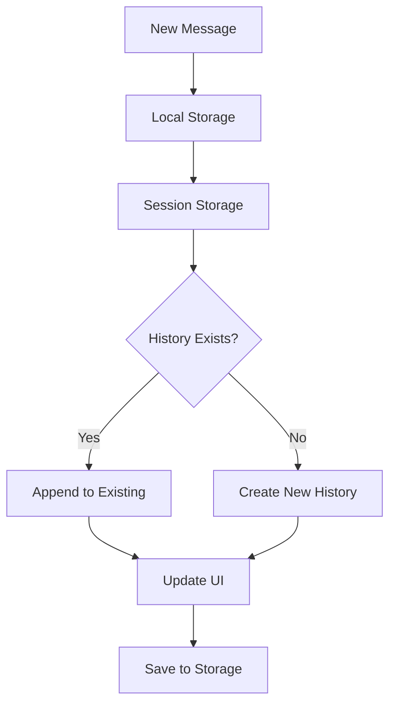

**Diagram sources**
- [web/contexts/ChatContext.tsx](file://web/contexts/ChatContext.tsx#L600-L650)

### History Persistence

The system uses sessionStorage for guest users to ensure data persistence across page reloads while maintaining privacy:

| Storage Type | Scope | Lifetime | Use Case |
|--------------|-------|----------|----------|
| **sessionStorage** | Guest users | Session duration | Chat history, user preferences |
| **localStorage** | Authenticated users | Permanent | User settings, preferences |
| **Memory** | Temporary data | Page load | Active connections, current state |

**Section sources**
- [web/contexts/ChatContext.tsx](file://web/contexts/ChatContext.tsx#L600-L672)

## Network Resilience

The system implements multiple layers of network resilience to handle interruptions and provide seamless user experience:

### Reconnection Strategy

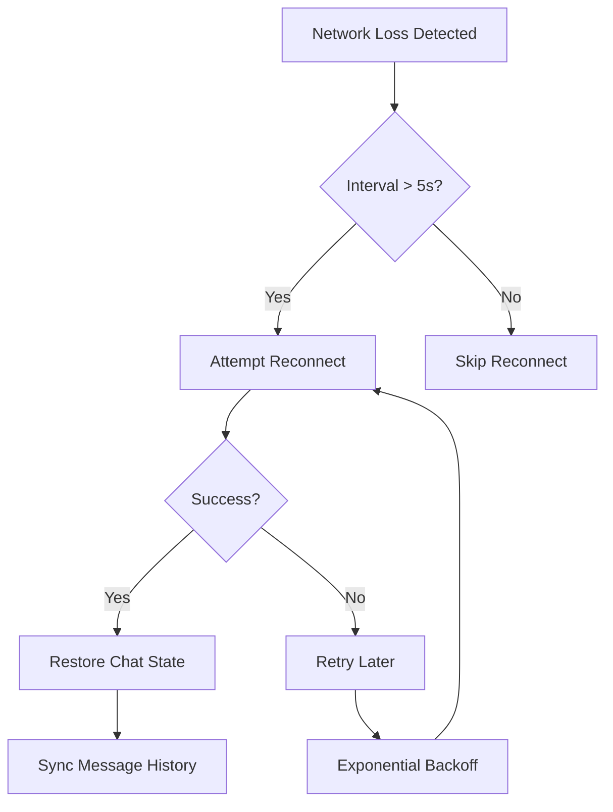

**Diagram sources**
- [web/lib/socket.ts](file://web/lib/socket.ts#L100-L200)

### Error Recovery Mechanisms

The system handles various failure scenarios with appropriate recovery strategies:

| Failure Type | Detection Method | Recovery Action | User Impact |
|--------------|------------------|-----------------|-------------|
| **Connection Lost** | Socket disconnect event | Automatic reconnection | Brief interruption |
| **Token Expired** | Authentication error | Session regeneration | Seamless continuation |
| **Network Offline** | Browser online/offline events | Queue messages | Messages sent on recovery |
| **Server Unavailable** | Connection timeout | Exponential backoff | Gradual retry |

**Section sources**
- [web/lib/socket.ts](file://web/lib/socket.ts#L150-L300)
- [backend/src/socket/socketHandlers.js](file://backend/src/socket/socketHandlers.js#L40-L80)

## Performance Considerations

The system is optimized for handling high message volumes and maintaining responsive user interfaces:

### Message Queueing Strategy

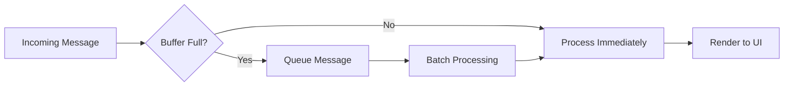

### Performance Optimizations

| Optimization | Implementation | Benefit | Trade-off |
|--------------|----------------|---------|-----------|
| **Virtual Scrolling** | Render only visible messages | Memory efficiency | Complexity |
| **Message Batching** | Group multiple messages | Reduced DOM updates | Latency increase |
| **Debounced Typing** | 1.5s typing timeout | Reduced server load | User experience |
| **Connection Pooling** | Reuse WebSocket connections | Lower overhead | Resource usage |

### Scalability Features

The backend implements several scalability features for high-volume deployments:

| Feature | Technology | Purpose | Scaling Impact |
|---------|------------|---------|----------------|
| **Redis Adapter** | Socket.IO Redis | Multi-instance support | Horizontal scaling |
| **Rate Limiting** | Custom middleware | DDoS protection | Fair resource usage |
| **Message Batching** | Backend processing | Reduced network traffic | Improved throughput |
| **Compression** | Built-in Socket.IO | Bandwidth optimization | CPU vs bandwidth trade-off |

**Section sources**
- [backend/src/socket/socketHandlers.js](file://backend/src/socket/socketHandlers.js#L700-L770)

## Common Issues and Solutions

### Message Loss During Network Interruptions

**Problem**: Messages may be lost when network connectivity is temporarily interrupted.

**Solution**: The system implements client acknowledgments and automatic retry mechanisms:

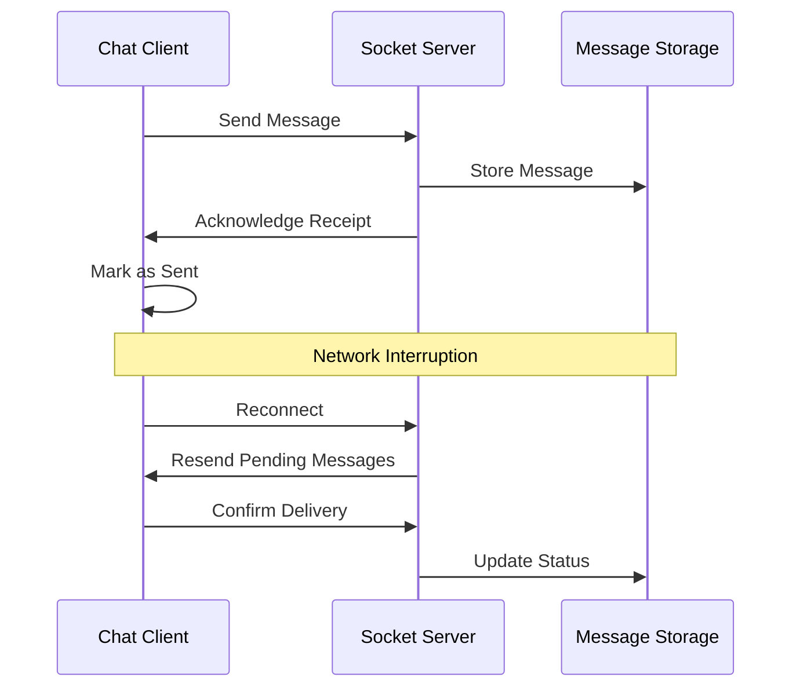

**Diagram sources**
- [web/contexts/ChatContext.tsx](file://web/contexts/ChatContext.tsx#L383-L418)

### Typing Indicator Synchronization Issues

**Problem**: Typing indicators may not sync properly between users.

**Solution**: Implement proper event ordering and cleanup:

| Issue | Cause | Solution | Implementation |
|-------|-------|----------|----------------|
| **Stuck Indicators** | Missing stop events | Automatic timeout | 1.5s typing timeout |
| **Duplicate Events** | Multiple simultaneous typing | Event deduplication | Debounced typing events |
| **Missing Updates** | Connection drops | Reconnection sync | Event replay on reconnect |

### Message Ordering Problems

**Problem**: Messages may appear out of order due to network latency.

**Solution**: Implement message sequencing and ordering:

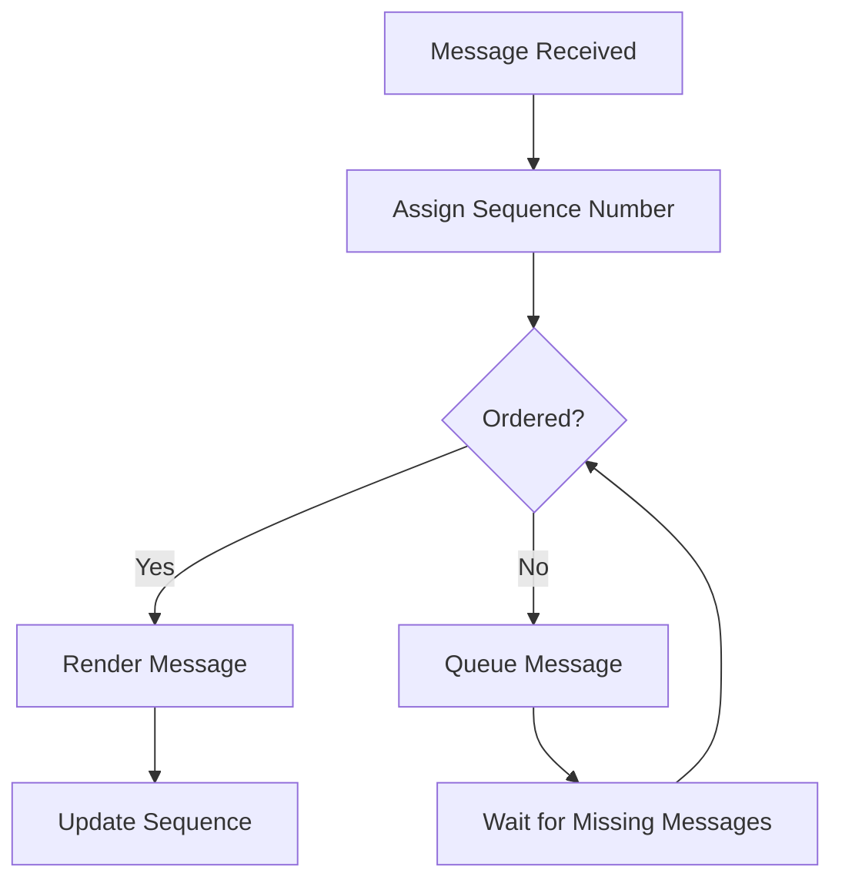

**Diagram sources**
- [web/contexts/ChatContext.tsx](file://web/contexts/ChatContext.tsx#L598-L644)

### Performance Degradation with Large Message History

**Problem**: Chat interface becomes slow with extensive message history.

**Solution**: Implement message pagination and lazy loading:

| Strategy | Implementation | Benefit | Considerations |
|----------|----------------|---------|----------------|
| **Pagination** | Load messages in batches | Reduced initial load | User experience |
| **Lazy Loading** | Load messages on scroll | Memory efficiency | Complexity |
| **Message Trimming** | Remove old messages | Storage optimization | Data retention |
| **Virtual Scrolling** | Render only visible items | Performance boost | Implementation cost |

**Section sources**
- [web/contexts/ChatContext.tsx](file://web/contexts/ChatContext.tsx#L600-L672)
- [backend/src/socket/socketHandlers.js](file://backend/src/socket/socketHandlers.js#L276-L350)