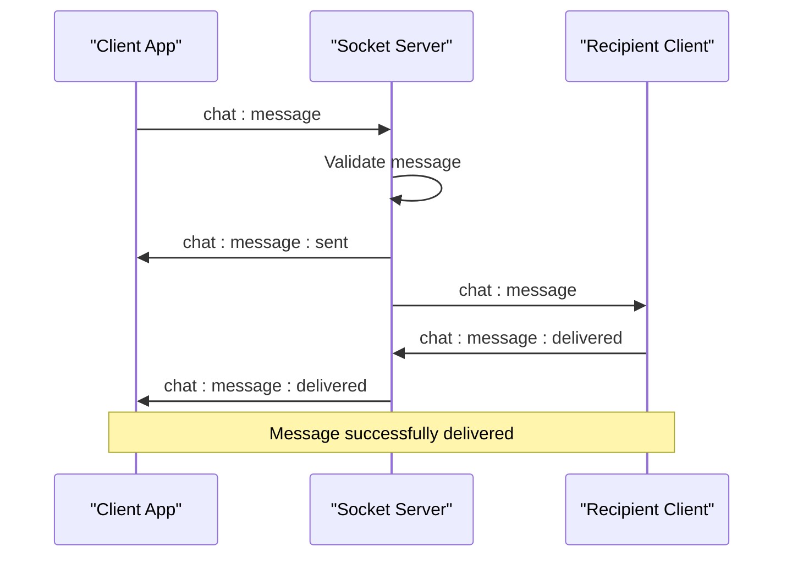
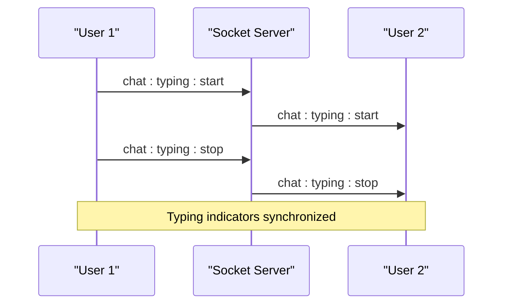
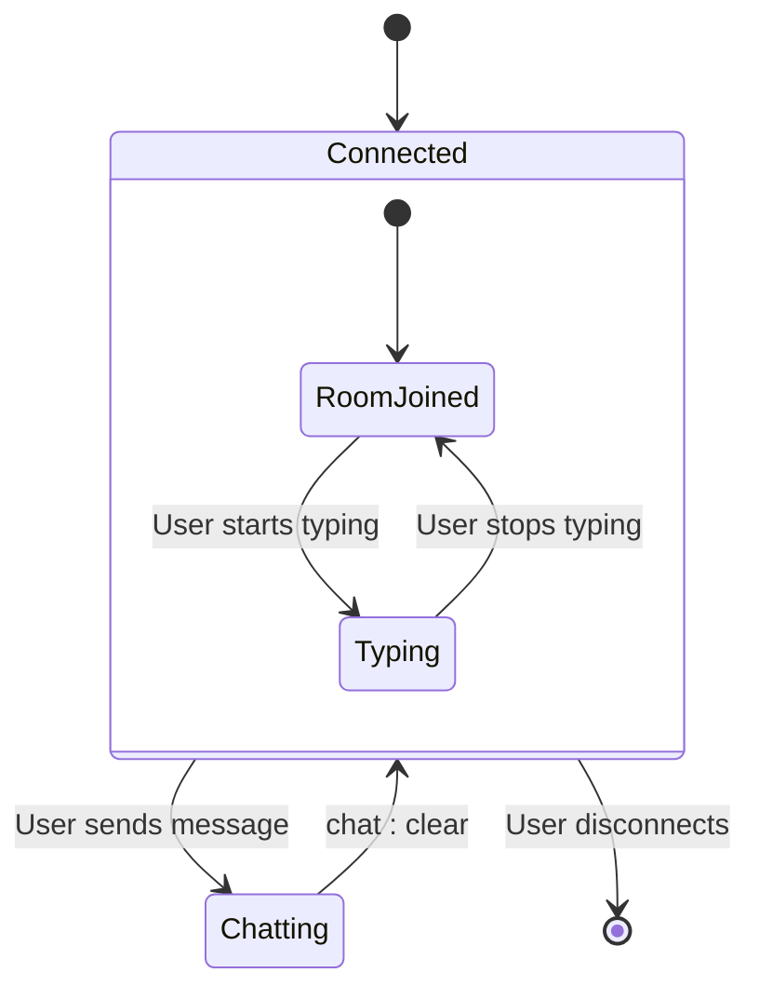
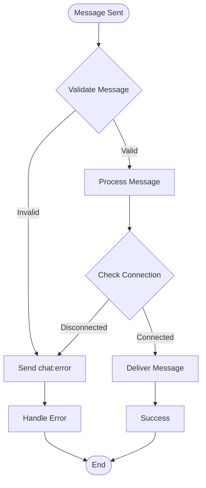
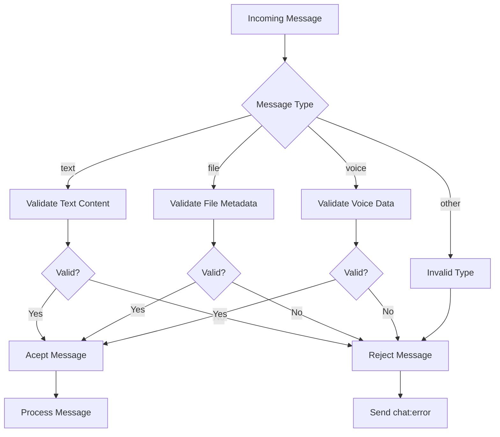

# Chat Messaging System API Documentation

<cite>
**Referenced Files in This Document**
- [socketHandlers.js](file://backend/src/socket/socketHandlers.js)
- [socketServer.js](file://backend/src/socket/socketServer.js)
- [socket.ts](file://web/lib/socket.ts)
- [validation.js](file://backend/src/middleware/validation.js)
- [ChatContext.tsx](file://web/contexts/ChatContext.tsx)
- [socketHandlers.messaging.test.js](file://backend/src/socket/__tests__/socketHandlers.messaging.test.js)
- [API_DOCUMENTATION.md](file://backend/API_DOCUMENTATION.md)
- [QUICK_REFERENCE.md](file://backend/QUICK_REFERENCE.md)
</cite>

## Table of Contents
1. [Introduction](#introduction)
2. [Message Types and Payload Structure](#message-types-and-payload-structure)
3. [Core Chat Events](#core-chat-events)
4. [Message Delivery Confirmation Flow](#message-delivery-confirmation-flow)
5. [Typing Indicators](#typing-indicators)
6. [Chat Room Management](#chat-room-management)
7. [Error Handling](#error-handling)
8. [Frontend Implementation](#frontend-implementation)
9. [Message Validation](#message-validation)
10. [Integration Examples](#integration-examples)

## Introduction

The Realtime Chat App implements a comprehensive WebSocket-based messaging system using Socket.IO for real-time communication between users. The system supports multiple message types (text, file, voice), delivery confirmations, typing indicators, and robust error handling mechanisms.

The chat system operates on a guest-user model where users can connect anonymously and engage in real-time conversations through a matching system. All communications are secured through JWT authentication and validated for content integrity.

## Message Types and Payload Structure

### Supported Message Types

The chat system supports three distinct message types, each with specific payload structures:

#### Text Messages
```typescript
interface TextMessage {
  type: 'text';
  content: string;
  timestamp: string;
}
```

#### File Messages
```typescript
interface FileMessage {
  type: 'file';
  content: {
    filename: string;
    fileType: 'image' | 'video' | 'audio' | 'document';
    fileSize: number;
    fileUrl: string;
  };
  timestamp: string;
}
```

#### Voice Messages
```typescript
interface VoiceMessage {
  type: 'voice';
  content: {
    filename: string;
    duration: number;
    fileSize: number;
    fileUrl: string;
  };
  timestamp: string;
}
```

### Common Message Properties

All message types share these common properties:
- **id**: Generated unique message identifier (`msg_timestamp_randomString`)
- **senderId**: Identifier of the message sender
- **senderUsername**: Username of the message sender
- **timestamp**: ISO formatted timestamp of message creation
- **status**: Current delivery status (`sending`, `sent`, `delivered`)

**Section sources**
- [socketHandlers.js](file://backend/src/socket/socketHandlers.js#L316-L358)
- [validation.js](file://backend/src/middleware/validation.js#L65-L95)

## Core Chat Events

### Client → Server: chat:message

The primary event for sending messages from clients to the server.

**Event Signature:**
```javascript
socket.emit('chat:message', {
  type: 'text' | 'file' | 'voice',
  content: string | object,
  timestamp: string
});
```

**Processing Flow:**
1. **Authentication Verification**: Validates guest session and connection status
2. **Message Type Validation**: Checks content format based on message type
3. **Delivery Confirmation**: Sends immediate acknowledgment to sender
4. **Recipient Notification**: Forwards message to connected user
5. **Status Updates**: Provides delivery confirmations

**Section sources**
- [socketHandlers.js](file://backend/src/socket/socketHandlers.js#L276-L358)
- [socketServer.js](file://backend/src/socket/socketServer.js#L85-L87)

### Server → Client: chat:message

Broadcasts received messages to the intended recipient.

**Event Signature:**
```javascript
socket.on('chat:message', (message) => {
  // Process received message
});
```

**Message Object Structure:**
```javascript
{
  id: string,
  senderId: string,
  senderUsername: string,
  type: 'text' | 'file' | 'voice',
  content: string | object,
  timestamp: string
}
```

**Section sources**
- [socketHandlers.js](file://backend/src/socket/socketHandlers.js#L330-L345)

## Message Delivery Confirmation Flow

### chat:message:sent (Sender Confirmation)

Sent immediately after successful message processing to confirm receipt by the server.

**Event Signature:**
```javascript
socket.on('chat:message:sent', (data) => {
  // Update message status to "sent"
});
```

**Confirmation Data:**
```javascript
{
  messageId: string,      // Generated message ID
  timestamp: string,      // Confirmation timestamp
  status: 'sent'         // Delivery status
}
```

### chat:message:delivered (Recipient Confirmation)

Sent when the recipient acknowledges receiving the message.

**Event Signature:**
```javascript
socket.on('chat:message:delivered', (data) => {
  // Update message status to "delivered"
});
```

**Confirmation Data:**
```javascript
{
  messageId: string,      // Message ID being confirmed
  timestamp: string,      // Delivery confirmation timestamp
  status: 'delivered'    // Final delivery status
}
```

### Delivery Flow Sequence



**Diagram sources**
- [socketHandlers.js](file://backend/src/socket/socketHandlers.js#L330-L350)
- [ChatContext.tsx](file://web/contexts/ChatContext.tsx#L383-L418)

**Section sources**
- [socketHandlers.js](file://backend/src/socket/socketHandlers.js#L330-L350)
- [ChatContext.tsx](file://web/contexts/ChatContext.tsx#L383-L418)

## Typing Indicators

### chat:typing:start

Notifies the recipient that the user has started typing.

**Event Signature:**
```javascript
socket.emit('chat:typing:start');
```

**Event Data:**
```javascript
{
  userId: string,        // Typing user ID
  username: string       // Typing user username
}
```

### chat:typing:stop

Notifies the recipient that the user has stopped typing.

**Event Signature:**
```javascript
socket.emit('chat:typing:stop');
```

**Event Data:**
```javascript
{
  userId: string,        // Stopped typing user ID
  username: string       // Stopped typing user username
}
```

### Typing Indicator Flow



**Diagram sources**
- [socketServer.js](file://backend/src/socket/socketServer.js#L140-L165)

**Section sources**
- [socketServer.js](file://backend/src/socket/socketServer.js#L140-L165)
- [ChatContext.tsx](file://web/contexts/ChatContext.tsx#L495-L507)

## Chat Room Management

### chat:clear

Initiates room cleanup and notifies both users of chat termination.

**Event Signature:**
```javascript
socket.emit('chat:clear');
```

**Cleanup Process:**
1. **Room Notification**: Broadcasts `room:user_left` to the room
2. **Temporary File Cleanup**: Removes all temporary files for the room
3. **Presence Updates**: Updates user presence status
4. **Confirmation**: Sends `chat:clear:confirmed` to the initiating user

### chat:cleared

Received by the other user when the chat is cleared by the initiator.

**Event Signature:**
```javascript
socket.on('chat:cleared', (data) => {
  // Clear chat history and show notification
});
```

**Event Data:**
```javascript
{
  userId: string,        // User who initiated chat clear
  username: string,      // Username of user who initiated chat clear
  reason: string         // Reason for chat termination
}
```

### Room Lifecycle Events



**Section sources**
- [socketHandlers.js](file://backend/src/socket/socketHandlers.js#L360-L420)

## Error Handling

### chat:error

Universal error event for handling various failure scenarios.

**Event Signature:**
```javascript
socket.on('chat:error', (error) => {
  // Handle error appropriately
});
```

**Common Error Scenarios:**
- **Invalid Message Format**: Content validation failures
- **User Not Connected**: Attempting to send messages without active connection
- **Connected User Unavailable**: Recipient socket not found
- **Session Expired**: Guest session has expired
- **General Processing Errors**: Server-side processing failures

**Error Data Structure:**
```javascript
{
  message: string,       // Human-readable error description
  code?: string,         // Machine-readable error code
  details?: object       // Additional error context
}
```

### Error Handling Flow



**Section sources**
- [socketHandlers.js](file://backend/src/socket/socketHandlers.js#L316-L358)
- [socketHandlers.messaging.test.js](file://backend/src/socket/__tests__/socketHandlers.messaging.test.js#L203-L249)

## Frontend Implementation

### SocketService Methods

The frontend implements a comprehensive SocketService for managing chat operations:

#### sendMessage()
```typescript
sendMessage(message: {
  type: 'text' | 'file' | 'voice';
  content: string | object;
  timestamp: string;
}): void;
```

#### confirmMessageDelivered()
```typescript
confirmMessageDelivered(messageId: string): void;
```

#### startTyping()
```typescript
startTyping(): void;
```

#### stopTyping()
```typescript
stopTyping(): void;
```

### Event Listener Integration

```typescript
// Message delivery tracking
socketService.on("chat:message:sent", (data) => {
  // Update message status to "sent"
});

socketService.on("chat:message:delivered", (data) => {
  // Update message status to "delivered"
});

socketService.on("chat:cleared", (data) => {
  // Clear chat history and show notification
});

socketService.on("chat:typing:start", (data) => {
  // Show typing indicator
});

socketService.on("chat:typing:stop", (data) => {
  // Hide typing indicator
});
```

**Section sources**
- [socket.ts](file://web/lib/socket.ts#L150-L280)
- [ChatContext.tsx](file://web/contexts/ChatContext.tsx#L383-L507)

## Message Validation

### Content Validation Rules

The system implements comprehensive validation for different message types:

#### Text Message Validation
- **Minimum Length**: 1 character
- **Maximum Length**: 1000 characters
- **Format**: Non-empty string

#### File Message Validation
- **Filename**: 1-255 characters
- **File Type**: Must be one of: `image`, `video`, `audio`, `document`
- **File Size**: Maximum 10MB (10,485,760 bytes)

#### Voice Message Validation
- **Duration**: 1-300 seconds (5 minutes)
- **File Size**: Maximum 10MB (10,485,760 bytes)

### Validation Implementation



**Diagram sources**
- [validation.js](file://backend/src/middleware/validation.js#L65-L95)

**Section sources**
- [validation.js](file://backend/src/middleware/validation.js#L65-L95)
- [socketHandlers.js](file://backend/src/socket/socketHandlers.js#L290-L315)

## Integration Examples

### Sending a Text Message

```typescript
// Frontend implementation
const sendMessage = (content: string) => {
  const message = {
    type: 'text',
    content: content,
    timestamp: new Date().toISOString()
  };
  
  socketService.sendMessage(message);
  
  // Update UI with temporary message
  const tempMessage = {
    id: `temp_${Date.now()}`,
    senderId: currentUser.id,
    senderUsername: currentUser.username,
    type: 'text',
    content: content,
    timestamp: new Date().toISOString(),
    status: 'sending'
  };
  
  addMessage(tempMessage);
};
```

### Handling Message Delivery

```typescript
// Frontend implementation
const handleDelivery = (messageId: string) => {
  // Confirm delivery to server
  socketService.confirmMessageDelivered(messageId);
  
  // Update message status in UI
  updateMessageStatus(messageId, 'delivered');
};
```

### Typing Indicator Implementation

```typescript
// Frontend implementation
let typingTimeout: NodeJS.Timeout;

const handleTyping = () => {
  clearTimeout(typingTimeout);
  
  if (!isTyping) {
    socketService.startTyping();
    setIsTyping(true);
  }
  
  typingTimeout = setTimeout(() => {
    socketService.stopTyping();
    setIsTyping(false);
  }, 3000); // Stop typing after 3 seconds of inactivity
};
```

### Error Recovery

```typescript
// Frontend implementation
const handleError = (error: any) => {
  switch (error.message) {
    case 'You are not connected to any user':
      // Show connection error and offer rematch
      break;
    case 'Connected user is not available':
      // Show availability error
      break;
    case 'Invalid message format':
      // Show validation error
      break;
    default:
      // Show generic error
      break;
  }
};
```

**Section sources**
- [socket.ts](file://web/lib/socket.ts#L150-L280)
- [ChatContext.tsx](file://web/contexts/ChatContext.tsx#L383-L507)