# Connection Lifecycle Events

<cite>
**Referenced Files in This Document**
- [socket.ts](file://web/lib/socket.ts)
- [socketHandlers.js](file://backend/src/socket/socketHandlers.js)
- [api.ts](file://web/lib/api.ts)
- [GuestSessionContext.tsx](file://web/contexts/GuestSessionContext.tsx)
- [ChatContext.tsx](file://web/contexts/ChatContext.tsx)
- [ConnectionStatusDebug.tsx](file://web/components/ConnectionStatusDebug.tsx)
- [socket.test.ts](file://web/lib/__tests__/socket.test.ts)
- [API_DOCUMENTATION.md](file://backend/API_DOCUMENTATION.md)
</cite>

## Table of Contents
1. [Introduction](#introduction)
2. [Connection Establishment](#connection-establishment)
3. [Disconnect Handling](#disconnect-handling)
4. [Reconnection Strategy](#reconnection-strategy)
5. [Error Handling](#error-handling)
6. [Connection Status Monitoring](#connection-status-monitoring)
7. [Token Regeneration Flow](#token-regeneration-flow)
8. [Sequence Diagrams](#sequence-diagrams)
9. [Best Practices](#best-practices)

## Introduction

The Realtime Chat App implements a robust Socket.IO connection lifecycle management system that handles authentication, presence updates, automatic reconnection, and graceful error recovery. This documentation covers the complete connection lifecycle from initial establishment through reconnection scenarios, including automatic token regeneration and proper cleanup procedures.

## Connection Establishment

### Authentication and JWT Token Handling

The connection establishment process begins with JWT token authentication, which serves as the primary authentication mechanism for both authenticated users and guest sessions.

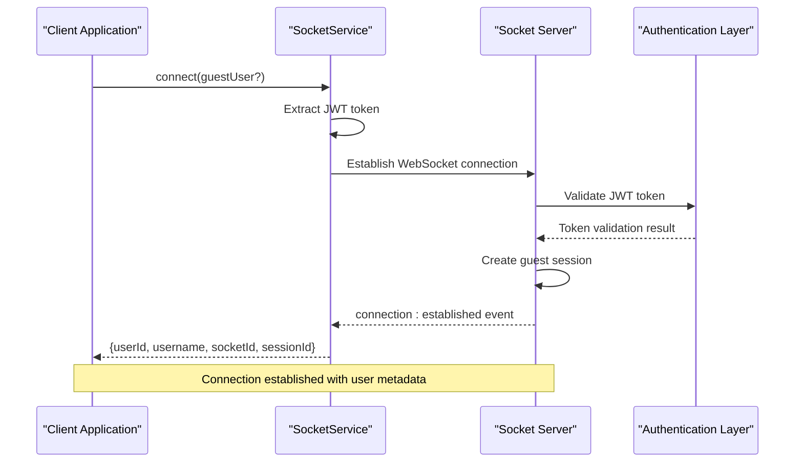

**Diagram sources**
- [socket.ts](file://web/lib/socket.ts#L25-L70)
- [socketHandlers.js](file://backend/src/socket/socketHandlers.js#L15-L60)

### User Metadata Delivery

Upon successful authentication, the server delivers comprehensive user metadata to the client:

| Field | Type | Description | Example |
|-------|------|-------------|---------|
| `userId` | String | Unique user identifier | `"guest_user-123"` |
| `username` | String | User display name | `"CoolPanda1234"` |
| `socketId` | String | Current socket connection ID | `"socket-12345"` |
| `sessionId` | String | Guest session identifier | `"session-12345"` |
| `isGuest` | Boolean | Indicates guest vs authenticated user | `true` |

**Section sources**
- [socketHandlers.js](file://backend/src/socket/socketHandlers.js#L35-L45)
- [socket.ts](file://web/lib/socket.ts#L91-L105)

### Presence Registration

After connection establishment, the system automatically registers the user's presence and updates the connection mappings:

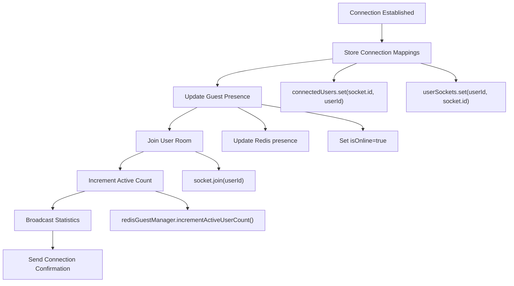

**Diagram sources**
- [socketHandlers.js](file://backend/src/socket/socketHandlers.js#L15-L60)

**Section sources**
- [socketHandlers.js](file://backend/src/socket/socketHandlers.js#L15-L60)

## Disconnect Handling

### Automatic Presence Updates

The disconnect handling system ensures graceful cleanup of user presence and room memberships:

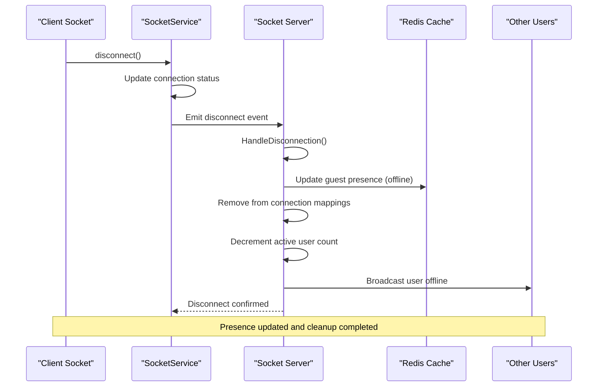

**Diagram sources**
- [socket.ts](file://web/lib/socket.ts#L106-L115)
- [socketHandlers.js](file://backend/src/socket/socketHandlers.js#L70-L120)

### Room Cleanup Procedures

When a user disconnects from a chat session, the system performs comprehensive cleanup:

| Cleanup Action | Description | Implementation |
|----------------|-------------|----------------|
| Room Disconnection | Remove user from chat room | `socket.leave(roomId)` |
| Partner Notification | Inform connected user | `io.to(connectedSocketId).emit('room:closed')` |
| Presence Update | Mark user as offline | `updateGuestPresence(sessionId, {isOnline: false})` |
| Temporary File Cleanup | Remove uploaded files | `tempFileStorage.deleteRoomFiles(roomId)` |
| Statistics Update | Recalculate active counts | `broadcastUserStats()` |

**Section sources**
- [socketHandlers.js](file://backend/src/socket/socketHandlers.js#L70-L120)

## Reconnection Strategy

### Exponential Backoff Configuration

The Socket.IO client implements a sophisticated reconnection strategy with exponential backoff:

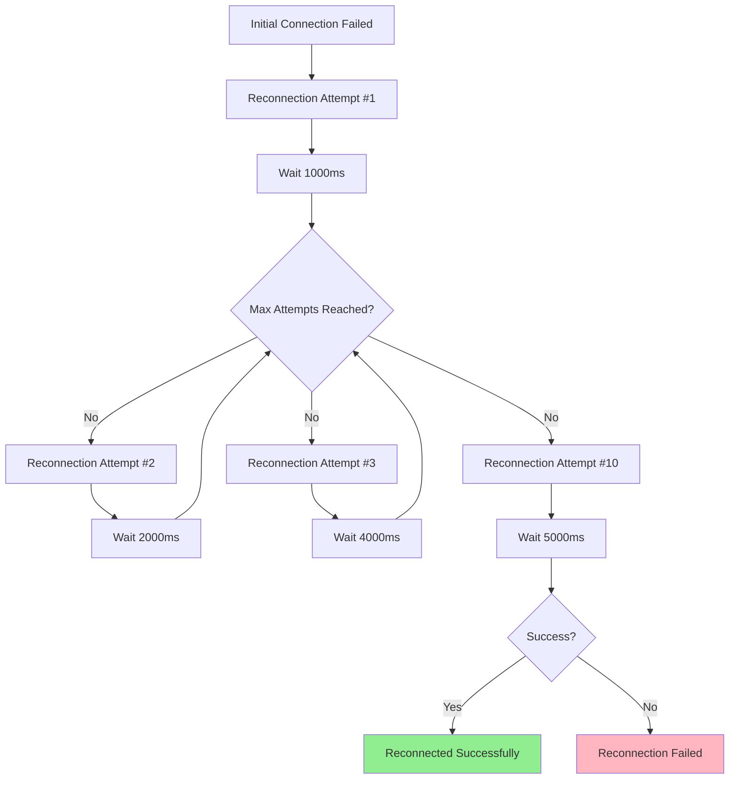

**Diagram sources**
- [socket.ts](file://web/lib/socket.ts#L55-L65)

### Reconnection Event Handling

The system handles various reconnection scenarios with appropriate error detection:

| Event | Purpose | Error Detection |
|-------|---------|-----------------|
| `reconnect_attempt` | Track retry attempts | Monitor attempt number |
| `reconnect` | Successful reconnection | Verify connection status |
| `reconnect_error` | Handle reconnection failures | Check for token/session expiration |
| `reconnect_failed` | Final failure scenario | Complete disconnection |

**Section sources**
- [socket.ts](file://web/lib/socket.ts#L133-L167)

### Force New Connection Prevention

The `forceNew: true` configuration prevents connection sharing between instances:

```typescript
// Socket.IO configuration for preventing connection sharing
this.socket = io(SOCKET_URL, {
  auth: { token: token },
  transports: ["websocket", "polling"],
  reconnection: true,
  reconnectionAttempts: 10,
  reconnectionDelay: 1000,
  reconnectionDelayMax: 5000,
  timeout: 20000,
  forceNew: true, // Prevents connection sharing
});
```

**Section sources**
- [socket.ts](file://web/lib/socket.ts#L55-L65)

## Error Handling

### Authentication Failure Detection

The system implements comprehensive error handling for authentication failures:

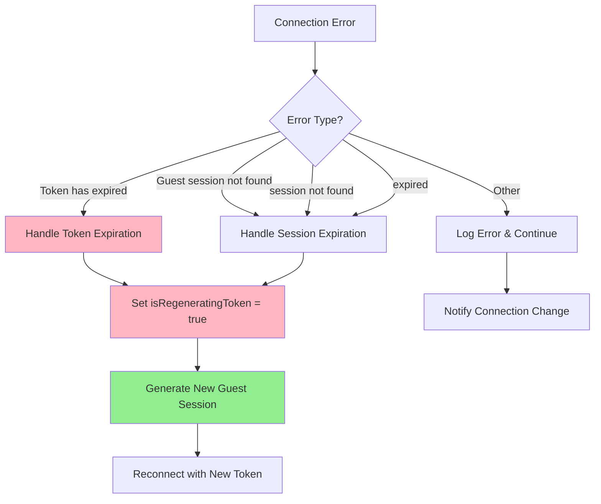

**Diagram sources**
- [socket.ts](file://web/lib/socket.ts#L116-L132)

### Error Classification

The system distinguishes between different types of authentication errors:

| Error Pattern | Detection Method | Action Taken |
|---------------|------------------|--------------|
| Token Expiration | `error.message === "Token has expired"` | Token regeneration |
| Session Not Found | `error.message.includes("session not found")` | Session regeneration |
| Session Expired | `error.message.includes("expired")` | Session regeneration |
| Other Errors | Generic error handling | Connection status update |

**Section sources**
- [socket.ts](file://web/lib/socket.ts#L116-L132)

### API-Level Error Handling

The API layer provides additional error handling for token expiration:

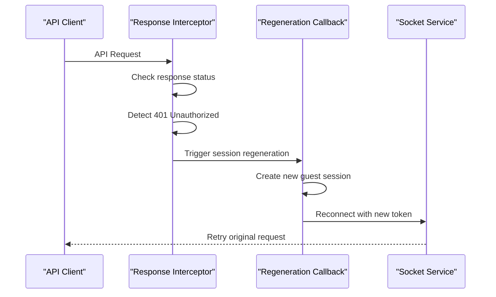

**Diagram sources**
- [api.ts](file://web/lib/api.ts#L35-L75)

**Section sources**
- [api.ts](file://web/lib/api.ts#L35-L75)

## Connection Status Monitoring

### onConnectionChange() Implementation

The connection status monitoring system provides real-time feedback on connection state changes:

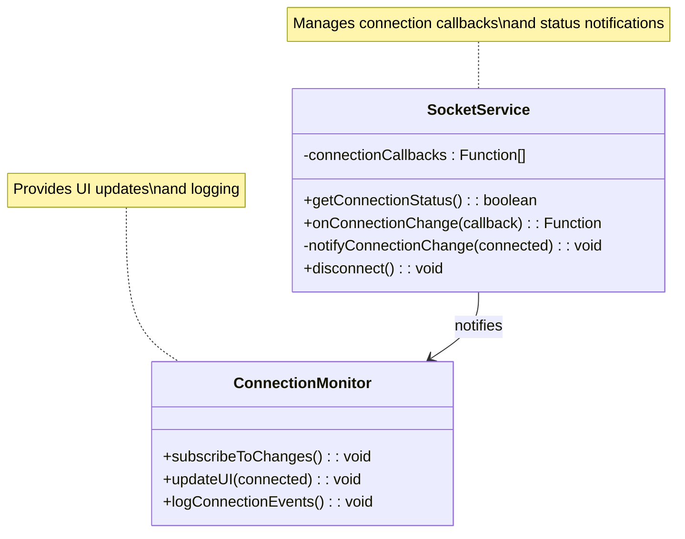

**Diagram sources**
- [socket.ts](file://web/lib/socket.ts#L170-L185)
- [ConnectionStatusDebug.tsx](file://web/components/ConnectionStatusDebug.tsx#L15-L35)

### Proper Disconnection Handling

The system ensures proper cleanup of event listeners and connection resources:

| Cleanup Action | Implementation | Purpose |
|----------------|----------------|---------|
| Event Listener Removal | `events.forEach(event => socketService.off(event))` | Prevent memory leaks |
| Connection Status Update | `this.isConnected = false` | Reflect actual state |
| Presence Update | `this.updateOnlineStatus(false)` | Notify others |
| Resource Cleanup | `this.socket = null` | Free memory |

**Section sources**
- [ChatContext.tsx](file://web/contexts/ChatContext.tsx#L259-L310)
- [socket.ts](file://web/lib/socket.ts#L187-L195)

### Network Connectivity Monitoring

The application monitors network connectivity and handles offline/online transitions:

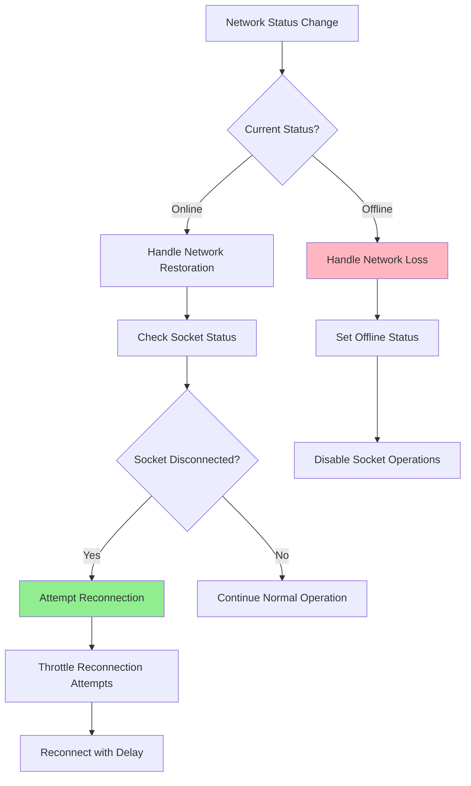

**Diagram sources**
- [ChatContext.tsx](file://web/contexts/ChatContext.tsx#L213-L240)

**Section sources**
- [ChatContext.tsx](file://web/contexts/ChatContext.tsx#L213-L240)

## Token Regeneration Flow

### Automatic Token Regeneration

When authentication tokens expire, the system automatically generates new guest sessions:

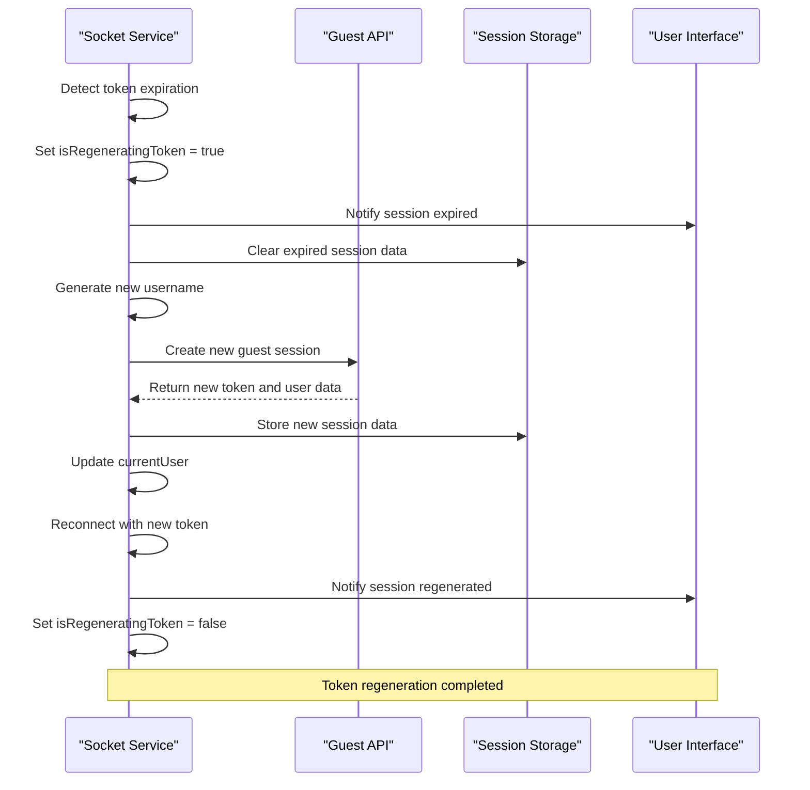

**Diagram sources**
- [socket.ts](file://web/lib/socket.ts#L332-L420)
- [GuestSessionContext.tsx](file://web/contexts/GuestSessionContext.tsx#L120-L150)

### Session Data Management

The token regeneration process manages session data comprehensively:

| Data Type | Storage Location | Update Method |
|-----------|------------------|---------------|
| JWT Token | `sessionStorage` | `sessionStorage.setItem('guestAuthToken', token)` |
| User Data | `sessionStorage` | `sessionStorage.setItem('guest_user_session', JSON.stringify(user))` |
| Device ID | `localStorage` | `localStorage.getItem('guest_deviceId')` |
| Username | Generated | Random adjective + noun + number |

**Section sources**
- [socket.ts](file://web/lib/socket.ts#L332-L420)

### Error Recovery Mechanisms

The system implements multiple layers of error recovery:

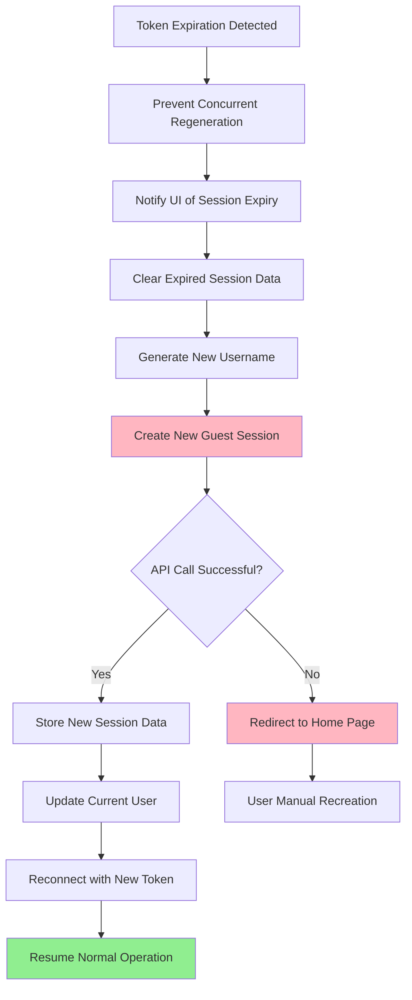

**Diagram sources**
- [socket.ts](file://web/lib/socket.ts#L332-L420)

**Section sources**
- [socket.ts](file://web/lib/socket.ts#L332-L420)

## Sequence Diagrams

### Full Connection Handshake Process

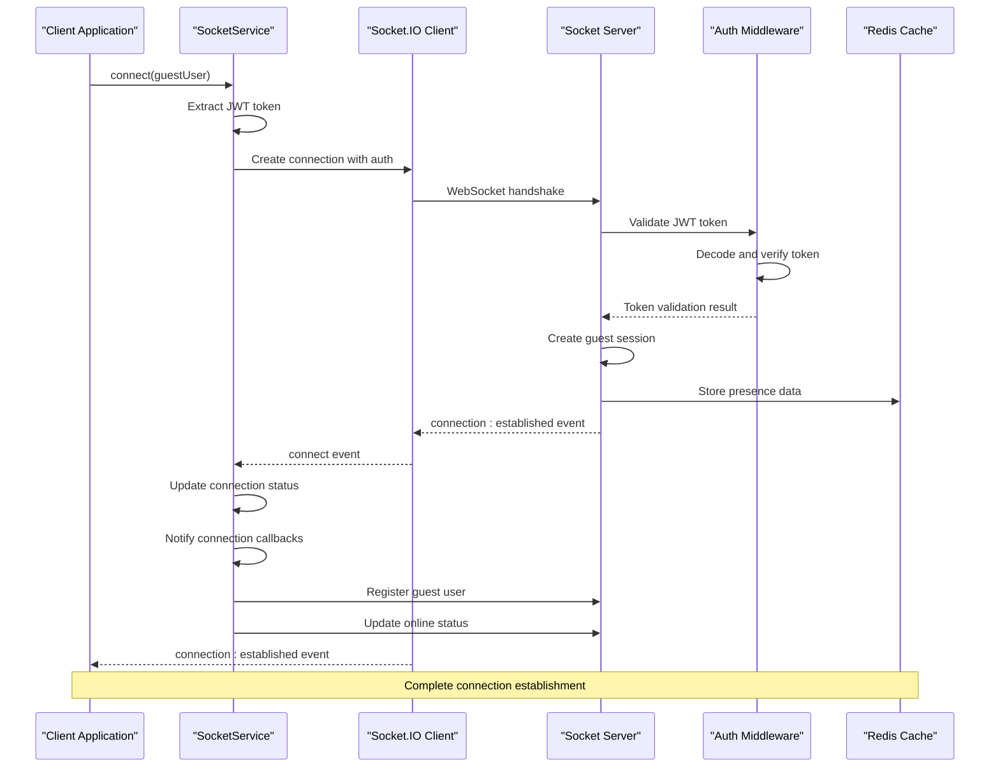

**Diagram sources**
- [socket.ts](file://web/lib/socket.ts#L25-L105)
- [socketHandlers.js](file://backend/src/socket/socketHandlers.js#L15-L60)

### Reconnection Scenario

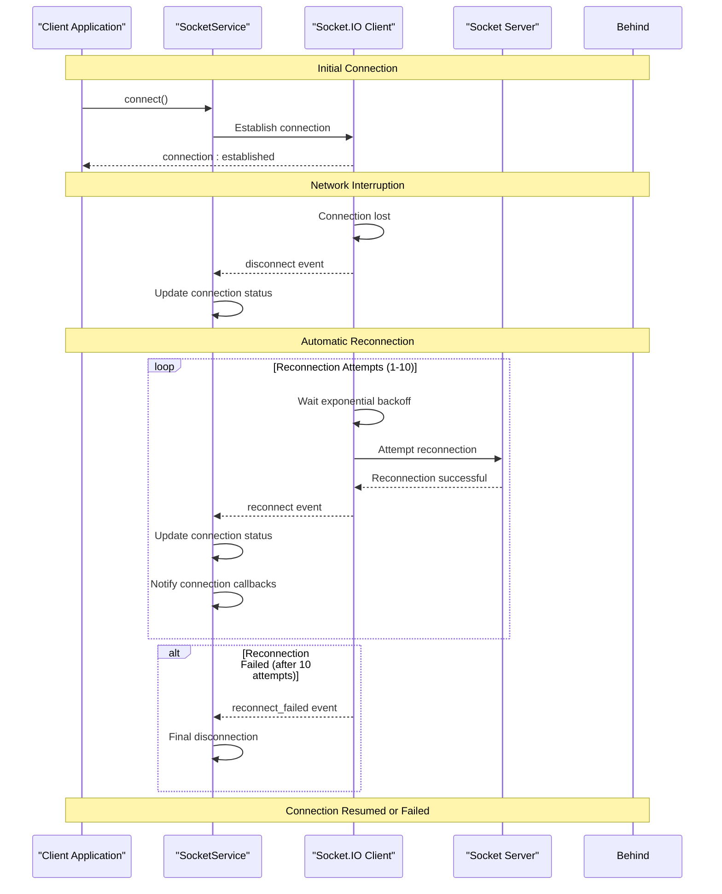

**Diagram sources**
- [socket.ts](file://web/lib/socket.ts#L133-L167)
- [socket.ts](file://web/lib/socket.ts#L116-L132)

### Token Expiration and Regeneration

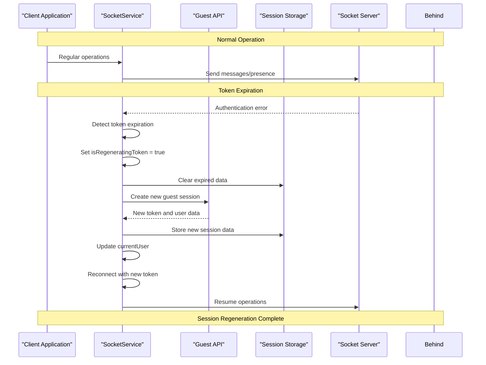

**Diagram sources**
- [socket.ts](file://web/lib/socket.ts#L332-L420)
- [api.ts](file://web/lib/api.ts#L35-L75)

## Best Practices

### Connection Management Guidelines

1. **Always Subscribe to Connection Changes**: Use `onConnectionChange()` to monitor connection status
2. **Proper Cleanup**: Remove event listeners and clean up resources on disconnection
3. **Graceful Degradation**: Handle network interruptions gracefully
4. **Token Management**: Implement automatic token regeneration for expired sessions
5. **Error Handling**: Provide meaningful error messages and recovery options

### Performance Optimization

1. **Throttle Reconnection Attempts**: Use exponential backoff to prevent server overload
2. **Minimize Event Listeners**: Clean up unused listeners to prevent memory leaks
3. **Efficient Presence Updates**: Batch presence updates to reduce network traffic
4. **Selective Reconnection**: Only attempt reconnection when network is available

### Security Considerations

1. **Secure Token Storage**: Use secure storage mechanisms for JWT tokens
2. **Token Validation**: Validate tokens on the server side before processing requests
3. **Rate Limiting**: Implement rate limiting on reconnection attempts
4. **Session Management**: Properly manage guest session lifetimes

### Monitoring and Debugging

1. **Connection Logging**: Log all connection events for debugging
2. **Error Tracking**: Monitor authentication and reconnection errors
3. **Performance Metrics**: Track connection establishment times
4. **User Experience**: Provide clear feedback on connection status

**Section sources**
- [ConnectionStatusDebug.tsx](file://web/components/ConnectionStatusDebug.tsx#L15-L35)
- [socket.ts](file://web/lib/socket.ts#L170-L185)