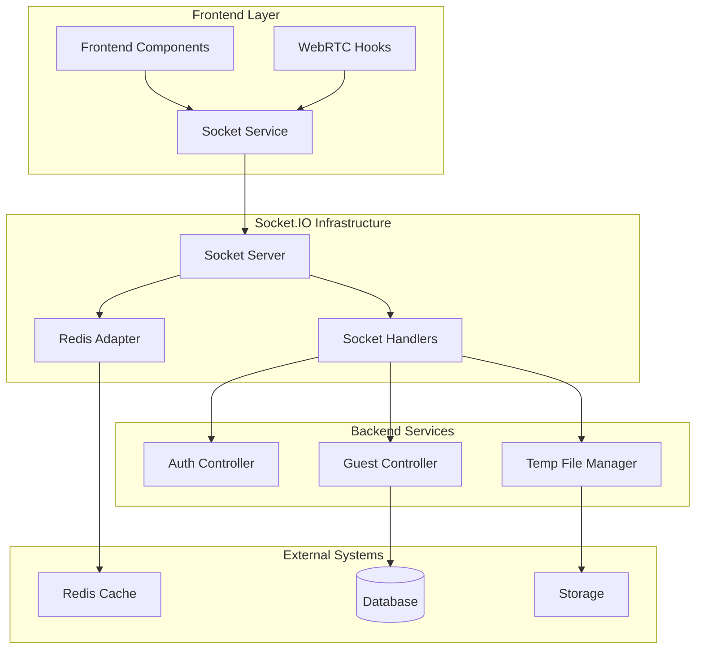
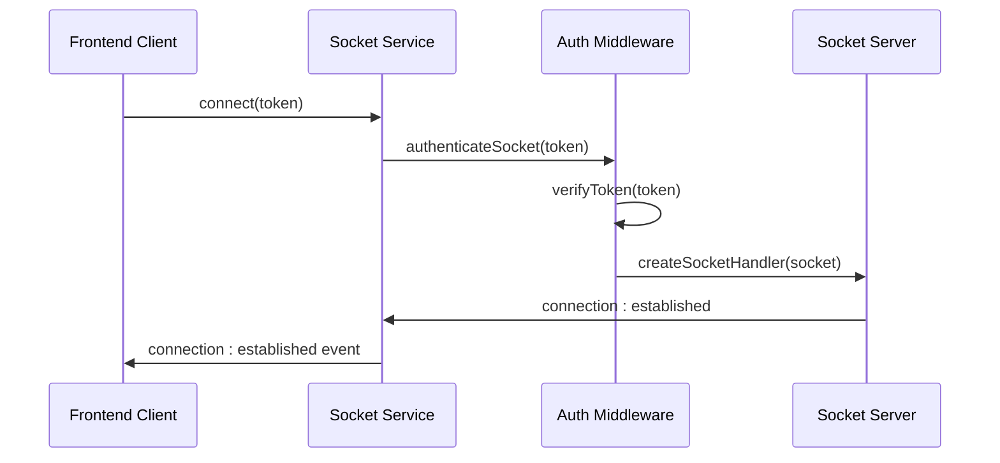
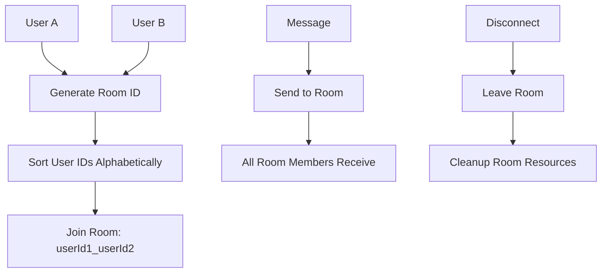
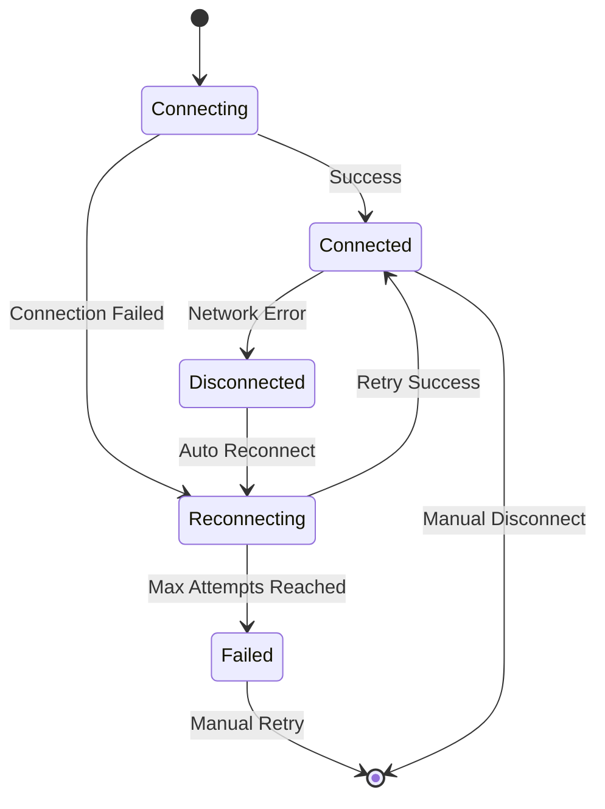
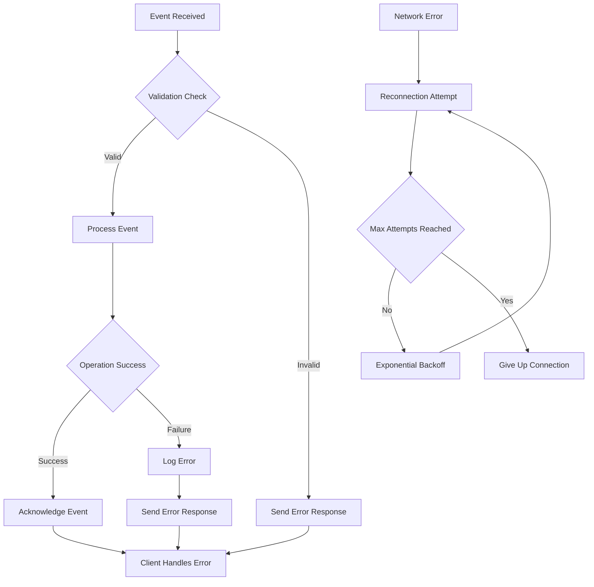
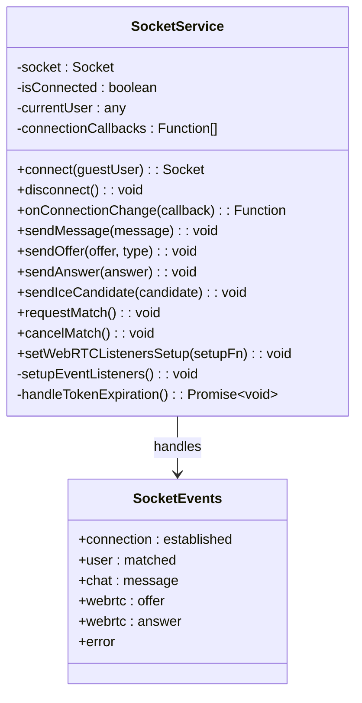
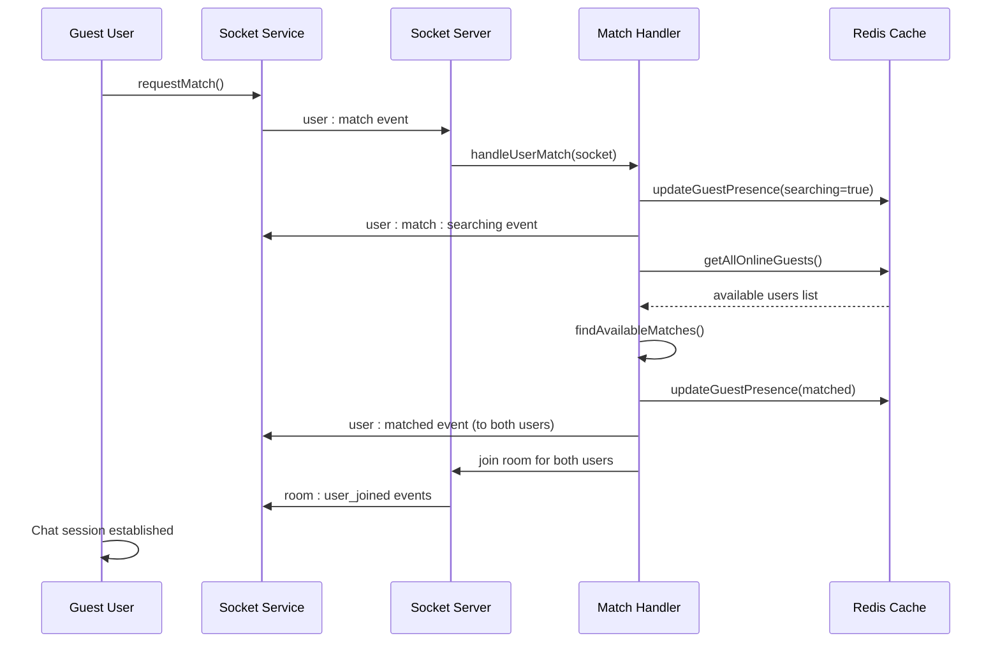
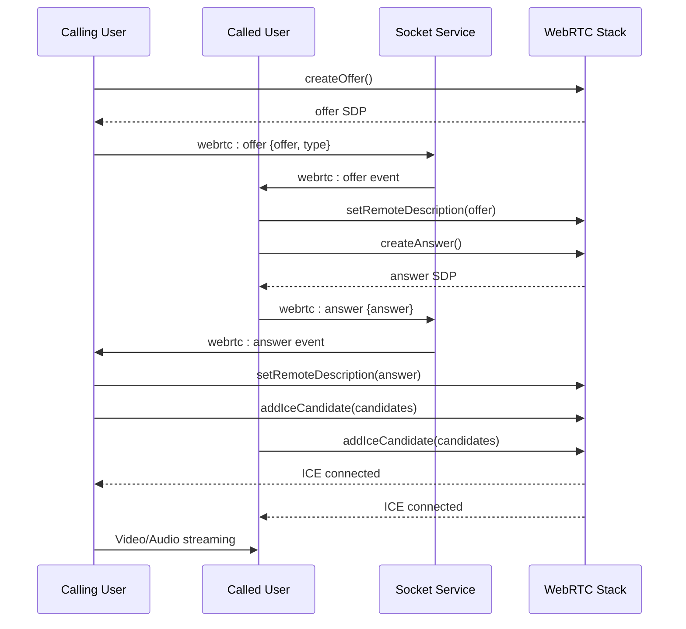
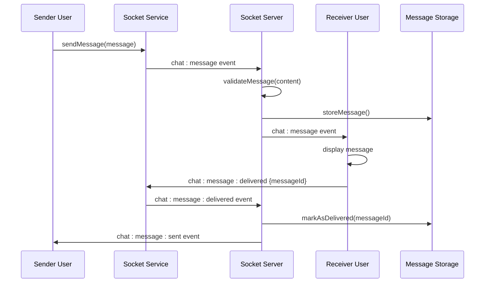

# Socket.IO Event System

<cite>
**Referenced Files in This Document**
- [socketHandlers.js](file://backend/src/socket/socketHandlers.js)
- [socketServer.js](file://backend/src/socket/socketServer.js)
- [socket.ts](file://web/lib/socket.ts)
- [auth.js](file://backend/src/middleware/auth.js)
- [jwt.js](file://backend/src/utils/jwt.js)
- [MatchingInterface.tsx](file://web/components/MatchingInterface.tsx)
- [useWebRTC.ts](file://web/hooks/useWebRTC.ts)
- [VideoCallModal.tsx](file://web/components/VideoCallModal.tsx)
- [socketHandlers.connection.test.js](file://backend/src/socket/__tests__/socketHandlers.connection.test.js)
- [socketHandlers.messaging.test.js](file://backend/src/socket/__tests__/socketHandlers.messaging.test.js)
</cite>

## Table of Contents
1. [Introduction](#introduction)
2. [System Architecture](#system-architecture)
3. [Authentication and Connection](#authentication-and-connection)
4. [Event Categories](#event-categories)
5. [Room-Based Communication](#room-based-communication)
6. [Reconnection Strategies](#reconnection-strategies)
7. [Error Handling Patterns](#error-handling-patterns)
8. [Frontend Integration](#frontend-integration)
9. [Critical Flow Sequences](#critical-flow-sequences)
10. [Best Practices](#best-practices)

## Introduction

The Socket.IO Event System powers real-time communication in the Realtime Chat App, enabling instant messaging, user matching, and WebRTC-powered video calls. Built on a robust foundation of JWT authentication, dynamic room management, and comprehensive error handling, the system provides seamless real-time experiences for guest users.

The system handles multiple event categories including connection lifecycle management, user matching algorithms, chat messaging with delivery confirmations, and sophisticated WebRTC signaling for voice and video calls. All communications occur over secure WebSocket connections with automatic reconnection capabilities and graceful degradation on network failures.

## System Architecture

The Socket.IO Event System follows a layered architecture with clear separation between backend socket handlers, frontend socket service, and real-time communication protocols.



**Diagram sources**
- [socketServer.js](file://backend/src/socket/socketServer.js#L1-L199)
- [socketHandlers.js](file://backend/src/socket/socketHandlers.js#L1-L746)
- [socket.ts](file://web/lib/socket.ts#L1-L370)

**Section sources**
- [socketServer.js](file://backend/src/socket/socketServer.js#L1-L199)
- [socketHandlers.js](file://backend/src/socket/socketHandlers.js#L1-L746)

## Authentication and Connection

### JWT Token Authentication

The system uses JWT tokens for secure guest user authentication during socket connection. Tokens are passed during the WebSocket handshake and validated on the server side.



**Diagram sources**
- [auth.js](file://backend/src/middleware/auth.js#L40-L99)
- [socket.ts](file://web/lib/socket.ts#L37-L67)

### Connection Lifecycle Events

| Event Direction | Event Name | Payload Structure | Triggering Conditions |
|----------------|------------|-------------------|----------------------|
| **Server→Client** | `connection:established` | `{userId, username, socketId, isGuest, sessionId}` | Successful socket connection with valid JWT |
| **Server→Client** | `connection:error` | `{message}` | Authentication failure or connection error |
| **Server→Client** | `error` | `{message}` | General socket error events |

### Handshake Process

The connection authentication process involves several critical steps:

1. **Token Extraction**: JWT token extracted from authentication header or query parameters
2. **Token Validation**: JWT signature verified and expiration checked
3. **Session Verification**: Guest session validated against Redis/Database
4. **Socket Assignment**: User context attached to socket object
5. **Connection Confirmation**: `connection:established` event sent to client

**Section sources**
- [auth.js](file://backend/src/middleware/auth.js#L40-L99)
- [jwt.js](file://backend/src/utils/jwt.js#L1-L52)
- [socket.ts](file://web/lib/socket.ts#L37-L67)

## Event Categories

### Connection Lifecycle Events

#### User Matching Events

| Event Direction | Event Name | Payload Structure | Triggering Conditions |
|----------------|------------|-------------------|----------------------|
| **Client→Server** | `user:match` | `{}` | User initiates search for chat partner |
| **Client→Server** | `user:match:cancel` | `{}` | User cancels ongoing matching request |
| **Server→Client** | `user:match:searching` | `{message}` | User starts searching for matches |
| **Server→Client** | `user:match:no_users` | `{message}` | No available users for matching |
| **Server→Client** | `user:matched` | `{matchedUser, roomId}` | Match found successfully |
| **Server→Client** | `user:match:cancelled` | `{message}` | Matching request cancelled |
| **Server→Client** | `user:match:error` | `{message}` | Matching process failed |

#### Chat Messaging Events

| Event Direction | Event Name | Payload Structure | Triggering Conditions |
|----------------|------------|-------------------|----------------------|
| **Client→Server** | `chat:message` | `{type, content, timestamp}` | User sends message (text, file, voice) |
| **Client→Server** | `chat:clear` | `{}` | User clears current chat session |
| **Server→Client** | `chat:message` | `{id, senderId, senderUsername, type, content, timestamp}` | Message received from connected user |
| **Server→Client** | `chat:message:sent` | `{messageId, timestamp, status}` | Message successfully sent confirmation |
| **Server→Client** | `chat:message:delivered` | `{messageId, timestamp}` | Message delivered confirmation |
| **Server→Client** | `chat:cleared` | `{userId, username, reason}` | Chat session cleared by other user |
| **Server→Client** | `chat:error` | `{message}` | Chat operation failed |

#### WebRTC Signaling Events

| Event Direction | Event Name | Payload Structure | Triggering Conditions |
|----------------|------------|-------------------|----------------------|
| **Client→Server** | `webrtc:offer` | `{offer, type}` | User initiates WebRTC call |
| **Client→Server** | `webrtc:answer` | `{answer}` | User accepts WebRTC call |
| **Client→Server** | `webrtc:ice-candidate` | `{candidate}` | ICE candidate for WebRTC connection |
| **Client→Server** | `webrtc:call-end` | `{}` | User ends WebRTC call |
| **Client→Server** | `webrtc:call-reject` | `{}` | User rejects incoming WebRTC call |
| **Client→Server** | `webrtc:call-timeout` | `{}` | Call times out without response |

#### Call Management Events

| Event Direction | Event Name | Payload Structure | Triggering Conditions |
|----------------|------------|-------------------|----------------------|
| **Server→Client** | `webrtc:offer` | `{offer, type, from, fromUsername}` | Incoming WebRTC call offer |
| **Server→Client** | `webrtc:answer` | `{answer, from, fromUsername}` | Call answer received |
| **Server→Client** | `webrtc:ice-candidate` | `{candidate, from}` | ICE candidate received |
| **Server→Client** | `webrtc:call-end` | `{from, fromUsername}` | Call terminated by remote user |
| **Server→Client** | `webrtc:call-reject` | `{from, fromUsername}` | Call rejected by remote user |
| **Server→Client** | `webrtc:call-timeout` | `{from, fromUsername}` | Call timeout reached |
| **Server→Client** | `webrtc:error` | `{message}` | WebRTC operation failed |

**Section sources**
- [socketHandlers.js](file://backend/src/socket/socketHandlers.js#L1-L746)
- [socketServer.js](file://backend/src/socket/socketServer.js#L70-L120)

## Room-Based Communication

### Dynamic Room ID Generation

The system generates unique room IDs using a deterministic sorting algorithm that ensures consistent room identification across all participants.



**Diagram sources**
- [socketHandlers.js](file://backend/src/socket/socketHandlers.js#L100-L150)

### Room Management Operations

The room-based communication model supports several key operations:

1. **Room Creation**: Automatic room creation when users are matched
2. **Member Tracking**: Real-time member presence monitoring
3. **Message Broadcasting**: Efficient message distribution to all room members
4. **Room Cleanup**: Automatic resource cleanup on disconnection
5. **Room Persistence**: Temporary room storage until all members leave

### Room Lifecycle Events

| Event Direction | Event Name | Payload Structure | Triggering Conditions |
|----------------|------------|-------------------|----------------------|
| **Server→Client** | `room:user_joined` | `{userId, username, message}` | New user joins chat room |
| **Server→Client** | `room:user_left` | `{userId, username, message}` | User leaves chat room |
| **Server→Client** | `room:closed` | `{userId, username, message, reason}` | Room closed by system |
| **Client→Server** | `leave-room` | `{}` | User manually leaves room |
| **Client→Server** | `close-room` | `{}` | User closes room session |

**Section sources**
- [socketHandlers.js](file://backend/src/socket/socketHandlers.js#L100-L200)
- [socketHandlers.js](file://backend/src/socket/socketHandlers.js#L300-L400)

## Reconnection Strategies

### Frontend Reconnection Configuration

The frontend socket service implements comprehensive reconnection strategies with exponential backoff and automatic token refresh.



**Diagram sources**
- [socket.ts](file://web/lib/socket.ts#L50-L80)

### Reconnection Parameters

The socket service uses the following reconnection configuration:

- **Reconnection Enabled**: `true`
- **Max Attempts**: `10`
- **Base Delay**: `1000ms`
- **Max Delay**: `5000ms`
- **Timeout**: `20000ms`
- **Force New**: `true`

### Token Expiration Handling

The system automatically handles JWT token expiration through a seamless regeneration process:

1. **Detection**: Socket connection error with "Token has expired" message
2. **Cleanup**: Remove expired session data and tokens
3. **Regeneration**: Create new guest session with fresh token
4. **Reconnection**: Establish new socket connection with new credentials
5. **State Restoration**: Re-establish previous user state

**Section sources**
- [socket.ts](file://web/lib/socket.ts#L50-L80)
- [socket.ts](file://web/lib/socket.ts#L300-L370)

## Error Handling Patterns

### Comprehensive Error Management

The Socket.IO Event System implements multiple layers of error handling to ensure robust operation under various failure conditions.



**Diagram sources**
- [socketHandlers.js](file://backend/src/socket/socketHandlers.js#L20-L50)
- [socket.ts](file://web/lib/socket.ts#L80-L120)

### Error Response Patterns

The system follows consistent error response patterns across all event handlers:

| Error Category | Error Event | Error Payload | Recovery Strategy |
|---------------|-------------|---------------|------------------|
| **Authentication** | `error` | `{message: "Authentication failed"}` | Token regeneration |
| **Validation** | `chat:error` | `{message: "Invalid message format"}` | Client correction |
| **Connection** | `webrtc:error` | `{message: "User not connected"}` | Reconnection attempt |
| **Resource** | `user:match:error` | `{message: "Matching failed"}` | Retry matching |
| **Network** | `connect_error` | `{message, description}` | Reconnection loop |

### Graceful Degradation

The system implements graceful degradation for various failure scenarios:

1. **Network Failures**: Automatic reconnection with exponential backoff
2. **Authentication Errors**: Seamless token refresh and retry
3. **Resource Unavailability**: Informative error messages to users
4. **Processing Errors**: Detailed logging with minimal impact on other operations

**Section sources**
- [socketHandlers.js](file://backend/src/socket/socketHandlers.js#L20-L50)
- [socket.ts](file://web/lib/socket.ts#L80-L120)
- [socketHandlers.connection.test.js](file://backend/src/socket/__tests__/socketHandlers.connection.test.js#L100-L150)

## Frontend Integration

### Socket Service Architecture

The frontend socket service provides a clean abstraction layer over Socket.IO with comprehensive type safety and error handling.



**Diagram sources**
- [socket.ts](file://web/lib/socket.ts#L15-L100)

### Event Handling in Components

Frontend components integrate with the socket service through well-defined patterns:

#### Matching Interface Integration

The matching interface demonstrates comprehensive socket event handling:

```typescript
// Event listeners setup in MatchingInterface
socketService.on("user:match:searching", () => {
  setMatchingStage("searching");
});

socketService.on("user:matched", (data) => {
  setMatchingStage("found");
  onMatchFound();
});

socketService.on("user:match:no_users", () => {
  setMatchingStage("failed");
});
```

#### WebRTC Integration

The WebRTC hook showcases advanced socket integration for real-time communication:

```typescript
// WebRTC signaling event handlers
socketService.on("webrtc:offer", handleReceiveOffer);
socketService.on("webrtc:answer", handleReceiveAnswer);
socketService.on("webrtc:ice-candidate", handleReceiveIceCandidate);
socketService.on("webrtc:call-end", endCall);
socketService.on("webrtc:call-reject", rejectCall);
```

### Type Safety and Validation

The frontend implementation includes comprehensive type safety:

1. **Event Payload Types**: Strongly typed event data structures
2. **Error Handling**: Consistent error response handling
3. **State Management**: Reactive state updates based on socket events
4. **Callback Management**: Proper cleanup of event listeners

**Section sources**
- [socket.ts](file://web/lib/socket.ts#L15-L370)
- [MatchingInterface.tsx](file://web/components/MatchingInterface.tsx#L1-L607)
- [useWebRTC.ts](file://web/hooks/useWebRTC.ts#L1-L799)

## Critical Flow Sequences

### User Matching Flow

The user matching process demonstrates the system's ability to coordinate multiple asynchronous operations:



**Diagram sources**
- [socketHandlers.js](file://backend/src/socket/socketHandlers.js#L80-L180)
- [MatchingInterface.tsx](file://web/components/MatchingInterface.tsx#L50-L100)

### WebRTC Call Setup Flow

The WebRTC call setup illustrates complex signaling coordination:



**Diagram sources**
- [useWebRTC.ts](file://web/hooks/useWebRTC.ts#L200-L400)
- [socketHandlers.js](file://backend/src/socket/socketHandlers.js#L450-L550)

### Chat Message Delivery Flow

The chat message delivery system ensures reliable message transmission:



**Diagram sources**
- [socketHandlers.js](file://backend/src/socket/socketHandlers.js#L250-L350)

**Section sources**
- [socketHandlers.js](file://backend/src/socket/socketHandlers.js#L80-L200)
- [useWebRTC.ts](file://web/hooks/useWebRTC.ts#L200-L600)
- [socketHandlers.messaging.test.js](file://backend/src/socket/__tests__/socketHandlers.messaging.test.js#L100-L300)

## Best Practices

### Event Design Principles

1. **Consistent Naming**: Use descriptive, hierarchical event names (e.g., `user:match`, `chat:message`)
2. **Payload Structure**: Standardize payload structures with consistent field names
3. **Direction Awareness**: Clearly define event direction (client→server vs server→client)
4. **Error Propagation**: Implement consistent error response patterns

### Performance Optimization

1. **Room Efficiency**: Use rooms for efficient message broadcasting
2. **Memory Management**: Clean up unused connections and rooms promptly
3. **Rate Limiting**: Implement middleware-based rate limiting for abuse prevention
4. **Redis Integration**: Use Redis for distributed socket state management

### Security Considerations

1. **JWT Validation**: Strict JWT token validation and expiration checking
2. **Input Sanitization**: Validate all incoming message content
3. **Access Control**: Implement proper user isolation within rooms
4. **Secure Transport**: Require WebSocket over secure connections

### Monitoring and Observability

1. **Logging**: Comprehensive logging for debugging and monitoring
2. **Metrics**: Track connection counts, message rates, and error rates
3. **Health Checks**: Implement connection health monitoring
4. **Error Tracking**: Centralized error reporting and alerting

### Scalability Patterns

1. **Horizontal Scaling**: Redis adapter enables multi-instance deployments
2. **Load Distribution**: Automatic load balancing across instances
3. **State Persistence**: Redis-based state persistence for reliability
4. **Graceful Degradation**: Maintain functionality during partial failures