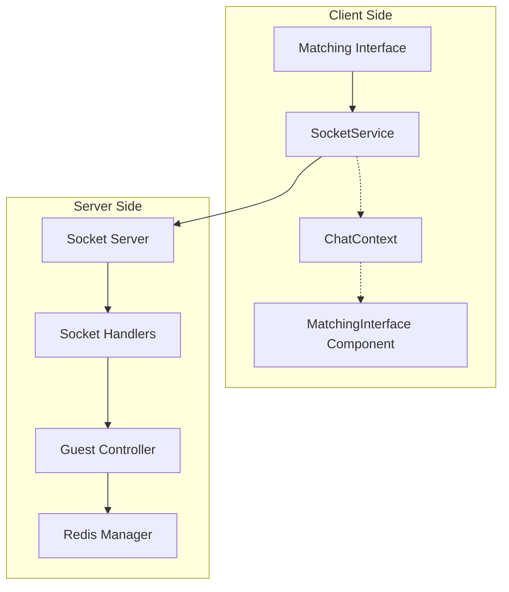
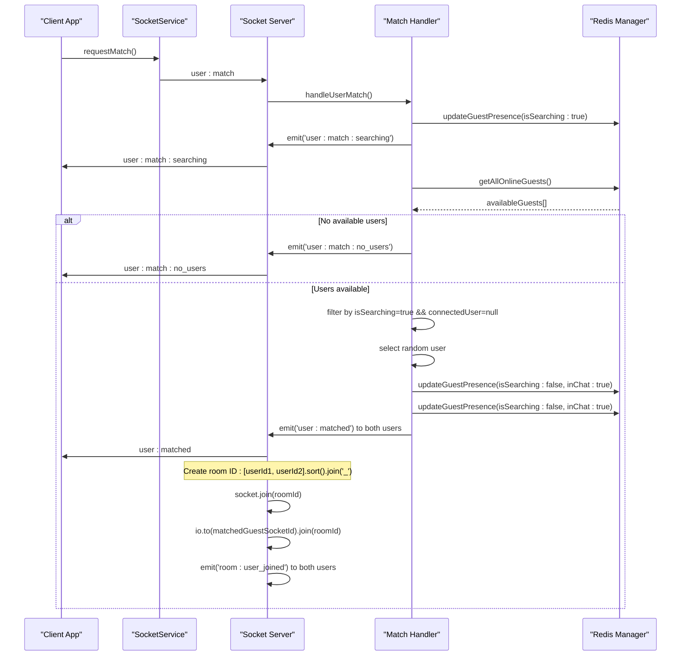
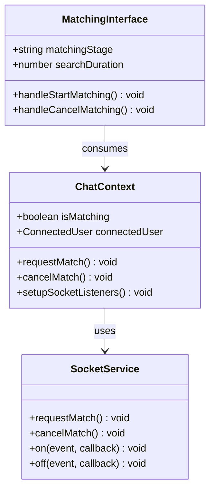
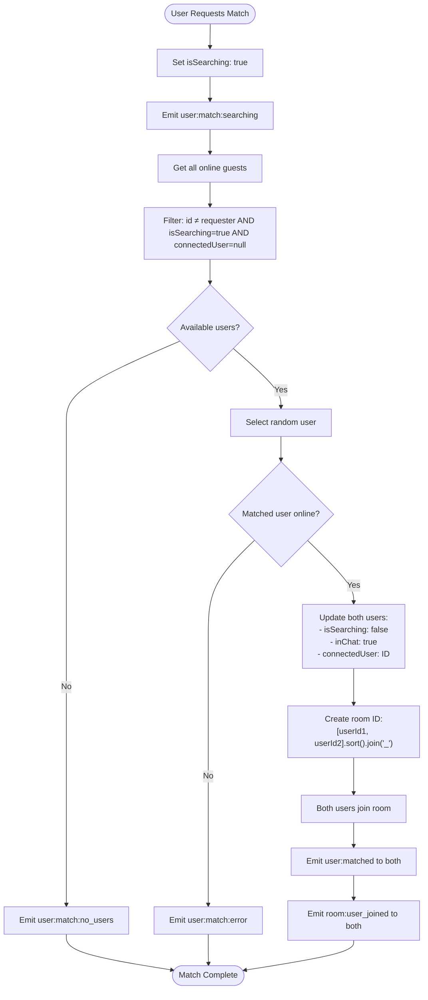
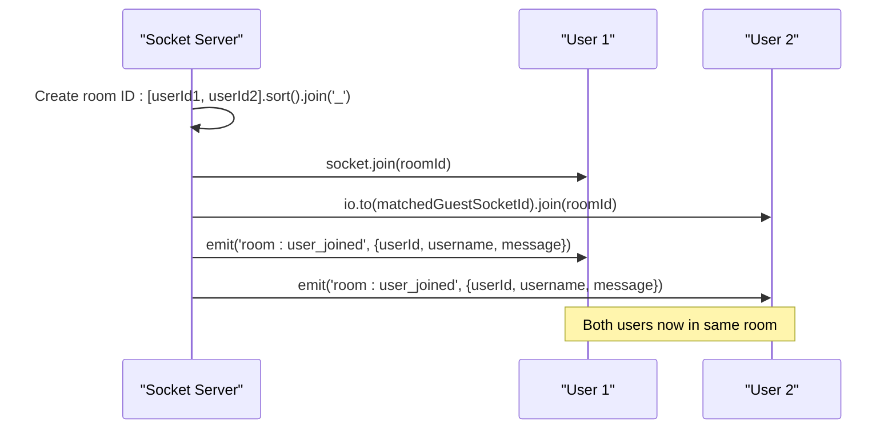
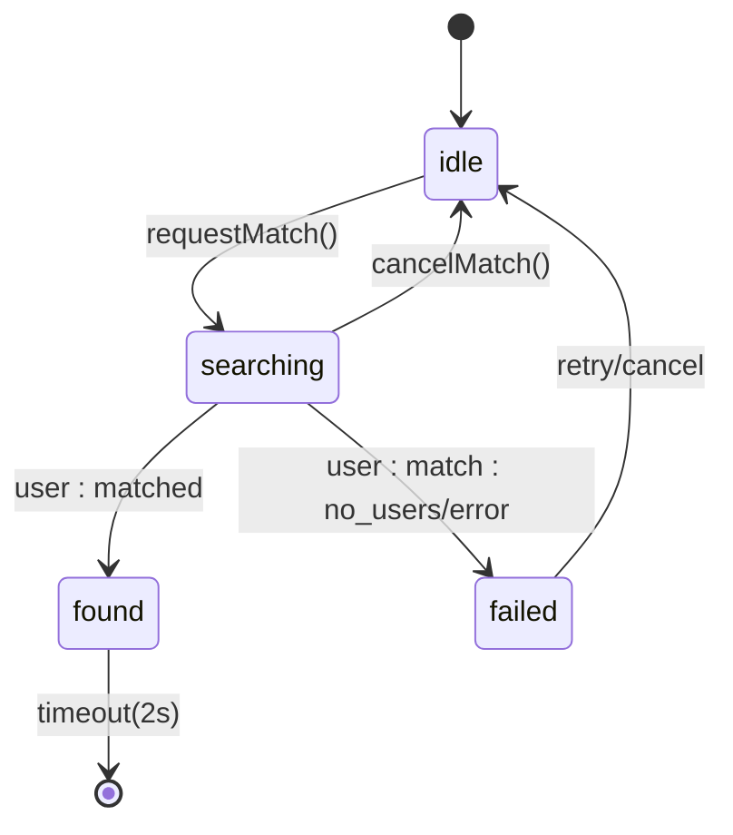
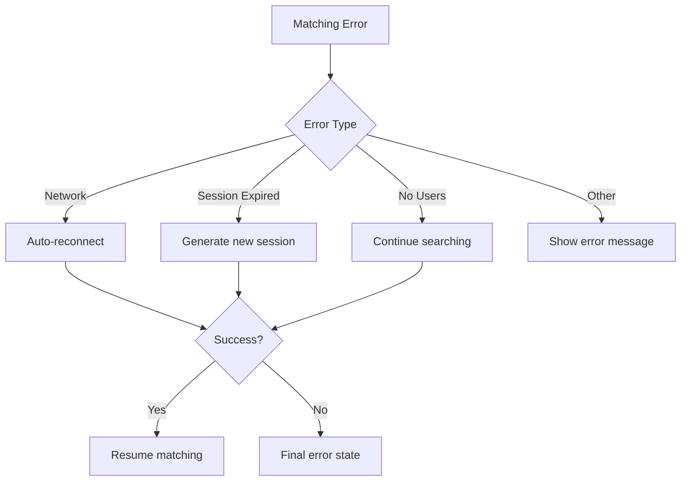

# User Matching System API Documentation

<cite>
**Referenced Files in This Document**
- [socketHandlers.js](file://backend/src/socket/socketHandlers.js)
- [socket.ts](file://web/lib/socket.ts)
- [ChatContext.tsx](file://web/contexts/ChatContext.tsx)
- [MatchingInterface.tsx](file://web/components/MatchingInterface.tsx)
- [useWebRTC.ts](file://web/hooks/useWebRTC.ts)
- [guestController.js](file://backend/src/controllers/guestController.js)
- [socketServer.js](file://backend/src/socket/socketServer.js)
</cite>

## Table of Contents
1. [Introduction](#introduction)
2. [System Architecture](#system-architecture)
3. [Socket Events Overview](#socket-events-overview)
4. [Matching Process Flow](#matching-process-flow)
5. [Client-Side Implementation](#client-side-implementation)
6. [Server-Side Implementation](#server-side-implementation)
7. [Room Management](#room-management)
8. [UI State Management](#ui-state-management)
9. [Error Handling](#error-handling)
10. [Implementation Examples](#implementation-examples)

## Introduction

The Realtime Chat App's user matching system enables anonymous guests to find random chat partners through WebSocket connections. The system implements a sophisticated matching algorithm that filters available users, creates private chat rooms, and manages the entire matching lifecycle from initiation to completion.

## System Architecture

The matching system operates through a client-server architecture using Socket.IO for real-time communication:



**Diagram sources**
- [socket.ts](file://web/lib/socket.ts#L1-L50)
- [socketHandlers.js](file://backend/src/socket/socketHandlers.js#L1-L50)
- [ChatContext.tsx](file://web/contexts/ChatContext.tsx#L1-L50)

## Socket Events Overview

The matching system uses several key WebSocket events for bidirectional communication:

| Event | Direction | Purpose | Data Structure |
|-------|-----------|---------|----------------|
| `user:match` | Client → Server | Initiate random matching | `{}` |
| `user:match:searching` | Server → Client | Confirm search initiation | `{message: string}` |
| `user:matched` | Server → Client | Deliver matched user info | `{matchedUser: object, roomId: string}` |
| `user:match:cancel` | Client → Server | Cancel matching request | `{}` |
| `user:match:cancelled` | Server → Client | Confirm cancellation | `{message: string}` |
| `user:match:no_users` | Server → Client | No users available | `{message: string}` |
| `user:match:error` | Server → Client | Matching error | `{message: string}` |

**Section sources**
- [socketHandlers.js](file://backend/src/socket/socketHandlers.js#L165-L274)
- [socket.ts](file://web/lib/socket.ts#L195-L205)

## Matching Process Flow

The matching algorithm follows a deterministic process to ensure fair and efficient user pairing:



**Diagram sources**
- [socketHandlers.js](file://backend/src/socket/socketHandlers.js#L165-L274)
- [socket.ts](file://web/lib/socket.ts#L195-L205)

**Section sources**
- [socketHandlers.js](file://backend/src/socket/socketHandlers.js#L165-L274)

## Client-Side Implementation

### SocketService Methods

The SocketService provides two primary methods for matching operations:

#### requestMatch()
Initiates the matching process by sending the `user:match` event to the server.

```typescript
requestMatch(): void {
  this.socket?.emit("user:match");
}
```

#### cancelMatch()
Cancels an ongoing matching request by sending the `user:match:cancel` event.

```typescript
cancelMatch(): void {
  this.socket?.emit("user:match:cancel");
}
```

**Section sources**
- [socket.ts](file://web/lib/socket.ts#L195-L205)

### ChatContext Integration

The ChatContext manages matching state and provides event listeners for matching events:



**Diagram sources**
- [ChatContext.tsx](file://web/contexts/ChatContext.tsx#L30-L80)
- [MatchingInterface.tsx](file://web/components/MatchingInterface.tsx#L20-L60)

**Section sources**
- [ChatContext.tsx](file://web/contexts/ChatContext.tsx#L310-L380)

## Server-Side Implementation

### Matching Algorithm

The server-side matching algorithm implements the core logic for user pairing:



**Diagram sources**
- [socketHandlers.js](file://backend/src/socket/socketHandlers.js#L165-L274)

### Data Structures

The matching system uses specific data structures for user representation:

#### Matched User Object
```typescript
interface MatchedUser {
  id: string;           // User identifier
  username: string;     // Display name
  isGuest: boolean;     // Guest user flag
  location?: object;    // Geographic location
  gender?: string;      // User gender
  language?: string;    // Preferred language
}
```

#### Room ID Format
Rooms are identified using a deterministic format:
```typescript
const roomId = [guestSession.id, matchedGuest.id].sort().join('_');
```

**Section sources**
- [socketHandlers.js](file://backend/src/socket/socketHandlers.js#L210-L250)

## Room Management

### Room Creation and Joining

When users are matched, they automatically join a private room:



**Diagram sources**
- [socketHandlers.js](file://backend/src/socket/socketHandlers.js#L240-L250)

### Room Events

The system emits several room-related events:

| Event | Purpose | Data |
|-------|---------|------|
| `room:user_joined` | Notify room of new user | `{userId, username, message}` |
| `room:user_left` | Notify room of user departure | `{userId, username, message}` |
| `room:closed` | Close room and notify users | `{userId, username, message, reason}` |

**Section sources**
- [socketHandlers.js](file://backend/src/socket/socketHandlers.js#L240-L250)
- [ChatContext.tsx](file://web/contexts/ChatContext.tsx#L580-L620)

## UI State Management

### Matching States

The MatchingInterface component manages three primary states during the matching process:



**Diagram sources**
- [MatchingInterface.tsx](file://web/components/MatchingInterface.tsx#L30-L50)

### State Transitions

The UI responds to server events with appropriate state changes:

```typescript
// State management in MatchingInterface
useEffect(() => {
  if (isMatching) {
    setMatchingStage("searching");
    setShowMatchDialog(true);
    setSearchDuration(0);
  } else if (connectedUser) {
    setMatchingStage("found");
    setTimeout(() => {
      setShowMatchDialog(false);
      onMatchFound();
    }, 2000);
  } else if (matchingStage === "searching") {
    setMatchingStage("failed");
    setTimeout(() => {
      setShowMatchDialog(false);
      setMatchingStage("idle");
    }, 3000);
  }
}, [isMatching, connectedUser, matchingStage]);
```

**Section sources**
- [MatchingInterface.tsx](file://web/components/MatchingInterface.tsx#L40-L60)

## Error Handling

### Common Error Scenarios

The matching system handles various error conditions gracefully:

| Error Type | Server Event | Client Response | Recovery Action |
|------------|--------------|-----------------|-----------------|
| Guest session not found | `user:match:error` | Set `isMatching = false` | Retry or redirect |
| No users available | `user:match:no_users` | Show "try again later" | Continue searching |
| Selected user offline | `user:match:error` | Set `isMatching = false` | Retry matching |
| Network disconnection | `disconnect` | Attempt reconnection | Auto-reconnect |
| Token expiration | `connect_error` | Regenerate session | New guest session |

### Error Recovery Mechanisms



**Diagram sources**
- [socket.ts](file://web/lib/socket.ts#L100-L150)

**Section sources**
- [socket.ts](file://web/lib/socket.ts#L100-L150)
- [socketHandlers.js](file://backend/src/socket/socketHandlers.js#L165-L274)

## Implementation Examples

### Basic Matching Implementation

Here's how to implement matching functionality in a React component:

```typescript
// Example component using the matching system
import { useChat } from '@/contexts/ChatContext';

function MatchButton() {
  const { isMatching, requestMatch, cancelMatch } = useChat();

  const handleMatchClick = () => {
    if (isMatching) {
      cancelMatch();
    } else {
      requestMatch();
    }
  };

  return (
    <button 
      onClick={handleMatchClick}
      disabled={isMatching}
    >
      {isMatching ? 'Cancel Search' : 'Find Chat Partner'}
    </button>
  );
}
```

### Advanced Matching with UI Feedback

```typescript
// Enhanced matching interface with progress tracking
import { useState, useEffect } from 'react';
import { useChat } from '@/contexts/ChatContext';

function AdvancedMatchingInterface() {
  const { isMatching, connectedUser, requestMatch, cancelMatch } = useChat();
  const [searchTime, setSearchTime] = useState(0);
  const [showProgress, setShowProgress] = useState(false);

  useEffect(() => {
    let timer;
    if (isMatching) {
      setShowProgress(true);
      timer = setInterval(() => setSearchTime(prev => prev + 1), 1000);
    }
    return () => clearInterval(timer);
  }, [isMatching]);

  return (
    <div>
      {isMatching ? (
        <div className="search-progress">
          <p>Searching for chat partner... {searchTime}s</p>
          <button onClick={cancelMatch}>Cancel</button>
        </div>
      ) : (
        <button onClick={requestMatch}>Find Random Chat</button>
      )}
    </div>
  );
}
```

### Room Management Example

```typescript
// Example of room management after matching
import { useEffect } from 'react';
import { useChat } from '@/contexts/ChatContext';

function RoomManager() {
  const { connectedUser, leaveRoom, getCurrentRoomId } = useChat();

  useEffect(() => {
    if (connectedUser) {
      const roomId = getCurrentRoomId();
      console.log(`Joined room: ${roomId}`);
      
      // Setup room-specific listeners
      return () => {
        leaveRoom();
        console.log('Left room');
      };
    }
  }, [connectedUser]);

  return connectedUser ? (
    <div className="room-info">
      <p>Chatting with: {connectedUser.username}</p>
      <button onClick={leaveRoom}>Leave Room</button>
    </div>
  ) : null;
}
```

**Section sources**
- [MatchingInterface.tsx](file://web/components/MatchingInterface.tsx#L80-L120)
- [ChatContext.tsx](file://web/contexts/ChatContext.tsx#L400-L450)