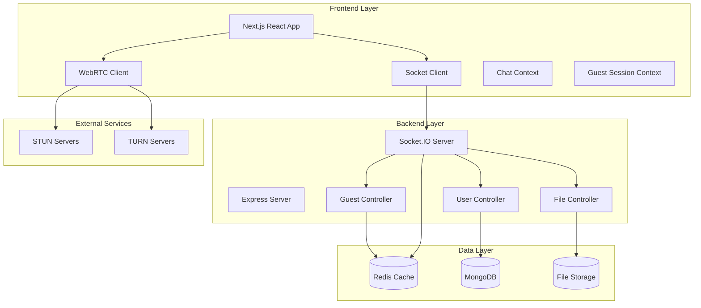
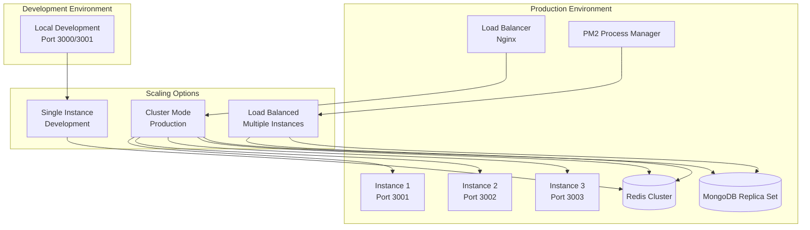
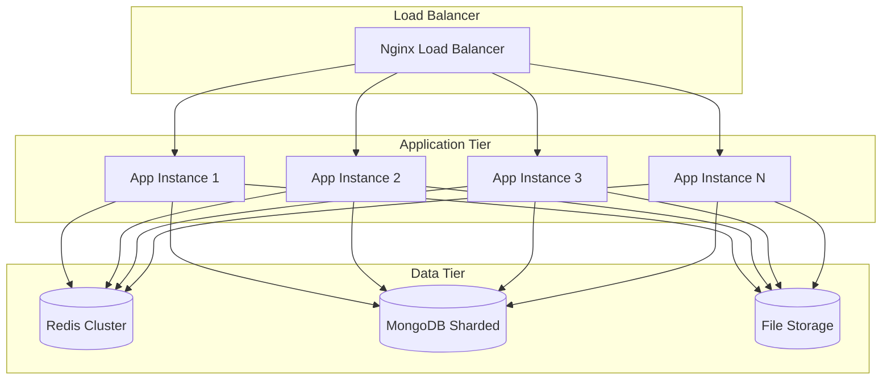
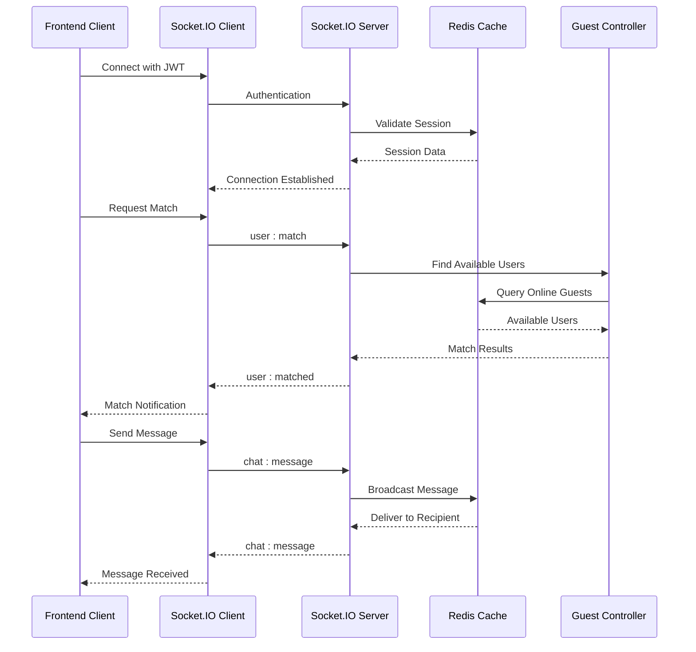
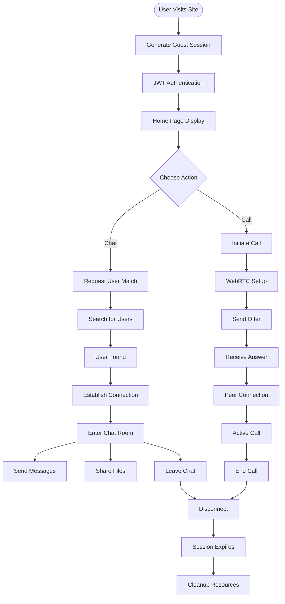

# System Overview

<cite>
**Referenced Files in This Document**
- [backend/README.md](file://backend/README.md)
- [web/README.md](file://web/README.md)
- [backend/package.json](file://backend/package.json)
- [web/package.json](file://web/package.json)
- [backend/src/server.js](file://backend/src/server.js)
- [backend/src/socket/socketServer.js](file://backend/src/socket/socketServer.js)
- [backend/src/socket/socketHandlers.js](file://backend/src/socket/socketHandlers.js)
- [web/app/layout.tsx](file://web/app/layout.tsx)
- [web/app/page.tsx](file://web/app/page.tsx)
- [web/app/chat/page.tsx](file://web/app/chat/page.tsx)
- [web/lib/socket.ts](file://web/lib/socket.ts)
- [web/hooks/useWebRTC.ts](file://web/hooks/useWebRTC.ts)
- [web/components/VideoCallModal.tsx](file://web/components/VideoCallModal.tsx)
- [backend/src/controllers/guestController.js](file://backend/src/controllers/guestController.js)
- [backend/src/utils/redisGuestManager.js](file://backend/src/utils/redisGuestManager.js)
- [backend/ecosystem.config.js](file://backend/ecosystem.config.js)
- [web/next.config.mjs](file://web/next.config.mjs)
</cite>

## Table of Contents
1. [Introduction](#introduction)
2. [System Architecture](#system-architecture)
3. [Core Features](#core-features)
4. [Technology Stack](#technology-stack)
5. [Deployment Architecture](#deployment-architecture)
6. [Security Model](#security-model)
7. [Scalability Considerations](#scalability-considerations)
8. [Cross-Device Compatibility](#cross-device-compatibility)
9. [Integration Points](#integration-points)
10. [User Flow Analysis](#user-flow-analysis)

## Introduction

The Realtime Chat App is a full-stack web application designed to enable anonymous, real-time communication between random users worldwide. Built with modern web technologies, it provides a seamless platform for instant messaging, audio/video calling, file sharing, and random user matching without requiring user accounts or personal information.

The application serves as a bridge connecting strangers from different parts of the world, offering a safe and anonymous environment for spontaneous conversations and connections. Its architecture emphasizes scalability, real-time responsiveness, and cross-platform compatibility while maintaining strong privacy guarantees.

## System Architecture

The Realtime Chat App follows a microservices-like architecture with clear separation between frontend and backend components, utilizing WebSocket-based real-time communication through Socket.IO.

**Diagram sources**
- [backend/src/server.js](file://backend/src/server.js#L1-L50)
- [backend/src/socket/socketServer.js](file://backend/src/socket/socketServer.js#L1-L50)
- [web/lib/socket.ts](file://web/lib/socket.ts#L1-L50)

### Frontend Architecture

The frontend is built using Next.js 15 with React 19, providing a modern, responsive user interface with server-side rendering capabilities. The application utilizes React Context APIs for state management and Socket.IO for real-time communication.

**Section sources**
- [web/package.json](file://web/package.json#L1-L30)
- [web/app/layout.tsx](file://web/app/layout.tsx#L1-L39)

### Backend Architecture

The backend employs Express.js with Socket.IO for real-time bidirectional communication, featuring a modular controller-based architecture for different functional domains.

**Section sources**
- [backend/package.json](file://backend/package.json#L1-L30)
- [backend/src/server.js](file://backend/src/server.js#L1-L100)

## Core Features

### Text Chat System

The messaging system supports real-time text communication with typing indicators, message delivery confirmation, and temporary message storage. Messages are ephemeral and not persisted in the database, ensuring privacy and reducing storage requirements.

### Audio/Video Calling via WebRTC

WebRTC integration enables high-quality peer-to-peer audio and video calls with automatic ICE candidate exchange, STUN/TURN server support for NAT traversal, and adaptive bitrate streaming.

### File Sharing Capabilities

Users can share various file types including images, videos, audio files, and documents. File uploads are validated, stored temporarily, and distributed securely through the Socket.IO infrastructure.

### Random User Matching

The matching system uses Redis for efficient user discovery and connection management, enabling users to find random chat partners through a sophisticated matching algorithm.

**Section sources**
- [backend/src/socket/socketHandlers.js](file://backend/src/socket/socketHandlers.js#L200-L300)
- [web/hooks/useWebRTC.ts](file://web/hooks/useWebRTC.ts#L1-L100)

## Technology Stack

### Frontend Technologies
- **Framework**: Next.js 15 with React 19
- **Styling**: Tailwind CSS with custom design system
- **State Management**: React Context APIs
- **Real-time Communication**: Socket.IO Client
- **WebRTC**: Native browser APIs with fallback configurations
- **UI Components**: Radix UI primitives with custom enhancements

### Backend Technologies
- **Framework**: Express.js with Socket.IO
- **Database**: MongoDB for persistent data (user profiles)
- **Caching**: Redis for session management and real-time data
- **Authentication**: JWT tokens for guest sessions
- **File Storage**: Local filesystem with temporary storage
- **Clustering**: Node.js cluster module for horizontal scaling

### Infrastructure Technologies
- **Process Management**: PM2 for production deployments
- **Reverse Proxy**: Nginx for load balancing and SSL termination
- **Monitoring**: Winston logging with structured logging
- **Security**: Helmet.js, rate limiting, input sanitization

**Section sources**
- [web/package.json](file://web/package.json#L15-L60)
- [backend/package.json](file://backend/package.json#L25-L50)

## Deployment Architecture

The application supports multiple deployment modes to accommodate different scaling requirements and operational environments.

**Diagram sources**
- [backend/ecosystem.config.js](file://backend/ecosystem.config.js#L1-L50)
- [backend/src/cluster.js](file://backend/src/cluster.js)

### Deployment Modes

1. **Development Mode**: Single instance with hot reloading for rapid development
2. **Production Mode**: Clustered deployment using PM2 with automatic restart and health monitoring
3. **Load Balanced Mode**: Multiple instances behind Nginx with Redis for state synchronization

**Section sources**
- [backend/ecosystem.config.js](file://backend/ecosystem.config.js#L1-L98)

## Security Model

### Anonymity Guarantees

The application maintains user anonymity through several mechanisms:

- **Guest Sessions**: All users are treated as guests with temporary, anonymous identities
- **Session Expiration**: Guest sessions automatically expire after 2 hours of inactivity
- **No Persistent Storage**: User data is not stored permanently except for temporary file metadata
- **Temporary File Storage**: Uploaded files are deleted after 24 hours

### Authentication and Authorization

- **JWT Tokens**: Stateless authentication using JSON Web Tokens with 2-hour expiration
- **Session Management**: Redis-based session storage with automatic cleanup
- **Rate Limiting**: Protection against abuse through request rate limiting
- **Input Validation**: Comprehensive validation and sanitization of all user inputs

### Communication Security

- **WebSocket Encryption**: Secure WebSocket connections (wss://) in production
- **WebRTC Security**: Encrypted peer-to-peer connections with DTLS/SRTP
- **File Transfer**: Secure temporary file storage with access controls
- **CORS Protection**: Strict cross-origin resource sharing policies

**Section sources**
- [backend/src/controllers/guestController.js](file://backend/src/controllers/guestController.js#L20-L60)
- [backend/src/utils/redisGuestManager.js](file://backend/src/utils/redisGuestManager.js#L100-L200)

## Scalability Considerations

### Horizontal Scaling Architecture

The application is designed to scale horizontally using Redis as a shared state store and Socket.IO Redis adapter for message distribution across multiple instances.

**Diagram sources**
- [backend/src/socket/socketServer.js](file://backend/src/socket/socketServer.js#L20-L50)
- [backend/src/utils/redisGuestManager.js](file://backend/src/utils/redisGuestManager.js#L300-L400)

### Performance Optimizations

- **Connection Pooling**: Efficient database connection management
- **Memory Management**: Automatic garbage collection and memory leak prevention
- **Caching Strategies**: Redis caching for frequently accessed data
- **Compression**: Gzip compression for API responses
- **CDN Integration**: Static asset optimization

**Section sources**
- [backend/src/utils/redisGuestManager.js](file://backend/src/utils/redisGuestManager.js#L400-L432)

## Cross-Device Compatibility

### Browser Support

The application supports modern browsers with progressive enhancement for older browsers:

- **Modern Browsers**: Chrome, Firefox, Safari, Edge (latest 2 versions)
- **Mobile Browsers**: iOS Safari, Android Chrome with WebRTC support
- **Desktop Applications**: Electron wrapper for desktop deployment

### Responsive Design

The frontend implements responsive design principles using Tailwind CSS breakpoints and adaptive layouts that work seamlessly across:

- **Mobile Devices**: Smartphones with portrait and landscape orientations
- **Tablets**: Tablets with touch-optimized interfaces
- **Desktop Computers**: Laptops and desktops with mouse/keyboard input
- **Large Screens**: 4K displays and ultra-wide monitors

### WebRTC Compatibility

WebRTC implementation includes fallback mechanisms for:

- **Browser Differences**: Vendor-specific WebRTC implementations
- **Network Conditions**: Adaptive bitrate streaming and codec selection
- **Hardware Limitations**: Camera/microphone permission handling
- **Firewall/NAT Traversal**: STUN/TURN server integration

**Section sources**
- [web/hooks/useWebRTC.ts](file://web/hooks/useWebRTC.ts#L100-L200)
- [web/components/VideoCallModal.tsx](file://web/components/VideoCallModal.tsx#L1-L100)

## Integration Points

### Frontend-Backend Communication

The application uses Socket.IO for real-time bidirectional communication between frontend and backend components:

**Diagram sources**
- [web/lib/socket.ts](file://web/lib/socket.ts#L1-L100)
- [backend/src/socket/socketHandlers.js](file://backend/src/socket/socketHandlers.js#L1-L100)

### External Service Integrations

- **STUN/TURN Servers**: For WebRTC NAT traversal
- **File Storage**: Local filesystem with optional cloud storage
- **Logging**: Winston with configurable transport options
- **Monitoring**: PM2 process management and health checks

**Section sources**
- [web/hooks/useWebRTC.ts](file://web/hooks/useWebRTC.ts#L50-L150)
- [backend/src/socket/socketHandlers.js](file://backend/src/socket/socketHandlers.js#L400-L500)

## User Flow Analysis

### Complete User Journey

The user journey encompasses the complete path from initial visit to chat/call completion:

**Diagram sources**
- [web/app/chat/page.tsx](file://web/app/chat/page.tsx#L1-L100)
- [backend/src/socket/socketHandlers.js](file://backend/src/socket/socketHandlers.js#L100-L200)

### Key Integration Points

1. **Session Initialization**: Guest creation and JWT generation
2. **Real-time Communication**: Socket.IO connection establishment
3. **User Discovery**: Redis-based user matching algorithm
4. **WebRTC Signaling**: Offer/answer exchange for peer connections
5. **File Management**: Temporary file storage and distribution
6. **Presence Tracking**: Real-time user status updates
7. **Error Handling**: Graceful degradation and recovery mechanisms

**Section sources**
- [backend/src/controllers/guestController.js](file://backend/src/controllers/guestController.js#L1-L149)
- [web/lib/socket.ts](file://web/lib/socket.ts#L200-L300)