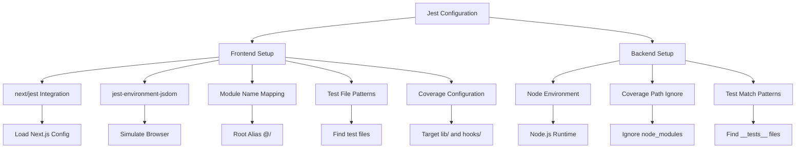
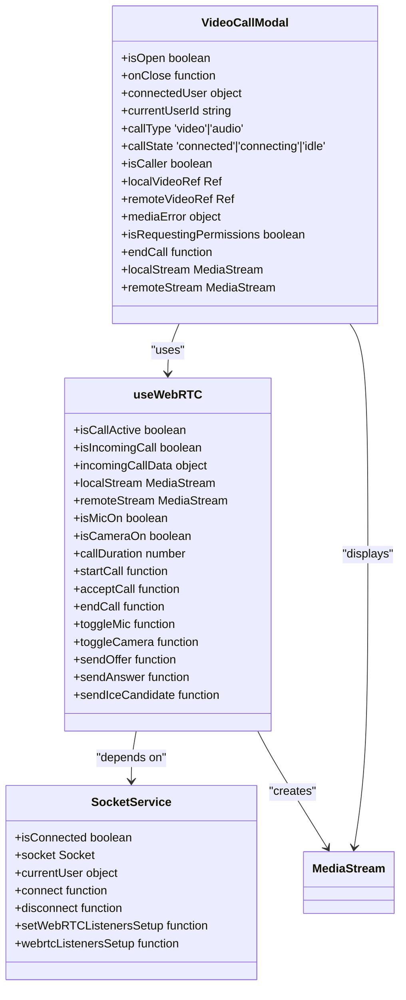
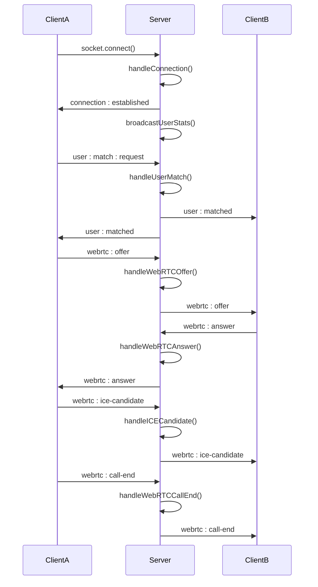
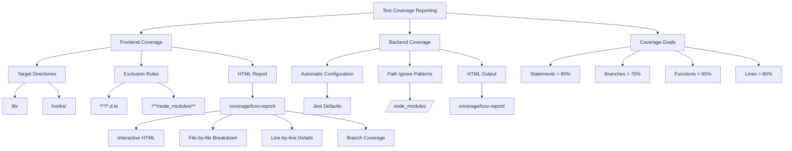

# Testing Strategy

<cite>
**Referenced Files in This Document**   
- [jest.config.js](file://web/jest.config.js)
- [jest.setup.js](file://web/jest.setup.js)
- [socketHandlers.connection.test.js](file://backend/src/socket/__tests__/socketHandlers.connection.test.js)
- [socketHandlers.messaging.test.js](file://backend/src/socket/__tests__/socketHandlers.messaging.test.js)
- [useWebRTC.integration.test.tsx](file://web/hooks/__tests__/useWebRTC.integration.test.tsx)
- [useWebRTC.video-toggle.test.tsx](file://web/hooks/__tests__/useWebRTC.video-toggle.test.tsx)
- [VideoCallModal.video-toggle.test.tsx](file://web/components/__tests__/VideoCallModal.video-toggle.test.tsx)
- [socket.test.ts](file://web/lib/__tests__/socket.test.ts)
- [socket.token-expiration.test.ts](file://web/lib/__tests__/socket.token-expiration.test.ts)
- [GuestSessionContext.token-validation.test.tsx](file://web/contexts/__tests__/GuestSessionContext.token-validation.test.tsx)
- [package.json](file://web/package.json)
- [package.json](file://backend/package.json)
- [TEST_README.md](file://web/TEST_README.md)
- [README.md](file://backend/src/socket/__tests__/README.md)
</cite>

## Table of Contents
1. [Testing Pyramid Implementation](#testing-pyramid-implementation)
2. [Jest Configuration and Setup](#jest-configuration-and-setup)
3. [Frontend Component and Hook Tests](#frontend-component-and-hook-tests)
4. [Backend Socket Handler Tests](#backend-socket-handler-tests)
5. [Testing Utilities and Mocks](#testing-utilities-and-mocks)
6. [Test Coverage and Reporting](#test-coverage-and-reporting)
7. [Test Execution and CI Considerations](#test-execution-and-ci-considerations)
8. [Writing New Tests](#writing-new-tests)
9. [Testing Challenges for Real-time Applications](#testing-challenges-for-real-time-applications)

## Testing Pyramid Implementation

The Realtime Chat App implements a comprehensive testing pyramid with three distinct layers: unit tests, integration tests, and end-to-end tests. This approach ensures thorough validation of the application's functionality while maintaining efficient test execution.

At the base of the pyramid are unit tests that focus on individual components and functions in isolation. The frontend contains unit tests for React components in the `components/__tests__` directory and custom hooks in `hooks/__tests__`. These tests verify the behavior of individual UI elements and state management logic without dependencies on external systems. The backend includes unit tests for socket handlers that validate the core business logic of connection management, user matching, and messaging.

The middle layer consists of integration tests that verify the interaction between multiple components. The frontend features integration tests that validate the connection between the `useWebRTC` hook and `SocketService`, ensuring proper WebRTC listener registration and re-establishment after socket reconnections. These tests confirm that the WebRTC event handlers are correctly set up when the socket connects or reconnects, and that they persist across component lifecycle events.

At the top of the pyramid are end-to-end tests that validate complete user workflows. The backend socket handler tests serve as end-to-end tests for the real-time communication system, verifying the entire flow from connection establishment through messaging and WebRTC signaling. These tests cover complex scenarios such as user matching algorithms, chat message validation, and WebRTC call lifecycle management, ensuring that all components work together as expected in realistic usage scenarios.

**Section sources**
- [TEST_README.md](file://web/TEST_README.md#L1-L174)
- [README.md](file://backend/src/socket/__tests__/README.md#L1-L248)

## Jest Configuration and Setup

The testing environment is configured using Jest with framework-specific adaptations for both frontend and backend applications. The frontend Jest configuration in `jest.config.js` leverages Next.js integration through `next/jest` to properly load Next.js configuration and environment variables during testing. This configuration sets up the test environment with `jest-environment-jsdom` to simulate a browser environment for React component testing.

Key configuration options include custom module name mapping that allows importing from the root directory using the `@/` alias, which maps to the project root. The test matching pattern is configured to identify test files with various naming conventions (`**/__tests__/**/*.test.[jt]s?(x)`, `**/?(*.)+(spec|test).[jt]s?(x)`), providing flexibility in test file organization. Code coverage collection is specifically targeted at the `lib/` and `hooks/` directories while excluding TypeScript definition files and node_modules.

The global test setup in `jest.setup.js` establishes consistent mocking across all frontend tests. Critical external dependencies are mocked to isolate the application code from external systems. The Socket.IO client is mocked with a comprehensive implementation that includes all essential methods (`on`, `off`, `emit`, `connect`, `disconnect`) and properties (`connected`, `id`). Environment variables are mocked with appropriate values, and js-cookie is mocked to simulate cookie operations without browser dependencies.

**Diagram sources **
- [jest.config.js](file://web/jest.config.js#L1-L28)
- [package.json](file://backend/package.json#L40-L45)

**Section sources**
- [jest.config.js](file://web/jest.config.js#L1-L28)
- [jest.setup.js](file://web/jest.setup.js#L1-L33)
- [package.json](file://backend/package.json#L40-L45)

## Frontend Component and Hook Tests

The frontend testing suite includes comprehensive tests for both React components and custom hooks, with a particular focus on WebRTC functionality and real-time communication features. Component tests in `components/__tests__` validate the UI behavior of critical components like `VideoCallModal`, ensuring proper rendering and interaction patterns.

The `VideoCallModal.video-toggle.test.tsx` file contains extensive tests for video toggle functionality, covering scenarios such as local and remote video preview states when cameras are on or off. These tests verify that the component correctly displays placeholders when video is disabled, restores video feeds when cameras are re-enabled, and maintains proper audio functionality when video is toggled. The test suite also includes scenarios for rapid video toggling to ensure the component remains stable under frequent state changes.

Hook tests in `hooks/__tests__` focus on the integration between the `useWebRTC` hook and the `SocketService`. The `useWebRTC.integration.test.tsx` file validates that the hook properly registers WebRTC event listeners with the socket service, handles socket reconnections correctly, and maintains listener persistence across component lifecycle events. These integration tests ensure that WebRTC signaling events (offer, answer, ICE candidates) are properly handled and that the connection state is accurately reflected in the hook's return values.

The `useWebRTC.video-toggle.test.tsx` file specifically targets video camera toggle functionality at the hook level, testing the underlying state management and logic that controls video track enabling and disabling. These tests verify that video tracks are properly enabled and disabled without being stopped, that track references are preserved during toggling, and that the peer connection remains stable throughout rapid camera state changes.

**Diagram sources **
- [VideoCallModal.video-toggle.test.tsx](file://web/components/__tests__/VideoCallModal.video-toggle.test.tsx#L1-L606)
- [useWebRTC.integration.test.tsx](file://web/hooks/__tests__/useWebRTC.integration.test.tsx#L1-L407)
- [useWebRTC.video-toggle.test.tsx](file://web/hooks/__tests__/useWebRTC.video-toggle.test.tsx#L1-L702)

**Section sources**
- [VideoCallModal.video-toggle.test.tsx](file://web/components/__tests__/VideoCallModal.video-toggle.test.tsx#L1-L606)
- [useWebRTC.integration.test.tsx](file://web/hooks/__tests__/useWebRTC.integration.test.tsx#L1-L407)
- [useWebRTC.video-toggle.test.tsx](file://web/hooks/__tests__/useWebRTC.video-toggle.test.tsx#L1-L702)

## Backend Socket Handler Tests

The backend testing suite focuses on comprehensive validation of socket event handlers that manage real-time communication between clients. The tests are organized into two main files: `socketHandlers.connection.test.js` for connection management and `socketHandlers.messaging.test.js` for messaging and WebRTC signaling.

The connection tests validate the complete lifecycle of socket connections, including establishment, disconnection, user matching, and match cancellation. The `handleConnection` tests verify that connections are properly established, user mappings are stored, guest presence is updated, and connection events are emitted to clients. Disconnection tests ensure proper cleanup of connection mappings, update of guest presence to offline, and decrementing of active user counts in Redis.

User matching functionality is thoroughly tested to ensure the algorithm correctly pairs available guests while preventing invalid matches. Tests cover successful matching between two available users, handling scenarios with no available users, preventing self-matching, and filtering out already-connected users. The match cancellation tests verify that users can cancel their search requests and that their searching status is properly updated.

Messaging and WebRTC signaling tests validate the core real-time communication features. Chat message tests cover text, file, and voice message types, ensuring proper validation, delivery to connected users, and error handling for invalid formats or disconnected users. WebRTC signaling tests verify the complete flow of offer, answer, and ICE candidate exchange between peers, as well as call lifecycle events like call end, rejection, and timeout.

**Diagram sources **
- [socketHandlers.connection.test.js](file://backend/src/socket/__tests__/socketHandlers.connection.test.js#L1-L547)
- [socketHandlers.messaging.test.js](file://backend/src/socket/__tests__/socketHandlers.messaging.test.js#L1-L670)

**Section sources**
- [socketHandlers.connection.test.js](file://backend/src/socket/__tests__/socketHandlers.connection.test.js#L1-L547)
- [socketHandlers.messaging.test.js](file://backend/src/socket/__tests__/socketHandlers.messaging.test.js#L1-L670)

## Testing Utilities and Mocks

The testing strategy employs a comprehensive set of utilities and mocks to isolate components and simulate real-world scenarios without dependencies on external systems. The mock implementations are designed to be realistic enough to validate integration points while remaining predictable for testing purposes.

For Socket.IO testing, both frontend and backend use sophisticated mocks that simulate the full API surface. The frontend mock in `jest.setup.js` provides a complete implementation of the socket interface with tracked method calls, allowing tests to verify that event listeners are properly registered and events are correctly emitted. The backend tests use Jest's module mocking to replace the actual Socket.IO implementation with a mock that tracks method invocations and allows simulation of socket events.

Media-related functionality is extensively mocked to prevent actual access to camera and microphone devices during testing. Custom `MockMediaStreamTrack` and `MockMediaStream` classes are implemented to simulate media tracks with controllable properties like `enabled`, `muted`, and `readyState`. These mocks include event listener functionality to properly simulate the WebRTC event system, allowing tests to dispatch `mute` and `unmute` events to validate component responses.

Authentication and session management are mocked using simulated localStorage and sessionStorage implementations. These mocks allow tests to set up specific authentication states, including valid tokens, expired tokens, and missing session data, to validate the application's behavior in different scenarios. The token expiration tests specifically use these mocks to verify that the system properly handles expired authentication tokens by regenerating guest sessions.

Redis and database interactions are mocked to isolate the socket handlers from actual data storage systems. The backend tests mock the `redisGuestManager` and `guestController` modules to simulate user presence updates, guest retrieval, and active user counting without requiring a running Redis instance or database connection. This approach ensures tests are fast, reliable, and can be run in any environment.

```mermaid
flowchart TD
A[Testing Utilities and Mocks] --> B[Socket.IO Mocks]
A --> C[Media Mocks]
A --> D[Storage Mocks]
A --> E[API Mocks]
A --> F[Database Mocks]
B --> G[Frontend Socket Mock]
B --> H[Backend Socket Mock]
G --> I[Method Call Tracking]
G --> J[Event Simulation]
H --> K[Method Call Verification]
H --> L[Event Handler Testing]
C --> M[MockMediaStreamTrack]
C --> N[MockMediaStream]
M --> O[enabled Property]
M --> P[muted Property]
M --> Q[Event Listeners]
N --> R[getTracks Method]
N --> S[getVideoTracks Method]
D --> T[localStorage Mock]
D --> U[sessionStorage Mock]
T --> V[getItem Method]
T --> W[setItem Method]
T --> X[removeItem Method]
U --> Y[getItem Method]
U --> Z[setItem Method]
U --> AA[removeItem Method]
E --> AB[guestAPI Mock]
E --> AC[socketService Mock]
AB --> AD[createSession Method]
AB --> AE[getMe Method]
AC --> AF[on Method]
AC --> AG[off Method]
F --> AH[redisGuestManager Mock]
F --> AI[guestController Mock]
AH --> AJ[incrementActiveUserCount]
AH --> AK[decrementActiveUserCount]
AI --> AL[updateGuestPresence]
AI --> AM[getGuestBySessionId]
```

**Diagram sources **
- [jest.setup.js](file://web/jest.setup.js#L5-L28)
- [useWebRTC.video-toggle.test.tsx](file://web/hooks/__tests__/useWebRTC.video-toggle.test.tsx#L100-L180)
- [GuestSessionContext.token-validation.test.tsx](file://web/contexts/__tests__/GuestSessionContext.token-validation.test.tsx#L80-L120)
- [socketHandlers.connection.test.js](file://backend/src/socket/__tests__/socketHandlers.connection.test.js#L10-L30)

**Section sources**
- [jest.setup.js](file://web/jest.setup.js#L5-L28)
- [useWebRTC.video-toggle.test.tsx](file://web/hooks/__tests__/useWebRTC.video-toggle.test.tsx#L100-L180)
- [GuestSessionContext.token-validation.test.tsx](file://web/contexts/__tests__/GuestSessionContext.token-validation.test.tsx#L80-L120)
- [socketHandlers.connection.test.js](file://backend/src/socket/__tests__/socketHandlers.connection.test.js#L10-L30)

## Test Coverage and Reporting

The testing suite includes comprehensive coverage reporting through Jest's built-in coverage tools, with results stored in the `coverage/` directory and accessible via the `lcov-report/` subdirectory. The coverage configuration is carefully tuned to focus on the most critical parts of the application while excluding generated files and dependencies.

Frontend coverage is configured to collect data from the `lib/` and `hooks/` directories, which contain the core business logic and reusable components. This targeted approach ensures that the most important code is thoroughly tested while avoiding noise from UI components and configuration files. The coverage configuration excludes TypeScript definition files and node_modules to provide a clear picture of the application's actual test coverage.

Backend coverage is automatically configured through Jest's default settings, with path patterns that ignore node_modules. The test suite achieves high coverage of the socket handler logic, with particular emphasis on error handling paths and edge cases. The coverage reports include detailed HTML output in the `lcov-report/` directory, allowing developers to easily identify untested code and improve coverage.

The test suite includes specific tests for token expiration and session validation scenarios, ensuring that critical security and authentication flows are properly covered. The `socket.token-expiration.test.ts` and `GuestSessionContext.token-validation.test.tsx` files validate that expired tokens are detected and handled appropriately, with guest sessions regenerated when necessary. These tests cover both successful regeneration scenarios and error conditions, such as API failures or invalid responses.

Coverage goals are established to maintain high code quality, with targets exceeding 80% for statements, branches, and lines, and 85% for functions. The continuous integration process can be configured to enforce these coverage thresholds, preventing merges that significantly reduce test coverage. The detailed coverage reports serve as a valuable tool for identifying areas that need additional testing and ensuring that new features are properly covered.

**Diagram sources **
- [jest.config.js](file://web/jest.config.js#L18-L24)
- [package.json](file://backend/package.json#L40-L45)
- [socket.token-expiration.test.ts](file://web/lib/__tests__/socket.token-expiration.test.ts#L1-L383)
- [GuestSessionContext.token-validation.test.tsx](file://web/contexts/__tests__/GuestSessionContext.token-validation.test.tsx#L1-L452)

**Section sources**
- [jest.config.js](file://web/jest.config.js#L18-L24)
- [package.json](file://backend/package.json#L40-L45)
- [socket.token-expiration.test.ts](file://web/lib/__tests__/socket.token-expiration.test.ts#L1-L383)
- [GuestSessionContext.token-validation.test.tsx](file://web/contexts/__tests__/GuestSessionContext.token-validation.test.tsx#L1-L452)

## Test Execution and CI Considerations

The test suite is configured with comprehensive scripts in the `package.json` files of both frontend and backend applications, enabling flexible test execution for different development and deployment scenarios. The scripts support standard test running, watch mode for development, coverage reporting, and targeted test execution.

Frontend test scripts include `test` for running all tests once, `test:watch` for continuous testing during development, and `test:coverage` for generating coverage reports. The backend provides additional scripts like `test:socket` to run only socket handler tests, allowing developers to focus on specific areas of the codebase. These scripts leverage Jest's capabilities to provide fast feedback during development and thorough validation in continuous integration environments.

Continuous integration considerations include the ability to run tests in parallel, generate coverage reports, and fail builds based on coverage thresholds. The test suite is designed to be reliable and fast, with mocked dependencies eliminating external factors that could cause flaky tests. The comprehensive mocking strategy ensures that tests can be run in any environment without requiring specific infrastructure.

The test files include detailed documentation in README files that describe the test structure, coverage goals, and troubleshooting tips. The backend `README.md` in the socket tests directory provides guidance on adding new tests, including templates for common test scenarios. This documentation helps maintain consistency across the test suite and onboards new developers quickly.

For CI/CD integration, the test commands can be incorporated into pipeline scripts to ensure code quality before deployment. The coverage reports can be published as artifacts, allowing teams to track coverage trends over time. The test suite's focus on real-time communication edge cases ensures that the application remains robust under various network conditions and user behaviors.

**Section sources**
- [package.json](file://web/package.json#L5-L12)
- [package.json](file://backend/package.json#L5-L15)
- [README.md](file://backend/src/socket/__tests__/README.md#L30-L248)

## Writing New Tests

When writing new tests for components, hooks, and backend handlers, follow the established patterns and conventions to maintain consistency across the test suite. For frontend components, create test files in the `__tests__` directory adjacent to the component being tested, using the naming convention `ComponentName.test.tsx`.

Component tests should focus on the component's public interface and user interactions rather than implementation details. Use React Testing Library to render components and simulate user events, asserting on the resulting DOM state. Mock external dependencies like services and APIs to isolate the component under test. For components with complex state logic, test both the initial render and state transitions triggered by user interactions.

Hook tests should validate the hook's return values and behavior in response to various inputs and external events. Use `renderHook` from React Testing Library to test custom hooks in isolation. For hooks that interact with external systems like sockets or APIs, mock those dependencies to control the test environment. Test both success scenarios and error conditions to ensure robust error handling.

Backend handler tests should follow the structure established in existing test files, with clear `describe` blocks for each handler and `test` cases for specific scenarios. Mock all external dependencies including database operations, Redis interactions, and logging. Test both the happy path and various error conditions, ensuring proper error responses are sent to clients. Use the existing mock implementations as templates for new tests.

All tests should include comprehensive error handling scenarios, as real-time applications must gracefully handle network interruptions, authentication failures, and other common issues. Follow the existing patterns for testing edge cases like rapid state changes, concurrent operations, and race conditions, which are particularly important in real-time communication applications.

**Section sources**
- [README.md](file://backend/src/socket/__tests__/README.md#L200-L248)
- [TEST_README.md](file://web/TEST_README.md#L150-L174)

## Testing Challenges for Real-time Applications

Real-time applications present unique testing challenges that require specialized approaches and strategies. The Realtime Chat App addresses these challenges through comprehensive mocking, integration testing, and edge case coverage.

One major challenge is testing WebRTC functionality, which involves complex peer-to-peer connections and media stream handling. The test suite addresses this by implementing detailed mocks of `MediaStreamTrack` and `MediaStream` that simulate the behavior of real media devices. These mocks allow testing of video toggle functionality, track state changes, and event propagation without requiring actual camera or microphone access.

Socket connection reliability is another challenge, particularly handling disconnections and reconnections. The test suite includes extensive tests for socket reconnection scenarios, verifying that WebRTC listeners are properly re-established and that the application state remains consistent. The `useWebRTC.integration.test.tsx` file specifically tests that listeners are correctly re-registered after socket reconnects, ensuring uninterrupted communication.

Authentication token expiration presents a significant challenge in long-running real-time applications. The test suite includes dedicated tests for token expiration scenarios, validating that expired tokens are detected and guest sessions are regenerated automatically. These tests cover both successful regeneration and error conditions, ensuring the application remains functional even when authentication tokens expire.

Race conditions and concurrent operations are common challenges in real-time systems. The test suite addresses this through tests that simulate rapid message sending, multiple concurrent connections, and simultaneous state changes. The video toggle tests specifically include scenarios with rapid camera toggling to ensure the application remains stable under frequent state changes.

Network variability and latency are difficult to test but critical for real-time applications. While the current test suite focuses on functional correctness, future enhancements could include network simulation to test behavior under poor network conditions. The existing edge case tests provide a foundation for ensuring robustness, but additional testing for network resilience would further improve reliability.

**Section sources**
- [useWebRTC.integration.test.tsx](file://web/hooks/__tests__/useWebRTC.integration.test.tsx#L1-L407)
- [socket.token-expiration.test.ts](file://web/lib/__tests__/socket.token-expiration.test.ts#L1-L383)
- [VIDEO_TOGGLE_TESTS.md](file://web/hooks/__tests__/VIDEO_TOGGLE_TESTS.md#L1-L176)