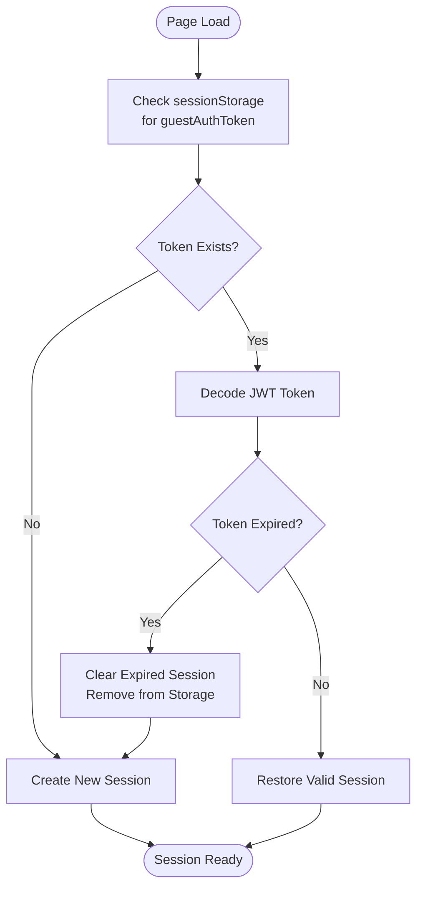
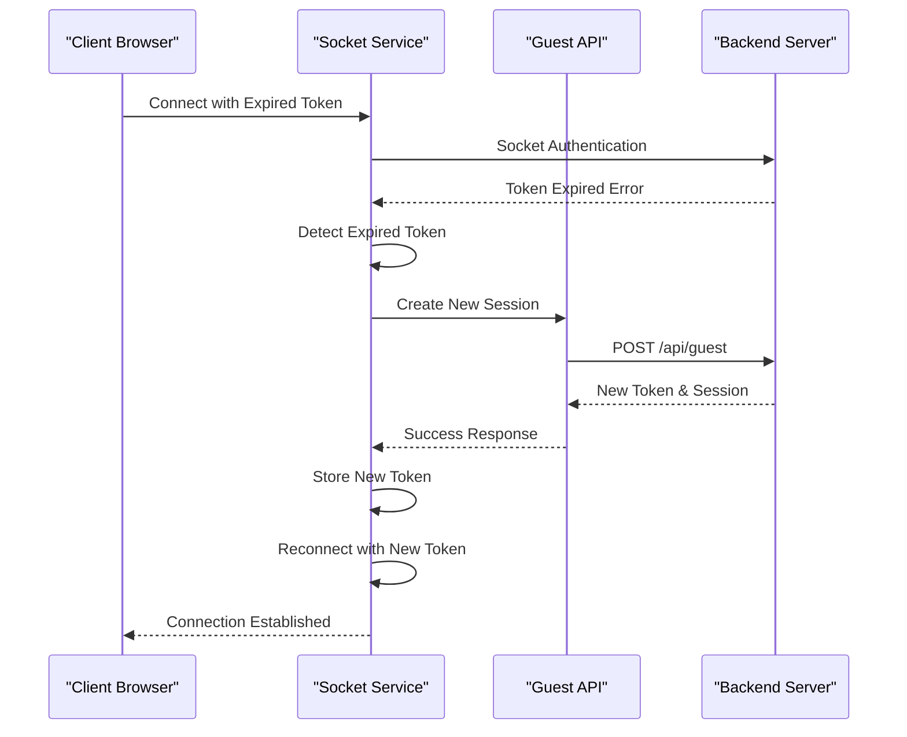
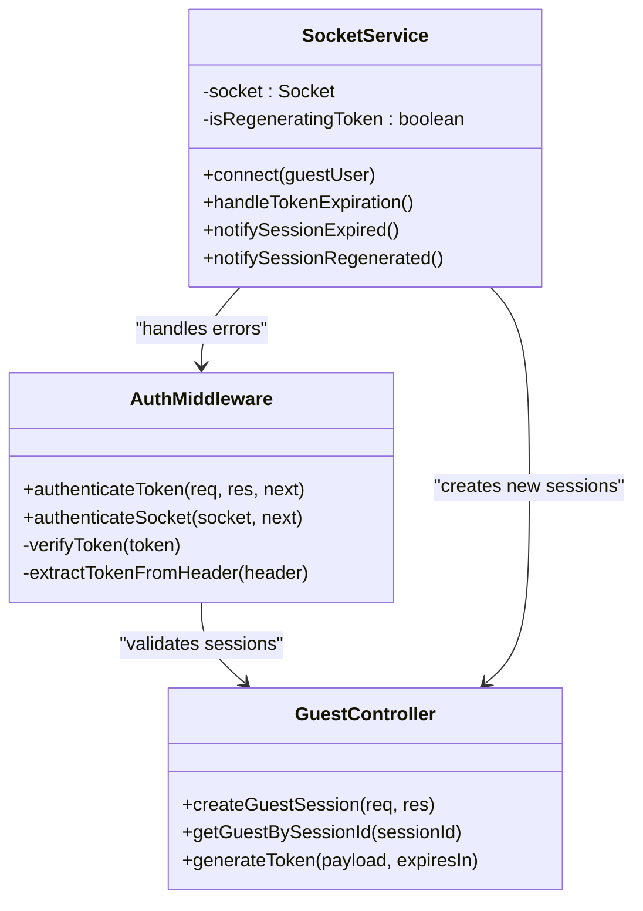
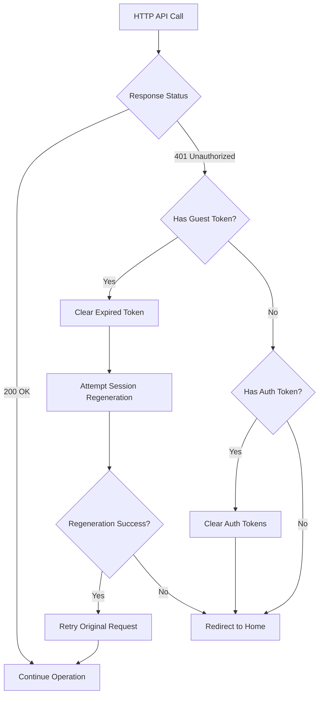

# Authentication Failures

<cite>
**Referenced Files in This Document**
- [GuestSessionContext.tsx](file://web/contexts/GuestSessionContext.tsx)
- [socket.ts](file://web/lib/socket.ts)
- [api.ts](file://web/lib/api.ts)
- [auth.js](file://backend/src/middleware/auth.js)
- [guestController.js](file://backend/src/controllers/guestController.js)
- [jwt.js](file://backend/src/utils/jwt.js)
- [redisGuestManager.js](file://backend/src/utils/redisGuestManager.js)
- [socketHandlers.js](file://backend/src/socket/socketHandlers.js)
- [TEST_TOKEN_EXPIRATION.md](file://TEST_TOKEN_EXPIRATION.md)
- [TOKEN_EXPIRATION_FIX.md](file://TOKEN_EXPIRATION_FIX.md)
</cite>

## Table of Contents
1. [Introduction](#introduction)
2. [Common Authentication Issues](#common-authentication-issues)
3. [Token Expiration Handling Mechanism](#token-expiration-handling-mechanism)
4. [Socket Service Authentication Flow](#socket-service-authentication-flow)
5. [React Context State Management](#react-context-state-management)
6. [Error Detection and Recovery](#error-detection-and-recovery)
7. [Testing and Validation](#testing-and-validation)
8. [Troubleshooting Guide](#troubleshooting-guide)
9. [Best Practices](#best-practices)
10. [Future Improvements](#future-improvements)

## Introduction

The Realtime Chat App implements a sophisticated authentication system for guest users that handles various authentication failures gracefully. The system manages JWT token expiration, socket connection errors, and session synchronization across multiple layers of the application architecture.

This documentation covers the comprehensive authentication failure handling mechanisms, including automatic token regeneration, session cleanup, and seamless user experience during authentication issues.

## Common Authentication Issues

### Expired JWT Tokens

The most common authentication issue occurs when JWT tokens expire during browser sessions. Guest tokens have a 2-hour lifetime and are stored in `sessionStorage`.

**Symptoms:**
- "Token has expired" error messages
- Socket connection failures
- HTTP API 401 Unauthorized responses
- Authentication middleware rejection

**Root Causes:**
- Browser tab remains open for extended periods
- Network connectivity issues causing repeated reconnections
- Backend token expiration policies

### Invalid Credentials

Authentication failures occur when tokens are malformed or contain invalid claims.

**Symptoms:**
- "Invalid token" error messages
- Token verification failures
- Malformed JWT structure

### Session Mismatches

Occur when there's inconsistency between stored session data and actual backend state.

**Symptoms:**
- Stale session data
- Inconsistent user state
- Socket authentication errors

## Token Expiration Handling Mechanism

The authentication system implements multiple layers of token expiration handling to ensure seamless user experience.

### Frontend Token Validation

The [`GuestSessionContext`](file://web/contexts/GuestSessionContext.tsx) performs JWT token expiration validation when restoring sessions from `sessionStorage`.



**Diagram sources**
- [GuestSessionContext.tsx](file://web/contexts/GuestSessionContext.tsx#L58-L85)

### Automatic Token Regeneration

When socket connections fail due to expired tokens, the system automatically regenerates sessions.



**Diagram sources**
- [socket.ts](file://web/lib/socket.ts#L150-L170)
- [api.ts](file://web/lib/api.ts#L25-L50)

**Section sources**
- [GuestSessionContext.tsx](file://web/contexts/GuestSessionContext.tsx#L58-L85)
- [socket.ts](file://web/lib/socket.ts#L400-L473)

## Socket Service Authentication Flow

The socket service implements comprehensive authentication handling for WebSocket connections.

### Authentication Middleware

The backend authentication middleware validates tokens for both HTTP requests and WebSocket connections.



**Diagram sources**
- [auth.js](file://backend/src/middleware/auth.js#L5-L100)
- [socket.ts](file://web/lib/socket.ts#L1-L50)
- [guestController.js](file://backend/src/controllers/guestController.js#L25-L60)

### Error Detection Patterns

The socket service recognizes multiple token expiration scenarios:

| Error Pattern | Description | Action Taken |
|---------------|-------------|--------------|
| `"Token has expired"` | Standard JWT expiration | Regenerate session |
| `"Guest session not found or expired"` | Session not found in Redis | Regenerate session |
| `"session not found"` | Redis session missing | Regenerate session |
| `"expired"` | Generic expiration message | Regenerate session |

**Section sources**
- [socket.ts](file://web/lib/socket.ts#L150-L170)
- [auth.js](file://backend/src/middleware/auth.js#L73-L99)

## React Context State Management

The [`GuestSessionContext`](file://web/contexts/GuestSessionContext.tsx) maintains synchronized state between React components and socket service.

### State Synchronization

```mermaid
flowchart LR
subgraph "React Context"
ReactState["guestUser State"]
IsRegenerating["isRegenerating Flag"]
end
subgraph "Socket Service"
SocketState["currentUser State"]
SocketEvents["Session Events"]
end
subgraph "Storage Layer"
SessionStorage["sessionStorage"]
LocalStorage["localStorage"]
end
ReactState < --> SocketState
SocketEvents --> ReactState
ReactState --> SessionStorage
SocketState --> SessionStorage
SessionStorage --> LocalStorage
```

**Diagram sources**
- [GuestSessionContext.tsx](file://web/contexts/GuestSessionContext.tsx#L100-L130)
- [socket.ts](file://web/lib/socket.ts#L450-L473)

### Session Lifecycle Management

The context manages session lifecycle with automatic cleanup and regeneration:

1. **Initialization**: Validates stored tokens and restores sessions
2. **Monitoring**: Periodic session validation and heartbeat
3. **Synchronization**: Keeps React state in sync with storage changes
4. **Regeneration**: Handles token expiration and creates new sessions
5. **Cleanup**: Removes expired sessions and cleans up resources

**Section sources**
- [GuestSessionContext.tsx](file://web/contexts/GuestSessionContext.tsx#L100-L200)

## Error Detection and Recovery

### HTTP API Error Handling

The API interceptor handles 401 Unauthorized responses from HTTP requests.



**Diagram sources**
- [api.ts](file://web/lib/api.ts#L25-L70)

### Socket Connection Error Recovery

The socket service implements robust error recovery for connection failures:

1. **Error Detection**: Monitors `connect_error` and `reconnect_error` events
2. **Token Validation**: Checks for expired token messages
3. **Race Condition Prevention**: Uses `isRegeneratingToken` flag
4. **Graceful Degradation**: Falls back to redirect if regeneration fails
5. **State Synchronization**: Updates React context after regeneration

**Section sources**
- [socket.ts](file://web/lib/socket.ts#L150-L200)
- [api.ts](file://web/lib/api.ts#L25-L70)

## Testing and Validation

### Automated Test Coverage

The system includes comprehensive automated tests for token expiration scenarios:

| Test Category | Tests | Purpose |
|---------------|-------|---------|
| Token Expiration Detection | 3 tests | Verify error recognition |
| Token Regeneration | 3 tests | Test session creation |
| Loop Prevention | 2 tests | Prevent concurrent regens |
| Failure Handling | 3 tests | Graceful degradation |
| Device ID Persistence | 2 tests | Maintain user identity |

### Manual Testing Scenarios

#### Scenario 1: Expired Token on Page Load
1. Open browser DevTools → Application → Session Storage
2. Locate `guestAuthToken` and `guest_user_session`
3. Manually modify token expiration to past date
4. Reload page and verify automatic session regeneration

#### Scenario 2: Socket Reconnection with Expired Token
1. Create a guest session
2. Wait for token to expire or manually expire it
3. Disconnect and reconnect network
4. Verify new session creation and socket reconnection

**Section sources**
- [TEST_TOKEN_EXPIRATION.md](file://TEST_TOKEN_EXPIRATION.md#L180-L220)

## Troubleshooting Guide

### Common Issues and Solutions

#### Issue: "Token has expired" Error Message

**Symptoms:**
- Error appears in browser console
- Socket connection fails
- HTTP API requests return 401

**Solutions:**
1. **Automatic Recovery**: The system automatically handles this error
2. **Manual Refresh**: Reload the page to create a new session
3. **Clear Storage**: Manually clear browser storage if needed

#### Issue: Stuck in Loading State

**Symptoms:**
- Page shows loading indefinitely
- No error messages appear

**Solutions:**
1. Check browser console for JavaScript errors
2. Verify network connectivity
3. Clear browser cache and cookies
4. Try incognito mode

#### Issue: Multiple Regeneration Attempts

**Symptoms:**
- Multiple new sessions created rapidly
- Confusing user experience

**Solutions:**
1. Check for race conditions in simultaneous requests
2. Verify `isRegeneratingToken` flag is working correctly
3. Review concurrent operation handling

### Diagnostic Steps

1. **Check Token Validity**: Verify JWT token structure and expiration
2. **Inspect Storage**: Examine `sessionStorage` and `localStorage`
3. **Network Monitoring**: Check WebSocket connection status
4. **Console Logs**: Review browser console for error messages
5. **Backend Logs**: Monitor server logs for authentication errors

**Section sources**
- [TOKEN_EXPIRATION_FIX.md](file://TOKEN_EXPIRATION_FIX.md#L80-L111)

## Best Practices

### Security Considerations

1. **Token Expiration**: Use appropriate token lifetimes (currently 2 hours)
2. **Secure Storage**: Store tokens in `sessionStorage` (not cookies)
3. **Error Handling**: Never expose sensitive error details to users
4. **Rate Limiting**: Implement limits on session regeneration attempts

### Performance Optimization

1. **Lazy Loading**: Initialize authentication only when needed
2. **Caching**: Cache validated tokens appropriately
3. **Heartbeat**: Use periodic heartbeats for presence management
4. **Cleanup**: Regular cleanup of expired sessions

### User Experience

1. **Seamless Recovery**: Automatic session regeneration without user intervention
2. **Progress Indicators**: Show loading states during regeneration
3. **Error Messages**: Provide helpful error messages
4. **Fallback Options**: Graceful degradation when regeneration fails

## Future Improvements

### Proactive Token Refresh

Implement token refresh before expiration to minimize disruptions:

```typescript
// Pseudocode for proactive refresh
const tokenRefreshThreshold = 30 * 60 * 1000; // 30 minutes
if (timeUntilExpiration < tokenRefreshThreshold) {
  await refreshToken();
}
```

### Session Persistence

Consider implementing refresh tokens for longer-lived sessions:

1. **Long-term Storage**: Store refresh tokens securely
2. **Automatic Renewal**: Renew access tokens before expiration
3. **Security Enhancements**: Implement token rotation

### Enhanced Monitoring

1. **Metrics Collection**: Track authentication failure rates
2. **User Impact Analysis**: Measure impact of authentication issues
3. **Performance Monitoring**: Monitor regeneration performance
4. **Error Reporting**: Implement comprehensive error reporting

### Improved User Feedback

1. **Warning Notifications**: Alert users before token expiration
2. **Recovery Options**: Provide manual regeneration options
3. **Status Indicators**: Show authentication status clearly
4. **Help Resources**: Link to troubleshooting documentation

**Section sources**
- [TOKEN_EXPIRATION_FIX.md](file://TOKEN_EXPIRATION_FIX.md#L100-L111)