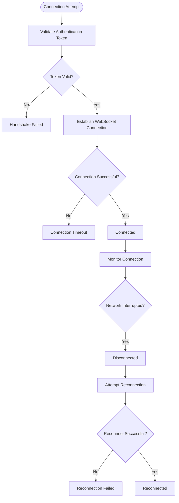
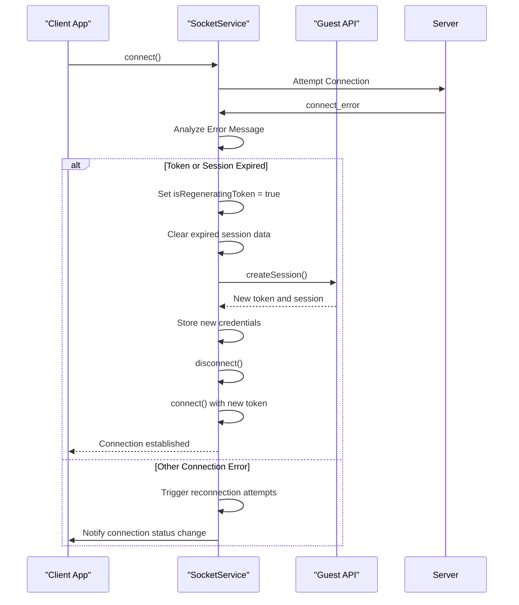
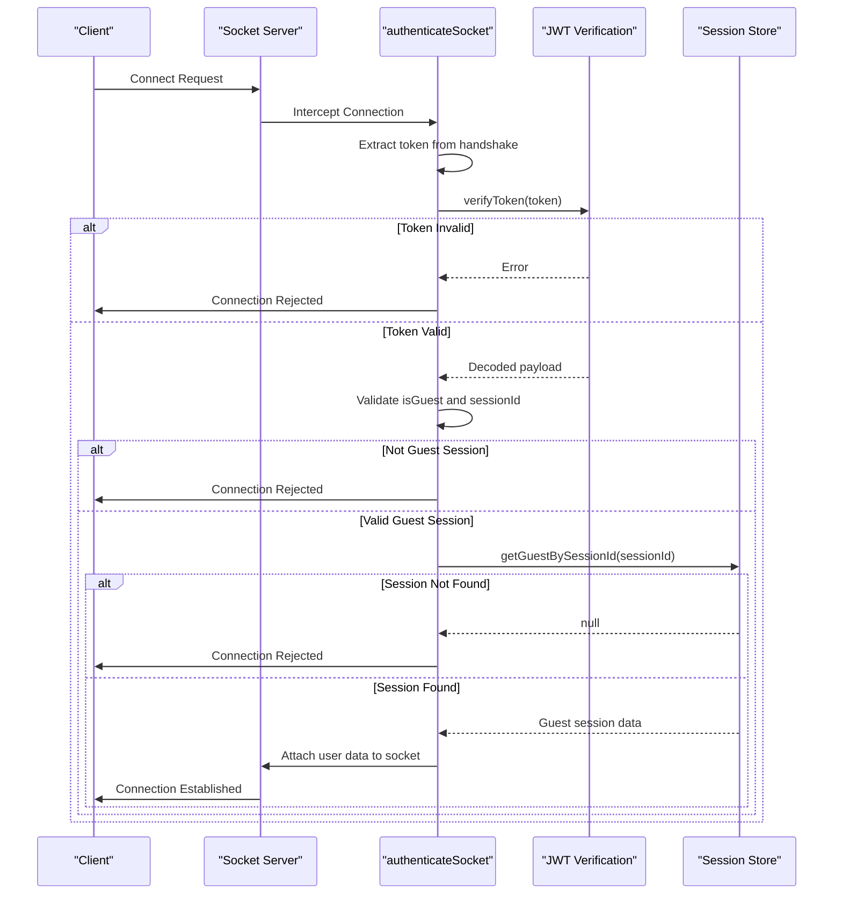
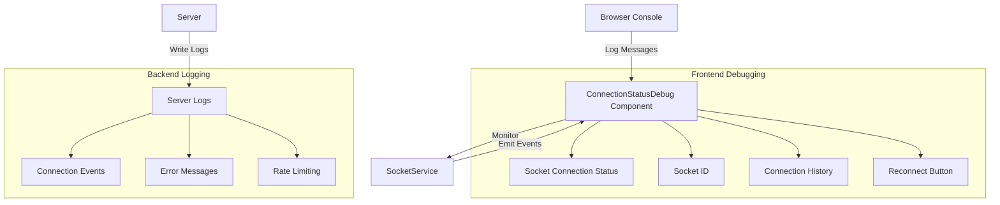
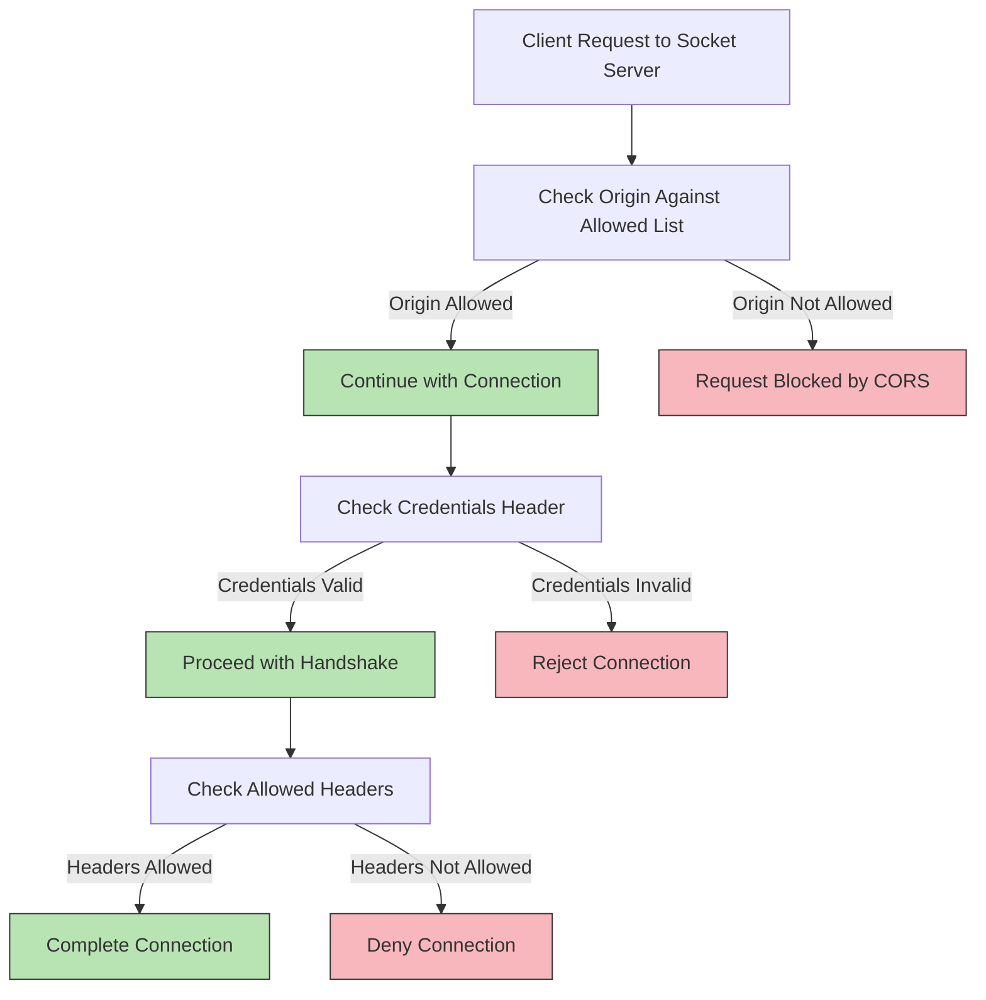
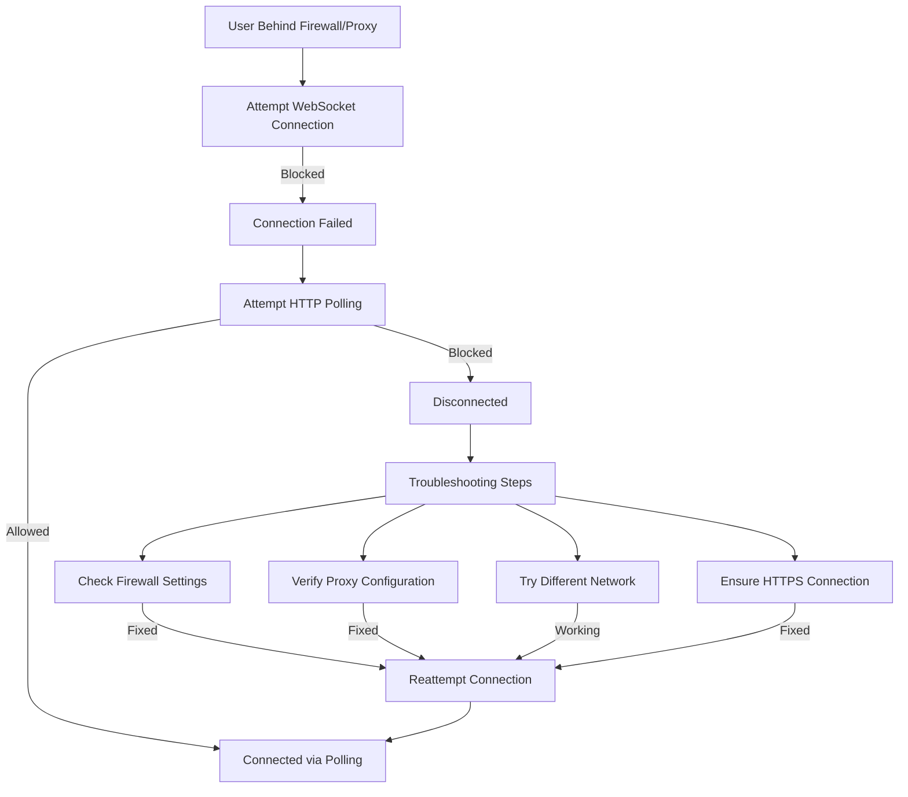
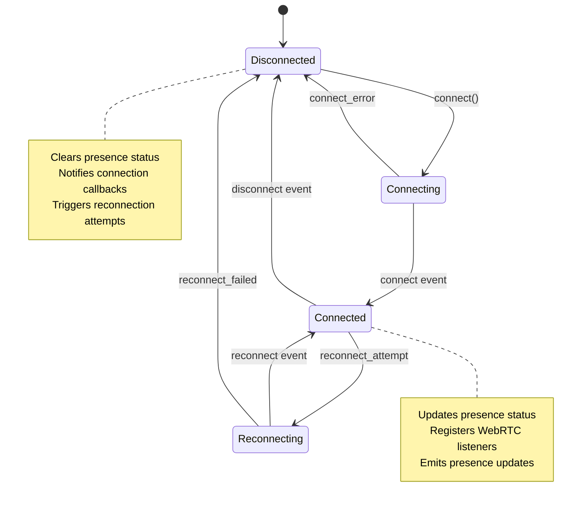

# Connection Problems

<cite>
**Referenced Files in This Document**   
- [socket.ts](file://web/lib/socket.ts)
- [cors-debug.js](file://backend/src/middleware/cors-debug.js)
- [socketServer.js](file://backend/src/socket/socketServer.js)
- [socketHandlers.js](file://backend/src/socket/socketHandlers.js)
- [auth.js](file://backend/src/middleware/auth.js)
- [api.ts](file://web/lib/api.ts)
- [ConnectionStatusDebug.tsx](file://web/components/ConnectionStatusDebug.tsx)
- [SessionTestButton.tsx](file://web/components/SessionTestButton.tsx)
</cite>

## Table of Contents
1. [Introduction](#introduction)
2. [Common Connection Issues](#common-connection-issues)
3. [Socket Connection Retry Mechanism](#socket-connection-retry-mechanism)
4. [Backend Socket Authentication](#backend-socket-authentication)
5. [Debugging Connection Issues](#debugging-connection-issues)
6. [CORS-Related Connection Problems](#cors-related-connection-problems)
7. [Firewall and Proxy Solutions](#firewall-and-proxy-solutions)
8. [Socket Service and Network State Management](#socket-service-and-network-state-management)
9. [Troubleshooting Guide](#troubleshooting-guide)
10. [Conclusion](#conclusion)

## Introduction
The Realtime Chat App relies on persistent WebSocket connections to enable real-time communication between users. This document details the various connection problems that can occur in the application, including socket connection timeouts, failed handshakes, and network interruptions. It explains the implementation of the socket connection retry mechanism, backend authentication processes, and solutions for common connection issues such as CORS problems and firewall restrictions. The document also provides guidance on debugging connection issues using browser developer tools and server logs.

## Common Connection Issues

The Realtime Chat App may encounter several types of connection issues that affect user experience. These include socket connection timeouts, failed handshakes, and network interruptions.

Socket connection timeouts occur when the client cannot establish a connection with the server within the specified timeout period of 20 seconds. This can happen due to network latency, server overload, or connectivity issues on the client side. The application is configured with a timeout of 20000 milliseconds, as defined in the socket configuration.

Failed handshakes typically result from authentication issues or CORS (Cross-Origin Resource Sharing) problems. When a client attempts to connect to the socket server, it must provide a valid authentication token. If the token is missing, expired, or invalid, the handshake will fail. The backend authentication middleware validates the token and session before establishing the connection.

Network interruptions can occur due to unstable internet connections, especially on mobile networks or public Wi-Fi. These interruptions can cause temporary disconnections that the application must handle gracefully. The socket service is designed to detect these interruptions and attempt to reconnect automatically.



**Diagram sources**
- [socket.ts](file://web/lib/socket.ts#L15-L473)
- [socketServer.js](file://backend/src/socket/socketServer.js#L1-L199)

**Section sources**
- [socket.ts](file://web/lib/socket.ts#L15-L473)
- [socketServer.js](file://backend/src/socket/socketServer.js#L1-L199)

## Socket Connection Retry Mechanism

The socket connection retry mechanism in the Realtime Chat App is implemented in web/lib/socket.ts and provides robust error handling for 'connect_error' events and automatic reconnection logic.

The SocketService class manages the connection lifecycle and implements a comprehensive retry strategy. When connecting to the server, the socket is configured with specific reconnection options:

```typescript
this.socket = io(SOCKET_URL, {
  auth: {
    token: token,
  },
  transports: ["websocket", "polling"],
  reconnection: true,
  reconnectionAttempts: 10,
  reconnectionDelay: 1000,
  reconnectionDelayMax: 5000,
  timeout: 20000,
  forceNew: true,
});
```

The retry mechanism includes several key features:
- Automatic reconnection attempts up to 10 times
- Initial reconnection delay of 1 second, increasing up to a maximum of 5 seconds
- Support for both WebSocket and HTTP polling transports
- 20-second connection timeout

When a 'connect_error' event occurs, the system analyzes the error message to determine the appropriate response. The error handling specifically detects token expiration and session expiration scenarios:



**Diagram sources**
- [socket.ts](file://web/lib/socket.ts#L15-L473)

**Section sources**
- [socket.ts](file://web/lib/socket.ts#L15-L473)

## Backend Socket Authentication

The backend socket server handles connection authentication and session validation through a middleware system implemented in backend/src/middleware/auth.js. This authentication process ensures that only valid guest sessions can establish socket connections.

The authentication flow begins when a client attempts to connect to the socket server. The authenticateSocket middleware intercepts the connection request and validates the provided token:



The authentication process involves several steps:
1. Extract the authentication token from the socket handshake
2. Verify the JWT token signature and expiration
3. Confirm that the token represents a guest session (isGuest flag)
4. Validate that the session ID exists in the database
5. Attach user information to the socket object for use in handlers

If any step fails, the connection is rejected with an appropriate error message. The error messages are designed to be specific, helping with debugging:
- "Authentication token required" - when no token is provided
- "Only guest sessions are supported" - when the token is not for a guest session
- "Guest session not found or expired" - when the session ID is invalid or expired

The authenticated socket object includes user information that is used throughout the application:

```javascript
socket.user = {
  id: guestSession.id,
  username: guestSession.username,
  isGuest: true,
  sessionId: guestSession.sessionId
};
socket.userId = guestSession.id;
socket.sessionId = guestSession.sessionId;
socket.isGuest = true;
```

This authentication system ensures that only valid guest sessions can participate in the chat application, while providing clear error messages for troubleshooting connection issues.

**Diagram sources**
- [auth.js](file://backend/src/middleware/auth.js#L1-L100)
- [socketServer.js](file://backend/src/socket/socketServer.js#L1-L199)

**Section sources**
- [auth.js](file://backend/src/middleware/auth.js#L1-L100)
- [socketServer.js](file://backend/src/socket/socketServer.js#L1-L199)

## Debugging Connection Issues

Debugging connection issues in the Realtime Chat App involves using both browser developer tools and server logs to identify and resolve problems.

The application includes several debugging tools and logging mechanisms to help identify connection issues. In the frontend, the ConnectionStatusDebug component provides real-time information about the connection status:



The ConnectionStatusDebug component displays:
- Current connection status (connected/disconnected)
- Guest session status
- Current user information
- Socket ID
- Connection history with timestamps
- A manual reconnect button

In the browser developer tools, developers can monitor connection issues by checking the console for log messages. The socket service logs detailed information about connection attempts:

```javascript
console.log("🔧 Socket URL:", SOCKET_URL);
console.log("🔌 Attempting to connect to:", SOCKET_URL);
console.log("✅ Successfully connected to server:", SOCKET_URL);
console.log("❌ Connection error:", error);
console.log("🔄 Reconnection attempt #", attemptNumber);
```

On the backend, server logs provide additional information about connection attempts and errors. The logger in backend/src/config/logger.js captures connection events and errors:

```javascript
logger.info(`New socket connection: ${socket.id} for user: ${socket.user.username}`);
logger.info(`Socket disconnected: ${socket.id}, reason: ${reason}`);
logger.error(`Socket error for ${socket.id}:`, error);
logger.error('Socket.IO connection error:', error);
```

For more detailed debugging, the SessionTestButton component allows developers to simulate session expiration in development mode:

```typescript
const simulateExpiredSession = () => {
  sessionStorage.removeItem("guestAuthToken")
  console.log("🧪 Simulated session expiration - next API call will trigger regeneration")
}
```

This component helps test the token regeneration flow without waiting for actual token expiration.

**Diagram sources**
- [ConnectionStatusDebug.tsx](file://web/components/ConnectionStatusDebug.tsx#L1-L123)
- [SessionTestButton.tsx](file://web/components/SessionTestButton.tsx#L1-L27)
- [socket.ts](file://web/lib/socket.ts#L15-L473)
- [socketServer.js](file://backend/src/socket/socketServer.js#L1-L199)

**Section sources**
- [ConnectionStatusDebug.tsx](file://web/components/ConnectionStatusDebug.tsx#L1-L123)
- [SessionTestButton.tsx](file://web/components/SessionTestButton.tsx#L1-L27)
- [socket.ts](file://web/lib/socket.ts#L15-L473)
- [socketServer.js](file://backend/src/socket/socketServer.js#L1-L199)

## CORS-Related Connection Problems

CORS (Cross-Origin Resource Sharing) related connection problems are addressed by the cors-debug.js middleware in the backend. This middleware configures CORS settings to allow connections from various origins, particularly during development and production deployment.

The cors-debug.js file contains two configurations: debugCorsOptions and permissiveCorsOptions. The debugCorsOptions provides a balanced approach that allows specific origins while maintaining security:

```javascript
const debugCorsOptions = {
  origin: [
    "https://realtime-web-app-ecru.vercel.app",
    "https://realtime-web-app.onrender.com",
    "http://localhost:3000",
    "http://localhost:3001",
    "http://localhost:3335",
    /\.vercel\.app$/, // Allow any vercel app
  ],
  credentials: true,
  methods: ["GET", "POST", "PUT", "DELETE", "OPTIONS", "PATCH"],
  allowedHeaders: [
    "Content-Type",
    "Authorization", 
    "X-Requested-With",
    "Accept",
    "Origin",
    "X-CSRF-Token"
  ],
  exposedHeaders: ["X-Total-Count"],
  optionsSuccessStatus: 200,
  preflightContinue: false,
};
```

The permissiveCorsOptions configuration is even more lenient, allowing connections from any origin:

```javascript
const permissiveCorsOptions = {
  origin: true, // Allow all origins
  credentials: true,
  methods: ["GET", "POST", "PUT", "DELETE", "OPTIONS", "PATCH"],
  allowedHeaders: "*",
  exposedHeaders: ["X-Total-Count"],
  optionsSuccessStatus: 200,
};
```

These configurations address common CORS issues that prevent socket connections:



The middleware is applied to the socket server in socketServer.js:

```javascript
const io = new Server(server, {
  cors: {
    origin: process.env.CORS_ORIGIN || "http://localhost:3000",
    methods: ["GET", "POST"],
    credentials: true
  },
  transports: ['websocket', 'polling'],
  pingTimeout: 60000,
  pingInterval: 25000
});
```

This configuration ensures that the socket server accepts connections from the expected domains while preventing unauthorized access. The use of regular expressions ( /\.vercel\.app$/ ) allows for flexibility in deployment environments, particularly when using Vercel for hosting.

**Diagram sources**
- [cors-debug.js](file://backend/src/middleware/cors-debug.js#L1-L41)
- [socketServer.js](file://backend/src/socket/socketServer.js#L1-L199)

**Section sources**
- [cors-debug.js](file://backend/src/middleware/cors-debug.js#L1-L41)
- [socketServer.js](file://backend/src/socket/socketServer.js#L1-L199)

## Firewall and Proxy Solutions

Users behind restrictive firewalls or proxies may encounter connection issues with the Realtime Chat App. The application addresses these challenges through multiple transport methods and connection configuration.

The socket client is configured to use both WebSocket and HTTP polling transports:

```javascript
transports: ["websocket", "polling"]
```

This dual-transport approach allows the application to fall back to HTTP polling if WebSocket connections are blocked by a firewall or proxy. HTTP polling uses standard HTTP ports (80 for HTTP, 443 for HTTPS) which are typically allowed through most firewalls.

For users experiencing connection issues, the following solutions are recommended:

1. **Check firewall settings**: Ensure that WebSocket connections (typically on port 80/443) are allowed
2. **Verify proxy configuration**: Some corporate proxies may block WebSocket connections
3. **Try different networks**: Switch between Wi-Fi and mobile data to identify network-specific issues
4. **Use HTTPS**: Ensure the application is accessed over HTTPS, as some networks block WebSocket connections over HTTP

The application's connection debugging tools can help identify firewall and proxy issues:



The ConnectionStatusDebug component can help users identify when they are connected via polling rather than WebSocket, indicating potential firewall restrictions.

**Section sources**
- [socket.ts](file://web/lib/socket.ts#L15-L473)
- [ConnectionStatusDebug.tsx](file://web/components/ConnectionStatusDebug.tsx#L1-L123)

## Socket Service and Network State Management

The socket service in the Realtime Chat App plays a crucial role in maintaining persistent connections and handling network state changes. Implemented in web/lib/socket.ts, the SocketService class manages the entire connection lifecycle.

The service maintains connection state through several key properties:

```typescript
private socket: Socket | null = null;
public isConnected = false;
private connectionCallbacks: ((connected: boolean) => void)[] = [];
```

These properties track the current socket instance, connection status, and registered callbacks for connection status changes.

The service handles network state changes through event listeners:



When the network state changes, the service takes appropriate actions:

1. **On connection**: Updates the isConnected flag, notifies callbacks, registers WebRTC listeners, and emits presence updates
2. **On disconnection**: Updates the isConnected flag, notifies callbacks, and clears presence status
3. **On connection error**: Analyzes the error, handles token expiration, and triggers reconnection
4. **On reconnection**: Updates the isConnected flag and notifies callbacks

The service also provides methods for users to manage their connection status:

```typescript
getConnectionStatus(): boolean
onConnectionChange(callback: (connected: boolean) => void): () => void
disconnect(): void
```

These methods allow components to monitor connection status and respond appropriately to network changes.

**Diagram sources**
- [socket.ts](file://web/lib/socket.ts#L15-L473)

**Section sources**
- [socket.ts](file://web/lib/socket.ts#L15-L473)

## Troubleshooting Guide

This troubleshooting guide provides solutions for common connection problems in the Realtime Chat App.

### Common Issues and Solutions

**1. Connection Timeout**
- **Symptoms**: "Connection timeout" message, failed to connect after 20 seconds
- **Solutions**:
  - Check internet connection
  - Try refreshing the page
  - Use the manual reconnect button in ConnectionStatusDebug
  - Try a different network

**2. Authentication Failed**
- **Symptoms**: "Authentication token required" or "Guest session not found or expired"
- **Solutions**:
  - Clear browser storage and refresh
  - For development: Use the SessionTestButton to simulate and fix
  - Check that the token is being sent in the handshake

**3. CORS Errors**
- **Symptoms**: "Cross-Origin Request Blocked" in browser console
- **Solutions**:
  - Ensure you're accessing the correct URL
  - Check that the origin is in the allowed list
  - For development, verify localhost ports match configuration

**4. WebSocket Blocked**
- **Symptoms**: Connection falls back to polling, or fails entirely
- **Solutions**:
  - Check firewall settings for WebSocket (ports 80/443)
  - Verify proxy configuration allows WebSocket connections
  - Try using HTTPS instead of HTTP

### Debugging Steps

1. **Check browser console** for error messages
2. **Use ConnectionStatusDebug** component to monitor connection status
3. **Verify network connectivity** and try refreshing
4. **Check server logs** for authentication and connection errors
5. **Test with SessionTestButton** in development mode

### Prevention Strategies

- Implement proper error handling in all socket operations
- Use the connection status callbacks to update UI appropriately
- Monitor connection quality and provide user feedback
- Implement graceful degradation when WebSocket is unavailable

**Section sources**
- [socket.ts](file://web/lib/socket.ts#L15-L473)
- [ConnectionStatusDebug.tsx](file://web/components/ConnectionStatusDebug.tsx#L1-L123)
- [SessionTestButton.tsx](file://web/components/SessionTestButton.tsx#L1-L27)

## Conclusion

The Realtime Chat App implements a comprehensive system for handling connection problems, from socket connection timeouts to authentication issues and network interruptions. The socket service in web/lib/socket.ts provides robust error handling and automatic reconnection logic, while the backend socket server handles authentication and session validation through middleware in backend/src/middleware/auth.js.

Key features of the connection system include:
- Automatic retry mechanism with configurable attempts and delays
- Comprehensive error handling for 'connect_error' events
- Token expiration detection and automatic session regeneration
- CORS configuration to handle cross-origin connection issues
- Support for multiple transports (WebSocket and polling) to work around firewall restrictions

The application provides several tools for debugging connection issues, including detailed logging, the ConnectionStatusDebug component, and the SessionTestButton for development testing. These tools help developers and users identify and resolve connection problems quickly.

By understanding these connection mechanisms and troubleshooting strategies, developers can effectively maintain and improve the reliability of the Realtime Chat App's real-time communication features.