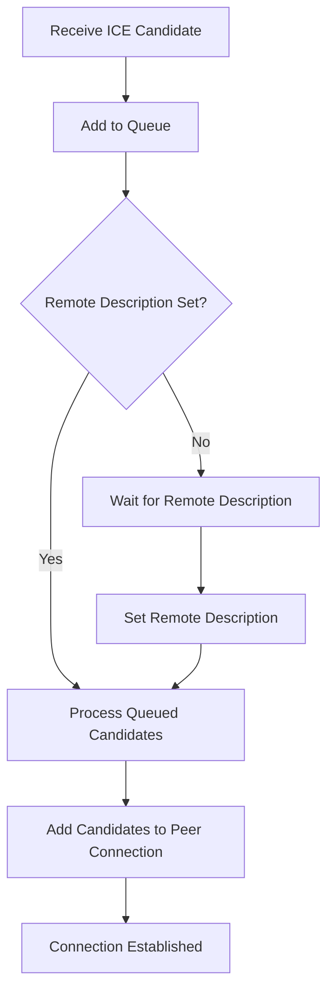
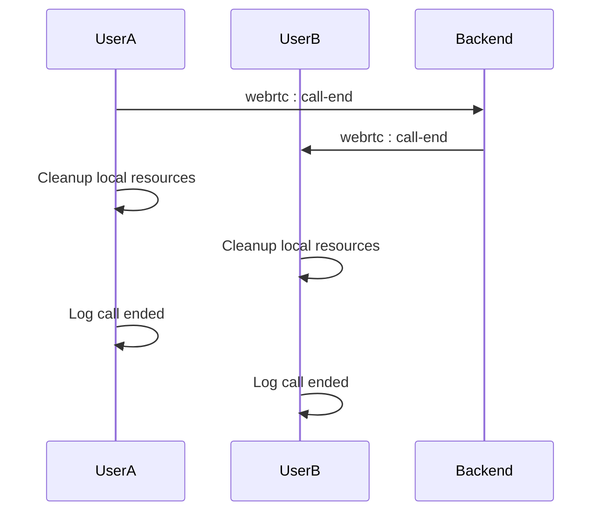

# Troubleshooting Guide

<cite>
**Referenced Files in This Document**   
- [ISSUE_SUMMARY.md](file://ISSUE_SUMMARY.md)
- [TEST_TOKEN_EXPIRATION.md](file://TEST_TOKEN_EXPIRATION.md)
- [TOKEN_EXPIRATION_FIX.md](file://TOKEN_EXPIRATION_FIX.md)
- [MOBILE_WEBRTC_GUIDE.md](file://web/MOBILE_WEBRTC_GUIDE.md)
- [WEBRTC_FIX.md](file://WEBRTC_FIX.md)
- [CALL_DISCONNECTION_TEST.md](file://web/CALL_DISCONNECTION_TEST.md)
- [CAMERA_TOGGLE_TEST_GUIDE.md](file://web/CAMERA_TOGGLE_TEST_GUIDE.md)
- [backend/src/socket/socketHandlers.js](file://backend/src/socket/socketHandlers.js)
- [backend/src/socket/socketServer.js](file://backend/src/socket/socketServer.js)
- [web/lib/socket.ts](file://web/lib/socket.ts)
- [web/lib/mediaUtils.ts](file://web/lib/mediaUtils.ts)
- [web/hooks/useWebRTC.ts](file://web/hooks/useWebRTC.ts)
</cite>

## Table of Contents
1. [Connection Problems](#connection-problems)
2. [Authentication Failures](#authentication-failures)
3. [WebRTC/Camera Issues](#webrtccamera-issues)
4. [Messaging Delays](#messaging-delays)
5. [Performance Problems](#performance-problems)
6. [File Upload Failures](#file-upload-failures)
7. [Monitoring and Logging](#monitoring-and-logging)
8. [Scalability and Resource Exhaustion](#scalability-and-resource-exhaustion)

## Connection Problems

### Socket Connection Issues
When users experience connection problems, the most common causes are related to socket connectivity and network configuration.

**Common Symptoms:**
- "Connection failed" or "Failed to connect to server" errors
- Repeated connection attempts with "Reconnection attempt" messages
- "Failed to reconnect after all attempts" in browser console

**Diagnostic Steps:**
1. **Verify server status**: Ensure the backend server is running on port 3001
2. **Check network connectivity**: Verify the client can reach the server endpoint
3. **Inspect browser console**: Look for socket connection errors and CORS issues
4. **Validate environment variables**: Confirm `NEXT_PUBLIC_SOCKET_URL` is correctly set

**Solutions:**
- Ensure the server is running: `cd backend && npm start`
- Verify the socket URL in `web/lib/socket.ts` matches the server address
- Check CORS configuration in `socketServer.js` to ensure the frontend origin is allowed
- Test with different network connections to rule out firewall restrictions

**Backend Socket Configuration:**
The socket server is configured with appropriate timeouts and reconnection settings:

```javascript
const io = new Server(server, {
  cors: {
    origin: process.env.CORS_ORIGIN || "http://localhost:3000",
    methods: ["GET", "POST"],
    credentials: true
  },
  transports: ['websocket', 'polling'],
  pingTimeout: 60000,
  pingInterval: 25000
});
```

**Section sources**
- [web/lib/socket.ts](file://web/lib/socket.ts#L1-L50)
- [backend/src/socket/socketServer.js](file://backend/src/socket/socketServer.js#L1-L30)

## Authentication Failures

### Token Expiration and Refresh Issues
The Realtime Chat App implements a robust token expiration and refresh mechanism to handle guest session authentication.

**Root Causes:**
- JWT tokens expire after 2 hours of inactivity
- Expired tokens persist in `sessionStorage` across browser sessions
- Socket connection attempts with expired tokens are rejected by the backend
- No automatic validation of token expiration before connection attempts

**Solution Implementation:**
The authentication system has been enhanced with automatic token regeneration:

1. **Token Validation on Page Load** (`web/contexts/GuestSessionContext.tsx`):
   - Decodes JWT token to extract expiration claim
   - Compares expiration time with current time
   - Clears expired tokens automatically before connection attempts

2. **Socket Connection Error Handling** (`web/lib/socket.ts`):
   - Detects "Token has expired" errors from backend
   - Automatically clears expired session data
   - Creates a new guest session with fresh JWT token
   - Reconnects socket with new credentials
   - Prevents infinite loops with `isRegeneratingToken` flag

3. **Session Synchronization**:
   - Periodic checks ensure React state matches `sessionStorage`
   - Updates state when socket service regenerates the session
   - Maintains consistency between socket service and React context

**Diagnostic Steps:**
1. **Check browser storage**: Inspect `sessionStorage` for `guestAuthToken` and `guest_user_session`
2. **Monitor console logs**: Look for "Token has expired" and "Regenerating session" messages
3. **Test token expiration**: Manually modify token expiration in `sessionStorage` to test regeneration
4. **Verify device ID persistence**: Ensure device ID is preserved during token regeneration

**Testing Scenarios:**
- **Expired Token on Page Load**: Edit token to set expiration in the past, reload page
- **Token Expires During Connection**: Wait for token to expire, disconnect/reconnect network
- **Concurrent Expiration Handling**: Trigger multiple operations simultaneously after token expiration

**Section sources**
- [TOKEN_EXPIRATION_FIX.md](file://TOKEN_EXPIRATION_FIX.md#L1-L50)
- [TEST_TOKEN_EXPIRATION.md](file://TEST_TOKEN_EXPIRATION.md#L1-L30)
- [web/lib/socket.ts](file://web/lib/socket.ts#L300-L473)

## WebRTC/Camera Issues

### ICE Connection Failures
WebRTC calls were previously getting stuck at the "connecting" state due to ICE candidate timing issues.

**Root Cause:**
- ICE candidates arriving before `setRemoteDescription` was called
- Candidates being rejected when remote description wasn't set
- Inconsistent queue processing and no retry mechanism

**Solution:**
Enhanced ICE candidate handling with proper queuing and processing:

1. **Always queue ICE candidates first** to prevent race conditions
2. **Process queue immediately** if remote description exists
3. **Improved queue processing**:
   - Copy queue before processing
   - Clear queue immediately to prevent duplicates
   - Continue on individual candidate errors
   - Better logging for debugging

4. **Explicit queue processing** after:
   - Setting remote description in `acceptCall()`
   - Setting remote answer in `handleReceiveAnswer()`



**Diagram sources**
- [WEBRTC_FIX.md](file://WEBRTC_FIX.md#L1-L30)
- [ISSUE_SUMMARY.md](file://ISSUE_SUMMARY.md#L1-L30)
- [web/hooks/useWebRTC.ts](file://web/hooks/useWebRTC.ts#L500-L570)

### Camera/Microphone Access Issues
Mobile and desktop browsers have specific requirements for media device access.

**Common Issues:**
- `navigator.mediaDevices.getUserMedia` undefined error
- Permission denied errors
- Camera not found errors
- Constraint errors

**Mobile-Specific Challenges:**
- **iOS Safari**: Requires HTTPS, has constraint limits (max 720p), and permissions are managed in Settings
- **Android Chrome**: Generally better performance, system-level permission prompts
- **iOS Chrome**: Uses Safari's WebView, same constraints as Safari

**Solutions:**
1. **Cross-browser Media Utility** (`web/lib/mediaUtils.ts`):
   - Modern API with legacy fallbacks
   - Device detection for iOS, Android, mobile vs desktop
   - Optimal constraints for different devices
   - Smart fallbacks and retry strategies

2. **User-Friendly Error Handling** (`components/MediaErrorAlert.tsx`):
   - Context-aware messages for each error type
   - Platform-specific guidance for iOS/Android
   - Action buttons for retry, help, and dismiss

**Diagnostic Steps:**
1. **Check browser console** for media access logs
2. **Verify HTTPS** for mobile Safari
3. **Test on real devices** rather than browser dev tools
4. **Check device permissions** in browser and system settings

**Section sources**
- [MOBILE_WEBRTC_GUIDE.md](file://web/MOBILE_WEBRTC_GUIDE.md#L1-L50)
- [web/lib/mediaUtils.ts](file://web/lib/mediaUtils.ts#L1-L270)
- [web/hooks/useWebRTC.ts](file://web/hooks/useWebRTC.ts#L1-L50)

### Audio/Video Sync Problems
When camera toggling, users may experience sync issues between local and remote views.

**Root Cause:**
- Video track state changes not properly detected
- Browser caching last frame when track is disabled
- No proper refresh mechanism for video elements

**Solution:**
1. **Enhanced Track Monitoring**:
   - Use both `videoTrack.enabled` and `videoTrack.muted` properties
   - Add event listeners for `mute` and `unmute` events
   - Implement polling as backup mechanism (200ms intervals)

2. **Local Preview Refresh**:
   - Force refresh video element by clearing and resetting `srcObject`
   - Add 50ms delay to ensure browser processes the change
   - Explicitly call `play()` after restoring stream

**Testing:**
- Toggle camera on/off and verify both local and remote views update
- Check console logs for "Video disabled" and "Local video preview restored" messages
- Test on multiple browsers and devices

**Section sources**
- [CAMERA_TOGGLE_TEST_GUIDE.md](file://web/CAMERA_TOGGLE_TEST_GUIDE.md#L1-L30)
- [web/components/VideoCallModal.tsx](file://web/components/VideoCallModal.tsx#L1-L50)

## Messaging Delays

### Socket Message Delivery Issues
Messaging delays can occur due to network latency, server processing, or client-side issues.

**Common Causes:**
- Network connectivity issues
- Server processing bottlenecks
- Client-side rendering delays
- Message validation failures

**Diagnostic Steps:**
1. **Check network tab**: Monitor WebSocket messages for delays
2. **Inspect server logs**: Look for message processing errors
3. **Verify message format**: Ensure messages meet validation requirements
4. **Test with different network conditions**: WiFi, mobile data, etc.

**Solutions:**
- Implement message delivery confirmations
- Add client-side message queuing for offline scenarios
- Optimize server-side message processing
- Use efficient data structures for message storage

**Backend Message Handling:**
The socket handlers include proper validation and error handling:

```javascript
async function handleChatMessage(socket, data) {
  try {
    const { type, content, timestamp } = data;

    // Validate message based on type
    let isValid = false;
    switch (type) {
      case 'text':
        isValid = validateMessage.text(content);
        break;
      case 'file':
        isValid = validateMessage.file(content);
        break;
      case 'voice':
        isValid = validateMessage.voice(content);
        break;
      default:
        isValid = false;
    }

    if (!isValid) {
      socket.emit('chat:error', { message: 'Invalid message format' });
      return;
    }
    // ... message processing
  } catch (error) {
    logger.error('Chat message error:', error);
    socket.emit('chat:error', { message: 'Failed to send message' });
  }
}
```

**Section sources**
- [backend/src/socket/socketHandlers.js](file://backend/src/socket/socketHandlers.js#L250-L300)

## Performance Problems

### Call Disconnection Issues
Call disconnections can occur due to network issues, improper cleanup, or signaling problems.

**Root Cause:**
- Incomplete peer connection and stream cleanup
- Memory leaks from lingering MediaStream objects
- Missing socket event listeners for call end/reject

**Solution:**
1. **Proper Cleanup**:
   - Stop all media tracks on call end
   - Close peer connections properly
   - Remove socket listeners to prevent memory leaks

2. **Bidirectional Signaling**:
   - Implement `webrtc:call-end` and `webrtc:call-reject` events
   - Ensure both users receive call status updates
   - Properly log call duration and status



**Diagram sources**
- [CALL_DISCONNECTION_TEST.md](file://web/CALL_DISCONNECTION_TEST.md#L1-L30)
- [backend/src/socket/socketHandlers.js](file://backend/src/socket/socketHandlers.js#L600-L650)

**Testing Scenarios:**
- Normal call end by caller or callee
- Call rejection by recipient
- Network interruption during call
- Multiple rapid call attempts

**Section sources**
- [CALL_DISCONNECTION_TEST.md](file://web/CALL_DISCONNECTION_TEST.md#L1-L50)
- [web/hooks/useWebRTC.ts](file://web/hooks/useWebRTC.ts#L1-L50)

## File Upload Failures

### Upload Processing Issues
File uploads can fail due to size limits, format restrictions, or server-side processing errors.

**Common Causes:**
- File size exceeding limits (default 25MB)
- Invalid file types or formats
- Missing roomId in upload request
- Server-side storage issues

**Solutions:**
1. **Client-Side Validation**:
   - Check file size before upload
   - Validate file type and format
   - Provide clear error messages

2. **Server-Side Handling**:
   - Implement proper error codes for different failure scenarios
   - Clean up temporary files on failure
   - Log upload errors for debugging

**Error Handling:**
```javascript
const uploadSingle = (fieldName = 'file') => {
  return (req, res, next) => {
    const singleUpload = upload.single(fieldName);
    
    singleUpload(req, res, (err) => {
      if (err instanceof multer.MulterError) {
        if (err.code === 'LIMIT_FILE_SIZE') {
          return res.status(413).json({
            success: false,
            message: `File too large. Maximum size is ${(parseInt(process.env.MAX_FILE_SIZE) || 26214400) / (1024 * 1024)}MB`
          });
        }
        // ... other error handling
      }
    });
  };
};
```

**Diagnostic Steps:**
1. **Check file size** against server limits
2. **Verify file format** is supported
3. **Inspect network tab** for upload requests
4. **Check server logs** for upload processing errors

**Section sources**
- [backend/src/middleware/upload.js](file://backend/src/middleware/upload.js#L90-L140)
- [backend/src/controllers/fileController.js](file://backend/src/controllers/fileController.js#L1-L50)

## Monitoring and Logging

### Debugging Techniques
Effective troubleshooting requires comprehensive monitoring and logging capabilities.

**Browser Developer Tools:**
- **Console**: Monitor connection status, errors, and debug messages
- **Network**: Inspect WebSocket messages and HTTP requests
- **Memory**: Check for memory leaks and object retention
- **Application**: View storage contents (sessionStorage, localStorage)

**Socket Event Logging:**
Key events to monitor:
- `connect` and `disconnect` for connection status
- `connect_error` and `reconnect_error` for connection issues
- `webrtc:offer`, `webrtc:answer`, `webrtc:ice-candidate` for WebRTC signaling
- `chat:message` for message delivery

**Server Logs:**
The backend includes comprehensive logging:
- Connection/disconnection events
- Message processing status
- WebRTC signaling flow
- Error conditions and stack traces

**Diagnostic Commands:**
```bash
# Test WebRTC signaling
cd backend && node test-webrtc.js

# Run token expiration tests
cd web && npm test -- socket.token-expiration.test.ts

# Check server logs
tail -f backend/logs/app.log
```

**Section sources**
- [backend/src/socket/socketHandlers.js](file://backend/src/socket/socketHandlers.js#L1-L50)
- [web/lib/socket.ts](file://web/lib/socket.ts#L1-L50)

## Scalability and Resource Exhaustion

### Resource Management
The application must handle resource constraints and scale appropriately.

**Current Architecture:**
- **Redis**: Optional for guest sessions and scaling
- **In-memory**: Fallback when Redis unavailable
- **No MongoDB**: Despite existing code, MongoDB is not used

**Scalability Limits:**
- **STUN-only configuration**: No TURN servers, may fail behind restrictive NAT/firewalls
- **Peer connection cleanup**: Potential issues with multiple createPeerConnection() calls
- **Memory management**: Risk of memory leaks from improper cleanup

**Recommendations:**
1. **Add TURN Server**: For production environments to handle restrictive networks
2. **Implement Call Quality Monitoring**: Use RTCPeerConnection.getStats() to monitor connection quality
3. **Set Up Error Tracking**: Implement Sentry, LogRocket, or similar for production monitoring
4. **Add Network Quality Indicators**: Show users connection quality in real-time

**Resource Exhaustion Scenarios:**
- High concurrent user load
- Long-running connections consuming memory
- Large file uploads consuming storage
- Repeated connection attempts exhausting server resources

**Section sources**
- [ISSUE_SUMMARY.md](file://ISSUE_SUMMARY.md#L1-L30)
- [backend/src/socket/socketServer.js](file://backend/src/socket/socketServer.js#L1-L50)
- [backend/src/utils/tempFileStorage.js](file://backend/src/utils/tempFileStorage.js#L1-L50)