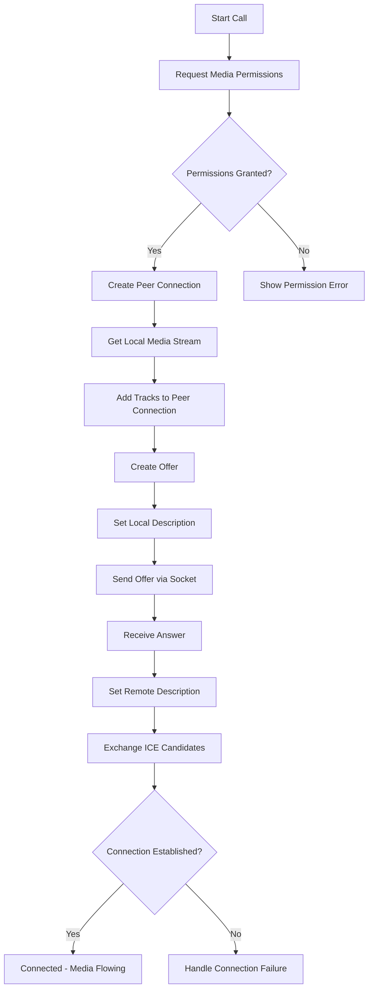
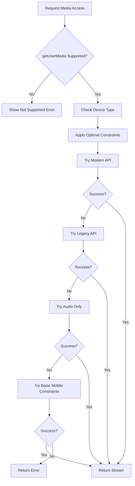
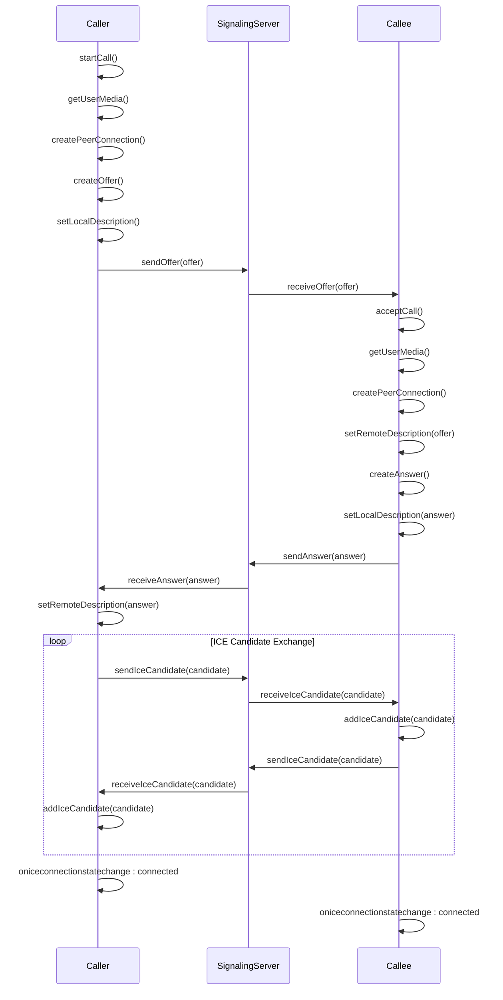

# WebRTC and Camera Issues

<cite>
**Referenced Files in This Document**   
- [useWebRTC.ts](file://web/hooks/useWebRTC.ts)
- [WEBRTC_FIX.md](file://WEBRTC_FIX.md)
- [MOBILE_WEBRTC_GUIDE.md](file://web/MOBILE_WEBRTC_GUIDE.md)
- [VIDEO_CALL_FIXES.md](file://web/VIDEO_CALL_FIXES.md)
- [mediaUtils.ts](file://web/lib/mediaUtils.ts)
- [VideoCallModal.tsx](file://web/components/VideoCallModal.tsx)
- [socket.ts](file://web/lib/socket.ts)
- [socketHandlers.js](file://backend/src/socket/socketHandlers.js)
</cite>

## Table of Contents
1. [Introduction](#introduction)
2. [WebRTC Implementation Overview](#webrtc-implementation-overview)
3. [Common WebRTC Issues and Solutions](#common-webrtc-issues-and-solutions)
4. [ICE Connection Failures](#ice-connection-failures)
5. [Camera and Microphone Access Permissions](#camera-and-microphone-access-permissions)
6. [Media Stream Issues](#media-stream-issues)
7. [Signaling Flow and Connection Setup](#signaling-flow-and-connection-setup)
8. [STUN and TURN Server Configuration](#stun-and-turn-server-configuration)
9. [Mobile WebRTC Considerations](#mobile-webrtc-considerations)
10. [Error Handling and Troubleshooting](#error-handling-and-troubleshooting)
11. [Performance Optimization](#performance-optimization)
12. [Conclusion](#conclusion)

## Introduction
This document provides comprehensive documentation for WebRTC and camera-related issues in the Realtime Chat App. It covers the implementation details of WebRTC functionality, common problems encountered, and solutions implemented to ensure reliable video and audio calling. The document focuses on the WebRTC implementation in `web/hooks/useWebRTC.ts`, including peer connection setup, ICE candidate handling, and signaling flow. It also details the fixes outlined in `WEBRTC_FIX.md` for ICE candidate timing race conditions and connection state management, as well as mobile-specific considerations from `MOBILE_WEBRTC_GUIDE.md` and camera toggle fixes from `VIDEO_CALL_FIXES.md`.

**Section sources**
- [useWebRTC.ts](file://web/hooks/useWebRTC.ts#L1-L1085)
- [WEBRTC_FIX.md](file://WEBRTC_FIX.md#L1-L317)
- [MOBILE_WEBRTC_GUIDE.md](file://web/MOBILE_WEBRTC_GUIDE.md#L1-L213)
- [VIDEO_CALL_FIXES.md](file://web/VIDEO_CALL_FIXES.md#L1-L111)

## WebRTC Implementation Overview

The WebRTC implementation in the Realtime Chat App is centered around the `useWebRTC` custom hook located in `web/hooks/useWebRTC.ts`. This hook manages the entire lifecycle of WebRTC connections, including peer connection setup, media stream handling, signaling, and connection state management.

The implementation follows a comprehensive approach to ensure reliable video and audio calling across different devices and network conditions. It uses a combination of React hooks for state management and WebRTC APIs for real-time communication. The hook exposes various functions and state variables that are consumed by the UI components, particularly the `VideoCallModal` component.

Key aspects of the implementation include:
- Peer connection creation and management
- Media stream acquisition and handling
- Signaling through Socket.IO for offer/answer exchange
- ICE candidate gathering and exchange
- Connection state tracking and error handling
- Mobile-specific optimizations

The implementation is designed to be robust and handle various edge cases, such as network interruptions, permission denials, and device compatibility issues.



**Diagram sources**
- [useWebRTC.ts](file://web/hooks/useWebRTC.ts#L150-L300)
- [socket.ts](file://web/lib/socket.ts#L200-L250)

**Section sources**
- [useWebRTC.ts](file://web/hooks/useWebRTC.ts#L1-L1085)
- [socket.ts](file://web/lib/socket.ts#L1-L474)

## Common WebRTC Issues and Solutions

The Realtime Chat App has addressed several common WebRTC issues through targeted fixes and optimizations. These issues fall into several categories, including ICE connection failures, media access permissions, media stream problems, and mobile-specific challenges.

The primary source of information for these issues and their solutions is the `WEBRTC_FIX.md` document, which identifies root causes and provides specific fixes. Additionally, the `MOBILE_WEBRTC_GUIDE.md` and `VIDEO_CALL_FIXES.md` documents provide guidance on mobile compatibility and camera toggle issues.

The implementation follows best practices for WebRTC development, including proper error handling, state management, and user experience considerations. The solutions implemented focus on improving reliability, performance, and user experience across different devices and network conditions.

**Section sources**
- [WEBRTC_FIX.md](file://WEBRTC_FIX.md#L1-L317)
- [MOBILE_WEBRTC_GUIDE.md](file://web/MOBILE_WEBRTC_GUIDE.md#L1-L213)
- [VIDEO_CALL_FIXES.md](file://web/VIDEO_CALL_FIXES.md#L1-L111)

## ICE Connection Failures

ICE (Interactive Connectivity Establishment) connection failures are a common issue in WebRTC applications, particularly when users are behind restrictive firewalls or NATs. The Realtime Chat App addresses this issue through several mechanisms.

The primary cause of ICE connection failures in this application was identified as ICE candidate timing race conditions. When ICE candidates arrive before the remote description is set, they cannot be processed immediately, leading to potential connection failures. The solution implemented in `useWebRTC.ts` involves queuing ICE candidates and processing them once the remote description is set.

```typescript
const handleReceiveIceCandidate = async (data: { candidate: RTCIceCandidate }): Promise<void> => {
  try {
    console.log('🧊 Received ICE candidate:', data.candidate.type, data.candidate.candidate)
    
    // Always add to queue first
    iceCandidateQueue.current.push(data.candidate)
    
    // If remote description is set, process the queue immediately
    if (peerConnection.current && peerConnection.current.remoteDescription) {
      await processQueuedIceCandidates()
    } else {
      console.log('🧊 ICE candidate queued - waiting for remote description')
    }
  } catch (error) {
    console.error("❌ Error handling ICE candidate:", error)
  }
}
```

The `processQueuedIceCandidates` function processes all queued ICE candidates once the remote description is available:

```typescript
const processQueuedIceCandidates = async (): Promise<void> => {
  if (!peerConnection.current || !peerConnection.current.remoteDescription) {
    console.log('⏸️ Cannot process ICE candidates - no remote description yet')
    return
  }
  
  const queueLength = iceCandidateQueue.current.length
  
  if (queueLength === 0) {
    return
  }
  
  console.log(`🧊 Processing ${queueLength} queued ICE candidates`)
  
  // Process all candidates in the queue
  const candidatesToProcess = [...iceCandidateQueue.current]
  iceCandidateQueue.current = [] // Clear queue immediately
  
  for (const candidate of candidatesToProcess) {
    try {
      if (peerConnection.current && peerConnection.current.remoteDescription) {
        await peerConnection.current.addIceCandidate(candidate)
        console.log('✅ Queued ICE candidate added successfully')
      }
    } catch (error) {
      console.error('❌ Error adding queued ICE candidate:', error)
      // Don't stop processing on error, continue with next candidate
    }
  }
  
  console.log(`✅ Finished processing ${candidatesToProcess.length} ICE candidates`)
}
```

Additionally, the application uses multiple STUN servers to improve connectivity:

```typescript
const servers: RTCConfiguration = {
  iceServers: [
    { urls: "stun:stun.l.google.com:19302" },
    { urls: "stun:stun1.l.google.com:19302" },
    { urls: "stun:stun2.l.google.com:19302" },
    { urls: "stun:stun3.l.google.com:19302" },
    { urls: "stun:stun4.l.google.com:19302" },
  ],
  iceCandidatePoolSize: 10,
}
```

For production environments, TURN server support is recommended to handle restrictive networks:

```typescript
const servers: RTCConfiguration = {
  iceServers: [
    // Google's public STUN servers
    { urls: "stun:stun.l.google.com:19302" },
    { urls: "stun:stun1.l.google.com:19302" },
    
    // Add TURN server for restrictive networks
    {
      urls: "turn:your-turn-server.com:3478",
      username: "username",
      credential: "password"
    }
  ],
  iceCandidatePoolSize: 10,
  iceTransportPolicy: 'all',
}
```

The application also includes comprehensive logging for ICE connection state changes:

```typescript
peerConnection.current.oniceconnectionstatechange = () => {
  if (peerConnection.current) {
    const state = peerConnection.current.iceConnectionState
    console.log('🧊 ICE connection state:', state)
    
    switch (state) {
      case 'checking':
        console.log('🔍 ICE checking connectivity...')
        break
      case 'connected':
        console.log('✅ ICE connected!')
        break
      case 'completed':
        console.log('✅ ICE completed!')
        break
      case 'failed':
        console.error('❌ ICE connection failed - may need TURN server')
        endCall(true)
        break
      case 'disconnected':
        console.warn('⚠️ ICE disconnected')
        break
      case 'closed':
        console.log('🔒 ICE closed')
        break
    }
  }
}
```

**Diagram sources**
- [useWebRTC.ts](file://web/hooks/useWebRTC.ts#L475-L550)
- [WEBRTC_FIX.md](file://WEBRTC_FIX.md#L50-L100)

**Section sources**
- [useWebRTC.ts](file://web/hooks/useWebRTC.ts#L1-L1085)
- [WEBRTC_FIX.md](file://WEBRTC_FIX.md#L1-L317)

## Camera and Microphone Access Permissions

Camera and microphone access permissions are critical for WebRTC applications, and handling them correctly is essential for a good user experience. The Realtime Chat App implements a comprehensive solution for managing media permissions across different devices and browsers.

The implementation uses the `MediaUtils` class in `web/lib/mediaUtils.ts` to handle media access in a cross-browser and mobile-compatible way. This class provides a unified interface for requesting media permissions and handles various error conditions gracefully.



**Diagram sources**
- [mediaUtils.ts](file://web/lib/mediaUtils.ts#L1-L271)

The `MediaUtils` class includes several key features:

1. **Browser compatibility detection**:
```typescript
static isGetUserMediaSupported(): boolean {
  return !!(
    navigator?.mediaDevices?.getUserMedia ||
    navigator?.getUserMedia ||
    // @ts-ignore - Legacy browser support
    navigator?.webkitGetUserMedia ||
    // @ts-ignore - Legacy browser support  
    navigator?.mozGetUserMedia
  )
}
```

2. **Device detection**:
```typescript
static isMobile(): boolean {
  return /Android|webOS|iPhone|iPad|iPod|BlackBerry|IEMobile|Opera Mini/i.test(navigator.userAgent)
}

static isIOS(): boolean {
  return /iPad|iPhone|iPod/.test(navigator.userAgent)
}

static isAndroid(): boolean {
  return /Android/.test(navigator.userAgent)
}
```

3. **Optimal constraints based on device**:
```typescript
static getOptimalConstraints(requestVideo: boolean = true, requestAudio: boolean = true): MediaConstraints {
  const isMobile = this.isMobile()
  const isIOS = this.isIOS()
  
  // Base constraints
  let videoConstraints: boolean | MediaTrackConstraints = requestVideo
  let audioConstraints: boolean | MediaTrackConstraints = requestAudio

  if (requestVideo && isMobile) {
    videoConstraints = {
      width: { ideal: isIOS ? 640 : 1280 },
      height: { ideal: isIOS ? 480 : 720 },
      frameRate: { ideal: 30, max: 30 },
      facingMode: { ideal: 'user' },
    }
  }

  if (requestAudio) {
    audioConstraints = {
      echoCancellation: true,
      noiseSuppression: true,
      autoGainControl: true,
      sampleRate: { ideal: 48000 },
    }
  }

  return {
    video: videoConstraints,
    audio: audioConstraints
  }
}
```

4. **Error handling with user-friendly messages**:
```typescript
private static handleGetUserMediaError(error: any): MediaResult {
  let errorType: MediaError['type'] = 'UNKNOWN'
  let message = 'An unknown error occurred while accessing camera and microphone'

  if (error.name || error.message) {
    const errorName = error.name?.toLowerCase() || error.message?.toLowerCase() || ''
    
    if (errorName.includes('permission') || errorName.includes('denied') || error.name === 'NotAllowedError') {
      errorType = 'PERMISSION_DENIED'
      message = this.isMobile() 
        ? 'Camera and microphone access denied. Please check your browser settings and allow permissions for this site.'
        : 'Permission denied. Please click "Allow" when prompted for camera and microphone access.'
    } else if (errorName.includes('notfound') || errorName.includes('devicenotfound') || error.name === 'NotFoundError') {
      errorType = 'NOT_FOUND'
      message = 'No camera or microphone found. Please check that your devices are connected and not being used by another application.'
    } else if (errorName.includes('constraint') || errorName.includes('overconstrained') || error.name === 'OverconstrainedError') {
      errorType = 'CONSTRAINT_ERROR'
      message = 'Camera or microphone settings not supported. Trying with basic settings...'
    } else if (errorName.includes('notsupported') || errorName.includes('notreadable') || error.name === 'NotSupportedError') {
      errorType = 'NOT_SUPPORTED'
      message = 'Camera and microphone access is not supported in this browser or device.'
    }
  }

  // Special handling for iOS Safari
  if (this.isIOS() && errorType === 'PERMISSION_DENIED') {
    message += ' On iOS, make sure Safari has permission to access camera and microphone in Settings > Safari > Camera & Microphone.'
  }

  // Special handling for Android Chrome
  if (this.isAndroid() && errorType === 'PERMISSION_DENIED') {
    message += ' On Android, make sure Chrome has camera and microphone permissions in your device settings.'
  }

  return {
    success: false,
    error: {
      type: errorType,
      message,
      originalError: error
    }
  }
}
```

The application also provides user-friendly error UI through the `MediaErrorAlert` component, which displays context-aware messages and provides actionable steps for users to resolve permission issues.

**Section sources**
- [mediaUtils.ts](file://web/lib/mediaUtils.ts#L1-L271)
- [MOBILE_WEBRTC_GUIDE.md](file://web/MOBILE_WEBRTC_GUIDE.md#L1-L213)

## Media Stream Issues

Media stream issues in the Realtime Chat App have been addressed through several fixes, particularly related to camera toggling and stream handling. The primary issues were black screens when the camera was turned off and local preview not showing when the camera was turned back on.

The fixes are documented in `VIDEO_CALL_FIXES.md` and implemented in the `VideoCallModal` component. The key issues and solutions are:

### Black Screen When Camera is Turned Off

**Problem**: When a user turns off their camera during a video call, the remote user sees a black screen instead of a placeholder image.

**Root Cause**: When `videoTrack.enabled = false`, the video element still displays the stream but shows a black/blank frame because no video data is being transmitted.

**Solution**: The implementation now uses both `videoTrack.enabled` AND `videoTrack.muted` properties to detect when the camera is off. It also adds event listeners for `mute` and `unmute` events on the video track, which fire when the remote user toggles the camera. A polling mechanism is used as a backup for browser compatibility.

```typescript
useEffect(() => {
  if (remoteVideoRef.current && remoteStream) {
    console.log('📺 VideoCallModal: Attaching remote stream to video element')
    console.log('📺 Remote stream tracks:', remoteStream.getTracks().map(t => ({kind: t.kind, enabled: t.enabled, readyState: t.readyState, muted: t.muted})))
    
    remoteVideoRef.current.srcObject = remoteStream
    
    // Monitor remote video track state
    const videoTrack = remoteStream.getVideoTracks()[0]
    if (videoTrack) {
      // Set initial state - track is considered "on" if enabled AND not muted
      const initialState = videoTrack.enabled && !videoTrack.muted
      setIsRemoteVideoEnabled(initialState)
      console.log(`📺 Initial remote video state: enabled=${videoTrack.enabled}, muted=${videoTrack.muted}, readyState=${videoTrack.readyState}, showing=${initialState}`)
      
      // Listen for mute/unmute events (this DOES fire when remote user toggles video)
      const handleMute = () => {
        console.log('📺 Remote video track MUTED event fired')
        setIsRemoteVideoEnabled(false)
      }
      
      const handleUnmute = () => {
        console.log('📺 Remote video track UNMUTED event fired')
        setIsRemoteVideoEnabled(true)
      }
      
      videoTrack.addEventListener('mute', handleMute)
      videoTrack.addEventListener('unmute', handleUnmute)
      
      // Also poll as a backup (WebRTC behavior varies by browser)
      const pollInterval = setInterval(() => {
        // Check both enabled and muted state
        const currentEnabled = videoTrack.enabled && !videoTrack.muted
        setIsRemoteVideoEnabled(prevState => {
          if (currentEnabled !== prevState) {
            console.log(`📺 Remote video state changed (poll): enabled=${videoTrack.enabled}, muted=${videoTrack.muted}, showing=${currentEnabled}`)
          }
          return currentEnabled
        })
      }, 200)
      
      return () => {
        videoTrack.removeEventListener('mute', handleMute)
        videoTrack.removeEventListener('unmute', handleUnmute)
        clearInterval(pollInterval)
      }
    }
    
    // Ensure video plays (important for mobile)
    remoteVideoRef.current.play().catch(error => {
      console.log('📺 Remote video play error (might be expected on mobile):', error)
    })
  } else if (!remoteStream) {
    console.log('📺 VideoCallModal: No remote stream available yet')
    setIsRemoteVideoEnabled(true) // Reset to default
  }
}, [remoteStream, remoteVideoRef])
```

### Local Preview Not Showing When Camera is Turned Back On

**Problem**: After turning the camera off and then back on, the local video preview remains blank even though the camera is enabled.

**Root Cause**: The video element's `play()` method needs to be called again when the video track is re-enabled, especially on mobile browsers.

**Solution**: The implementation now forces a refresh of the video element by temporarily clearing and resetting `srcObject` with a 50ms delay to ensure the browser processes the change. It also explicitly calls `play()` after restoring the stream.

```typescript
useEffect(() => {
  if (localVideoRef.current && localStream) {
    const videoTrack = localStream.getVideoTracks()[0]
    if (videoTrack) {
      console.log(`📹 Local video state changed - isVideoOff: ${isVideoOff}, track.enabled: ${videoTrack.enabled}`)
      
      // When video is turned back on, force video element to refresh
      if (!isVideoOff && videoTrack.enabled) {
        console.log('📹 Refreshing local video preview...')
        
        // Force refresh by temporarily clearing and resetting srcObject
        const currentStream = localVideoRef.current.srcObject
        localVideoRef.current.srcObject = null
        
        // Use setTimeout to ensure the change is processed
        setTimeout(() => {
          if (localVideoRef.current && currentStream) {
            localVideoRef.current.srcObject = currentStream
            localVideoRef.current.play().catch(e => console.log('Local video play error:', e))
            console.log('📹 Local video preview restored')
          }
        }, 50)
      }
    }
  }
}, [isVideoOff, localStream, localVideoRef])
```

The implementation also shows a placeholder UI in the local video preview when the camera is off, displaying the user's avatar, username initials, and a "camera off" icon.

**Section sources**
- [VIDEO_CALL_FIXES.md](file://web/VIDEO_CALL_FIXES.md#L1-L111)
- [VideoCallModal.tsx](file://web/components/VideoCallModal.tsx#L1-L456)

## Signaling Flow and Connection Setup

The signaling flow in the Realtime Chat App follows the standard WebRTC pattern of offer/answer exchange using Socket.IO as the signaling channel. The flow is managed through the `useWebRTC` hook and the backend `socketHandlers.js` file.

The signaling process begins when one user initiates a call by calling the `startCall` function in the `useWebRTC` hook. This function:

1. Requests media permissions
2. Creates a peer connection
3. Gets the local media stream
4. Adds the media tracks to the peer connection
5. Creates an offer
6. Sets the local description
7. Sends the offer to the remote user via Socket.IO



**Diagram sources**
- [useWebRTC.ts](file://web/hooks/useWebRTC.ts#L300-L500)
- [socket.ts](file://web/lib/socket.ts#L200-L250)
- [socketHandlers.js](file://backend/src/socket/socketHandlers.js#L1-L771)

The `startCall` function in `useWebRTC.ts` implements the caller side of the signaling flow:

```typescript
const startCall = async (
  type: "video" | "audio" = "video"
): Promise<void> => {
  try {
    console.log(`🚀 Starting ${type} call...`)
    console.log("📱 Device info:", MediaUtils.getDeviceInfo())

    setCallType(type)
    setCallState("calling")
    setIsCaller(true)
    setIsCallActive(true)
    setMediaError(null)
    setIsRequestingPermissions(true)

    // Get local stream using mobile-compatible MediaUtils
    const mediaResult = await MediaUtils.getUserMedia(type === "video", true);
    setIsRequestingPermissions(false);

    if (!mediaResult.success || !mediaResult.stream) {
      console.log("❌ Failed to get media stream:", mediaResult.error);
      setMediaError(mediaResult.error || {
        type: "UNKNOWN",
        message: "Failed to access camera and microphone",
      });
      if (addSystemMessage) {
        addSystemMessage(`❌ Call failed: ${mediaResult.error?.message || "Unable to access camera and microphone"}`);
      }
      setCallState("idle");
      setIsCallActive(false);
      cleanup();
      return;
    }

    const stream = mediaResult.stream;
    setLocalStream(stream);
    console.log("✅ Local stream obtained successfully");

    // Set up video element right away for immediate preview
    if (localVideoRef.current) {
      localVideoRef.current.srcObject = stream;
      console.log("📹 Local video element configured");
    }

    // Create peer connection and add tracks
    const pc = createPeerConnection();
    stream.getTracks().forEach((track) => {
      console.log(`➕ Adding ${track.kind} track to peer connection (caller)`);
      console.log(`   Track details: enabled=${track.enabled}, readyState=${track.readyState}`);
      const sender = pc.addTrack(track, stream);
      console.log(`   Sender added:`, sender);
    });

    // Verify senders
    console.log(`🔍 Total senders on peer connection: ${pc.getSenders().length}`);
    pc.getSenders().forEach((sender, index) => {
      console.log(`   Sender ${index}: ${sender.track?.kind} track`);
    });

    // Log current peer connection state
    console.log("🔗 Peer connection created for caller, current state:", pc.connectionState);

    // Create and send offer
    console.log("📡 Creating WebRTC offer...");
    const offer = await pc.createOffer();
    await pc.setLocalDescription(offer);
    console.log("📡 Local description set:", offer);
    
    // Check if SDP contains media tracks
    const sdpHasAudio = offer.sdp?.includes('m=audio');
    const sdpHasVideo = offer.sdp?.includes('m=video');
    console.log(`🔍 SDP analysis: audio=${sdpHasAudio}, video=${sdpHasVideo}`);
    if (!sdpHasAudio && !sdpHasVideo) {
      console.error('❌ SDP does not contain any media tracks!');
    }

    socketService.sendOffer(offer, type);
    setCallState("ringing");
    console.log("📞 Call offer sent, waiting for response...");

    // Set call timeout for automatic disconnect
    callTimeoutRef.current = setTimeout(() => {
      console.log("⏰ Call timeout - no answer received");
      handleCallTimeout();
    }, CALL_TIMEOUT_DURATION);
  } catch (error: any) {
    console.log("❌ Error starting call:", error);
    setIsRequestingPermissions(false);

    const mediaError: MediaError = {
      type: "UNKNOWN",
      message: error?.message || "An unexpected error occurred while starting the call",
      originalError: error,
    };
    setMediaError(mediaError);

    if (addSystemMessage) {
      addSystemMessage(`❌ Call failed: ${mediaError.message}`);
    }

    setCallState("idle");
    setIsCallActive(false);
    cleanup();
  }
};
```

When the remote user receives the offer, they can accept the call by calling the `acceptCall` function:

```typescript
const acceptCall = async (): Promise<void> => {
  if (!incomingCallData) return;

  try {
    console.log(`📞 Accepting ${incomingCallData.type} call from ${incomingCallData.fromUsername}...`);
    console.log("📱 Device info:", MediaUtils.getDeviceInfo());

    setCallState("connecting");
    setIsCaller(false);
    setIsCallActive(true);
    setIsIncomingCall(false);
    setCallType(incomingCallData.type);
    setMediaError(null);
    setIsRequestingPermissions(true);

    // Log call start when accepting (callee side)
    if (connectedUser && currentUserId && addSystemMessage) {
      const callLogEntry = {
        type: "call-start" as const,
        callType: incomingCallData.type,
        timestamp: new Date().toISOString(),
        participants: {
          caller: incomingCallData.from,
          callee: currentUserId,
        },
      };
      const logMessage = createCallLogMessage(callLogEntry, currentUserId);
      addSystemMessage(logMessage.content);
      startCallTimer();
    }

    // Get local stream using mobile-compatible MediaUtils
    const mediaResult = await MediaUtils.getUserMedia(
      incomingCallData.type === "video",
      true
    );
    setIsRequestingPermissions(false);

    if (!mediaResult.success || !mediaResult.stream) {
      console.log("❌ Failed to get media stream while accepting call:", mediaResult.error);
      setMediaError(mediaResult.error || {
        type: "UNKNOWN",
        message: "Failed to access camera and microphone",
      });
      if (addSystemMessage) {
        addSystemMessage(`❌ Failed to accept call: ${mediaResult.error?.message || "Unable to access camera and microphone"}`);
      }
      setCallState("idle");
      setIsCallActive(false);
      setIsIncomingCall(false);
      cleanup();
      return;
    }

    const stream = mediaResult.stream;
    setLocalStream(stream);
    console.log("✅ Local stream obtained for call acceptance");

    // Set up video element for immediate preview
    if (localVideoRef.current) {
      localVideoRef.current.srcObject = stream;
      console.log("📹 Local video element configured for callee");
    }

    // Create peer connection and add tracks
    const pc = createPeerConnection();
    stream.getTracks().forEach((track) => {
      console.log(`➕ Adding ${track.kind} track to peer connection (callee)`);
      console.log(`   Track details: enabled=${track.enabled}, readyState=${track.readyState}`);
      const sender = pc.addTrack(track, stream);
      console.log(`   Sender added:`, sender);
    });

    // Verify senders
    console.log(`🔍 Total senders on peer connection: ${pc.getSenders().length}`);
    pc.getSenders().forEach((sender, index) => {
      console.log(`   Sender ${index}: ${sender.track?.kind} track`);
    });

    // Log current peer connection state
    console.log("🔗 Peer connection created for callee, current state:", pc.connectionState);

    // Set remote description first, then create answer
    console.log("📡 Setting remote description from offer...");
    await pc.setRemoteDescription(new RTCSessionDescription(incomingCallData.offer));
    console.log("✅ Remote description set successfully");

    // Process any queued ICE candidates now that remote description is set
    console.log("🧊 Processing any queued ICE candidates after setting remote description...");
    await processQueuedIceCandidates();

    console.log("📡 Creating WebRTC answer...");
    const answer = await pc.createAnswer();
    await pc.setLocalDescription(answer);
    console.log("📡 Local description set:", answer);
    
    // Check if SDP contains media tracks
    const sdpHasAudio = answer.sdp?.includes('m=audio');
    const sdpHasVideo = answer.sdp?.includes('m=video');
    console.log(`🔍 SDP analysis: audio=${sdpHasAudio}, video=${sdpHasVideo}`);
    if (!sdpHasAudio && !sdpHasVideo) {
      console.error('❌ SDP does not contain any media tracks!');
    }

    socketService.sendAnswer(answer);
    console.log("📡 Call answer sent successfully");

    // Clear any existing call timeout since call was accepted
    clearCallTimeout();
  } catch (error: any) {
    console.log("❌ Error accepting call:", error);
    setIsRequestingPermissions(false);

    const mediaError: MediaError = {
      type: "UNKNOWN",
      message: error?.message || "An unexpected error occurred while accepting the call",
      originalError: error,
    };
    setMediaError(mediaError);

    if (addSystemMessage) {
      addSystemMessage(`❌ Failed to accept call: ${mediaError.message}`);
    }

    setCallState("idle");
    setIsCallActive(false);
    setIsIncomingCall(false);
    cleanup();
  }
};
```

The signaling flow is completed when both peers have exchanged offers and answers and have added each other's ICE candidates. The connection is then established, and media can flow between the peers.

**Section sources**
- [useWebRTC.ts](file://web/hooks/useWebRTC.ts#L300-L500)
- [socket.ts](file://web/lib/socket.ts#L200-L250)
- [socketHandlers.js](file://backend/src/socket/socketHandlers.js#L1-L771)

## STUN and TURN Server Configuration

The Realtime Chat App uses STUN (Session Traversal Utilities for NAT) servers to help establish WebRTC connections between peers. STUN servers assist in discovering the public IP address and port of a peer behind a NAT, enabling direct peer-to-peer communication.

The current configuration in `useWebRTC.ts` uses Google's public STUN servers:

```typescript
const servers: RTCConfiguration = {
  iceServers: [
    { urls: "stun:stun.l.google.com:19302" },
    { urls: "stun:stun1.l.google.com:19302" },
    { urls: "stun:stun2.l.google.com:19302" },
    { urls: "stun:stun3.l.google.com:19302" },
    { urls: "stun:stun4.l.google.com:19302" },
  ],
  iceCandidatePoolSize: 10,
}
```

This configuration provides redundancy by using multiple STUN servers, increasing the likelihood of successful connection establishment. The `iceCandidatePoolSize` of 10 allows for pre-gathering a number of ICE candidates before the connection is established, which can improve connection speed.

However, STUN servers alone may not be sufficient for all network conditions. In restrictive networks, such as those with symmetric NATs or strict firewalls, a TURN (Traversal Using Relays around NAT) server may be required. TURN servers act as relays, forwarding media between peers when direct peer-to-peer communication is not possible.

The `WEBRTC_FIX.md` document recommends adding TURN server support for production environments:

```typescript
const servers: RTCConfiguration = {
  iceServers: [
    // Google's public STUN servers
    { urls: "stun:stun.l.google.com:19302" },
    { urls: "stun:stun1.l.google.com:19302" },
    
    // Add TURN server for restrictive networks
    {
      urls: "turn:your-turn-server.com:3478",
      username: "username",
      credential: "password"
    }
  ],
  iceCandidatePoolSize: 10,
  iceTransportPolicy: 'all',
}
```

Free TURN server options include:
- **Coturn**: Self-hosted open-source TURN server
- **Twilio Network Traversal**: Free tier available
- **Metered**: Free tier with limited bandwidth

The `iceTransportPolicy: 'all'` setting ensures that the WebRTC implementation tries all types of candidates (relay, server reflexive, and host), maximizing the chances of successful connection establishment.

For optimal performance, it is recommended to use a combination of STUN and TURN servers, with the TURN server serving as a fallback when direct peer-to-peer connections cannot be established.

**Section sources**
- [useWebRTC.ts](file://web/hooks/useWebRTC.ts#L47-L56)
- [WEBRTC_FIX.md](file://WEBRTC_FIX.md#L200-L250)

## Mobile WebRTC Considerations

Mobile WebRTC implementation presents unique challenges due to differences in browser behavior, device capabilities, and user experience requirements. The Realtime Chat App addresses these challenges through several optimizations documented in `MOBILE_WEBRTC_GUIDE.md`.

### Mobile Browser Compatibility

The application supports the following mobile browsers:

#### iOS Safari
- Full WebRTC support
- Optimized constraints (640x480, front camera)
- HTTPS required
- Permissions handled via Settings > Safari > Camera & Microphone

#### Android Chrome
- Full WebRTC support
- Higher resolution support (1280x720)
- System-level permission prompts
- Generally better performance than iOS Safari

#### iOS Chrome
- Limited: Uses Safari's WebView (same as Safari)
- Workaround: MediaUtils detects and uses Safari constraints

#### Android Firefox
- Good WebRTC support
- Legacy getUserMedia API available as fallback

### Mobile-Specific Issues

#### iOS Safari Quirks
- Constraint limits: Max 720p, prefers 480p
- HTTPS required: getUserMedia fails on HTTP
- Permission persistence: Permissions remembered per domain
- Background limitations: Camera stops when app backgrounds

#### Android Chrome Features
- Higher resolution: Supports up to 1080p
- Better performance: Generally smoother than iOS
- System permissions: More granular permission control
- Background handling: Better multitasking support

### Mobile-Optimized Settings

The application uses device-specific constraints to optimize performance and user experience:

```typescript
static getOptimalConstraints(requestVideo: boolean = true, requestAudio: boolean = true): MediaConstraints {
  const isMobile = this.isMobile()
  const isIOS = this.isIOS()
  
  // Base constraints
  let videoConstraints: boolean | MediaTrackConstraints = requestVideo
  let audioConstraints: boolean | MediaTrackConstraints = requestAudio

  if (requestVideo && isMobile) {
    videoConstraints = {
      width: { ideal: isIOS ? 640 : 1280 },
      height: { ideal: isIOS ? 480 : 720 },
      frameRate: { ideal: 30, max: 30 },
      facingMode: { ideal: 'user' }, // Front camera
    }
  }

  if (requestAudio) {
    audioConstraints = {
      echoCancellation: true,
      noiseSuppression: true,
      autoGainControl: true,
      sampleRate: { ideal: 48000 },
    }
  }

  return {
    video: videoConstraints,
    audio: audioConstraints
  }
}
```

### Mobile-Specific Fixes

The application includes several mobile-specific fixes:

1. **Explicit play() calls**: Required on mobile browsers (iOS Safari, Android Chrome) due to strict autoplay policies
2. **Force refresh of video elements**: When toggling camera on/off, the video element is refreshed by temporarily clearing and resetting `srcObject`
3. **50ms delay**: Ensures the browser processes the change when refreshing video elements
4. **Mirror effect**: Maintained for the local preview using `scaleX(-1)`

### Testing on Mobile Devices

The application should be tested on real mobile devices, not just desktop browser dev tools. Key testing scenarios include:

1. Mobile permission requests
2. iOS Safari specific behavior
3. Android Chrome performance
4. Error scenarios (denied permissions, no camera, camera in use)

### Security and Privacy

For mobile devices, HTTPS is required for getUserMedia to work. Development can use `localhost` (HTTP allowed), but production must have a valid SSL certificate.

**Section sources**
- [MOBILE_WEBRTC_GUIDE.md](file://web/MOBILE_WEBRTC_GUIDE.md#L1-L213)
- [mediaUtils.ts](file://web/lib/mediaUtils.ts#L1-L271)

## Error Handling and Troubleshooting

The Realtime Chat App implements comprehensive error handling and troubleshooting mechanisms for WebRTC and camera issues. These mechanisms are designed to provide clear feedback to users and facilitate debugging for developers.

### Common Error Messages and Solutions

#### "ICE connection failed"
- **Cause**: Cannot find network path (NAT/firewall)
- **Solution**: Add TURN server

#### "InvalidStateError when adding ICE candidate"
- **Cause**: Remote description not set yet
- **Fix**: Queue candidates properly

#### "No peer connection available when receiving answer"
- **Cause**: Peer connection was cleaned up before answer arrived
- **Fix**: Ensure peer connection persists during call setup

#### "Call stuck at connecting"
- **Cause**: ICE candidates not exchanged properly
- **Fix**: Apply ICE candidate handling fixes and check logs

### Error Handling Implementation

The application uses a structured approach to error handling, with specific error types and user-friendly messages:

```typescript
interface MediaError {
  type: 'NOT_SUPPORTED' | 'PERMISSION_DENIED' | 'NOT_FOUND' | 'CONSTRAINT_ERROR' | 'UNKNOWN'
  message: string
  originalError?: Error
}
```

The `MediaUtils` class provides detailed error handling with context-specific messages:

```typescript
private static handleGetUserMediaError(error: any): MediaResult {
  let errorType: MediaError['type'] = 'UNKNOWN'
  let message = 'An unknown error occurred while accessing camera and microphone'

  if (error.name || error.message) {
    const errorName = error.name?.toLowerCase() || error.message?.toLowerCase() || ''
    
    if (errorName.includes('permission') || errorName.includes('denied') || error.name === 'NotAllowedError') {
      errorType = 'PERMISSION_DENIED'
      message = this.isMobile() 
        ? 'Camera and microphone access denied. Please check your browser settings and allow permissions for this site.'
        : 'Permission denied. Please click "Allow" when prompted for camera and microphone access.'
    } else if (errorName.includes('notfound') || errorName.includes('devicenotfound') || error.name === 'NotFoundError') {
      errorType = 'NOT_FOUND'
      message = 'No camera or microphone found. Please check that your devices are connected and not being used by another application.'
    } else if (errorName.includes('constraint') || errorName.includes('overconstrained') || error.name === 'OverconstrainedError') {
      errorType = 'CONSTRAINT_ERROR'
      message = 'Camera or microphone settings not supported. Trying with basic settings...'
    } else if (errorName.includes('notsupported') || errorName.includes('notreadable') || error.name === 'NotSupportedError') {
      errorType = 'NOT_SUPPORTED'
      message = 'Camera and microphone access is not supported in this browser or device.'
    }
  }

  // Special handling for iOS Safari
  if (this.isIOS() && errorType === 'PERMISSION_DENIED') {
    message += ' On iOS, make sure Safari has permission to access camera and microphone in Settings > Safari > Camera & Microphone.'
  }

  // Special handling for Android Chrome
  if (this.isAndroid() && errorType === 'PERMISSION_DENIED') {
    message += ' On Android, make sure Chrome has camera and microphone permissions in your device settings.'
  }

  return {
    success: false,
    error: {
      type: errorType,
      message,
      originalError: error
    }
  }
}
```

### Troubleshooting Guide

#### Console Logs to Check
```
🚀 Starting video call...
📱 Device info: {platform: "iPhone", browser: "Safari", mobile: true}
🔧 Using constraints: {video: {width: {ideal: 640}, ...}, audio: {...}}
✅ Media access granted successfully  
🎬 Stream details - Video tracks: 1, Audio tracks: 1
📹 Local video element configured
```

#### Debugging Steps
1. Check console logs for error messages
2. Verify that the peer connection is created
3. Confirm that media permissions are granted
4. Check ICE candidate exchange
5. Verify that remote description is set before adding ICE candidates

#### Testing Checklist
- Run backend signaling tests
- Test on localhost
- Test between different networks
- Check browser console for errors

### User-Friendly Error UI

The application includes the `MediaErrorAlert` component to display user-friendly error messages with actionable steps. The component provides:
- Context-aware messages
- Platform-specific guidance
- Action buttons (Retry, Help, Dismiss)
- Mobile-responsive design

**Section sources**
- [WEBRTC_FIX.md](file://WEBRTC_FIX.md#L250-L300)
- [mediaUtils.ts](file://web/lib/mediaUtils.ts#L1-L271)
- [MediaErrorAlert.tsx](file://web/components/MediaErrorAlert.tsx)

## Performance Optimization

The Realtime Chat App implements several performance optimizations for WebRTC and camera functionality, particularly for mobile devices.

### Mobile-Optimized Settings

The application uses device-specific constraints to balance quality and performance:

- **iOS**: 640x480 @ 24fps (better performance)
- **Android**: 1280x720 @ 30fps (higher quality)
- **Audio**: 48kHz with noise suppression enabled
- **Constraints**: Prefer 'user' facing mode for video calls

### Bandwidth Considerations

The application considers bandwidth usage, particularly on mobile data connections:

- Offer quality options based on connection type
- Detect WiFi vs Cellular if needed
- Implement battery optimization with lower frame rates on mobile

### Connection Quality Indicators

The application can monitor RTCPeerConnection.getStats() to show network quality to users, helping them understand call quality and make informed decisions about their connection.

### Reconnection Logic

The implementation includes reconnection logic to handle temporary network issues:

- Auto-reconnect on temporary network interruptions
- Show "reconnecting" status to users
- Maintain call state during reconnection attempts

### Call Quality Settings

The application can implement call quality settings that allow users to:

- Reduce video quality on slow networks
- Switch to audio-only mode
- Adjust bandwidth usage based on network conditions

### Reduce Candidate Queue Processing Time

The application can optimize ICE candidate processing by using `Promise.allSettled` for parallel processing:

```typescript
// Use Promise.allSettled for parallel processing
const results = await Promise.allSettled(
  candidatesToProcess.map(candidate => 
    peerConnection.current?.addIceCandidate(candidate)
  )
)

const successful = results.filter(r => r.status === 'fulfilled').length
console.log(`✅ Added ${successful}/${candidatesToProcess.length} ICE candidates`)
```

### Additional Recommendations

1. **Monitor and log errors**: Send WebRTC errors to analytics to track success/failure rates
2. **Implement adaptive bitrate**: Adjust video quality based on network conditions
3. **Use simulcast**: Send multiple video streams at different qualities
4. **Implement congestion control**: Adapt to network congestion in real-time

**Section sources**
- [MOBILE_WEBRTC_GUIDE.md](file://web/MOBILE_WEBRTC_GUIDE.md#L150-L200)
- [WEBRTC_FIX.md](file://WEBRTC_FIX.md#L280-L300)

## Conclusion
The Realtime Chat App has implemented a robust WebRTC solution that addresses common issues such as ICE connection failures, camera/microphone access permissions, and media stream problems. The implementation follows best practices for WebRTC development, with comprehensive error handling, mobile optimizations, and performance considerations.

Key improvements include:
- Fixed ICE candidate timing race conditions by queuing candidates and processing them when the remote description is set
- Improved connection state management with detailed logging and error handling
- Added mobile-specific optimizations for camera and microphone access
- Implemented proper handling of camera toggling to prevent black screens
- Enhanced user experience with clear error messages and actionable steps

The application is well-positioned for production use, with recommendations to add TURN server support for restrictive networks and further optimize performance based on user feedback and analytics.

**Section sources**
- [useWebRTC.ts](file://web/hooks/useWebRTC.ts#L1-L1085)
- [WEBRTC_FIX.md](file://WEBRTC_FIX.md#L1-L317)
- [MOBILE_WEBRTC_GUIDE.md](file://web/MOBILE_WEBRTC_GUIDE.md#L1-L213)
- [VIDEO_CALL_FIXES.md](file://web/VIDEO_CALL_FIXES.md#L1-L111)