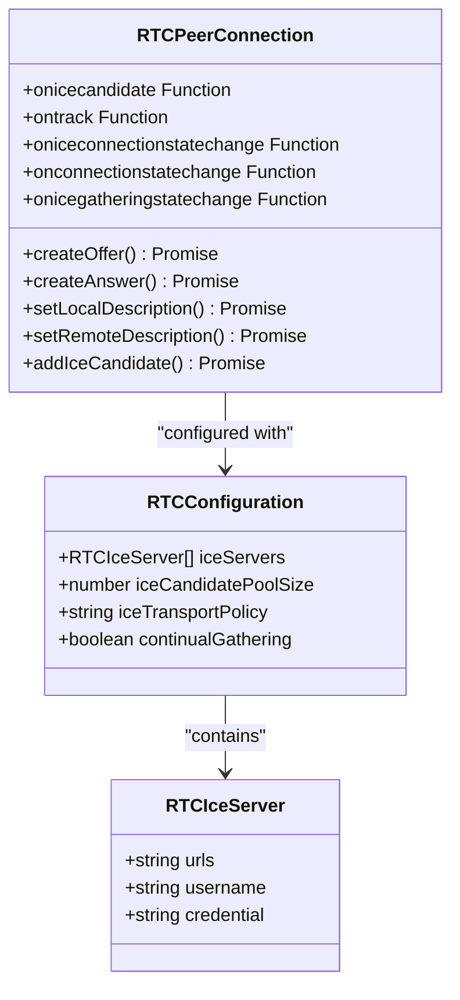
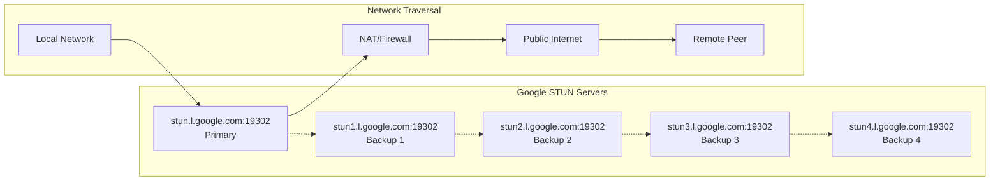
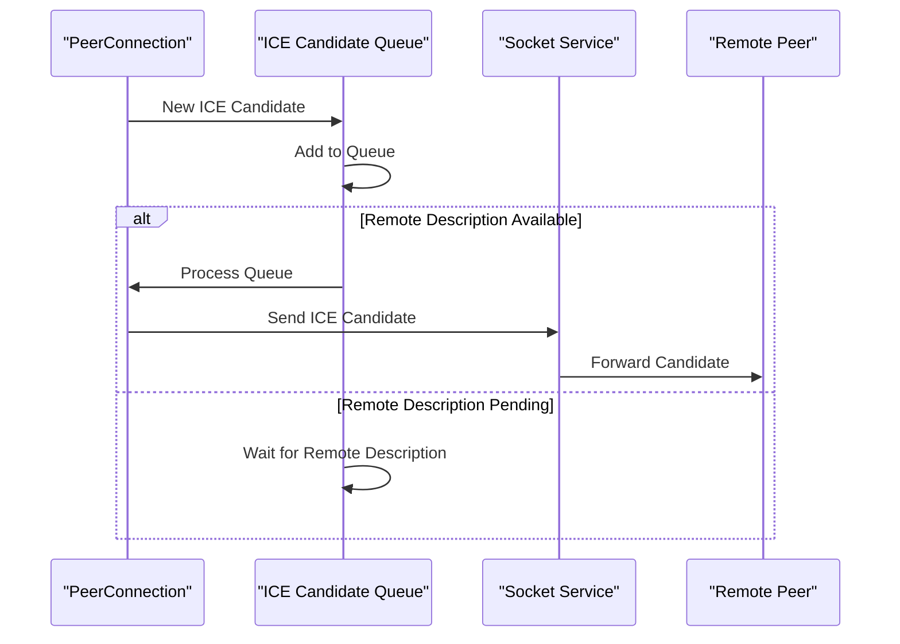
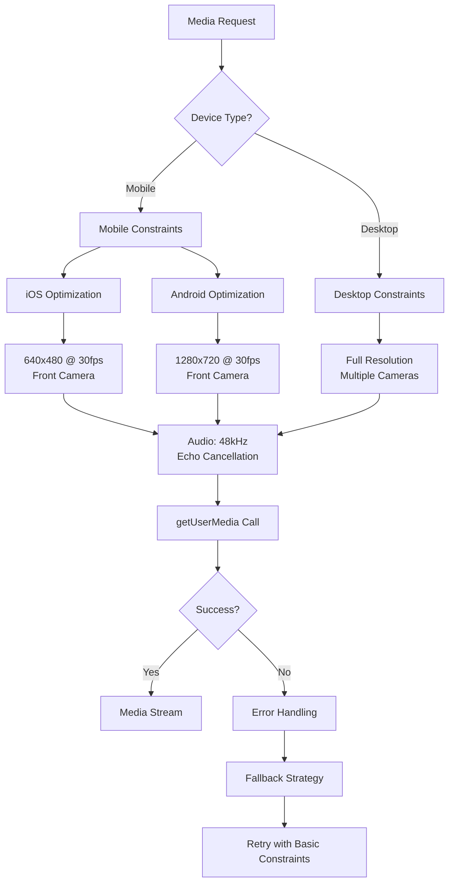
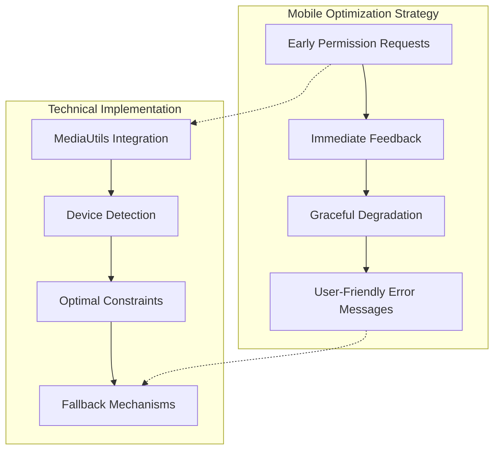
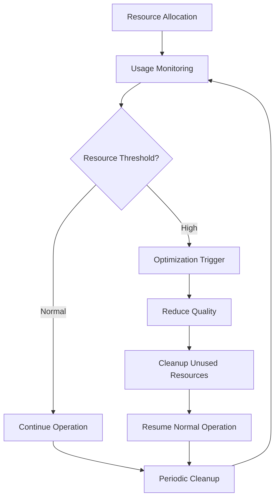
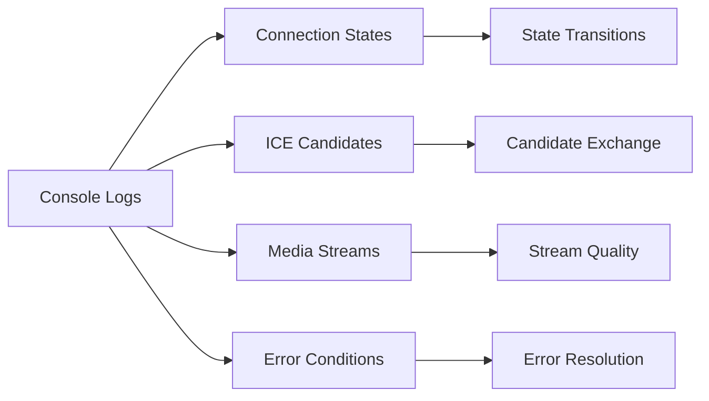

# Peer Connection Configuration

<cite>
**Referenced Files in This Document**
- [useWebRTC.ts](file://web/hooks/useWebRTC.ts)
- [mediaUtils.ts](file://web/lib/mediaUtils.ts)
- [MOBILE_WEBRTC_GUIDE.md](file://web/MOBILE_WEBRTC_GUIDE.md)
- [VideoCallModal.tsx](file://web/components/VideoCallModal.tsx)
</cite>

## Table of Contents
1. [Introduction](#introduction)
2. [RTCPeerConnection Configuration](#rtcppeerconnection-configuration)
3. [ICE Servers Configuration](#ice-servers-configuration)
4. [Event Handler Implementation](#event-handler-implementation)
5. [MediaUtils Integration](#mediamutils-integration)
6. [Mobile-Specific Considerations](#mobile-specific-considerations)
7. [Error Handling and Best Practices](#error-handling-and-best-practices)
8. [Performance Optimization](#performance-optimization)
9. [Troubleshooting Guide](#troubleshooting-guide)
10. [Conclusion](#conclusion)

## Introduction

The Realtime Chat App implements a robust WebRTC peer connection configuration that enables high-quality video and audio communication across various devices and network conditions. This configuration focuses on reliable NAT traversal, optimal media constraints, and comprehensive error handling specifically designed for mobile environments.

The peer connection system utilizes Google's STUN servers for universal NAT traversal, implements sophisticated ICE candidate queuing for race condition prevention, and provides mobile-optimized media constraints with graceful fallback mechanisms.

## RTCPeerConnection Configuration

The core WebRTC configuration is established through the `servers` object in the `useWebRTC.ts` hook, which defines the complete RTCPeerConnection setup with comprehensive ICE server configuration and connection pooling.

**Diagram sources**
- [useWebRTC.ts](file://web/hooks/useWebRTC.ts#L73-L85)

### Core Configuration Structure

The peer connection configuration establishes a foundation for reliable WebRTC communication with the following key components:

| Configuration Parameter | Value | Purpose |
|------------------------|-------|---------|
| `iceServers` | 5 Google STUN servers | Universal NAT traversal across all networks |
| `iceCandidatePoolSize` | 10 | Pre-allocation of ICE candidates for faster connection establishment |
| `iceTransportPolicy` | 'all' | Attempts all transport types (host, srflx, relay) |
| `continualGathering` | true | Continuously gathers candidates for better connectivity |

**Section sources**
- [useWebRTC.ts](file://web/hooks/useWebRTC.ts#L73-L85)

## ICE Servers Configuration

The ICE servers configuration represents a critical component of the WebRTC infrastructure, utilizing Google's public STUN servers for universal NAT traversal capabilities.

### STUN Server Array Implementation

The configuration includes five Google STUN servers strategically positioned for optimal global coverage:

**Diagram sources**
- [useWebRTC.ts](file://web/hooks/useWebRTC.ts#L76-L82)

### Significance of Multiple STUN Endpoints

The implementation of multiple STUN servers provides several critical advantages:

1. **Redundancy**: If one STUN server becomes unavailable, others can serve as backups
2. **Load Distribution**: Spreads connection load across multiple servers
3. **Geographic Diversity**: Ensures global accessibility regardless of regional outages
4. **Failover Capability**: Automatic switching between servers without connection interruption

### ICE Candidate Pool Size Configuration

The `iceCandidatePoolSize` parameter set to 10 enables pre-allocation of ICE candidates, significantly improving connection establishment speed:

- **Pre-allocation Benefit**: Reduces connection time by having candidates ready before negotiation begins
- **Memory Efficiency**: Balances memory usage with connection speed optimization
- **Network Optimization**: Enables faster ICE gathering during the initial handshake phase

**Section sources**
- [useWebRTC.ts](file://web/hooks/useWebRTC.ts#L76-L85)

## Event Handler Implementation

The WebRTC implementation features comprehensive event handler configuration that ensures reliable connection establishment, media streaming, and state monitoring throughout the call lifecycle.

### ICE Candidate Event Handler

The `onicecandidate` event handler manages the transmission of ICE candidates with sophisticated queuing and error handling:

**Diagram sources**
- [useWebRTC.ts](file://web/hooks/useWebRTC.ts#L99-L108)
- [useWebRTC.ts](file://web/hooks/useWebRTC.ts#L730-L740)

### Track Event Handler

The `ontrack` event handler manages remote media stream reception with comprehensive logging and immediate attachment:

Key functionality includes:
- **Stream Validation**: Verifies remote stream integrity and track availability
- **Immediate Attachment**: Attaches remote stream to video elements without delay
- **Logging and Monitoring**: Provides detailed track and stream information
- **Receiver Tracking**: Monitors and logs receiver count for debugging

### Connection State Monitoring

Two critical event handlers provide comprehensive connection state monitoring:

#### ICE Connection State Changes
The `oniceconnectionstatechange` handler monitors ICE-specific connection states with appropriate actions for each state:

| ICE State | Action | Behavior |
|-----------|--------|----------|
| `checking` | Logging | Indicates connectivity verification in progress |
| `connected` | State Update | Marks call as connected |
| `completed` | State Update | Final connection confirmation |
| `failed` | Error Handling | Ends call with TURN server consideration |
| `disconnected` | Timeout Logic | Waits 3 seconds before ending call |
| `closed` | Cleanup | Normal closure handling |

#### Connection State Changes
The `onconnectionstatechange` handler provides higher-level connection state monitoring:

- **Connection Establishment**: Tracks overall WebRTC connection status
- **Failure Detection**: Handles connection failures with automatic cleanup
- **Disconnection Management**: Implements graceful disconnection handling
- **State Synchronization**: Maintains consistent call state across components

**Section sources**
- [useWebRTC.ts](file://web/hooks/useWebRTC.ts#L99-L139)
- [useWebRTC.ts](file://web/hooks/useWebRTC.ts#L162-L216)

## MediaUtils Integration

The MediaUtils module provides comprehensive media access management with device-specific optimizations and robust error handling for both desktop and mobile environments.

### Device Detection and Constraints

MediaUtils implements intelligent device detection and constraint optimization:

**Diagram sources**
- [mediaUtils.ts](file://web/lib/mediaUtils.ts#L43-L86)
- [mediaUtils.ts](file://web/lib/mediaUtils.ts#L133-L169)

### Mobile-Specific Media Constraints

The MediaUtils implementation provides device-specific optimizations:

#### iOS Constraints
- **Resolution**: 640x480 (optimized for iOS performance)
- **Frame Rate**: 30fps maximum (balanced quality/performance)
- **Facing Mode**: User/front camera preference
- **Audio**: 48kHz sample rate with noise suppression

#### Android Constraints  
- **Resolution**: 1280x720 (higher quality than iOS)
- **Frame Rate**: 30fps maximum
- **Facing Mode**: User/front camera
- **Audio**: Advanced echo cancellation and noise suppression

### Error Handling Strategies

The MediaUtils implements a multi-layered error handling approach:

1. **Modern API First**: Attempts `navigator.mediaDevices.getUserMedia` first
2. **Legacy Fallback**: Falls back to legacy `getUserMedia` if available
3. **Audio-Only Fallback**: Tries audio-only access if video fails
4. **Basic Constraints**: Uses minimal constraints on mobile failures
5. **User-Friendly Messages**: Provides context-specific error messages

**Section sources**
- [mediaUtils.ts](file://web/lib/mediaUtils.ts#L43-L86)
- [mediaUtils.ts](file://web/lib/mediaUtils.ts#L133-L169)

## Mobile-Specific Considerations

The Realtime Chat App implements comprehensive mobile optimization strategies based on insights from the MOBILE_WEBRTC_GUIDE.md documentation.

### Autoplay Policies and Camera Access

Mobile browsers implement strict autoplay policies that require explicit user interaction before media access:

#### iOS Safari Specific Considerations
- **HTTPS Requirement**: All WebRTC operations require HTTPS connection
- **Permission Persistence**: Permissions are remembered per domain
- **Background Limitations**: Camera stops when app moves to background
- **Constraint Limits**: Maximum 720p video resolution

#### Android Chrome Features
- **Higher Resolution Support**: Capable of 1080p video
- **Better Performance**: Generally smoother than iOS Safari
- **System-Level Permissions**: Granular permission control
- **Multitasking Support**: Improved background handling

### Mobile-First Design Patterns

The implementation follows mobile-first design principles:

**Diagram sources**
- [MOBILE_WEBRTC_GUIDE.md](file://web/MOBILE_WEBRTC_GUIDE.md#L131-L181)

### Platform-Specific Error Handling

The system provides tailored error messages for different platforms:

#### iOS-Specific Instructions
- **Settings Navigation**: Clear instructions for Safari settings access
- **HTTPS Requirements**: Emphasis on secure connection requirements
- **Permission Management**: Guidance for persistent permission handling

#### Android-Specific Instructions  
- **App Permissions**: Chrome app permission management
- **System Settings**: Device-level permission configuration
- **Browser Compatibility**: Chrome-specific optimization notices

**Section sources**
- [MOBILE_WEBRTC_GUIDE.md](file://web/MOBILE_WEBRTC_GUIDE.md#L131-L181)

## Error Handling and Best Practices

The WebRTC implementation incorporates comprehensive error handling strategies designed to provide excellent user experience even under challenging network conditions.

### Comprehensive Error Classification

The system implements detailed error classification with specific handling for each scenario:

| Error Type | Cause | Handling Strategy | User Message |
|------------|-------|------------------|--------------|
| `PERMISSION_DENIED` | User denied permissions | Platform-specific instructions | "Allow camera and microphone access" |
| `NOT_FOUND` | No camera/microphone detected | Audio-only fallback | "No devices found, using audio only" |
| `CONSTRAINT_ERROR` | Unsupported settings | Basic constraints fallback | "Trying with basic settings..." |
| `NOT_SUPPORTED` | Browser limitation | Modern browser recommendation | "Use Chrome, Safari, or Firefox" |

### User Feedback Mechanisms

The implementation provides multiple layers of user feedback:

#### Real-Time Progress Indicators
- **Permission Requests**: Loading spinners during permission acquisition
- **Connection States**: Visual indicators for call progression
- **Error Notifications**: Context-specific error alerts with retry options

#### Logging and Debugging
- **Comprehensive Console Logs**: Detailed logging for troubleshooting
- **State Monitoring**: Continuous state tracking and reporting
- **Performance Metrics**: Call duration and quality metrics

### Best Practices Implementation

The codebase demonstrates several WebRTC best practices:

1. **Event Handler Cleanup**: Proper removal of event listeners during cleanup
2. **State Management**: Ref-based state synchronization to prevent stale closures
3. **Resource Management**: Comprehensive cleanup of streams and connections
4. **Race Condition Prevention**: ICE candidate queuing mechanism
5. **Connection Resilience**: Automatic retry and fallback strategies

**Section sources**
- [mediaUtils.ts](file://web/lib/mediaUtils.ts#L180-L270)
- [useWebRTC.ts](file://web/hooks/useWebRTC.ts#L850-L950)

## Performance Optimization

The WebRTC implementation includes several performance optimization strategies specifically designed for mobile environments and varying network conditions.

### Bandwidth Adaptation Strategies

The system implements adaptive bandwidth management through:

#### Device-Specific Optimization
- **Mobile Optimization**: Reduced resolution and frame rates for mobile devices
- **Network Awareness**: Quality adjustments based on device capabilities
- **Battery Conservation**: Lower power consumption through optimized settings

#### Codec Preferences
While not explicitly shown in the current implementation, the architecture supports codec optimization through:
- **Adaptive Bitrate**: Dynamic quality adjustment based on network conditions
- **Codec Selection**: Preference for efficient codecs based on device capabilities
- **Quality Scaling**: Progressive quality enhancement as connection stabilizes

### Mobile Performance Tuning

Specific optimizations for mobile devices include:

#### Video Constraints Optimization
- **iOS**: 640x480 resolution with 30fps limit for optimal performance
- **Android**: 1280x720 resolution with 30fps for higher quality
- **Frame Rate Management**: Consistent 30fps across all devices

#### Audio Optimization
- **Sample Rate**: 48kHz for high-quality audio
- **Noise Suppression**: Enabled for clear communication
- **Echo Cancellation**: Active to prevent feedback loops

### Memory and Resource Management

The implementation includes efficient resource management:

**Diagram sources**
- [useWebRTC.ts](file://web/hooks/useWebRTC.ts#L850-L950)

**Section sources**
- [mediaUtils.ts](file://web/lib/mediaUtils.ts#L43-L86)
- [MOBILE_WEBRTC_GUIDE.md](file://web/MOBILE_WEBRTC_GUIDE.md#L150-L180)

## Troubleshooting Guide

This section provides comprehensive troubleshooting guidance for common WebRTC issues encountered in the Realtime Chat App implementation.

### Common Connection Issues

#### ICE Connection Failures
**Symptoms**: Calls fail to establish with "ICE connection failed" messages
**Causes**: 
- Firewall restrictions blocking STUN/TURN traffic
- Symmetric NAT configurations
- Insufficient TURN server support

**Solutions**:
1. Implement TURN server fallback for restrictive networks
2. Add comprehensive logging for ICE state monitoring
3. Provide user guidance for firewall configuration

#### Mobile Permission Problems
**Symptoms**: Camera/microphone access denied on mobile devices
**Causes**:
- Browser permission settings
- HTTPS requirement violations
- Background app limitations

**Solutions**:
1. Implement graceful permission request flow
2. Provide clear instructions for permission restoration
3. Handle permission denials with appropriate fallbacks

### Diagnostic Tools and Techniques

#### Console Logging Analysis
The implementation includes comprehensive console logging for troubleshooting:

**Diagram sources**
- [useWebRTC.ts](file://web/hooks/useWebRTC.ts#L162-L216)

#### Network Diagnostics
Key diagnostic points include:
- **ICE Gathering State**: Monitor for successful candidate collection
- **Connection State**: Track overall WebRTC connection health
- **Media Stream Quality**: Verify track availability and readiness
- **Error Patterns**: Identify recurring error types and causes

### Mobile-Specific Troubleshooting

#### iOS Safari Issues
- **HTTPS Verification**: Ensure all connections use HTTPS
- **Permission Restoration**: Guide users to Safari settings
- **Background Handling**: Address app background/foreground transitions

#### Android Chrome Problems
- **Permission Management**: Assist with Chrome app permissions
- **System Integration**: Coordinate with Android system settings
- **Performance Optimization**: Address battery and thermal throttling

**Section sources**
- [MOBILE_WEBRTC_GUIDE.md](file://web/MOBILE_WEBRTC_GUIDE.md#L180-L212)
- [useWebRTC.ts](file://web/hooks/useWebRTC.ts#L162-L216)

## Conclusion

The Realtime Chat App's WebRTC peer connection configuration represents a comprehensive implementation that successfully addresses the challenges of modern real-time communication. The system's strength lies in its robust ICE server configuration, sophisticated mobile optimization strategies, and comprehensive error handling mechanisms.

Key achievements of this implementation include:

- **Universal NAT Traversal**: Five Google STUN servers provide reliable connectivity across diverse network environments
- **Mobile Optimization**: Device-specific constraints and graceful degradation ensure excellent mobile performance
- **Resilient Architecture**: Multi-layered error handling and fallback mechanisms provide exceptional reliability
- **Comprehensive Monitoring**: Extensive logging and state tracking enable effective troubleshooting and optimization

The implementation serves as an excellent foundation for production WebRTC applications, demonstrating best practices in peer connection management, media handling, and user experience optimization. Future enhancements could include TURN server implementation for enterprise deployments and advanced bandwidth adaptation algorithms for optimal quality delivery.