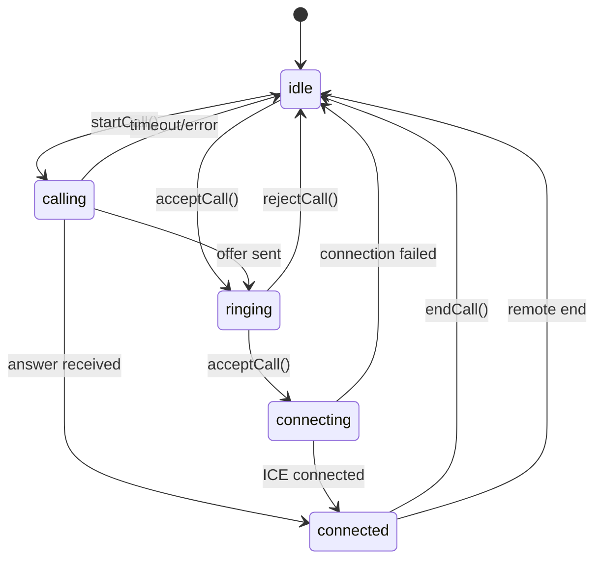
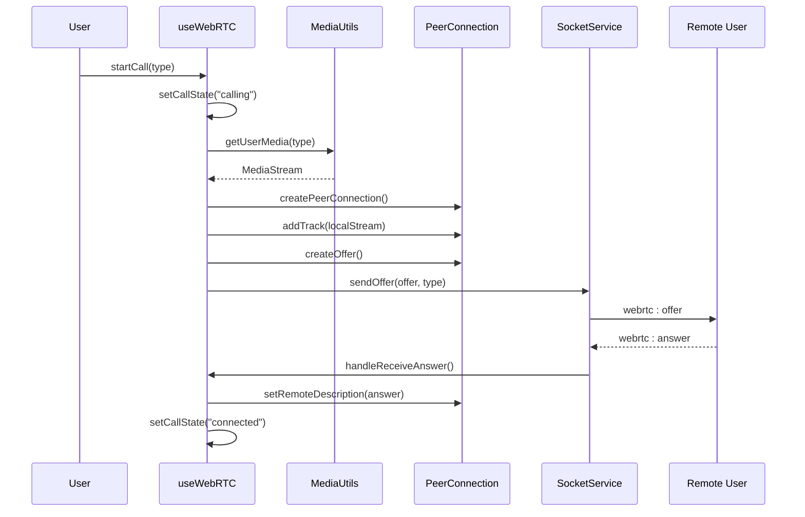
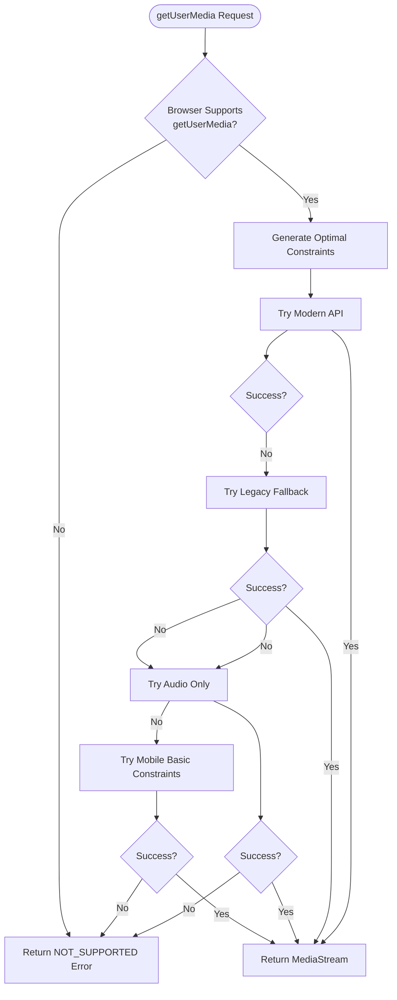
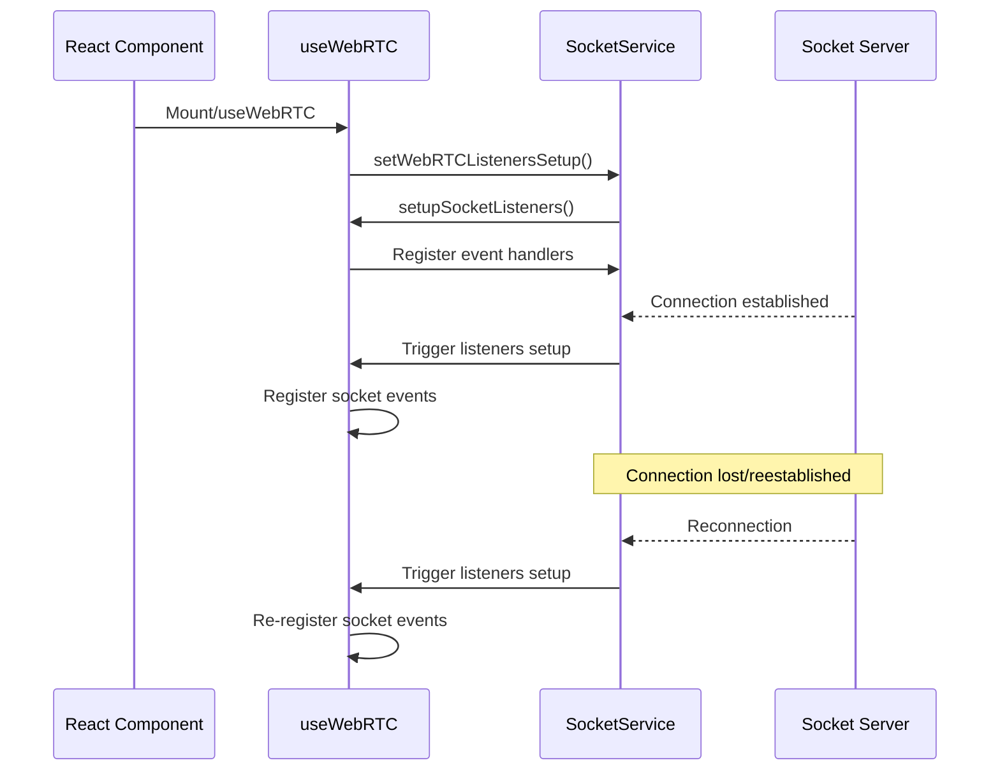
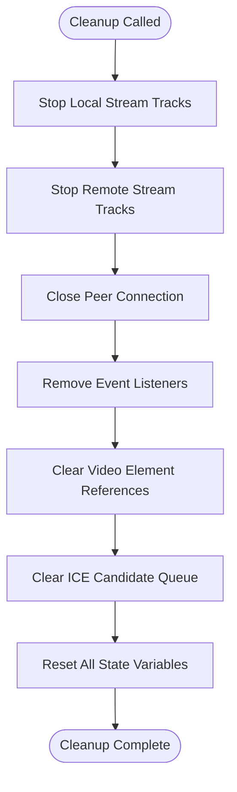

# WebRTC Call Lifecycle Management

<cite>
**Referenced Files in This Document**
- [useWebRTC.ts](file://web/hooks/useWebRTC.ts)
- [VideoCallModal.tsx](file://web/components/VideoCallModal.tsx)
- [mediaUtils.ts](file://web/lib/mediaUtils.ts)
- [socket.ts](file://web/lib/socket.ts)
- [useCallLogs.ts](file://web/hooks/useCallLogs.ts)
- [page.tsx](file://web/app/chat/page.tsx)
- [test-webrtc.js](file://backend/test-webrtc.js)
</cite>

## Table of Contents
1. [Introduction](#introduction)
2. [WebRTC State Architecture](#webrtc-state-architecture)
3. [Call Lifecycle States](#call-lifecycle-states)
4. [Core Functions and State Transitions](#core-functions-and-state-transitions)
5. [Media Stream Management](#media-stream-management)
6. [Socket.IO Signaling Coordination](#socket-io-signaling-coordination)
7. [Call Timeout and Automatic Cleanup](#call-timeout-and-automatic-cleanup)
8. [Concurrent Calls and Race Condition Prevention](#concurrent-calls-and-race-condition-prevention)
9. [Error Handling and Recovery](#error-handling-and-recovery)
10. [Debugging and Troubleshooting](#debugging-and-troubleshooting)
11. [Best Practices](#best-practices)

## Introduction

The Realtime Chat App implements a sophisticated WebRTC call lifecycle management system that handles voice and video calls between users. The system is built around the `useWebRTC` custom hook, which orchestrates the complete call lifecycle from initiation to termination, managing WebRTC peer connections, media streams, Socket.IO signaling, and state synchronization.

The WebRTC implementation follows a reactive architecture using React's state management patterns, with careful attention to preventing stale closures, managing concurrent calls, and ensuring proper resource cleanup. The system supports both caller and callee roles, with bidirectional signaling and automatic fallback mechanisms.

## WebRTC State Architecture

The WebRTC system uses a centralized state management approach with React's `useState` and `useRef` hooks to maintain call state across component re-renders while preventing stale closure issues.



**Diagram sources**
- [useWebRTC.ts](file://web/hooks/useWebRTC.ts#L25-L30)

**Section sources**
- [useWebRTC.ts](file://web/hooks/useWebRTC.ts#L25-L30)

## Call Lifecycle States

The WebRTC system defines five primary call states that represent different phases of the call lifecycle:

### Idle State (`"idle"`)

The initial state where no call is active. Users can initiate calls or receive incoming calls in this state.

### Calling State (`"calling"`)

The state when a user initiates a call. The system creates a peer connection, acquires media streams, and sends the call offer to the remote user.

### Ringing State (`"ringing"`)

The state when the call offer has been sent to the remote user and they haven't responded yet. The caller waits for the remote user to accept or reject the call.

### Connecting State (`"connecting"`)

The state when the WebRTC connection is establishing. This involves ICE negotiation, STUN/TURN server communication, and establishing the peer-to-peer connection.

### Connected State (`"connected"`)

The final state where the WebRTC connection is established successfully. Media streams are flowing, and the call is active.

**Section sources**
- [useWebRTC.ts](file://web/hooks/useWebRTC.ts#L25-L30)

## Core Functions and State Transitions

### startCall Function

The `startCall` function initiates a new WebRTC call with comprehensive state management and error handling.



**Diagram sources**
- [useWebRTC.ts](file://web/hooks/useWebRTC.ts#L380-L480)

### acceptCall Function

The `acceptCall` function handles incoming calls with proper state synchronization and media initialization.

### rejectCall Function

The `rejectCall` function terminates incoming calls gracefully, sending rejection signals and cleaning up resources.

### endCall Function

The `endCall` function serves as the primary cleanup mechanism, handling both local and remote call terminations with proper resource cleanup.

**Section sources**
- [useWebRTC.ts](file://web/hooks/useWebRTC.ts#L480-L550)
- [useWebRTC.ts](file://web/hooks/useWebRTC.ts#L552-L580)
- [useWebRTC.ts](file://web/hooks/useWebRTC.ts#L582-L650)

## Media Stream Management

The system implements comprehensive media stream management with automatic fallbacks and mobile-specific optimizations.

### Media Stream Acquisition

The `MediaUtils.getUserMedia` function provides cross-browser compatibility with device-specific optimizations:



**Diagram sources**
- [mediaUtils.ts](file://web/lib/mediaUtils.ts#L120-L180)

### Stream Attachment and Management

The system automatically attaches media streams to video elements and manages stream state changes:

- **Local Stream**: Attached to the local video preview element with automatic refresh on video toggle
- **Remote Stream**: Attached to the remote video element with mute/unmute event handling
- **Stream Monitoring**: Continuous monitoring of track states with fallback polling mechanisms

**Section sources**
- [mediaUtils.ts](file://web/lib/mediaUtils.ts#L120-L270)
- [VideoCallModal.tsx](file://web/components/VideoCallModal.tsx#L50-L130)

## Socket.IO Signaling Coordination

The WebRTC system coordinates with Socket.IO for signaling messages that establish and maintain the peer-to-peer connection.

### Signaling Message Types

| Message Type | Direction | Purpose | Handler |
|--------------|-----------|---------|---------|
| `webrtc:offer` | Caller → Callee | Initiate call with SDP offer | `handleReceiveOffer` |
| `webrtc:answer` | Callee → Caller | Accept call with SDP answer | `handleReceiveAnswer` |
| `webrtc:ice-candidate` | Bidirectional | Exchange ICE candidates | `handleReceiveIceCandidate` |
| `webrtc:call-end` | Bidirectional | Terminate call | `handleReceiveCallEnd` |
| `webrtc:call-reject` | Callee → Caller | Reject call | `handleReceiveCallReject` |
| `webrtc:call-timeout` | Caller → Callee | Call timeout notification | `handleReceiveCallTimeout` |

### Socket Listener Management

The system implements robust socket listener management to handle connection re-establishment:



**Diagram sources**
- [useWebRTC.ts](file://web/hooks/useWebRTC.ts#L1020-L1040)
- [socket.ts](file://web/lib/socket.ts#L450-L470)

**Section sources**
- [useWebRTC.ts](file://web/hooks/useWebRTC.ts#L1020-L1085)
- [socket.ts](file://web/lib/socket.ts#L280-L320)

## Call Timeout and Automatic Cleanup

The system implements comprehensive timeout management and automatic cleanup mechanisms to ensure proper resource management.

### Call Timeout Configuration

The `CALL_TIMEOUT_DURATION` constant defaults to 30 seconds but can be customized:

```typescript
const CALL_TIMEOUT_DURATION = callTimeoutDuration || 30000; // Default 30 seconds
```

### Timeout Management Functions

- **`clearCallTimeout()`**: Safely clears pending timeouts
- **`handleCallTimeout()`**: Handles timeout scenarios with proper logging
- **Automatic Cleanup**: Resources are cleaned up regardless of timeout cause

### Resource Cleanup Process

The `cleanup` function ensures comprehensive resource cleanup:



**Diagram sources**
- [useWebRTC.ts](file://web/hooks/useWebRTC.ts#L910-L990)

**Section sources**
- [useWebRTC.ts](file://web/hooks/useWebRTC.ts#L75-L80)
- [useWebRTC.ts](file://web/hooks/useWebRTC.ts#L910-L990)

## Concurrent Calls and Race Condition Prevention

The system implements several mechanisms to prevent concurrent calls and race conditions:

### Stale Closure Prevention

The system uses `useRef` to maintain the latest state values for event handlers:

```typescript
// Refs to hold latest state for event handlers (prevents stale closures)
const callStateRef = useRef<CallState>(callState);
const isCallActiveRef = useRef<boolean>(isCallActive);

// Keep refs in sync with state
useEffect(() => {
  callStateRef.current = callState;
}, [callState]);

useEffect(() => {
  isCallActiveRef.current = isCallActive;
}, [isCallActive]);
```

### Call State Validation

Critical functions use refs to check current state:

```typescript
// Check if we're already in a call, using refs to avoid stale closures
if (isCallActiveRef.current || callStateRef.current !== "idle") {
  console.warn("⚠️ Ignoring incoming call - already in a call");
  return;
}
```

### ICE Candidate Queue Management

The system maintains an ICE candidate queue to handle race conditions during connection establishment:

```typescript
// Always add to queue first to prevent race conditions
iceCandidateQueue.current.push(data.candidate);

// Process queue when remote description is set
if (peerConnection.current && peerConnection.current.remoteDescription) {
  await processQueuedIceCandidates();
}
```

**Section sources**
- [useWebRTC.ts](file://web/hooks/useWebRTC.ts#L70-L85)
- [useWebRTC.ts](file://web/hooks/useWebRTC.ts#L652-L665)
- [useWebRTC.ts](file://web/hooks/useWebRTC.ts#L780-L795)

## Error Handling and Recovery

The system implements comprehensive error handling with user-friendly error messages and recovery mechanisms.

### Media Access Error Handling

The `MediaUtils` class provides detailed error categorization:

| Error Type | Cause | User-Friendly Message |
|------------|-------|----------------------|
| `NOT_SUPPORTED` | Browser doesn't support getUserMedia | "Camera and microphone access is not supported..." |
| `PERMISSION_DENIED` | User denied permissions | "Camera and microphone access denied..." |
| `NOT_FOUND` | No camera/microphone found | "No camera or microphone found..." |
| `CONSTRAINT_ERROR` | Unsupported settings | "Camera or microphone settings not supported..." |

### WebRTC Connection Error Handling

The system handles various WebRTC connection states:

- **ICE Connection Failures**: Automatic fallback to TURN servers
- **Signaling State Errors**: Proper cleanup and state reset
- **Network Disconnections**: Graceful degradation with retry logic

### Error Recovery Mechanisms

- **Automatic Retry**: Fallback to audio-only when video fails
- **Permission Prompts**: Clear instructions for permission issues
- **Network Adaptation**: Automatic quality adjustment based on network conditions

**Section sources**
- [mediaUtils.ts](file://web/lib/mediaUtils.ts#L180-L270)
- [useWebRTC.ts](file://web/hooks/useWebRTC.ts#L150-L200)

## Debugging and Troubleshooting

The system provides extensive logging and debugging capabilities for troubleshooting WebRTC issues.

### Console Logging Strategy

The system implements structured logging with timestamps and contextual information:

```typescript
console.log("📞 ===========================================");
console.log("📞 RECEIVED WEBRTC OFFER!");
console.log("📞 ===========================================");
console.log(`📞 [${timestamp}] Offer data:`, data);
console.log(`   From: ${data.fromUsername} (${data.from})`);
console.log(`   Type: ${data.type}`);
console.log(`   Current call state (from ref): ${callStateRef.current}`);
console.log("📞 ===========================================");
```

### Key Debugging Areas

#### Media Stream Debugging
- Device capability detection
- Stream creation success/failure
- Track state monitoring
- Permission status tracking

#### WebRTC Connection Debugging
- ICE candidate exchange
- Signaling state transitions
- Peer connection state changes
- STUN/TURN server communication

#### Socket Communication Debugging
- Message delivery confirmation
- Connection state tracking
- Reconnection attempts
- Error propagation

### Browser Developer Tools Integration

The system works seamlessly with browser developer tools:

- **Console Tab**: Comprehensive logging output
- **Network Tab**: WebSocket connection monitoring
- **Application Tab**: Storage inspection
- **Sources Tab**: Breakpoint debugging

### Diagnostic Test Script

The backend includes a diagnostic test script for automated testing:

```javascript
// Run diagnostic test: `node backend/test-webrtc.js`
```

**Section sources**
- [useWebRTC.ts](file://web/hooks/useWebRTC.ts#L650-L670)
- [test-webrtc.js](file://backend/test-webrtc.js#L1-L43)

## Best Practices

### State Management Patterns

1. **Use Refs for Event Handlers**: Prevent stale closures in event handlers
2. **Separate State and Refs**: Use refs for values that need immediate access
3. **Consistent State Updates**: Always update state in predictable sequences

### Resource Management

1. **Immediate Cleanup**: Clean up resources in the `cleanup` function
2. **Event Listener Removal**: Remove all event listeners during cleanup
3. **Stream Track Management**: Stop all media tracks when ending calls

### Error Handling

1. **Graceful Degradation**: Provide fallback options for failures
2. **User-Friendly Messages**: Convert technical errors to user-understandable messages
3. **Comprehensive Logging**: Log errors with sufficient context for debugging

### Performance Optimization

1. **Lazy Initialization**: Initialize resources only when needed
2. **Efficient State Updates**: Batch state updates when possible
3. **Memory Management**: Properly dispose of large objects and connections

### Security Considerations

1. **Secure Connections**: Ensure WebSocket connections use secure protocols
2. **Permission Handling**: Respect user privacy and permission settings
3. **Data Sanitization**: Validate all incoming signaling data

**Section sources**
- [useWebRTC.ts](file://web/hooks/useWebRTC.ts#L70-L85)
- [useWebRTC.ts](file://web/hooks/useWebRTC.ts#L910-L990)
- [mediaUtils.ts](file://web/lib/mediaUtils.ts#L180-L270)