# WebRTC Integration Guide

<cite>
**Referenced Files in This Document**
- [web/hooks/useWebRTC.ts](file://web/hooks/useWebRTC.ts)
- [web/lib/socket.ts](file://web/lib/socket.ts)
- [web/lib/mediaUtils.ts](file://web/lib/mediaUtils.ts)
- [web/components/VideoCallModal.tsx](file://web/components/VideoCallModal.tsx)
- [web/MOBILE_WEBRTC_GUIDE.md](file://web/MOBILE_WEBRTC_GUIDE.md)
- [web/WEBRTC_FIX.md](file://web/WEBRTC_FIX.md)
- [web/CALL_DISCONNECTION_TEST.md](file://web/CALL_DISCONNECTION_TEST.md)
- [web/hooks/useCallLogs.ts](file://web/hooks/useCallLogs.ts)
- [backend/src/socket/socketHandlers.js](file://backend/src/socket/socketHandlers.js)
- [backend/test-webrtc.js](file://backend/test-webrtc.js)
</cite>

## Table of Contents
1. [Introduction](#introduction)
2. [System Architecture](#system-architecture)
3. [Core Components](#core-components)
4. [WebRTC Signaling Process](#webrtc-signaling-process)
5. [RTCPeerConnection Configuration](#rtcpeerconnection-configuration)
6. [Call Lifecycle Management](#call-lifecycle-management)
7. [Mobile-Specific Implementation](#mobile-specific-implementation)
8. [Error Handling and Recovery](#error-handling-and-recovery)
9. [Performance Optimization](#performance-optimization)
10. [Debugging and Troubleshooting](#debugging-and-troubleshooting)
11. [Best Practices](#best-practices)

## Introduction

The Realtime Chat App implements a comprehensive WebRTC solution for audio and video calling between matched users. This guide covers the complete WebRTC integration, from signaling to media streaming, with special attention to mobile compatibility and error handling.

The WebRTC implementation consists of several key components:
- **Custom Hook**: `useWebRTC.ts` manages peer connections, media streams, and call state
- **Signaling Layer**: Socket.IO events for exchanging SDP offers, answers, and ICE candidates
- **Media Utilities**: Cross-browser compatible media access with mobile optimizations
- **Call Management**: Complete call lifecycle with timeout, rejection, and cleanup
- **Mobile Support**: Comprehensive mobile browser compatibility and performance optimizations

## System Architecture

The WebRTC implementation follows a layered architecture that separates concerns between signaling, peer connection management, and media handling.

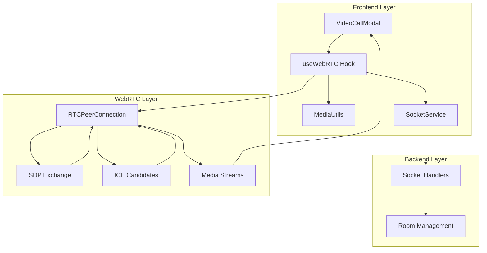

**Diagram sources**
- [web/hooks/useWebRTC.ts](file://web/hooks/useWebRTC.ts#L1-L50)
- [web/lib/socket.ts](file://web/lib/socket.ts#L1-L50)
- [web/lib/mediaUtils.ts](file://web/lib/mediaUtils.ts#L1-L50)

**Section sources**
- [web/hooks/useWebRTC.ts](file://web/hooks/useWebRTC.ts#L1-L100)
- [web/lib/socket.ts](file://web/lib/socket.ts#L1-L100)

## Core Components

### useWebRTC Custom Hook

The `useWebRTC` hook serves as the central orchestrator for WebRTC functionality, managing peer connections, media streams, and call state throughout the call lifecycle.

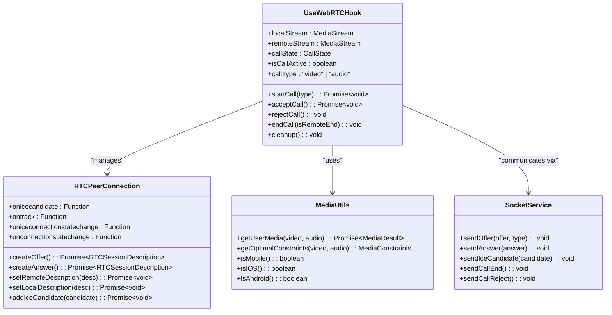

**Diagram sources**
- [web/hooks/useWebRTC.ts](file://web/hooks/useWebRTC.ts#L20-L100)
- [web/lib/mediaUtils.ts](file://web/lib/mediaUtils.ts#L20-L80)
- [web/lib/socket.ts](file://web/lib/socket.ts#L200-L300)

### Socket.IO Signaling Service

The Socket.IO service handles all WebRTC signaling events, ensuring reliable delivery of SDP offers, answers, and ICE candidates between peers.

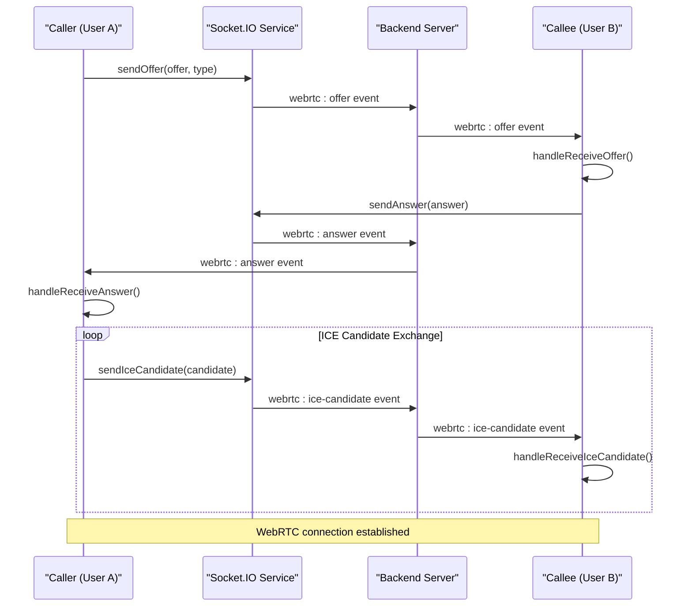

**Diagram sources**
- [web/lib/socket.ts](file://web/lib/socket.ts#L200-L250)
- [backend/src/socket/socketHandlers.js](file://backend/src/socket/socketHandlers.js#L410-L480)

**Section sources**
- [web/hooks/useWebRTC.ts](file://web/hooks/useWebRTC.ts#L20-L200)
- [web/lib/socket.ts](file://web/lib/socket.ts#L200-L370)

## WebRTC Signaling Process

The WebRTC signaling process involves exchanging Session Description Protocol (SDP) offers, answers, and Interactive Connectivity Establishment (ICE) candidates to establish peer-to-peer connections.

### Signaling Events

The implementation uses six primary Socket.IO events for WebRTC communication:

| Event | Direction | Purpose | Payload |
|-------|-----------|---------|---------|
| `webrtc:offer` | Caller → Callee | Initiate call with SDP offer | `{offer, type, from, fromUsername}` |
| `webrtc:answer` | Callee → Caller | Respond to offer with SDP answer | `{answer, from, fromUsername}` |
| `webrtc:ice-candidate` | Bidirectional | Exchange network connectivity data | `{candidate, from}` |
| `webrtc:call-end` | Bidirectional | End call signal | `{from, fromUsername}` |
| `webrtc:call-reject` | Callee → Caller | Reject incoming call | `{from, fromUsername}` |
| `webrtc:call-timeout` | Caller → Callee | Call timeout notification | `{from, fromUsername}` |

### Offer Creation and Exchange

The caller initiates the WebRTC connection by creating an SDP offer and sending it to the callee:

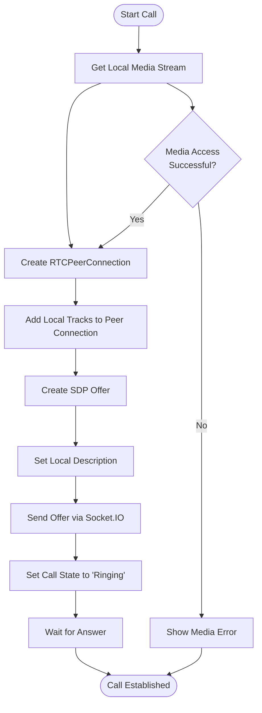

**Diagram sources**
- [web/hooks/useWebRTC.ts](file://web/hooks/useWebRTC.ts#L250-L350)

### Answer Processing and Connection Establishment

Upon receiving an offer, the callee creates an SDP answer and establishes the peer connection:

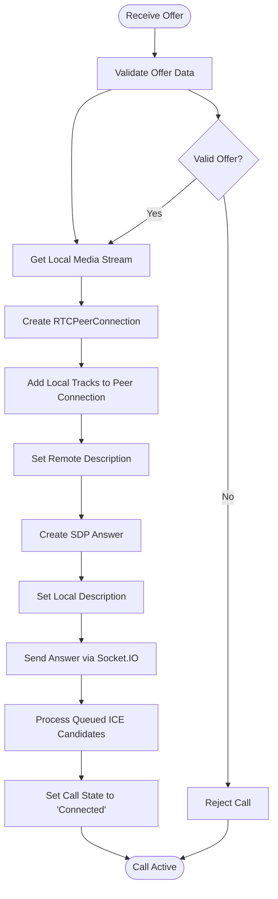

**Diagram sources**
- [web/hooks/useWebRTC.ts](file://web/hooks/useWebRTC.ts#L400-L500)

**Section sources**
- [web/hooks/useWebRTC.ts](file://web/hooks/useWebRTC.ts#L250-L500)
- [backend/src/socket/socketHandlers.js](file://backend/src/socket/socketHandlers.js#L410-L480)

## RTCPeerConnection Configuration

The RTCPeerConnection is configured with STUN servers for NAT traversal and ICE candidate handling for network connectivity establishment.

### STUN Server Configuration

The implementation uses Google's public STUN servers for universal NAT traversal:

```typescript
const servers: RTCConfiguration = {
  iceServers: [
    { urls: "stun:stun.l.google.com:19302" },
    { urls: "stun:stun1.l.google.com:19302" },
    { urls: "stun:stun2.l.google.com:19302" },
    { urls: "stun:stun3.l.google.com:19302" },
    { urls: "stun:stun4.l.google.com:19302" },
  ],
  iceCandidatePoolSize: 10,
}
```

### ICE Candidate Handling

ICE candidates are queued and processed asynchronously to handle out-of-order delivery:

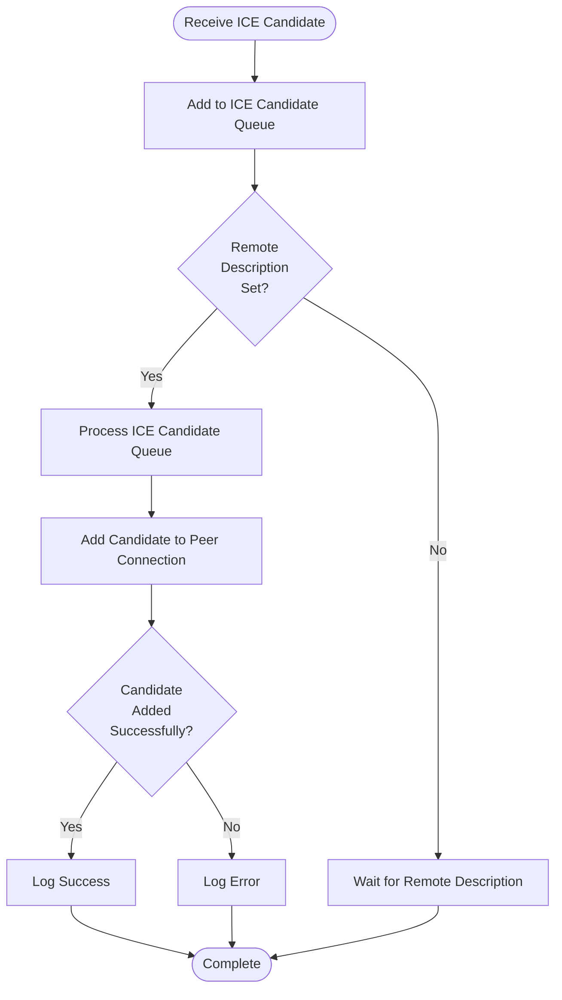

**Diagram sources**
- [web/hooks/useWebRTC.ts](file://web/hooks/useWebRTC.ts#L750-L800)

### Connection State Monitoring

The implementation monitors multiple connection states for comprehensive error handling:

| State | Description | Action |
|-------|-------------|--------|
| `checking` | Establishing connectivity | Log progress |
| `connected` | Connection established | Set call state to connected |
| `completed` | ICE gathering complete | Set call state to connected |
| `failed` | Connection failed | End call with error |
| `disconnected` | Temporary disconnection | Wait 3 seconds before ending |
| `closed` | Connection closed | Cleanup resources |

**Section sources**
- [web/hooks/useWebRTC.ts](file://web/hooks/useWebRTC.ts#L68-L150)
- [web/hooks/useWebRTC.ts](file://web/hooks/useWebRTC.ts#L750-L850)

## Call Lifecycle Management

The WebRTC implementation manages a complete call lifecycle with proper state transitions, timeout handling, and resource cleanup.

### Call States and Transitions

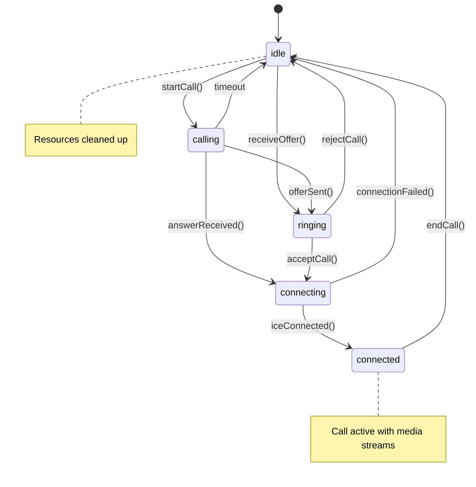

### Call Timeout Management

The implementation includes configurable call timeouts with automatic cleanup:

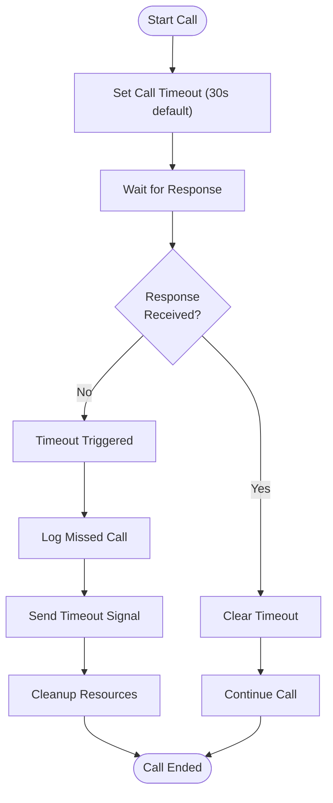

**Diagram sources**
- [web/hooks/useWebRTC.ts](file://web/hooks/useWebRTC.ts#L700-L750)

### Call Termination Strategies

The implementation handles multiple call termination scenarios:

| Scenario | Initiator | Signal Sent | Cleanup Actions |
|----------|-----------|-------------|-----------------|
| Normal End | Either user | `webrtc:call-end` | Stop streams, close peer connection |
| Rejection | Callee | `webrtc:call-reject` | Log missed call, cleanup |
| Timeout | Caller | `webrtc:call-timeout` | Log missed call, cleanup |
| Network Failure | Automatic | None | Auto-detect failure, cleanup |

**Section sources**
- [web/hooks/useWebRTC.ts](file://web/hooks/useWebRTC.ts#L600-L750)
- [web/hooks/useWebRTC.ts](file://web/hooks/useWebRTC.ts#L800-L900)

## Mobile-Specific Implementation

The WebRTC implementation includes comprehensive mobile browser compatibility with platform-specific optimizations and graceful error handling.

### Mobile Browser Detection

The MediaUtils class provides sophisticated browser and device detection:

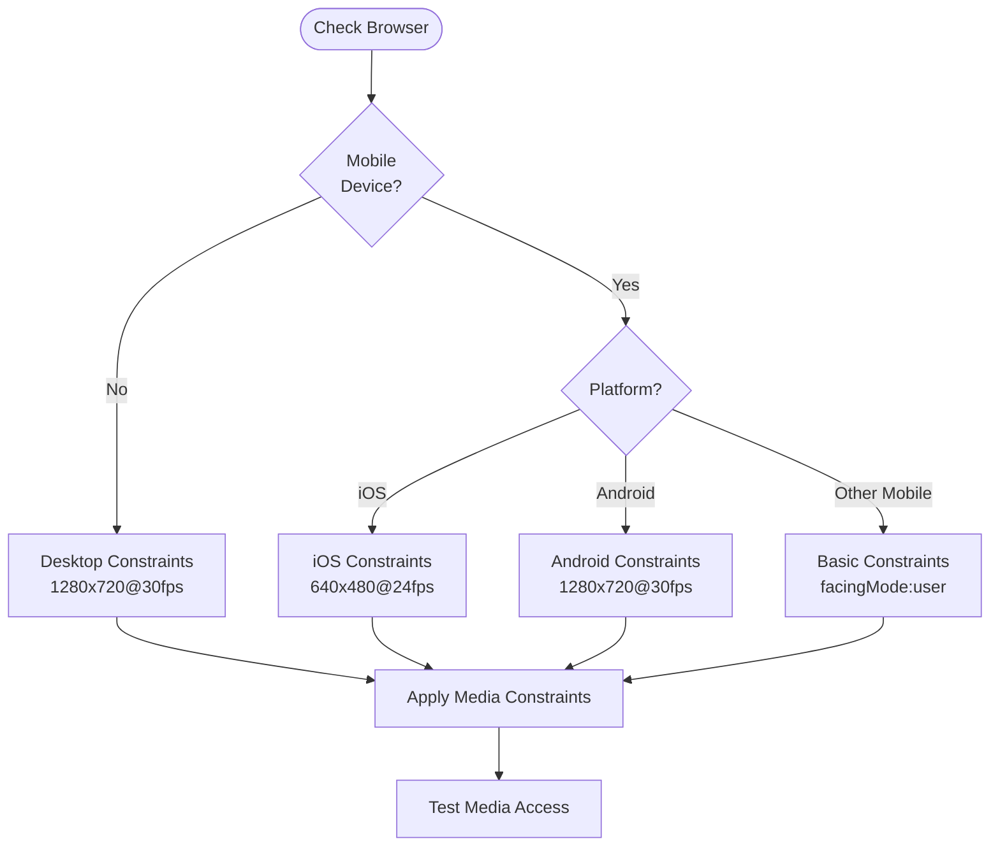

**Diagram sources**
- [web/lib/mediaUtils.ts](file://web/lib/mediaUtils.ts#L50-L80)

### Mobile-Specific Optimizations

The implementation includes several mobile-specific optimizations:

| Feature | iOS Safari | Android Chrome | General Mobile |
|---------|------------|----------------|----------------|
| Video Resolution | 640x480 | 1280x720 | 640x480 |
| Frame Rate | 24fps | 30fps | 24fps |
| Audio Sample Rate | 48kHz | 48kHz | 48kHz |
| Echo Cancellation | Enabled | Enabled | Enabled |
| Noise Suppression | Enabled | Enabled | Enabled |

### Permission Handling

Mobile browsers require specific permission handling approaches:

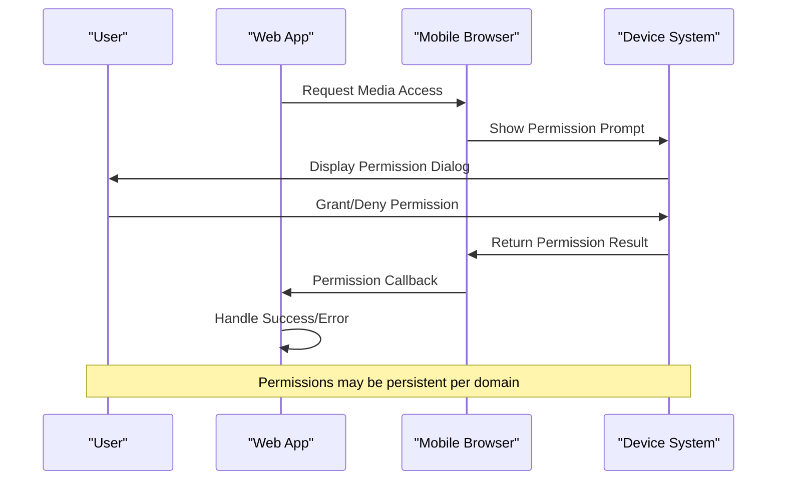

**Diagram sources**
- [web/lib/mediaUtils.ts](file://web/lib/mediaUtils.ts#L150-L200)

**Section sources**
- [web/MOBILE_WEBRTC_GUIDE.md](file://web/MOBILE_WEBRTC_GUIDE.md#L1-L100)
- [web/lib/mediaUtils.ts](file://web/lib/mediaUtils.ts#L50-L150)

## Error Handling and Recovery

The WebRTC implementation includes comprehensive error handling with user-friendly error messages and automatic recovery mechanisms.

### Media Access Error Types

The MediaUtils class handles various media access error scenarios:

| Error Type | Cause | Fallback Strategy | User Message |
|------------|-------|-------------------|--------------|
| `PERMISSION_DENIED` | User denied permissions | Show settings instructions | "Please check browser settings" |
| `NOT_FOUND` | No camera/microphone | Try audio-only | "No camera/microphone found" |
| `CONSTRAINT_ERROR` | Unsupported settings | Use basic constraints | "Trying with basic settings" |
| `NOT_SUPPORTED` | Old browser | Show browser upgrade notice | "Browser not supported" |
| `UNKNOWN` | Unexpected error | Generic error message | "Unexpected error occurred" |

### Connection Recovery Strategies

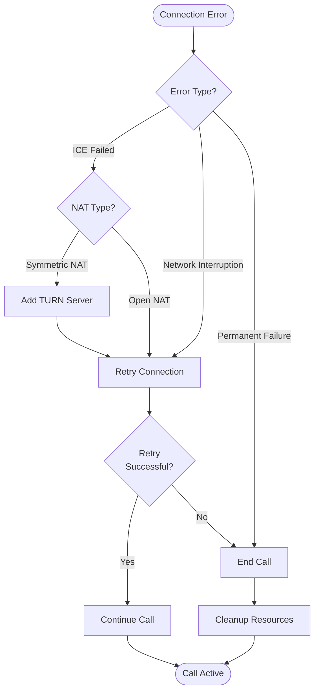

**Diagram sources**
- [web/hooks/useWebRTC.ts](file://web/hooks/useWebRTC.ts#L150-L200)

### Memory Leak Prevention

The implementation includes comprehensive cleanup mechanisms:

```typescript
const cleanup = (): void => {
  // Stop all local stream tracks
  if (localStream) {
    localStream.getTracks().forEach(track => track.stop());
  }
  
  // Stop all remote stream tracks
  if (remoteStream) {
    remoteStream.getTracks().forEach(track => track.stop());
  }
  
  // Close and cleanup peer connection
  if (peerConnection.current) {
    peerConnection.current.close();
    peerConnection.current = null;
  }
  
  // Clear video elements and state
  clearCallTimeout();
  iceCandidateQueue.current = [];
  // Reset all state variables
}
```

**Section sources**
- [web/lib/mediaUtils.ts](file://web/lib/mediaUtils.ts#L200-L270)
- [web/hooks/useWebRTC.ts](file://web/hooks/useWebRTC.ts#L850-L950)

## Performance Optimization

The WebRTC implementation includes several performance optimizations for bandwidth adaptation and efficient resource utilization.

### Bandwidth Adaptation

The MediaUtils class implements adaptive constraints based on device capabilities:

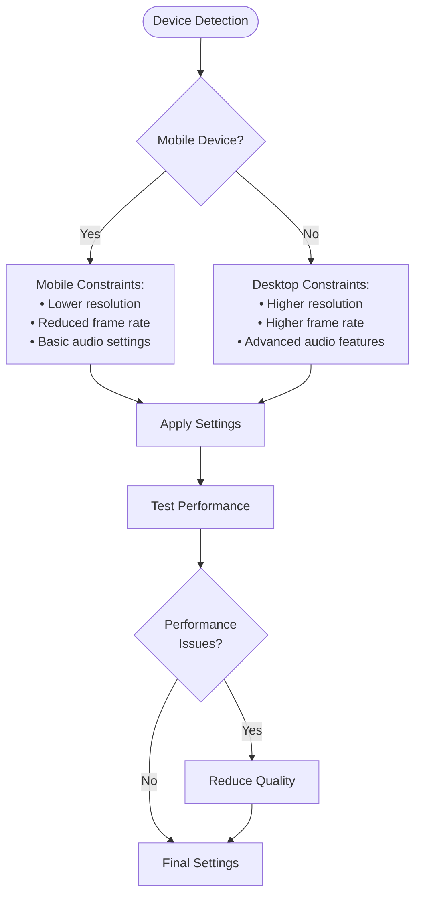

**Diagram sources**
- [web/lib/mediaUtils.ts](file://web/lib/mediaUtils.ts#L50-L80)

### Resource Management

Key performance optimizations include:

| Optimization | Implementation | Benefit |
|--------------|----------------|---------|
| Stream Recycling | Reuse MediaStreams when possible | Reduces CPU usage |
| Track Control | Enable/disable tracks instead of stopping | Faster switching |
| ICE Pool Size | Pre-allocate ICE candidates | Faster connection |
| Connection Pooling | Reuse RTCPeerConnections | Reduced overhead |
| Lazy Loading | Initialize components on demand | Faster startup |

### Battery Optimization

Mobile-specific battery optimizations:

```typescript
// Mobile-optimized constraints for better battery life
const mobileConstraints = {
  video: {
    width: { ideal: 640 },
    height: { ideal: 480 },
    frameRate: { ideal: 24, max: 30 },
    facingMode: { ideal: 'user' }
  },
  audio: {
    echoCancellation: true,
    noiseSuppression: true,
    autoGainControl: true,
    sampleRate: { ideal: 48000 }
  }
}
```

**Section sources**
- [web/lib/mediaUtils.ts](file://web/lib/mediaUtils.ts#L50-L100)
- [web/MOBILE_WEBRTC_GUIDE.md](file://web/MOBILE_WEBRTC_GUIDE.md#L150-L200)

## Debugging and Troubleshooting

The WebRTC implementation includes comprehensive logging and debugging capabilities for troubleshooting connection issues.

### Console Logging Strategy

The implementation provides detailed console logs for each phase of the WebRTC process:

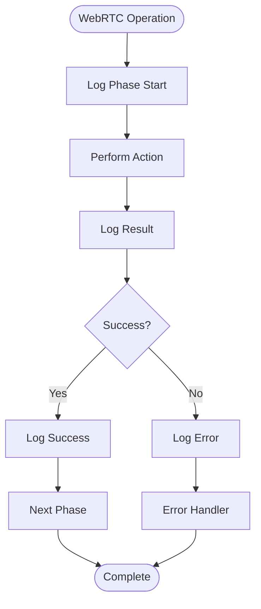

### Common Debugging Scenarios

| Issue | Symptoms | Debug Steps | Solution |
|-------|----------|-------------|----------|
| Call stuck at "connecting" | UI shows connecting state forever | Check browser console for ICE errors | Verify STUN server accessibility |
| No video/audio | Blank screen or silence | Check media permissions and constraints | Test with different constraints |
| Intermittent disconnections | Call drops randomly | Monitor network stability | Implement reconnection logic |
| Poor call quality | Low resolution, choppy audio | Check bandwidth and device capabilities | Adjust constraints dynamically |

### Developer Tools Integration

Key browser developer tools for WebRTC debugging:

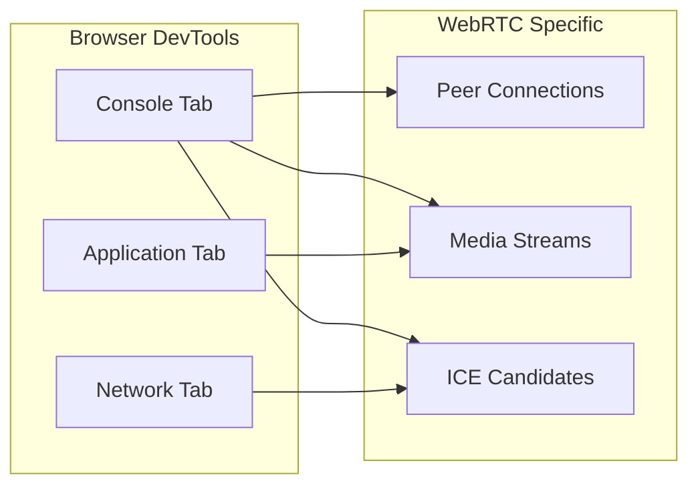

### Automated Diagnostics

The backend includes automated diagnostic tests:

```javascript
// Diagnostic test for WebRTC connectivity
const testScript = `
  const io = require('socket.io-client');
  // Test setup and validation logic
  // Verifies signaling, ICE, and media connectivity
`;
```

**Section sources**
- [web/WEBRTC_FIX.md](file://web/WEBRTC_FIX.md#L1-L50)
- [backend/test-webrtc.js](file://backend/test-webrtc.js#L1-L50)

## Best Practices

### Security Considerations

1. **HTTPS Requirement**: Always serve WebRTC applications over HTTPS
2. **Token Authentication**: Use secure authentication tokens for socket connections
3. **Origin Validation**: Validate WebSocket origins in the backend
4. **Media Privacy**: Clear media streams when calls end

### Scalability Guidelines

1. **Connection Limits**: Implement reasonable limits on concurrent calls
2. **Resource Monitoring**: Monitor CPU and memory usage during calls
3. **Load Balancing**: Distribute users across multiple backend instances
4. **CDN Integration**: Use CDN for static assets and potentially media

### User Experience Optimization

1. **Progressive Enhancement**: Provide fallbacks for unsupported browsers
2. **Loading States**: Show appropriate loading indicators during setup
3. **Error Communication**: Provide clear, actionable error messages
4. **Performance Feedback**: Inform users about call quality and performance

### Maintenance and Monitoring

1. **Logging Standards**: Implement structured logging for production monitoring
2. **Metrics Collection**: Track call success rates and performance metrics
3. **Automated Testing**: Regularly test WebRTC functionality across browsers
4. **Documentation Updates**: Keep documentation synchronized with implementation changes

**Section sources**
- [web/CALL_DISCONNECTION_TEST.md](file://web/CALL_DISCONNECTION_TEST.md#L1-L50)
- [web/hooks/useWebRTC.ts](file://web/hooks/useWebRTC.ts#L950-L1085)