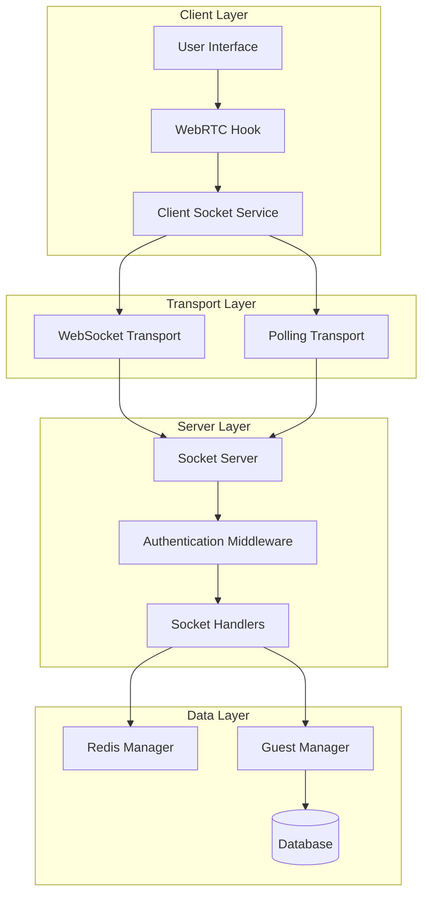
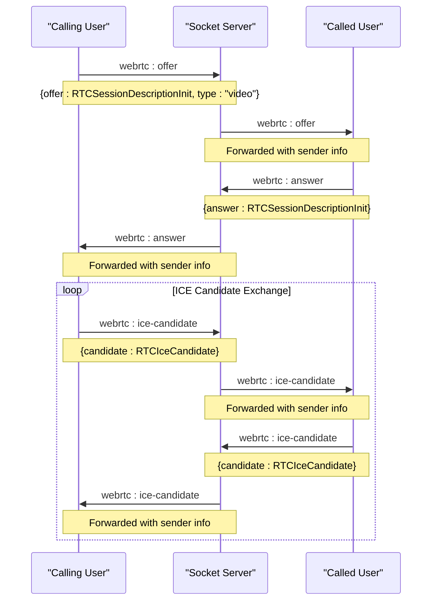
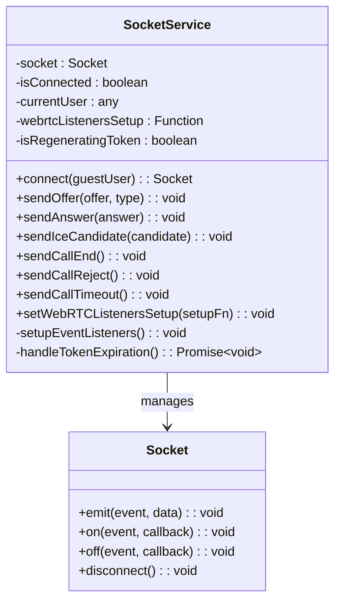
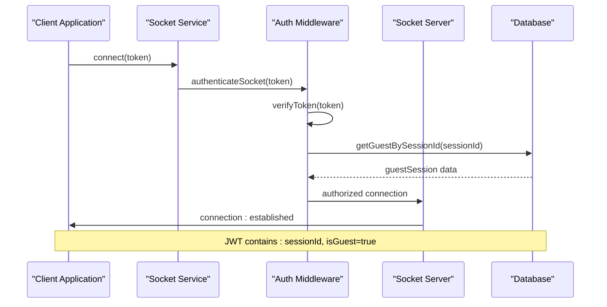
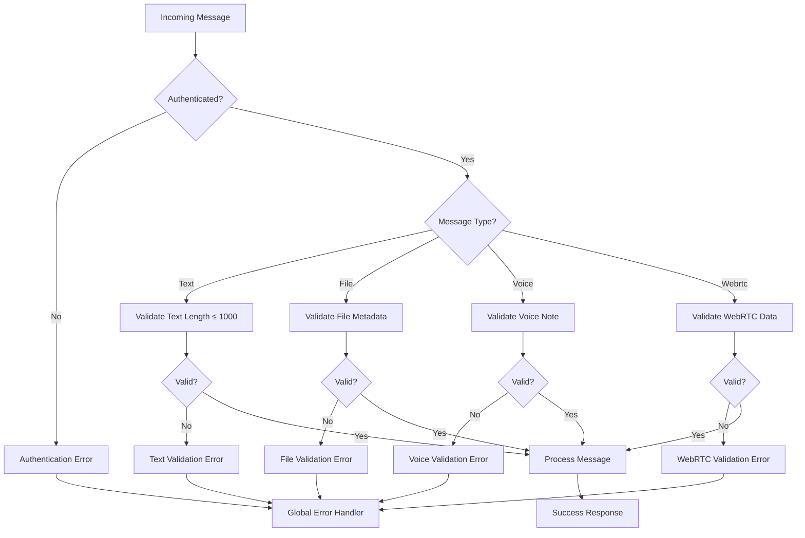
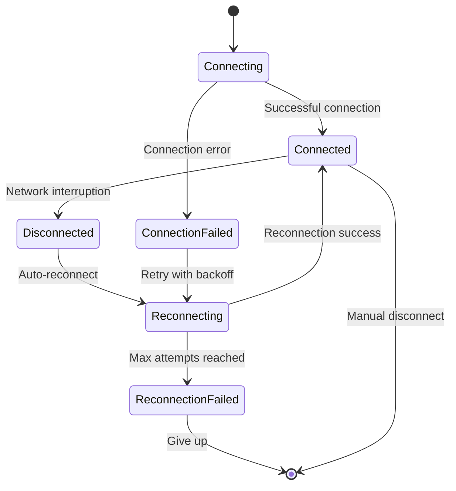
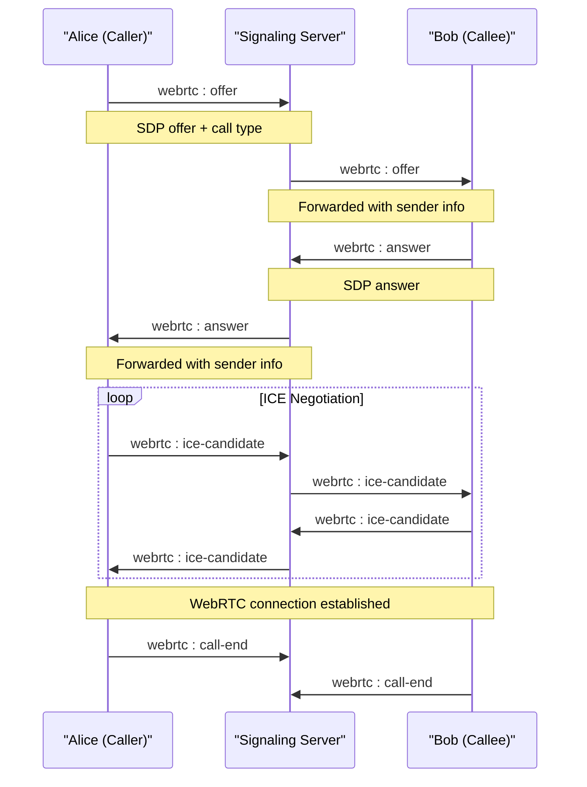
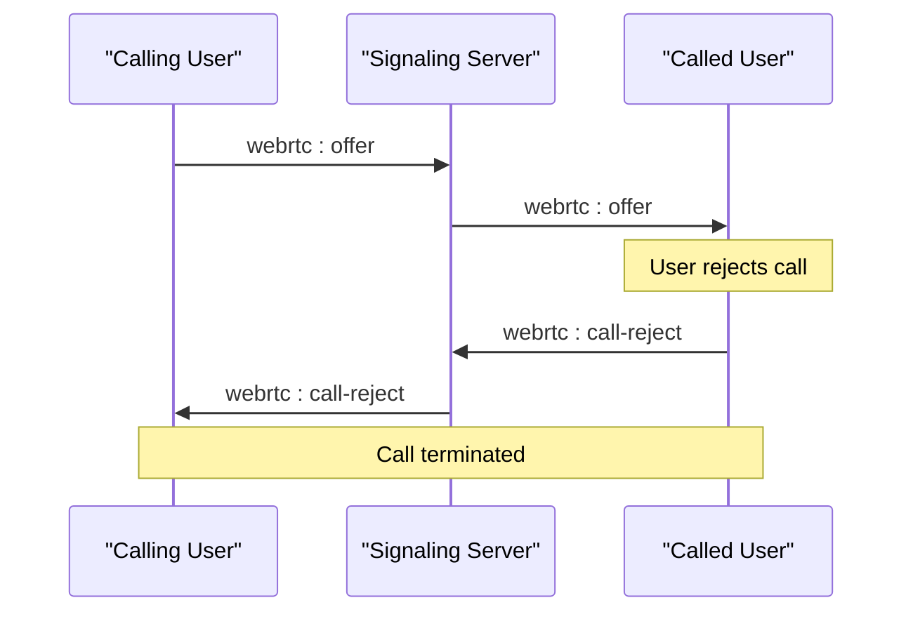
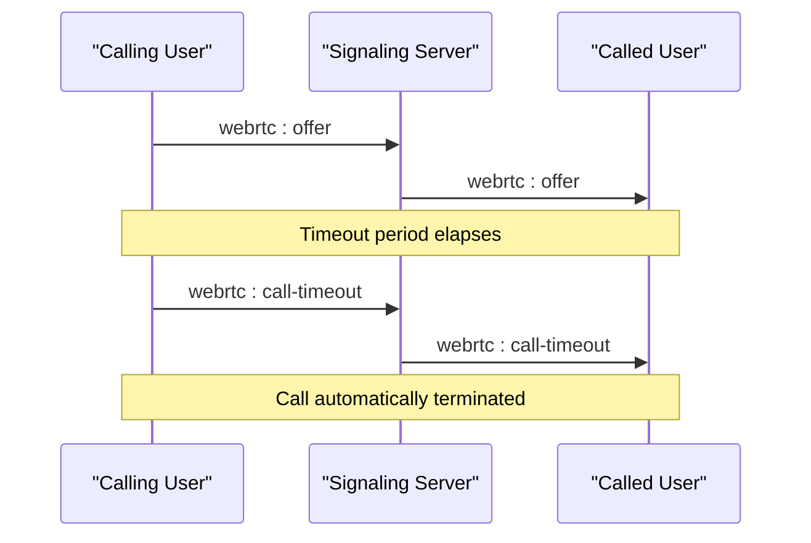

# WebRTC Signaling Protocol

<cite>
**Referenced Files in This Document**
- [web/lib/socket.ts](file://web/lib/socket.ts)
- [backend/src/socket/socketHandlers.js](file://backend/src/socket/socketHandlers.js)
- [backend/src/socket/socketServer.js](file://backend/src/socket/socketServer.js)
- [web/hooks/useWebRTC.ts](file://web/hooks/useWebRTC.ts)
- [backend/src/middleware/auth.js](file://backend/src/middleware/auth.js)
- [backend/src/middleware/validation.js](file://backend/src/middleware/validation.js)
- [backend/src/utils/jwt.js](file://backend/src/utils/jwt.js)
- [backend/test-webrtc.js](file://backend/test-webrtc.js)
</cite>

## Table of Contents
1. [Introduction](#introduction)
2. [WebSocket Architecture](#websocket-architecture)
3. [Signaling Events](#signaling-events)
4. [Socket Service Abstraction](#socket-service-abstraction)
5. [Authentication & Security](#authentication--security)
6. [Error Handling & Validation](#error-handling--validation)
7. [Connection Reliability](#connection-reliability)
8. [Call Flow Sequences](#call-flow-sequences)
9. [Client Implementation Guidelines](#client-implementation-guidelines)
10. [Performance Considerations](#performance-considerations)
11. [Troubleshooting Guide](#troubleshooting-guide)

## Introduction

The Realtime Chat App implements a sophisticated WebRTC Signaling Protocol built on WebSocket technology for establishing peer-to-peer audio and video communications. The protocol facilitates the exchange of SDP offers, answers, and ICE candidates between connected users while maintaining robust connection reliability and security through JWT-based authentication.

The signaling system operates on an event-driven architecture where clients communicate through predefined WebSocket events, enabling real-time coordination of WebRTC peer connections. This protocol supports various call types including audio-only, video calls, and call management operations such as rejection, timeout, and termination.

## WebSocket Architecture

The WebSocket infrastructure is built around Socket.IO with comprehensive authentication, connection management, and event routing capabilities.



**Diagram sources**
- [web/lib/socket.ts](file://web/lib/socket.ts#L1-L50)
- [backend/src/socket/socketServer.js](file://backend/src/socket/socketServer.js#L1-L50)

**Section sources**
- [web/lib/socket.ts](file://web/lib/socket.ts#L1-L100)
- [backend/src/socket/socketServer.js](file://backend/src/socket/socketServer.js#L1-L100)

## Signaling Events

The WebRTC Signaling Protocol defines six primary events for call establishment and management, each serving specific purposes in the communication flow.

### Event Specifications

| Event Name | Direction | Payload Structure | Purpose |
|------------|-----------|-------------------|---------|
| `webrtc:offer` | client→server | `{offer: RTCSessionDescriptionInit, type: string}` | Initiates call with SDP offer and call type ('audio'/'video') |
| `webrtc:answer` | client→server | `{answer: RTCSessionDescriptionInit}` | Responds to offer with SDP answer |
| `webrtc:ice-candidate` | client→server | `{candidate: RTCIceCandidate}` | Exchanges network connectivity information |
| `webrtc:call-end` | client→server | `{}` | Terminates active call |
| `webrtc:call-reject` | client→server | `{}` | Rejects incoming call |
| `webrtc:call-timeout` | client→server | `{}` | Handles call timeout scenarios |

### Event Flow Details

Each event follows a specific pattern for data transmission and processing:



**Diagram sources**
- [backend/src/socket/socketHandlers.js](file://backend/src/socket/socketHandlers.js#L440-L520)
- [web/hooks/useWebRTC.ts](file://web/hooks/useWebRTC.ts#L100-L200)

**Section sources**
- [backend/src/socket/socketHandlers.js](file://backend/src/socket/socketHandlers.js#L440-L650)
- [web/lib/socket.ts](file://web/lib/socket.ts#L200-L250)

## Socket Service Abstraction

The SocketService class in the frontend provides a comprehensive abstraction layer for WebSocket communication, encapsulating connection management, event handling, and WebRTC-specific operations.

### Core Architecture



**Diagram sources**
- [web/lib/socket.ts](file://web/lib/socket.ts#L20-L100)

### Connection Management Features

The SocketService implements sophisticated connection management with automatic reconnection, token expiration handling, and graceful degradation:

- **Automatic Reconnection**: Configured with exponential backoff (1s to 5s delay)
- **Token Refresh**: Automatic guest session regeneration on expiration
- **Connection State Tracking**: Real-time connection status monitoring
- **Listener Persistence**: WebRTC event listeners survive reconnections

**Section sources**
- [web/lib/socket.ts](file://web/lib/socket.ts#L1-L474)

## Authentication & Security

The signaling protocol employs JWT-based authentication specifically designed for guest user sessions, ensuring secure and reliable communication channels.

### Authentication Flow



**Diagram sources**
- [backend/src/middleware/auth.js](file://backend/src/middleware/auth.js#L50-L99)
- [web/lib/socket.ts](file://web/lib/socket.ts#L25-L50)

### Security Measures

The authentication system implements multiple security layers:

| Security Layer | Implementation | Purpose |
|----------------|----------------|---------|
| JWT Verification | HS256 signature validation | Ensures token authenticity |
| Session Validation | Database lookup by sessionId | Validates active guest sessions |
| Guest-only Restriction | Type checking (isGuest) | Limits access to guest accounts only |
| Token Expiration | Built-in JWT expiry | Prevents long-term unauthorized access |
| Rate Limiting | Per-user request throttling | Mitigates abuse and DDoS attacks |

### Token Structure

Guest JWT tokens contain essential session information:
- `sessionId`: Unique identifier for guest session
- `isGuest`: Boolean flag indicating guest account type
- `exp`: Token expiration timestamp
- `iat`: Token issuance timestamp

**Section sources**
- [backend/src/middleware/auth.js](file://backend/src/middleware/auth.js#L1-L100)
- [backend/src/utils/jwt.js](file://backend/src/utils/jwt.js#L1-L52)

## Error Handling & Validation

The signaling protocol implements comprehensive error handling and input validation to ensure reliable operation and protect against malicious activity.

### Validation Strategies



**Diagram sources**
- [backend/src/middleware/validation.js](file://backend/src/middleware/validation.js#L50-L111)
- [backend/src/socket/socketHandlers.js](file://backend/src/socket/socketHandlers.js#L276-L320)

### Error Categories

The system handles multiple error categories with appropriate responses:

| Error Type | Description | Client Response |
|------------|-------------|-----------------|
| Authentication | Invalid or expired JWT token | Automatic session regeneration |
| Authorization | Non-guest user attempting WebRTC | Immediate rejection |
| Validation | Malformed message data | Client-side validation error |
| Network | Connection failures | Automatic reconnection |
| Business Logic | Call state inconsistencies | Graceful degradation |

**Section sources**
- [backend/src/middleware/validation.js](file://backend/src/middleware/validation.js#L1-L112)
- [backend/src/socket/socketHandlers.js](file://backend/src/socket/socketHandlers.js#L276-L320)

## Connection Reliability

The signaling protocol implements multiple layers of reliability to ensure consistent WebRTC call establishment and maintenance.

### Reconnection Strategy



**Diagram sources**
- [web/lib/socket.ts](file://web/lib/socket.ts#L120-L180)

### Reliability Features

The connection reliability system includes:

- **Exponential Backoff**: Reconnection delays increase from 1s to 5s
- **Maximum Attempts**: 10 reconnection attempts before giving up
- **Token Refresh**: Automatic JWT token regeneration on expiration
- **State Preservation**: WebRTC event listeners persist across reconnections
- **Network Detection**: Automatic reconnection on network restoration

**Section sources**
- [web/lib/socket.ts](file://web/lib/socket.ts#L120-L200)

## Call Flow Sequences

### Successful Call Establishment



**Diagram sources**
- [web/hooks/useWebRTC.ts](file://web/hooks/useWebRTC.ts#L200-L400)
- [backend/src/socket/socketHandlers.js](file://backend/src/socket/socketHandlers.js#L440-L650)

### Call Rejection Flow



**Diagram sources**
- [backend/src/socket/socketHandlers.js](file://backend/src/socket/socketHandlers.js#L618-L648)

### Call Timeout Flow



**Diagram sources**
- [backend/src/socket/socketHandlers.js](file://backend/src/socket/socketHandlers.js#L648-L678)

**Section sources**
- [web/hooks/useWebRTC.ts](file://web/hooks/useWebRTC.ts#L800-L1000)
- [backend/src/socket/socketHandlers.js](file://backend/src/socket/socketHandlers.js#L588-L678)

## Client Implementation Guidelines

### WebRTC Hook Integration

The useWebRTC hook provides a comprehensive interface for managing WebRTC connections with proper state management and error handling.

#### Key Implementation Patterns

1. **Event Listener Registration**: Register WebRTC event handlers once during component mount
2. **State Synchronization**: Use refs to maintain latest state across async operations
3. **Resource Cleanup**: Implement comprehensive cleanup on call termination
4. **Error Recovery**: Handle WebRTC errors gracefully with user feedback

#### Best Practices

- **Initialize Peer Connection**: Create RTCPeerConnection with STUN/TURN servers
- **Manage Media Streams**: Properly handle local and remote media streams
- **Handle ICE Candidates**: Queue and process ICE candidates efficiently
- **Monitor Connection States**: Track ICE and peer connection states
- **Implement Call Timers**: Track call duration for logging and analytics

**Section sources**
- [web/hooks/useWebRTC.ts](file://web/hooks/useWebRTC.ts#L1-L200)
- [web/hooks/useWebRTC.ts](file://web/hooks/useWebRTC.ts#L800-L1085)

### Socket Service Usage

#### Connection Management

```typescript
// Initialize socket service
const socketService = new SocketService();

// Connect with authentication
socketService.connect(guestUser);

// Register WebRTC event listeners
socketService.setWebRTCListenersSetup(() => {
  socketService.on("webrtc:offer", handleReceiveOffer);
  socketService.on("webrtc:answer", handleReceiveAnswer);
  socketService.on("webrtc:ice-candidate", handleReceiveIceCandidate);
  socketService.on("webrtc:call-end", handleReceiveCallEnd);
  socketService.on("webrtc:call-reject", handleReceiveCallReject);
  socketService.on("webrtc:call-timeout", handleReceiveCallTimeout);
});
```

#### Asynchronous Event Handling

The client must handle asynchronous events properly:

- **Promise-based Operations**: Use async/await for WebRTC operations
- **State Consistency**: Maintain consistent state across async operations
- **Error Propagation**: Handle errors at appropriate levels
- **Resource Management**: Ensure proper cleanup of WebRTC resources

**Section sources**
- [web/lib/socket.ts](file://web/lib/socket.ts#L400-L474)

## Performance Considerations

### Message Batching

While the current implementation sends individual messages for each WebRTC event, several optimization opportunities exist:

- **ICE Candidate Aggregation**: Batch multiple ICE candidates before sending
- **Connection State Updates**: Group related state changes
- **Error Reporting**: Aggregate error logs for better performance

### Connection Optimization

The system implements several performance optimizations:

- **Transport Selection**: Prefers WebSocket over polling when available
- **Connection Pooling**: Maintains persistent connections
- **Bandwidth Monitoring**: Adapts to network conditions
- **Resource Cleanup**: Efficient cleanup of WebRTC resources

### Scalability Features

- **Redis Adapter**: Supports horizontal scaling with Redis clustering
- **Load Balancing**: Distributes connections across multiple instances
- **Rate Limiting**: Prevents abuse and ensures fair resource allocation
- **Memory Management**: Efficient handling of large numbers of concurrent connections

**Section sources**
- [backend/src/socket/socketServer.js](file://backend/src/socket/socketServer.js#L20-L80)

## Troubleshooting Guide

### Common Issues and Solutions

#### Connection Problems

**Issue**: Socket fails to connect
- **Cause**: Invalid JWT token or expired session
- **Solution**: Check token validity and regenerate session if needed
- **Code Reference**: [web/lib/socket.ts](file://web/lib/socket.ts#L150-L200)

**Issue**: Frequent reconnections
- **Cause**: Network instability or server overload
- **Solution**: Check network connectivity and server logs
- **Code Reference**: [web/lib/socket.ts](file://web/lib/socket.ts#L120-L180)

#### WebRTC Signaling Issues

**Issue**: Calls get stuck in "connecting" state
- **Cause**: ICE negotiation failures or firewall restrictions
- **Solution**: Check STUN/TURN server accessibility and firewall rules
- **Code Reference**: [backend/test-webrtc.js](file://backend/test-webrtc.js#L1-L100)

**Issue**: ICE candidates not exchanged
- **Cause**: Network topology or NAT traversal issues
- **Solution**: Verify TURN server configuration and network routing
- **Code Reference**: [web/hooks/useWebRTC.ts](file://web/hooks/useWebRTC.ts#L200-L300)

#### Authentication Problems

**Issue**: Token expiration errors
- **Cause**: JWT token has expired
- **Solution**: Automatic token regeneration handles this scenario
- **Code Reference**: [web/lib/socket.ts](file://web/lib/socket.ts#L350-L450)

**Issue**: Session not found errors
- **Cause**: Guest session expired or invalid
- **Solution**: Create new guest session and reconnect
- **Code Reference**: [backend/src/middleware/auth.js](file://backend/src/middleware/auth.js#L70-L90)

### Diagnostic Tools

The system includes several diagnostic capabilities:

- **Connection Status Debug**: Real-time connection monitoring
- **WebRTC Test Script**: Automated signaling testing
- **Error Logging**: Comprehensive error tracking and reporting
- **Performance Metrics**: Connection and message timing data

**Section sources**
- [backend/test-webrtc.js](file://backend/test-webrtc.js#L1-L200)
- [web/components/ConnectionStatusDebug.tsx](file://web/components/ConnectionStatusDebug.tsx#L1-L50)